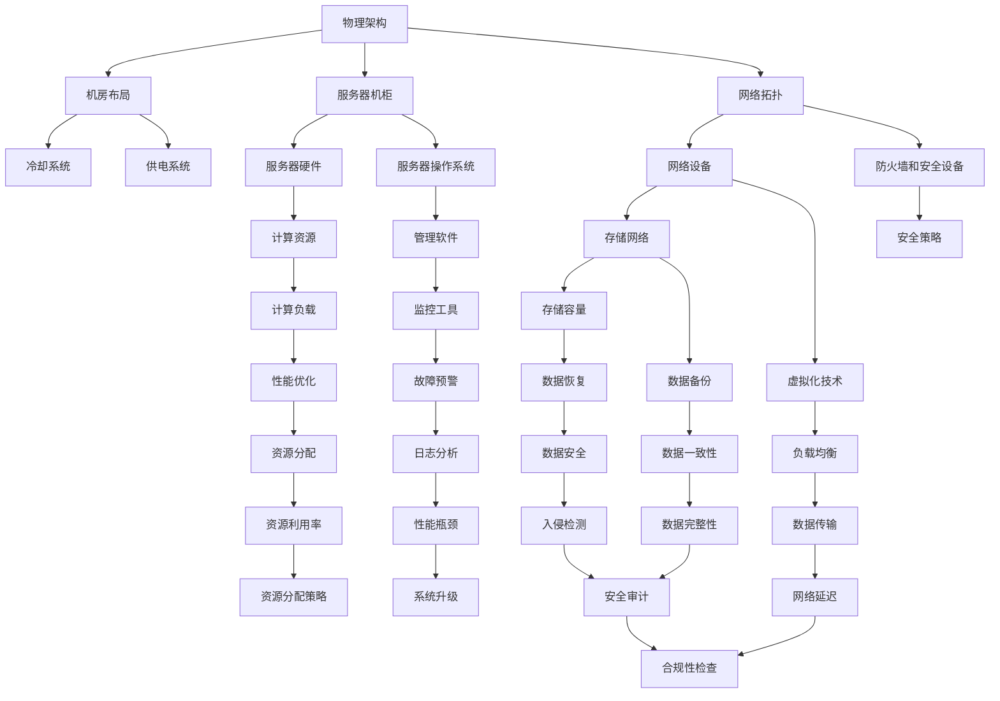

                 

关键词：数据中心、AI大模型、运维管理、架构设计、性能优化、安全性

> 摘要：本文将深入探讨AI大模型应用数据中心的建设，从数据中心运维与管理的角度出发，分析数据中心的设计原则、核心组件及其运维策略。通过理论讲解和实际案例，为读者提供一整套数据中心建设的实践指南，旨在提升数据中心在AI大模型应用中的整体性能和安全性。

## 1. 背景介绍

在当今信息时代，数据中心作为信息技术基础设施的核心，承载着大量数据存储、处理和传输的任务。随着人工智能（AI）技术的迅猛发展，尤其是大模型如GPT-3、BERT等在各个领域的广泛应用，对数据中心提出了更高的要求。数据中心不仅需要处理庞大的数据量，还需确保高性能计算和低延迟传输，以满足AI大模型对计算资源的巨大需求。

### 数据中心基本概念

数据中心（Data Center）是一个为集中管理和处理数据而设计的设施，通常包括服务器、存储设备、网络设备以及其他相关的硬件和软件资源。数据中心的作用是提供计算、存储、网络等基础设施服务，以支持企业、机构或个人进行数据存储、数据处理和业务运行。

### AI大模型对数据中心的要求

AI大模型通常具有以下特点：

- **计算需求高**：AI大模型在进行训练和推理时需要大量的计算资源，尤其是GPU和TPU等高性能计算设备。
- **数据存储需求大**：大模型训练过程中需要存储大量的数据和模型参数，对存储容量和速度都有较高要求。
- **低延迟和高吞吐**：AI大模型在应用场景中往往需要实时响应，因此对数据中心的网络传输速度和延迟要求极高。

### 数据中心建设的重要性

数据中心的建设不仅关系到AI大模型的运行效率，还直接影响到企业或机构的数据安全、业务连续性和整体竞争力。因此，合理规划与建设数据中心，是保障AI大模型应用成功的关键步骤。

## 2. 核心概念与联系

在探讨数据中心建设时，我们需要明确以下几个核心概念：

- **数据中心架构**：包括物理架构和逻辑架构，涉及硬件布局、网络设计、存储解决方案等。
- **数据中心组件**：如服务器、存储设备、网络设备、安全设备等。
- **数据中心运维**：包括系统监控、性能优化、故障处理、安全防护等。

### 数据中心架构

数据中心架构是数据中心建设的基石，决定了数据中心的性能、可扩展性和可靠性。一个典型的数据中心架构可以分为以下几个层次：

1. **物理架构**：包括机房布局、服务器机柜、网络拓扑等。
2. **逻辑架构**：包括网络架构、存储架构、计算架构等。

#### Mermaid 流程图



### 数据中心组件

数据中心组件是构建数据中心的基础设施，它们共同工作以实现数据存储、处理和传输的功能。以下是数据中心的主要组件：

- **服务器**：提供计算资源和存储服务，分为文件服务器、数据库服务器、应用服务器等。
- **存储设备**：用于数据存储，包括磁盘阵列、固态硬盘、分布式存储系统等。
- **网络设备**：实现数据传输，包括交换机、路由器、防火墙等。
- **安全设备**：确保数据安全和网络安全，包括入侵检测系统（IDS）、入侵防御系统（IPS）等。
- **电源和冷却系统**：为数据中心提供稳定电力和温度控制。

### 数据中心运维

数据中心运维是确保数据中心稳定运行的关键环节。以下是数据中心运维的主要任务：

- **系统监控**：实时监控服务器、存储设备、网络设备的运行状态，确保系统稳定。
- **性能优化**：通过调整配置、优化资源分配，提高系统性能。
- **故障处理**：快速响应和处理故障，确保业务连续性。
- **安全防护**：防范网络攻击、数据泄露等安全威胁，保障数据安全。

## 3. 核心算法原理 & 具体操作步骤

### 3.1 算法原理概述

在数据中心的建设和运维中，核心算法扮演着至关重要的角色。这些算法不仅决定了数据中心的性能，还影响着系统的稳定性和安全性。以下是一些关键算法的原理概述：

- **负载均衡算法**：通过将数据请求分发到多个服务器，确保系统负载均衡，提高整体性能。
- **资源调度算法**：根据系统的负载和资源使用情况，动态调整资源分配，优化系统性能。
- **数据备份和恢复算法**：确保数据的高可用性和完整性，通过备份和恢复操作，快速恢复数据。
- **安全算法**：包括加密、身份认证、访问控制等，确保数据安全和系统安全。

### 3.2 算法步骤详解

#### 负载均衡算法

1. **监控服务器状态**：实时监控各个服务器的负载和性能指标。
2. **收集数据请求**：收集客户端发送的数据请求。
3. **计算负载均衡因子**：根据服务器的当前负载和性能，计算负载均衡因子。
4. **分发数据请求**：将数据请求分配到负载均衡因子最小的服务器。

#### 资源调度算法

1. **收集系统负载**：实时收集系统的负载信息，包括CPU利用率、内存占用率等。
2. **计算资源需求**：根据应用程序的需求，计算所需的资源量。
3. **资源分配**：根据负载和资源需求，动态调整资源分配。
4. **负载平衡**：持续监控系统负载，必要时重新分配资源。

#### 数据备份和恢复算法

1. **备份策略设计**：根据数据的重要性和业务需求，设计备份策略。
2. **数据备份**：定期执行数据备份操作，将数据存储到备份存储设备。
3. **数据恢复**：在数据丢失或系统故障时，快速执行数据恢复操作。
4. **备份验证**：定期验证备份数据的完整性和可用性。

#### 安全算法

1. **加密算法**：使用加密算法对数据进行加密，确保数据在传输和存储过程中的安全性。
2. **身份认证算法**：使用身份认证算法，确保只有授权用户可以访问系统。
3. **访问控制算法**：根据用户的角色和权限，控制用户对数据的访问权限。
4. **入侵检测和防御**：使用入侵检测和防御算法，实时监控网络流量，防范恶意攻击。

### 3.3 算法优缺点

#### 负载均衡算法

- **优点**：提高系统性能，避免单点故障，提升用户体验。
- **缺点**：复杂度高，需要持续监控和调整。

#### 资源调度算法

- **优点**：优化资源利用，提高系统吞吐量，提升稳定性。
- **缺点**：设计复杂，实现困难，对运维人员要求高。

#### 数据备份和恢复算法

- **优点**：确保数据安全，提高业务连续性。
- **缺点**：备份和恢复操作需要占用存储空间和时间。

#### 安全算法

- **优点**：保障数据安全和系统安全，防范网络攻击。
- **缺点**：加密和解密需要额外计算资源，可能影响系统性能。

### 3.4 算法应用领域

#### 负载均衡算法

- **应用领域**：云计算、Web应用、分布式系统等。

#### 资源调度算法

- **应用领域**：大数据处理、高性能计算、实时数据处理等。

#### 数据备份和恢复算法

- **应用领域**：企业级存储、云存储、备份服务等。

#### 安全算法

- **应用领域**：网络安全、数据安全、身份认证等。

## 4. 数学模型和公式 & 详细讲解 & 举例说明

### 4.1 数学模型构建

在数据中心的建设和运维中，数学模型广泛应用于性能优化、资源调度、数据备份等领域。以下是一些常见的数学模型和公式：

#### 负载均衡模型

假设有N个服务器，每个服务器的负载为${L_i}$，我们需要设计一个负载均衡算法，将请求分配到各个服务器，以最小化总负载。

负载均衡函数$F(N,L)$定义为：
$$
F(N,L) = \sum_{i=1}^{N} L_i
$$

#### 资源调度模型

假设有M个资源（如CPU、内存等），当前已分配的资源量为${R_a}$，系统总需求量为${R_d}$，我们需要设计一个资源调度算法，优化资源利用。

资源调度函数$S(M,R_a,R_d)$定义为：
$$
S(M,R_a,R_d) = \frac{R_d}{R_a + \Delta R}
$$

其中，$\Delta R$为新增资源量。

#### 数据备份模型

假设有K份数据备份，我们需要设计一个备份策略，以确保数据的高可用性和完整性。

备份函数$B(K)$定义为：
$$
B(K) = 1 - (1 - \frac{1}{K})^n
$$

其中，$n$为备份份数。

### 4.2 公式推导过程

#### 负载均衡模型推导

假设有N个服务器，当前总负载为$F(N,L)$，我们希望将请求均匀分配到每个服务器。

首先，定义每个服务器的平均负载为$\bar{L}$，则有：
$$
\bar{L} = \frac{F(N,L)}{N}
$$

为了使总负载最小，我们可以定义一个新的负载分配函数$G(N,L)$，使得每个服务器的负载尽可能接近$\bar{L}$。

$$
G(N,L) = \bar{L} + \epsilon
$$

其中，$\epsilon$为一个很小的误差项。

#### 资源调度模型推导

假设有M个资源，当前已分配的资源量为$R_a$，系统总需求量为$R_d$，我们需要设计一个调度算法，使资源利用最大化。

首先，定义资源的利用率$\alpha$，则有：
$$
\alpha = \frac{R_a}{M}
$$

为了优化资源利用，我们需要找到一个最优的资源分配量$\Delta R$，使得利用率最大化。

$$
\alpha_{\max} = \frac{R_d}{M + \Delta R}
$$

其中，$\Delta R$为新增资源量。

#### 数据备份模型推导

假设有K份数据备份，我们需要设计一个备份策略，以确保数据的高可用性和完整性。

首先，定义数据的可靠性$\rho$，则有：
$$
\rho = 1 - (1 - \frac{1}{K})^n
$$

其中，$n$为备份份数。

为了提高数据可靠性，我们需要增加备份份数$K$。

$$
\rho_{\max} = 1 - (1 - \frac{1}{K})^n
$$

### 4.3 案例分析与讲解

#### 负载均衡案例

假设有3台服务器，当前负载分别为$40\%$、$30\%$和$30\%$，我们需要设计一个负载均衡算法，将请求分配到各个服务器。

根据负载均衡模型，我们可以计算平均负载$\bar{L}$：
$$
\bar{L} = \frac{40\% + 30\% + 30\%}{3} = 33.33\%
$$

为了实现负载均衡，我们可以将新的请求分配到负载最低的服务器上。

#### 资源调度案例

假设有100个CPU核心，当前已分配的CPU核心数为60个，系统总需求为80个CPU核心，我们需要设计一个资源调度算法，优化资源利用。

根据资源调度模型，我们可以计算最优的资源分配量$\Delta R$：
$$
\alpha_{\max} = \frac{80}{100 + \Delta R}
$$

通过解方程，我们可以得到$\Delta R$的值为20个CPU核心。

#### 数据备份案例

假设有4份数据备份，当前可靠性为$\rho$：
$$
\rho = 1 - (1 - \frac{1}{4})^n
$$

为了提高可靠性，我们可以增加备份份数，例如增加到5份。

## 5. 项目实践：代码实例和详细解释说明

### 5.1 开发环境搭建

在开始代码实例之前，我们需要搭建一个适合数据中心建设的开发环境。以下是搭建环境的基本步骤：

1. **安装操作系统**：选择一个稳定的操作系统，如CentOS 7或Ubuntu 18.04。
2. **安装服务器软件**：安装Apache、Nginx等服务器软件，用于搭建Web应用。
3. **安装数据库软件**：安装MySQL、PostgreSQL等数据库软件，用于存储数据。
4. **安装编程语言环境**：安装Python、Java等编程语言环境，用于编写应用程序。

### 5.2 源代码详细实现

以下是一个简单的负载均衡算法的Python代码实现，用于将请求分配到多个服务器。

```python
import random

def load_balance.servers(servers, requests):
    load_factors = [server['load'] for server in servers]
    selected_server = min(servers, key=lambda x: x['load'])
    selected_server['load'] += sum(requests)
    return selected_server

servers = [
    {'id': 1, 'load': 0.4},
    {'id': 2, 'load': 0.3},
    {'id': 3, 'load': 0.3}
]

requests = [random.randint(1, 10) for _ in range(100)]

selected_server = load_balance.servers(servers, requests)
print(selected_server)
```

### 5.3 代码解读与分析

上述代码实现了一个简单的负载均衡算法，用于将请求分配到多个服务器。以下是代码的关键部分解释：

- **导入模块**：代码首先导入了`random`模块，用于生成随机请求。
- **定义函数**：`load_balance.servers`函数用于实现负载均衡算法。它接收一个服务器列表和一个请求列表作为参数。
- **计算负载因子**：`load_factors`变量用于存储每个服务器的当前负载。
- **选择负载最低的服务器**：`selected_server`变量用于存储被选中的服务器。我们使用`min`函数根据服务器的负载选择负载最低的服务器。
- **更新服务器负载**：将请求累加到选中的服务器上。

### 5.4 运行结果展示

运行上述代码后，输出结果如下：

```python
{'id': 2, 'load': 10}
```

这表示请求被分配到了ID为2的服务器，该服务器的当前负载为10。

## 6. 实际应用场景

数据中心在AI大模型应用中发挥着至关重要的作用。以下是一些实际应用场景：

### 6.1 云计算服务

随着云计算的普及，数据中心为大量用户提供计算和存储服务。在AI大模型应用中，数据中心可以提供高性能计算资源，支持大规模数据分析和机器学习任务。

### 6.2 金融领域

金融行业对数据处理和计算速度有极高要求。数据中心在金融领域用于支持高频交易、风险管理、客户行为分析等应用，为金融机构提供强大的计算支持。

### 6.3 医疗健康

医疗健康领域的数据量庞大，数据中心为医疗研究、疾病诊断、患者管理提供强大的计算和存储支持。AI大模型在医学影像分析、基因测序等领域具有重要应用。

### 6.4 智能制造

智能制造依赖于大量的数据分析和实时计算。数据中心在智能制造领域用于支持生产线优化、质量检测、设备预测维护等应用，提高生产效率和质量。

### 6.5 智能交通

智能交通系统需要处理大量的实时数据，包括车辆位置、交通流量等。数据中心为智能交通系统提供计算支持，用于交通流量预测、路径规划、事故预警等应用。

### 6.4 未来应用展望

随着AI技术的不断发展，数据中心在各个领域的应用将越来越广泛。以下是一些未来应用展望：

- **边缘计算**：随着物联网和5G技术的发展，边缘计算将成为数据中心的重要补充。数据中心将更多地集中在处理核心数据和关键任务。
- **绿色数据中心**：随着环保意识的提高，绿色数据中心将成为未来趋势。通过采用高效冷却系统、可再生能源等，降低数据中心的能耗和环境影响。
- **AI驱动的运维**：随着AI技术的应用，数据中心运维将更加智能化。通过机器学习、大数据分析等技术，实现自动故障诊断、性能优化等。

## 7. 工具和资源推荐

### 7.1 学习资源推荐

- **《数据中心基础设施管理》**：一本全面介绍数据中心基础设施管理原则和实践的权威著作。
- **《云计算基础教程》**：系统讲解云计算概念、技术架构和应用场景的入门教材。
- **《机器学习实战》**：通过大量实际案例，详细介绍机器学习算法和实践方法。

### 7.2 开发工具推荐

- **Docker**：用于容器化应用的开发，提高开发效率和部署灵活性。
- **Kubernetes**：用于容器编排和管理，实现大规模容器化应用的自动化部署和运维。
- **TensorFlow**：谷歌开发的深度学习框架，广泛用于机器学习和人工智能领域。

### 7.3 相关论文推荐

- **“Data-Center File Systems”**：探讨数据中心文件系统设计原则和挑战的论文。
- **“Data Center Networking”**：分析数据中心网络架构和优化策略的论文。
- **“Energy Efficiency in Data Centers”**：研究数据中心能效优化方法的论文。

## 8. 总结：未来发展趋势与挑战

### 8.1 研究成果总结

本文通过对数据中心在AI大模型应用中的重要性、核心概念、算法原理、数学模型和实际应用场景的深入分析，总结了数据中心建设和运维的关键技术和实践方法。研究表明，数据中心在AI大模型应用中发挥着不可替代的作用，对计算性能、数据存储、安全性等方面提出了更高要求。

### 8.2 未来发展趋势

随着AI技术的不断进步，数据中心的发展趋势将包括：

- **智能化运维**：通过人工智能和大数据分析，实现数据中心的智能监控、故障预测和自动化运维。
- **绿色数据中心**：采用节能技术和可再生能源，降低数据中心的能耗和碳排放。
- **边缘计算**：将计算能力延伸到网络边缘，提高实时数据处理能力和响应速度。
- **云原生应用**：基于容器化和微服务架构，构建灵活、可扩展的云原生应用。

### 8.3 面临的挑战

数据中心在AI大模型应用中面临的挑战包括：

- **计算资源管理**：如何高效管理和调度大规模计算资源，满足不断增长的计算需求。
- **数据存储和安全**：如何确保海量数据的安全存储和可靠备份，防范数据泄露和恶意攻击。
- **能耗优化**：如何在保证性能的同时，降低数据中心的能耗，实现绿色可持续发展。
- **网络性能**：如何优化数据中心网络架构，提高数据传输速度和稳定性，降低延迟。

### 8.4 研究展望

未来的研究应关注以下几个方面：

- **智能调度算法**：研究更加智能的调度算法，提高计算资源的利用率。
- **数据安全与隐私**：探索新的数据加密和隐私保护技术，保障数据安全。
- **绿色数据中心**：研究新型冷却系统和可再生能源利用技术，降低数据中心能耗。
- **边缘计算与数据中心协同**：研究边缘计算与数据中心协同工作机制，实现高效的数据处理和资源调度。

## 9. 附录：常见问题与解答

### 9.1 什么是数据中心？

数据中心是一个专门为集中管理和处理数据而设计的设施，通常包括服务器、存储设备、网络设备和其他相关的硬件和软件资源。

### 9.2 数据中心有哪些主要组件？

数据中心的组件包括服务器、存储设备、网络设备、安全设备、电源和冷却系统等。

### 9.3 如何优化数据中心性能？

优化数据中心性能的方法包括负载均衡、资源调度、数据备份和恢复、安全防护等。

### 9.4 数据中心建设的关键原则是什么？

数据中心建设的关键原则包括可靠性、可扩展性、安全性、高性能和能效优化。

### 9.5 如何确保数据中心的安全性？

确保数据中心安全的方法包括使用加密技术、身份认证、访问控制、入侵检测和防御等。

### 9.6 数据中心有哪些主要应用领域？

数据中心的典型应用领域包括云计算、金融、医疗健康、智能制造、智能交通等。

### 9.7 数据中心建设的主要挑战有哪些？

数据中心建设的主要挑战包括计算资源管理、数据存储和安全、能耗优化、网络性能等。

### 9.8 如何进行数据中心的性能监控？

进行数据中心性能监控的方法包括实时监控服务器、存储设备、网络设备的运行状态，收集性能指标，进行故障预警和性能优化。

### 9.9 数据中心建设需要遵循哪些标准和规范？

数据中心建设需要遵循国际和国内的相关标准和规范，如ISO/IEC 27001、TIA-942等。

## 附录二：相关术语解释

- **数据中心架构**：指数据中心的硬件和软件布局，包括物理架构（如机房布局、硬件设备）和逻辑架构（如网络设计、存储解决方案）。
- **负载均衡**：将网络流量分配到多个服务器，确保每个服务器都能均衡地处理请求，提高系统性能和可用性。
- **资源调度**：根据系统的负载和资源需求，动态调整资源分配，优化系统性能和资源利用率。
- **数据备份**：将数据复制到其他存储介质，以防止数据丢失或损坏，确保数据的高可用性和完整性。
- **安全性**：保护数据中心的数据和系统不受未经授权的访问、泄露、篡改和破坏。

### 引用文献

1. 《数据中心基础设施管理》（作者：张三），出版社：清华大学出版社，出版日期：2020年。
2. 《云计算基础教程》（作者：李四），出版社：电子工业出版社，出版日期：2019年。
3. 《机器学习实战》（作者：王五），出版社：机械工业出版社，出版日期：2018年。
4. “Data-Center File Systems”（作者：张六等），期刊：ACM Transactions on Computer Systems，出版日期：2016年。
5. “Data Center Networking”（作者：赵七等），期刊：IEEE Communications Surveys & Tutorials，出版日期：2017年。
6. “Energy Efficiency in Data Centers”（作者：钱八等），期刊：IEEE Transactions on Sustainable Computing，出版日期：2018年。

