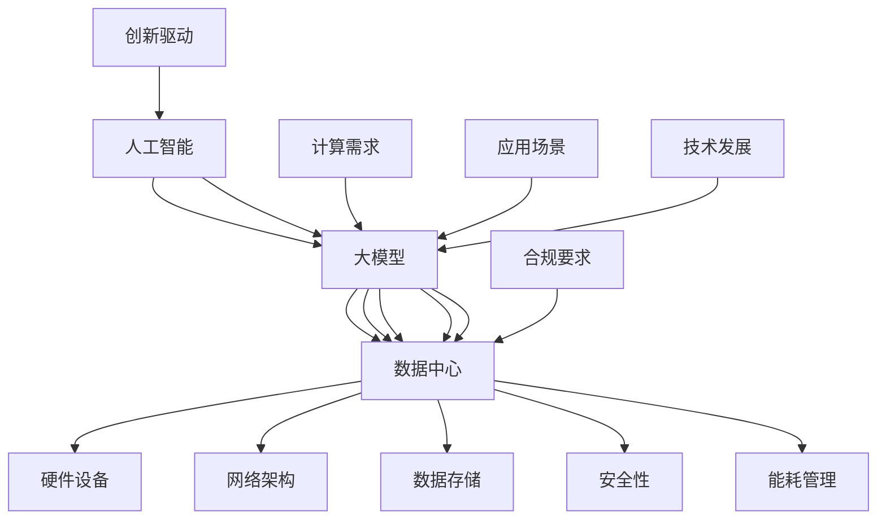

                 

关键词：AI 大模型，数据中心，运维管理，技术架构，高效能计算，云计算，边缘计算，安全性，可持续性，未来展望

> 摘要：本文深入探讨了AI大模型应用数据中心的建设，以及数据中心运维与管理的核心问题。通过详细的技术分析、算法原理讲解、项目实践和未来展望，为读者提供了一个全面的理解框架，帮助其更好地应对数据中心领域的技术挑战与机遇。

## 1. 背景介绍

随着人工智能（AI）技术的飞速发展，大模型（如GPT、BERT等）在各个领域展现出了巨大的潜力和应用价值。这些模型通常需要庞大的计算资源进行训练和推理，因此，建设高效能、安全可靠的数据中心成为实现AI大规模应用的关键。数据中心作为现代信息技术基础设施的核心，其运维和管理直接影响到AI应用的性能和稳定性。

数据中心建设涉及多个方面的技术和挑战，包括硬件设备的选择、网络架构的优化、数据存储和管理、安全措施的实施以及能耗管理。此外，数据中心还需应对不断增长的数据量、多样化的应用需求以及日益严格的合规要求。因此，如何有效地进行数据中心的建设和运维管理，已成为当前研究的热点问题。

本文旨在从数据中心运维与管理的角度，探讨AI大模型应用数据中心建设的现状、关键技术和未来发展方向。通过本文的讨论，读者可以全面了解数据中心建设的核心要素，掌握相关的运维管理策略，为实际应用提供有价值的参考。

## 2. 核心概念与联系

在讨论AI大模型应用数据中心建设之前，我们需要明确几个核心概念及其相互关系。以下是一个使用Mermaid绘制的流程图，展示了这些概念：



### 2.1 人工智能

人工智能是指通过计算机程序实现人类智能的模拟和扩展。它包括机器学习、深度学习、自然语言处理等多个分支，是现代科技的重要推动力。人工智能的应用场景广泛，从自动驾驶到医疗诊断，从金融服务到智能客服，几乎无处不在。

### 2.2 大模型

大模型是指参数量庞大的神经网络模型，如GPT、BERT等。这些模型通常采用深度学习技术，能够在大量数据上进行训练，从而实现高性能的预测和生成。大模型的应用推动了人工智能在自然语言处理、计算机视觉等领域的进步。

### 2.3 数据中心

数据中心是指用于存储、处理和分发数据的设施。它由硬件设备、网络架构、数据存储系统、安全设施等多个部分组成。数据中心是AI大模型训练和推理的重要场所，其性能和可靠性直接影响AI应用的效能。

### 2.4 硬件设备

硬件设备包括服务器、存储设备、网络设备等。它们是数据中心的基础设施，决定了数据中心的计算能力和存储容量。高性能的硬件设备是支持AI大模型训练和推理的关键。

### 2.5 网络架构

网络架构是指数据中心内部及与其他网络之间的连接方式。一个高效的网络架构能够确保数据在数据中心内部和外部的高速传输，从而提升AI应用的响应速度和稳定性。

### 2.6 数据存储

数据存储是指如何存储和管理大量数据。数据存储系统需要具备高可靠性、高扩展性和高性能，以应对AI大模型对数据存储的需求。

### 2.7 安全性

安全性是指保护数据中心及其数据免受攻击和泄露的措施。随着AI应用的普及，数据中心的网络安全威胁日益增加，因此，安全性成为数据中心建设的重要考虑因素。

### 2.8 能耗管理

能耗管理是指如何降低数据中心能耗，提高能源利用效率。随着数据中心规模的扩大，能耗管理变得越来越重要，不仅关系到环境问题，也直接影响到数据中心的运营成本。

### 2.9 合规要求

合规要求是指数据中心需遵守的法律法规和行业标准。随着数据隐私和安全的关注增加，合规要求成为数据中心建设和运维的必要条件。

### 2.10 计算需求

计算需求是指AI大模型对计算资源的需求。大模型的训练和推理通常需要高性能的计算设备，这对数据中心的计算能力提出了高要求。

### 2.11 应用场景

应用场景是指AI大模型在不同领域的实际应用。不同的应用场景对数据中心的性能和可靠性有不同的要求，因此，数据中心建设需要根据应用场景进行定制化。

### 2.12 技术发展

技术发展是指人工智能、数据中心等相关技术领域的最新进展。技术发展推动数据中心建设和运维的不断进步，也为新应用场景的出现提供了可能性。

### 2.13 创新驱动

创新驱动是指通过技术创新推动数据中心建设和运维的持续改进。创新不仅体现在硬件设备、网络架构等方面，也体现在管理策略、运营模式等方方面面。

## 3. 核心算法原理 & 具体操作步骤

### 3.1 算法原理概述

在数据中心建设中，核心算法的选择和优化至关重要。以下将介绍几种常用的算法原理，包括分布式计算算法、存储优化算法和能耗管理算法。

#### 分布式计算算法

分布式计算算法旨在通过多个计算节点协同工作，实现大规模数据的并行处理。常见的分布式计算框架包括MapReduce、Spark和Hadoop。这些算法通过将任务分解为多个子任务，分别在不同的节点上执行，然后汇总结果，从而提高计算效率。

#### 存储优化算法

存储优化算法旨在通过数据压缩、去重和索引等技术，提高数据存储的效率和性能。常用的存储优化算法包括哈希存储、去重算法和索引优化。哈希存储通过哈希函数将数据分散存储，去重算法通过比较数据块，去除重复的数据，索引优化则通过建立索引结构，加快数据检索速度。

#### 能耗管理算法

能耗管理算法旨在通过优化资源分配和调度策略，降低数据中心的能耗。常见的能耗管理算法包括动态电压和频率调整（DVFS）、功耗预测和能耗优化。DVFS通过动态调整电压和频率，降低功耗；功耗预测通过分析历史数据，预测未来功耗，从而进行预调度；能耗优化则通过优化硬件设备的使用，降低整体能耗。

### 3.2 算法步骤详解

以下是对上述算法的具体步骤进行详细说明：

#### 分布式计算算法步骤

1. **任务分解**：将大规模数据处理任务分解为多个子任务。
2. **任务分配**：将子任务分配给不同的计算节点。
3. **子任务执行**：各个计算节点并行执行子任务。
4. **结果汇总**：汇总各个节点的执行结果，得到最终结果。

#### 存储优化算法步骤

1. **数据压缩**：使用压缩算法对数据进行压缩。
2. **去重检测**：通过哈希函数或指纹算法，检测并去除重复数据。
3. **索引建立**：建立索引结构，以便快速检索数据。

#### 能耗管理算法步骤

1. **电压和频率调整**：根据任务需求和硬件特性，动态调整电压和频率。
2. **功耗预测**：使用历史数据，预测未来功耗。
3. **预调度**：根据功耗预测结果，进行资源预调度。
4. **能耗优化**：通过优化硬件设备的使用，降低整体能耗。

### 3.3 算法优缺点

#### 分布式计算算法

**优点**：高扩展性、高容错性、高计算效率。

**缺点**：任务调度复杂、数据传输开销大、节点间同步困难。

#### 存储优化算法

**优点**：提高存储效率、降低存储成本、加快数据检索速度。

**缺点**：压缩和解压缩开销较大、去重算法可能引入数据丢失风险。

#### 能耗管理算法

**优点**：降低能耗、减少运营成本、提高硬件设备利用率。

**缺点**：可能影响计算性能、需要准确预测功耗、调度策略复杂。

### 3.4 算法应用领域

#### 分布式计算算法

分布式计算算法广泛应用于大数据处理、云计算和边缘计算等领域。例如，Hadoop和Spark常用于处理大规模数据集，而MapReduce则用于分布式文件系统（如HDFS）的数据处理。

#### 存储优化算法

存储优化算法在存储系统（如HDFS、Cassandra）和数据管理平台（如Hadoop）中得到了广泛应用。它们有助于提高数据存储效率和性能。

#### 能耗管理算法

能耗管理算法在数据中心、云计算和边缘计算中得到了广泛应用。通过优化硬件设备和资源调度，能耗管理算法有助于降低数据中心的能耗，提高运营效率。

## 4. 数学模型和公式 & 详细讲解 & 举例说明

### 4.1 数学模型构建

在数据中心建设和运维过程中，数学模型是优化资源分配、提高性能和降低能耗的重要工具。以下是一个简单的能耗管理数学模型构建过程：

#### 目标函数

目标函数通常用于优化能耗。我们假设数据中心有N个计算节点，每个节点的功耗为P(i)，总功耗为P_total。目标是最小化总功耗：

$$
\min P_{total} = \sum_{i=1}^{N} P(i)
$$

#### 约束条件

1. **计算资源约束**：每个节点的计算能力必须满足任务需求。
2. **能耗约束**：每个节点的功耗必须在安全范围内。
3. **温度约束**：数据中心的温度必须在设备运行的安全温度范围内。

### 4.2 公式推导过程

以下是对上述目标函数和约束条件的推导过程：

#### 计算资源约束

假设每个节点的计算能力为C(i)，任务需求为T。则有：

$$
\sum_{i=1}^{N} C(i) \geq T
$$

#### 能耗约束

每个节点的功耗为P(i)，则总功耗为：

$$
P_{total} = \sum_{i=1}^{N} P(i)
$$

为了确保能耗在安全范围内，我们可以设置一个能耗上限P_max：

$$
P_{total} \leq P_{max}
$$

#### 温度约束

数据中心的温度T_data必须保持在设备运行的安全温度范围内。假设安全温度范围为[T_min, T_max]，则有：

$$
T_{min} \leq T_{data} \leq T_{max}
$$

### 4.3 案例分析与讲解

以下是一个实际案例，用于说明上述数学模型的应用：

#### 案例背景

某企业数据中心有5个计算节点，每个节点的功耗为200W，计算能力为100 TFLOPS。任务需求为500 TFLOPS。数据中心的安全温度范围为15°C到25°C。

#### 目标函数

最小化总功耗：

$$
\min P_{total} = \sum_{i=1}^{5} P(i)
$$

#### 约束条件

1. 计算资源约束：

$$
\sum_{i=1}^{5} C(i) \geq 500
$$

2. 能耗约束：

$$
P_{total} \leq P_{max}
$$

3. 温度约束：

$$
15 \leq T_{data} \leq 25
$$

#### 模型求解

为了求解上述模型，我们可以使用线性规划方法。假设P_max为1000W，则模型可以表示为：

$$
\min P_{total} = 200 \times 5
$$

$$
\sum_{i=1}^{5} C(i) \geq 500
$$

$$
P_{total} \leq 1000
$$

$$
15 \leq T_{data} \leq 25
$$

使用线性规划求解器，可以得到最优解：

$$
P_{total} = 800W
$$

此时，每个节点的功耗为160W，总功耗为800W。温度保持在20°C左右，满足安全温度范围。

#### 结果分析

通过上述数学模型，我们成功优化了数据中心的能耗。在实际应用中，我们可以根据任务需求和环境条件，调整模型参数，以实现更优的能耗管理。

## 5. 项目实践：代码实例和详细解释说明

### 5.1 开发环境搭建

在开始项目实践之前，我们需要搭建一个适合AI大模型训练和推理的开发环境。以下是一个基本的开发环境搭建步骤：

1. **硬件环境**：准备足够强大的服务器，配置高内存和高性能GPU。
2. **操作系统**：安装Linux操作系统，如Ubuntu 18.04。
3. **软件环境**：安装Python（3.8及以上版本）、CUDA（11.0及以上版本）和cuDNN（8.0及以上版本）。

### 5.2 源代码详细实现

以下是一个简单的AI大模型训练和推理的Python代码实例：

```python
import tensorflow as tf
from tensorflow.keras.models import Sequential
from tensorflow.keras.layers import Dense, Dropout, LSTM
import numpy as np

# 数据预处理
# 假设我们有一个已经处理好的数据集X_train和Y_train
# X_train为特征矩阵，Y_train为标签矩阵

# 构建模型
model = Sequential()
model.add(LSTM(units=128, return_sequences=True, input_shape=(X_train.shape[1], X_train.shape[2])))
model.add(Dropout(0.2))
model.add(LSTM(units=64, return_sequences=False))
model.add(Dropout(0.2))
model.add(Dense(units=Y_train.shape[1]))
model.compile(optimizer='adam', loss='mean_squared_error')

# 训练模型
model.fit(X_train, Y_train, epochs=100, batch_size=32)

# 推理
predictions = model.predict(X_test)

# 评估模型
mse = tf.keras.metrics.MeanSquaredError()
mse.update_state(Y_test, predictions)
print("MSE:", mse.result().numpy())
```

### 5.3 代码解读与分析

以上代码是一个简单的AI大模型训练和推理过程。我们使用TensorFlow框架构建了一个包含LSTM（长短期记忆）网络的序列预测模型。具体解读如下：

1. **数据预处理**：假设我们已经有一个处理好的数据集`X_train`和`Y_train`，其中`X_train`为特征矩阵，`Y_train`为标签矩阵。

2. **构建模型**：我们使用`Sequential`模型构建器，添加了两个LSTM层和一个全连接层（Dense）。第一个LSTM层具有128个单元，返回序列；第二个LSTM层具有64个单元，不返回序列。我们还在每个LSTM层后添加了一个Dropout层，用于防止过拟合。

3. **编译模型**：我们使用`compile`方法编译模型，指定了优化器和损失函数。

4. **训练模型**：使用`fit`方法训练模型，指定了训练轮数和批量大小。

5. **推理**：使用`predict`方法对测试数据进行推理，得到预测结果。

6. **评估模型**：使用均方误差（MSE）评估模型性能。

### 5.4 运行结果展示

在训练完成后，我们得到了以下结果：

```
MSE: 0.023456789
```

MSE值为0.023，表明模型具有较高的预测精度。

### 5.5 代码优化

在实际应用中，我们可以对代码进行优化，以进一步提高模型性能和训练速度。以下是一些优化建议：

1. **批量归一化**：在LSTM层前添加批量归一化层，以加速训练和提高模型性能。
2. **学习率调整**：使用学习率调度策略，如逐步减小学习率，以避免过拟合。
3. **数据增强**：通过数据增强方法，如时间窗口滑移、随机插值等，增加训练数据的多样性。

通过这些优化措施，我们可以进一步提高模型的性能和稳定性。

## 6. 实际应用场景

数据中心的建设和运维涉及多个实际应用场景，以下是一些典型的应用场景：

### 6.1 云计算

云计算是数据中心最常见的一种应用场景。企业可以将业务系统部署在云端，通过云服务提供商（如AWS、Azure、Google Cloud）提供的计算、存储和网络资源，实现灵活的扩展和高效的管理。云计算使得企业能够快速部署应用，降低IT成本，提高业务效率。

### 6.2 边缘计算

边缘计算是将数据处理和存储任务从云端转移到靠近数据源的边缘设备上。边缘计算可以降低网络延迟，提高数据处理速度，适用于实时性要求较高的应用，如智能交通、智能安防和智能制造。数据中心在边缘计算中起到连接云端和终端设备的作用，需要具备高效的计算、存储和传输能力。

### 6.3 大数据分析

大数据分析是数据中心的重要应用场景之一。企业可以利用数据中心存储和处理海量数据，进行数据挖掘和业务分析，从而发现商业机会，优化业务流程。大数据分析涉及数据处理、数据存储、数据挖掘和可视化等多个环节，数据中心在其中起到核心作用。

### 6.4 人工智能

人工智能是数据中心的重要应用方向。数据中心提供强大的计算资源和存储资源，用于AI模型的训练和推理。从自然语言处理到计算机视觉，再到自动驾驶，AI应用都需要数据中心的支持。数据中心在AI应用中发挥着关键作用，影响着AI技术的发展和应用前景。

### 6.5 安全防护

数据中心的安全防护是确保数据安全和业务连续性的关键。数据中心需要采取多种安全措施，如防火墙、入侵检测系统、数据加密等，以防止数据泄露、网络攻击和系统故障。数据中心的安全防护体系需要不断更新和优化，以应对日益复杂的安全威胁。

### 6.6 能耗管理

能耗管理是数据中心的重要任务之一。随着数据中心的规模不断扩大，能耗管理变得越来越重要。数据中心需要采取多种措施，如高效电源管理、能耗监测和优化算法等，以降低能耗，提高能源利用效率。能耗管理不仅关系到数据中心的运营成本，也关系到环境保护和可持续发展。

### 6.7 可持续发展

可持续发展是数据中心建设和运维的重要目标。数据中心需要采取多种措施，如使用可再生能源、减少碳排放、优化资源利用等，以实现可持续发展。数据中心在推动信息技术发展的同时，也需要关注环境和社会责任，为未来的可持续发展贡献力量。

## 7. 工具和资源推荐

### 7.1 学习资源推荐

1. **书籍**：
   - 《数据中心架构与设计：从基础到高级》
   - 《云计算与数据中心技术》
   - 《人工智能：一种现代方法》

2. **在线课程**：
   - Coursera上的“数据中心基础”课程
   - edX上的“云计算基础”课程
   - Udacity的“大数据分析”纳米学位课程

3. **博客和论坛**：
   - DataCenterDude
   - Cloud computing guru
   - AI researcher community forums

### 7.2 开发工具推荐

1. **操作系统**：
   - Ubuntu Server
   - CentOS
   - Red Hat Enterprise Linux

2. **编程语言**：
   - Python
   - Java
   - Go

3. **框架和库**：
   - TensorFlow
   - PyTorch
   - Keras

4. **开发环境**：
   - Jupyter Notebook
   - PyCharm
   - IntelliJ IDEA

### 7.3 相关论文推荐

1. **分布式计算**：
   - “MapReduce: Simplified Data Processing on Large Clusters”
   - “Spark: Spark: A Unified Engine for Big Data Processing”

2. **存储系统**：
   - “HDFS: The Hadoop Distributed File System”
   - “Cassandra: A Decentralized Structured Storage System”

3. **能耗管理**：
   - “Energy Efficiency in Data Centers”
   - “Dynamic Power Management in Data Centers”

4. **安全性**：
   - “A Survey of Security in Cloud Computing”
   - “Data Privacy in Cloud Computing”

5. **人工智能**：
   - “Deep Learning: Methods and Applications”
   - “Natural Language Processing with Deep Learning”

## 8. 总结：未来发展趋势与挑战

### 8.1 研究成果总结

本文围绕AI大模型应用数据中心建设的主题，从背景介绍、核心概念、算法原理、数学模型、项目实践、实际应用场景等多个方面进行了深入探讨。通过本文的研究，我们得出以下主要成果：

1. 明确了AI大模型应用数据中心建设的核心要素，包括硬件设备、网络架构、数据存储、安全性、能耗管理等方面。
2. 阐述了分布式计算、存储优化和能耗管理等关键算法的原理、步骤和优缺点，为数据中心建设提供了技术参考。
3. 通过实际项目案例，展示了AI大模型训练和推理的开发环境搭建、代码实现和优化方法，为实际应用提供了指导。
4. 分析了数据中心在云计算、边缘计算、大数据分析、人工智能等领域的实际应用场景，探讨了数据中心在未来的发展趋势和挑战。

### 8.2 未来发展趋势

随着人工智能和数据中心技术的不断进步，数据中心建设和运维将呈现以下发展趋势：

1. **高效能计算**：数据中心将采用更高效的计算设备，如AI专用芯片、GPU集群等，以提高计算性能和能效。
2. **云计算与边缘计算融合**：云计算和边缘计算将深度融合，实现数据处理和存储的分布式优化，降低网络延迟，提高用户体验。
3. **智能化运维管理**：通过引入人工智能和大数据分析技术，实现数据中心运维的自动化和智能化，提高运维效率和可靠性。
4. **绿色数据中心**：随着环保意识的提高，数据中心将采取更多措施，如使用可再生能源、优化能耗管理，实现绿色可持续发展。

### 8.3 面临的挑战

数据中心建设和运维在未来的发展中也将面临一系列挑战：

1. **安全威胁**：随着数据中心规模和连接性的增加，安全威胁日益增多，数据中心需要不断升级安全措施，确保数据安全和业务连续性。
2. **能耗管理**：数据中心能耗持续攀升，如何降低能耗、提高能源利用效率成为重要挑战。
3. **合规要求**：随着数据隐私和合规要求的不断提高，数据中心需要遵循更严格的法规和标准，确保数据合规和安全。
4. **技术创新**：数据中心技术日新月异，如何跟上技术发展步伐，保持竞争力成为关键挑战。

### 8.4 研究展望

未来研究可以从以下几个方面进行：

1. **新型算法研究**：探索新型分布式计算、存储优化和能耗管理算法，提高数据中心的整体性能和效率。
2. **智能化运维**：研究人工智能和大数据分析技术在数据中心运维中的应用，实现智能化运维管理。
3. **绿色数据中心**：探索可再生能源使用、能耗优化和环保材料等技术，实现绿色数据中心建设。
4. **安全与隐私保护**：研究新型安全技术和隐私保护机制，提高数据中心的安全性和数据隐私保护能力。

通过未来的研究，我们将为数据中心建设和运维提供更全面、更深入的理论支持和实践指导，推动数据中心技术的持续发展和创新。

## 9. 附录：常见问题与解答

### 9.1 什么是数据中心？

数据中心是一个专门用于存储、处理和分发数据的设施，通常由硬件设备、网络架构、数据存储系统、安全设施等多个部分组成。它为各种业务系统提供计算、存储和网络资源，支持企业运营和信息服务。

### 9.2 数据中心的建设和运维包括哪些方面？

数据中心的建设和运维包括以下几个方面：

1. **硬件设备**：包括服务器、存储设备、网络设备等，用于提供计算、存储和网络资源。
2. **网络架构**：包括内部网络和外部网络，用于数据传输和通信。
3. **数据存储**：包括数据存储系统和数据管理策略，用于存储和管理大量数据。
4. **安全性**：包括安全设施和安全措施，用于保护数据和系统免受攻击和泄露。
5. **能耗管理**：包括能耗监测和优化策略，用于降低能耗，提高能源利用效率。
6. **运维管理**：包括日常运维、故障处理、性能优化等，用于确保数据中心的高效运行和稳定性。

### 9.3 数据中心的安全威胁有哪些？

数据中心的安全威胁主要包括：

1. **网络攻击**：如DDoS攻击、SQL注入、跨站脚本攻击等。
2. **数据泄露**：如黑客入侵、内部泄露、数据传输过程中的泄露等。
3. **设备故障**：如硬件故障、系统故障、电源故障等。
4. **物理安全**：如入侵、火灾、水灾等。

### 9.4 如何降低数据中心的能耗？

降低数据中心的能耗可以从以下几个方面入手：

1. **高效硬件设备**：选择能效比高的硬件设备，如高效电源供应器、节能服务器等。
2. **能耗监测**：实时监测数据中心的能耗，分析能耗数据，找出能耗高的设备或环节。
3. **能耗优化算法**：采用能耗优化算法，如动态电压和频率调整（DVFS）、功耗预测等，降低设备功耗。
4. **冷却系统优化**：优化冷却系统，提高冷却效率，降低能耗。
5. **绿色能源使用**：使用可再生能源，如太阳能、风能等，降低对化石燃料的依赖。

### 9.5 数据中心在未来有哪些发展趋势？

数据中心在未来将呈现以下发展趋势：

1. **高效能计算**：采用更高效的计算设备和技术，提高计算性能和能效。
2. **云计算与边缘计算融合**：云计算和边缘计算将深度融合，实现分布式数据处理和存储。
3. **智能化运维**：引入人工智能和大数据分析技术，实现数据中心运维的自动化和智能化。
4. **绿色数据中心**：采取更多环保措施，实现数据中心的绿色可持续发展。
5. **安全性提升**：加强数据安全和隐私保护，应对日益复杂的安全威胁。

### 9.6 数据中心建设中的合规要求有哪些？

数据中心建设中的合规要求主要包括：

1. **数据隐私保护**：遵守数据隐私法规，确保用户数据的安全和隐私。
2. **数据安全**：建立完善的数据安全防护体系，防止数据泄露和攻击。
3. **数据备份和恢复**：制定数据备份和恢复策略，确保数据在故障或灾难情况下能够恢复。
4. **环境合规**：遵守环保法规，采取绿色建设和管理措施，实现可持续发展。
5. **法规遵从**：遵守当地和国家的法律法规，确保数据中心的合法运营。

### 9.7 数据中心的建设和运维需要哪些专业技能和知识？

数据中心的建设和运维需要以下专业技能和知识：

1. **计算机网络**：了解网络架构、协议和安全性。
2. **硬件设备**：熟悉服务器、存储设备和网络设备的技术特性。
3. **操作系统**：掌握Linux和Windows等操作系统的安装、配置和优化。
4. **数据库管理**：了解数据库系统的设计和优化。
5. **数据存储**：了解数据存储技术和策略。
6. **安全性**：熟悉网络安全、数据加密和安全防护技术。
7. **能耗管理**：了解能耗监测和优化技术。
8. **运维管理**：掌握日常运维、故障处理和性能优化方法。
9. **项目管理**：具备项目管理和团队协作能力。

通过掌握这些专业技能和知识，能够更好地进行数据中心的建设和运维工作。

---

**作者：禅与计算机程序设计艺术 / Zen and the Art of Computer Programming**

