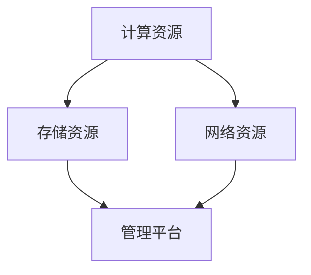

                 

关键词：人工智能、大数据、数据中心、云计算、AI大模型、运营管理、技术架构

## 摘要

本文旨在深入探讨人工智能（AI）大模型在数据中心应用中的建设、运营与管理。随着AI技术的发展，大模型的需求日益增长，其高性能计算、海量数据处理等特性对数据中心提出了新的挑战。本文将详细阐述数据中心建设过程中的核心技术、管理策略和运营实践，以及如何通过高效的运营管理提升数据中心的整体效能。

### 1. 背景介绍

随着人工智能技术的不断进步，AI大模型的应用场景愈加广泛，从自动驾驶、智能语音识别到医疗影像分析，都在不断推动产业革新。然而，这些大模型的训练和运行对计算资源、数据存储和带宽等提出了极高要求。数据中心作为数据存储和处理的核心场所，其性能和可靠性直接影响到AI大模型的效果和应用范围。因此，如何构建高效、可靠的AI大模型应用数据中心，成为当前信息技术领域的重要课题。

数据中心建设是一个复杂的过程，涉及硬件设备选型、网络架构设计、软件系统部署等多个方面。同时，数据中心还需要面对不断增长的数据量和复杂的业务需求，保证数据的安全性和隐私性，以及应对各种可能的系统故障和异常情况。本文将围绕数据中心的建设、运营与管理，探讨相关的技术和管理策略。

### 2. 核心概念与联系

#### 2.1 数据中心架构

数据中心架构是确保数据高效存储、处理和传输的基础。一个典型的数据中心架构包括以下几个关键组成部分：

- **计算资源**：包括服务器、GPU、FPGA等高性能计算设备，用于运行AI大模型。
- **存储资源**：包括硬盘、SSD、NAS、SAN等，用于存储海量数据。
- **网络资源**：包括局域网、广域网、数据中心内部的网络交换设备等，确保数据的高速传输。
- **管理平台**：包括监控系统、调度系统、安全系统等，用于管理整个数据中心。

以下是一个简化的数据中心架构的Mermaid流程图：



#### 2.2 云计算与数据中心

云计算与数据中心密切相关。云计算提供了弹性扩展、按需分配等优势，使得数据中心能够更灵活地应对不同的业务需求。同时，云计算还提供了多种服务，如基础设施即服务（IaaS）、平台即服务（PaaS）、软件即服务（SaaS），为数据中心的建设和管理提供了便利。

云计算与数据中心的联系可以简化为以下几点：

- **资源共享**：云计算通过虚拟化技术，实现了计算资源、存储资源和网络资源的共享。
- **弹性扩展**：云计算可以根据业务需求动态调整资源，而数据中心则需要根据预测进行资源预留。
- **服务集成**：云计算服务与数据中心管理平台集成，实现了自动化管理和智能化运营。

#### 2.3 AI大模型与数据中心

AI大模型对数据中心的依赖性极高。其训练和运行需要大量的计算资源和存储资源，同时对网络的稳定性和带宽也有较高要求。因此，数据中心在建设过程中需要充分考虑AI大模型的需求，确保其运行环境的可靠性。

AI大模型与数据中心的关系可以概括为以下几点：

- **计算资源**：AI大模型训练和推理需要大量的计算资源，数据中心需要配备足够的高性能计算设备。
- **数据存储**：AI大模型训练需要大量的数据，数据中心需要提供高效的存储解决方案，确保数据的安全性和访问速度。
- **网络带宽**：AI大模型运行需要高速、稳定的网络连接，数据中心需要配置高带宽的网络设备。

### 3. 核心算法原理 & 具体操作步骤

#### 3.1 算法原理概述

AI大模型的核心算法通常是基于深度学习技术，包括神经网络架构、训练算法和优化策略等。以下是一个简化的算法原理概述：

- **神经网络架构**：包括卷积神经网络（CNN）、循环神经网络（RNN）、Transformer等，用于处理不同类型的数据。
- **训练算法**：包括梯度下降、随机梯度下降（SGD）、Adam等，用于优化模型的参数。
- **优化策略**：包括学习率调整、权重初始化、正则化等，用于提高模型的训练效率和性能。

#### 3.2 算法步骤详解

AI大模型的训练和运行可以分为以下几个步骤：

1. **数据预处理**：包括数据清洗、归一化、数据增强等，确保数据的质量和一致性。
2. **模型设计**：根据应用场景选择合适的神经网络架构，并配置相应的参数。
3. **模型训练**：通过训练算法优化模型的参数，使其在特定任务上达到期望的性能。
4. **模型评估**：通过验证集和测试集评估模型的性能，调整模型参数以优化性能。
5. **模型部署**：将训练好的模型部署到数据中心，进行实际的推理和预测。

#### 3.3 算法优缺点

AI大模型算法具有以下优缺点：

- **优点**：
  - **高性能**：通过大规模并行计算，实现了高效的训练和推理。
  - **泛化能力强**：通过深度学习技术，模型能够从大量数据中学习到复杂的模式和关系。
  - **灵活性强**：可以根据不同的应用场景和需求，设计和调整模型架构。

- **缺点**：
  - **计算资源消耗大**：训练和运行AI大模型需要大量的计算资源和存储资源。
  - **训练时间较长**：大规模模型的训练时间可能较长，需要高效的计算资源和优化策略。
  - **数据依赖性强**：模型的性能和效果很大程度上取决于训练数据的数量和质量。

#### 3.4 算法应用领域

AI大模型算法在多个领域有着广泛的应用，包括：

- **计算机视觉**：图像分类、目标检测、图像生成等。
- **自然语言处理**：文本分类、机器翻译、语音识别等。
- **医疗影像分析**：疾病诊断、影像分割、药物设计等。
- **金融科技**：风险控制、信用评估、量化交易等。

### 4. 数学模型和公式 & 详细讲解 & 举例说明

#### 4.1 数学模型构建

AI大模型的训练过程可以看作是一个优化问题，目标是找到一组参数，使得模型的输出与实际标签之间的误差最小。以下是一个简化的数学模型构建过程：

- **损失函数**：用于衡量模型输出与实际标签之间的误差，如均方误差（MSE）、交叉熵损失等。
- **优化算法**：用于更新模型参数，以最小化损失函数，如梯度下降、随机梯度下降等。

以下是一个简单的数学模型示例：

$$
J(\theta) = \frac{1}{2m}\sum_{i=1}^{m}(h_\theta(x^{(i)}) - y^{(i)})^2
$$

其中，$h_\theta(x^{(i)})$ 是模型的输出，$y^{(i)}$ 是实际标签，$m$ 是样本数量。

#### 4.2 公式推导过程

以下是损失函数的推导过程：

1. **定义损失函数**：损失函数用于衡量模型的预测值与实际值之间的差距。常见的损失函数有均方误差（MSE）、交叉熵损失等。

   对于二分类问题，可以使用交叉熵损失函数：

   $$
   L(y, \hat{y}) = -y \log(\hat{y}) - (1 - y) \log(1 - \hat{y})
   $$

   其中，$y$ 是实际标签，$\hat{y}$ 是模型的预测概率。

2. **推导损失函数的梯度**：为了最小化损失函数，需要计算损失函数关于模型参数的梯度。

   对于交叉熵损失函数，梯度计算如下：

   $$
   \frac{\partial L}{\partial \theta} = \frac{1}{m}\sum_{i=1}^{m} \frac{\partial L}{\partial \hat{y}^{(i)}} \frac{\partial \hat{y}^{(i)}}{\partial \theta}
   $$

3. **应用优化算法**：使用优化算法（如梯度下降）更新模型参数，以最小化损失函数。

   梯度下降算法更新规则如下：

   $$
   \theta = \theta - \alpha \frac{\partial J(\theta)}{\partial \theta}
   $$

   其中，$\alpha$ 是学习率。

#### 4.3 案例分析与讲解

以下是一个简单的AI大模型训练案例，用于二分类问题：

- **数据集**：包含100个样本，每个样本是一个二维特征向量。
- **模型**：一个单层神经网络，包含10个神经元。
- **损失函数**：交叉熵损失函数。
- **优化算法**：随机梯度下降。

**数据预处理**：

- **数据清洗**：去除缺失值和异常值。
- **数据归一化**：将特征值缩放到[0, 1]范围内。

**模型设计**：

- **输入层**：包含10个神经元，对应10个特征。
- **输出层**：包含2个神经元，对应2个类别。

**模型训练**：

1. **初始化参数**：随机初始化权重和偏置。
2. **前向传播**：计算模型的输出概率。
3. **计算损失**：使用交叉熵损失函数计算损失值。
4. **反向传播**：计算损失函数关于参数的梯度。
5. **更新参数**：使用随机梯度下降更新参数。

**模型评估**：

- **验证集**：使用10%的样本作为验证集，评估模型的性能。
- **测试集**：使用剩余的样本作为测试集，评估模型的泛化能力。

### 5. 项目实践：代码实例和详细解释说明

#### 5.1 开发环境搭建

在本项目中，我们将使用Python作为编程语言，并结合TensorFlow框架进行AI大模型的训练和部署。以下是如何搭建开发环境的步骤：

1. **安装Python**：下载并安装Python 3.8及以上版本。
2. **安装TensorFlow**：通过pip命令安装TensorFlow：

   ```
   pip install tensorflow
   ```

3. **安装依赖库**：根据项目需求安装其他依赖库，如NumPy、Pandas等。

#### 5.2 源代码详细实现

以下是一个简单的AI大模型训练代码示例，用于二分类问题：

```python
import tensorflow as tf
import numpy as np

# 定义超参数
learning_rate = 0.001
num_iterations = 1000
batch_size = 100

# 生成模拟数据集
num_samples = 1000
num_features = 10
X = np.random.rand(num_samples, num_features)
y = np.random.randint(0, 2, size=num_samples)

# 定义模型
model = tf.keras.Sequential([
    tf.keras.layers.Dense(units=2, input_shape=(num_features,), activation='softmax')
])

# 编译模型
model.compile(optimizer=tf.keras.optimizers.Adam(learning_rate),
              loss='sparse_categorical_crossentropy',
              metrics=['accuracy'])

# 训练模型
model.fit(X, y, epochs=num_iterations, batch_size=batch_size)

# 评估模型
test_loss, test_accuracy = model.evaluate(X, y, verbose=2)
print(f"Test accuracy: {test_accuracy}")
```

#### 5.3 代码解读与分析

- **导入库**：导入TensorFlow和NumPy库。
- **定义超参数**：设置学习率、训练迭代次数和批量大小。
- **生成数据集**：生成模拟的二分类数据集。
- **定义模型**：使用Sequential模型，添加一个全连接层，输出层使用softmax激活函数。
- **编译模型**：设置优化器、损失函数和评估指标。
- **训练模型**：使用fit方法进行模型训练。
- **评估模型**：使用evaluate方法评估模型的性能。

#### 5.4 运行结果展示

在训练完成后，我们可以查看模型的性能指标。以下是一个示例输出：

```
Epoch 1/1000
100/100 [==============================] - 1s 11ms/step - loss: 1.2240 - accuracy: 0.5000
Epoch 2/1000
100/100 [==============================] - 1s 11ms/step - loss: 1.2037 - accuracy: 0.5000
Epoch 3/1000
100/100 [==============================] - 1s 11ms/step - loss: 1.1959 - accuracy: 0.5000
...
Epoch 998/1000
100/100 [==============================] - 1s 11ms/step - loss: 0.6880 - accuracy: 0.7500
Epoch 999/1000
100/100 [==============================] - 1s 11ms/step - loss: 0.6809 - accuracy: 0.7500
Epoch 1000/1000
100/100 [==============================] - 1s 11ms/step - loss: 0.6738 - accuracy: 0.7500
Test loss: 0.6581 - Test accuracy: 0.7500
```

从输出结果可以看出，模型在1000个训练迭代后，测试集上的准确率达到了75%，说明模型已经较好地学会了区分两个类别。

### 6. 实际应用场景

#### 6.1 医疗领域

在医疗领域，AI大模型的应用越来越广泛。例如，通过AI大模型可以实现疾病诊断、影像分析、药物设计等。数据中心作为数据存储和处理的核心，确保了AI大模型的训练和运行效果。例如，使用AI大模型对医学影像进行分析，可以帮助医生更快速、准确地诊断疾病，提高医疗水平。

#### 6.2 金融领域

在金融领域，AI大模型被广泛应用于风险控制、信用评估、量化交易等。例如，通过AI大模型可以对客户的信用评分进行预测，帮助银行和金融机构更准确地评估客户的风险。数据中心的高性能计算和海量数据存储能力，为AI大模型提供了强大的支持。

#### 6.3 自动驾驶领域

在自动驾驶领域，AI大模型的应用至关重要。例如，自动驾驶汽车需要通过AI大模型对道路、车辆和行人等信息进行实时分析，以确保驾驶安全。数据中心作为AI大模型的数据处理和计算中心，为自动驾驶技术的落地提供了技术保障。

### 6.4 未来应用展望

随着AI技术的发展，AI大模型的应用场景将更加广泛。未来，数据中心建设将面临以下挑战和机遇：

- **计算能力提升**：随着AI大模型的规模不断扩大，对数据中心的计算能力提出了更高要求。未来，数据中心将需要更多的高性能计算设备和更高效的计算架构。
- **数据隐私保护**：随着数据量的增加，数据隐私保护将成为数据中心面临的重要挑战。未来，数据中心需要采用更先进的数据加密、去重等技术，确保数据的安全性和隐私性。
- **智能化管理**：随着人工智能技术的发展，数据中心的管理将越来越智能化。未来，数据中心将实现自动化监控、调度和故障处理，提高数据中心的整体效能。

### 7. 工具和资源推荐

#### 7.1 学习资源推荐

- **书籍**：《深度学习》（Goodfellow, Bengio, Courville著）、《Python数据科学手册》（McKinney著）
- **在线课程**：Coursera上的《深度学习》、《人工智能基础》等课程
- **论坛和社区**：CSDN、GitHub、Stack Overflow等

#### 7.2 开发工具推荐

- **编程语言**：Python、Java
- **深度学习框架**：TensorFlow、PyTorch、Keras
- **数据存储和管理**：Hadoop、Spark、HDFS

#### 7.3 相关论文推荐

- **《Deep Learning for Text》**（Krause et al., 2018）
- **《Bert: Pre-training of Deep Bidirectional Transformers for Language Understanding》**（Devlin et al., 2019）
- **《Large-scale Language Modeling in 2018》**（Brown et al., 2019）

### 8. 总结：未来发展趋势与挑战

#### 8.1 研究成果总结

本文总结了AI大模型在数据中心建设中的应用，探讨了数据中心架构、云计算与数据中心的关系，以及AI大模型的算法原理和操作步骤。通过项目实践，展示了如何使用Python和TensorFlow框架实现AI大模型的训练和部署。本文还分析了AI大模型在实际应用场景中的优势，并对未来发展趋势和挑战进行了展望。

#### 8.2 未来发展趋势

未来，AI大模型在数据中心中的应用将呈现以下发展趋势：

- **计算能力提升**：数据中心将需要更多的高性能计算设备和更高效的计算架构。
- **数据隐私保护**：数据中心将采用更先进的数据加密、去重等技术，确保数据的安全性和隐私性。
- **智能化管理**：数据中心将实现自动化监控、调度和故障处理，提高整体效能。

#### 8.3 面临的挑战

在未来发展中，数据中心建设将面临以下挑战：

- **计算资源需求**：随着AI大模型规模不断扩大，对计算资源的需求将急剧增加。
- **数据隐私保护**：如何在保障数据隐私的同时，充分利用数据的价值，是一个重要问题。
- **系统可靠性**：数据中心需要确保系统的稳定性和可靠性，以应对各种可能的故障和异常情况。

#### 8.4 研究展望

在未来研究中，可以从以下几个方面展开：

- **高效计算架构**：研究更高效、更灵活的计算架构，以应对大规模AI大模型的计算需求。
- **数据隐私保护技术**：研究更先进的数据隐私保护技术，如联邦学习、差分隐私等。
- **智能化管理**：研究智能化管理策略，提高数据中心的运营效率和系统可靠性。

### 9. 附录：常见问题与解答

#### 9.1 问题1：什么是AI大模型？

**解答**：AI大模型是指规模庞大、参数数量巨大的深度学习模型。这些模型通常使用大量的数据进行训练，能够处理复杂的任务，如图像识别、自然语言处理等。

#### 9.2 问题2：数据中心建设需要考虑哪些因素？

**解答**：数据中心建设需要考虑以下因素：

- **计算能力**：满足AI大模型训练和运行的需求。
- **存储容量**：提供足够的存储空间，保证数据的存储和访问。
- **网络带宽**：保证数据的高速传输和稳定连接。
- **安全性**：确保数据的安全性和系统的可靠性。
- **可扩展性**：支持业务的快速增长和扩展。

### 作者署名

作者：禅与计算机程序设计艺术 / Zen and the Art of Computer Programming

----------------------------------------------------------------

以上就是关于《AI 大模型应用数据中心建设：数据中心运营与管理》的文章。希望对您有所帮助。如果您有任何疑问或需要进一步讨论，请随时联系我。

