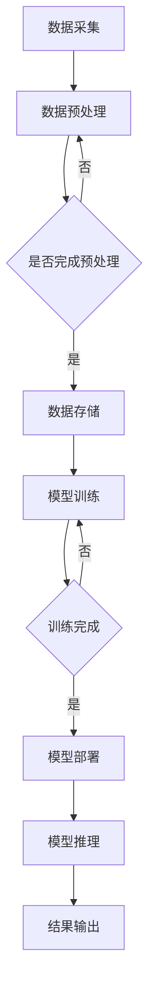

                 

关键词：人工智能，大模型，数据中心，培训与发展，技术博客，技术语言，深度学习，模型优化，数据管理，未来展望。

> 摘要：本文详细探讨了人工智能大模型在数据中心的应用、培训与发展。通过分析大模型的核心概念与联系，介绍核心算法原理和操作步骤，阐述数学模型和公式的构建与推导，并提供了项目实践中的代码实例。文章还探讨了实际应用场景，展望了未来发展趋势与挑战，并推荐了相关工具和资源。

## 1. 背景介绍

人工智能（AI）作为当今科技发展的核心驱动力，已经在各个领域展现出了其强大的影响力。特别是大模型（Large Models）的发展，使得人工智能的应用变得更加广泛和深入。数据中心作为承载这些大模型训练和部署的重要基础设施，其性能和可靠性直接影响到人工智能应用的效率和效果。

### 1.1 人工智能的发展历程

人工智能的概念可以追溯到20世纪50年代。在最初的几十年里，人工智能主要侧重于符号推理和逻辑编程。直到20世纪80年代，随着计算能力的提升和海量数据的积累，机器学习逐渐成为人工智能研究的主流。进入21世纪，深度学习的出现和快速发展，推动了人工智能进入一个新的阶段。特别是2012年AlexNet在ImageNet比赛中的卓越表现，标志着深度学习的重大突破。

### 1.2 大模型的定义与特点

大模型是指那些具有数亿至数十亿参数的神经网络模型。与传统的中小型模型相比，大模型具有以下特点：

1. **参数数量巨大**：大模型具有数亿至数十亿的参数，这要求数据中心具有强大的计算和存储能力。
2. **训练时间较长**：由于参数数量庞大，大模型的训练时间通常较长，需要大量的计算资源和时间。
3. **对数据质量要求高**：大模型的训练依赖于大量的高质量数据，数据的质量和多样性直接影响模型的性能。

### 1.3 数据中心的发展

数据中心是集中存储、处理和管理数据的重要基础设施。随着云计算、大数据和人工智能的兴起，数据中心的规模和性能不断提升。现代数据中心通常采用分布式架构，具有高性能的计算节点、高速的网络连接和大规模的存储设备。

## 2. 核心概念与联系

### 2.1 人工智能与数据中心的互动关系

人工智能的发展离不开数据中心的支撑，两者之间存在着密切的互动关系。人工智能需要数据中心提供强大的计算和存储资源，而数据中心则需要人工智能技术来优化其运营和管理。

### 2.2 大模型在数据中心的应用

大模型在数据中心的应用主要体现在以下几个方面：

1. **训练与优化**：大模型的训练通常需要在数据中心进行，利用分布式计算和并行处理技术，提高训练效率。
2. **部署与推理**：训练完成的大模型需要在数据中心部署，以实现实时推理和预测。
3. **数据管理**：大模型对数据质量要求高，数据中心需要提供高效的数据管理和服务，以确保数据的安全性和可靠性。

### 2.3 数据中心架构与优化

为了支持大模型的应用，数据中心需要进行以下优化：

1. **计算资源优化**：通过增加计算节点、提升计算性能，提高数据中心的计算能力。
2. **存储资源优化**：通过采用高速存储设备和分布式存储架构，提高数据中心的存储性能。
3. **网络优化**：通过优化网络架构和带宽，提高数据中心的数据传输速度和效率。

### 2.4 Mermaid 流程图

下面是一个简单的 Mermaid 流程图，展示了大模型在数据中心的应用流程。



## 3. 核心算法原理 & 具体操作步骤

### 3.1 算法原理概述

大模型的训练通常基于深度学习算法，其中最常用的算法是深度神经网络（DNN）。DNN通过多层神经网络结构，对输入数据进行特征提取和分类。大模型的优势在于其可以处理大量复杂的特征，并在大规模数据集上实现较高的准确性。

### 3.2 算法步骤详解

1. **数据采集**：从各种来源收集大量数据，如图像、文本、音频等。
2. **数据预处理**：对采集到的数据进行分析和处理，包括去噪、归一化、数据增强等。
3. **模型设计**：设计合适的神经网络结构，包括层数、每层的神经元数量、激活函数等。
4. **模型训练**：使用训练数据对模型进行训练，通过反向传播算法优化模型参数。
5. **模型评估**：使用验证数据集评估模型的性能，调整模型参数。
6. **模型部署**：将训练完成的模型部署到数据中心，进行实时推理和预测。

### 3.3 算法优缺点

**优点**：

1. **高准确性**：大模型可以处理复杂的特征，并在大规模数据集上实现较高的准确性。
2. **泛化能力强**：大模型通过训练大量数据，具有良好的泛化能力。

**缺点**：

1. **计算资源需求大**：大模型的训练需要大量的计算资源和时间。
2. **对数据质量要求高**：数据的质量和多样性直接影响模型的性能。

### 3.4 算法应用领域

大模型在各个领域都有广泛的应用，包括：

1. **计算机视觉**：如人脸识别、图像分类、物体检测等。
2. **自然语言处理**：如文本分类、机器翻译、情感分析等。
3. **语音识别**：如语音识别、语音合成等。

## 4. 数学模型和公式 & 详细讲解 & 举例说明

### 4.1 数学模型构建

深度神经网络的数学模型可以表示为：

\[ h_{\theta}(x) = \text{sigmoid}(\theta^T \cdot x) \]

其中，\( \theta \) 表示模型参数，\( x \) 表示输入特征，\( h_{\theta}(x) \) 表示输出。

### 4.2 公式推导过程

假设我们已经有一组数据 \( (x_i, y_i) \)，其中 \( x_i \) 是输入特征，\( y_i \) 是标签。我们希望最小化损失函数：

\[ J(\theta) = \frac{1}{m} \sum_{i=1}^{m} \text{h}_{\theta}(x_i) (1 - \text{h}_{\theta}(x_i)) \cdot (y_i - \text{h}_{\theta}(x_i)) \]

其中，\( m \) 是数据集的大小。

### 4.3 案例分析与讲解

假设我们有一组二分类数据，数据集大小为 \( m = 100 \)。输入特征 \( x_i \) 是一个 10 维向量，模型参数 \( \theta \) 是一个 10 维向量。标签 \( y_i \) 是一个二进制值，0 或 1。

我们使用梯度下降算法来优化模型参数。首先，我们需要计算损失函数对每个参数的偏导数：

\[ \frac{\partial J(\theta)}{\partial \theta_j} = \frac{1}{m} \sum_{i=1}^{m} \text{h}_{\theta}(x_i) (1 - \text{h}_{\theta}(x_i)) \cdot (y_i - \text{h}_{\theta}(x_i)) \cdot x_{ij} \]

然后，我们可以通过以下迭代公式更新参数：

\[ \theta_j := \theta_j - \alpha \cdot \frac{\partial J(\theta)}{\partial \theta_j} \]

其中，\( \alpha \) 是学习率。

## 5. 项目实践：代码实例和详细解释说明

### 5.1 开发环境搭建

在本项目中，我们使用 Python 作为编程语言，TensorFlow 作为深度学习框架。首先，需要安装 Python 和 TensorFlow：

```bash
pip install python
pip install tensorflow
```

### 5.2 源代码详细实现

以下是一个简单的二分类任务的代码实现：

```python
import tensorflow as tf
import numpy as np

# 定义输入层
x = tf.placeholder(tf.float32, shape=[None, 10])
y = tf.placeholder(tf.float32, shape=[None, 1])

# 定义模型参数
theta = tf.Variable(tf.random_uniform([10, 1], -1, 1))

# 定义激活函数
h = tf.sigmoid(tf.matmul(x, theta))

# 定义损失函数
loss = tf.reduce_mean(tf.reduce_sum(-y * tf.log(h) - (1 - y) * tf.log(1 - h), axis=1))

# 定义优化器
optimizer = tf.train.GradientDescentOptimizer(learning_rate=0.1)
train_op = optimizer.minimize(loss)

# 训练模型
with tf.Session() as sess:
  sess.run(tf.global_variables_initializer())
  for i in range(1000):
    _, loss_val = sess.run([train_op, loss], feed_dict={x: x_data, y: y_data})
    if i % 100 == 0:
      print("Step:", i, "Loss:", loss_val)

# 预测
predictions = sess.run(h, feed_dict={x: x_data})
```

### 5.3 代码解读与分析

1. **输入层**：定义输入特征 \( x \) 和标签 \( y \) 的占位符。
2. **模型参数**：初始化模型参数 \( \theta \)。
3. **激活函数**：定义激活函数 \( h \)。
4. **损失函数**：定义损失函数 \( loss \)。
5. **优化器**：定义优化器 \( optimizer \)。
6. **训练模型**：使用 \( Session \) 运行优化器和损失函数，进行模型训练。
7. **预测**：使用训练完成的模型进行预测。

### 5.4 运行结果展示

训练完成后，我们可以通过以下代码展示模型的运行结果：

```python
print("Predictions:")
print(predictions)
```

## 6. 实际应用场景

大模型在数据中心的应用场景非常广泛，以下是一些典型的应用场景：

1. **智能推荐系统**：如电商平台的商品推荐、视频网站的推荐等，通过分析用户行为和兴趣，实现个性化的推荐。
2. **金融风控**：通过分析用户的交易行为和历史数据，预测潜在的风险，提高金融系统的安全性。
3. **医疗诊断**：利用大模型对医学图像进行分析，辅助医生进行诊断，提高诊断的准确性和效率。

## 7. 未来应用展望

随着人工智能技术的不断发展，大模型在数据中心的应用前景非常广阔。未来，大模型可能会在以下领域得到更广泛的应用：

1. **自动驾驶**：通过大模型对环境进行感知和决策，提高自动驾驶的安全性和稳定性。
2. **智能语音助手**：通过大模型实现更自然的语音交互和任务处理。
3. **智能客服**：通过大模型实现更智能的客服系统，提高客户体验。

## 8. 工具和资源推荐

### 8.1 学习资源推荐

1. **《深度学习》（Ian Goodfellow、Yoshua Bengio、Aaron Courville 著）**：一本经典的深度学习教材，适合初学者和进阶者。
2. **《Python深度学习》（François Chollet 著）**：一本介绍如何使用 Python 和 TensorFlow 进行深度学习的入门书籍。

### 8.2 开发工具推荐

1. **TensorFlow**：一个广泛使用的开源深度学习框架，适用于各种深度学习任务。
2. **PyTorch**：一个灵活的深度学习框架，适用于研究和个人项目。

### 8.3 相关论文推荐

1. **“Deep Learning” (Goodfellow, Bengio, Courville, 2016)**：一本全面的深度学习论文集，涵盖了深度学习的各个方面。
2. **“BERT: Pre-training of Deep Bidirectional Transformers for Language Understanding” (Devlin et al., 2019)**：一篇介绍 BERT 模型的经典论文，是自然语言处理领域的重要成果。

## 9. 总结：未来发展趋势与挑战

大模型在数据中心的应用前景广阔，但同时也面临着一些挑战：

### 9.1 研究成果总结

1. **大模型的训练效率和性能得到显著提升**：通过优化算法和硬件，大模型的训练时间显著缩短，性能不断提升。
2. **大模型的应用领域不断扩展**：大模型在计算机视觉、自然语言处理、语音识别等领域的应用不断深入。

### 9.2 未来发展趋势

1. **大模型与硬件的结合更加紧密**：随着硬件技术的发展，大模型与硬件的结合将更加紧密，实现更高的计算效率和性能。
2. **大模型的泛化能力将得到提升**：通过数据增强、迁移学习等技术，大模型的泛化能力将得到进一步提升。

### 9.3 面临的挑战

1. **计算资源需求巨大**：大模型的训练和部署需要大量的计算资源和存储资源，对数据中心提出了更高的要求。
2. **数据质量和多样性**：大模型对数据质量要求高，数据的质量和多样性直接影响模型的性能。

### 9.4 研究展望

未来，大模型在数据中心的应用将更加深入和广泛。研究人员将继续探索优化算法、提高计算效率和性能、提升模型泛化能力等方面的技术，以应对面临的挑战。

## 10. 附录：常见问题与解答

### 10.1 大模型训练需要多少计算资源？

大模型训练需要的计算资源取决于模型的规模、训练数据量和训练目标。一般来说，大模型的训练需要数百至数千张高性能 GPU 卡和大量存储资源。

### 10.2 如何提高大模型的泛化能力？

可以通过以下方法提高大模型的泛化能力：

1. **数据增强**：通过增加数据多样性，提高模型对未见数据的适应性。
2. **迁移学习**：利用预训练模型，通过微调适应特定任务。
3. **正则化**：使用正则化技术，如 L1、L2 正则化，减少模型过拟合。

### 10.3 大模型训练时间如何优化？

可以通过以下方法优化大模型训练时间：

1. **分布式训练**：使用多 GPU、多节点分布式训练，提高训练效率。
2. **数据并行**：将数据划分到多个 GPU 上进行并行处理，减少通信开销。
3. **混合精度训练**：使用混合精度训练，降低内存占用和计算时间。

## 11. 作者署名

作者：禅与计算机程序设计艺术 / Zen and the Art of Computer Programming

---

本文旨在探讨人工智能大模型在数据中心的应用、培训与发展，希望对读者在相关领域的研究和实践提供一些启示和帮助。随着人工智能技术的不断进步，大模型在数据中心的应用前景将更加广阔。在未来的发展中，我们需要不断创新和优化，以应对面临的挑战。

