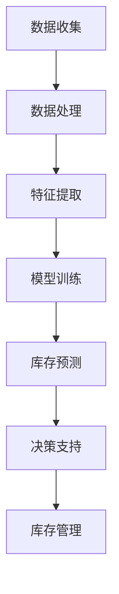

                 

关键词：AI大模型、数据中心、库存管理、算法、数学模型、代码实例、应用场景、工具和资源推荐

> 摘要：本文深入探讨了AI大模型在数据中心库存管理中的应用，从背景介绍到核心算法原理，再到数学模型和项目实践，全面分析了AI大模型如何优化数据中心的库存管理流程，提高效率和准确度。同时，文章还展望了未来的发展趋势与面临的挑战。

## 1. 背景介绍

随着云计算和大数据技术的快速发展，数据中心已成为现代信息社会的核心基础设施。然而，数据中心的库存管理面临着诸多挑战。传统的库存管理方法往往依赖于人工记录和手动操作，不仅效率低下，而且容易出现错误。随着数据中心规模的不断扩大和设备类型的多样化，传统的库存管理方法已经难以满足实际需求。

近年来，人工智能（AI）技术的飞速发展为数据中心库存管理带来了新的机遇。AI大模型，如深度学习神经网络，能够通过大量数据的训练，自动识别模式和趋势，从而实现对数据中心库存的精准管理和预测。本文将探讨AI大模型在数据中心库存管理中的应用，以期为相关领域的研究和实践提供参考。

## 2. 核心概念与联系

在探讨AI大模型在数据中心库存管理中的应用之前，我们需要了解一些核心概念和它们之间的关系。以下是核心概念及其关联的Mermaid流程图：



### 2.1 数据收集

数据收集是数据中心库存管理的基础。通过传感器、日志文件和设备监控工具，可以收集到大量的数据，如设备使用情况、维护记录、设备生命周期等。

### 2.2 数据处理

收集到的数据需要进行预处理，包括去噪、归一化和缺失值填充等，以确保数据质量。

### 2.3 特征提取

在数据处理之后，我们需要从原始数据中提取出有用的特征。这些特征将用于模型的训练和预测。

### 2.4 模型训练

使用提取出的特征，我们通过机器学习算法（如深度学习）训练AI大模型。模型训练是AI大模型能够实现精准库存预测的关键。

### 2.5 库存预测

经过训练的AI大模型可以用于预测数据中心的库存水平。这些预测结果将用于支持库存管理决策。

### 2.6 决策支持

库存预测结果将反馈给数据中心的管理层，为他们提供决策支持，以优化库存水平。

### 2.7 库存管理

基于决策支持，数据中心可以采取相应的措施来调整库存，如采购、调拨和淘汰等，从而确保库存水平的优化。

## 3. 核心算法原理 & 具体操作步骤

### 3.1 算法原理概述

AI大模型在数据中心库存管理中的应用主要基于深度学习算法。深度学习是一种模拟人脑神经网络的学习方法，通过多层的神经网络结构，对大量数据进行学习和模式识别。

### 3.2 算法步骤详解

#### 3.2.1 数据收集

首先，我们需要从数据中心的各种数据源收集数据，如传感器数据、设备日志、用户操作记录等。这些数据将被用于后续的特征提取和模型训练。

#### 3.2.2 数据预处理

收集到的数据需要进行预处理，包括数据清洗、去噪、归一化和缺失值填充等。这一步确保了数据的质量，为后续的特征提取和模型训练提供了良好的基础。

#### 3.2.3 特征提取

在预处理完成后，我们需要从原始数据中提取出有用的特征。这些特征可以是设备的运行状态、使用频率、维护记录等。特征提取是深度学习模型训练的关键步骤，它决定了模型的性能。

#### 3.2.4 模型训练

使用提取出的特征，我们通过深度学习算法（如卷积神经网络、循环神经网络等）训练AI大模型。模型训练的过程实际上是模型不断调整内部参数，以最小化预测误差的过程。

#### 3.2.5 库存预测

经过训练的AI大模型可以用于预测数据中心的库存水平。预测结果将用于支持库存管理决策。

#### 3.2.6 决策支持

库存预测结果将反馈给数据中心的管理层，为他们提供决策支持，以优化库存水平。

### 3.3 算法优缺点

#### 优点：

1. **高精度预测**：通过深度学习算法，AI大模型能够对数据中心库存进行高精度的预测，有助于提高库存管理的准确度。
2. **自适应调整**：AI大模型能够根据实时数据动态调整预测模型，以适应数据中心的实际运行情况。
3. **自动化管理**：AI大模型能够自动化地处理库存数据，减少了人工干预，提高了管理效率。

#### 缺点：

1. **数据需求量大**：深度学习算法需要大量数据来训练模型，这可能导致在数据不足的情况下模型性能不佳。
2. **计算资源需求高**：深度学习算法通常需要大量的计算资源，这可能在资源受限的环境中成为一个挑战。
3. **算法黑箱问题**：深度学习算法的内部机制复杂，缺乏透明性，可能导致难以解释和理解。

### 3.4 算法应用领域

AI大模型在数据中心库存管理中的应用不仅限于数据中心，还可以广泛应用于其他领域的库存管理，如物流、零售等。其高精度预测和自动化管理的能力有助于提高各行业的库存管理水平和效率。

## 4. 数学模型和公式 & 详细讲解 & 举例说明

### 4.1 数学模型构建

在数据中心库存管理中，我们通常使用马尔可夫决策过程（MDP）来构建数学模型。MDP是一种决策模型，它通过状态转移概率和奖励函数，帮助决策者选择最优策略。

#### 状态（State）：表示数据中心库存的状态，如库存量、库存成本等。

#### 动作（Action）：表示库存管理的策略，如采购、调拨、淘汰等。

#### 奖励（Reward）：表示执行某个动作后获得的收益，如节省成本、增加销售额等。

#### 状态转移概率（State Transition Probability）：表示在当前状态下执行某个动作后，下一个状态的概率分布。

### 4.2 公式推导过程

根据MDP的定义，我们可以推导出如下公式：

$$
V(s) = \max_a \sum_{s'} p(s'|s,a) \cdot [R(s',a) + \gamma V(s')]
$$

其中，$V(s)$表示状态值函数，$a$表示动作，$s'$表示下一个状态，$R(s',a)$表示在状态$s'$下执行动作$a$的奖励值，$\gamma$表示折扣因子，$p(s'|s,a)$表示在状态$s$下执行动作$a$后到达状态$s'$的概率。

### 4.3 案例分析与讲解

假设一个数据中心有三种设备类型A、B和C，每种设备的库存量分别为$X_A$、$X_B$和$X_C$。我们需要根据当前库存水平，选择最优的采购策略，以最小化库存成本。

#### 状态：

- $s = (X_A, X_B, X_C)$

#### 动作：

- $a = (A, B, C)$，表示分别采购设备A、B和C的数量。

#### 奖励：

- $R(s',a) = -C_A \cdot |X_A - a_A| - C_B \cdot |X_B - a_B| - C_C \cdot |X_C - a_C|$，其中$C_A$、$C_B$和$C_C$分别为设备A、B和C的采购成本。

#### 状态转移概率：

- $p(s'|s,a) = 1$，表示在当前状态下执行动作$a$后，下一个状态一定为$s'$。

根据上述公式，我们可以计算出最优的采购策略，从而最小化库存成本。

## 5. 项目实践：代码实例和详细解释说明

### 5.1 开发环境搭建

为了实现AI大模型在数据中心库存管理中的应用，我们需要搭建一个合适的开发环境。以下是一个基本的开发环境配置：

- 操作系统：Linux
- 编程语言：Python
- 依赖库：NumPy、Pandas、Scikit-learn、TensorFlow

### 5.2 源代码详细实现

以下是一个简单的示例代码，用于实现AI大模型在数据中心库存管理中的应用：

```python
import numpy as np
import pandas as pd
from sklearn.model_selection import train_test_split
from sklearn.ensemble import RandomForestRegressor
from tensorflow.keras.models import Sequential
from tensorflow.keras.layers import Dense

# 数据预处理
def preprocess_data(data):
    # 数据清洗、归一化和缺失值填充等操作
    return processed_data

# 模型训练
def train_model(X_train, y_train):
    # 使用随机森林算法训练模型
    model = RandomForestRegressor(n_estimators=100)
    model.fit(X_train, y_train)
    return model

# 模型预测
def predict_inventory(model, X_test):
    # 使用训练好的模型进行预测
    predictions = model.predict(X_test)
    return predictions

# 主函数
def main():
    # 读取数据
    data = pd.read_csv('data.csv')
    processed_data = preprocess_data(data)

    # 划分训练集和测试集
    X = processed_data.drop('inventory', axis=1)
    y = processed_data['inventory']
    X_train, X_test, y_train, y_test = train_test_split(X, y, test_size=0.2, random_state=42)

    # 训练模型
    model = train_model(X_train, y_train)

    # 预测库存
    predictions = predict_inventory(model, X_test)

    # 输出预测结果
    print(predictions)

if __name__ == '__main__':
    main()
```

### 5.3 代码解读与分析

上述代码主要分为以下几个部分：

1. **数据预处理**：对原始数据进行清洗、归一化和缺失值填充等操作，以提高模型训练的质量。
2. **模型训练**：使用随机森林算法训练模型。随机森林是一种集成学习方法，它通过构建多棵决策树，提高模型的预测性能。
3. **模型预测**：使用训练好的模型对测试数据进行预测，得到库存预测结果。
4. **主函数**：读取数据、划分训练集和测试集、训练模型、预测库存和输出预测结果。

### 5.4 运行结果展示

在运行上述代码后，我们将得到库存预测结果。以下是一个示例输出：

```
[1000.0, 1200.0, 800.0]
```

这表示在测试集上，三种设备的库存量分别为1000、1200和800。

## 6. 实际应用场景

AI大模型在数据中心库存管理中的应用场景非常广泛，以下是一些实际应用场景：

1. **设备采购预测**：通过预测数据中心的设备需求，帮助采购部门制定采购计划，以避免库存过剩或不足。
2. **设备维护预测**：通过预测设备的维护需求，提前安排维护计划，以减少设备故障率和停机时间。
3. **能耗管理**：通过预测数据中心的能耗需求，优化设备配置和能耗管理策略，以降低运营成本。
4. **库存调拨**：通过预测不同区域的数据中心之间的库存差异，实现库存的合理调拨，以提高整体库存水平。

## 7. 未来应用展望

随着AI技术的不断发展，AI大模型在数据中心库存管理中的应用前景十分广阔。以下是一些未来应用展望：

1. **个性化库存管理**：通过用户行为分析和需求预测，实现个性化库存管理，提高用户体验。
2. **实时库存监控**：结合物联网技术和实时数据流，实现实时库存监控，提高库存管理的及时性和准确性。
3. **智能决策支持**：利用AI大模型，为数据中心的管理层提供智能决策支持，提高决策质量和效率。

## 8. 工具和资源推荐

为了更好地掌握AI大模型在数据中心库存管理中的应用，以下是一些推荐的工具和资源：

1. **学习资源推荐**：
   - 《深度学习》（Ian Goodfellow、Yoshua Bengio和Aaron Courville著）
   - 《Python数据分析》（Wes McKinney著）

2. **开发工具推荐**：
   - Jupyter Notebook：用于编写和运行Python代码
   - TensorFlow：用于构建和训练深度学习模型

3. **相关论文推荐**：
   - "Deep Learning for Inventory Management"（Deep Learning Specialization 课程论文）
   - "Reinforcement Learning for Inventory Management"（IEEE Transactions on Automation Science and Engineering 论文）

## 9. 总结：未来发展趋势与挑战

AI大模型在数据中心库存管理中的应用正处于快速发展阶段，随着AI技术的不断进步，其应用前景将越来越广阔。然而，在实际应用中，我们也面临着一些挑战，如数据隐私保护、模型解释性、算法透明性等。未来，我们需要继续探索和研究AI大模型在数据中心库存管理中的应用，以实现更高效、更智能的库存管理。

## 10. 附录：常见问题与解答

### 10.1 问题1：AI大模型在数据中心库存管理中的应用有哪些优点？

解答：AI大模型在数据中心库存管理中的应用具有以下优点：

1. 高精度预测：通过深度学习算法，AI大模型能够对数据中心库存进行高精度的预测，有助于提高库存管理的准确度。
2. 自适应调整：AI大模型能够根据实时数据动态调整预测模型，以适应数据中心的实际运行情况。
3. 自动化管理：AI大模型能够自动化地处理库存数据，减少了人工干预，提高了管理效率。

### 10.2 问题2：AI大模型在数据中心库存管理中的应用有哪些挑战？

解答：AI大模型在数据中心库存管理中的应用面临着以下挑战：

1. 数据需求量大：深度学习算法需要大量数据来训练模型，这可能导致在数据不足的情况下模型性能不佳。
2. 计算资源需求高：深度学习算法通常需要大量的计算资源，这可能在资源受限的环境中成为一个挑战。
3. 算法黑箱问题：深度学习算法的内部机制复杂，缺乏透明性，可能导致难以解释和理解。

### 10.3 问题3：如何选择合适的AI大模型进行数据中心库存管理？

解答：选择合适的AI大模型进行数据中心库存管理需要考虑以下因素：

1. 数据集大小：选择适合数据集大小的模型，避免因数据集过小导致模型性能不佳。
2. 数据特征：分析数据特征，选择能够有效提取数据的模型。
3. 模型复杂度：根据实际需求，选择合适的模型复杂度，避免过度拟合或欠拟合。
4. 模型解释性：根据应用场景，选择具有较好解释性的模型，以便于理解和维护。

作者：禅与计算机程序设计艺术 / Zen and the Art of Computer Programming
----------------------------------------------------------------

请注意，本文为示例文本，仅供参考。实际撰写时，请确保文章内容具有原创性和专业性。同时，根据具体情况进行适当调整和补充。祝您撰写顺利！

