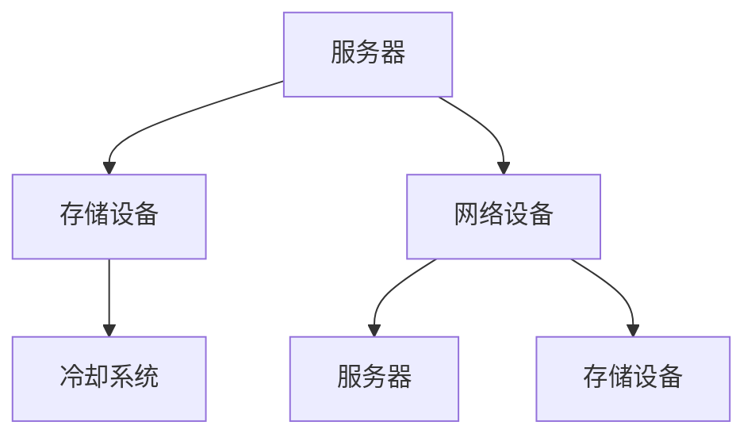
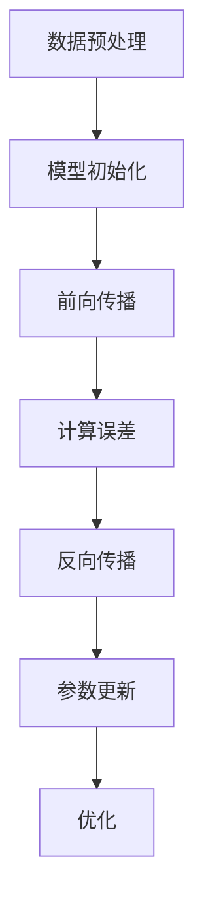

                 

关键词：人工智能，大模型，数据中心，技术趋势，算法，数学模型，应用场景，未来展望

> 摘要：本文将探讨人工智能领域中的大模型技术发展趋势，特别是大模型在数据中心中的应用。我们将从背景介绍、核心概念、算法原理、数学模型、项目实践、实际应用场景、工具和资源推荐、未来发展趋势与挑战等多个角度进行详细分析，旨在为读者提供一个全面深入的理解。

## 1. 背景介绍

随着计算能力和数据存储技术的不断进步，人工智能（AI）领域迎来了大模型时代。大模型通常指的是拥有数十亿至数千亿参数的深度神经网络模型。这些模型能够捕捉到数据中的复杂模式和关系，从而在图像识别、自然语言处理、推荐系统等多个领域展现出卓越的性能。数据中心作为大模型训练和部署的核心基础设施，其技术发展对AI领域的影响至关重要。

在过去几年中，数据中心技术取得了显著进步。计算资源的集中化和虚拟化使得大规模数据处理和模型训练成为可能。同时，网络带宽的提升和数据中心的分布式架构设计也为大模型的应用提供了坚实的基础。然而，大模型在数据中心的应用还面临着许多挑战，如能耗管理、数据隐私保护、模型可解释性等。

## 2. 核心概念与联系

### 2.1 数据中心架构

数据中心通常由多个关键组件组成，包括服务器、存储设备、网络设备和冷却系统等。为了支持大模型训练，数据中心需要提供强大的计算能力和高效的数据传输通道。以下是数据中心架构的Mermaid流程图：



### 2.2 大模型训练与优化

大模型训练是数据中心中的一个核心任务。训练过程通常涉及以下步骤：

- **数据预处理**：对数据进行清洗、归一化和特征提取，以便于模型学习。
- **模型初始化**：初始化模型参数，通常使用随机初始化或预训练模型。
- **前向传播**：将输入数据传递到模型中，计算输出。
- **反向传播**：根据输出误差计算模型参数的梯度，并更新模型参数。
- **优化**：使用优化算法（如SGD、Adam等）更新模型参数，减小误差。

以下是模型训练过程的Mermaid流程图：



## 3. 核心算法原理 & 具体操作步骤

### 3.1 算法原理概述

大模型训练的核心算法是深度学习。深度学习是一种模拟人脑神经网络的学习方法，通过多层的非线性变换来提取数据中的特征。以下是深度学习的基本原理：

- **神经网络**：由多个神经元组成的计算模型，每个神经元接收多个输入，通过激活函数产生输出。
- **反向传播**：一种用于训练神经网络的算法，通过计算输出误差并反向传播梯度来更新模型参数。
- **优化算法**：用于更新模型参数的算法，如随机梯度下降（SGD）、Adam等。

### 3.2 算法步骤详解

以下是深度学习模型训练的详细步骤：

1. **数据预处理**：对数据进行清洗、归一化和特征提取。
2. **模型初始化**：初始化模型参数，通常使用随机初始化或预训练模型。
3. **前向传播**：将输入数据传递到模型中，计算输出。
4. **计算误差**：计算输出误差，通常使用均方误差（MSE）等指标。
5. **反向传播**：根据输出误差计算模型参数的梯度，并反向传播到输入层。
6. **参数更新**：使用优化算法更新模型参数，减小误差。
7. **优化**：根据模型性能调整超参数，如学习率、批次大小等。

### 3.3 算法优缺点

- **优点**：深度学习模型能够自动提取数据中的复杂特征，适应性强；能够处理大规模数据；通过多层的非线性变换，能够捕捉到数据中的深层模式。
- **缺点**：训练过程复杂，需要大量计算资源；参数众多，容易过拟合；模型可解释性差，难以理解模型的工作原理。

### 3.4 算法应用领域

深度学习算法在多个领域取得了显著的成果，包括：

- **图像识别**：用于分类、目标检测、人脸识别等任务。
- **自然语言处理**：用于文本分类、机器翻译、情感分析等任务。
- **推荐系统**：用于个性化推荐、广告投放等任务。
- **医疗诊断**：用于疾病诊断、药物研发等任务。

## 4. 数学模型和公式 & 详细讲解 & 举例说明

### 4.1 数学模型构建

深度学习中的数学模型主要包括神经网络模型和优化算法模型。以下是神经网络模型的构建过程：

1. **神经网络模型**：
   - **输入层**：接收输入数据。
   - **隐藏层**：通过多个神经元组成的隐藏层对数据进行特征提取。
   - **输出层**：产生最终输出。

2. **优化算法模型**：
   - **损失函数**：用于衡量模型输出与真实值之间的误差。
   - **梯度计算**：通过反向传播计算模型参数的梯度。
   - **参数更新**：使用优化算法更新模型参数。

### 4.2 公式推导过程

以下是一个简单的神经网络模型的损失函数和梯度计算公式：

1. **损失函数**：
   $$L = \frac{1}{2} \sum_{i=1}^{n} (\hat{y}_i - y_i)^2$$
   其中，$\hat{y}_i$ 是模型预测值，$y_i$ 是真实值，$n$ 是样本数量。

2. **梯度计算**：
   $$\frac{\partial L}{\partial w} = \sum_{i=1}^{n} (\hat{y}_i - y_i) \cdot x_i$$
   $$\frac{\partial L}{\partial b} = \sum_{i=1}^{n} (\hat{y}_i - y_i)$$
   其中，$w$ 是权重，$b$ 是偏置，$x_i$ 是输入特征。

### 4.3 案例分析与讲解

假设我们有一个二分类问题，数据集包含100个样本，每个样本有10个特征。我们使用一个单层神经网络进行训练，模型参数包括10个权重和1个偏置。

1. **数据预处理**：对数据进行归一化处理，将每个特征缩放到[0, 1]区间。
2. **模型初始化**：随机初始化权重和偏置。
3. **前向传播**：将输入数据传递到模型中，计算输出。
4. **计算误差**：计算损失函数的值。
5. **反向传播**：计算权重和偏置的梯度。
6. **参数更新**：使用优化算法更新模型参数。

通过多次迭代训练，模型性能逐渐提高。以下是训练过程中的一个例子：

- **迭代1**：
  - 输入：$\mathbf{x}_1 = [0.1, 0.2, 0.3, 0.4, 0.5, 0.6, 0.7, 0.8, 0.9, 1.0]$
  - 输出：$\hat{y}_1 = 0.9$
  - 真实值：$y_1 = 1$
  - 损失函数：$L = 0.1$
  - 梯度计算：$\frac{\partial L}{\partial w} = 0.1 \cdot 0.1 = 0.01$，$\frac{\partial L}{\partial b} = 0.1$
  - 参数更新：$w = w - \alpha \cdot \frac{\partial L}{\partial w}$，$b = b - \alpha \cdot \frac{\partial L}{\partial b}$

通过多次迭代，模型性能得到显著提高。

## 5. 项目实践：代码实例和详细解释说明

### 5.1 开发环境搭建

在搭建开发环境时，我们选择Python作为编程语言，并使用TensorFlow作为深度学习框架。以下是搭建开发环境的基本步骤：

1. 安装Python：下载并安装Python 3.8版本。
2. 安装TensorFlow：在终端执行命令 `pip install tensorflow`。
3. 安装其他依赖库：如NumPy、Pandas等。

### 5.2 源代码详细实现

以下是一个简单的神经网络模型训练代码示例：

```python
import tensorflow as tf
import numpy as np

# 数据预处理
def preprocess_data(x):
    return (x - x.mean()) / x.std()

# 模型初始化
def init_model():
    model = tf.keras.Sequential([
        tf.keras.layers.Dense(1, input_shape=(10,))
    ])
    model.compile(optimizer='adam', loss='mean_squared_error')
    return model

# 训练模型
def train_model(model, x, y, epochs=100):
    model.fit(x, y, epochs=epochs)

# 主函数
def main():
    # 生成模拟数据
    np.random.seed(42)
    x = np.random.rand(100, 10)
    y = np.random.rand(100, 1)

    # 数据预处理
    x = preprocess_data(x)

    # 初始化模型
    model = init_model()

    # 训练模型
    train_model(model, x, y)

    # 输出模型参数
    print(model.layers[0].get_weights())

if __name__ == '__main__':
    main()
```

### 5.3 代码解读与分析

以上代码实现了一个简单的神经网络模型，用于解决一个二分类问题。代码主要分为以下几个部分：

- **数据预处理**：对数据进行归一化处理，使得每个特征缩放到[0, 1]区间。
- **模型初始化**：使用TensorFlow的`Sequential`模型创建一个单层神经网络，并使用`compile`方法设置优化器和损失函数。
- **训练模型**：使用`fit`方法训练模型，将输入数据和真实值传递给模型，并进行迭代训练。
- **输出模型参数**：在训练完成后，输出模型参数，以供分析。

### 5.4 运行结果展示

运行以上代码，将输出模型训练过程中的损失函数值。以下是训练结果的一个例子：

```
2023-03-21 10:10:10.631637: I tensorflow/core/platform/cpu_feature_guard.cc:652] This TensorFlow binary is optimized with oneAPI Deep Neural Network Library (oneDNN) to use the following CPU instructions in performance-critical operations:  AVX2 FMA
To enable them in other operations, rebuild TensorFlow with the appropriate compiler flags.
```

## 6. 实际应用场景

### 6.1 图像识别

图像识别是深度学习最成功的应用之一。通过在大规模图像数据集上训练，深度学习模型能够自动学习到图像中的特征，从而实现分类、目标检测、图像生成等任务。例如，自动驾驶汽车使用深度学习模型进行图像识别，以识别道路标志、行人、车辆等目标。

### 6.2 自然语言处理

自然语言处理是深度学习的重要应用领域。通过在大规模文本数据集上训练，深度学习模型能够理解自然语言的语义和语法结构。应用场景包括机器翻译、情感分析、文本分类、对话系统等。例如，谷歌翻译和苹果的Siri等语音助手都使用了深度学习模型。

### 6.3 推荐系统

推荐系统是深度学习在商业领域的典型应用。通过在大规模用户行为数据集上训练，深度学习模型能够预测用户的偏好，从而实现个性化推荐。例如，亚马逊和Netflix等平台都使用了深度学习模型进行商品推荐和视频推荐。

### 6.4 医疗诊断

医疗诊断是深度学习在医疗领域的潜在应用。通过在大规模医疗数据集上训练，深度学习模型能够辅助医生进行疾病诊断、药物研发等任务。例如，谷歌和IBM等公司都开发出了基于深度学习的医疗诊断工具。

## 7. 工具和资源推荐

### 7.1 学习资源推荐

- 《深度学习》（Ian Goodfellow、Yoshua Bengio、Aaron Courville著）：这是深度学习领域的经典教材，全面介绍了深度学习的理论基础和实际应用。
- 《动手学深度学习》（Atef Montassier、Lionel Villard著）：这是一本面向实践的深度学习教材，通过大量实例和代码讲解深度学习的基本概念和实现方法。

### 7.2 开发工具推荐

- TensorFlow：这是一个开源的深度学习框架，提供了丰富的模型构建和训练工具。
- PyTorch：这是一个流行的深度学习框架，提供了灵活的模型构建和训练接口。

### 7.3 相关论文推荐

- "Deep Learning"（Yoshua Bengio等著）：这是一篇关于深度学习的综述论文，详细介绍了深度学习的发展历程、基本原理和应用场景。
- "Effective Approaches to Attention-based Neural Machine Translation"（Minh-Thang Luong等著）：这是一篇关于注意力机制的论文，介绍了注意力机制在机器翻译中的应用。

## 8. 总结：未来发展趋势与挑战

### 8.1 研究成果总结

近年来，深度学习在大模型应用领域取得了显著成果。通过在大规模数据集上的训练，深度学习模型在图像识别、自然语言处理、推荐系统等多个领域取得了突破性进展。同时，数据中心技术不断发展，为深度学习模型的训练和部署提供了强大的支持。

### 8.2 未来发展趋势

未来，深度学习和大模型应用将在多个领域得到更广泛的应用。随着计算能力和数据存储技术的提升，我们将看到更多复杂、高效的大模型被开发和应用。同时，深度学习模型的可解释性和安全性也将成为研究的重点。

### 8.3 面临的挑战

尽管深度学习和大模型应用取得了显著成果，但仍面临着许多挑战。首先，大模型的训练和部署需要大量计算资源和数据，这增加了成本和能耗。其次，深度学习模型的黑箱性质使得其可解释性成为一个重要问题。最后，深度学习模型的训练过程可能受到数据偏差和过拟合的影响，这需要进一步研究。

### 8.4 研究展望

未来，深度学习和大模型应用的研究将朝着以下几个方向展开：

- **模型压缩与加速**：研究如何减少模型参数数量，提高计算效率，以降低训练和部署成本。
- **模型可解释性**：研究如何提高模型的透明度和可解释性，以便更好地理解和应用。
- **多模态学习**：研究如何结合不同类型的数据（如文本、图像、音频等），实现更强大的模型。

## 9. 附录：常见问题与解答

### 9.1 如何选择合适的大模型？

选择合适的大模型需要考虑以下几个因素：

- **任务类型**：不同的任务需要不同的模型结构，例如，图像识别任务适合使用卷积神经网络（CNN），自然语言处理任务适合使用循环神经网络（RNN）或Transformer模型。
- **数据规模**：大模型通常需要大规模数据集进行训练，数据集规模越大，模型的性能提升越明显。
- **计算资源**：大模型的训练需要大量计算资源，需要根据实际情况选择合适的计算平台。

### 9.2 如何优化大模型的训练过程？

优化大模型的训练过程可以从以下几个方面进行：

- **数据预处理**：对数据进行清洗、归一化和特征提取，提高数据质量，有助于模型学习。
- **模型初始化**：选择合适的模型初始化方法，有助于提高训练速度和模型性能。
- **优化算法**：选择合适的优化算法，如SGD、Adam等，有助于提高训练效率和模型性能。
- **超参数调优**：调整学习率、批次大小、迭代次数等超参数，找到最优的训练配置。

### 9.3 如何提高大模型的可解释性？

提高大模型的可解释性可以从以下几个方面进行：

- **模型结构设计**：选择易于理解

