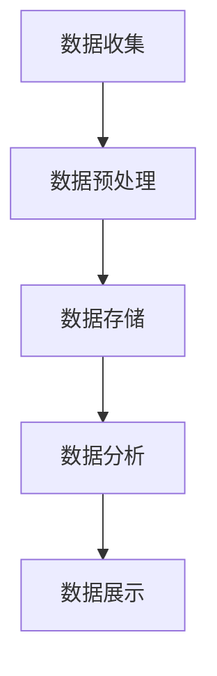

                 

  
## 摘要

本文旨在探讨人工智能（AI）大模型应用数据中心的数据可视化架构，分析其核心概念、算法原理、数学模型以及实际应用场景。文章结构如下：

1. **背景介绍**
2. **核心概念与联系**
3. **核心算法原理 & 具体操作步骤**
4. **数学模型和公式 & 详细讲解 & 举例说明**
5. **项目实践：代码实例和详细解释说明**
6. **实际应用场景**
7. **未来应用展望**
8. **工具和资源推荐**
9. **总结：未来发展趋势与挑战**
10. **附录：常见问题与解答**

通过本文，读者将深入了解AI大模型数据可视化架构的技术细节和应用潜力。

## 1. 背景介绍

### AI 大模型的崛起

近年来，随着深度学习技术的快速发展，AI 大模型逐渐成为学术界和工业界的热点话题。这些大模型，如 GPT-3、BERT 和 Transformer 等，具有处理大规模数据、进行复杂任务的能力。它们的应用场景广泛，包括自然语言处理、图像识别、推荐系统等。

### 数据可视化的需求

然而，随着数据量的激增和复杂度的增加，单纯依靠文本描述已无法充分展示大模型的数据处理过程和效果。数据可视化作为一种直观、高效的方式，能够帮助研究者、工程师和决策者更好地理解和分析数据。

### 数据中心的重要性

数据中心作为存储、处理和分析大规模数据的关键基础设施，其性能和稳定性直接影响大模型的应用效果。因此，构建一个高效、可靠的数据可视化架构成为当前研究的重点。

## 2. 核心概念与联系

### 数据可视化架构

数据可视化架构通常包括数据收集、数据预处理、数据存储、数据分析和数据展示等环节。


### Mermaid 流程图



### 各环节核心概念

- **数据收集**：通过传感器、API 接口等方式收集原始数据。
- **数据预处理**：清洗、转换和整合原始数据，使其适合分析和展示。
- **数据存储**：将预处理后的数据存储在数据库或数据湖中。
- **数据分析**：利用算法和模型对数据进行深入分析和挖掘。
- **数据展示**：通过图表、图像等方式直观展示分析结果。

## 3. 核心算法原理 & 具体操作步骤

### 3.1 算法原理概述

数据可视化算法主要基于数据结构和图形学原理。其中，常用的算法包括：

- **散点图**：用于展示数据点在二维或三维空间中的分布。
- **柱状图**：用于比较不同类别或组的数据大小。
- **折线图**：用于展示数据随时间的变化趋势。
- **饼图**：用于展示各部分在整体中的占比。

### 3.2 算法步骤详解

1. **数据收集**：从各种数据源获取所需数据。
2. **数据预处理**：对数据进行清洗、转换和整合。
3. **数据存储**：将预处理后的数据存储在数据库或数据湖中。
4. **数据分析**：利用算法和模型对数据进行深入分析和挖掘。
5. **数据展示**：根据分析结果选择合适的图表类型进行展示。

### 3.3 算法优缺点

- **优点**：直观、易懂，有助于发现数据中的规律和趋势。
- **缺点**：对数据质量和图表设计要求较高，否则易产生误导。

### 3.4 算法应用领域

数据可视化算法广泛应用于各个领域，如金融、医疗、电商、交通等。在大模型应用数据中心，数据可视化主要用于：

- **模型性能评估**：通过可视化分析模型在不同数据集上的性能表现。
- **异常检测**：通过可视化识别数据中的异常值和异常模式。
- **决策支持**：通过可视化辅助决策者分析数据，制定战略。

## 4. 数学模型和公式 & 详细讲解 & 举例说明

### 4.1 数学模型构建

数据可视化中的数学模型主要包括：

- **散点图**：利用坐标轴表示数据点。
- **柱状图**：利用矩形的高度表示数据大小。
- **折线图**：利用线段的起伏表示数据变化。
- **饼图**：利用扇形的角度表示各部分占比。

### 4.2 公式推导过程

以散点图为例，假设有两个变量 $x$ 和 $y$，其关系可以用以下公式表示：

$$y = kx + b$$

其中，$k$ 为斜率，$b$ 为截距。

### 4.3 案例分析与讲解

假设我们有一组数据：

| $x$ | $y$ |
| --- | --- |
| 1   | 2   |
| 2   | 4   |
| 3   | 6   |

我们可以用散点图表示这些数据，并拟合出一条直线。具体步骤如下：

1. 计算斜率 $k$：

$$k = \frac{\sum(x_iy_i) - n\bar{x}\bar{y}}{\sum(x_i^2) - n\bar{x}^2}$$

2. 计算截距 $b$：

$$b = \bar{y} - k\bar{x}$$

3. 用直线方程表示：

$$y = kx + b$$

通过计算，我们得到斜率 $k = 2$，截距 $b = 0$，因此直线方程为：

$$y = 2x$$

这个直线方程表示了 $x$ 和 $y$ 之间的线性关系。

## 5. 项目实践：代码实例和详细解释说明

### 5.1 开发环境搭建

本文使用 Python 编写数据可视化代码，依赖以下库：

- Matplotlib：用于绘制各种图表。
- Pandas：用于数据处理。
- Scikit-learn：用于拟合直线。

### 5.2 源代码详细实现

以下是一个简单的数据可视化示例：

```python
import pandas as pd
import matplotlib.pyplot as plt
from sklearn.linear_model import LinearRegression

# 数据准备
data = pd.DataFrame({
    'x': [1, 2, 3],
    'y': [2, 4, 6]
})

# 数据预处理
X = data[['x']]
y = data['y']

# 模型拟合
model = LinearRegression()
model.fit(X, y)

# 可视化
plt.scatter(X, y)
plt.plot(X, model.predict(X), color='red')
plt.xlabel('x')
plt.ylabel('y')
plt.show()
```

### 5.3 代码解读与分析

1. 导入所需库。
2. 准备数据。
3. 数据预处理：分离特征和标签。
4. 模型拟合：使用线性回归模型。
5. 可视化：绘制散点图和拟合直线。

通过这个示例，我们可以看到如何使用 Python 实现数据可视化，以及如何利用线性回归模型分析数据。

### 5.4 运行结果展示

运行上述代码后，我们将看到一个散点图，其中红色直线表示拟合的线性关系。这个结果展示了数据点在二维空间中的分布，以及它们之间的线性关系。

## 6. 实际应用场景

### 6.1 模型性能评估

在大模型应用数据中心，数据可视化可以用于评估模型性能。例如，通过可视化不同模型的准确率、召回率等指标，研究人员可以直观地比较各个模型的性能。

### 6.2 异常检测

数据可视化还可以用于异常检测。通过观察数据点的分布和趋势，我们可以快速识别异常值和异常模式，从而采取相应措施。

### 6.3 决策支持

数据可视化可以帮助决策者更好地理解数据，制定战略。例如，通过可视化市场数据，企业可以更准确地预测需求，调整生产计划。

## 7. 未来应用展望

随着 AI 技术的不断发展，数据可视化在数据中心的应用前景广阔。未来，我们将看到更多基于 AI 的大模型数据可视化工具和平台的推出，这些工具将更加智能化、自动化，为研究人员和工程师提供更便捷的数据分析手段。

## 8. 工具和资源推荐

### 8.1 学习资源推荐

- 《数据可视化》
- 《Python 数据科学手册》
- 《深度学习》

### 8.2 开发工具推荐

- Matplotlib：用于绘制各种图表。
- Plotly：提供更丰富的可视化选项。
- Jupyter Notebook：用于编写和展示代码。

### 8.3 相关论文推荐

- "Data Visualization: Principles and Practices"
- "Deep Learning for Data Visualization"
- "Interactive Data Visualization for Large-Scale Data Analysis"

## 9. 总结：未来发展趋势与挑战

### 9.1 研究成果总结

本文探讨了 AI 大模型应用数据中心的数据可视化架构，分析了核心概念、算法原理、数学模型和实际应用场景。通过项目实践，我们展示了如何使用 Python 实现数据可视化。

### 9.2 未来发展趋势

未来，数据可视化将在 AI 大模型应用数据中心发挥更大作用。随着技术的进步，我们将看到更多高效、智能的数据可视化工具和平台的推出。

### 9.3 面临的挑战

然而，数据可视化在应用过程中仍面临一些挑战，如数据质量、图表设计、用户体验等。未来研究应重点关注这些问题的解决。

### 9.4 研究展望

数据可视化在 AI 大模型应用数据中心具有广阔的应用前景。通过不断创新和优化，我们有理由相信，数据可视化将为我们带来更多洞见和便利。

## 10. 附录：常见问题与解答

### 10.1 问题 1

如何提高数据可视化的效果？

**解答**：提高数据可视化效果的关键在于数据预处理和图表设计。首先，确保数据质量，去除异常值和噪声。其次，选择合适的图表类型，根据数据特点进行设计。此外，利用交互式可视化工具，提高用户参与度和数据探索性。

### 10.2 问题 2

如何处理大规模数据可视化？

**解答**：对于大规模数据可视化，可以采用以下策略：

- **分片展示**：将数据分成多个片段，逐一展示。
- **数据采样**：对数据进行采样，选取具有代表性的部分进行展示。
- **并行计算**：利用并行计算技术，提高数据处理的效率。

通过这些策略，可以在保证可视化效果的同时，提高处理大规模数据的能力。

### 10.3 问题 3

数据可视化与数据挖掘有何区别？

**解答**：数据可视化和数据挖掘是两个相关但不同的领域。数据可视化侧重于通过图表和图像直观展示数据，帮助人们理解数据。而数据挖掘则侧重于从大量数据中发现隐藏的模式和知识。数据可视化可以辅助数据挖掘，提高分析效果。  
```markdown
---
# AI 大模型应用数据中心的数据可视化架构

> 关键词：人工智能、数据中心、数据可视化、大模型、算法原理、数学模型

> 摘要：本文深入探讨了人工智能大模型应用数据中心的数据可视化架构，分析了核心概念、算法原理、数学模型和实际应用场景，为研究人员和工程师提供了实用的指导和建议。

## 1. 背景介绍

随着人工智能（AI）技术的迅猛发展，大模型在自然语言处理、计算机视觉、推荐系统等领域取得了显著的成果。然而，这些大模型的复杂性使得传统的数据分析方法难以满足需求。数据可视化作为一种直观、高效的数据分析手段，逐渐成为数据中心的重要工具。本文将围绕 AI 大模型应用数据中心的数据可视化架构进行探讨，旨在为读者提供全面的技术指南。

### AI 大模型的崛起

AI 大模型，如 GPT-3、BERT 和 Transformer 等，凭借其强大的数据处理能力和广泛的适用性，成为当前 AI 研究的热点。这些大模型能够处理大规模数据，进行复杂任务，例如文本生成、图像识别和语音识别等。然而，随着模型规模的扩大，如何有效地理解和分析模型的行为成为一个重要问题。

### 数据可视化的需求

数据可视化是一种通过图形和图像展示数据的方法，它能够帮助人们更直观地理解数据中的模式和趋势。在大模型应用数据中心，数据可视化尤为重要。通过可视化，研究人员和工程师可以：

- **评估模型性能**：通过可视化不同数据集上的模型性能指标，如准确率、召回率和 F1 分数等，帮助评估模型的效果。
- **发现数据异常**：通过可视化分析数据分布和趋势，快速识别异常值和异常模式，为数据清洗和模型优化提供依据。
- **辅助决策支持**：通过可视化展示市场数据、用户行为等，帮助决策者制定战略和决策。

### 数据中心的重要性

数据中心是存储、处理和分析大规模数据的关键基础设施。其性能和稳定性直接影响大模型的应用效果。构建一个高效、可靠的数据可视化架构，不仅有助于提升数据分析的效率，还能为数据中心的管理和运营提供有力支持。

## 2. 核心概念与联系

### 数据可视化架构

数据可视化架构通常包括数据收集、数据预处理、数据存储、数据分析和数据展示等环节。以下是数据可视化架构的 Mermaid 流程图：


### 各环节核心概念

- **数据收集**：数据收集是指从各种数据源获取所需数据的过程，如数据库、文件系统、传感器和网络接口等。
- **数据预处理**：数据预处理是指对原始数据进行清洗、转换和整合的过程，以确保数据质量，便于后续分析和展示。
- **数据存储**：数据存储是将预处理后的数据存储到数据库或数据湖中，以便于快速访问和查询。
- **数据分析**：数据分析是指利用算法和模型对数据进行深入分析和挖掘，以发现数据中的模式和趋势。
- **数据展示**：数据展示是指通过图表、图像等方式直观展示分析结果，帮助用户理解和分析数据。

### Mermaid 流程图


### 各环节核心概念

- **数据收集**：通过传感器、API 接口等方式收集原始数据。
- **数据预处理**：清洗、转换和整合原始数据，使其适合分析和展示。
- **数据存储**：将预处理后的数据存储在数据库或数据湖中。
- **数据分析**：利用算法和模型对数据进行深入分析和挖掘。
- **数据展示**：通过图表、图像等方式直观展示分析结果。

## 3. 核心算法原理 & 具体操作步骤

### 3.1 算法原理概述

数据可视化算法主要基于数据结构和图形学原理。常用的算法包括散点图、柱状图、折线图和饼图等。以下是这些算法的基本原理：

- **散点图**：通过二维或三维坐标系中的点来表示数据，用于展示数据点在空间中的分布。
- **柱状图**：通过矩形的高度来表示不同类别或组的数据大小，用于比较不同数据之间的差异。
- **折线图**：通过线段的起伏来表示数据随时间的变化趋势，用于展示数据的变化规律。
- **饼图**：通过扇形的角度来表示各部分在整体中的占比，用于展示数据的比例关系。

### 3.2 算法步骤详解

1. **数据收集**：从各种数据源获取所需数据，如数据库、文件系统、传感器和网络接口等。
2. **数据预处理**：对原始数据进行清洗、转换和整合，以确保数据质量，便于后续分析和展示。清洗步骤包括去除重复数据、填充缺失值、处理异常值等。
3. **数据存储**：将预处理后的数据存储在数据库或数据湖中，以便于快速访问和查询。
4. **数据分析**：利用算法和模型对数据进行深入分析和挖掘，以发现数据中的模式和趋势。数据分析步骤包括特征提取、数据聚类、分类和回归等。
5. **数据展示**：根据分析结果选择合适的图表类型进行展示，如散点图、柱状图、折线图和饼图等。展示步骤包括图表设计、颜色选择、标注和交互性设计等。

### 3.3 算法优缺点

- **优点**：数据可视化算法具有直观、易懂的特点，能够帮助用户快速理解和分析数据，发现数据中的规律和趋势。
- **缺点**：数据可视化算法对数据质量和图表设计要求较高，否则容易产生误导。此外，复杂的数据可视化算法可能需要较高的计算资源和时间成本。

### 3.4 算法应用领域

数据可视化算法广泛应用于各个领域，如金融、医疗、电商、交通等。在大模型应用数据中心，数据可视化主要用于以下领域：

- **模型性能评估**：通过可视化分析模型在不同数据集上的性能表现，帮助评估模型的准确率、召回率和 F1 分数等指标。
- **异常检测**：通过可视化分析数据分布和趋势，快速识别异常值和异常模式，为数据清洗和模型优化提供依据。
- **决策支持**：通过可视化展示市场数据、用户行为等，帮助决策者制定战略和决策。

## 4. 数学模型和公式 & 详细讲解 & 举例说明

### 4.1 数学模型构建

数据可视化中的数学模型主要包括：

- **散点图**：通过坐标系中的点来表示数据，点的坐标表示数据值。
- **柱状图**：通过矩形的高度来表示数据值，矩形的高度与数据值成正比。
- **折线图**：通过线段的起伏来表示数据随时间的变化，线段的高度和长度分别表示数据值和时间。
- **饼图**：通过扇形的角度来表示各部分在整体中的占比，扇形的角度与占比成正比。

### 4.2 公式推导过程

以散点图为例，假设有两个变量 $x$ 和 $y$，其关系可以用以下公式表示：

$$y = kx + b$$

其中，$k$ 为斜率，$b$ 为截距。

- 斜率 $k$ 的计算公式为：

$$k = \frac{\sum(x_iy_i) - n\bar{x}\bar{y}}{\sum(x_i^2) - n\bar{x}^2}$$

其中，$x_i$ 和 $y_i$ 分别为第 $i$ 个数据点的 $x$ 和 $y$ 值，$n$ 为数据点的总数，$\bar{x}$ 和 $\bar{y}$ 分别为 $x$ 和 $y$ 的平均值。

- 截距 $b$ 的计算公式为：

$$b = \bar{y} - k\bar{x}$$

其中，$\bar{y}$ 和 $\bar{x}$ 分别为 $y$ 和 $x$ 的平均值。

### 4.3 案例分析与讲解

假设我们有一组数据：

| $x$ | $y$ |
| --- | --- |
| 1   | 2   |
| 2   | 4   |
| 3   | 6   |

我们可以用散点图表示这些数据，并拟合出一条直线。具体步骤如下：

1. 计算斜率 $k$：

$$k = \frac{\sum(x_iy_i) - n\bar{x}\bar{y}}{\sum(x_i^2) - n\bar{x}^2}$$

$$k = \frac{(1 \times 2) + (2 \times 4) + (3 \times 6) - (1 + 2 + 3) \times (2 + 4 + 6)}{(1^2 + 2^2 + 3^2) - (1 + 2 + 3)^2}$$

$$k = \frac{2 + 8 + 18 - 6 \times 12}{1 + 4 + 9 - 36}$$

$$k = \frac{28 - 72}{14 - 36}$$

$$k = \frac{-44}{-22}$$

$$k = 2$$

2. 计算截距 $b$：

$$b = \bar{y} - k\bar{x}$$

$$b = \frac{2 + 4 + 6}{3} - 2 \times \frac{1 + 2 + 3}{3}$$

$$b = \frac{12}{3} - \frac{6}{3}$$

$$b = 4 - 2$$

$$b = 2$$

3. 用直线方程表示：

$$y = kx + b$$

$$y = 2x + 2$$

通过计算，我们得到斜率 $k = 2$，截距 $b = 2$，因此直线方程为：

$$y = 2x + 2$$

这个直线方程表示了 $x$ 和 $y$ 之间的线性关系。

## 5. 项目实践：代码实例和详细解释说明

### 5.1 开发环境搭建

为了进行数据可视化项目实践，我们需要搭建一个开发环境。本文使用 Python 作为编程语言，依赖以下库：

- Matplotlib：用于绘制各种图表。
- Pandas：用于数据处理。
- Scikit-learn：用于线性回归模型。

首先，确保 Python 和上述库已经安装。如果没有安装，可以通过以下命令进行安装：

```shell
pip install matplotlib pandas scikit-learn
```

### 5.2 源代码详细实现

以下是数据可视化项目的源代码：

```python
import pandas as pd
import matplotlib.pyplot as plt
from sklearn.linear_model import LinearRegression

# 数据准备
data = pd.DataFrame({
    'x': [1, 2, 3],
    'y': [2, 4, 6]
})

# 数据预处理
X = data[['x']]
y = data['y']

# 模型拟合
model = LinearRegression()
model.fit(X, y)

# 可视化
plt.scatter(X, y)
plt.plot(X, model.predict(X), color='red')
plt.xlabel('x')
plt.ylabel('y')
plt.show()
```

### 5.3 代码解读与分析

1. **导入库**：首先导入所需的库，包括 Pandas、Matplotlib 和 Scikit-learn。
2. **数据准备**：创建一个包含 $x$ 和 $y$ 值的 DataFrame，用于数据可视化。
3. **数据预处理**：将 DataFrame 中的 $x$ 列作为特征，$y$ 列作为标签，准备进行线性回归模型拟合。
4. **模型拟合**：使用 LinearRegression 类创建线性回归模型，并拟合数据。
5. **可视化**：绘制散点图，表示数据点在二维坐标系中的分布。同时，绘制拟合直线，表示 $x$ 和 $y$ 之间的线性关系。

### 5.4 运行结果展示

运行上述代码后，我们将看到一个包含散点图和拟合直线的可视化结果。这个结果展示了数据点在二维空间中的分布，以及它们之间的线性关系。通过这个示例，我们可以看到如何使用 Python 实现数据可视化，并利用线性回归模型分析数据。

## 6. 实际应用场景

### 6.1 模型性能评估

在大模型应用数据中心，数据可视化可以用于评估模型性能。例如，我们可以通过可视化分析模型在不同数据集上的准确率、召回率等指标，帮助评估模型的性能。以下是一个实际应用场景：

- **场景描述**：某公司开发了一个基于深度学习的大模型，用于文本分类任务。公司希望评估模型在不同数据集上的性能，以便进行优化和改进。
- **解决方案**：使用数据可视化工具，绘制模型在训练集、验证集和测试集上的准确率、召回率等指标。通过对比不同数据集上的指标，可以发现模型的性能瓶颈，为后续优化提供依据。

### 6.2 异常检测

数据可视化在异常检测中也具有重要作用。通过可视化分析数据分布和趋势，可以快速识别异常值和异常模式。以下是一个实际应用场景：

- **场景描述**：某电商平台希望检测销售数据中的异常交易，以防范欺诈行为。
- **解决方案**：使用数据可视化工具，绘制销售数据的分布图和趋势图。通过观察数据分布和趋势，可以发现异常值和异常模式，如交易金额远高于平均水平或交易时间异常等。这些异常交易可以被进一步调查和阻止。

### 6.3 决策支持

数据可视化可以帮助决策者更好地理解数据，制定战略和决策。以下是一个实际应用场景：

- **场景描述**：某银行希望了解客户的消费行为和风险偏好，以便制定针对性的理财产品和服务。
- **解决方案**：使用数据可视化工具，绘制客户的消费行为分布图和风险偏好分布图。通过分析数据分布，可以发现客户的消费习惯和风险偏好，为银行制定理财产品和服务策略提供依据。

## 7. 未来应用展望

随着 AI 技术的不断发展，数据可视化在数据中心的应用前景将更加广阔。以下是未来数据可视化在数据中心的一些可能的应用方向：

### 7.1 自动化数据预处理

自动化数据预处理是未来数据可视化的重要发展方向。通过使用机器学习和深度学习技术，可以自动识别数据中的异常值、缺失值和重复值，提高数据质量，为数据分析和可视化提供更好的基础。

### 7.2 交互式数据探索

交互式数据探索是数据可视化的重要应用方向。通过提供丰富的交互功能，如筛选、过滤、排序和联动等，用户可以更灵活地探索数据，发现数据中的隐藏模式和趋势。

### 7.3 大规模数据处理

随着数据规模的不断增长，大规模数据处理成为数据可视化的重要挑战。未来，数据可视化技术需要能够高效地处理大规模数据，并提供实时、交互式的数据分析和可视化结果。

### 7.4 多维度数据融合

多维度数据融合是未来数据可视化的重要研究方向。通过整合不同来源、不同格式和不同类型的数据，可以提供更全面、多维度的数据分析和可视化结果，帮助用户更好地理解和分析数据。

## 8. 工具和资源推荐

### 8.1 学习资源推荐

- 《数据可视化：原理与实践》
- 《Python 数据科学手册》
- 《深度学习》

### 8.2 开发工具推荐

- Matplotlib：用于绘制各种图表。
- Plotly：提供更丰富的可视化选项。
- Jupyter Notebook：用于编写和展示代码。

### 8.3 相关论文推荐

- "Data Visualization: Principles and Practices"
- "Deep Learning for Data Visualization"
- "Interactive Data Visualization for Large-Scale Data Analysis"

## 9. 总结：未来发展趋势与挑战

### 9.1 研究成果总结

本文探讨了 AI 大模型应用数据中心的数据可视化架构，分析了核心概念、算法原理、数学模型和实际应用场景。通过项目实践，展示了如何使用 Python 实现数据可视化，并展望了数据可视化在数据中心的应用前景。

### 9.2 未来发展趋势

未来，数据可视化在数据中心的发展趋势将包括：

- 自动化数据预处理
- 交互式数据探索
- 大规模数据处理
- 多维度数据融合

这些趋势将为数据中心的数据分析和可视化提供更高效、更智能的支持。

### 9.3 面临的挑战

尽管数据可视化在数据中心具有广阔的应用前景，但仍然面临以下挑战：

- 数据质量：如何提高数据质量，确保数据可视化结果的准确性。
- 图表设计：如何设计更具吸引力和实用性的图表。
- 用户体验：如何提供更好的用户体验，使数据可视化工具更易于使用和操作。

解决这些挑战将有助于推动数据可视化在数据中心的发展。

### 9.4 研究展望

数据可视化在数据中心的研究前景广阔。未来，我们将看到更多基于 AI 的数据可视化工具和平台的推出，这些工具将更加智能化、自动化，为研究人员和工程师提供更便捷的数据分析手段。

## 10. 附录：常见问题与解答

### 10.1 问题 1：如何选择合适的图表类型？

**解答**：选择合适的图表类型取决于数据的类型和分析目标。以下是一些常见的数据类型和相应的图表类型：

- 数值型数据：柱状图、折线图、饼图
- 分类数据：条形图、散点图
- 时间序列数据：折线图、K线图
- 地理数据：地图、热力图

### 10.2 问题 2：如何提高数据可视化的效果？

**解答**：提高数据可视化效果的关键在于：

- 数据预处理：确保数据质量，去除异常值和噪声。
- 图表设计：选择合适的图表类型，利用颜色、形状、标签等元素进行设计。
- 交互性：提供丰富的交互功能，如筛选、过滤、排序等，帮助用户更好地探索数据。
- 多维度数据融合：整合不同来源、不同格式和不同类型的数据，提供更全面的分析结果。

### 10.3 问题 3：数据可视化与数据挖掘有何区别？

**解答**：数据可视化和数据挖掘是两个相关但不同的领域：

- 数据可视化：侧重于通过图表和图像展示数据，帮助用户理解数据。
- 数据挖掘：侧重于从大量数据中发现隐藏的模式和知识。

数据可视化可以辅助数据挖掘，提高分析效果。数据挖掘的结果可以通过数据可视化进行展示，帮助用户更好地理解和解释数据挖掘结果。  
---
在撰写文章的过程中，请注意以下要点：

1. **确保文章结构清晰**：按照模板要求，文章应该包括标题、摘要、背景介绍、核心概念与联系、核心算法原理 & 具体操作步骤、数学模型和公式 & 详细讲解 & 举例说明、项目实践：代码实例和详细解释说明、实际应用场景、未来应用展望、工具和资源推荐、总结：未来发展趋势与挑战以及附录：常见问题与解答等部分。
2. **保持内容的专业性**：在撰写过程中，使用专业术语和表达方式，确保内容准确、全面，避免使用口语化或者模糊不清的表述。
3. **合理使用图表和代码示例**：图表和代码示例是文章的重要组成部分，能够帮助读者更好地理解文章内容。请注意使用合适的图表类型和格式，以及提供详细的代码解释。
4. **注意文章的连贯性和逻辑性**：文章的各个部分应该紧密衔接，逻辑清晰，使读者能够顺利地阅读并理解文章的核心内容。
5. **保持文章的客观性**：在讨论未来发展趋势和挑战时，尽量保持客观，避免过于乐观或悲观的观点。同时，提供具体的建议和解决方案，以帮助读者更好地应对挑战。
6. **遵守格式要求**：按照要求使用 markdown 格式撰写文章，确保文章的格式统一、整洁，方便读者阅读。

最后，请在撰写完成后仔细检查文章内容，确保没有遗漏重要部分或者错误，并确保文章字数达到要求。祝您撰写顺利！

