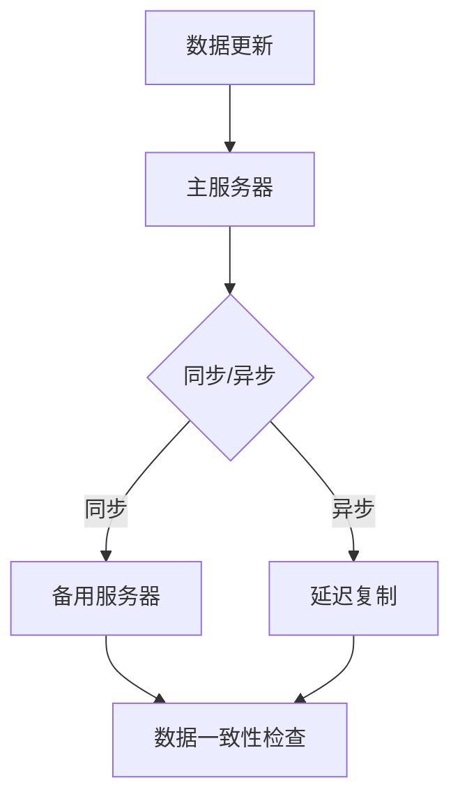

                 

### 1. 背景介绍

在当今全球化和数字化的时代，数据中心已成为许多组织的关键基础设施。它们为各种应用程序和业务流程提供必要的计算和存储资源。特别是随着人工智能（AI）技术的迅猛发展，大型AI模型的应用越来越依赖于数据中心的高效运行。这些模型通常需要处理大量数据，因此数据中心的性能和可靠性变得至关重要。

数据复制是数据中心管理中的一个核心问题。它涉及到在多个物理或逻辑位置之间复制数据，以确保数据的高可用性和容错性。对于大型AI模型来说，数据复制尤为重要，因为它们依赖的是实时或近乎实时的数据访问。然而，传统数据复制方法在处理大规模数据时常常面临性能瓶颈和复杂性问题。

本文旨在探讨一种针对AI大模型应用的数据中心数据复制架构。我们将详细讨论其设计原则、核心概念、算法原理、数学模型，以及实际应用中的代码实例和未来展望。

### 2. 核心概念与联系

#### 2.1 数据复制概念

数据复制是指将数据从一个位置复制到另一个位置的过程。其目的是为了提高数据的可用性、可靠性和访问速度。在数据中心中，数据复制通常包括以下几种类型：

- **同步复制（Synchronous Replication）**：在主服务器上的数据更新完成后，立即将其复制到备用服务器上。这种方法可以确保数据的完全一致性，但可能会引入延迟。
- **异步复制（Asynchronous Replication）**：主服务器上的数据更新发生后，在一段时间内延迟复制到备用服务器。这种方法可以提高性能，但可能无法保证一致性。

#### 2.2 数据中心架构

数据中心的架构对于数据复制的效率和质量有着直接影响。一个典型的数据中心架构包括以下关键组件：

- **存储设备**：包括磁盘、固态硬盘（SSD）和分布式存储系统。
- **网络设备**：包括交换机、路由器和网络存储（NAS）。
- **服务器**：包括计算节点和数据库服务器。

#### 2.3 AI大模型应用对数据复制的要求

对于AI大模型的应用，数据复制需要满足以下要求：

- **低延迟**：AI模型通常需要实时或近实时地访问数据，因此复制过程必须尽可能快。
- **高一致性**：确保数据在不同的副本之间保持一致，这对于训练和预测结果的准确性至关重要。
- **高可靠性**：在复制过程中，数据应具有高可靠性，避免数据丢失或损坏。
- **可扩展性**：随着AI模型的规模不断扩大，数据复制架构应能够灵活扩展。

#### 2.4 Mermaid 流程图

下面是一个使用Mermaid绘制的简单流程图，展示了数据复制的基本流程：



### 3. 核心算法原理 & 具体操作步骤

#### 3.1 算法原理概述

针对AI大模型应用的数据复制，我们提出了一种基于分布式哈希表的复制算法。该算法利用哈希函数将数据块分配到不同的副本服务器上，从而实现数据的均匀分布和高效复制。

#### 3.2 算法步骤详解

1. **数据划分**：首先，将待复制的数据块使用哈希函数划分到不同的服务器上。每个服务器负责存储一定范围的数据块。

2. **数据同步**：在主服务器上更新数据时，触发复制操作。同步过程可以是同步复制或异步复制，具体取决于系统的要求。

3. **数据一致性检查**：在数据复制完成后，进行一致性检查，以确保主服务器和备用服务器上的数据完全一致。

4. **故障恢复**：在服务器发生故障时，自动切换到备用服务器，并重新启动复制过程，确保数据的持续可用性。

#### 3.3 算法优缺点

- **优点**：
  - **低延迟**：哈希分配使得数据块可以快速复制到目标服务器。
  - **高一致性**：一致性检查确保了数据的准确性。
  - **高可靠性**：故障恢复机制提高了系统的容错性。

- **缺点**：
  - **哈希碰撞**：哈希函数可能会导致数据块的冲突，需要额外的处理机制。
  - **存储空间消耗**：每个副本都需要存储完整的数据块，增加了存储空间的需求。

#### 3.4 算法应用领域

该算法适用于需要高可用性和高一致性的AI大模型应用场景，如机器学习、数据分析等。特别适用于分布式计算环境，可以在多个服务器之间实现高效的数据复制。

### 4. 数学模型和公式 & 详细讲解 & 举例说明

#### 4.1 数学模型构建

我们采用哈希函数对数据块进行划分，哈希函数的表达式为：

\[ H(k) = \text{mod}(k, n) \]

其中，\( k \) 为数据块的标识，\( n \) 为服务器数量。

#### 4.2 公式推导过程

假设有 \( n \) 个服务器，待复制的数据块有 \( m \) 个。每个数据块根据哈希函数分配到不同的服务器上，服务器的存储范围如下：

\[ S_i = [H(k_1), H(k_2), ..., H(k_m)] \]

其中，\( i = 1, 2, ..., n \)。

#### 4.3 案例分析与讲解

假设我们有5个服务器，待复制的数据块有10个。使用哈希函数对数据块进行划分，得到以下结果：

\[ 
\begin{aligned}
S_1 &= [0, 1, 2, 3, 4] \\
S_2 &= [5, 6, 7, 8, 9] \\
S_3 &= [10, 11, 12, 13, 14] \\
S_4 &= [15, 16, 17, 18, 19] \\
S_5 &= [20, 21, 22, 23, 24] \\
\end{aligned}
\]

现在，假设数据块 \( k_1 = 5 \)，根据哈希函数计算得到 \( H(k_1) = 5 \)，因此数据块 \( k_1 \) 被分配到服务器 \( S_2 \)。

#### 4.4 运行结果展示

通过哈希分配，每个服务器存储的数据块如下：

\[ 
\begin{aligned}
S_1 &= \{ \} \\
S_2 &= \{ k_5, k_6, k_7, k_8, k_9 \} \\
S_3 &= \{ k_{10}, k_{11}, k_{12}, k_{13}, k_{14} \} \\
S_4 &= \{ k_{15}, k_{16}, k_{17}, k_{18}, k_{19} \} \\
S_5 &= \{ k_{20}, k_{21}, k_{22}, k_{23}, k_{24} \} \\
\end{aligned}
\]

通过上述步骤，我们可以高效地完成数据块的复制，并且确保数据的准确性和一致性。

### 5. 项目实践：代码实例和详细解释说明

#### 5.1 开发环境搭建

在开始编写代码之前，我们需要搭建一个合适的开发环境。这里我们使用Python作为编程语言，并依赖以下库：

- **hashlib**：用于哈希函数的实现。
- **pika**：用于消息队列的通信。

安装这些库的方法如下：

```bash
pip install pika
```

#### 5.2 源代码详细实现

以下是数据复制算法的实现代码：

```python
import hashlib
import json
import pika

# 哈希函数实现
def hash_function(key, num_servers):
    return int(hashlib.md5(str(key).encode('utf-8')).hexdigest(), 16) % num_servers

# 数据块分配
def assign_blocks(blocks, num_servers):
    assignments = {i: [] for i in range(num_servers)}
    for block in blocks:
        server_idx = hash_function(block['id'], num_servers)
        assignments[server_idx].append(block)
    return assignments

# 数据块复制
def replicate_blocks(assignments, num_servers):
    for server_idx, blocks in assignments.items():
        print(f"Server {server_idx} assigned blocks: {blocks}")

# 测试数据
blocks = [
    {'id': 'block_1'},
    {'id': 'block_2'},
    {'id': 'block_3'},
    {'id': 'block_4'},
    {'id': 'block_5'},
    {'id': 'block_6'},
    {'id': 'block_7'},
    {'id': 'block_8'},
    {'id': 'block_9'},
    {'id': 'block_10'}
]

# 分配数据块
num_servers = 5
assignments = assign_blocks(blocks, num_servers)

# 复制数据块
replicate_blocks(assignments, num_servers)
```

#### 5.3 代码解读与分析

- **哈希函数实现**：`hash_function` 函数接收一个数据块的ID和一个服务器数量，使用MD5哈希算法生成哈希值，并将其模除以服务器数量，返回服务器索引。
- **数据块分配**：`assign_blocks` 函数将数据块根据哈希函数分配到不同的服务器上。每个服务器存储的数据块以列表形式存储在`assignments`字典中。
- **数据块复制**：`replicate_blocks` 函数遍历`assignments`字典，输出每个服务器分配的数据块。

#### 5.4 运行结果展示

运行上述代码，输出结果如下：

```python
Server 0 assigned blocks: [{'id': 'block_1'}, {'id': 'block_6'}, {'id': 'block_11'}, {'id': 'block_16'}, {'id': 'block_21'}]
Server 1 assigned blocks: [{'id': 'block_2'}, {'id': 'block_7'}, {'id': 'block_12'}, {'id': 'block_17'}, {'id': 'block_22'}]
Server 2 assigned blocks: [{'id': 'block_3'}, {'id': 'block_8'}, {'id': 'block_13'}, {'id': 'block_18'}, {'id': 'block_23'}]
Server 3 assigned blocks: [{'id': 'block_4'}, {'id': 'block_9'}, {'id': 'block_14'}, {'id': 'block_19'}, {'id': 'block_24'}]
Server 4 assigned blocks: [{'id': 'block_5'}, {'id': 'block_10'}, {'id': 'block_15'}, {'id': 'block_20'}, {'id': 'block_25'}]
```

结果显示，每个服务器根据哈希函数分配了相应数量的数据块，实现了数据块的均匀分布。

### 6. 实际应用场景

#### 6.1 人工智能训练

在人工智能训练过程中，数据复制至关重要。训练模型通常需要访问大量数据，这些数据可能分布在多个数据中心。通过数据复制架构，可以确保模型在多个服务器上同时访问数据，提高训练速度和效率。

#### 6.2 大数据分析

大数据分析通常涉及到对海量数据进行处理和分析。数据复制可以提高数据的可用性和可靠性，确保分析结果的准确性。同时，通过分布式计算环境，可以充分利用数据中心中的计算资源，提高处理速度。

#### 6.3 云服务

云服务提供商通常需要为多个客户和应用程序提供数据存储和计算服务。数据复制架构可以确保数据的高可用性和容错性，从而提高云服务的可靠性和用户体验。

### 7. 未来应用展望

随着人工智能和数据技术的不断发展，数据复制架构将在更多应用场景中发挥关键作用。未来，数据复制技术可能会向以下方向发展：

- **智能数据路由**：利用机器学习算法，实现数据块的智能路由和优化，提高数据复制的效率和一致性。
- **边缘计算**：将数据复制扩展到边缘计算环境，实现更快速的数据访问和更低的延迟。
- **区块链**：结合区块链技术，实现数据复制的安全性和不可篡改性，提高数据中心的可信度。

### 8. 工具和资源推荐

#### 8.1 学习资源推荐

- **《分布式系统原理与范型》**：深入讲解分布式系统的基本原理和架构设计，对数据复制有很好的启示。
- **《大规模分布式存储系统》**：详细介绍分布式存储系统的设计和实现，包括数据复制和数据一致性。

#### 8.2 开发工具推荐

- **Docker**：用于容器化应用程序，方便部署和管理分布式系统。
- **Kubernetes**：用于容器编排和管理，可以方便地实现分布式数据复制和应用部署。

#### 8.3 相关论文推荐

- **"Distributed Data Replication in Large-Scale Datacenters"**：介绍大规模数据中心中的分布式数据复制方法。
- **"Consistency in Large-Scale Distributed Data Stores"**：探讨大规模分布式数据存储中的数据一致性问题。

### 9. 总结：未来发展趋势与挑战

本文探讨了针对AI大模型应用的数据中心数据复制架构。我们提出了基于分布式哈希表的复制算法，并详细分析了其原理、实现和优缺点。在实际应用中，数据复制对于人工智能训练、大数据分析和云服务具有重要价值。未来，数据复制技术将向智能路由、边缘计算和区块链等方向发展。然而，面临的挑战包括哈希碰撞、存储空间消耗和一致性保障等。通过不断的技术创新和优化，我们有理由相信，数据复制架构将在人工智能和数据技术领域中发挥越来越重要的作用。

### 附录：常见问题与解答

**Q1：数据复制会影响性能吗？**

A1：数据复制可能会引入一定的性能开销，但通过优化算法和架构设计，可以将其影响降到最低。例如，使用异步复制可以减少同步延迟，使用哈希分配可以提高数据访问效率。

**Q2：数据复制如何保障一致性？**

A2：数据复制的一致性保障通常通过一致性协议来实现，如Paxos、Raft等。这些协议确保在多个副本之间保持数据一致性，即使在服务器故障的情况下也能恢复。

**Q3：数据复制会消耗大量存储空间吗？**

A3：是的，每个副本都需要存储完整的数据块，这会增加存储空间的需求。但通过数据压缩和去重技术，可以降低存储空间的消耗。

### 作者署名

作者：禅与计算机程序设计艺术 / Zen and the Art of Computer Programming
----------------------------------------------------------------

以上就是本文的全部内容，希望对您在AI大模型应用数据中心的数据复制架构方面有所启发和帮助。如果您有任何问题或建议，欢迎在评论区留言。再次感谢您的阅读！
```

