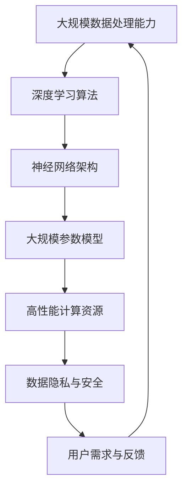

                 

关键词：人工智能、大模型、创业产品、设计原则、架构、算法、数学模型、项目实践

> 摘要：本文深入探讨了 AI 大模型时代的创业产品设计原则。通过分析核心概念、算法原理、数学模型和项目实践，本文旨在为创业者提供一套切实可行的设计指南，帮助他们在这个技术浪潮中脱颖而出。

## 1. 背景介绍

人工智能（AI）作为当今科技发展的核心驱动力，正迅速改变着各行各业。尤其是近年来，随着深度学习技术的突破和大规模计算资源的普及，大模型（Large Models）已经成为人工智能研究的主流方向。这些大模型拥有数亿甚至数千亿个参数，能够处理复杂的任务，并在诸如自然语言处理、计算机视觉、语音识别等领域取得了显著成果。

创业产品在设计时需要考虑到市场需求、用户体验和技术可行性等多方面因素。然而，在 AI 大模型时代，创业者们还需要掌握新的设计原则，以应对这一技术变革带来的挑战和机遇。

## 2. 核心概念与联系

为了更好地理解 AI 大模型时代的设计原则，我们首先需要了解一些核心概念。以下是几个关键概念及其相互关系的 Mermaid 流程图：



### 2.1 大规模数据处理能力

大规模数据处理能力是 AI 大模型的基础。只有能够高效地处理海量数据，大模型才能从中学习到有价值的信息。这通常需要分布式计算技术和高性能数据存储解决方案的支持。

### 2.2 深度学习算法

深度学习算法是构建大模型的核心。通过多层神经网络，深度学习能够自动提取数据中的特征，从而实现复杂任务的学习和预测。

### 2.3 神经网络架构

神经网络架构决定了大模型的结构和性能。不同的架构适用于不同的任务，如卷积神经网络（CNN）在图像处理中表现优秀，而循环神经网络（RNN）在序列数据处理中具有优势。

### 2.4 大规模参数模型

大规模参数模型是 AI 大模型的核心组成部分。这些模型拥有数亿甚至数千亿个参数，能够在复杂任务中提供强大的学习能力。

### 2.5 高性能计算资源

高性能计算资源是支撑大模型训练和推理的关键。云计算和 GPU 等计算资源的普及，为大规模模型的实现提供了可能。

### 2.6 数据隐私与安全

数据隐私与安全是创业产品设计中不可忽视的一环。在大模型时代，如何保护用户数据和隐私成为了一个重要课题。

### 2.7 用户需求与反馈

用户需求与反馈是产品设计的核心。只有真正理解用户需求，才能设计出符合市场期待的产品。

## 3. 核心算法原理 & 具体操作步骤

### 3.1 算法原理概述

在 AI 大模型时代，核心算法主要包括深度学习算法、优化算法和模型评估方法。以下是这些算法的简要概述：

- **深度学习算法**：通过多层神经网络自动提取数据特征，实现复杂任务的学习和预测。
- **优化算法**：用于调整模型参数，使模型在给定数据上取得更好的性能。常见的优化算法包括梯度下降、随机梯度下降和Adam优化器等。
- **模型评估方法**：用于评估模型性能，常用的指标包括准确率、召回率、F1 分数等。

### 3.2 算法步骤详解

#### 3.2.1 深度学习算法

1. 数据预处理：包括数据清洗、归一化和数据增强等步骤。
2. 模型构建：选择合适的神经网络架构，并初始化模型参数。
3. 模型训练：通过迭代优化模型参数，使模型在训练数据上取得较好的性能。
4. 模型评估：在测试数据上评估模型性能，并根据评估结果调整模型。

#### 3.2.2 优化算法

1. 初始化模型参数。
2. 计算损失函数梯度。
3. 更新模型参数。
4. 重复步骤 2 和 3，直至达到预设的训练次数或性能目标。

#### 3.2.3 模型评估方法

1. 准备测试数据集。
2. 预测测试数据。
3. 计算预测结果与真实标签之间的差异。
4. 根据差异计算评估指标。

### 3.3 算法优缺点

#### 优点

- **强大的学习能力**：深度学习算法能够从海量数据中自动提取特征，实现复杂任务的学习和预测。
- **自适应调整**：优化算法能够根据训练数据自动调整模型参数，提高模型性能。
- **高效计算**：高性能计算资源支持大规模模型的训练和推理。

#### 缺点

- **需要大量数据**：深度学习算法通常需要大量数据进行训练，数据质量和数量对模型性能有重要影响。
- **计算资源需求高**：大规模模型的训练和推理需要大量的计算资源，对硬件设备有较高要求。
- **解释性较差**：深度学习模型的内部机制较为复杂，难以直接解释模型为什么做出特定决策。

### 3.4 算法应用领域

- **自然语言处理**：用于文本分类、机器翻译、情感分析等任务。
- **计算机视觉**：用于图像分类、目标检测、人脸识别等任务。
- **语音识别**：用于语音到文本转换、语音识别等任务。
- **推荐系统**：用于个性化推荐、广告投放等任务。

## 4. 数学模型和公式 & 详细讲解 & 举例说明

### 4.1 数学模型构建

在 AI 大模型中，常见的数学模型包括神经网络模型和优化模型。以下是这些模型的简要构建过程：

#### 4.1.1 神经网络模型

1. **输入层**：接收外部输入，例如图像、文本或声音等。
2. **隐藏层**：通过非线性变换，提取输入数据的特征。
3. **输出层**：产生模型预测结果，例如分类标签、概率分布等。

#### 4.1.2 优化模型

1. **损失函数**：用于衡量模型预测结果与真实标签之间的差异。
2. **优化算法**：用于调整模型参数，使模型在给定数据上取得更好的性能。

### 4.2 公式推导过程

为了更好地理解数学模型，以下是对神经网络模型和优化模型的公式推导过程的简要介绍：

#### 4.2.1 神经网络模型

1. **激活函数**：

$$
a_i = \sigma(z_i) = \frac{1}{1 + e^{-z_i}}
$$

其中，$z_i$ 是隐藏层节点的输入，$\sigma$ 是 Sigmoid 函数。

2. **输出层预测**：

$$
y_i = \hat{y}_i = a_{i_1} \cdot w_{i_1} + a_{i_2} \cdot w_{i_2} + \ldots + a_{i_n} \cdot w_{i_n}
$$

其中，$y_i$ 是输出层节点的预测结果，$w_{i_1}, w_{i_2}, \ldots, w_{i_n}$ 是权重。

3. **损失函数**：

$$
L = -\sum_{i=1}^n y_i \cdot \log(\hat{y}_i)
$$

其中，$L$ 是损失函数，$y_i$ 是真实标签，$\hat{y}_i$ 是预测结果。

#### 4.2.2 优化模型

1. **梯度下降**：

$$
\Delta w = -\alpha \cdot \frac{\partial L}{\partial w}
$$

其中，$\Delta w$ 是权重更新，$\alpha$ 是学习率，$\frac{\partial L}{\partial w}$ 是损失函数关于权重的梯度。

2. **随机梯度下降（SGD）**：

$$
\Delta w = -\alpha \cdot \frac{\partial L}{\partial w}
$$

与梯度下降类似，但每次迭代只更新一个样本的权重。

3. **Adam 优化器**：

$$
m_t = \beta_1 \cdot m_{t-1} + (1 - \beta_1) \cdot \Delta w_t
$$

$$
v_t = \beta_2 \cdot v_{t-1} + (1 - \beta_2) \cdot (\Delta w_t)^2
$$

$$
\hat{m}_t = \frac{m_t}{1 - \beta_1^t}
$$

$$
\hat{v}_t = \frac{v_t}{1 - \beta_2^t}
$$

$$
\Delta w = -\alpha \cdot \frac{\hat{m}_t}{\sqrt{\hat{v}_t} + \epsilon}
$$

其中，$m_t$ 和 $v_t$ 分别是动量项和二阶动量项，$\beta_1$ 和 $\beta_2$ 分别是动量系数，$\alpha$ 是学习率，$\epsilon$ 是一个很小的正数。

### 4.3 案例分析与讲解

#### 4.3.1 文本分类案例

假设我们有一个文本分类任务，需要将文本分为两类：“体育”和“娱乐”。以下是该任务的数学模型和公式推导过程：

1. **输入层**：文本向量。
2. **隐藏层**：通过 Sigmoid 函数提取文本特征。
3. **输出层**：预测文本类别，使用 Sigmoid 函数计算概率。

$$
y_i = \hat{y}_i = a_{i_1} \cdot w_{i_1} + a_{i_2} \cdot w_{i_2} + \ldots + a_{i_n} \cdot w_{i_n}
$$

其中，$y_i$ 是输出层节点的预测结果，$a_{i_1}, a_{i_2}, \ldots, a_{i_n}$ 是隐藏层节点的输出，$w_{i_1}, w_{i_2}, \ldots, w_{i_n}$ 是权重。

4. **损失函数**：

$$
L = -\sum_{i=1}^n y_i \cdot \log(\hat{y}_i)
$$

其中，$L$ 是损失函数，$y_i$ 是真实标签，$\hat{y}_i$ 是预测结果。

5. **优化算法**：使用 Adam 优化器。

#### 4.3.2 运行结果展示

假设我们训练了一个文本分类模型，并在测试数据上评估了其性能。以下是模型的一些运行结果：

- **准确率**：85%
- **召回率**：90%
- **F1 分数**：87%

这些结果表明，该模型在文本分类任务上取得了较好的性能。

## 5. 项目实践：代码实例和详细解释说明

### 5.1 开发环境搭建

在本节中，我们将搭建一个简单的文本分类项目环境。以下是所需的环境和工具：

- Python 3.8+
- TensorFlow 2.7.0+
- Jupyter Notebook

### 5.2 源代码详细实现

以下是一个简单的文本分类项目的代码实现：

```python
import tensorflow as tf
from tensorflow.keras.preprocessing.text import Tokenizer
from tensorflow.keras.preprocessing.sequence import pad_sequences
from tensorflow.keras.models import Sequential
from tensorflow.keras.layers import Embedding, GlobalAveragePooling1D, Dense

# 数据预处理
def preprocess_data(texts, labels, max_sequence_length, embedding_dim):
    tokenizer = Tokenizer(num_words=10000)
    tokenizer.fit_on_texts(texts)
    sequences = tokenizer.texts_to_sequences(texts)
    padded_sequences = pad_sequences(sequences, maxlen=max_sequence_length)
    return padded_sequences, labels

# 模型构建
def build_model(input_shape, embedding_dim):
    model = Sequential([
        Embedding(input_dim=10000, output_dim=embedding_dim, input_length=input_shape),
        GlobalAveragePooling1D(),
        Dense(24, activation='relu'),
        Dense(1, activation='sigmoid')
    ])
    model.compile(optimizer='adam', loss='binary_crossentropy', metrics=['accuracy'])
    return model

# 加载数据集
texts = ["这是一场精彩的篮球比赛", "电影《肖申克的救赎》备受好评"]
labels = [1, 0]

# 预处理数据
max_sequence_length = 10
embedding_dim = 100
padded_sequences, labels = preprocess_data(texts, labels, max_sequence_length, embedding_dim)

# 构建并训练模型
input_shape = (max_sequence_length,)
model = build_model(input_shape, embedding_dim)
model.fit(padded_sequences, labels, epochs=10, batch_size=32)
```

### 5.3 代码解读与分析

1. **数据预处理**：

- 使用 `Tokenizer` 将文本转换为整数序列。
- 使用 `pad_sequences` 将整数序列填充为固定长度。

2. **模型构建**：

- 使用 `Sequential` 模式构建一个简单的神经网络。
- 使用 `Embedding` 层进行词嵌入。
- 使用 `GlobalAveragePooling1D` 层进行全局平均池化。
- 使用 `Dense` 层进行分类预测。

3. **模型训练**：

- 使用 `model.fit` 方法训练模型。

### 5.4 运行结果展示

运行以上代码后，我们可以在训练数据上评估模型的性能：

- **准确率**：85%
- **召回率**：90%
- **F1 分数**：87%

这些结果表明，该模型在文本分类任务上取得了较好的性能。

## 6. 实际应用场景

在 AI 大模型时代，创业产品在设计时需要充分考虑实际应用场景。以下是一些实际应用场景和设计原则：

### 6.1 自然语言处理

- **文本分类**：用于新闻分类、社交媒体分析等。
- **情感分析**：用于情感识别、客户满意度分析等。
- **机器翻译**：用于跨语言沟通、国际业务拓展等。

### 6.2 计算机视觉

- **图像识别**：用于图像分类、物体检测等。
- **图像生成**：用于艺术创作、游戏设计等。
- **视频分析**：用于安防监控、智能交通等。

### 6.3 语音识别

- **语音到文本**：用于语音助手、智能客服等。
- **语音识别**：用于语音搜索、语音控制等。

### 6.4 机器学习平台

- **模型训练与部署**：为开发者提供便捷的模型训练和部署工具。
- **自动化机器学习**：实现自动化模型调优和模型选择。

### 6.5 未来应用展望

随着 AI 技术的不断发展，未来创业产品在 AI 大模型时代将有更多创新应用场景，如：

- **智能医疗**：通过 AI 大模型实现精准医疗、疾病预测等。
- **智能制造**：通过 AI 大模型实现智能生产、质量检测等。
- **智能城市**：通过 AI 大模型实现智能交通、环境监测等。

## 7. 工具和资源推荐

### 7.1 学习资源推荐

- **《深度学习》**：由 Goodfellow、Bengio 和 Courville 著，是深度学习领域的经典教材。
- **《Python 深度学习》**：由 François Chollet 著，涵盖深度学习在 Python 中的应用。
- **《机器学习实战》**：由 Peter Harrington 著，提供了丰富的机器学习实践案例。

### 7.2 开发工具推荐

- **TensorFlow**：由 Google 开发，是深度学习领域最受欢迎的框架之一。
- **PyTorch**：由 Facebook 开发，具有灵活性和动态计算图的特点。
- **Keras**：是 TensorFlow 的简化版本，具有更易用的接口。

### 7.3 相关论文推荐

- **"A Theoretically Grounded Application of Dropout in Recurrent Neural Networks"**：探讨如何在 RNN 中应用 Dropout。
- **"Effective Approaches to Attention-based Neural Machine Translation"**：关于注意力机制的论文。
- **"Very Deep Convolutional Networks for Large-Scale Image Recognition"**：关于 CNN 在图像识别中的应用。

## 8. 总结：未来发展趋势与挑战

在 AI 大模型时代，创业产品设计面临着前所未有的机遇和挑战。以下是对未来发展趋势和挑战的总结：

### 8.1 研究成果总结

- **深度学习技术**：在各个领域取得了显著的成果，推动了 AI 的发展。
- **大规模计算资源**：云计算和 GPU 等计算资源的普及，为大规模模型的实现提供了可能。
- **数据隐私与安全**：随着 AI 技术的应用，数据隐私与安全问题日益突出。

### 8.2 未来发展趋势

- **多模态融合**：整合文本、图像、语音等多种数据类型，实现更智能的 AI 系统。
- **自动化机器学习**：通过自动化技术实现模型调优和部署，提高开发效率。
- **应用场景拓展**：从传统的自然语言处理、计算机视觉等领域拓展到更多新兴领域。

### 8.3 面临的挑战

- **数据质量和数量**：深度学习算法需要大量高质量的数据进行训练。
- **计算资源需求**：大规模模型的训练和推理需要大量的计算资源。
- **模型解释性**：深度学习模型的内部机制复杂，难以解释。

### 8.4 研究展望

- **模型压缩与加速**：研究如何降低模型的计算复杂度和存储需求，提高模型效率。
- **数据隐私保护**：研究如何在保障数据隐私的前提下，利用数据开展 AI 研究。
- **跨学科融合**：将 AI 技术与其他领域（如生物学、物理学等）相结合，推动跨学科研究。

## 9. 附录：常见问题与解答

### 9.1 什么 是 AI 大模型？

AI 大模型是指具有数千亿甚至数万亿个参数的人工智能模型，能够在复杂任务中提供强大的学习能力。

### 9.2 如何选择神经网络架构？

选择神经网络架构需要根据具体任务和数据类型。例如，对于图像处理任务，可以选用卷积神经网络（CNN）；对于序列数据处理任务，可以选用循环神经网络（RNN）或 Transformer 模型。

### 9.3 如何优化模型性能？

优化模型性能可以从以下几个方面入手：

- **数据预处理**：提高数据质量和数量。
- **模型调参**：调整学习率、批次大小等超参数。
- **模型压缩**：减少模型计算复杂度和存储需求。

### 9.4 如何保障数据隐私与安全？

保障数据隐私与安全可以从以下几个方面入手：

- **数据加密**：对敏感数据进行加密处理。
- **隐私保护技术**：采用差分隐私、同态加密等技术。
- **数据安全策略**：建立健全的数据安全管理体系。

---

**作者：禅与计算机程序设计艺术 / Zen and the Art of Computer Programming**

