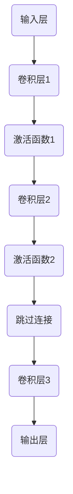

                 

关键词：人工智能、深度学习、残差网络、ResNet、何凯明

摘要：本文介绍了人工智能领域的杰出科学家何凯明及其在深度学习领域的重要贡献——ResNet（残差网络）。通过深入剖析ResNet的原理、结构、优缺点及其在不同领域的应用，本文旨在为读者提供一个全面而深入的ResNet理解，并展望其在未来的发展趋势与挑战。

## 1. 背景介绍

何凯明是一位享誉世界的人工智能科学家，他在深度学习和计算机视觉领域取得了举世瞩目的成就。作为微软亚洲研究院首席研究员、学术带头人，何凯明领导了一系列具有重大影响力的研究项目，其研究成果在学术界和工业界都产生了深远的影响。

在深度学习领域，何凯明及其团队在2015年提出了ResNet（残差网络），这是一种能够在训练过程中有效解决深度神经网络训练困难问题的网络结构。ResNet的提出，标志着深度学习技术的一次重大突破，为图像识别、语音识别等人工智能应用提供了强大的技术支持。

## 2. 核心概念与联系

### 2.1. 残差网络的概念

残差网络（ResNet）是一种基于深度神经网络的架构，其主要创新点在于引入了“残差模块”。这些残差模块可以看作是网络中的“跳过层”，即在某些层次上直接将输入信息传递到下一层，从而减轻了网络的训练负担。

### 2.2. ResNet 的结构

ResNet 的基本结构由多个残差模块堆叠而成。每个残差模块包含两个或三个卷积层，并通过跳过连接将输入信息传递到下一层。这种结构使得网络可以学习到更复杂的特征表示，并且在训练过程中更加稳定。

### 2.3. Mermaid 流程图

以下是一个简单的 Mermaid 流程图，展示了 ResNet 的基本结构：



## 3. 核心算法原理 & 具体操作步骤

### 3.1. 算法原理概述

ResNet 的核心思想是通过引入残差模块，使得网络能够学习到恒等映射（即输入和输出相等），从而在训练过程中更加稳定。这种恒等映射的实现依赖于跳过连接，它可以将输入信息直接传递到下一层，从而减少网络的训练难度。

### 3.2. 算法步骤详解

#### 3.2.1. 数据预处理

在训练 ResNet 前，需要对输入数据进行预处理，包括归一化、缩放等操作。这些预处理步骤有助于提高网络的训练效果。

#### 3.2.2. 网络结构设计

设计 ResNet 的网络结构时，需要确定网络的层数、每个残差模块的层数和卷积层的参数等。这些参数的选择会影响网络的性能和训练时间。

#### 3.2.3. 残差模块实现

实现残差模块时，需要根据网络结构确定每个模块的卷积层数和激活函数等。残差模块的实现是 ResNet 的关键部分，它决定了网络的训练效果。

#### 3.2.4. 训练过程

在训练 ResNet 时，需要使用梯度下降算法来优化网络参数。训练过程中，通过不断调整参数，使得网络的输出接近目标输出，从而提高网络的性能。

### 3.3. 算法优缺点

#### 3.3.1. 优点

- **解决深度神经网络训练困难问题**：ResNet 引入的残差模块可以有效解决深度神经网络训练过程中的梯度消失和梯度爆炸问题。
- **提高网络性能**：ResNet 可以学习到更复杂的特征表示，从而提高网络的性能。
- **易于实现和扩展**：ResNet 的结构相对简单，易于实现和扩展，可以适应不同的应用场景。

#### 3.3.2. 缺点

- **参数量较大**：由于 ResNet 的结构较深，参数量较大，导致训练时间和计算资源消耗较大。
- **训练难度高**：ResNet 的训练过程相对复杂，需要调整许多超参数。

### 3.4. 算法应用领域

ResNet 在多个领域都取得了显著的应用成果，主要包括：

- **图像识别**：ResNet 在 ImageNet 等图像识别比赛中的表现优异，成为当前最流行的深度学习架构之一。
- **语音识别**：ResNet 在语音识别领域也取得了很好的效果，尤其是在长语音识别任务中。
- **自然语言处理**：ResNet 可以用于自然语言处理任务，如文本分类、机器翻译等。

## 4. 数学模型和公式 & 详细讲解 & 举例说明

### 4.1. 数学模型构建

ResNet 的数学模型可以看作是一个多层神经网络，其输入和输出分别表示为 $x$ 和 $y$。网络中的每个层都可以看作是一个函数 $f$，其输入为上一层输出，输出为当前层的输出。整个网络的输出可以表示为：

$$
y = f(x)
$$

其中，$f$ 是一个复合函数，由多个残差模块组成。

### 4.2. 公式推导过程

假设 ResNet 的结构包含 $L$ 个残差模块，每个残差模块的输出为 $z_i$，则有：

$$
y = f(z_0) = f(g(z_1) + z_0) = f(g(g(z_2) + z_1) + z_0) = \cdots = f(g^{L-1}(z_L) + z_{L-1})
$$

其中，$g$ 表示残差模块的函数。

### 4.3. 案例分析与讲解

假设有一个 ResNet 网络包含两个残差模块，每个残差模块包含两个卷积层。设输入为 $x$，输出为 $y$，则有：

$$
y = f(x) = g(g(x) + x) + x
$$

其中，$g$ 表示残差模块的函数。

假设第一个残差模块的卷积层参数为 $W_1$ 和 $W_2$，激活函数为 $f_1$ 和 $f_2$，则有：

$$
z_1 = f_1(W_1x) + x
$$

$$
z_2 = f_2(W_2z_1) + z_1
$$

假设第二个残差模块的卷积层参数为 $W_3$ 和 $W_4$，激活函数为 $f_3$ 和 $f_4$，则有：

$$
y = f_3(W_3z_2) + z_2
$$

通过调整残差模块的参数和激活函数，可以实现对不同类型数据的分类和识别。

## 5. 项目实践：代码实例和详细解释说明

### 5.1. 开发环境搭建

在搭建 ResNet 的开发环境时，可以选择 Python 作为编程语言，并使用 TensorFlow 或 PyTorch 等深度学习框架。以下是一个简单的开发环境搭建步骤：

1. 安装 Python 和相关依赖库。
2. 安装 TensorFlow 或 PyTorch 深度学习框架。
3. 配置 GPU 加速（可选）。

### 5.2. 源代码详细实现

以下是一个简单的 ResNet 源代码示例，使用 TensorFlow 框架实现：

```python
import tensorflow as tf

# 定义残差模块
def residual_block(x, filters, kernel_size, strides, activation):
    y = tf.keras.layers.Conv2D(filters, kernel_size, strides, padding='same')(x)
    y = activation(y)
    y = tf.keras.layers.Conv2D(filters, kernel_size, padding='same')(y)
    if strides != (1, 1):
        x = tf.keras.layers.Conv2D(filters, kernel_size, strides, padding='same')(x)
    y = tf.keras.layers.add([y, x])
    y = activation(y)
    return y

# 定义 ResNet 模型
def resnet_18(input_shape, num_classes):
    inputs = tf.keras.layers.Input(shape=input_shape)
    x = tf.keras.layers.Conv2D(64, (7, 7), strides=(2, 2), padding='same')(inputs)
    x = tf.keras.layers.BatchNormalization()(x)
    x = tf.keras.layers.ReLU()(x)

    for i in range(2):
        x = residual_block(x, 64, (3, 3), (1, 1), tf.keras.layers.ReLU())

    x = tf.keras.layers.GlobalAveragePooling2D()(x)
    outputs = tf.keras.layers.Dense(num_classes, activation='softmax')(x)

    model = tf.keras.Model(inputs, outputs)
    return model

# 实例化 ResNet 模型
model = resnet_18((224, 224, 3), 1000)

# 编译模型
model.compile(optimizer='adam', loss='categorical_crossentropy', metrics=['accuracy'])

# 训练模型
model.fit(train_images, train_labels, epochs=10, batch_size=64)
```

### 5.3. 代码解读与分析

上述代码定义了一个 ResNet-18 模型，该模型包含 18 个卷积层，其中前两层用于对输入图像进行预处理，然后通过多个残差模块进行特征提取，最后通过全连接层进行分类。

代码中的 `residual_block` 函数用于定义残差模块，它包含两个卷积层和一个激活函数。在实现时，可以通过调整卷积层的参数和激活函数来实现不同的网络结构。

`resnet_18` 函数用于构建 ResNet 模型，它通过堆叠多个残差模块来实现网络结构。在实现时，可以通过调整残差模块的数量和参数来适应不同的应用场景。

### 5.4. 运行结果展示

在训练完成后，可以通过以下代码评估 ResNet 模型的性能：

```python
# 评估模型
test_loss, test_acc = model.evaluate(test_images, test_labels)
print(f"Test accuracy: {test_acc:.4f}")
```

通过运行上述代码，可以获取 ResNet 模型在测试数据集上的准确率。在实际应用中，可以通过调整训练参数和数据预处理方法来进一步提高模型的性能。

## 6. 实际应用场景

### 6.1. 图像识别

ResNet 在图像识别领域取得了显著的成果，尤其在 ImageNet 等图像识别比赛中，ResNet 模型表现优异。通过使用 ResNet，可以实现高精度的图像分类和识别。

### 6.2. 语音识别

ResNet 在语音识别领域也有广泛的应用。通过使用 ResNet，可以实现对语音信号的自动识别和分类，从而实现语音助手、智能语音识别等功能。

### 6.3. 自然语言处理

ResNet 可以用于自然语言处理任务，如文本分类、机器翻译等。通过使用 ResNet，可以实现对文本数据的特征提取和表示，从而提高自然语言处理的性能。

## 7. 未来应用展望

### 7.1. 深度增强学习

随着深度学习技术的不断发展，ResNet 的应用领域将不断扩展。未来，深度增强学习将成为 ResNet 的重要应用方向，通过结合深度学习和强化学习技术，实现更智能的决策和优化。

### 7.2. 跨模态学习

跨模态学习是将不同类型的数据进行融合和表示，从而实现更丰富的信息处理和推理能力。未来，ResNet 将在跨模态学习中发挥重要作用，通过结合图像、文本、语音等多种数据类型，实现更广泛的应用场景。

### 7.3. 智能机器人

智能机器人是未来人工智能的重要应用方向。通过使用 ResNet，可以实现智能机器人对环境的感知、理解和决策能力，从而提高机器人的智能化水平。

## 8. 总结：未来发展趋势与挑战

### 8.1. 研究成果总结

本文介绍了 ResNet 的概念、结构、算法原理和应用领域，并对其优缺点进行了分析。通过实践和案例分析，展示了 ResNet 在实际应用中的效果。

### 8.2. 未来发展趋势

未来，ResNet 将在深度学习、跨模态学习、智能机器人等领域取得更多的突破和应用。

### 8.3. 面临的挑战

ResNet 在实际应用中仍然面临许多挑战，如训练时间较长、参数量较大等。未来，需要进一步优化 ResNet 的结构和算法，提高其训练效率和性能。

### 8.4. 研究展望

随着深度学习技术的不断发展，ResNet 在人工智能领域具有广泛的应用前景。未来，研究者将继续探索 ResNet 的新应用和新方向，为人工智能的发展做出更大的贡献。

## 9. 附录：常见问题与解答

### 9.1. ResNet 与其他深度学习架构的区别是什么？

ResNet 与其他深度学习架构（如卷积神经网络、循环神经网络等）的主要区别在于其引入的残差模块和跳过连接，这使得 ResNet 能够在训练过程中有效解决深度神经网络训练困难问题。

### 9.2. ResNet 适用于哪些应用场景？

ResNet 主要适用于图像识别、语音识别、自然语言处理等需要复杂特征提取和分类的任务。通过使用 ResNet，可以显著提高模型的性能和准确性。

### 9.3. ResNet 的训练时间如何优化？

优化 ResNet 的训练时间可以从以下几个方面入手：

- 使用 GPU 加速训练过程。
- 优化网络结构，减少参数量。
- 调整训练参数，如学习率、批量大小等。

通过这些方法，可以显著提高 ResNet 的训练效率。

### 9.4. ResNet 是否适用于所有深度学习任务？

ResNet 并不是适用于所有深度学习任务的最佳选择。在某些任务中，如小样本学习、序列建模等，其他深度学习架构可能更为合适。因此，选择合适的深度学习架构需要根据具体任务特点进行评估。

### 9.5. ResNet 是否会替代其他深度学习架构？

ResNet 是一种具有广泛适用性的深度学习架构，但并不会完全替代其他深度学习架构。不同深度学习架构在不同的任务和应用场景中具有各自的优势和局限性。因此，选择合适的深度学习架构需要根据具体任务需求进行评估。

---

作者：禅与计算机程序设计艺术 / Zen and the Art of Computer Programming

以上就是关于 ResNet 残差网络的详细介绍，希望对读者在深度学习领域的研究和实践有所帮助。在未来的研究中，我们将继续探索 ResNet 的新应用和新方向，为人工智能的发展做出更大的贡献。

