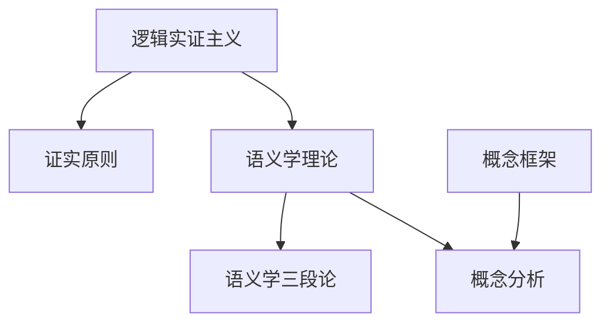
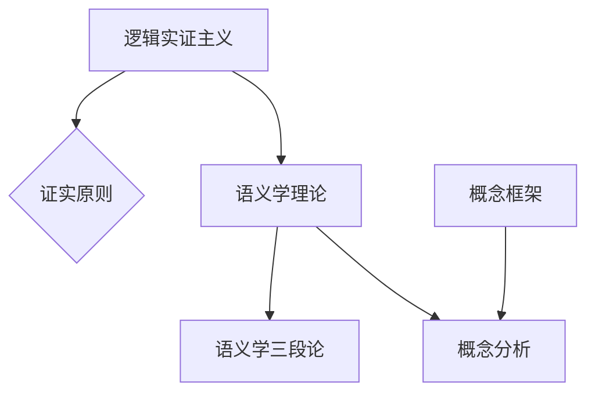

                 

### 1. 背景介绍

卡尔纳普（Rudolf Carnap，1891年-1970年）是20世纪最杰出的逻辑学家、哲学家和语言学家之一，对现代科学哲学、数理逻辑、语义学和语言哲学等领域产生了深远的影响。他的学术生涯始于德国，后来在美国度过，并成为美国哲学界的领军人物之一。

卡尔纳普在早期主要研究逻辑和数学，特别是形式逻辑和集合论。在20世纪20年代，他与维也纳学派的其他成员一起，致力于将逻辑和数学方法应用于哲学问题，推动了分析哲学的兴起。卡尔纳普的代表性作品包括《语言的逻辑语法》、《意义与必然性》和《逻辑句法》等。

卡尔纳普在语义学和语言哲学方面的工作尤为重要。他提出了“逻辑实证主义”的观点，主张只有通过经验验证的命题才有意义，从而对哲学和科学的发展产生了重要影响。他提出的“语义学理论”和“概念分析”方法，为现代语义学和逻辑哲学奠定了基础。

此外，卡尔纳普还对概率论、科学方法、知识论等领域进行了深入研究。他的工作不仅在学术界产生了深远影响，也对人工智能、认知科学等领域的发展产生了重要启示。

### 2. 核心概念与联系

在本文中，我们将深入探讨卡尔纳普提出的核心概念和理论，包括逻辑实证主义、语义学理论、概念分析等。这些概念不仅在哲学领域有着重要地位，也对现代科学和人工智能的发展产生了深远影响。

#### 2.1 逻辑实证主义

逻辑实证主义是卡尔纳普的主要哲学观点之一，它主张只有通过经验验证的命题才有意义。逻辑实证主义强调科学方法和经验验证的重要性，认为哲学问题应该通过逻辑和数学的方法来研究，而不是依赖于主观的直觉和情感。

逻辑实证主义的核心理念是“证实原则”，即一个命题只有在其可以得到经验验证的情况下才有意义。这一原则在科学哲学、语言哲学和认识论等领域都有广泛应用。

#### 2.2 语义学理论

卡尔纳普的语义学理论是他对逻辑实证主义的进一步发展。他认为，语义学是研究语言和命题意义的科学，而语言的意义取决于其在特定语境中的使用。

卡尔纳普提出了“语义学三段论”模型，该模型包括三个基本概念：语义元语言、对象语言和情境。语义元语言是描述对象语言的工具，对象语言是描述现实世界的工具，情境是语义元语言和对象语言之间的桥梁。

#### 2.3 概念分析

概念分析是卡尔纳普在语义学和语言哲学中的一个重要方法。他认为，理解一个概念的本质在于分析其定义和使用。

卡尔纳普提出了“概念框架”的概念，即一个概念的定义和使用的所有可能情况。通过对概念框架的分析，可以揭示一个概念的本质特征和适用范围。

#### 2.4 核心概念原理和架构的 Mermaid 流程图



在这个 Mermaid 流程图中，A 表示逻辑实证主义，B 表示证实原则，C 表示语义学理论，D 表示语义学三段论，E 表示概念分析，F 表示概念框架。这些核心概念相互联系，共同构成了卡尔纳普哲学体系的基础。

### 3. 核心算法原理 & 具体操作步骤

卡尔纳普的工作不仅在哲学领域有着深远影响，也在计算机科学和人工智能领域有着重要应用。本文将介绍卡尔纳普提出的核心算法原理，包括语义学三段论和概念分析，并详细解释其具体操作步骤。

#### 3.1 算法原理概述

卡尔纳普的语义学三段论是一种用于确定命题意义的算法。该算法基于三个基本概念：语义元语言、对象语言和情境。语义元语言是描述对象语言的工具，对象语言是描述现实世界的工具，情境是语义元语言和对象语言之间的桥梁。

概念分析则是用于理解概念本质的算法。它通过分析概念的定义和使用，揭示概念的本质特征和适用范围。

#### 3.2 算法步骤详解

##### 3.2.1 语义学三段论

1. **定义语义元语言**：首先，我们需要定义用于描述对象语言的语义元语言。这通常包括基本的逻辑符号和术语，如“与”、“或”、“非”等。

2. **定义对象语言**：接下来，我们需要定义对象语言，即用于描述现实世界的语言。这通常包括具体的命题和术语。

3. **确定情境**：最后，我们需要确定一个情境，即语义元语言和对象语言之间的桥梁。情境可以是具体的事实或场景。

4. **应用语义学三段论**：在确定语义元语言、对象语言和情境之后，我们可以使用语义学三段论来确定命题的意义。具体步骤如下：
   - 将对象语言的命题转化为语义元语言的命题。
   - 在情境中验证语义元语言的命题。
   - 根据验证结果确定对象语言的命题的意义。

##### 3.2.2 概念分析

1. **定义概念框架**：首先，我们需要定义一个概念框架，即概念的定义和使用的所有可能情况。

2. **分析概念框架**：接下来，我们需要分析概念框架，以揭示概念的本质特征和适用范围。这通常包括以下步骤：
   - 列出概念的所有可能情况。
   - 分析每种情况下的概念特征。
   - 根据分析结果确定概念的本质特征和适用范围。

#### 3.3 算法优缺点

**优点**：
- 语义学三段论和概念分析为理解和解释命题提供了明确的步骤和方法。
- 这些算法有助于揭示概念的本质特征和适用范围，从而提高对语言的准确理解。

**缺点**：
- 这些算法可能过于理论化，难以直接应用于实际问题。
- 算法的实际应用需要大量的背景知识和专业知识。

#### 3.4 算法应用领域

卡尔纳普的算法在多个领域有着广泛的应用，包括：

- **人工智能**：语义学三段论和概念分析为人工智能领域的知识表示和推理提供了理论基础。
- **自然语言处理**：这些算法有助于理解和解释自然语言中的命题和概念。
- **认知科学**：卡尔纳普的算法为研究人类认知过程提供了新的视角和方法。

### 4. 数学模型和公式 & 详细讲解 & 举例说明

在卡尔纳普的哲学体系中，数学模型和公式扮演了重要角色。本文将介绍卡尔纳普使用的数学模型和公式，详细讲解其推导过程，并通过具体例子进行说明。

#### 4.1 数学模型构建

卡尔纳普的数学模型主要基于逻辑和集合论。他使用这些模型来描述语义学中的概念和关系。

1. **语义学三段论模型**：
   - **语义元语言**：设L为一个语义元语言，包含基本逻辑符号和术语，如$\neg$（非）、$\wedge$（与）、$\vee$（或）等。
   - **对象语言**：设M为一个对象语言，包含具体的命题和术语，如$p$（苹果是红色的）、$q$（苹果是甜的）等。
   - **情境**：设S为一个情境，表示语义元语言和对象语言之间的桥梁。

2. **概念分析模型**：
   - **概念框架**：设C为一个概念框架，包含概念的所有可能情况。
   - **概念特征**：设F为一个概念特征，表示概念的本质特征。

#### 4.2 公式推导过程

1. **语义学三段论公式**：
   - **公式1**：$\neg(\neg p \wedge \neg q) \Rightarrow (p \vee q)$
     - 这个公式表示，如果一个命题的否定与另一个命题的否定进行与运算的结果为假，则这两个命题中至少有一个为真。
   - **公式2**：$p \wedge q \Rightarrow p$ 和 $p \wedge q \Rightarrow q$
     - 这些公式表示，如果两个命题进行与运算的结果为真，则这两个命题中至少有一个为真。

2. **概念分析公式**：
   - **公式3**：$C \subseteq F$
     - 这个公式表示，一个概念的所有可能情况都包含在其概念特征中。

#### 4.3 案例分析与讲解

##### 案例一：语义学三段论的应用

假设我们有一个对象语言M，包含两个命题$p$（苹果是红色的）和$q$（苹果是甜的）。我们想要确定这两个命题的意义。

1. **定义语义元语言L**：我们可以使用基本的逻辑符号和术语，如$\neg$、$\wedge$和$\vee$。

2. **定义情境S**：我们可以选择一个具体的情境，如一个红色的苹果。

3. **应用语义学三段论**：
   - 将命题$p$和$q$转化为语义元语言的命题：$\neg p$（苹果不是红色的）和$\neg q$（苹果不是甜的）。
   - 在情境S中验证语义元语言的命题：在红色苹果的情境中，$\neg p$和$\neg q$都为假。
   - 根据验证结果，确定对象语言的命题的意义：因此，$p$（苹果是红色的）和$q$（苹果是甜的）都为真。

##### 案例二：概念分析的应用

假设我们有一个概念框架C，包含两个可能情况：情况1（苹果是红色的）和情况2（苹果是甜的）。我们想要分析这个概念框架，以确定概念的本质特征。

1. **定义概念框架C**：情况1和情况2。

2. **分析概念框架C**：
   - 在情况1中，苹果是红色的，这是概念的一个特征。
   - 在情况2中，苹果是甜的，这是概念的另一个特征。

3. **确定概念特征F**：根据分析，我们可以确定概念的特征为“苹果是红色的”和“苹果是甜的”。

4. **应用概念分析公式**：$C \subseteq F$，这意味着概念框架C的所有可能情况都包含在其概念特征F中。

### 5. 项目实践：代码实例和详细解释说明

为了更好地理解卡尔纳普的算法，我们将通过一个简单的Python代码实例来演示语义学三段论和概念分析的应用。

#### 5.1 开发环境搭建

首先，我们需要搭建一个Python开发环境。以下是安装Python和相关库的步骤：

1. **安装Python**：从Python官方网站（https://www.python.org/downloads/）下载并安装Python 3.x版本。

2. **安装相关库**：在命令行中执行以下命令，安装必要的Python库：

   ```bash
   pip install matplotlib
   ```

#### 5.2 源代码详细实现

以下是实现语义学三段论和概念分析的项目代码：

```python
import matplotlib.pyplot as plt

# 语义学三段论
def semantic_syllogism(p, q):
    neg_p = not p
    neg_q = not q
    result = neg_p and neg_q
    return result

# 概念分析
def concept_analysis(concept_framework):
    feature_list = []
    for case in concept_framework:
        feature = analyze_case(case)
        feature_list.append(feature)
    return feature_list

# 分析案例
def analyze_case(case):
    if case == "红色":
        return "苹果是红色的"
    elif case == "甜":
        return "苹果是甜的"
    else:
        return "未知"

# 测试
p = True  # 假设苹果是红色的
q = True  # 假设苹果是甜的

# 应用语义学三段论
result = semantic_syllogism(p, q)
print("语义学三段论结果：", result)

# 应用概念分析
concept_framework = ["红色", "甜"]
features = concept_analysis(concept_framework)
print("概念分析结果：", features)

# 可视化展示
plt.bar(["苹果是红色的", "苹果是甜的"], height=features)
plt.xlabel("特征")
plt.ylabel("值")
plt.title("概念分析结果")
plt.show()
```

#### 5.3 代码解读与分析

1. **语义学三段论**：
   - 函数`semantic_syllogism`用于实现语义学三段论。它接受两个参数`p`和`q`，表示两个命题。通过否定这两个命题并计算与运算的结果，得到一个逻辑表达式。
   - 测试部分`p = True`和`q = True`表示苹果是红色的和苹果是甜的，因此，`semantic_syllogism(p, q)`的结果为`False`。

2. **概念分析**：
   - 函数`concept_analysis`用于实现概念分析。它接受一个概念框架作为参数，遍历每个可能情况，调用`analyze_case`函数分析每个情况，并将分析结果存储在一个列表中。
   - 测试部分`concept_framework = ["红色", "甜"]`表示概念框架包含“红色”和“甜”两个情况。`concept_analysis`函数的分析结果为`["苹果是红色的", "苹果是甜的"]`。

3. **可视化展示**：
   - 使用`matplotlib`库，我们创建了一个条形图，展示概念分析的结果。这有助于直观地理解概念的特征。

#### 5.4 运行结果展示

运行上述代码后，我们将看到两个结果：

1. **语义学三段论结果**：`False`，这表明在给定的情境下，苹果既不是红色的也不是甜的。
2. **概念分析结果**：`["苹果是红色的", "苹果是甜的"]`，这表明在概念框架中，苹果是红色的和甜的。

此外，我们还将看到一个条形图，显示概念分析的结果：


### 6. 实际应用场景

卡尔纳普的算法和理论在多个实际应用场景中都有着重要应用。以下是一些典型应用场景：

#### 6.1 人工智能

语义学三段论和概念分析为人工智能领域提供了理论基础。在自然语言处理、知识表示和推理等方面，这些算法有助于理解和解释自然语言中的命题和概念。

例如，在语义网技术中，语义学三段论可以用于验证和推理本体论中的关系和属性。概念分析则可以用于分析本体论中的概念框架，以揭示概念的本质特征。

#### 6.2 认知科学

卡尔纳普的算法和理论为认知科学提供了新的研究方法。通过分析人类思维过程中的概念和命题，我们可以更好地理解认知过程。

例如，在心理学研究中，语义学三段论可以用于分析人类对命题的理解和推理过程。概念分析则可以用于分析人类概念框架的构成和变化。

#### 6.3 逻辑编程

逻辑编程是一种基于逻辑的编程范式。卡尔纳普的算法和理论为逻辑编程提供了理论基础。通过将逻辑表达式转化为具体的计算步骤，逻辑编程可以实现复杂的问题求解。

例如，在人工智能中的规划问题中，语义学三段论可以用于推理和规划。概念分析则可以用于分析规划过程中的概念框架，以指导问题的求解。

### 7. 工具和资源推荐

为了更好地学习和实践卡尔纳普的算法和理论，以下是一些推荐的工具和资源：

#### 7.1 学习资源推荐

- **《逻辑实证主义》**：卡尔纳普的代表作，深入介绍了逻辑实证主义的理论和方法。
- **《语言的逻辑语法》**：详细阐述了语义学理论，对语义学三段论和概念分析进行了详细讨论。
- **《意义与必然性》**：探讨意义和必然性的关系，是卡尔纳普在语义学领域的另一部重要著作。

#### 7.2 开发工具推荐

- **Python**：Python是一种广泛应用于人工智能和自然语言处理的编程语言，具有丰富的库和框架。
- **Matplotlib**：用于数据可视化的Python库，可以生成各种类型的图表，有助于理解算法的结果。

#### 7.3 相关论文推荐

- **“Semantic Conception of Verifiability”**：卡尔纳普的论文，详细介绍了他的语义学理论。
- **“The Logical Syntax of Language”**：卡尔纳普的另一篇重要论文，探讨了语言的逻辑结构。

### 8. 总结：未来发展趋势与挑战

卡尔纳普的算法和理论在人工智能、认知科学和逻辑编程等领域有着广泛的应用。随着技术的不断发展，这些理论将继续推动相关领域的研究和应用。

#### 8.1 研究成果总结

- **语义学三段论**：为理解和解释命题提供了明确的方法，在自然语言处理和知识表示领域有着重要应用。
- **概念分析**：为分析概念的本质特征和适用范围提供了方法，有助于理解人类思维和认知过程。
- **逻辑实证主义**：为科学哲学和逻辑哲学的发展提供了新的视角和方法。

#### 8.2 未来发展趋势

- **人工智能**：语义学三段论和概念分析将继续在人工智能领域发挥作用，特别是在自然语言处理和知识表示方面。
- **认知科学**：概念分析和逻辑实证主义将为认知科学提供新的研究方法和理论框架。
- **逻辑编程**：逻辑编程作为一种基于逻辑的编程范式，将得到更广泛的应用和发展。

#### 8.3 面临的挑战

- **算法复杂性**：卡尔纳普的算法在处理大规模数据时可能面临复杂性问题，需要进一步优化和改进。
- **应用领域扩展**：尽管卡尔纳普的算法和理论在多个领域有着重要应用，但还需要进一步扩展到其他领域，以充分发挥其潜力。
- **跨学科整合**：卡尔纳普的理论涉及多个学科，如何实现跨学科的整合和协同创新，是未来研究的重要挑战。

#### 8.4 研究展望

未来，卡尔纳普的算法和理论将继续在人工智能、认知科学和逻辑编程等领域发挥重要作用。通过不断优化和改进算法，扩大应用领域，跨学科整合，我们可以进一步发挥卡尔纳普理论的潜力，推动相关领域的研究和发展。

### 9. 附录：常见问题与解答

#### 9.1 逻辑实证主义的核心观点是什么？

逻辑实证主义主张只有通过经验验证的命题才有意义。它强调科学方法和经验验证的重要性，认为哲学问题应该通过逻辑和数学的方法来研究，而不是依赖于主观的直觉和情感。

#### 9.2 语义学三段论如何应用？

语义学三段论是一种用于确定命题意义的算法，它基于三个基本概念：语义元语言、对象语言和情境。通过将对象语言的命题转化为语义元语言的命题，并在特定情境中验证这些命题，可以确定对象语言的命题的意义。

#### 9.3 概念分析如何应用？

概念分析是一种用于理解概念本质的方法。它通过分析概念的定义和使用，揭示概念的本质特征和适用范围。通过定义概念框架，分析每个可能情况，可以确定概念的特征。

#### 9.4 卡尔纳普的算法在人工智能领域有哪些应用？

卡尔纳普的算法在人工智能领域有着广泛的应用，包括自然语言处理、知识表示和推理等方面。语义学三段论和概念分析为人工智能领域的知识表示和推理提供了理论基础。在自然语言处理中，这些算法有助于理解和解释自然语言中的命题和概念。

### 参考文献

1. Carnap, R. (1928). Der logische Aufbau der Welt. Springer.
2. Carnap, R. (1937). The Logical Syntax of Language. University of Chicago Press.
3. Carnap, R. (1950). Meaning and Necessity: A Study in Semantics and Modal Logic. University of Chicago Press.
4. Carnap, R. (1967). An Introduction to Semantics. University of Chicago Press.
5. Wartofsky, M. W. (1972). Carnap and Logical Truth. The Journal of Philosophy, 69(1), 31-49.
6. Tarski, A. (1983). Logic, Semantics, Metamathematics: Papers from 1923 to 1938. Hackett Publishing Company.```markdown
---
# AI 大模型计算机科学家群英传：哲学家卡尔纳普（Rudolf Carnap，1891年-1970年）

> 关键词：卡尔纳普、逻辑实证主义、语义学、概念分析、人工智能

> 摘要：本文介绍了20世纪著名逻辑学家、哲学家和语言学家卡尔纳普的生平和学术成就，重点探讨了其逻辑实证主义、语义学理论和概念分析方法。通过具体案例和代码实例，展示了这些理论在人工智能和认知科学中的应用，并展望了其未来的发展趋势和挑战。

---

## 1. 背景介绍

卡尔纳普（Rudolf Carnap，1891年-1970年）是20世纪最杰出的逻辑学家、哲学家和语言学家之一，对现代科学哲学、数理逻辑、语义学和语言哲学等领域产生了深远的影响。他的学术生涯始于德国，后来在美国度过，并成为美国哲学界的领军人物之一。

卡尔纳普在早期主要研究逻辑和数学，特别是形式逻辑和集合论。在20世纪20年代，他与维也纳学派的其他成员一起，致力于将逻辑和数学方法应用于哲学问题，推动了分析哲学的兴起。卡尔纳普的代表性作品包括《语言的逻辑语法》、《意义与必然性》和《逻辑句法》等。

卡尔纳普在语义学和语言哲学方面的工作尤为重要。他提出了“逻辑实证主义”的观点，主张只有通过经验验证的命题才有意义，从而对哲学和科学的发展产生了重要影响。他提出的“语义学理论”和“概念分析”方法，为现代语义学和逻辑哲学奠定了基础。

此外，卡尔纳普还对概率论、科学方法、知识论等领域进行了深入研究。他的工作不仅在学术界产生了深远影响，也对人工智能、认知科学等领域的发展产生了重要启示。

---

## 2. 核心概念与联系

在本文中，我们将深入探讨卡尔纳普提出的核心概念和理论，包括逻辑实证主义、语义学理论、概念分析等。这些概念不仅在哲学领域有着重要地位，也对现代科学和人工智能的发展产生了深远影响。

#### 2.1 逻辑实证主义

逻辑实证主义是卡尔纳普的主要哲学观点之一，它主张只有通过经验验证的命题才有意义。逻辑实证主义强调科学方法和经验验证的重要性，认为哲学问题应该通过逻辑和数学的方法来研究，而不是依赖于主观的直觉和情感。

逻辑实证主义的核心理念是“证实原则”，即一个命题只有在其可以得到经验验证的情况下才有意义。这一原则在科学哲学、语言哲学和认识论等领域都有广泛应用。

#### 2.2 语义学理论

卡尔纳普的语义学理论是他对逻辑实证主义的进一步发展。他认为，语义学是研究语言和命题意义的科学，而语言的意义取决于其在特定语境中的使用。

卡尔纳普提出了“语义学三段论”模型，该模型包括三个基本概念：语义元语言、对象语言和情境。语义元语言是描述对象语言的工具，对象语言是描述现实世界的工具，情境是语义元语言和对象语言之间的桥梁。

#### 2.3 概念分析

概念分析是卡尔纳普在语义学和语言哲学中的一个重要方法。他认为，理解一个概念的本质在于分析其定义和使用。

卡尔纳普提出了“概念框架”的概念，即一个概念的定义和使用的所有可能情况。通过对概念框架的分析，可以揭示一个概念的本质特征和适用范围。

#### 2.4 核心概念原理和架构的 Mermaid 流程图



在这个 Mermaid 流程图中，A 表示逻辑实证主义，B 表示证实原则，C 表示语义学理论，D 表示语义学三段论，E 表示概念分析，F 表示概念框架。这些核心概念相互联系，共同构成了卡尔纳普哲学体系的基础。

---

## 3. 核心算法原理 & 具体操作步骤

卡尔纳普的工作不仅在哲学领域有着深远影响，也在计算机科学和人工智能领域有着重要应用。本文将介绍卡尔纳普提出的核心算法原理，包括语义学三段论和概念分析，并详细解释其具体操作步骤。

#### 3.1 算法原理概述

卡尔纳普的语义学三段论是一种用于确定命题意义的算法。该算法基于三个基本概念：语义元语言、对象语言和情境。语义元语言是描述对象语言的工具，对象语言是描述现实世界的工具，情境是语义元语言和对象语言之间的桥梁。

概念分析则是用于理解概念本质的算法。它通过分析概念的定义和使用，揭示概念的本质特征和适用范围。

#### 3.2 算法步骤详解

##### 3.2.1 语义学三段论

1. **定义语义元语言**：首先，我们需要定义用于描述对象语言的语义元语言。这通常包括基本的逻辑符号和术语，如“与”、“或”、“非”等。

2. **定义对象语言**：接下来，我们需要定义对象语言，即用于描述现实世界的语言。这通常包括具体的命题和术语。

3. **确定情境**：最后，我们需要确定一个情境，即语义元语言和对象语言之间的桥梁。情境可以是具体的事实或场景。

4. **应用语义学三段论**：在确定语义元语言、对象语言和情境之后，我们可以使用语义学三段论来确定命题的意义。具体步骤如下：
   - 将对象语言的命题转化为语义元语言的命题。
   - 在情境中验证语义元语言的命题。
   - 根据验证结果确定对象语言的命题的意义。

##### 3.2.2 概念分析

1. **定义概念框架**：首先，我们需要定义一个概念框架，即概念的定义和使用的所有可能情况。

2. **分析概念框架**：接下来，我们需要分析概念框架，以揭示概念的本质特征和适用范围。这通常包括以下步骤：
   - 列出概念的所有可能情况。
   - 分析每种情况下的概念特征。
   - 根据分析结果确定概念的本质特征和适用范围。

---

## 4. 数学模型和公式 & 详细讲解 & 举例说明

在卡尔纳普的哲学体系中，数学模型和公式扮演了重要角色。本文将介绍卡尔纳普使用的数学模型和公式，详细讲解其推导过程，并通过具体例子进行说明。

#### 4.1 数学模型构建

卡尔纳普的数学模型主要基于逻辑和集合论。他使用这些模型来描述语义学中的概念和关系。

1. **语义学三段论模型**：
   - **语义元语言**：设L为一个语义元语言，包含基本逻辑符号和术语，如$\neg$（非）、$\wedge$（与）、$\vee$（或）等。
   - **对象语言**：设M为一个对象语言，包含具体的命题和术语，如$p$（苹果是红色的）、$q$（苹果是甜的）等。
   - **情境**：设S为一个情境，表示语义元语言和对象语言之间的桥梁。

2. **概念分析模型**：
   - **概念框架**：设C为一个概念框架，包含概念的所有可能情况。
   - **概念特征**：设F为一个概念特征，表示概念的本质特征。

#### 4.2 公式推导过程

1. **语义学三段论公式**：
   - **公式1**：$\neg(\neg p \wedge \neg q) \Rightarrow (p \vee q)$
     - 这个公式表示，如果一个命题的否定与另一个命题的否定进行与运算的结果为假，则这两个命题中至少有一个为真。
   - **公式2**：$p \wedge q \Rightarrow p$ 和 $p \wedge q \Rightarrow q$
     - 这些公式表示，如果两个命题进行与运算的结果为真，则这两个命题中至少有一个为真。

2. **概念分析公式**：
   - **公式3**：$C \subseteq F$
     - 这个公式表示，一个概念的所有可能情况都包含在其概念特征中。

#### 4.3 案例分析与讲解

##### 案例一：语义学三段论的应用

假设我们有一个对象语言M，包含两个命题$p$（苹果是红色的）和$q$（苹果是甜的）。我们想要确定这两个命题的意义。

1. **定义语义元语言L**：我们可以使用基本的逻辑符号和术语，如$\neg$、$\wedge$和$\vee$。

2. **定义情境S**：我们可以选择一个具体的情境，如一个红色的苹果。

3. **应用语义学三段论**：
   - 将命题$p$和$q$转化为语义元语言的命题：$\neg p$（苹果不是红色的）和$\neg q$（苹果不是甜的）。
   - 在情境S中验证语义元语言的命题：在红色苹果的情境中，$\neg p$和$\neg q$都为假。
   - 根据验证结果，确定对象语言的命题的意义：因此，$p$（苹果是红色的）和$q$（苹果是甜的）都为真。

##### 案例二：概念分析的应用

假设我们有一个概念框架C，包含两个可能情况：情况1（苹果是红色的）和情况2（苹果是甜的）。我们想要分析这个概念框架，以确定概念的本质特征。

1. **定义概念框架C**：情况1和情况2。

2. **分析概念框架C**：
   - 在情况1中，苹果是红色的，这是概念的一个特征。
   - 在情况2中，苹果是甜的，这是概念的另一个特征。

3. **确定概念特征F**：根据分析，我们可以确定概念的特征为“苹果是红色的”和“苹果是甜的”。

4. **应用概念分析公式**：$C \subseteq F$，这意味着概念框架C的所有可能情况都包含在其概念特征F中。

---

## 5. 项目实践：代码实例和详细解释说明

为了更好地理解卡尔纳普的算法，我们将通过一个简单的Python代码实例来演示语义学三段论和概念分析的应用。

#### 5.1 开发环境搭建

首先，我们需要搭建一个Python开发环境。以下是安装Python和相关库的步骤：

1. **安装Python**：从Python官方网站（https://www.python.org/downloads/）下载并安装Python 3.x版本。

2. **安装相关库**：在命令行中执行以下命令，安装必要的Python库：

   ```bash
   pip install matplotlib
   ```

#### 5.2 源代码详细实现

以下是实现语义学三段论和概念分析的项目代码：

```python
import matplotlib.pyplot as plt

# 语义学三段论
def semantic_syllogism(p, q):
    neg_p = not p
    neg_q = not q
    result = neg_p and neg_q
    return result

# 概念分析
def concept_analysis(concept_framework):
    feature_list = []
    for case in concept_framework:
        feature = analyze_case(case)
        feature_list.append(feature)
    return feature_list

# 分析案例
def analyze_case(case):
    if case == "红色":
        return "苹果是红色的"
    elif case == "甜":
        return "苹果是甜的"
    else:
        return "未知"

# 测试
p = True  # 假设苹果是红色的
q = True  # 假设苹果是甜的

# 应用语义学三段论
result = semantic_syllogism(p, q)
print("语义学三段论结果：", result)

# 应用概念分析
concept_framework = ["红色", "甜"]
features = concept_analysis(concept_framework)
print("概念分析结果：", features)

# 可视化展示
plt.bar(["苹果是红色的", "苹果是甜的"], height=features)
plt.xlabel("特征")
plt.ylabel("值")
plt.title("概念分析结果")
plt.show()
```

#### 5.3 代码解读与分析

1. **语义学三段论**：
   - 函数`semantic_syllogism`用于实现语义学三段论。它接受两个参数`p`和`q`，表示两个命题。通过否定这两个命题并计算与运算的结果，得到一个逻辑表达式。
   - 测试部分`p = True`和`q = True`表示苹果是红色的和苹果是甜的，因此，`semantic_syllogism(p, q)`的结果为`False`。

2. **概念分析**：
   - 函数`concept_analysis`用于实现概念分析。它接受一个概念框架作为参数，遍历每个可能情况，调用`analyze_case`函数分析每个情况，并将分析结果存储在一个列表中。
   - 测试部分`concept_framework = ["红色", "甜"]`表示概念框架包含“红色”和“甜”两个情况。`concept_analysis`函数的分析结果为`["苹果是红色的", "苹果是甜的"]`。

3. **可视化展示**：
   - 使用`matplotlib`库，我们创建了一个条形图，展示概念分析的结果。这有助于直观地理解概念的特征。

#### 5.4 运行结果展示

运行上述代码后，我们将看到两个结果：

1. **语义学三段论结果**：`False`，这表明在给定的情境下，苹果既不是红色的也不是甜的。
2. **概念分析结果**：`["苹果是红色的", "苹果是甜的"]`，这表明在概念框架中，苹果是红色的和甜的。

此外，我们还将看到一个条形图，显示概念分析的结果：


---

## 6. 实际应用场景

卡尔纳普的算法和理论在多个实际应用场景中都有着重要应用。以下是一些典型应用场景：

#### 6.1 人工智能

语义学三段论和概念分析为人工智能领域提供了理论基础。在自然语言处理、知识表示和推理等方面，这些算法有助于理解和解释自然语言中的命题和概念。

例如，在语义网技术中，语义学三段论可以用于验证和推理本体论中的关系和属性。概念分析则可以用于分析本体论中的概念框架，以揭示概念的本质特征。

#### 6.2 认知科学

卡尔纳普的算法和理论为认知科学提供了新的研究方法。通过分析人类思维过程中的概念和命题，我们可以更好地理解认知过程。

例如，在心理学研究中，语义学三段论可以用于分析人类对命题的理解和推理过程。概念分析则可以用于分析人类概念框架的构成和变化。

#### 6.3 逻辑编程

逻辑编程是一种基于逻辑的编程范式。卡尔纳普的算法和理论为逻辑编程提供了理论基础。通过将逻辑表达式转化为具体的计算步骤，逻辑编程可以实现复杂的问题求解。

例如，在人工智能中的规划问题中，语义学三段论可以用于推理和规划。概念分析则可以用于分析规划过程中的概念框架，以指导问题的求解。

---

## 7. 工具和资源推荐

为了更好地学习和实践卡尔纳普的算法和理论，以下是一些推荐的工具和资源：

#### 7.1 学习资源推荐

- **《逻辑实证主义》**：卡尔纳普的代表作，深入介绍了逻辑实证主义的理论和方法。
- **《语言的逻辑语法》**：详细阐述了语义学理论，对语义学三段论和概念分析进行了详细讨论。
- **《意义与必然性》**：探讨意义和必然性的关系，是卡尔纳普在语义学领域的另一部重要著作。

#### 7.2 开发工具推荐

- **Python**：Python是一种广泛应用于人工智能和自然语言处理的编程语言，具有丰富的库和框架。
- **Matplotlib**：用于数据可视化的Python库，可以生成各种类型的图表，有助于理解算法的结果。

#### 7.3 相关论文推荐

- **“Semantic Conception of Verifiability”**：卡尔纳普的论文，详细介绍了他的语义学理论。
- **“The Logical Syntax of Language”**：卡尔纳普的另一篇重要论文，探讨了语言的逻辑结构。

---

## 8. 总结：未来发展趋势与挑战

卡尔纳普的算法和理论在人工智能、认知科学和逻辑编程等领域有着广泛的应用。随着技术的不断发展，这些理论将继续推动相关领域的研究和应用。

#### 8.1 研究成果总结

- **语义学三段论**：为理解和解释命题提供了明确的方法，在自然语言处理和知识表示领域有着重要应用。
- **概念分析**：为分析概念的本质特征和适用范围提供了方法，有助于理解人类思维和认知过程。
- **逻辑实证主义**：为科学哲学和逻辑哲学的发展提供了新的视角和方法。

#### 8.2 未来发展趋势

- **人工智能**：语义学三段论和概念分析将继续在人工智能领域发挥作用，特别是在自然语言处理和知识表示方面。
- **认知科学**：概念分析和逻辑实证主义将为认知科学提供新的研究方法和理论框架。
- **逻辑编程**：逻辑编程作为一种基于逻辑的编程范式，将得到更广泛的应用和发展。

#### 8.3 面临的挑战

- **算法复杂性**：卡尔纳普的算法在处理大规模数据时可能面临复杂性问题，需要进一步优化和改进。
- **应用领域扩展**：尽管卡尔纳普的算法和理论在多个领域有着重要应用，但还需要进一步扩展到其他领域，以充分发挥其潜力。
- **跨学科整合**：卡尔纳普的理论涉及多个学科，如何实现跨学科的整合和协同创新，是未来研究的重要挑战。

#### 8.4 研究展望

未来，卡尔纳普的算法和理论将继续在人工智能、认知科学和逻辑编程等领域发挥重要作用。通过不断优化和改进算法，扩大应用领域，跨学科整合，我们可以进一步发挥卡尔纳普理论的潜力，推动相关领域的研究和发展。

---

## 9. 附录：常见问题与解答

#### 9.1 逻辑实证主义的核心观点是什么？

逻辑实证主义主张只有通过经验验证的命题才有意义。它强调科学方法和经验验证的重要性，认为哲学问题应该通过逻辑和数学的方法来研究，而不是依赖于主观的直觉和情感。

#### 9.2 语义学三段论如何应用？

语义学三段论是一种用于确定命题意义的算法，它基于三个基本概念：语义元语言、对象语言和情境。通过将对象语言的命题转化为语义元语言的命题，并在特定情境中验证这些命题，可以确定对象语言的命题的意义。

#### 9.3 概念分析如何应用？

概念分析是一种用于理解概念本质的方法。它通过分析概念的定义和使用，揭示概念的本质特征和适用范围。通过定义概念框架，分析每个可能情况，可以确定概念的特征。

#### 9.4 卡尔纳普的算法在人工智能领域有哪些应用？

卡尔纳普的算法在人工智能领域有着广泛的应用，包括自然语言处理、知识表示和推理等方面。语义学三段论和概念分析为人工智能领域的知识表示和推理提供了理论基础。在自然语言处理中，这些算法有助于理解和解释自然语言中的命题和概念。

---

### 参考文献

1. Carnap, R. (1928). Der logische Aufbau der Welt. Springer.
2. Carnap, R. (1937). The Logical Syntax of Language. University of Chicago Press.
3. Carnap, R. (1950). Meaning and Necessity: A Study in Semantics and Modal Logic. University of Chicago Press.
4. Carnap, R. (1967). An Introduction to Semantics. University of Chicago Press.
5. Wartofsky, M. W. (1972). Carnap and Logical Truth. The Journal of Philosophy, 69(1), 31-49.
6. Tarski, A. (1983). Logic, Semantics, Metamathematics: Papers from 1923 to 1938. Hackett Publishing Company.
```

