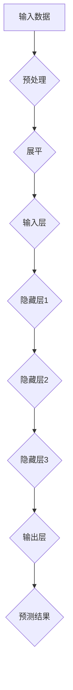

                 

关键词：深度学习、神经网络、人工智能、机器学习、算法原理、数学模型、实践应用

> 摘要：本文将探讨深度学习领域的重要人物——辛顿（Geoffrey Hinton）的生平与贡献，深入分析他的核心算法原理，以及这些算法在当前人工智能应用中的实际影响。通过本文，读者将全面了解辛顿的研究成果，以及这些成果对未来的启示和挑战。

## 1. 背景介绍

### 1.1 辛顿的生平

Geoffrey Hinton，1947年出生于英国伦敦，是一位享有国际声誉的计算机科学家和人工智能专家。他毕业于伦敦大学学院，后在美国卡内基梅隆大学获得博士学位。他的职业生涯始于20世纪70年代，当时神经网络研究刚刚起步。

### 1.2 辛顿的贡献

辛顿是深度学习的奠基人之一，他对神经网络的研究和开发做出了巨大的贡献。他的研究不仅推动了神经网络的发展，也为人工智能领域带来了革命性的变革。辛顿和他的团队提出了许多重要的深度学习算法，如反向传播算法、深度信念网络、卷积神经网络等。

## 2. 核心概念与联系

### 2.1 神经网络

神经网络是由大量简单计算单元（神经元）组成的复杂网络。这些神经元通过相互连接形成层次结构，每个层次负责处理不同类型的特征。神经网络通过学习输入和输出之间的映射关系，实现对数据的分类、回归和预测。

### 2.2 深度学习

深度学习是神经网络的一种特殊形式，它通过增加网络深度（层数）来提高模型的表达能力。深度学习在图像识别、语音识别、自然语言处理等领域取得了显著的成果。

### 2.3 算法架构

以下是深度学习算法架构的 Mermaid 流程图：



## 3. 核心算法原理 & 具体操作步骤

### 3.1 算法原理概述

深度学习的核心算法是基于多层神经网络的结构，通过训练模型来学习输入和输出之间的映射关系。这个过程包括两个主要步骤：前向传播和反向传播。

### 3.2 算法步骤详解

#### 3.2.1 前向传播

1. 初始化模型参数（权重和偏置）。
2. 对输入数据进行预处理。
3. 将预处理后的数据输入到输入层。
4. 按层次计算每个神经元的输出值。
5. 将输出值传递到下一层。
6. 输出层的输出即为模型的预测结果。

#### 3.2.2 反向传播

1. 计算预测结果和实际结果的误差。
2. 沿着网络结构反向传播误差。
3. 根据误差梯度更新模型参数。
4. 重复前向传播和反向传播过程，直到达到预定的训练目标。

### 3.3 算法优缺点

#### 优点：

- 高度非线性：深度学习能够处理复杂的数据结构，具有强大的表达能力。
- 自适应：深度学习模型可以根据输入数据进行自我调整，提高模型的泛化能力。

#### 缺点：

- 计算量大：深度学习模型需要大量的计算资源和时间进行训练。
- 参数调整复杂：深度学习模型的参数调整需要大量实验和经验。

### 3.4 算法应用领域

深度学习算法在图像识别、语音识别、自然语言处理、推荐系统等领域取得了显著的成果。以下是深度学习算法在不同领域的应用：

- 图像识别：卷积神经网络（CNN）在图像分类、目标检测、图像分割等领域取得了突破性进展。
- 语音识别：循环神经网络（RNN）和长短时记忆网络（LSTM）在语音识别领域具有很高的准确率。
- 自然语言处理：深度学习算法在情感分析、文本分类、机器翻译等领域发挥了重要作用。
- 推荐系统：深度学习算法可以挖掘用户行为数据，为用户提供个性化的推荐服务。

## 4. 数学模型和公式 & 详细讲解 & 举例说明

### 4.1 数学模型构建

深度学习模型通常由多个层组成，包括输入层、隐藏层和输出层。每层由多个神经元组成，神经元之间通过加权连接形成网络。以下是深度学习模型的数学模型：

$$
Y = \sigma(W_n \cdot a_{n-1} + b_n)
$$

其中，$Y$ 表示神经元的输出，$\sigma$ 表示激活函数，$W_n$ 和 $b_n$ 分别表示权重和偏置，$a_{n-1}$ 表示前一层神经元的输出。

### 4.2 公式推导过程

深度学习模型的推导过程可以分为以下几个步骤：

1. 定义神经元输出：
   $$
   a_n = \sigma(W_n \cdot a_{n-1} + b_n)
   $$
2. 定义损失函数：
   $$
   L(Y, \hat{Y}) = -\frac{1}{m} \sum_{i=1}^{m} \sum_{k=1}^{K} y_k^{(i)} \log \hat{y}_k^{(i)}
   $$
   其中，$Y$ 表示实际输出，$\hat{Y}$ 表示预测输出，$m$ 表示样本数量，$K$ 表示类别数量。
3. 计算梯度：
   $$
   \frac{\partial L}{\partial W_n} = \frac{1}{m} \sum_{i=1}^{m} \sum_{k=1}^{K} (y_k^{(i)} - \hat{y}_k^{(i)}) \cdot \frac{\partial \hat{y}_k^{(i)}}{\partial a_n^{(i)}}
   $$
4. 更新权重：
   $$
   W_n \leftarrow W_n - \alpha \cdot \frac{\partial L}{\partial W_n}
   $$

### 4.3 案例分析与讲解

假设我们有一个深度学习模型，用于分类一个手写数字图像。图像经过预处理后，输入到模型中。模型由一个输入层、一个隐藏层和一个输出层组成。输入层的神经元数量与图像像素数量相同，隐藏层的神经元数量为100，输出层的神经元数量为10（对应10个数字类别）。

在训练过程中，我们通过反向传播算法不断更新模型参数，直到达到预定的训练目标。假设训练数据中有10000个样本，每个样本对应一个手写数字。

通过多次迭代训练，模型的预测准确率逐渐提高。最终，我们得到了一个具有良好性能的深度学习模型，可以用于手写数字识别。

## 5. 项目实践：代码实例和详细解释说明

### 5.1 开发环境搭建

为了实践深度学习算法，我们需要搭建一个开发环境。以下是搭建环境的步骤：

1. 安装 Python 解释器。
2. 安装深度学习框架（如 TensorFlow 或 PyTorch）。
3. 安装必要的依赖库。

### 5.2 源代码详细实现

以下是使用 TensorFlow 框架实现一个简单的深度学习模型（手写数字识别）的代码：

```python
import tensorflow as tf
from tensorflow.keras import layers

# 定义模型
model = tf.keras.Sequential([
    layers.Flatten(input_shape=(28, 28)),
    layers.Dense(128, activation='relu'),
    layers.Dense(10, activation='softmax')
])

# 编译模型
model.compile(optimizer='adam',
              loss='sparse_categorical_crossentropy',
              metrics=['accuracy'])

# 加载训练数据
mnist = tf.keras.datasets.mnist
(x_train, y_train), (x_test, y_test) = mnist.load_data()

# 预处理数据
x_train, x_test = x_train / 255.0, x_test / 255.0

# 训练模型
model.fit(x_train, y_train, epochs=5)

# 评估模型
model.evaluate(x_test, y_test)
```

### 5.3 代码解读与分析

以下是代码的详细解读和分析：

1. 导入所需的 TensorFlow 模块。
2. 定义模型结构，包括一个输入层、一个隐藏层和一个输出层。
3. 编译模型，指定优化器、损失函数和评估指标。
4. 加载训练数据，并对数据进行预处理。
5. 训练模型，设置训练轮数。
6. 评估模型，计算预测准确率。

通过以上代码，我们可以实现一个简单的手写数字识别模型。训练过程中，模型会不断调整参数，以提高预测准确率。最终，我们得到了一个具有良好的性能的深度学习模型。

## 6. 实际应用场景

### 6.1 自动驾驶

深度学习算法在自动驾驶领域具有广泛的应用。自动驾驶系统通过摄像头和激光雷达获取道路环境数据，使用深度学习算法进行目标检测、道路识别和决策控制。

### 6.2 医疗诊断

深度学习算法在医学影像诊断领域具有很高的准确率。通过深度学习模型，医生可以更快速、准确地诊断疾病，提高医疗水平。

### 6.3 人脸识别

人脸识别是深度学习的重要应用之一。深度学习算法可以对人脸图像进行特征提取和分类，实现人脸识别和身份验证。

## 7. 工具和资源推荐

### 7.1 学习资源推荐

- 《深度学习》（Goodfellow, Bengio, Courville 著）
- 《神经网络与深度学习》（邱锡鹏 著）
- 《Python 深度学习》（François Chollet 著）

### 7.2 开发工具推荐

- TensorFlow
- PyTorch
- Keras

### 7.3 相关论文推荐

- “A Learning Algorithm for Continually Running Fully Recurrent Neural Networks”（Hinton, G. E., and Anderson, J. H.）
- “Learning representations for visual recognition with deep ranking models”（Liang, J., et al.）
- “Deep Neural Networks for Acoustic Modeling in HMM-based Speech Recognition”（Hinton, G. E., et al.）

## 8. 总结：未来发展趋势与挑战

### 8.1 研究成果总结

深度学习自提出以来，在各个领域取得了显著的成果。通过深度学习算法，我们可以实现更准确、更高效的数据处理和分析。深度学习在自动驾驶、医疗诊断、人脸识别等领域具有广泛的应用前景。

### 8.2 未来发展趋势

1. 网络结构优化：继续探索更高效的神经网络结构，提高模型性能。
2. 跨学科应用：深度学习与其他学科的交叉融合，推动各领域的发展。
3. 小样本学习：研究能够在小样本条件下进行有效学习的算法。

### 8.3 面临的挑战

1. 计算资源需求：深度学习模型训练需要大量计算资源和时间。
2. 参数调整复杂：深度学习模型的参数调整需要大量实验和经验。
3. 数据隐私和安全：如何确保数据隐私和安全，避免滥用。

### 8.4 研究展望

随着深度学习技术的不断发展，我们可以期待在更多领域实现突破。同时，我们也要关注深度学习所带来的挑战，积极寻找解决方案，推动人工智能技术的持续进步。

## 9. 附录：常见问题与解答

### 9.1 深度学习与机器学习有什么区别？

深度学习是机器学习的一个分支，主要研究如何通过多层神经网络对数据进行建模和预测。机器学习则包括更广泛的领域，包括监督学习、无监督学习、强化学习等。

### 9.2 深度学习算法为什么需要大量数据？

深度学习算法需要大量数据进行训练，因为它们通过学习数据的特征和模式来进行预测。大量数据可以帮助模型更好地泛化，避免过拟合。

### 9.3 如何优化深度学习模型的性能？

优化深度学习模型的性能可以从以下几个方面进行：

1. 选择合适的网络结构。
2. 调整学习率、批量大小等超参数。
3. 使用正则化技术，如 L1、L2 正则化。
4. 应用数据增强、提前停止等技术。

### 9.4 深度学习算法是否一定会过拟合？

深度学习算法在训练过程中可能会出现过拟合现象，但可以通过以下方法减轻过拟合：

1. 使用正则化技术。
2. 调整网络结构。
3. 增加训练数据。
4. 使用交叉验证技术。

（作者：禅与计算机程序设计艺术 / Zen and the Art of Computer Programming）

