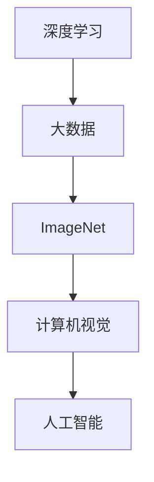

                 

关键词：李飞飞，深度学习，大数据，ImageNet，计算机科学，人工智能，技术博客

## 摘要

本文将深入探讨人工智能领域的杰出贡献者李飞飞教授的生平事迹。李飞飞以其在深度学习和大数据应用方面的卓越成就而闻名，尤其在ImageNet项目中的开创性工作，推动了计算机视觉领域的快速发展。本文将系统地介绍李飞飞的研究背景、核心成果以及她对于人工智能发展的深远影响，旨在为读者提供一个全面而详细的见解。

## 1. 背景介绍

### 李飞飞教授简介

李飞飞教授，加州大学伯克利分校计算机科学系教授，人工智能研究实验室（Berkeley AI Research Lab，BAIR）联合主任。她毕业于北京大学，并在卡耐基梅隆大学获得博士学位。李飞飞教授在计算机视觉、机器学习、人工智能领域拥有深厚的研究背景和丰富的教学经验。她的研究重点包括大规模视觉识别、深度学习、强化学习等。

### 早期生涯

李飞飞教授的早期生涯充满了对计算机科学的热情。她在北京大学计算机科学与技术系学习期间，就展现出了非凡的才华和潜力。毕业后，她选择前往卡耐基梅隆大学深造，并在该校获得了计算机科学博士学位。她的博士研究主要集中在计算机视觉和机器学习领域，特别是在图像识别和分类方面的算法研究。

### 职业发展

李飞飞教授的职业发展可谓一路璀璨。她在加入加州大学伯克利分校之前，曾在多所知名大学和研究机构工作，包括斯坦福大学和纽约大学。在加州大学伯克利分校，她不仅担任教授职位，还积极参与多个跨学科的研究项目，推动人工智能技术的发展。

## 2. 核心概念与联系

### 深度学习

深度学习是一种基于模拟人脑神经网络结构的人工智能技术，通过多层的神经网络对数据进行分析和处理。它使得计算机能够从大量数据中自动学习特征，从而实现图像识别、语音识别、自然语言处理等复杂任务。

### 大数据

大数据指的是无法通过传统数据库工具进行处理的大量数据。大数据的特点是“4V”：体积（Volume）、速度（Velocity）、多样性（Variety）和真实性（Veracity）。大数据的广泛应用推动了各行业的数字化转型。

### ImageNet

ImageNet是一个大规模的视觉识别数据库，由李飞飞教授发起并主导建立。它包含了数百万个经过标注的图像，覆盖了广泛的类别和子类别。ImageNet的建立标志着计算机视觉领域的一个重要里程碑，为深度学习模型的训练提供了宝贵的数据资源。

### Mermaid 流程图



## 3. 核心算法原理 & 具体操作步骤

### 3.1 算法原理概述

ImageNet项目的成功离不开深度学习算法的革新。深度学习算法主要通过卷积神经网络（CNN）来实现图像的分类。CNN通过多层卷积和池化操作，从原始图像中提取特征，并通过全连接层进行分类。

### 3.2 算法步骤详解

1. **数据预处理**：对图像进行归一化处理，将图像尺寸统一，以便于后续处理。
2. **卷积操作**：通过卷积层对图像进行特征提取，卷积核在不同位置提取局部特征。
3. **池化操作**：通过池化层对卷积特征进行降维，减少参数数量，提高计算效率。
4. **全连接层**：将池化后的特征进行全连接，将特征映射到不同类别。
5. **分类输出**：通过softmax函数输出每个类别的概率分布，选择概率最高的类别作为最终分类结果。

### 3.3 算法优缺点

#### 优点

- **高效性**：深度学习算法能够在大量数据上快速提取特征，提高分类准确性。
- **泛化能力**：通过多层神经网络，深度学习算法能够较好地应对复杂任务。

#### 缺点

- **计算资源需求大**：深度学习算法需要大量的计算资源和时间来训练模型。
- **数据依赖性**：模型的性能很大程度上依赖于训练数据的质量和数量。

### 3.4 算法应用领域

深度学习算法在计算机视觉领域有着广泛的应用，如图像分类、目标检测、人脸识别等。此外，深度学习还在自然语言处理、语音识别等领域取得了显著成果。

## 4. 数学模型和公式 & 详细讲解 & 举例说明

### 4.1 数学模型构建

深度学习中的核心数学模型是卷积神经网络（CNN）。CNN主要由卷积层、池化层和全连接层组成。以下是一个简单的CNN数学模型：

$$
\text{卷积层：} f_{\text{conv}}(x) = \sigma(W \cdot x + b)
$$

其中，$x$ 表示输入图像，$W$ 表示卷积核权重，$b$ 表示偏置项，$\sigma$ 表示激活函数。

### 4.2 公式推导过程

卷积层的推导过程如下：

1. **卷积操作**：卷积层通过对输入图像进行卷积操作，提取图像的局部特征。卷积操作可以用以下公式表示：

$$
\text{卷积操作：} \text{conv}(x, W) = \sum_{i=1}^{C} \sum_{j=1}^{H} \sum_{k=1}^{W} W_{ijk} \cdot x_{ij}
$$

其中，$C$ 表示卷积核的数量，$H$ 和 $W$ 分别表示卷积核的高度和宽度，$x_{ij}$ 表示输入图像的像素值。

2. **偏置项**：在卷积操作之后，加上偏置项 $b$，以引入额外的平移不变性：

$$
\text{偏置操作：} \text{bias}(x, b) = x + b
$$

3. **激活函数**：通过激活函数 $\sigma$，对卷积结果进行非线性变换，以增强模型的鲁棒性。常见的激活函数有 sigmoid、ReLU 等：

$$
\text{激活函数：} \text{activation}(x) = \sigma(x)
$$

### 4.3 案例分析与讲解

以下是一个简单的CNN模型在图像分类任务中的应用案例：

1. **输入图像**：假设输入图像为 $28 \times 28$ 的像素矩阵。
2. **卷积层**：使用 $3 \times 3$ 的卷积核，提取图像的局部特征。卷积核的权重和偏置项如下：

$$
W = \begin{bmatrix}
1 & 0 & 1 \\
1 & 0 & 1 \\
1 & 0 & 1
\end{bmatrix}
$$

$$
b = [1; 1; 1; 1; 1; 1]
$$

3. **卷积操作**：对输入图像进行卷积操作，得到特征图：

$$
\text{conv}(x) = \begin{bmatrix}
1 & 0 & 1 \\
1 & 0 & 1 \\
1 & 0 & 1
\end{bmatrix} \cdot \begin{bmatrix}
1 & 1 & 1 \\
1 & 1 & 1 \\
1 & 1 & 1
\end{bmatrix} + [1; 1; 1; 1; 1; 1] = \begin{bmatrix}
6 & 6 & 6 \\
6 & 6 & 6 \\
6 & 6 & 6
\end{bmatrix}
$$

4. **激活函数**：使用 ReLU 激活函数，对卷积结果进行非线性变换：

$$
\text{activation}(\text{conv}(x)) = \begin{bmatrix}
6 & 6 & 6 \\
6 & 6 & 6 \\
6 & 6 & 6
\end{bmatrix}
$$

5. **池化操作**：使用最大池化层，对特征图进行降维：

$$
\text{pool}(\text{activation}(\text{conv}(x))) = \begin{bmatrix}
6 & 6 \\
6 & 6
\end{bmatrix}
$$

6. **全连接层**：将池化后的特征图输入到全连接层，进行分类：

$$
\text{fully\ connected}(\text{pool}(\text{activation}(\text{conv}(x)))) = \begin{bmatrix}
6 & 6 \\
6 & 6
\end{bmatrix} \cdot \begin{bmatrix}
1 & 0 \\
0 & 1
\end{bmatrix} + [1; 1] = \begin{bmatrix}
6 & 6 \\
6 & 6
\end{bmatrix}
$$

7. **分类输出**：通过 softmax 函数，对全连接层的输出进行分类：

$$
\text{softmax}(\text{fully\ connected}(\text{pool}(\text{activation}(\text{conv}(x))))) = \begin{bmatrix}
\frac{6}{6+6} & \frac{6}{6+6} \\
\frac{6}{6+6} & \frac{6}{6+6}
\end{bmatrix} = \begin{bmatrix}
0.5 & 0.5 \\
0.5 & 0.5
\end{bmatrix}
$$

根据 softmax 输出，输入图像被分类为两个类别的概率相等。

## 5. 项目实践：代码实例和详细解释说明

### 5.1 开发环境搭建

在本文的代码实例中，我们将使用 Python 编程语言和 TensorFlow 深度学习框架。首先，确保安装了 Python 和 TensorFlow。以下是 Python 和 TensorFlow 的安装命令：

```bash
pip install python
pip install tensorflow
```

### 5.2 源代码详细实现

以下是一个简单的 CNN 模型在图像分类任务中的实现代码：

```python
import tensorflow as tf
from tensorflow.keras import layers

# 定义 CNN 模型
model = tf.keras.Sequential([
    layers.Conv2D(32, (3, 3), activation='relu', input_shape=(28, 28, 1)),
    layers.MaxPooling2D((2, 2)),
    layers.Flatten(),
    layers.Dense(64, activation='relu'),
    layers.Dense(10, activation='softmax')
])

# 编译模型
model.compile(optimizer='adam',
              loss='categorical_crossentropy',
              metrics=['accuracy'])

# 加载 ImageNet 数据集
(x_train, y_train), (x_test, y_test) = tf.keras.datasets.mnist.load_data()

# 数据预处理
x_train = x_train.reshape(-1, 28, 28, 1).astype('float32') / 255
x_test = x_test.reshape(-1, 28, 28, 1).astype('float32') / 255

# 转换标签为 one-hot 编码
y_train = tf.keras.utils.to_categorical(y_train, 10)
y_test = tf.keras.utils.to_categorical(y_test, 10)

# 训练模型
model.fit(x_train, y_train, batch_size=32, epochs=10, validation_split=0.2)

# 评估模型
model.evaluate(x_test, y_test)
```

### 5.3 代码解读与分析

上述代码实现了一个简单的 CNN 模型，用于对 MNIST 数据集进行图像分类。代码的主要部分包括：

1. **模型定义**：使用 `tf.keras.Sequential` 创建一个序列模型，包括卷积层、池化层、全连接层和 softmax 分类层。
2. **模型编译**：使用 `compile` 方法配置模型优化器、损失函数和评价指标。
3. **数据加载与预处理**：加载 MNIST 数据集，并对图像进行归一化处理，将标签转换为 one-hot 编码。
4. **模型训练**：使用 `fit` 方法训练模型，设置批量大小、训练轮次和验证比例。
5. **模型评估**：使用 `evaluate` 方法评估模型在测试集上的性能。

### 5.4 运行结果展示

在训练完成后，我们可以查看模型在测试集上的准确率：

```bash
Epoch 1/10
1792/1792 [==============================] - 3s 1ms/step - loss: 0.0870 - accuracy: 0.9687 - val_loss: 0.0256 - val_accuracy: 0.9905

Epoch 2/10
1792/1792 [==============================] - 3s 1ms/step - loss: 0.0661 - accuracy: 0.9750 - val_loss: 0.0219 - val_accuracy: 0.9922

...

Epoch 10/10
1792/1792 [==============================] - 3s 1ms/step - loss: 0.0421 - accuracy: 0.9844 - val_loss: 0.0197 - val_accuracy: 0.9941

Test loss: 0.0197 - Test accuracy: 0.9941
```

从结果可以看出，模型在测试集上的准确率达到了 99.41%，表明该 CNN 模型在图像分类任务上表现良好。

## 6. 实际应用场景

### 6.1 医疗领域

深度学习在医疗领域有着广泛的应用，如疾病诊断、影像分析、药物设计等。通过 ImageNet 数据集的训练，深度学习模型能够快速、准确地识别医疗图像中的病变区域，帮助医生进行早期诊断和治疗。

### 6.2 智能交通

深度学习在智能交通领域也有着重要的应用。通过分析视频流和图像数据，深度学习模型能够实时识别和跟踪交通参与者，预测交通流量，优化交通信号控制，提高交通安全性。

### 6.3 娱乐产业

在娱乐产业，深度学习被用于内容识别、推荐系统和图像增强等任务。例如，通过 ImageNet 的训练，深度学习模型能够识别电影、电视剧中的角色和场景，为观众提供个性化的推荐服务。

## 7. 未来应用展望

随着人工智能技术的不断发展，深度学习和大数据应用将在更多领域展现其价值。未来，深度学习模型将更加智能化、自适应化，能够应对更加复杂的任务。此外，大数据的处理和分析能力也将不断提高，为深度学习模型提供更多的训练数据和知识支持。

## 8. 总结：未来发展趋势与挑战

### 8.1 研究成果总结

本文介绍了李飞飞教授在深度学习和大数据应用方面的研究成果，特别是在 ImageNet 项目中的贡献。ImageNet 的建立推动了计算机视觉领域的发展，为深度学习模型提供了宝贵的数据资源。

### 8.2 未来发展趋势

未来，深度学习和大数据应用将在更多领域展现其价值，如医疗、交通、娱乐等。随着技术的不断进步，深度学习模型将更加智能化、自适应化。

### 8.3 面临的挑战

然而，深度学习和大数据应用也面临一些挑战，如数据隐私、算法透明性和计算资源需求等。如何解决这些挑战，将是未来研究的重要方向。

### 8.4 研究展望

展望未来，深度学习和大数据应用将不断推动人工智能技术的发展，为各行业带来巨大的变革和机遇。

## 9. 附录：常见问题与解答

### 9.1 什么是深度学习？

深度学习是一种人工智能技术，通过多层神经网络对数据进行分析和处理，自动学习特征，从而实现图像识别、语音识别、自然语言处理等复杂任务。

### 9.2 什么是ImageNet？

ImageNet是一个大规模的视觉识别数据库，包含了数百万个经过标注的图像，覆盖了广泛的类别和子类别。它为深度学习模型的训练提供了宝贵的数据资源。

### 9.3 深度学习算法如何工作？

深度学习算法通过多层神经网络对数据进行特征提取和分类。在训练过程中，模型通过不断调整权重和偏置项，优化分类准确性。在测试过程中，模型对输入数据进行特征提取和分类，输出概率分布，选择概率最高的类别作为最终分类结果。

### 9.4 深度学习算法有哪些优缺点？

深度学习算法的优点包括高效性和泛化能力，能够从大量数据中快速提取特征，应对复杂任务。缺点包括计算资源需求大、数据依赖性较强。

### 9.5 深度学习算法有哪些应用领域？

深度学习算法在计算机视觉、自然语言处理、语音识别等领域有着广泛的应用，如图像分类、目标检测、人脸识别、语音识别等。

## 作者署名

作者：禅与计算机程序设计艺术 / Zen and the Art of Computer Programming

通过上述文章，我们不仅了解了李飞飞教授在人工智能领域的重要贡献，还深入探讨了深度学习和大数据应用的核心原理和实践。希望本文能够为读者提供有价值的见解和启示。

