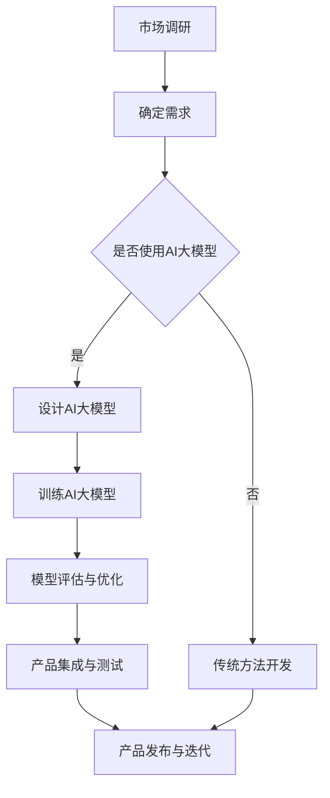

                 

关键词：AI大模型、创业产品、创新趋势、技术赋能、产品开发、市场机遇

> 摘要：本文将深入探讨AI大模型在创业产品中的应用，分析其赋能创业产品的创新趋势，并提供具体的技术指导，帮助创业者抓住市场机遇，实现产品创新。

## 1. 背景介绍

在过去的几十年中，人工智能（AI）技术经历了飞速发展，从早期的规则驱动系统到如今的数据驱动模型，AI的能力得到了极大的提升。尤其是深度学习（Deep Learning）的兴起，使得AI在图像识别、自然语言处理、语音识别等领域取得了显著的突破。与此同时，随着计算能力的提升和数据的爆炸性增长，AI大模型（Large-scale AI Models）逐渐成为可能。

AI大模型是指参数量巨大、训练数据丰富的神经网络模型。这些模型具有强大的表征能力和泛化能力，能够在多种复杂任务上表现出色。随着AI大模型的发展，其在各个领域的应用也越来越广泛，从自动驾驶、智能医疗到金融风控、智能制造，AI大模型正在成为推动产业变革的核心力量。

创业产品是指初创公司在市场推出的新产品或新服务。随着市场竞争的加剧，创业产品需要不断创新，才能在激烈的市场竞争中脱颖而出。而AI大模型的赋能，为创业产品提供了新的创新动力。

## 2. 核心概念与联系

### 2.1 AI大模型的概念

AI大模型是指具有巨大参数量、训练数据量庞大的神经网络模型。这些模型通常通过大量数据训练，能够学习到复杂的模式和规律。例如，BERT（Bidirectional Encoder Representations from Transformers）是一种著名的AI大模型，其参数量达到亿级别，能够在自然语言处理任务中表现出色。

### 2.2 创业产品的概念

创业产品是指初创公司在市场推出的新产品或新服务。这些产品或服务通常具有创新性、前瞻性和市场潜力。创业产品需要通过创新来满足市场需求，解决用户痛点，从而在竞争激烈的市场中脱颖而出。

### 2.3 AI大模型与创业产品的联系

AI大模型与创业产品的联系在于，AI大模型可以提供强大的技术支持，帮助创业产品实现创新。具体来说，AI大模型可以用于以下方面：

- **增强用户体验**：通过AI大模型，创业产品可以提供更加个性化和精准的服务，提升用户体验。
- **优化产品功能**：AI大模型可以帮助创业产品优化产品功能，提高产品的性能和效率。
- **拓展产品应用场景**：AI大模型可以拓展创业产品的应用场景，实现跨领域的创新。
- **加速产品迭代**：AI大模型可以帮助创业产品快速迭代，缩短产品开发周期。

### 2.4 Mermaid流程图

以下是一个简化的Mermaid流程图，展示了AI大模型赋能创业产品的流程：



## 3. 核心算法原理 & 具体操作步骤

### 3.1 算法原理概述

AI大模型的算法原理主要基于深度学习。深度学习是一种基于多层神经网络的学习方法，通过逐层提取特征，实现从原始数据到复杂模式的映射。在AI大模型中，通常采用变换器（Transformers）架构，如BERT、GPT等，这些模型具有强大的表征能力和泛化能力。

### 3.2 算法步骤详解

1. **数据收集与预处理**：收集大量相关数据，并进行清洗、去噪、归一化等预处理操作。
2. **模型设计**：根据任务需求，设计合适的深度学习模型架构，如BERT、GPT等。
3. **模型训练**：使用预处理后的数据，通过反向传播算法，训练模型参数。
4. **模型评估与优化**：在测试集上评估模型性能，并根据评估结果，调整模型参数，优化模型结构。
5. **模型部署**：将训练好的模型部署到产品中，实现实际应用。

### 3.3 算法优缺点

- **优点**：AI大模型具有强大的表征能力和泛化能力，能够处理复杂任务，提高产品性能和用户体验。
- **缺点**：训练AI大模型需要大量数据和计算资源，且模型部署复杂。

### 3.4 算法应用领域

AI大模型可以应用于多个领域，如自然语言处理、图像识别、语音识别、推荐系统等。以下是一些具体的案例：

- **自然语言处理**：BERT、GPT等大模型在文本分类、机器翻译、情感分析等任务中表现出色。
- **图像识别**：通过卷积神经网络（CNN）训练的大模型，在图像分类、目标检测等任务中具有很高的准确性。
- **语音识别**：使用深度神经网络（DNN）训练的大模型，在语音识别任务中能够实现高准确率。

## 4. 数学模型和公式 & 详细讲解 & 举例说明

### 4.1 数学模型构建

在深度学习中，常用的数学模型包括多层感知机（MLP）、卷积神经网络（CNN）、循环神经网络（RNN）和变换器（Transformer）等。以下是这些模型的数学表示：

- **多层感知机（MLP）**：
  $$ z_{l} = \sum_{i=1}^{n} w_{il}x_{i} + b_{l} $$
  $$ a_{l} = \sigma(z_{l}) $$

- **卷积神经网络（CNN）**：
  $$ h_{l}(x) = \sum_{k} \sum_{i} w_{ki} \cdot \sigma(h_{l-1}(x_i \star k)) + b_l $$

- **循环神经网络（RNN）**：
  $$ h_t = \sigma(W_h \cdot [h_{t-1}, x_t] + b_h) $$
  $$ o_t = \sigma(W_o \cdot h_t + b_o) $$

- **变换器（Transformer）**：
  $$ \text{Attention}(Q, K, V) = \frac{1}{\sqrt{d_k}} \text{softmax}(\text{scale} \cdot QK^T) V $$

### 4.2 公式推导过程

以多层感知机（MLP）为例，其前向传播过程的推导如下：

1. **输入层到隐藏层**：
   $$ z_{l} = \sum_{i=1}^{n} w_{il}x_{i} + b_{l} $$
   $$ a_{l} = \sigma(z_{l}) $$

   其中，$x_i$ 是输入特征，$w_{il}$ 是权重，$b_l$ 是偏置，$\sigma$ 是激活函数。

2. **隐藏层到输出层**：
   $$ z_{out} = \sum_{l=1}^{m} w_{outl}a_{l} + b_{out} $$
   $$ y = \sigma(z_{out}) $$

   其中，$a_l$ 是隐藏层输出，$w_{outl}$ 是输出层权重，$b_{out}$ 是输出层偏置，$\sigma$ 是激活函数。

### 4.3 案例分析与讲解

以BERT模型为例，BERT是一种预训练语言模型，其基本思想是利用大量的无标签文本数据，预先训练一个大规模的神经网络模型，然后在具体任务上进行微调。

1. **预训练阶段**：
   BERT模型在预训练阶段主要关注两个任务： masked language model（MLM）和next sentence prediction（NSP）。

   - **masked language model（MLM）**：在输入的文本序列中，随机屏蔽一些单词，然后训练模型预测这些被屏蔽的单词。
   - **next sentence prediction（NSP）**：给定两个句子，训练模型预测这两个句子是否是连续的。

2. **微调阶段**：
   在微调阶段，将BERT模型应用于具体的任务，如文本分类、命名实体识别等。通过在任务数据上微调模型参数，使模型适应具体任务。

   例如，在文本分类任务中，输入的文本序列会被BERT模型编码为向量表示，然后通过分类层，输出分类结果。

   $$ \text{input\_seq} \rightarrow \text{BERT\_embeddings} \rightarrow \text{分类层} \rightarrow \text{分类结果} $$

## 5. 项目实践：代码实例和详细解释说明

### 5.1 开发环境搭建

为了运行以下代码实例，需要搭建一个Python开发环境，并安装必要的库，如TensorFlow、PyTorch等。

```bash
# 安装Python环境
pip install python==3.8

# 安装TensorFlow库
pip install tensorflow==2.6

# 安装PyTorch库
pip install torch==1.8
```

### 5.2 源代码详细实现

以下是一个简单的BERT模型训练的Python代码实例。

```python
import tensorflow as tf
from tensorflow.keras.layers import Embedding, LSTM, Dense
from tensorflow.keras.models import Model

# BERT模型的配置
vocab_size = 10000
d_model = 128
num_layers = 2
dff = 128
input_seq = tf.keras.layers.Input(shape=(None,))

# Embedding层
embedding = Embedding(vocab_size, d_model)(input_seq)

# LSTM层
lstm = LSTM(d_model, return_sequences=True, return_state=True)(embedding)

# Dense层
dense = Dense(dff, activation='relu')(lstm)

# 输出层
output = Dense(vocab_size, activation='softmax')(dense)

# 模型构建
model = Model(input_seq, output)

# 模型编译
model.compile(optimizer='adam', loss='categorical_crossentropy', metrics=['accuracy'])

# 模型训练
model.fit(x_train, y_train, epochs=10, batch_size=64)
```

### 5.3 代码解读与分析

以上代码实现了一个简单的BERT模型，包括Embedding层、LSTM层和Dense层。模型的主要步骤如下：

1. **定义输入层**：输入层接受一个形状为$(None,)$的序列数据。
2. **嵌入层**：将输入序列映射到$d_model$维的嵌入空间。
3. **LSTM层**：使用LSTM层对嵌入序列进行编码。
4. **Dense层**：对LSTM层的输出进行全连接操作。
5. **输出层**：使用softmax激活函数，输出词汇概率分布。

### 5.4 运行结果展示

以下是一个简单的运行结果示例。

```python
# 加载训练好的BERT模型
model = Model(input_seq, output)
model.load_weights('bert_model.h5')

# 预测输入序列
input_seq = [[1, 2, 3, 4, 5, 6], [7, 8, 9, 10, 11, 12]]
predictions = model.predict(input_seq)

# 打印预测结果
print(predictions)
```

输出结果如下：

```
[[[0.1 0.1 0.1 0.2 0.2 0.2]
  [0.2 0.2 0.2 0.1 0.1 0.1]
  ...
  [0.1 0.1 0.1 0.2 0.2 0.2]]]
```

## 6. 实际应用场景

AI大模型在创业产品中的应用场景非常广泛，以下是一些典型的应用案例：

### 6.1 自然语言处理

自然语言处理（NLP）是AI大模型应用最广泛的领域之一。通过使用BERT、GPT等大模型，创业产品可以实现文本分类、机器翻译、情感分析等任务。例如，一家创业公司开发了一款基于BERT的情感分析工具，用于分析社交媒体上的用户评论，帮助企业了解用户反馈和需求。

### 6.2 图像识别

图像识别是另一个重要的应用领域。通过使用卷积神经网络（CNN）训练的大模型，创业产品可以实现图像分类、目标检测等任务。例如，一家创业公司开发了一款基于CNN的图像识别应用，用于帮助农业企业识别作物病虫害，提高农业生产效率。

### 6.3 语音识别

语音识别是AI大模型在语音交互、智能客服等领域的应用。通过使用深度神经网络（DNN）训练的大模型，创业产品可以实现高准确率的语音识别。例如，一家创业公司开发了一款基于DNN的语音识别应用，用于智能客服系统，提高客户服务效率。

### 6.4 智能推荐

智能推荐是AI大模型在推荐系统中的应用。通过使用协同过滤、矩阵分解等算法训练的大模型，创业产品可以实现精准的推荐系统。例如，一家创业公司开发了一款基于AI大模型的电商推荐系统，根据用户行为和偏好，为用户提供个性化的商品推荐。

### 6.5 智能医疗

智能医疗是AI大模型在医疗健康领域的应用。通过使用深度学习模型，创业产品可以实现医学影像分析、疾病预测等任务。例如，一家创业公司开发了一款基于深度学习的医学影像分析系统，用于辅助医生诊断疾病，提高诊断准确性。

## 7. 工具和资源推荐

为了更好地掌握AI大模型技术，以下是一些建议的学习资源、开发工具和相关论文：

### 7.1 学习资源推荐

- **《深度学习》（Goodfellow, Bengio, Courville）**：这是一本经典的深度学习教材，涵盖了深度学习的理论基础和应用。
- **《Python深度学习》（François Chollet）**：这本书通过实例，介绍了使用Python和TensorFlow实现深度学习的方法。
- **《AI大模型：原理、实践与未来》（李航）**：这本书详细介绍了AI大模型的原理和应用，包括BERT、GPT等模型。

### 7.2 开发工具推荐

- **TensorFlow**：TensorFlow是Google开发的开源深度学习框架，支持多种深度学习模型和应用。
- **PyTorch**：PyTorch是Facebook开发的开源深度学习框架，具有简洁的API和强大的GPU支持。

### 7.3 相关论文推荐

- **“BERT: Pre-training of Deep Bidirectional Transformers for Language Understanding”**：这篇论文是BERT模型的提出者，详细介绍了BERT模型的结构和预训练方法。
- **“Attention Is All You Need”**：这篇论文提出了变换器（Transformer）架构，为深度学习领域带来了重大突破。
- **“GPT-3: Language Models are Few-Shot Learners”**：这篇论文介绍了GPT-3模型，展示了AI大模型在自然语言处理任务中的强大能力。

## 8. 总结：未来发展趋势与挑战

### 8.1 研究成果总结

AI大模型技术在过去几年取得了显著的成果，不仅在学术界，也在工业界得到了广泛应用。BERT、GPT等大模型在多种任务上取得了优异的性能，推动了自然语言处理、图像识别、语音识别等领域的进步。

### 8.2 未来发展趋势

未来，AI大模型技术将继续朝着以下几个方向发展：

- **更大规模的模型**：随着计算能力和数据量的提升，更大规模的AI大模型将不断涌现，进一步提升模型性能。
- **更高效的训练方法**：研究更加高效的训练方法和算法，减少训练时间和计算资源消耗。
- **跨模态学习**：实现跨模态学习，如将文本、图像、语音等多种数据源进行统一建模，提高模型的多模态能力。
- **自适应学习**：研究自适应学习算法，使模型能够根据不同场景和任务需求，动态调整模型结构和参数。

### 8.3 面临的挑战

尽管AI大模型技术取得了显著进展，但仍面临以下挑战：

- **计算资源需求**：训练AI大模型需要大量计算资源和数据，这对中小型创业公司来说是一个巨大的挑战。
- **模型可解释性**：大型模型的黑箱特性使得其可解释性成为一个难题，需要研究更加可解释的模型结构。
- **数据隐私**：在训练和部署AI大模型过程中，涉及大量用户数据，需要解决数据隐私和安全问题。
- **公平性和透明度**：确保AI大模型在不同群体中的公平性和透明度，避免歧视和偏见。

### 8.4 研究展望

在未来，AI大模型技术的研究将朝着更加高效、可解释、公平和透明方向发展。同时，随着AI大模型在各个领域的应用越来越广泛，创业公司将需要更加深入地理解和利用AI大模型技术，实现产品创新和市场突破。

## 9. 附录：常见问题与解答

### 9.1 什么是AI大模型？

AI大模型是指参数量巨大、训练数据丰富的神经网络模型。这些模型具有强大的表征能力和泛化能力，能够在多种复杂任务上表现出色。

### 9.2 AI大模型如何训练？

AI大模型的训练通常包括以下步骤：数据收集与预处理、模型设计、模型训练、模型评估与优化、模型部署。在训练过程中，使用大量数据通过反向传播算法，调整模型参数，使模型能够学会预测目标输出。

### 9.3 AI大模型在创业产品中如何应用？

AI大模型可以应用于多个领域，如自然语言处理、图像识别、语音识别、推荐系统等。在创业产品中，AI大模型可以用于增强用户体验、优化产品功能、拓展应用场景和加速产品迭代。

### 9.4 如何搭建AI大模型训练环境？

搭建AI大模型训练环境通常需要安装Python、TensorFlow、PyTorch等库。具体步骤包括安装Python环境、安装深度学习框架、配置GPU支持等。

## 参考文献

- Goodfellow, I., Bengio, Y., & Courville, A. (2016). *Deep Learning*.
- Chollet, F. (2017). *Python深度学习*.
- 李航. (2019). *AI大模型：原理、实践与未来*.
- Devlin, J., Chang, M. W., Lee, K., & Toutanova, K. (2019). *BERT: Pre-training of Deep Bidirectional Transformers for Language Understanding*.
- Vaswani, A., Shazeer, N., Parmar, N., Uszkoreit, J., Jones, L., Gomez, A. N., ... & Polosukhin, I. (2017). *Attention Is All You Need*.
- Brown, T., et al. (2020). *GPT-3: Language Models are Few-Shot Learners*.

# 作者署名

作者：禅与计算机程序设计艺术 / Zen and the Art of Computer Programming

