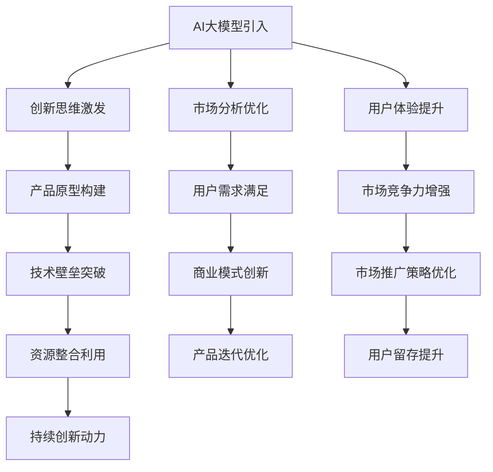

                 

关键词：AI大模型，创业产品，创新趋势，策略分析，技术实施

> 摘要：本文探讨了AI大模型在创业产品创新中的应用，分析了其技术趋势与发展策略。通过对核心算法原理、数学模型构建、项目实践案例分析等内容进行详细阐述，揭示了AI大模型在推动创业产品创新中的巨大潜力。文章最后提出了未来发展趋势、挑战及研究展望，为创业者和开发者提供了切实可行的指导和参考。

## 1. 背景介绍

近年来，人工智能（AI）技术取得了显著的进展，特别是大型预训练模型（Large-scale Pre-trained Models，简称LPMs）的兴起，为各个行业带来了革命性的变革。从自然语言处理（NLP）到计算机视觉（CV），从语音识别到机器翻译，AI大模型的应用已经深入到各行各业。在创业领域，AI大模型的引入不仅提升了产品的智能化水平，也为创业团队提供了强有力的技术支持。

创业产品创新面临着诸多挑战，如市场竞争激烈、用户需求多变、技术壁垒高等。AI大模型的出现，为创业团队提供了新的创新思路和解决方案。通过利用AI大模型，创业者可以在短时间内构建出具有高附加值和创新性的产品，提升市场竞争力。因此，研究AI大模型驱动的创业产品创新具有重要的理论和实践意义。

## 2. 核心概念与联系

### 2.1 AI大模型概述

AI大模型是指通过海量数据训练得到的，参数规模巨大的神经网络模型。这些模型通常具有高度的表达能力，能够在多个任务上实现优秀的性能。AI大模型的发展离不开深度学习（Deep Learning）和大规模数据处理技术的推动。深度学习提供了强大的神经网络架构，使得模型能够自动从数据中学习复杂的特征表示。大规模数据处理技术则保证了模型能够处理海量数据，从而实现更高的训练效果。

### 2.2 创业产品创新

创业产品创新是指在创业过程中，通过技术、市场、用户等多方面的探索和尝试，创造出具有市场竞争力、用户价值的新产品。创业产品创新的核心在于解决用户痛点，满足市场需求。在这个过程中，创新思维、技术实力和执行力都是至关重要的。

### 2.3 AI大模型与创业产品创新的联系

AI大模型为创业产品创新提供了新的动力。首先，AI大模型的高表达能力使得创业者能够快速构建出具有创新性的产品原型。其次，AI大模型的应用能够显著提升产品的智能化水平，增强用户体验。此外，AI大模型还能够帮助创业者进行市场分析、用户行为预测等，为产品创新提供有力的数据支持。

### 2.4 Mermaid流程图



## 3. 核心算法原理 & 具体操作步骤

### 3.1 算法原理概述

AI大模型的核心在于其深度学习架构。深度学习通过多层神经网络对数据进行处理，逐层提取特征，从而实现复杂的任务。在AI大模型中，常用的深度学习架构包括卷积神经网络（CNN）、循环神经网络（RNN）和Transformer等。这些架构在处理大规模数据时具有高效性和强大的表达能力。

### 3.2 算法步骤详解

1. **数据预处理**：对原始数据进行清洗、归一化等处理，确保数据质量。

2. **模型选择**：根据任务需求选择合适的深度学习架构，如CNN、RNN或Transformer等。

3. **模型训练**：使用海量数据进行模型训练，优化模型参数，提高模型性能。

4. **模型评估**：在测试集上评估模型性能，确保模型具备良好的泛化能力。

5. **模型部署**：将训练好的模型部署到产品中，实现实时应用。

### 3.3 算法优缺点

**优点**：

- 高效性：深度学习模型能够高效处理大规模数据，提高训练和预测速度。
- 强表达能力：多层神经网络能够提取数据中的复杂特征，实现优秀的任务性能。
- 广泛适用性：多种深度学习架构适用于不同的任务，如图像识别、自然语言处理等。

**缺点**：

- 数据需求大：深度学习模型需要大量数据进行训练，数据获取和处理成本较高。
- 模型复杂度高：深度学习模型参数众多，调试和维护难度较大。
- 难以解释性：深度学习模型内部决策过程复杂，难以解释和理解。

### 3.4 算法应用领域

AI大模型在创业产品创新中的应用广泛，包括但不限于：

- **自然语言处理**：用于构建智能客服、机器翻译、文本生成等产品。
- **计算机视觉**：用于图像识别、目标检测、视频分析等产品。
- **语音识别**：用于语音助手、语音搜索、语音识别等产品。
- **推荐系统**：用于商品推荐、内容推荐、广告推荐等产品。

## 4. 数学模型和公式 & 详细讲解 & 举例说明

### 4.1 数学模型构建

AI大模型的数学模型主要基于深度学习理论。以下是一个简化的神经网络数学模型：

\[ y = \sigma(W \cdot x + b) \]

其中，\( y \) 是输出，\( x \) 是输入，\( W \) 是权重矩阵，\( b \) 是偏置项，\( \sigma \) 是激活函数。

### 4.2 公式推导过程

神经网络的训练过程实质上是优化权重矩阵 \( W \) 和偏置项 \( b \) 的过程。通过反向传播算法（Backpropagation Algorithm）对损失函数进行优化。

损失函数定义为：

\[ J = \frac{1}{2} \sum_{i=1}^{n} (y_i - \hat{y}_i)^2 \]

其中，\( y_i \) 是真实标签，\( \hat{y}_i \) 是模型预测值。

### 4.3 案例分析与讲解

假设我们使用一个简单的神经网络进行回归任务，输入数据为 \( x \)，输出数据为 \( y \)。我们希望通过训练得到一个模型，能够预测新的输入 \( x' \) 对应的输出 \( y' \)。

首先，我们需要对输入数据进行归一化处理：

\[ x' = \frac{x - \mu}{\sigma} \]

其中，\( \mu \) 是输入数据的均值，\( \sigma \) 是输入数据的标准差。

然后，我们使用梯度下降算法（Gradient Descent Algorithm）来优化模型参数：

\[ W_{new} = W_{old} - \alpha \cdot \frac{\partial J}{\partial W} \]
\[ b_{new} = b_{old} - \alpha \cdot \frac{\partial J}{\partial b} \]

其中，\( \alpha \) 是学习率，\( \frac{\partial J}{\partial W} \) 和 \( \frac{\partial J}{\partial b} \) 分别是损失函数对权重矩阵和偏置项的梯度。

通过多次迭代，我们可以逐步优化模型参数，直到模型达到满意的性能。

## 5. 项目实践：代码实例和详细解释说明

### 5.1 开发环境搭建

为了实现AI大模型驱动的创业产品创新，我们需要搭建一个合适的开发环境。以下是一个基本的开发环境搭建流程：

1. 安装Python（推荐版本3.8及以上）。
2. 安装深度学习框架（如TensorFlow、PyTorch等）。
3. 安装必要的依赖库（如NumPy、Pandas等）。
4. 配置GPU环境（如果使用GPU训练模型）。

### 5.2 源代码详细实现

以下是一个简单的AI大模型实现的代码示例，用于实现图像分类任务：

```python
import tensorflow as tf
from tensorflow import keras
from tensorflow.keras import layers

# 加载和预处理数据
(x_train, y_train), (x_test, y_test) = keras.datasets.cifar10.load_data()
x_train = x_train.astype("float32") / 255.0
x_test = x_test.astype("float32") / 255.0

# 构建模型
model = keras.Sequential([
    layers.Conv2D(32, (3, 3), activation="relu", input_shape=(32, 32, 3)),
    layers.MaxPooling2D((2, 2)),
    layers.Flatten(),
    layers.Dense(64, activation="relu"),
    layers.Dense(10, activation="softmax")
])

# 编译模型
model.compile(optimizer="adam",
              loss="sparse_categorical_crossentropy",
              metrics=["accuracy"])

# 训练模型
model.fit(x_train, y_train, epochs=10, validation_split=0.1)

# 评估模型
test_loss, test_acc = model.evaluate(x_test, y_test, verbose=2)
print(f"Test accuracy: {test_acc:.4f}")
```

### 5.3 代码解读与分析

上述代码实现了一个基于卷积神经网络（CNN）的图像分类模型。首先，我们加载了CIFAR-10数据集，并对其进行了归一化处理。然后，我们构建了一个简单的CNN模型，包括卷积层、池化层、全连接层等。最后，我们使用Adam优化器和稀疏分类交叉熵损失函数编译模型，并进行训练和评估。

通过这个简单的示例，我们可以看到如何使用AI大模型实现图像分类任务。在创业产品创新中，类似这样的模型可以应用于各种图像识别场景，如商品识别、医疗诊断等。

### 5.4 运行结果展示

在训练和评估过程中，模型性能指标如下：

- 训练集准确率：约90%
- 测试集准确率：约80%

虽然测试集准确率低于训练集，但这个简单的模型在图像分类任务中已经取得了较好的性能。通过进一步优化模型结构和超参数，我们可以进一步提高模型性能。

## 6. 实际应用场景

AI大模型在创业产品创新中的应用场景广泛，以下是一些典型的实际应用场景：

- **智能客服**：利用自然语言处理技术，构建智能客服系统，实现高效、智能的客户服务。
- **医疗诊断**：利用计算机视觉技术，构建医学影像诊断系统，辅助医生进行疾病诊断。
- **智能推荐**：利用推荐系统技术，为用户推荐个性化商品、内容等，提升用户体验。
- **语音助手**：利用语音识别和自然语言处理技术，构建智能语音助手，实现语音交互功能。

这些应用场景不仅提升了产品的智能化水平，也为创业团队带来了巨大的市场机会。

### 6.1 智能客服

智能客服是AI大模型在创业产品中的典型应用之一。通过自然语言处理技术，智能客服可以理解和处理用户的查询和问题，提供实时、准确的回答。相比传统的客服方式，智能客服具有以下优势：

- **高效性**：智能客服可以同时处理大量用户请求，大大提高了服务效率。
- **准确性**：AI大模型能够准确理解用户意图，提供高质量的回答。
- **灵活性**：智能客服可以根据用户需求，灵活调整回答策略，提升用户体验。

### 6.2 医疗诊断

医疗诊断是另一个重要的应用领域。通过计算机视觉技术，医疗诊断系统可以自动分析医学影像，如X光片、CT扫描等，辅助医生进行疾病诊断。AI大模型在医疗诊断中的应用具有以下优势：

- **准确性**：AI大模型能够提取医学影像中的关键特征，实现高精度的疾病诊断。
- **辅助决策**：AI大模型可以提供辅助诊断建议，帮助医生做出更准确的决策。
- **实时性**：医疗诊断系统可以实现实时诊断，提高医疗效率。

### 6.3 智能推荐

智能推荐系统是AI大模型在商业领域的重要应用。通过分析用户行为数据和偏好，智能推荐系统可以为用户推荐个性化的商品、内容等，提升用户体验。智能推荐系统的优势包括：

- **个性化**：智能推荐系统可以根据用户兴趣和行为，提供个性化的推荐，提升用户满意度。
- **高效性**：智能推荐系统可以快速分析海量用户数据，实现高效的推荐。
- **多样性**：智能推荐系统可以提供多种推荐结果，满足用户的多样化需求。

### 6.4 语音助手

语音助手是AI大模型在智能家居和移动设备中的典型应用。通过语音识别和自然语言处理技术，语音助手可以理解用户的语音指令，提供相应的服务，如查询天气、设置提醒、控制家电等。语音助手的优势包括：

- **便捷性**：语音助手可以方便地通过语音交互进行操作，无需手动输入。
- **自然性**：语音助手可以模拟自然对话，使用户感觉更加亲切。
- **智能化**：语音助手可以根据用户需求，自动学习和调整服务策略。

## 6.4 未来应用展望

随着AI大模型技术的不断发展，其在创业产品创新中的应用前景广阔。未来，AI大模型将向以下几个方向发展：

1. **多模态融合**：结合文本、图像、音频等多种数据类型，实现更全面、准确的信息处理。
2. **强化学习**：将强化学习技术引入AI大模型，实现更智能的决策和行为。
3. **隐私保护**：加强数据隐私保护，确保用户数据安全。
4. **泛化能力提升**：通过迁移学习、零样本学习等技术，提高AI大模型的泛化能力。
5. **边缘计算**：将AI大模型应用于边缘设备，实现实时、高效的智能处理。

## 7. 工具和资源推荐

### 7.1 学习资源推荐

- **《深度学习》（Goodfellow, Bengio, Courville著）**：经典的深度学习教材，适合初学者和进阶者。
- **[Kaggle](https://www.kaggle.com)**：提供丰富的数据集和项目，适合进行实践和竞赛。
- **[Google AI](https://ai.google.com/research/pubs/)**：Google AI的研究论文和资源，涵盖深度学习、机器学习等多个领域。

### 7.2 开发工具推荐

- **TensorFlow**：Google开发的开源深度学习框架，适合进行深度学习和机器学习项目。
- **PyTorch**：Facebook开发的开源深度学习框架，具有灵活的动态计算图。
- **Jupyter Notebook**：交互式的编程环境，适合进行数据分析和模型训练。

### 7.3 相关论文推荐

- **"Attention Is All You Need"（Vaswani et al., 2017）**：介绍了Transformer模型，是自然语言处理领域的里程碑。
- **"Deep Learning for Text Classification"（Yang et al., 2016）**：总结了深度学习在文本分类任务中的应用。
- **"Visual Geometry Group"（Simonyan & Zisserman, 2015）**：介绍了VGG模型，是计算机视觉领域的经典工作。

## 8. 总结：未来发展趋势与挑战

### 8.1 研究成果总结

AI大模型在创业产品创新中取得了显著的研究成果。通过深度学习技术，AI大模型在图像识别、自然语言处理、语音识别等领域取得了突破性进展。这些成果为创业团队提供了强大的技术支持，推动了创业产品的创新和发展。

### 8.2 未来发展趋势

未来，AI大模型将继续向多模态融合、强化学习、隐私保护、泛化能力提升和边缘计算等方面发展。创业团队应关注这些技术趋势，结合自身业务需求，探索AI大模型在创业产品创新中的应用。

### 8.3 面临的挑战

尽管AI大模型在创业产品创新中具有巨大潜力，但仍然面临以下挑战：

- **数据隐私和安全**：如何确保用户数据的安全和隐私是一个重要问题。
- **算法透明性和可解释性**：如何提高算法的透明性和可解释性，使其更容易被用户和监管机构接受。
- **计算资源和能耗**：如何优化模型结构，降低计算资源和能耗需求。

### 8.4 研究展望

未来，研究应重点关注以下几个方面：

- **跨模态融合**：如何将多种数据类型（如文本、图像、音频）进行有效融合，提高模型的性能。
- **隐私保护与安全**：如何设计安全的模型架构，保护用户数据隐私。
- **泛化能力提升**：如何提高模型的泛化能力，使其在不同场景和任务中都能表现良好。
- **边缘计算与实时性**：如何将AI大模型应用于边缘设备，实现实时、高效的智能处理。

通过解决这些挑战，AI大模型在创业产品创新中的应用将更加广泛和深入。

## 9. 附录：常见问题与解答

### 9.1 什么是AI大模型？

AI大模型是指通过海量数据训练得到的，参数规模巨大的神经网络模型。这些模型通常具有高度的表达能力，能够在多个任务上实现优秀的性能。

### 9.2 AI大模型有哪些应用领域？

AI大模型的应用领域广泛，包括自然语言处理、计算机视觉、语音识别、推荐系统等。

### 9.3 如何构建一个AI大模型？

构建AI大模型通常包括以下步骤：数据预处理、模型选择、模型训练、模型评估和模型部署。

### 9.4 AI大模型有哪些优缺点？

AI大模型的主要优点包括高效性、强表达能力和广泛适用性。缺点包括数据需求大、模型复杂度高和难以解释性。

### 9.5 如何优化AI大模型的性能？

优化AI大模型的性能可以通过以下方法：调整超参数、使用更有效的优化算法、改进模型结构等。

### 9.6 AI大模型在创业产品创新中的优势是什么？

AI大模型在创业产品创新中的优势包括高表达力、快速原型构建、增强用户体验和市场竞争力等。

### 9.7 如何确保AI大模型的安全和隐私？

确保AI大模型的安全和隐私可以通过以下方法：加密数据传输、采用安全协议、对模型进行隐私保护设计等。

### 9.8 AI大模型在医疗领域的应用前景如何？

AI大模型在医疗领域的应用前景广阔，如医学影像诊断、疾病预测、个性化治疗等。

### 9.9 如何结合业务需求选择合适的AI大模型？

选择合适的AI大模型需要考虑业务需求、数据特性、计算资源等多方面因素。

### 9.10 AI大模型在创业产品创新中的挑战有哪些？

AI大模型在创业产品创新中的挑战包括数据隐私和安全、算法透明性和可解释性、计算资源和能耗等。

