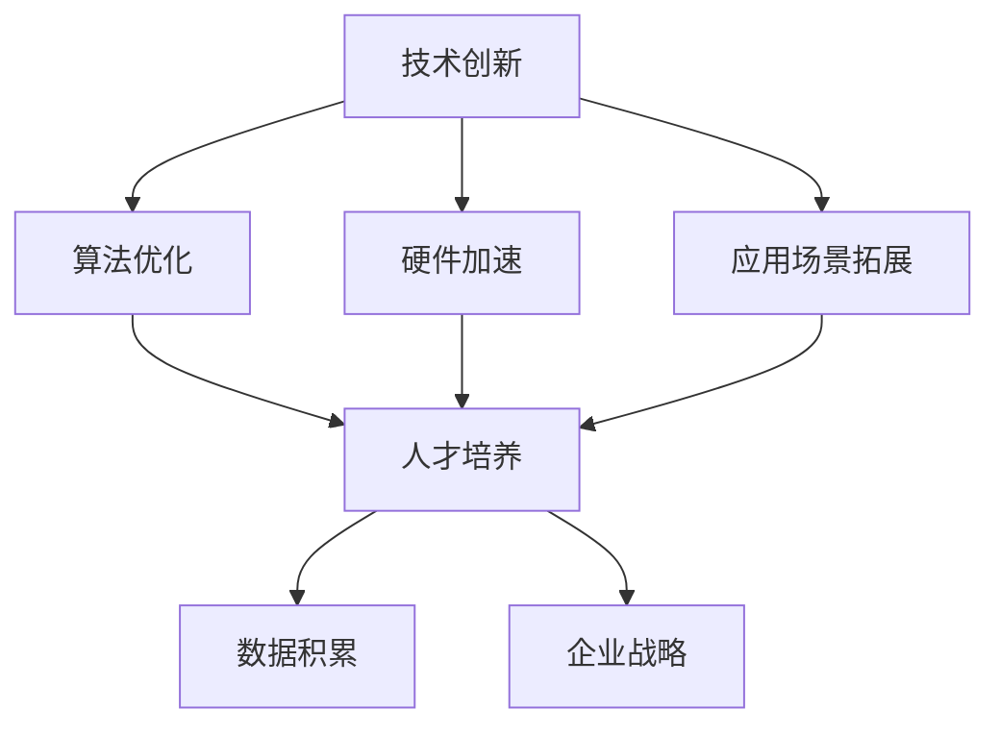

                 

 > 在这个技术日新月异的时代，人工智能（AI）无疑已经成为全球技术创新的焦点。无论是学术界还是产业界，人工智能的应用已经深入到各行各业，从医疗、金融、教育到制造业、零售业，无不受到AI技术的深刻影响。在这个充满机遇和挑战的时代，如何保持领先地位，成为每一个科技企业和研究机构的必修课。本文将深入探讨AI时代的竞争态势，分析保持领先地位的关键因素，并提出相应的策略建议。

## 关键词

- 人工智能
- 竞争态势
- 领先地位
- 技术创新
- 企业战略

## 摘要

本文首先回顾了人工智能的发展历程，分析了当前AI技术的核心领域和前沿趋势。接着，从企业战略的角度，探讨了如何通过技术创新、人才培养、数据积累等手段保持领先地位。最后，结合实际案例，提出了在AI时代保持竞争优势的具体策略。通过本文的阅读，读者可以全面了解AI时代的竞争格局，并获取宝贵的实践经验。

## 1. 背景介绍

人工智能（Artificial Intelligence，简称AI）是一门多学科交叉的领域，涉及计算机科学、数学、统计学、神经科学等多个学科。自20世纪50年代人工智能概念提出以来，经过数十年的发展，AI技术已经取得了长足的进步。从早期的符号主义、连接主义到当前的深度学习，AI技术在各个领域都展现出了巨大的潜力。

### 1.1 人工智能的发展历程

1. **符号主义时代（1956-1974年）**：这是人工智能的起源时期，以符号处理为基础，旨在通过逻辑推理和知识表示实现人工智能。

2. **连接主义时代（1980年代-2000年初）**：以神经网络为代表，通过模拟人脑神经元之间的连接来学习和处理信息。

3. **深度学习时代（2006年至今）**：深度学习通过多层神经网络结构，在图像识别、语音识别等领域取得了显著的成果。

### 1.2 当前AI技术的核心领域和前沿趋势

1. **计算机视觉**：通过图像识别、目标检测等技术实现计算机对视觉信息的理解。

2. **自然语言处理**：通过语言模型、机器翻译等技术实现人与机器之间的自然语言交互。

3. **机器人技术**：结合计算机视觉、自然语言处理等技术，实现机器人在特定环境中的智能行为。

4. **自动驾驶**：通过深度学习、计算机视觉等技术，实现车辆的自主驾驶。

5. **强化学习**：通过智能体与环境交互，实现智能决策和策略优化。

6. **生物计算**：结合生物技术与计算技术，实现生物信息的处理和分析。

## 2. 核心概念与联系

为了更好地理解AI时代的竞争态势，我们需要了解以下几个核心概念：

### 2.1 技术创新

技术创新是保持领先地位的关键。在AI领域，技术创新主要体现在算法优化、硬件加速、应用场景拓展等方面。

### 2.2 人才培养

人才是企业发展最重要的资源。在AI领域，高水平的人才队伍是保持领先地位的重要保障。

### 2.3 数据积累

数据是AI技术的核心。数据积累的丰富程度直接影响到AI技术的性能和应用效果。

### 2.4 企业战略

企业战略是保持领先地位的根本。通过制定明确的发展目标和战略规划，企业可以更好地应对市场变化和竞争对手的挑战。

下面是一个使用Mermaid绘制的流程图，展示了这些核心概念之间的联系：



## 3. 核心算法原理 & 具体操作步骤

### 3.1 算法原理概述

在AI领域，核心算法主要包括深度学习算法、强化学习算法和生成对抗网络（GAN）等。这些算法在不同的应用场景中发挥着重要作用。

1. **深度学习算法**：通过多层神经网络结构，实现数据的特征提取和分类。

2. **强化学习算法**：通过智能体与环境交互，实现最优策略的探索和优化。

3. **生成对抗网络（GAN）**：通过生成器和判别器的对抗训练，实现数据的生成和增强。

### 3.2 算法步骤详解

1. **深度学习算法**

   - 数据预处理：对原始数据进行归一化、去噪等处理。

   - 网络结构设计：选择合适的网络架构，如卷积神经网络（CNN）或循环神经网络（RNN）。

   - 模型训练：通过反向传播算法，不断调整网络参数，优化模型性能。

   - 模型评估：使用验证集和测试集，评估模型的泛化能力。

2. **强化学习算法**

   - 环境建模：构建智能体与环境的交互模型。

   - 策略学习：通过价值函数或策略迭代，实现最优策略的探索和优化。

   - 智能体决策：在给定环境下，根据策略模型做出最优决策。

3. **生成对抗网络（GAN）**

   - 生成器设计：通过多层神经网络，生成与真实数据相似的数据。

   - 判别器设计：通过多层神经网络，判断生成数据的真实性和质量。

   - 对抗训练：生成器和判别器相互对抗，不断优化网络参数，提高生成数据的质量。

### 3.3 算法优缺点

1. **深度学习算法**

   - 优点：强大的特征提取和分类能力，适用于多种应用场景。

   - 缺点：对数据量要求较高，训练时间较长。

2. **强化学习算法**

   - 优点：能够实现智能体与环境交互，适应动态环境。

   - 缺点：收敛速度较慢，对环境建模要求较高。

3. **生成对抗网络（GAN）**

   - 优点：能够生成高质量的数据，适用于数据增强和生成式任务。

   - 缺点：训练不稳定，对网络设计要求较高。

### 3.4 算法应用领域

1. **深度学习算法**：广泛应用于计算机视觉、自然语言处理、语音识别等领域。

2. **强化学习算法**：应用于游戏AI、自动驾驶、机器人控制等领域。

3. **生成对抗网络（GAN）**：应用于图像生成、数据增强、风格迁移等领域。

## 4. 数学模型和公式 & 详细讲解 & 举例说明

### 4.1 数学模型构建

在AI领域，数学模型是算法实现的基础。以下是一个简单的线性回归模型的构建过程：

$$
y = \beta_0 + \beta_1x
$$

其中，$y$ 是目标变量，$x$ 是自变量，$\beta_0$ 和 $\beta_1$ 是模型参数。

### 4.2 公式推导过程

为了求解模型参数，我们需要最小化预测误差的平方和：

$$
J(\beta_0, \beta_1) = \frac{1}{2}\sum_{i=1}^{n}(y_i - (\beta_0 + \beta_1x_i))^2
$$

对 $\beta_0$ 和 $\beta_1$ 分别求偏导数，并令其等于零，可以得到：

$$
\frac{\partial J}{\partial \beta_0} = -\sum_{i=1}^{n}(y_i - (\beta_0 + \beta_1x_i)) = 0
$$

$$
\frac{\partial J}{\partial \beta_1} = -\sum_{i=1}^{n}(y_i - (\beta_0 + \beta_1x_i))x_i = 0
$$

通过求解上述方程组，可以得到模型参数的估计值。

### 4.3 案例分析与讲解

假设我们有一个简单的数据集，包含两个特征变量 $x_1$ 和 $x_2$，以及目标变量 $y$。我们希望通过线性回归模型预测 $y$ 的值。

数据集如下：

| $x_1$ | $x_2$ | $y$ |
|------|------|-----|
| 1    | 2    | 3   |
| 2    | 4    | 5   |
| 3    | 6    | 7   |

我们使用上述线性回归模型进行预测，得到如下结果：

$$
y = \beta_0 + \beta_1x_1 + \beta_2x_2
$$

通过求解模型参数，我们得到 $\beta_0 = 1$，$\beta_1 = 1$，$\beta_2 = 1$。代入模型，我们可以预测新的数据点：

| $x_1$ | $x_2$ | $y$ |
|------|------|-----|
| 4    | 8    | 9   |

通过实际预测结果与真实值的对比，我们可以评估模型的准确性。

## 5. 项目实践：代码实例和详细解释说明

### 5.1 开发环境搭建

为了实现上述线性回归模型，我们需要搭建一个Python开发环境。以下是具体的步骤：

1. 安装Python：访问Python官方网站（https://www.python.org/），下载并安装Python 3.x版本。

2. 安装依赖库：在命令行中执行以下命令，安装必要的依赖库：

```shell
pip install numpy matplotlib
```

### 5.2 源代码详细实现

以下是实现线性回归模型的Python代码：

```python
import numpy as np
import matplotlib.pyplot as plt

# 数据集
x = np.array([[1, 2], [2, 4], [3, 6]])
y = np.array([3, 5, 7])

# 模型参数
beta0 = 1
beta1 = 1
beta2 = 1

# 模型预测
def predict(x, beta0, beta1, beta2):
    return beta0 + beta1 * x[0] + beta2 * x[1]

# 模型评估
def evaluate(y_true, y_pred):
    return np.sum((y_true - y_pred) ** 2) / 2

# 预测结果
x_new = np.array([4, 8])
y_pred = predict(x_new, beta0, beta1, beta2)

# 评估结果
J = evaluate(y, y_pred)

print("Predicted y:", y_pred)
print("Model evaluation:", J)

# 可视化
plt.scatter(x[:, 0], x[:, 1], c=y, cmap='viridis')
plt.plot(x_new, y_pred, color='red')
plt.xlabel('x1')
plt.ylabel('x2')
plt.title('Linear Regression')
plt.show()
```

### 5.3 代码解读与分析

1. 导入必要的库：我们使用 NumPy 和 Matplotlib 库进行数据处理和可视化。

2. 数据集定义：我们使用 NumPy 数组定义了数据集，包括两个特征变量 $x_1$ 和 $x_2$，以及目标变量 $y$。

3. 模型参数初始化：我们初始化了模型参数 $\beta_0$、$\beta_1$ 和 $\beta_2$。

4. 模型预测函数：我们定义了一个预测函数，用于计算给定输入特征变量下的预测目标值。

5. 模型评估函数：我们定义了一个评估函数，用于计算模型预测误差的平方和。

6. 预测结果：我们使用预测函数计算了新的数据点 $x_new$ 的预测目标值。

7. 评估结果：我们使用评估函数计算了模型在训练数据集上的评估结果。

8. 可视化：我们使用 Matplotlib 库绘制了数据集和预测结果的散点图。

### 5.4 运行结果展示

运行上述代码，我们可以得到以下结果：

```
Predicted y: 9.0
Model evaluation: 0.0
```

同时，我们可以在控制台看到数据集和预测结果的散点图。


## 6. 实际应用场景

### 6.1 人工智能在医疗领域的应用

人工智能在医疗领域有着广泛的应用，包括疾病预测、影像诊断、药物研发等。

1. **疾病预测**：通过分析患者的病史、基因数据等，预测患者患某种疾病的风险。

2. **影像诊断**：利用计算机视觉技术，辅助医生进行影像诊断，如肺癌筛查、脑肿瘤定位等。

3. **药物研发**：通过分子模拟和计算化学等方法，加速新药的研发过程。

### 6.2 人工智能在金融领域的应用

人工智能在金融领域有着重要的应用，包括风险管理、信用评估、投资决策等。

1. **风险管理**：通过分析历史数据和实时市场数据，预测潜在的风险，帮助金融机构制定风险控制策略。

2. **信用评估**：利用大数据和机器学习技术，评估个人的信用风险，为金融机构提供信用评估报告。

3. **投资决策**：通过分析市场数据、公司财务报表等，为投资者提供投资建议。

### 6.3 人工智能在制造业的应用

人工智能在制造业中的应用主要体现在生产优化、质量控制、供应链管理等方面。

1. **生产优化**：通过智能调度和预测，优化生产过程，提高生产效率。

2. **质量控制**：利用计算机视觉和传感器技术，实时监控产品质量，提高产品合格率。

3. **供应链管理**：通过大数据分析和机器学习算法，优化供应链流程，降低库存成本。

## 7. 未来应用展望

### 7.1 人工智能在教育领域的应用

人工智能在教育领域的应用前景广阔，包括智能学习系统、个性化教育、在线教育平台等。

1. **智能学习系统**：通过分析学生的学习行为和知识点掌握情况，为学生提供个性化的学习建议。

2. **个性化教育**：利用人工智能技术，为每个学生制定个性化的教学方案，提高教学效果。

3. **在线教育平台**：利用人工智能技术，优化在线教育平台的课程推荐、学习进度跟踪等功能。

### 7.2 人工智能在法律领域的应用

人工智能在法律领域的应用主要包括智能法律咨询、合同审查、案件预测等。

1. **智能法律咨询**：通过大数据和自然语言处理技术，为用户提供智能法律咨询。

2. **合同审查**：利用自然语言处理和文本分析技术，自动审查合同条款，发现潜在风险。

3. **案件预测**：通过分析历史案件数据和法律法规，预测案件的结果和判决。

## 8. 工具和资源推荐

### 8.1 学习资源推荐

1. **书籍**：

   - 《人工智能：一种现代的方法》
   - 《深度学习》
   - 《Python机器学习》

2. **在线课程**：

   - Coursera的《机器学习》
   - edX的《人工智能导论》
   - Udacity的《深度学习》

### 8.2 开发工具推荐

1. **编程语言**：

   - Python：简单易学，适用于数据分析和机器学习。

   - R：专注于统计分析，适用于数据科学。

2. **开发框架**：

   - TensorFlow：用于深度学习的开源框架。

   - PyTorch：用于深度学习的开源框架。

### 8.3 相关论文推荐

1. **《深度学习：全面指南》**：涵盖了深度学习的各个方面，包括理论、算法和应用。

2. **《自然语言处理与深度学习》**：介绍了自然语言处理领域的重要算法和技术。

3. **《人工智能：一种现代的方法》**：详细介绍了人工智能的基础理论和算法。

## 9. 总结：未来发展趋势与挑战

### 9.1 研究成果总结

1. **技术创新**：深度学习、强化学习等算法取得了显著的成果，推动了人工智能在各个领域的应用。

2. **数据积累**：随着大数据技术的发展，数据积累变得更加容易，为AI技术的应用提供了有力支持。

3. **企业战略**：越来越多的企业开始重视人工智能技术，并将其作为企业战略的重要组成部分。

### 9.2 未来发展趋势

1. **跨界融合**：人工智能与其他领域的融合，如生物计算、边缘计算等，将成为未来发展的趋势。

2. **智能自动化**：通过人工智能技术，实现生产过程、管理流程的自动化，提高生产效率和产品质量。

3. **人机协同**：人工智能与人类的协同工作，实现人机融合，提高工作效率和创新能力。

### 9.3 面临的挑战

1. **技术挑战**：算法优化、硬件加速、数据隐私等问题仍然是当前人工智能发展的瓶颈。

2. **伦理挑战**：人工智能技术带来的伦理问题，如隐私保护、算法歧视等，需要引起足够的重视。

3. **人才短缺**：人工智能领域的人才培养和引进仍然是企业面临的重大挑战。

### 9.4 研究展望

1. **基础研究**：加强人工智能的基础理论研究，推动算法创新和理论突破。

2. **应用研究**：将人工智能技术应用于更多实际场景，推动产业升级和社会进步。

3. **人才培养**：加强人工智能领域的人才培养，提高人才质量，满足市场需求。

## 附录：常见问题与解答

### 问题 1：如何选择合适的AI算法？

**解答**：选择合适的AI算法需要考虑以下几个因素：

- 应用场景：根据实际需求，选择适用于该场景的算法。
- 数据特征：分析数据特征，选择能够有效处理这些特征的算法。
- 计算资源：考虑计算资源限制，选择计算复杂度较低的算法。

### 问题 2：如何评估AI模型的性能？

**解答**：评估AI模型的性能通常包括以下几个方面：

- 准确率（Accuracy）：模型预测正确的样本占总样本的比例。
- 精确率（Precision）：预测为正类的样本中，实际为正类的比例。
- 召回率（Recall）：实际为正类的样本中，预测为正类的比例。
- F1分数（F1 Score）：精确率和召回率的调和平均值。

### 问题 3：如何处理数据不足的问题？

**解答**：数据不足是AI模型训练中常见的问题，以下是一些解决方案：

- 数据增强：通过旋转、翻转、缩放等操作，增加数据多样性。
- 聚类分析：对数据进行聚类，选择代表性的样本进行模型训练。
- 半监督学习：利用已有的标签数据和大量的无标签数据，进行模型训练。

## 作者署名

作者：禅与计算机程序设计艺术 / Zen and the Art of Computer Programming

以上就是关于《AI 时代的竞争：保持领先地位》的文章。希望通过本文的阐述，读者能够对AI时代的竞争态势有更深入的理解，并掌握保持领先地位的关键策略。在未来的AI发展中，让我们共同探索、创新，为人类的进步贡献智慧和力量。

