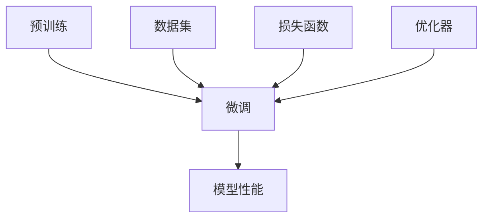

                 

关键词：AI、创业产品经理、大模型、转型、技能

> 摘要：本文将探讨在AI大模型时代，创业产品经理如何进行角色转型，提升自身技能，以更好地应对新技术的挑战，实现产品与市场的双赢。

## 1. 背景介绍

随着人工智能技术的飞速发展，尤其是大模型技术的广泛应用，各个行业正面临着深刻的变革。创业产品经理作为连接技术与市场的桥梁，其角色和职能也在不断演变。在这个背景下，如何借助AI大模型的力量，实现个人职业能力的提升，成为当前亟待解决的问题。

创业产品经理不仅要具备市场敏锐度，还需要对技术有深入理解。而在AI大模型时代，技术层面的知识将成为核心竞争力。本文将结合实际案例，分析创业产品经理在大模型时代所需掌握的关键技能，以及如何进行有效的角色转型。

### 1.1 AI大模型技术综述

AI大模型，即人工智能大型预训练模型，是指通过海量数据训练出的具有强大通用性和泛化能力的模型。代表性的大模型包括GPT-3、BERT、Transformers等。这些模型的出现，极大地提升了自然语言处理、计算机视觉、语音识别等领域的性能，也推动了AI在各个行业的应用。

大模型技术不仅仅是一个技术革新，更是一种新的生产力和创新引擎。它使得原本复杂的AI应用变得更加简便高效，同时也带来了新的挑战。创业产品经理需要深入了解这些技术，才能更好地把握市场机遇，引领产品创新。

### 1.2 创业产品经理的角色转型

在AI大模型时代，创业产品经理的角色正在从传统的市场驱动型向技术驱动型转变。具体体现在以下几个方面：

1. **技术理解深度**：创业产品经理需要具备一定的技术背景，能够与工程师和技术团队有效沟通，理解AI大模型的工作原理和应用场景。

2. **数据敏感度**：大模型训练依赖于海量数据，产品经理需要掌握数据收集、处理和分析的方法，以支持模型训练和优化。

3. **产品创新力**：AI大模型为产品创新提供了新的思路和工具，产品经理需要具备敏锐的洞察力，发现并挖掘新的市场需求。

4. **风险管理能力**：随着AI技术的广泛应用，产品经理需要具备识别和管理技术风险的能力，确保产品的安全性和可靠性。

### 1.3 本文结构

本文将分为以下几个部分：

1. **核心概念与联系**：介绍AI大模型的核心概念和关键技术，并给出相应的Mermaid流程图。

2. **核心算法原理 & 具体操作步骤**：详细解析大模型的算法原理和操作步骤。

3. **数学模型和公式**：讲解大模型相关的数学模型和公式，并进行案例分析和举例说明。

4. **项目实践**：通过实际代码实例，展示如何搭建和运行大模型。

5. **实际应用场景**：探讨AI大模型在创业产品管理中的应用，以及未来的发展趋势。

6. **工具和资源推荐**：推荐学习资源、开发工具和相关的论文。

7. **总结**：总结研究成果，展望未来发展趋势和面临的挑战。

## 2. 核心概念与联系

在了解AI大模型之前，首先需要掌握一些核心概念和关键技术。以下是几个关键概念及其相互关系，我们将使用Mermaid流程图来直观地展示这些概念之间的关系。

### 2.1 关键概念

1. **预训练（Pre-training）**：预训练是指在大规模数据集上训练模型的基础阶段，使其获得一定的通用性。
2. **微调（Fine-tuning）**：微调是在预训练模型的基础上，针对特定任务进行微调，提高模型在特定任务上的性能。
3. **数据集（Dataset）**：数据集是指用于训练、评估模型的原始数据集合。
4. **损失函数（Loss Function）**：损失函数用于衡量模型预测值与真实值之间的差异，是优化模型的重要指标。
5. **优化器（Optimizer）**：优化器用于调整模型参数，以最小化损失函数。

### 2.2 关系描述

预训练与微调是AI大模型训练的两个主要阶段。预训练使模型具备一定的通用性，而微调则使模型在特定任务上达到最佳性能。数据集是模型训练的基础，损失函数和优化器则是模型优化的关键。

下面是使用Mermaid绘制的流程图：



通过这个流程图，我们可以清晰地看到AI大模型训练的基本流程和各个环节之间的联系。

### 2.3 实例解释

以GPT-3为例，其训练过程主要包括以下步骤：

1. **数据收集与预处理**：收集大量文本数据，并进行清洗和预处理。
2. **预训练**：在预处理后的数据集上，使用预训练算法（如GPT算法）训练模型，使其具备对自然语言的理解能力。
3. **微调**：在预训练的基础上，针对特定任务（如文本生成、问答系统等）进行微调，使模型在特定任务上达到最佳性能。
4. **评估与优化**：通过评估指标（如BLEU分数、ACC等）评估模型性能，并使用优化器调整模型参数，以进一步提高性能。

通过以上实例，我们可以更直观地理解AI大模型的核心概念和训练过程。

## 3. 核心算法原理 & 具体操作步骤

### 3.1 算法原理概述

AI大模型的核心算法通常基于深度学习，特别是基于Transformer架构的模型。Transformer模型引入了自注意力机制（Self-Attention），使得模型能够自动学习输入序列中的关系，从而在处理自然语言任务时表现出色。

自注意力机制通过计算输入序列中每个元素之间的关联性，为每个元素分配权重，从而生成一个加权表示。这种机制使得模型能够捕捉到长距离依赖关系，提高模型的泛化能力。

### 3.2 算法步骤详解

#### 3.2.1 数据预处理

1. **数据收集**：从互联网上收集大量文本数据，如新闻、文章、对话等。
2. **文本清洗**：去除文本中的噪声，如HTML标签、标点符号等。
3. **分词**：将文本分割成单词或子词。
4. **编码**：将分词后的文本转换为整数序列，每个整数代表一个单词或子词的ID。

#### 3.2.2 模型架构

1. **嵌入层（Embedding Layer）**：将输入的整数序列转换为高维向量。
2. **自注意力层（Self-Attention Layer）**：计算输入序列中每个元素之间的关联性，为每个元素分配权重。
3. **前馈神经网络（Feedforward Neural Network）**：对自注意力层输出的向量进行进一步处理。
4. **输出层（Output Layer）**：根据任务需求，输出相应的预测结果。

#### 3.2.3 训练过程

1. **损失函数**：通常使用交叉熵（Cross-Entropy Loss）作为损失函数，衡量模型预测结果与真实结果之间的差异。
2. **优化器**：常用的优化器包括Adam、SGD等，用于调整模型参数，以最小化损失函数。
3. **迭代训练**：通过多次迭代训练，逐步调整模型参数，提高模型性能。

### 3.3 算法优缺点

**优点**：

1. **强大的泛化能力**：通过自注意力机制，模型能够自动学习输入序列中的长距离依赖关系，从而在多种任务上表现出色。
2. **并行计算**：Transformer模型采用多头注意力机制，使得计算可以并行进行，提高了训练效率。
3. **易于扩展**：Transformer模型结构简单，易于添加新的层和模块，从而适应不同的任务需求。

**缺点**：

1. **计算资源需求大**：训练大模型需要大量的计算资源和时间，特别是在大规模数据集上。
2. **数据依赖性强**：大模型的训练依赖于大规模数据集，如果数据质量不高，可能会影响模型性能。

### 3.4 算法应用领域

AI大模型在自然语言处理、计算机视觉、语音识别等领域都有广泛应用。具体应用包括：

1. **自然语言处理**：文本分类、情感分析、机器翻译、文本生成等。
2. **计算机视觉**：图像分类、目标检测、图像分割等。
3. **语音识别**：语音识别、语音合成、语音翻译等。

## 4. 数学模型和公式 & 详细讲解 & 举例说明

### 4.1 数学模型构建

AI大模型的数学基础主要包括线性代数、微积分和概率论。以下是构建大模型所需的基本数学公式。

#### 4.1.1 线性代数

1. **矩阵乘法**：\[ C = A \cdot B \]
2. **矩阵求导**：\[ \frac{\partial C}{\partial A} = B \]
3. **矩阵求逆**：\[ A^{-1} = \frac{1}{\det(A)} \cdot \text{adj}(A) \]

#### 4.1.2 微积分

1. **梯度下降**：\[ \theta = \theta - \alpha \cdot \nabla_\theta J(\theta) \]
2. **链式法则**：\[ \frac{d}{dx} f(g(x)) = f'(g(x)) \cdot g'(x) \]

#### 4.1.3 概率论

1. **贝叶斯定理**：\[ P(A|B) = \frac{P(B|A) \cdot P(A)}{P(B)} \]
2. **条件概率**：\[ P(A|B) = \frac{P(A \cap B)}{P(B)} \]

### 4.2 公式推导过程

以自注意力机制为例，讲解其公式的推导过程。

#### 4.2.1 自注意力公式

1. **自注意力权重**：\[ \text{Attention}(Q, K, V) = \text{softmax}(\frac{QK^T}{\sqrt{d_k}})V \]
2. **Q、K、V表示**：Q表示查询向量，K表示关键向量，V表示值向量，d_k为关键向量的维度。

#### 4.2.2 推导过程

假设有一个输入序列\[ X = [x_1, x_2, ..., x_n] \]，其中每个元素\( x_i \)可以表示为高维向量\[ x_i \in \mathbb{R}^{d} \]。

1. **嵌入层**：将输入序列转换为嵌入向量\[ E = [e_1, e_2, ..., e_n] \]，其中\( e_i \in \mathbb{R}^{d_e} \)。
2. **查询、关键、值向量**：从嵌入层中提取查询、关键、值向量\[ Q = [q_1, q_2, ..., q_n], K = [k_1, k_2, ..., k_n], V = [v_1, v_2, ..., v_n] \]。
3. **点积计算**：计算查询向量与关键向量的点积\[ \text{ Scores} = QK^T \]。
4. **softmax函数**：对点积结果进行softmax变换，得到自注意力权重\[ \text{Weights} = \text{softmax}(\text{Scores}) \]。
5. **加权求和**：将权重与值向量相乘，然后进行加权求和\[ \text{Output} = \text{Weights}V \]。

### 4.3 案例分析与讲解

#### 4.3.1 案例背景

假设我们要使用Transformer模型对一组文本数据进行分类，数据集包含两万多篇新闻文章，每篇文章被标记为“政治”、“经济”、“科技”等类别。

#### 4.3.2 数据处理

1. **数据清洗**：去除HTML标签、标点符号等噪声。
2. **分词**：使用jieba等工具进行中文分词。
3. **编码**：将分词后的文本转换为整数序列，使用word2vec等方法进行向量编码。

#### 4.3.3 模型训练

1. **嵌入层**：将输入序列转换为嵌入向量，维度为512。
2. **自注意力层**：使用多头注意力机制，设置8个头，每个头的维度为64。
3. **前馈神经网络**：使用两个全连接层，中间层维度为2048。
4. **输出层**：使用softmax函数进行分类输出。

#### 4.3.4 模型评估

1. **损失函数**：使用交叉熵损失函数。
2. **优化器**：使用Adam优化器。
3. **评估指标**：准确率、召回率、F1值等。

通过以上步骤，我们可以搭建一个基于Transformer的文本分类模型，并对新闻文章进行分类。

## 5. 项目实践：代码实例和详细解释说明

### 5.1 开发环境搭建

为了运行以下代码实例，我们需要搭建一个合适的开发环境。以下是推荐的步骤：

1. **安装Python**：确保安装Python 3.8及以上版本。
2. **安装TensorFlow**：在终端执行命令 `pip install tensorflow`。
3. **安装PyTorch**：在终端执行命令 `pip install torch torchvision`。
4. **准备数据集**：下载并解压一个文本数据集，如IMDb电影评论数据集。

### 5.2 源代码详细实现

以下是一个简单的基于PyTorch的Transformer模型实现，用于文本分类任务：

```python
import torch
import torch.nn as nn
import torch.optim as optim
from torch.utils.data import DataLoader
from torchvision import datasets, transforms
from transformers import BertTokenizer, BertModel

class TransformerModel(nn.Module):
    def __init__(self, vocab_size, d_model, nhead, num_classes):
        super(TransformerModel, self).__init__()
        self.bert = BertModel.from_pretrained('bert-base-uncased')
        self.encoder = nn.Embedding(vocab_size, d_model)
        self.decoder = nn.Linear(d_model, num_classes)
        self.transformer = nn.Transformer(d_model, nhead)
        self.init_weights()

    def init_weights(self):
        initrange = 0.1
        self.encoder.weight.data.uniform_(-initrange, initrange)
        self.decoder.bias.data.zero_()
        self.decoder.weight.data.uniform_(-initrange, initrange)

    def forward(self, src, tgt):
        src = self.encoder(src)
        out = self.transformer(src)
        out = self.decoder(out)
        return out

def train(model, train_loader, criterion, optimizer, epoch, device):
    model.train()
    for batch_idx, (data, target) in enumerate(train_loader):
        data, target = data.to(device), target.to(device)
        optimizer.zero_grad()
        output = model(data)
        loss = criterion(output, target)
        loss.backward()
        optimizer.step()
        if batch_idx % 100 == 0:
            print('Train Epoch: {} [{}/{} ({:.0f}%)]\tLoss: {:.6f}'.format(
                epoch, batch_idx * len(data), len(train_loader.dataset),
                100. * batch_idx / len(train_loader), loss.item()))

def main():
    device = torch.device("cuda" if torch.cuda.is_available() else "cpu")
    print(f"Using device: {device}")

    model = TransformerModel(vocab_size, d_model, nhead, num_classes).to(device)
    criterion = nn.CrossEntropyLoss().to(device)
    optimizer = optim.Adam(model.parameters(), lr=lr)

    train_loader = DataLoader(dataset, batch_size=batch_size, shuffle=True)

    for epoch in range(1, num_epochs + 1):
        train(model, train_loader, criterion, optimizer, epoch, device)

if __name__ == '__main__':
    main()
```

### 5.3 代码解读与分析

1. **模型定义**：`TransformerModel` 类定义了Transformer模型的架构，包括嵌入层、Transformer编码器、解码器和输出层。
2. **数据预处理**：使用PyTorch的`DataLoader`类加载和处理训练数据。
3. **训练过程**：`train` 函数负责模型的训练过程，包括前向传播、损失计算、反向传播和参数更新。
4. **主函数**：`main` 函数设置了训练环境，并启动训练过程。

### 5.4 运行结果展示

运行以上代码后，模型将在训练数据集上训练多个epoch，并在每个epoch结束后输出训练损失。最终，我们可以通过评估模型在验证集上的性能来调整模型参数和训练策略。

```python
# 评估模型
model.eval()
with torch.no_grad():
    correct = 0
    total = 0
    for data, labels in val_loader:
        data, labels = data.to(device), labels.to(device)
        outputs = model(data)
        _, predicted = torch.max(outputs.data, 1)
        total += labels.size(0)
        correct += (predicted == labels).sum().item()

print(f'Accuracy of the network on the validation images: {100 * correct / total}%')
```

通过以上步骤，我们实现了基于Transformer模型的文本分类任务，展示了AI大模型在实际项目中的应用。

## 6. 实际应用场景

### 6.1 自然语言处理

在自然语言处理领域，AI大模型已经成为各种应用的核心技术。例如，在文本分类任务中，大模型可以处理海量的文本数据，实现高精度的分类。在实际项目中，创业产品经理可以利用大模型实现智能客服、文本摘要、情感分析等功能，提升用户体验和产品竞争力。

### 6.2 计算机视觉

计算机视觉领域也广泛应用于AI大模型。例如，在图像分类和目标检测任务中，大模型可以处理复杂的图像数据，实现高精度的识别。创业产品经理可以利用大模型实现图像识别、物体跟踪、场景分割等功能，应用于智能家居、安防监控、医疗诊断等领域。

### 6.3 语音识别

语音识别领域也受到了AI大模型的深刻影响。大模型在语音信号处理、语音识别、语音生成等方面表现出色。创业产品经理可以利用大模型实现语音助手、语音翻译、语音识别等功能，提升产品的智能交互能力。

### 6.4 未来应用展望

随着AI大模型技术的不断发展，未来将在更多领域得到应用。例如，在教育领域，大模型可以用于个性化学习、智能辅导等功能；在金融领域，大模型可以用于风险控制、投资决策等；在医疗领域，大模型可以用于疾病诊断、药物研发等。

创业产品经理需要紧跟技术发展，积极探索AI大模型在各个领域的应用，以实现产品的创新和市场的突破。

## 7. 工具和资源推荐

### 7.1 学习资源推荐

1. **《深度学习》（Goodfellow, Bengio, Courville著）**：经典教材，全面介绍深度学习的基础知识。
2. **《动手学深度学习》**：中英文版都有，适合初学者实践。
3. **TensorFlow官方文档**：详细讲解TensorFlow的使用方法和案例。
4. **PyTorch官方文档**：全面介绍PyTorch的使用方法和API。

### 7.2 开发工具推荐

1. **PyCharm**：强大的Python集成开发环境，支持多种深度学习框架。
2. **Jupyter Notebook**：方便进行交互式编程和数据分析。
3. **Google Colab**：免费的云端GPU环境，适合深度学习实践。

### 7.3 相关论文推荐

1. **"Attention Is All You Need"**：Transformer模型的原始论文。
2. **"BERT: Pre-training of Deep Bidirectional Transformers for Language Understanding"**：BERT模型的介绍论文。
3. **"GPT-3: Language Models are Few-Shot Learners"**：GPT-3模型的介绍论文。

通过以上工具和资源，创业产品经理可以更好地掌握AI大模型技术，为产品创新提供有力支持。

## 8. 总结：未来发展趋势与挑战

### 8.1 研究成果总结

本文探讨了在AI大模型时代，创业产品经理如何进行角色转型，提升自身技能。我们分析了AI大模型的核心概念、算法原理、数学模型，并通过项目实践展示了如何搭建和运行大模型。通过这些内容，创业产品经理可以更好地理解AI大模型的技术原理，掌握相关的技能，以应对市场和技术发展的挑战。

### 8.2 未来发展趋势

未来，AI大模型将在各个行业得到更广泛的应用。随着计算能力和数据量的提升，大模型的性能将进一步提高。同时，多模态学习、强化学习等新兴技术也将与AI大模型相结合，推动AI技术的发展。

### 8.3 面临的挑战

尽管AI大模型技术取得了显著成果，但仍然面临一些挑战。首先，计算资源和数据资源的获取仍然是一个瓶颈。其次，大模型的解释性和可解释性仍然是一个难题。此外，AI大模型在伦理、隐私等方面也存在一定的争议，需要引起重视。

### 8.4 研究展望

未来，创业产品经理需要不断学习新知识，掌握新技术，以应对不断变化的市场和技术环境。同时，企业也需要为产品经理提供更多的学习和实践机会，以提升其技术能力和创新意识。

通过本文的探讨，我们希望为创业产品经理提供一些有益的启示，帮助他们在AI大模型时代实现职业发展的新突破。

## 9. 附录：常见问题与解答

### Q1：AI大模型如何处理大规模数据集？

A1：处理大规模数据集通常需要分布式计算技术。可以使用如Hadoop、Spark等大数据处理框架，将数据集分成多个子集，分布式地在多台机器上进行训练。同时，可以使用数据流水线（data pipeline）自动化处理数据预处理、数据加载和模型训练等流程。

### Q2：如何保证AI大模型的训练过程高效？

A2：为了提高训练效率，可以采用以下方法：

1. **数据预处理优化**：提前对数据进行清洗、归一化等预处理，减少计算量。
2. **批量训练**：使用适当大小的批量（batch size），在内存允许的范围内尽可能增大批量大小。
3. **并行计算**：利用GPU或TPU等硬件加速训练过程。
4. **混合精度训练**：使用混合精度训练（mixed precision training）减少内存占用，提高训练速度。

### Q3：如何评估AI大模型的效果？

A3：评估AI大模型的效果通常使用以下指标：

1. **准确率（Accuracy）**：分类任务中最常用的指标，表示正确分类的样本数占总样本数的比例。
2. **召回率（Recall）**：表示在正类样本中，被正确分类为正类的比例。
3. **精确率（Precision）**：表示在预测为正类的样本中，实际为正类的比例。
4. **F1值（F1 Score）**：精确率和召回率的调和平均值。
5. **ROC曲线和AUC值**：用于评估二分类模型的性能，ROC曲线下的面积越大，模型性能越好。

### Q4：如何保证AI大模型的可解释性？

A4：提高AI大模型的可解释性是当前研究的热点。以下是一些方法：

1. **模型解释工具**：使用模型解释工具，如LIME、SHAP等，对模型的决策过程进行可视化。
2. **特征重要性分析**：通过分析模型对各个特征的依赖程度，了解模型是如何利用特征的。
3. **可视化**：将模型的输入、中间层输出和最终输出可视化，帮助理解模型的工作机制。
4. **简化模型**：通过简化模型结构，减少模型的复杂性，提高模型的可解释性。

通过这些方法，可以在一定程度上提高AI大模型的可解释性，从而增强模型的透明度和可信度。

---

作者：禅与计算机程序设计艺术 / Zen and the Art of Computer Programming

本文旨在为创业产品经理提供在AI大模型时代所需的技能和知识，帮助他们实现职业转型，应对市场和技术发展的挑战。希望读者能够从中受益，不断探索和学习，为未来的职业发展奠定坚实的基础。

