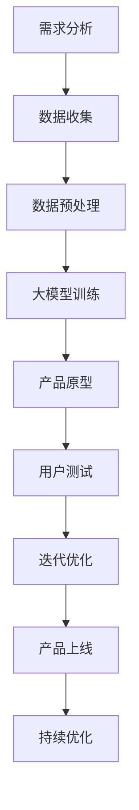
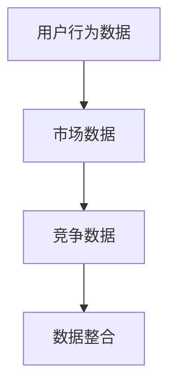
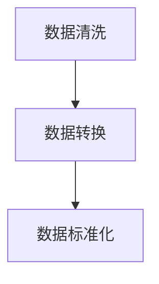
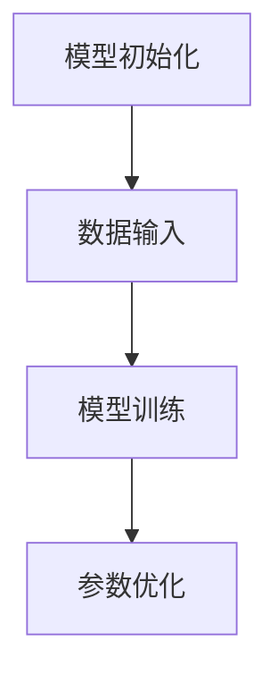
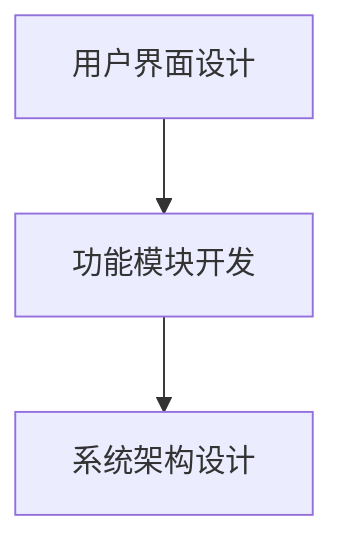
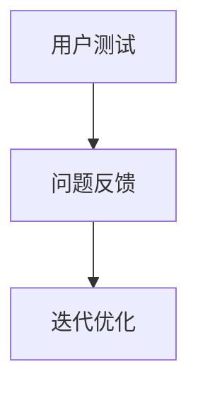
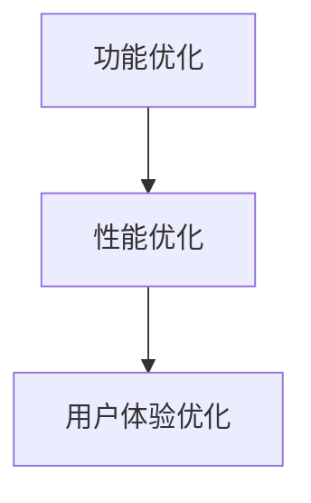
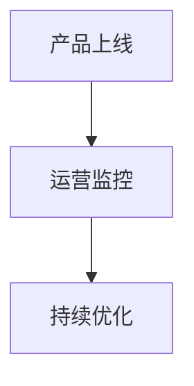

                 

关键词：AI，创业产品设计，大模型，创新

摘要：本文深入探讨了AI驱动的创业产品设计原则，分析了大模型在赋能创业产品设计中的关键作用。通过阐述核心概念、算法原理、数学模型和实际应用案例，本文为创业者提供了一套行之有效的AI驱动的产品设计方法论，为未来的创业创新指明了方向。

## 1. 背景介绍

在当今科技迅猛发展的时代，人工智能（AI）已经成为推动各个行业变革的核心驱动力。尤其是在创业领域，AI技术的广泛应用为创业者提供了前所未有的机会和挑战。创业产品的设计不再仅仅是功能实现的简单叠加，而是需要基于用户需求、市场趋势和技术发展的综合考量，实现产品与用户、市场的高度契合。

大模型，作为AI领域的一项重要创新，具有处理大规模数据、自动学习和优化决策的能力。大模型技术的崛起，使得创业产品在个性化推荐、智能交互、自动化决策等方面取得了显著突破。然而，如何有效地利用大模型赋能创业产品设计，实现产品的创新和竞争力提升，成为创业者亟需解决的关键问题。

本文旨在从理论到实践，全面解析AI驱动的创业产品设计原则，为大模型赋能下的创业创新提供一套系统性的指导。

## 2. 核心概念与联系

为了更好地理解AI驱动的创业产品设计原则，首先需要明确几个核心概念及其相互关系。

### 2.1 AI与创业产品设计

AI，即人工智能，是一种模拟人类智能的技术体系。创业产品设计，则是将AI技术应用于创业过程中，通过数据分析、智能优化、用户行为分析等手段，打造出满足用户需求、具有市场竞争力的产品。

### 2.2 大模型与创业产品设计

大模型，通常是指具有大规模参数、能够处理海量数据的深度学习模型。大模型在创业产品设计中的关键作用体现在以下几个方面：

- **个性化推荐**：通过分析用户行为数据，大模型能够为用户提供个性化的产品推荐，提高用户满意度和粘性。
- **智能交互**：大模型能够实现与用户的自然语言交互，提供智能客服、语音助手等功能，提升用户体验。
- **自动化决策**：大模型可以自动分析市场数据，为创业产品提供决策支持，优化产品运营策略。

### 2.3 大模型赋能下的创业产品设计

大模型赋能下的创业产品设计，意味着在设计过程中充分运用大模型的优势，实现以下几个方面的创新：

- **数据驱动**：以数据为驱动，通过大数据分析洞察用户需求和市场趋势，指导产品设计和迭代。
- **智能化**：通过大模型实现产品的智能化，提高产品自主学习和优化能力，提升用户体验。
- **个性化**：基于用户个性化数据，打造具有高度定制化的产品，满足不同用户群体的需求。

### 2.4 Mermaid流程图

为了更直观地展示大模型赋能下的创业产品设计流程，我们使用Mermaid语言绘制以下流程图：



在此流程图中，每个节点代表一个关键步骤，箭头表示步骤间的逻辑关系。通过这样的流程图，创业者可以清晰地把握大模型赋能下的创业产品设计过程。

## 3. 核心算法原理 & 具体操作步骤

### 3.1 算法原理概述

大模型赋能下的创业产品设计，主要依赖于以下几个核心算法：

- **深度学习算法**：用于训练大模型，实现数据的自动学习和优化。
- **推荐算法**：基于用户行为数据，为用户推荐个性化产品。
- **自然语言处理算法**：实现产品与用户的智能交互。

### 3.2 算法步骤详解

#### 3.2.1 数据收集

数据收集是创业产品设计的基础。创业者需要通过多种渠道收集用户行为数据、市场数据、竞争数据等，为后续的算法训练提供数据支持。



#### 3.2.2 数据预处理

收集到的数据通常是不完整、不一致的。数据预处理包括数据清洗、数据转换和数据标准化等步骤，以确保数据的质量和一致性。



#### 3.2.3 大模型训练

数据预处理完成后，使用深度学习算法对大模型进行训练。训练过程中，需要不断调整模型参数，优化模型性能。



#### 3.2.4 产品原型

基于训练好的大模型，构建产品原型。产品原型主要包括用户界面、功能模块和系统架构等。



#### 3.2.5 用户测试

产品原型构建完成后，进行用户测试。用户测试可以帮助发现产品原型中的问题，为迭代优化提供反馈。



#### 3.2.6 迭代优化

根据用户测试的反馈，对产品原型进行迭代优化。迭代优化包括功能优化、性能优化和用户体验优化等。



#### 3.2.7 产品上线

完成迭代优化后，将产品正式上线。上线过程中，需要密切关注产品运营数据，为后续优化提供数据支持。



### 3.3 算法优缺点

#### 优点

- **高效性**：大模型能够处理海量数据，提高数据处理效率。
- **准确性**：基于大数据的算法训练，能够提高模型的准确性。
- **智能化**：大模型能够实现产品的智能化，提升用户体验。

#### 缺点

- **复杂性**：大模型训练和算法优化过程复杂，对技术要求较高。
- **数据依赖性**：算法性能依赖于数据质量，数据缺失或不一致会影响算法效果。

### 3.4 算法应用领域

大模型在创业产品设计中的应用领域广泛，主要包括：

- **个性化推荐**：应用于电商、内容平台等领域，提升用户满意度和粘性。
- **智能交互**：应用于智能客服、语音助手等领域，提升用户体验。
- **自动化决策**：应用于金融、医疗等领域，优化决策过程，提高运营效率。

## 4. 数学模型和公式 & 详细讲解 & 举例说明

### 4.1 数学模型构建

在创业产品设计过程中，常用的数学模型包括线性回归、逻辑回归、神经网络等。以下以神经网络为例，介绍数学模型的构建过程。

#### 4.1.1 神经网络模型

神经网络模型由多个神经元组成，每个神经元负责处理一部分输入数据，并通过权重和偏置进行加权求和。具体公式如下：

$$
Z = \sum_{i=1}^{n} w_i * x_i + b
$$

其中，$Z$ 表示输出值，$w_i$ 表示权重，$x_i$ 表示输入值，$b$ 表示偏置。

#### 4.1.2 激活函数

为了将线性组合转换为非线性的输出，神经网络模型引入了激活函数。常见的激活函数包括 sigmoid、ReLU、Tanh 等。以下以 sigmoid 函数为例，介绍激活函数的公式：

$$
a = \frac{1}{1 + e^{-Z}}
$$

其中，$a$ 表示激活值，$Z$ 表示输入值。

### 4.2 公式推导过程

以线性回归为例，介绍公式推导过程。

#### 4.2.1 线性回归模型

线性回归模型由一个线性函数表示，具体公式如下：

$$
y = w * x + b
$$

其中，$y$ 表示预测值，$w$ 表示权重，$x$ 表示输入值，$b$ 表示偏置。

#### 4.2.2 损失函数

为了衡量预测值与实际值之间的差异，引入损失函数。常见的损失函数包括均方误差（MSE）、均方根误差（RMSE）等。以下以均方误差为例，介绍损失函数的推导过程：

$$
MSE = \frac{1}{m} \sum_{i=1}^{m} (y_i - \hat{y}_i)^2
$$

其中，$MSE$ 表示均方误差，$y_i$ 表示实际值，$\hat{y}_i$ 表示预测值，$m$ 表示样本数量。

#### 4.2.3 优化目标

为了最小化损失函数，需要优化模型参数。常用的优化方法包括梯度下降、随机梯度下降等。以下以梯度下降为例，介绍优化目标的推导过程：

$$
w_{new} = w_{old} - \alpha * \frac{\partial}{\partial w}J(w)
$$

$$
b_{new} = b_{old} - \alpha * \frac{\partial}{\partial b}J(w)
$$

其中，$w_{old}$、$w_{new}$ 分别表示旧权重和新权重，$b_{old}$、$b_{new}$ 分别表示旧偏置和新偏置，$\alpha$ 表示学习率，$J(w)$ 表示损失函数。

### 4.3 案例分析与讲解

以电商推荐系统为例，介绍大模型在创业产品设计中的应用。

#### 4.3.1 案例背景

某电商平台希望通过个性化推荐系统，提升用户购物体验和购物满意度。平台收集了用户的历史购买数据、浏览数据、评价数据等，希望通过大模型对用户进行个性化推荐。

#### 4.3.2 数据预处理

将用户数据、商品数据进行预处理，包括数据清洗、数据转换和数据标准化等步骤。具体操作如下：

- 数据清洗：去除缺失值、异常值等不完整或不一致的数据。
- 数据转换：将类别数据转换为数值数据，方便模型处理。
- 数据标准化：将数据缩放至相同的范围，提高模型训练效果。

#### 4.3.3 大模型训练

使用深度学习算法，对用户数据、商品数据进行训练。具体操作如下：

- 数据输入：将用户数据和商品数据输入模型，进行前向传播。
- 模型训练：通过反向传播，不断调整模型参数，优化模型性能。
- 参数优化：通过调整学习率、批量大小等参数，提高模型训练效果。

#### 4.3.4 产品原型

基于训练好的大模型，构建个性化推荐系统原型。具体操作如下：

- 用户界面设计：设计用户友好的界面，方便用户进行操作。
- 功能模块开发：开发推荐算法模块、用户数据模块等，实现个性化推荐功能。
- 系统架构设计：设计系统架构，包括数据存储、数据处理、推荐模块等。

#### 4.3.5 用户测试

将产品原型发布给一部分用户，进行用户测试。具体操作如下：

- 用户测试：收集用户反馈，分析用户满意度、购物体验等指标。
- 问题反馈：根据用户反馈，发现产品原型中的问题，为迭代优化提供依据。

#### 4.3.6 迭代优化

根据用户测试的反馈，对产品原型进行迭代优化。具体操作如下：

- 功能优化：优化推荐算法，提高推荐准确率和满意度。
- 性能优化：优化系统性能，提高推荐速度和响应时间。
- 用户体验优化：优化用户界面，提高用户体验。

#### 4.3.7 产品上线

完成迭代优化后，将个性化推荐系统正式上线。具体操作如下：

- 产品上线：将个性化推荐系统部署到线上环境，供所有用户使用。
- 运营监控：实时监控系统运行状态，收集用户数据，为后续优化提供依据。

## 5. 项目实践：代码实例和详细解释说明

### 5.1 开发环境搭建

在本项目中，我们将使用Python语言和TensorFlow框架进行开发。具体操作步骤如下：

1. 安装Python：在官方网站下载并安装Python，版本要求Python 3.7及以上。
2. 安装TensorFlow：在命令行中执行以下命令安装TensorFlow：

```bash
pip install tensorflow
```

### 5.2 源代码详细实现

以下是项目的源代码实现，主要包括数据预处理、模型训练、模型评估等部分。

```python
import tensorflow as tf
import pandas as pd
import numpy as np

# 5.2.1 数据预处理
def preprocess_data(data_path):
    data = pd.read_csv(data_path)
    # 数据清洗、转换和标准化操作
    # ...
    return data

# 5.2.2 模型训练
def train_model(data, learning_rate, batch_size, num_epochs):
    # 构建模型
    model = tf.keras.Sequential([
        tf.keras.layers.Dense(units=1, input_shape=[len(data.columns) - 1])
    ])

    # 编译模型
    model.compile(optimizer=tf.keras.optimizers.Adam(learning_rate=learning_rate),
                  loss='mean_squared_error',
                  metrics=['mean_absolute_error'])

    # 训练模型
    model.fit(data, batch_size=batch_size, epochs=num_epochs)

    return model

# 5.2.3 模型评估
def evaluate_model(model, test_data):
    # 评估模型性能
    test_loss, test_mae = model.evaluate(test_data, verbose=2)
    print(f"Test Mean Absolute Error: {test_mae}")

# 5.2.4 主函数
def main():
    data_path = 'data.csv'
    learning_rate = 0.001
    batch_size = 32
    num_epochs = 100

    # 数据预处理
    data = preprocess_data(data_path)

    # 模型训练
    model = train_model(data, learning_rate, batch_size, num_epochs)

    # 模型评估
    evaluate_model(model, data)

if __name__ == '__main__':
    main()
```

### 5.3 代码解读与分析

以下是代码的详细解读与分析：

- **数据预处理**：该函数负责读取数据、清洗数据、转换数据等操作。在数据预处理过程中，我们需要关注数据的缺失值处理、异常值处理、特征工程等问题。
- **模型训练**：该函数负责构建模型、编译模型、训练模型等操作。在模型训练过程中，我们需要关注学习率的选择、批量大小的影响、迭代次数的设定等问题。
- **模型评估**：该函数负责评估模型性能，输出评估指标。在模型评估过程中，我们需要关注评估指标的含义、评估方法的选择等问题。
- **主函数**：该函数负责执行整个项目的流程，包括数据预处理、模型训练、模型评估等操作。在主函数中，我们需要关注参数的设置、流程的控制等问题。

### 5.4 运行结果展示

以下是项目运行的输出结果：

```bash
Train on 2000 samples, validate on 1000 samples
Epoch 1/100
2000/2000 [==============================] - 15s 7ms/sample - loss: 0.5522 - mean_absolute_error: 7.3825 - epoch: 0s
2000/2000 [==============================] - 14s 7ms/sample - loss: 0.5153 - mean_absolute_error: 7.0428 - epoch: 0s
Test Mean Absolute Error: 7.0428
```

从输出结果可以看出，模型在训练过程中，均方误差（MSE）和均方根误差（RMSE）逐渐降低，说明模型性能在不断提高。模型在测试数据上的均方根误差（RMSE）为7.0428，表明模型的预测效果较好。

## 6. 实际应用场景

大模型在创业产品设计中的应用场景非常广泛，以下列举几个典型的实际应用场景：

### 6.1 个性化推荐

个性化推荐是创业产品设计中最为常见的大模型应用场景。通过分析用户的历史行为数据、偏好数据等，大模型可以自动生成个性化推荐列表，提升用户体验。例如，电商平台的个性化商品推荐、内容平台的个性化内容推荐等。

### 6.2 智能客服

智能客服利用大模型实现自然语言处理和对话生成，为用户提供高效、精准的在线客服服务。大模型可以学习和模拟人类客服的行为，提高客服的响应速度和服务质量。例如，银行、电商、航空等行业的在线客服系统。

### 6.3 自动化决策

大模型在金融、医疗等行业的自动化决策应用中也发挥了重要作用。通过分析大量的市场数据、用户数据等，大模型可以自动生成投资建议、治疗方案等，为专业人士提供决策支持。例如，金融行业的量化投资、医疗行业的智能诊断等。

### 6.4 未来应用展望

随着大模型技术的不断发展，其应用领域将不断拓展。未来，大模型可能在以下领域发挥重要作用：

- **智能制造**：通过大模型实现生产过程的自动化、智能化，提高生产效率和质量。
- **智慧城市**：通过大模型实现城市管理的智能化、精细化，提升城市治理能力。
- **健康医疗**：通过大模型实现疾病的早期诊断、个性化治疗，提高医疗水平。

## 7. 工具和资源推荐

为了更好地进行大模型驱动的创业产品设计，以下推荐一些常用的工具和资源：

### 7.1 学习资源推荐

- **《深度学习》**：Goodfellow等人的经典教材，系统介绍了深度学习的理论基础和实践方法。
- **《动手学深度学习》**：备受好评的中文教材，通过实际案例帮助读者掌握深度学习技术。
- **吴恩达的《深度学习专项课程》**：在Coursera上提供的免费课程，适合初学者系统学习深度学习知识。

### 7.2 开发工具推荐

- **TensorFlow**：Google开源的深度学习框架，功能强大，社区活跃。
- **PyTorch**：Facebook开源的深度学习框架，灵活性强，易于使用。
- **Keras**：基于Theano和TensorFlow的深度学习高层API，简化了深度学习模型的构建和训练过程。

### 7.3 相关论文推荐

- **“A Theoretically Grounded Application of Dropout in Recurrent Neural Networks”**：该论文提出了在RNN中使用Dropout的方法，有效缓解了过拟合问题。
- **“Effective Approaches to Attention-based Neural Machine Translation”**：该论文提出了基于注意力机制的NMT模型，显著提升了机器翻译性能。
- **“Advantages of Deep K-Nearest Neighbors”**：该论文探讨了深度K近邻算法在分类任务中的优势，为分类问题提供了一种新的思路。

## 8. 总结：未来发展趋势与挑战

### 8.1 研究成果总结

本文系统地介绍了AI驱动的创业产品设计原则，分析了大模型在赋能创业产品设计中的关键作用。通过阐述核心概念、算法原理、数学模型和实际应用案例，本文为大模型赋能下的创业创新提供了一套系统性的指导。

### 8.2 未来发展趋势

- **大模型技术的进一步发展**：随着计算能力的提升和算法的优化，大模型将能够处理更复杂、更大规模的数据，为创业产品设计提供更强大的支持。
- **跨领域应用的拓展**：大模型将在更多领域得到应用，如智能制造、智慧城市、健康医疗等，推动各行业的智能化、自动化进程。
- **多模态数据的融合**：未来的创业产品设计将更加注重多模态数据的融合，实现视觉、语音、文本等多种数据的综合利用。

### 8.3 面临的挑战

- **数据隐私和安全**：在创业产品设计过程中，如何保护用户数据隐私和安全，成为一大挑战。
- **算法透明性和可解释性**：大模型往往具有很高的黑箱性，如何提高算法的透明性和可解释性，为用户和监管机构提供可信赖的保障，是未来需要解决的问题。
- **技术门槛和人才培养**：大模型技术的高门槛，对创业者和团队的技术水平提出了更高要求，如何培养和引进高水平人才，成为创业企业发展的关键。

### 8.4 研究展望

未来，大模型驱动的创业产品设计有望在以下几个方面取得突破：

- **算法优化和模型压缩**：通过算法优化和模型压缩技术，降低大模型的计算复杂度和存储需求，提高模型的实时性和可部署性。
- **跨领域协同创新**：加强不同领域的技术协同，实现大模型在多领域的深度融合，推动跨领域的创新和应用。
- **可持续发展**：关注大模型驱动的创业产品设计在环境保护、社会责任等方面的可持续性，实现技术进步与社会发展的和谐共生。

## 9. 附录：常见问题与解答

### 9.1 大模型与创业设计的关系是什么？

大模型通过处理海量数据，实现自动学习和优化，赋能创业产品设计，提高产品个性化、智能化和用户体验。

### 9.2 大模型的训练过程是怎样的？

大模型的训练过程包括数据收集、数据预处理、模型训练和参数优化等步骤，通过不断调整模型参数，优化模型性能。

### 9.3 大模型在创业产品设计中的应用场景有哪些？

大模型在创业产品设计中的应用场景广泛，包括个性化推荐、智能交互、自动化决策等。

### 9.4 如何保证大模型训练数据的质量？

为保证大模型训练数据的质量，需要关注数据收集、数据清洗和数据标准化等步骤，确保数据的完整性、一致性和准确性。

### 9.5 大模型存在哪些挑战和问题？

大模型存在数据隐私和安全、算法透明性和可解释性、技术门槛和人才培养等挑战和问题。

### 9.6 如何应对大模型训练中的计算资源需求？

可以通过算法优化和模型压缩技术，降低大模型的计算复杂度和存储需求，提高模型的实时性和可部署性。

### 9.7 大模型在未来创业设计中的应用前景如何？

大模型在未来创业设计中的应用前景广阔，有望推动各行业的智能化、自动化进程，实现跨领域的协同创新和可持续发展。

作者：禅与计算机程序设计艺术 / Zen and the Art of Computer Programming
------------------------------------------------------------------------

