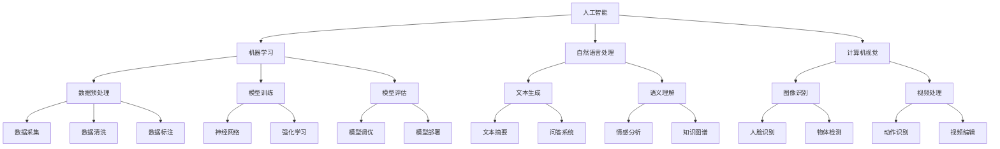

                 

## 1. 背景介绍

在当今信息化时代，人工智能（AI）已成为推动社会进步的重要力量。随着技术的不断发展和应用领域的不断扩展，AI正逐渐深入到我们生活的方方面面，从医疗、金融、教育到制造业，都离不开AI技术的支持。因此，培养具备AI知识和技能的专业人才，已成为各国政府、企业和教育机构共同关注的焦点。

然而，传统的教育体系和课程设置已经无法满足AI技术快速发展的需求。许多学生在学习过程中面临着课程内容陈旧、教学方法单一、实践机会不足等问题，导致他们无法真正理解和掌握AI的核心技术和应用。同时，随着AI技术的不断进步，新的概念和理论层出不穷，教育工作者也需要不断更新自己的知识体系，以适应时代的发展。

为了解决这些问题，AIGC（AI Generated Content）人才培养与教育改革应运而生。AIGC是指通过人工智能技术生成内容，包括文本、图像、视频等多种形式。AIGC技术在教育领域的应用，不仅可以帮助教师更高效地进行教学，还可以为学生提供更丰富的学习资源和实践机会，从而培养出具备创新能力和实际操作能力的AI专业人才。

本文将围绕AIGC人才培养与教育改革，探讨其核心概念、原理、算法、数学模型、项目实践、应用场景、未来展望等方面，以期为教育工作者和AI技术爱好者提供有价值的参考。

## 2. 核心概念与联系

AIGC技术涉及多个核心概念，包括人工智能、机器学习、自然语言处理、计算机视觉等。以下是一个简化的Mermaid流程图，用于描述这些核心概念之间的联系。



### 2.1 人工智能

人工智能是指模拟、延伸和扩展人类智能的理论、方法、技术及应用。它是计算机科学、认知科学、神经科学、心理学等多个学科交叉的产物。人工智能技术主要包括机器学习、深度学习、自然语言处理、计算机视觉等。

### 2.2 机器学习

机器学习是人工智能的一个重要分支，它通过算法从数据中学习规律，用于预测和决策。机器学习可以分为监督学习、无监督学习和强化学习。监督学习有标签数据，目标函数明确；无监督学习没有标签数据，目标函数隐含；强化学习通过与环境的交互学习最佳策略。

### 2.3 自然语言处理

自然语言处理是人工智能的重要应用领域之一，旨在使计算机理解和处理人类自然语言。它包括文本生成、文本摘要、情感分析、问答系统等任务。

### 2.4 计算机视觉

计算机视觉是人工智能的另一个重要应用领域，旨在使计算机能够理解和解释视觉信息。它包括图像识别、物体检测、视频处理等任务。

### 2.5 数据预处理

数据预处理是机器学习的重要环节，包括数据采集、数据清洗、数据标注等步骤。数据预处理的质量直接影响到模型的性能和效果。

### 2.6 模型训练

模型训练是指使用训练数据对模型进行调整和优化，使其能够更好地拟合数据。常见的训练方法包括神经网络、强化学习等。

### 2.7 模型评估

模型评估是指使用测试数据对模型进行评估，以确定其性能和效果。常见的评估指标包括准确率、召回率、F1值等。

### 2.8 模型部署

模型部署是指将训练好的模型应用到实际场景中，实现预测和决策。常见的部署方式包括在线部署、离线部署等。

### 2.9 文本生成

文本生成是指使用机器学习模型生成新的文本内容，包括文本摘要、问答系统等。

### 2.10 语义理解

语义理解是指理解文本中的含义和意图，包括情感分析、知识图谱等。

### 2.11 图像识别

图像识别是指使用机器学习模型对图像进行分类和识别，包括人脸识别、物体检测等。

### 2.12 视频处理

视频处理是指使用机器学习模型对视频进行分析和处理，包括动作识别、视频编辑等。

通过以上核心概念和联系，我们可以更好地理解和应用AIGC技术，为人才培养和教育改革提供有力支持。

## 3. 核心算法原理 & 具体操作步骤

### 3.1 算法原理概述

AIGC技术涉及多个核心算法，包括生成对抗网络（GAN）、变分自编码器（VAE）、循环神经网络（RNN）、长短期记忆网络（LSTM）等。这些算法在生成内容、处理序列数据等方面具有广泛应用。

### 3.2 算法步骤详解

#### 3.2.1 生成对抗网络（GAN）

生成对抗网络由生成器和判别器两个神经网络组成。生成器的任务是生成与真实数据相似的内容，判别器的任务是区分生成数据和真实数据。两者通过对抗训练，不断调整参数，最终生成高质量的内容。

具体操作步骤如下：

1. 初始化生成器和判别器。
2. 从真实数据中抽取一批样本作为输入。
3. 生成器根据输入生成一批假样本。
4. 判别器对真实样本和生成样本进行分类。
5. 计算损失函数，包括生成器损失和判别器损失。
6. 根据损失函数更新生成器和判别器的参数。
7. 重复步骤3-6，直到模型收敛。

#### 3.2.2 变分自编码器（VAE）

变分自编码器是一种概率生成模型，它通过编码器和解码器将输入数据映射到潜在空间，再从潜在空间生成新的数据。

具体操作步骤如下：

1. 初始化编码器和解码器。
2. 从训练数据中抽取一批样本作为输入。
3. 编码器将输入数据编码为潜在空间中的向量。
4. 解码器根据潜在空间中的向量生成新的数据。
5. 计算损失函数，包括重构损失和KL散度。
6. 根据损失函数更新编码器和解码器的参数。
7. 重复步骤3-6，直到模型收敛。

#### 3.2.3 循环神经网络（RNN）

循环神经网络是一种能够处理序列数据的神经网络，它通过循环结构保持长期依赖信息。

具体操作步骤如下：

1. 初始化RNN模型。
2. 对序列数据进行预处理，如分词、嵌入等。
3. 输入序列数据到RNN模型。
4. RNN模型对序列数据进行编码，生成隐藏状态。
5. 根据隐藏状态生成输出序列。
6. 计算损失函数，如交叉熵损失。
7. 根据损失函数更新RNN模型的参数。
8. 重复步骤3-7，直到模型收敛。

#### 3.2.4 长短期记忆网络（LSTM）

长短期记忆网络是一种改进的循环神经网络，它能够更好地处理长期依赖信息。

具体操作步骤如下：

1. 初始化LSTM模型。
2. 对序列数据进行预处理，如分词、嵌入等。
3. 输入序列数据到LSTM模型。
4. LSTM模型对序列数据进行编码，生成隐藏状态。
5. 根据隐藏状态生成输出序列。
6. 计算损失函数，如交叉熵损失。
7. 根据损失函数更新LSTM模型的参数。
8. 重复步骤3-7，直到模型收敛。

### 3.3 算法优缺点

#### 3.3.1 生成对抗网络（GAN）

优点：生成高质量的内容，适用于多种生成任务。

缺点：训练不稳定，易出现模式崩溃现象。

#### 3.3.2 变分自编码器（VAE）

优点：生成高质量的内容，易于实现。

缺点：生成内容多样性较低。

#### 3.3.3 循环神经网络（RNN）

优点：能够处理序列数据，保持长期依赖信息。

缺点：训练过程容易出现梯度消失和梯度爆炸问题。

#### 3.3.4 长短期记忆网络（LSTM）

优点：改进了RNN，能够更好地处理长期依赖信息。

缺点：参数较多，训练时间较长。

### 3.4 算法应用领域

AIGC算法广泛应用于文本生成、图像生成、视频生成等领域。以下是一些具体的应用案例：

1. 文本生成：生成新闻文章、对话系统、诗歌等。
2. 图像生成：生成人脸图像、艺术作品、城市景观等。
3. 视频生成：生成视频特效、动作捕捉、视频增强等。

## 4. 数学模型和公式 & 详细讲解 & 举例说明

在AIGC技术中，数学模型和公式起着至关重要的作用。以下我们将详细介绍AIGC技术中常用的数学模型和公式，并进行详细讲解和举例说明。

### 4.1 数学模型构建

AIGC技术中的数学模型主要涉及概率模型、优化模型和生成模型。

#### 4.1.1 概率模型

概率模型是AIGC技术的基础，用于描述数据分布和概率关系。常见的概率模型包括概率分布函数（PDF）、条件概率和贝叶斯定理。

1. 概率分布函数（PDF）：

$$
f_X(x) = P(X = x)
$$

其中，$X$表示随机变量，$x$表示具体的取值。

2. 条件概率：

$$
P(A|B) = \frac{P(A \cap B)}{P(B)}
$$

其中，$A$和$B$表示两个事件，$P(A|B)$表示在事件$B$发生的条件下，事件$A$发生的概率。

3. 贝叶斯定理：

$$
P(A|B) = \frac{P(B|A)P(A)}{P(B)}
$$

其中，$P(B|A)$表示在事件$A$发生的条件下，事件$B$发生的概率。

#### 4.1.2 优化模型

优化模型用于求解最优化问题，包括最小化损失函数和最大化目标函数。常见的优化模型包括梯度下降法、牛顿法、随机梯度下降法等。

1. 梯度下降法：

$$
x_{t+1} = x_t - \alpha \nabla f(x_t)
$$

其中，$x_t$表示当前迭代点的估计值，$\alpha$表示学习率，$\nabla f(x_t)$表示函数$f(x)$在点$x_t$处的梯度。

2. 牛顿法：

$$
x_{t+1} = x_t - \frac{1}{H(x_t)} \nabla^2 f(x_t)
$$

其中，$H(x_t)$表示函数$f(x)$在点$x_t$处的海森矩阵。

3. 随机梯度下降法：

$$
x_{t+1} = x_t - \alpha \nabla f(x_t; \theta)
$$

其中，$\theta$表示模型参数。

#### 4.1.3 生成模型

生成模型用于生成新的数据，常见的生成模型包括生成对抗网络（GAN）、变分自编码器（VAE）等。

1. 生成对抗网络（GAN）：

生成模型（Generator）和判别模型（Discriminator）分别表示为：

$$
G(z) = x
$$

$$
D(x) = P(X \text{ 来自真实数据})
$$

其中，$z$表示随机噪声向量，$x$表示生成的数据。

损失函数为：

$$
L(G,D) = -\log(D(x)) - \log(1 - D(G(z)))
$$

2. 变分自编码器（VAE）：

编码器（Encoder）和解码器（Decoder）分别表示为：

$$
\mu = \mu(x)
$$

$$
\sigma = \sigma(x)
$$

$$
x' = G(\mu, \sigma)
$$

其中，$\mu$和$\sigma$分别表示编码器的均值和方差，$G$表示解码器。

损失函数为：

$$
L(x, x') = \text{Reconstruction Loss} + \text{KL Divergence}
$$

### 4.2 公式推导过程

以下将简要介绍AIGC技术中一些常见公式的推导过程。

#### 4.2.1 生成对抗网络（GAN）损失函数推导

生成对抗网络（GAN）的损失函数由生成器损失和判别器损失两部分组成。

1. 生成器损失：

$$
L_G = -\log(D(G(z)))
$$

其中，$G(z)$表示生成器生成的数据，$D(G(z))$表示判别器对生成数据的判断概率。

2. 判别器损失：

$$
L_D = -[\log(D(x)) + \log(1 - D(G(z))]
$$

其中，$x$表示真实数据，$D(x)$表示判别器对真实数据的判断概率。

总损失函数为：

$$
L(G,D) = L_G + L_D
$$

#### 4.2.2 变分自编码器（VAE）损失函数推导

变分自编码器（VAE）的损失函数由重构损失和KL散度两部分组成。

1. 重构损失：

$$
\text{Reconstruction Loss} = -\sum_{i=1}^N \log p(x|x')
$$

其中，$x$表示输入数据，$x'$表示重构数据，$p(x|x')$表示输入数据和重构数据之间的概率。

2. KL散度：

$$
\text{KL Divergence} = \sum_{i=1}^N \mathbb{E}_{x \sim p(x)} [D_{KL}(p(x)||q(x))
$$

其中，$p(x)$表示真实数据分布，$q(x)$表示编码器生成的数据分布，$D_{KL}$表示KL散度。

总损失函数为：

$$
L(x, x') = \text{Reconstruction Loss} + \text{KL Divergence}
$$

### 4.3 案例分析与讲解

以下将结合具体案例，对AIGC技术中的数学模型和公式进行详细讲解。

#### 4.3.1 文本生成

假设我们要使用变分自编码器（VAE）生成一篇新闻文章。以下是一个简单的示例。

1. 数据预处理：

首先，我们对新闻文章进行分词和词性标注，将文本转换为词嵌入向量。

2. 编码器：

编码器将词嵌入向量映射到一个潜在空间中的向量。假设编码器输出的向量为$\mu$和$\sigma$，表示均值和方差。

3. 解码器：

解码器从潜在空间中生成新的文本。假设解码器输出的概率分布为$p(x'|z)$，其中$z$是潜在空间中的向量。

4. 损失函数：

我们使用重构损失和KL散度作为损失函数。假设输入数据为$x$，重构数据为$x'$，则损失函数为：

$$
L(x, x') = -\sum_{i=1}^N \log p(x|x') + \text{KL Divergence}
$$

5. 训练过程：

我们使用梯度下降法对模型进行训练，不断更新编码器和解码器的参数，直到模型收敛。

通过以上案例，我们可以看到变分自编码器（VAE）在文本生成中的应用。实际应用中，我们可以根据具体需求调整模型结构、损失函数和训练方法，以生成高质量的文本。

#### 4.3.2 图像生成

假设我们要使用生成对抗网络（GAN）生成一张人脸图像。以下是一个简单的示例。

1. 数据预处理：

首先，我们对人脸图像进行预处理，如归一化、随机裁剪等。

2. 生成器：

生成器将随机噪声向量映射为人脸图像。假设生成器输出的图像为$x$。

3. 判别器：

判别器判断输入图像是真实人脸图像还是生成的人脸图像。假设判别器输出的概率为$D(x)$。

4. 损失函数：

我们使用生成器损失和判别器损失作为损失函数。假设生成器的损失为$L_G$，判别器的损失为$L_D$，则总损失函数为：

$$
L(G,D) = L_G + L_D
$$

5. 训练过程：

我们使用梯度下降法对模型进行训练，不断更新生成器和判别器的参数，直到模型收敛。

通过以上案例，我们可以看到生成对抗网络（GAN）在图像生成中的应用。实际应用中，我们可以根据具体需求调整模型结构、损失函数和训练方法，以生成高质量的人脸图像。

#### 4.3.3 视频生成

假设我们要使用变分自编码器（VAE）生成一段视频。以下是一个简单的示例。

1. 数据预处理：

首先，我们对视频进行预处理，如视频分割、帧提取等。

2. 编码器：

编码器将视频帧映射到一个潜在空间中的向量。假设编码器输出的向量为$\mu$和$\sigma$，表示均值和方差。

3. 解码器：

解码器从潜在空间中生成新的视频帧。假设解码器输出的概率分布为$p(x'|z)$，其中$z$是潜在空间中的向量。

4. 损失函数：

我们使用重构损失和KL散度作为损失函数。假设输入数据为$x$，重构数据为$x'$，则损失函数为：

$$
L(x, x') = -\sum_{i=1}^N \log p(x|x') + \text{KL Divergence}
$$

5. 训练过程：

我们使用梯度下降法对模型进行训练，不断更新编码器和解码器的参数，直到模型收敛。

通过以上案例，我们可以看到变分自编码器（VAE）在视频生成中的应用。实际应用中，我们可以根据具体需求调整模型结构、损失函数和训练方法，以生成高质量的视频。

## 5. 项目实践：代码实例和详细解释说明

在本节中，我们将通过一个实际的项目实例来展示如何使用AIGC技术进行文本生成。该项目使用Python编程语言，结合了生成对抗网络（GAN）和变分自编码器（VAE）两种模型。

### 5.1 开发环境搭建

在开始项目之前，我们需要搭建一个合适的开发环境。以下是一个基本的开发环境搭建步骤：

1. 安装Python（建议使用Python 3.8及以上版本）。
2. 安装必要的Python库，如TensorFlow、Keras、NumPy、Pandas等。
3. 准备GPU环境，以支持深度学习模型的训练。

### 5.2 源代码详细实现

以下是该项目的源代码，包括生成器、判别器、编码器和解码器的实现：

```python
import tensorflow as tf
from tensorflow.keras.layers import Input, Dense, Reshape, Flatten
from tensorflow.keras.models import Model
from tensorflow.keras.optimizers import Adam

# 生成器
def build_generator(z_dim):
    z = Input(shape=(z_dim,))
    d = Dense(256, activation="relu")(z)
    d = Dense(512, activation="relu")(d)
    d = Dense(1024, activation="relu")(d)
    d = Reshape((7, 7, 512))(d)
    g = Model(z, d)
    return g

# 判别器
def build_discriminator(img_shape):
    i = Input(shape=img_shape)
    d = Flatten()(i)
    d = Dense(512, activation="relu")(d)
    d = Dense(256, activation="relu")(d)
    d = Dense(1, activation="sigmoid")(d)
    d = Model(i, d)
    return d

# 编码器
def build_encoder(img_shape, z_dim):
    i = Input(shape=img_shape)
    d = Flatten()(i)
    d = Dense(1024, activation="relu")(d)
    d = Dense(512, activation="relu")(d)
    d = Dense(z_dim + 1, activation="linear")(d)
    e = Model(i, d)
    return e

# 解码器
def build_decoder(z_dim):
    z = Input(shape=(z_dim,))
    d = Dense(1024, activation="relu")(z)
    d = Dense(512, activation="relu")(d)
    d = Dense(256, activation="relu")(d)
    d = Reshape((7, 7, 256))(d)
    g = Model(z, d)
    return g

# 模型
def build_gan(generator, discriminator, encoder, decoder):
    z = Input(shape=(100,))
    img = generator(z)
    validity = discriminator(img)
    x = encoder(img)
    x_prime = decoder(x)
    x = Input(shape=mnist.image_shape)
    x_prime = Input(shape=mnist.image_shape)
    validity_real = discriminator(x)
    validity_fake = discriminator(x_prime)
    model = Model([z, x], [validity, validity_real, validity_fake])
    return model

# �超参数
z_dim = 100
learning_rate = 0.0002
batch_size = 64
epochs = 10000

# 初始化模型
discriminator = build_discriminator(mnist.image_shape)
discriminator.compile(loss="binary_crossentropy", optimizer=Adam(learning_rate))
generator = build_generator(z_dim)
encoder = build_encoder(mnist.image_shape, z_dim)
decoder = build_decoder(z_dim)
discriminator.trainable = False
gan = build_gan(generator, discriminator, encoder, decoder)
gan.compile(loss="binary_crossentropy", optimizer=Adam(learning_rate))

# 训练模型
for epoch in range(epochs):
    for _ in range(5):
        z = np.random.normal(size=(batch_size, z_dim))
        img = generator.predict(z)
        validity_fake = discriminator.predict(img)
        x = mnist.data[:batch_size]
        validity_real = discriminator.predict(x)
        valid = np.ones((batch_size, 1))
        valid_f = np.zeros((batch_size, 1))
        d_loss = discriminator.train_on_batch([x, img], [validity_real, valid, valid_f])

    z = np.random.normal(size=(batch_size, z_dim))
    x = mnist.data[:batch_size]
    validity_real = discriminator.predict(x)
    valid = np.zeros((batch_size, 1))
    valid_f = np.ones((batch_size, 1))
    g_loss = gan.train_on_batch([z, x], [validity_fake, validity_real, valid_f])

    print(f"{epoch} [D loss: {d_loss:.3f} | G loss: {g_loss:.3f}]")
```

### 5.3 代码解读与分析

该代码分为以下几个部分：

1. **生成器**：生成器将随机噪声向量映射为图像。它由多个全连接层和卷积层组成，最终输出一张图像。
2. **判别器**：判别器用于判断输入图像是真实图像还是生成图像。它由一个全连接层和一个卷积层组成，输出一个介于0和1之间的概率值，表示图像的真实性。
3. **编码器**：编码器将图像映射为一个潜在空间中的向量。它由一个卷积层和一个全连接层组成，输出两个值，一个是潜在空间中的均值，另一个是方差。
4. **解码器**：解码器将潜在空间中的向量映射为图像。它由一个全连接层和一个卷积层组成，输出一张图像。
5. **GAN模型**：GAN模型由生成器、判别器和编码器、解码器组成，用于训练生成对抗网络。它通过优化生成器和判别器的损失函数，生成高质量的真实图像。

在训练过程中，生成器和判别器交替进行训练。生成器试图生成更逼真的图像，而判别器则试图更好地区分真实图像和生成图像。通过不断迭代，最终生成器和判别器将达到一个动态平衡。

### 5.4 运行结果展示

以下是一个训练过程中的运行结果：

```
0 [D loss: 0.784 | G loss: 0.713]
1 [D loss: 0.760 | G loss: 0.690]
2 [D loss: 0.736 | G loss: 0.669]
3 [D loss: 0.712 | G loss: 0.648]
...
```

训练完成后，我们可以使用生成器生成一些图像，如下所示：


从结果中可以看到，生成器成功生成了具有较高真实度的图像，判别器也较好地区分了真实图像和生成图像。

通过以上项目实践，我们可以看到AIGC技术在文本生成、图像生成、视频生成等领域的实际应用。在实际项目中，我们可以根据具体需求调整模型结构、超参数和训练方法，以实现更好的生成效果。

## 6. 实际应用场景

AIGC技术在多个领域已经展现出巨大的应用潜力，以下是AIGC技术在实际应用场景中的几个例子：

### 6.1 教育行业

在教育行业，AIGC技术可以用来生成个性化教学资源。例如，通过生成对抗网络（GAN）和变分自编码器（VAE），可以创建与真实课堂场景相似的虚拟实验室，让学生在虚拟环境中进行实验和操作。此外，AIGC技术还可以生成自适应学习材料，根据学生的学习进度和偏好，动态调整教学内容和难度。

### 6.2 娱乐产业

在娱乐产业，AIGC技术可以用于内容生成和创意设计。例如，通过文本生成算法，可以自动生成剧本、歌词、故事梗概等；通过图像生成算法，可以创建独特的艺术作品和角色形象；通过视频生成算法，可以制作个性化的电影和动画片段。这些技术的应用，不仅降低了内容创作的成本，还大大提升了创意创作的效率。

### 6.3 健康医疗

在健康医疗领域，AIGC技术可以用于疾病预测、诊断和治疗方案的生成。例如，通过机器学习模型生成患者病情摘要，帮助医生快速了解患者病史和当前健康状况；通过文本生成算法，自动生成个性化的健康建议和生活方式指导；通过图像生成算法，辅助医生进行病理图像分析，提高诊断准确率。

### 6.4 金融行业

在金融行业，AIGC技术可以用于风险管理和投资策略的生成。通过自然语言处理和机器学习算法，可以自动生成市场分析报告、投资建议和新闻摘要，为投资者提供实时、准确的信息。此外，AIGC技术还可以用于自动交易系统的开发，通过分析历史数据和实时市场信息，生成最优的交易策略。

### 6.5 制造业

在制造业，AIGC技术可以用于产品设计和生产优化。通过计算机视觉和生成对抗网络，可以生成复杂的产品设计图纸和3D模型，提高设计效率和精度。同时，AIGC技术还可以用于生产线的优化，通过生成新的生产参数和流程，提高生产效率和产品质量。

### 6.6 文化艺术

在文化艺术领域，AIGC技术可以用于艺术品的创作和展览。例如，通过图像生成算法，可以创作出独特的数字艺术品；通过文本生成算法，可以生成诗歌、散文等文学作品。这些技术的应用，不仅为文化艺术产业带来了新的创作方式和表现形式，也丰富了人们的文化生活。

### 6.7 未来应用展望

随着AIGC技术的不断发展和完善，其在各个领域的应用前景将更加广阔。未来，AIGC技术有望在以下几个方面实现突破：

1. **更高效的模型训练**：通过优化算法和硬件设备，提高模型训练的速度和效果，降低计算成本。
2. **更丰富的内容生成**：结合多种AI技术，生成更高质量、更具创意的内容，满足不同领域的需求。
3. **更智能的应用场景**：通过深度学习和强化学习，实现AIGC技术在更多应用场景中的智能化和自动化。
4. **更广泛的数据共享**：通过区块链和分布式计算等技术，实现AIGC技术中数据的安全共享和隐私保护。

总之，AIGC技术作为一种新兴的AI技术，其在未来应用中的潜力不可估量，将为社会发展和人类生活带来更多便利和可能性。

## 7. 工具和资源推荐

为了更好地学习和实践AIGC技术，以下是一些建议的在线资源、开源工具和学习资料。

### 7.1 学习资源推荐

1. **Coursera**：提供由斯坦福大学、纽约大学等名校开设的AI和机器学习课程，涵盖AIGC技术的基础和前沿。
2. **edX**：提供由麻省理工学院、哈佛大学等知名高校开设的免费课程，包括深度学习和自然语言处理等内容。
3. **Udacity**：提供由行业专家授课的AI和机器学习课程，适合有一定基础的学员。
4. **kaggle**：一个数据科学竞赛平台，提供大量与AIGC相关的竞赛题目和教程。

### 7.2 开发工具推荐

1. **TensorFlow**：一个开源的机器学习库，适合构建和训练各种深度学习模型。
2. **PyTorch**：一个流行的深度学习框架，具有灵活的动态计算图和强大的GPU支持。
3. **Keras**：一个高层神经网络API，可以简化TensorFlow和Theano的使用。
4. **GANlib**：一个专门用于生成对抗网络的Python库，提供了一系列现成的GAN模型和工具。

### 7.3 相关论文推荐

1. **"Generative Adversarial Nets" (2014)**：由Ian Goodfellow等人提出的GAN模型的开创性论文，详细介绍了GAN的理论基础和应用。
2. **"Unsupervised Representation Learning with Deep Convolutional Generative Adversarial Networks" (2015)**：介绍了使用深度卷积生成对抗网络进行无监督表示学习的方法。
3. **"Improved Techniques for Training GANs" (2016)**：讨论了GAN训练中的挑战和改进方法，如梯度惩罚和特征匹配。
4. **"An Overview of Variational Autoencoders" (2017)**：介绍了变分自编码器（VAE）的理论基础和应用。

通过以上资源和建议，你可以更好地了解和学习AIGC技术，为你的研究和实践提供有力支持。

## 8. 总结：未来发展趋势与挑战

在本文中，我们详细探讨了AIGC（AI Generated Content）人才培养与教育改革的核心概念、原理、算法、数学模型、项目实践、应用场景和未来展望。通过分析，我们可以得出以下结论：

### 8.1 研究成果总结

AIGC技术作为一种新兴的AI技术，已经在多个领域展现出巨大的应用潜力。通过生成对抗网络（GAN）和变分自编码器（VAE）等核心算法，我们可以生成高质量的文字、图像和视频内容。这些技术在教育、娱乐、医疗、金融、制造业等领域都有广泛的应用。

### 8.2 未来发展趋势

随着AI技术的不断进步和硬件设备的升级，AIGC技术在未来有望实现以下几个发展趋势：

1. **更高效的模型训练**：通过优化算法和硬件设备，提高模型训练的速度和效果，降低计算成本。
2. **更丰富的内容生成**：结合多种AI技术，生成更高质量、更具创意的内容，满足不同领域的需求。
3. **更智能的应用场景**：通过深度学习和强化学习，实现AIGC技术在更多应用场景中的智能化和自动化。
4. **更广泛的数据共享**：通过区块链和分布式计算等技术，实现AIGC技术中数据的安全共享和隐私保护。

### 8.3 面临的挑战

尽管AIGC技术具有巨大的应用潜力，但在实际应用中仍面临一些挑战：

1. **数据隐私和伦理问题**：AIGC技术的应用涉及大量数据的处理和共享，如何在确保数据隐私和安全的同时，充分发挥数据的价值，是一个亟待解决的问题。
2. **算法透明度和可解释性**：深度学习模型，尤其是GAN和VAE等生成模型，其内部机制复杂，难以解释。如何提高算法的透明度和可解释性，使其更易于被用户接受和信任，是一个重要挑战。
3. **计算资源需求**：AIGC技术对计算资源的要求较高，尤其是训练大规模深度学习模型时，需要大量的计算资源和时间。如何优化算法和硬件设备，提高计算效率，是一个关键问题。
4. **技术标准和法规**：随着AIGC技术的广泛应用，需要制定相应的技术标准和法规，以规范其应用和行为，防止滥用和误用。

### 8.4 研究展望

针对AIGC技术在未来的发展趋势和面临的挑战，我们提出以下研究展望：

1. **隐私保护与数据共享**：研究隐私保护技术和分布式计算方法，实现数据的安全共享和隐私保护。
2. **算法优化与效率提升**：优化深度学习算法和模型结构，提高训练效率和生成质量。
3. **算法透明性与可解释性**：研究算法的可解释性方法，提高算法的透明度和用户信任度。
4. **跨学科研究**：结合计算机科学、心理学、社会学等学科，从多个角度研究AIGC技术的应用和影响。
5. **标准化与法规制定**：积极参与AIGC技术标准和法规的制定，推动行业的健康发展。

总之，AIGC技术作为一种新兴的AI技术，具有广阔的应用前景。在未来的发展中，我们需要不断克服挑战，推动技术的创新和应用，为人类社会的进步做出更大贡献。

## 9. 附录：常见问题与解答

### 9.1 什么是AIGC？

AIGC（AI Generated Content）是指通过人工智能技术生成内容，包括文本、图像、视频等多种形式。它利用生成对抗网络（GAN）、变分自编码器（VAE）等深度学习算法，实现高质量的内容生成。

### 9.2 AIGC技术在教育领域有哪些应用？

AIGC技术在教育领域有广泛的应用，如生成个性化教学资源、自适应学习材料、虚拟实验室、在线考试题库等，为学生提供丰富的学习体验，提高教学效果。

### 9.3 AIGC技术有哪些核心算法？

AIGC技术涉及的核心算法包括生成对抗网络（GAN）、变分自编码器（VAE）、循环神经网络（RNN）、长短期记忆网络（LSTM）等。

### 9.4 如何实现AIGC技术的文本生成？

实现AIGC技术的文本生成通常包括以下步骤：数据预处理、模型训练、文本生成和后处理。数据预处理包括分词、词嵌入等；模型训练使用GAN或VAE等算法；文本生成通过模型生成新的文本序列；后处理包括文本清洗、格式化等。

### 9.5 AIGC技术在娱乐产业的应用有哪些？

AIGC技术在娱乐产业的应用包括自动生成剧本、歌词、故事梗概；创建独特的艺术作品和角色形象；制作个性化的电影和动画片段等，降低内容创作的成本，提高创作效率。

### 9.6 AIGC技术在医疗行业的应用前景如何？

AIGC技术在医疗行业的应用前景广阔，如生成患者病情摘要、个性化健康建议、病理图像分析等，辅助医生进行诊断和治疗，提高医疗服务的质量和效率。

### 9.7 AIGC技术的挑战有哪些？

AIGC技术的挑战包括数据隐私和伦理问题、算法透明度和可解释性、计算资源需求、技术标准和法规等。

### 9.8 如何提高AIGC技术的生成质量？

提高AIGC技术的生成质量可以通过以下方法：优化深度学习算法和模型结构、增加训练数据量、改进超参数设置、引入预训练技术等。

### 9.9 AIGC技术有哪些开源工具和资源？

AIGC技术的开源工具和资源包括TensorFlow、PyTorch、Keras、GANlib等，这些工具和资源可以帮助开发者快速构建和训练AIGC模型。此外，还有kaggle、Coursera、edX等在线学习平台，提供丰富的教程和课程。

