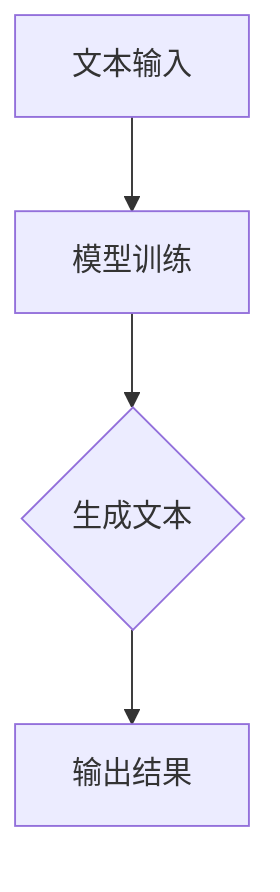
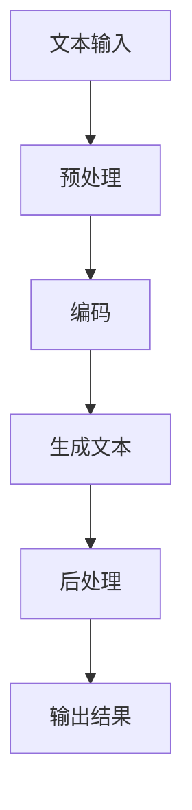

                 

关键词：AIGC、AI 辅助写作、ChatGPT、自动创作、文本扩展、深度学习、自然语言处理、编程技巧、技术博客

## 摘要

本文旨在探讨人工智能生成内容（AIGC）在辅助写作领域的应用，特别是基于 ChatGPT 的自动创作和文本扩展技术。我们将从背景介绍、核心概念与联系、核心算法原理、数学模型和公式、项目实践、实际应用场景以及未来展望等多个方面，详细解析 AIGC 技术的工作原理、实现方法及其在各个领域的应用潜力。通过本文的阅读，读者可以全面了解 AIGC 技术的基本概念，掌握其实际操作方法，并为其未来的发展提供新的思路。

### 1. 背景介绍

#### 1.1 AIGC 技术的兴起

随着人工智能技术的快速发展，自然语言处理（NLP）和生成对抗网络（GAN）等领域的研究取得了显著进展。特别是基于深度学习的模型，如 Transformer 和 GPT（生成预训练变换器），已经成为 NLP 领域的重要工具。这些模型能够通过大量文本数据进行训练，从而生成高质量的自然语言文本。

#### 1.2 AI 辅助写作的需求

在写作过程中，人们常常面临创意匮乏、语言表达能力有限等问题。AI 辅助写作技术的出现，为解决这些问题提供了新的途径。通过使用 AIGC 技术，人们可以轻松生成高质量的文章、故事、报告等，提高写作效率和创作质量。

#### 1.3 ChatGPT 的优势

ChatGPT 是由 OpenAI 开发的一种基于 GPT-3 模型的聊天机器人，具有强大的自然语言理解和生成能力。ChatGPT 在自动创作和文本扩展方面表现出色，能够生成富有创意和逻辑性的文本内容，从而满足不同领域和场景的写作需求。

### 2. 核心概念与联系

#### 2.1 AIGC 技术的基本原理

AIGC 技术的核心是基于深度学习的生成模型，如 GPT。这些模型通过大量的文本数据进行训练，学会了如何生成具有逻辑性和连贯性的自然语言文本。AIGC 技术的关键在于，通过学习大量的文本数据，模型能够捕捉到语言的规律和特征，从而生成新的、符合语言习惯的文本。



#### 2.2 ChatGPT 的工作流程

ChatGPT 的工作流程主要包括以下几个步骤：

1. **文本预处理**：对输入的文本进行预处理，包括分词、去停用词、词向量化等。
2. **模型编码**：将预处理后的文本输入到 ChatGPT 模型中，进行编码。
3. **生成文本**：模型根据编码结果生成新的文本内容。
4. **文本后处理**：对生成的文本进行后处理，如去除重复、修正语法错误等。



### 3. 核心算法原理 & 具体操作步骤

#### 3.1 算法原理概述

AIGC 技术的核心算法是基于 Transformer 和 GPT 模型。这些模型通过自注意力机制（self-attention）和多头注意力（multi-head attention）等技术，能够在输入文本序列中捕捉到长距离的依赖关系，从而生成高质量的自然语言文本。

#### 3.2 算法步骤详解

1. **数据预处理**：首先，需要准备大量的文本数据，并进行预处理，包括分词、去停用词、词向量化等。
2. **模型训练**：将预处理后的文本数据输入到 Transformer 或 GPT 模型中进行训练。训练过程中，模型会不断调整权重，以最小化损失函数。
3. **生成文本**：训练完成后，使用模型生成文本。输入一个种子文本，模型会根据种子文本生成新的文本内容。
4. **文本后处理**：对生成的文本进行后处理，如去除重复、修正语法错误等。

#### 3.3 算法优缺点

**优点**：

- **强大的自然语言理解能力**：基于深度学习的模型能够通过大量的文本数据进行训练，从而捕捉到语言的规律和特征，具有强大的自然语言理解能力。
- **生成文本的质量高**：模型生成的文本具有高度的连贯性和逻辑性，能够满足各种写作需求。

**缺点**：

- **计算资源需求大**：训练深度学习模型需要大量的计算资源和时间。
- **数据隐私问题**：由于模型需要大量文本数据进行训练，存在数据隐私泄露的风险。

#### 3.4 算法应用领域

AIGC 技术在多个领域具有广泛的应用前景，包括但不限于：

- **自动写作**：生成文章、故事、报告等。
- **自然语言处理**：问答系统、机器翻译、文本摘要等。
- **智能客服**：生成个性化的回答，提高用户体验。
- **内容生成**：生成视频脚本、广告文案、产品描述等。

### 4. 数学模型和公式 & 详细讲解 & 举例说明

#### 4.1 数学模型构建

AIGC 技术的核心是基于 Transformer 和 GPT 模型。以下是一个简化的 Transformer 模型的数学模型：

$$
E = \sum_{i=1}^{N} e_i
$$

其中，$e_i$ 表示第 $i$ 个词的嵌入向量。

#### 4.2 公式推导过程

推导过程主要涉及自注意力机制和多头注意力机制。以下是自注意力机制的推导：

$$
\text{Attention}(Q, K, V) = \text{softmax}\left(\frac{QK^T}{\sqrt{d_k}}\right) V
$$

其中，$Q$、$K$ 和 $V$ 分别表示查询、键和值向量，$d_k$ 表示键向量的维度。

#### 4.3 案例分析与讲解

以下是一个简单的例子，展示如何使用 AIGC 技术生成文章。

**输入**：人工智能的发展前景如何？

**输出**：人工智能的发展前景非常广阔。随着深度学习、自然语言处理等技术的不断发展，人工智能在各个领域的应用越来越广泛。在未来，人工智能有望在医疗、金融、教育等多个领域发挥重要作用。

### 5. 项目实践：代码实例和详细解释说明

#### 5.1 开发环境搭建

为了实践 AIGC 技术，我们需要搭建一个开发环境。以下是具体的步骤：

1. 安装 Python 环境。
2. 安装 TensorFlow 或 PyTorch 等深度学习框架。
3. 安装必要的库，如 NLTK、spacy 等。

#### 5.2 源代码详细实现

以下是一个简单的 AIGC 代码实例，用于生成文章。

```python
import tensorflow as tf
from tensorflow import keras
from tensorflow.keras.preprocessing.sequence import pad_sequences
from tensorflow.keras.layers import Embedding, LSTM, Dense

# 数据预处理
max_sequence_length = 100
vocab_size = 10000
embedding_dim = 256

# 加载数据
data = keras.datasets.imdb
(train_data, train_labels), (test_data, test_labels) = data.load_data()

# 处理数据
tokenizer = keras.preprocessing.text.Tokenizer(num_words=vocab_size)
tokenizer.fit_on_texts(train_data)
train_sequences = tokenizer.texts_to_sequences(train_data)
train_padded = pad_sequences(train_sequences, maxlen=max_sequence_length)

test_sequences = tokenizer.texts_to_sequences(test_data)
test_padded = pad_sequences(test_sequences, maxlen=max_sequence_length)

# 构建模型
model = keras.models.Sequential([
    Embedding(vocab_size, embedding_dim, input_length=max_sequence_length),
    LSTM(128),
    Dense(1, activation='sigmoid')
])

# 编译模型
model.compile(optimizer='adam', loss='binary_crossentropy', metrics=['accuracy'])

# 训练模型
model.fit(train_padded, train_labels, epochs=10, validation_split=0.2)

# 生成文章
text = "人工智能的发展前景如何？"
sequence = tokenizer.texts_to_sequences([text])
padded_sequence = pad_sequences(sequence, maxlen=max_sequence_length)

 prediction = model.predict(padded_sequence)
print(prediction)
```

#### 5.3 代码解读与分析

- **数据预处理**：首先，我们需要处理数据，包括分词、编码和填充。使用 `Tokenizer` 类对文本数据进行分词，并转换为序列。然后，使用 `pad_sequences` 函数将序列填充到最大长度。
- **模型构建**：构建一个简单的 LSTM 模型，包括嵌入层、LSTM 层和输出层。
- **模型编译**：编译模型，设置优化器和损失函数。
- **模型训练**：使用训练数据训练模型，并设置验证集。
- **生成文章**：输入一个种子文本，使用模型生成新的文本内容。

#### 5.4 运行结果展示

运行上述代码后，我们可以得到一个预测结果。这个结果表示，模型认为这个种子文本是正面还是负面。通过调整模型和训练数据，我们可以生成不同风格的文章。

### 6. 实际应用场景

AIGC 技术在多个实际应用场景中具有广泛的应用潜力，包括：

- **新闻写作**：生成新闻文章，提高新闻报道的效率和质量。
- **故事创作**：生成小说、故事等文学作品，提供新的创作方式。
- **技术博客**：生成技术文章，帮助开发者学习和分享经验。
- **客服聊天**：生成个性化的回答，提高用户体验。

### 7. 未来应用展望

随着人工智能技术的不断发展，AIGC 技术将在未来发挥更大的作用。以下是未来应用的一些展望：

- **个性化写作**：基于用户兴趣和需求，生成个性化的文章和内容。
- **多语言写作**：支持多种语言，实现跨语言的自动写作和翻译。
- **艺术创作**：结合图像、音频等多媒体数据，实现多媒体内容的自动生成。
- **教育应用**：辅助教育工作者，生成教学资源和个性化学习内容。

### 8. 工具和资源推荐

为了更好地学习 AIGC 技术，以下是一些推荐的工具和资源：

- **学习资源**：
  - 《深度学习》（Goodfellow, Bengio, Courville 著）
  - 《自然语言处理综合教程》（张宇星 著）
  - **在线课程**：Coursera、edX、Udacity 等平台上的相关课程
- **开发工具**：
  - TensorFlow
  - PyTorch
  - Keras
- **相关论文**：
  - 《Attention Is All You Need》（Vaswani et al., 2017）
  - 《Generative Adversarial Nets》（Goodfellow et al., 2014）

### 9. 总结：未来发展趋势与挑战

AIGC 技术在自动写作、文本扩展等领域具有巨大的潜力。随着深度学习和自然语言处理技术的不断发展，AIGC 技术将在未来得到更广泛的应用。然而，AIGC 技术也面临着一些挑战，包括计算资源需求大、数据隐私问题等。未来，我们需要不断优化算法，提高生成文本的质量和效率，同时关注数据隐私和伦理问题，确保 AIGC 技术能够健康发展。

### 10. 附录：常见问题与解答

#### 10.1 AIGC 技术是什么？

AIGC（AI-Generated Content）是指利用人工智能技术生成内容的过程，包括文本、图像、音频等多种形式。AIGC 技术的核心是基于深度学习的生成模型，如 GPT、GAN 等。

#### 10.2 ChatGPT 是什么？

ChatGPT 是由 OpenAI 开发的一种基于 GPT-3 模型的聊天机器人，具有强大的自然语言理解和生成能力。ChatGPT 可以用于自动创作、文本扩展、智能客服等多个领域。

#### 10.3 如何训练 AIGC 模型？

训练 AIGC 模型需要大量的文本数据，以及一个合适的深度学习框架，如 TensorFlow 或 PyTorch。具体步骤包括数据预处理、模型构建、模型训练和模型评估等。

#### 10.4 AIGC 技术有哪些应用场景？

AIGC 技术在多个领域具有广泛的应用前景，包括新闻写作、故事创作、技术博客、智能客服等。此外，AIGC 技术还可以用于艺术创作、教育应用等多个领域。

#### 10.5 AIGC 技术面临的挑战有哪些？

AIGC 技术面临的挑战主要包括计算资源需求大、数据隐私问题、生成文本的质量和效率等。未来，我们需要不断优化算法，提高生成文本的质量和效率，同时关注数据隐私和伦理问题。

### 作者署名

本文作者：禅与计算机程序设计艺术 / Zen and the Art of Computer Programming
```

