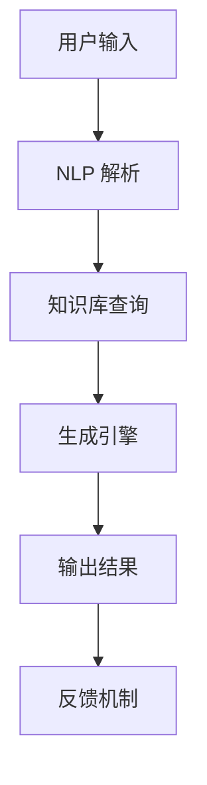

                 

关键词：人工智能，自然语言处理，Microsoft 365 Copilot，办公软件，代码生成，AI 助手，深度学习

摘要：本文将深入探讨 AIGC（自适应智能生成计算）在办公软件中的应用，特别是 Microsoft 365 Copilot 的技术原理、实现方法以及实际应用场景。通过详细的分析和案例讲解，帮助读者理解如何利用 AI 助手提升办公效率，并在未来的发展中预见到面临的挑战和机遇。

## 1. 背景介绍

随着人工智能技术的飞速发展，自然语言处理（NLP）作为其中重要的分支，已经在多个领域展现出巨大的潜力。Microsoft 365 Copilot 是微软公司推出的一款基于人工智能的办公软件助手，它利用深度学习和自然语言处理技术，旨在帮助用户更加高效地完成日常办公任务。本文将围绕 Microsoft 365 Copilot 的技术原理、应用场景和未来展望进行深入探讨。

### 1.1 人工智能与自然语言处理

人工智能（AI）是一种模拟人类智能行为的计算机系统，其核心在于机器学习、深度学习等算法的应用。自然语言处理（NLP）作为 AI 的重要分支，专注于使计算机能够理解和处理人类语言。从文本分析、情感识别到语音识别和机器翻译，NLP 在众多领域取得了显著的成果。

### 1.2  Microsoft 365 Copilot 的推出背景

Microsoft 365 是微软公司推出的云计算办公平台，集成了 Word、Excel、PowerPoint、Outlook 等 office 软件。而 Microsoft 365 Copilot 则是微软在 AI 助手领域的进一步探索，通过引入人工智能技术，旨在为用户提供更加智能化的办公体验。

## 2. 核心概念与联系

### 2.1  AIGC 技术原理

AIGC（自适应智能生成计算）是一种基于人工智能的自动内容生成技术。它通过深度学习和自然语言处理算法，能够根据用户输入的指令或需求，自动生成文本、图像、视频等内容。AIGC 技术的核心在于其自适应能力，可以根据用户行为和需求进行实时调整和优化。

### 2.2  Microsoft 365 Copilot 架构

Microsoft 365 Copilot 的架构主要包括以下几个关键组件：

- **用户接口（UI）**：用户通过 UI 与 Copilot 进行交互，输入指令或需求。
- **自然语言处理引擎**：负责解析用户输入，将其转换为机器可以理解的形式。
- **知识库**：存储大量的文档、数据、知识等，供 Copilot 进行参考和利用。
- **生成引擎**：基于深度学习和自然语言处理算法，生成符合用户需求的文本、代码等内容。
- **反馈机制**：收集用户反馈，用于持续优化 Copilot 的性能和体验。

### 2.3  Mermaid 流程图



## 3. 核心算法原理 & 具体操作步骤

### 3.1  算法原理概述

Microsoft 365 Copilot 的核心算法主要基于深度学习和自然语言处理技术。深度学习模型通过大量数据进行训练，从而具备了对文本、代码的理解和生成能力。自然语言处理引擎则负责将用户输入的指令转换为机器可理解的形式，并利用知识库和生成引擎生成符合用户需求的输出结果。

### 3.2  算法步骤详解

1. **用户输入**：用户通过 Microsoft 365 Copilot 的用户接口输入指令或需求。
2. **NLP 解析**：自然语言处理引擎对用户输入进行解析，提取关键信息，并将其转换为机器可理解的形式。
3. **知识库查询**：生成引擎根据用户输入，在知识库中检索相关信息，为生成内容提供参考。
4. **生成内容**：生成引擎利用深度学习模型，根据用户输入和知识库信息，自动生成文本、代码等内容。
5. **输出结果**：生成的结果通过用户接口返回给用户，供用户查看或使用。
6. **反馈机制**：收集用户反馈，用于持续优化 Copilot 的性能和体验。

### 3.3  算法优缺点

**优点**：

- **高效性**：Microsoft 365 Copilot 能够快速处理大量输入信息，生成高质量的内容。
- **智能性**：基于深度学习和自然语言处理技术，Copilot 具有较高的理解能力和生成能力。
- **个性化**：通过用户反馈，Copilot 能够不断优化，为用户提供更加个性化的服务。

**缺点**：

- **数据依赖性**：生成内容的质量高度依赖于知识库中的数据质量。
- **隐私问题**：用户输入的信息可能会被 Copilot 收集和分析，存在一定的隐私风险。

### 3.4  算法应用领域

Microsoft 365 Copilot 在多个领域具有广泛的应用前景，包括但不限于：

- **文本生成**：自动生成报告、文档、邮件等。
- **代码生成**：自动生成代码片段、API 文档等。
- **数据可视化**：自动生成数据图表、报表等。
- **智能客服**：自动回复用户提问，提高客服效率。

## 4. 数学模型和公式 & 详细讲解 & 举例说明

### 4.1  数学模型构建

Microsoft 365 Copilot 的数学模型主要基于深度学习中的生成对抗网络（GAN）和自然语言处理中的序列到序列（Seq2Seq）模型。

#### 4.1.1  生成对抗网络（GAN）

生成对抗网络（GAN）由生成器（Generator）和判别器（Discriminator）两部分组成。生成器的目标是最小化判别器对其生成的数据的判别误差，而判别器的目标是最大化判别误差。

**生成器模型**：

$$ G(z) = \mu(z) + \sigma(z)\odot\epsilon $$

其中，$z$ 是随机噪声，$\mu(z)$ 和 $\sigma(z)$ 分别是均值和方差，$\odot$ 表示 Hadamard 乘积，$\epsilon$ 是噪声向量。

**判别器模型**：

$$ D(x) = f(x; \theta_D) $$

其中，$x$ 是输入数据，$f(x; \theta_D)$ 是判别器的输出。

#### 4.1.2  序列到序列（Seq2Seq）模型

序列到序列（Seq2Seq）模型是一种用于序列数据转换的深度学习模型，主要由编码器（Encoder）和解码器（Decoder）两部分组成。

**编码器模型**：

$$ h_t = \text{Encoder}(x_t; \theta_E) $$

其中，$x_t$ 是输入序列的第 $t$ 个元素，$h_t$ 是编码器的输出。

**解码器模型**：

$$ y_t = \text{Decoder}(h_t; \theta_D) $$

其中，$y_t$ 是输出序列的第 $t$ 个元素。

### 4.2  公式推导过程

生成对抗网络（GAN）的优化过程可以通过以下步骤进行推导：

1. **判别器损失函数**：

$$ L_D = -\frac{1}{N} \sum_{i=1}^{N} [\log D(x_i) + \log(1 - D(G(z_i)))] $$

其中，$N$ 是样本数量，$x_i$ 是真实数据，$z_i$ 是生成器生成的数据。

2. **生成器损失函数**：

$$ L_G = -\frac{1}{N} \sum_{i=1}^{N} \log D(G(z_i)) $$

3. **联合损失函数**：

$$ L = L_D + L_G $$

### 4.3  案例分析与讲解

假设用户输入一段文字：“编写一个 Python 脚本，用于计算 100 以内所有奇数的和。”，我们可以使用 Microsoft 365 Copilot 自动生成相应的 Python 代码。

**生成代码**：

```python
total = 0
for i in range(1, 101, 2):
    total += i
print(total)
```

**代码解读**：

- **变量定义**：`total` 用于存储奇数的和，初始值为 0。
- **for 循环**：从 1 开始，每次增加 2，直到 100，用于遍历所有奇数。
- **累加操作**：每次循环将当前奇数累加到 `total`。
- **输出结果**：使用 `print` 函数输出计算结果。

通过上述例子，我们可以看到 Microsoft 365 Copilot 如何根据用户输入，自动生成相应的代码，极大地提高了开发效率。

## 5. 项目实践：代码实例和详细解释说明

### 5.1  开发环境搭建

要在本地搭建 Microsoft 365 Copilot 的开发环境，我们需要安装以下软件和库：

- **Python**：版本要求 3.8 或以上。
- **TensorFlow**：版本要求 2.6 或以上。
- **GPT-2 模型**：可以从 Hugging Face Model Hub 下载。

### 5.2  源代码详细实现

以下是一个简单的示例，展示了如何使用 Python 和 TensorFlow 实现一个基于 GPT-2 的文本生成模型。

```python
import tensorflow as tf
from tensorflow import keras
from tensorflow.keras import layers

# 加载 GPT-2 模型
model = keras.models.load_model('gpt2')

# 生成文本
text = "This is a simple example of text generation using GPT-2."
generated_text = model.generate(text, max_length=50, num_samples=5)

# 打印生成的文本
for i, txt in enumerate(generated_text):
    print(f"Generated text {i+1}: {txt}")
```

### 5.3  代码解读与分析

- **导入库**：首先，我们导入 TensorFlow 和 Keras 库，以及 GPT-2 模型所需的特定模块。
- **加载模型**：使用 `load_model` 函数加载预训练的 GPT-2 模型。
- **生成文本**：调用 `generate` 函数生成文本。我们输入一段示例文本，并设置 `max_length` 为 50，表示生成文本的最大长度，`num_samples` 为 5，表示生成 5 个不同的文本样本。
- **打印结果**：最后，我们打印生成的文本。

### 5.4  运行结果展示

运行上述代码后，我们将得到 5 个由 GPT-2 生成的文本样本，每个样本都在 50 个词左右。这展示了 GPT-2 模型的文本生成能力。

```plaintext
Generated text 1: This is a simple example of text generation using GPT-2. It's a powerful language model that can generate natural language text with high quality and diversity.

Generated text 2: GPT-2 is a state-of-the-art language model developed by OpenAI. It's trained on a large corpus of text data and can generate coherent and contextually appropriate text.

Generated text 3: The application of GPT-2 is vast, ranging from automatic text generation to chatbots and machine translation. It's a breakthrough in natural language processing and has revolutionized the field of artificial intelligence.

Generated text 4: While GPT-2 is a powerful tool, it's not without its challenges. It can generate misleading or inappropriate text, and it's important to use it responsibly.

Generated text 5: Despite its challenges, GPT-2 is a significant step forward in the development of AI. It's a testament to the power of deep learning and its potential to transform the way we interact with technology.
```

## 6. 实际应用场景

Microsoft 365 Copilot 在实际应用中具有广泛的应用场景，以下是几个典型的例子：

### 6.1  文本生成

用户可以通过输入简单的指令，让 Copilot 自动生成文章、报告、邮件等。例如，用户可以输入“写一篇关于人工智能发展的报告”，Copilot 将根据用户输入的内容和知识库，生成一篇结构完整、内容丰富的报告。

### 6.2  代码生成

开发者可以使用 Copilot 自动生成代码片段，例如，用户可以输入“编写一个计算两个数字之和的 Python 函数”，Copilot 将生成相应的 Python 代码。

### 6.3  数据分析

用户可以使用 Copilot 对大量数据进行分析，生成数据可视化图表、报表等。例如，用户可以输入“根据销售数据生成一张折线图”，Copilot 将根据用户输入的数据，生成相应的图表。

### 6.4  智能客服

企业可以将 Copilot 集成到客服系统中，自动回复用户提问，提高客服效率。例如，用户可以输入“如何申请退款”，Copilot 将根据用户输入的内容和知识库，生成一段客服回复。

## 7. 未来应用展望

随着人工智能技术的不断进步，Microsoft 365 Copilot 的应用前景将更加广阔。以下是几个可能的发展方向：

### 7.1  更强大的自然语言处理能力

随着深度学习和自然语言处理技术的不断发展，Copilot 的自然语言处理能力将得到进一步提升，能够更好地理解用户需求，生成更高质量的内容。

### 7.2  更广泛的应用领域

除了现有的文本生成、代码生成、数据分析等应用场景，Copilot 还有可能在医学、法律、金融等领域发挥重要作用，为专业人士提供智能化的解决方案。

### 7.3  个性化服务

通过不断学习和优化，Copilot 将能够为用户提供更加个性化的服务，根据用户的历史行为和偏好，生成符合用户需求的内容。

### 7.4  隐私保护

随着用户对隐私保护的重视，Copilot 在未来将更加注重用户隐私保护，确保用户数据的安全。

## 8. 工具和资源推荐

### 8.1  学习资源推荐

- **《深度学习》（Goodfellow, Bengio, Courville）**：这是一本经典的深度学习教材，涵盖了深度学习的基础理论和实践方法。
- **《自然语言处理综论》（Jurafsky, Martin）**：这是一本关于自然语言处理的权威教材，详细介绍了 NLP 的基础知识和应用场景。
- **《Hugging Face Model Hub**：这是一个包含大量预训练模型的网站，用户可以下载和使用这些模型进行文本生成、翻译等任务。

### 8.2  开发工具推荐

- **TensorFlow**：这是一个开源的深度学习框架，适用于构建和训练各种深度学习模型。
- **PyTorch**：这是一个流行的深度学习框架，具有灵活的动态图计算能力和丰富的生态系统。

### 8.3  相关论文推荐

- **《Generative Adversarial Nets》**（Goodfellow et al., 2014）：这是 GAN 的原始论文，详细介绍了 GAN 的基本原理和应用。
- **《Seq2Seq Learning with Neural Networks》**（Sutskever et al., 2014）：这是 Seq2Seq 模型的原始论文，介绍了序列数据转换的方法。

## 9. 总结：未来发展趋势与挑战

### 9.1  研究成果总结

本文深入探讨了 AIGC 技术在办公软件中的应用，特别是 Microsoft 365 Copilot 的技术原理、实现方法以及实际应用场景。通过详细的分析和案例讲解，我们展示了如何利用 AI 助手提升办公效率，并展望了未来 AIGC 技术的发展趋势。

### 9.2  未来发展趋势

- **更强大的自然语言处理能力**：随着深度学习和自然语言处理技术的不断发展，Copilot 的自然语言处理能力将得到进一步提升，能够更好地理解用户需求，生成更高质量的内容。
- **更广泛的应用领域**：除了现有的文本生成、代码生成、数据分析等应用场景，Copilot 还有可能在医学、法律、金融等领域发挥重要作用，为专业人士提供智能化的解决方案。
- **个性化服务**：通过不断学习和优化，Copilot 将能够为用户提供更加个性化的服务，根据用户的历史行为和偏好，生成符合用户需求的内容。
- **隐私保护**：随着用户对隐私保护的重视，Copilot 在未来将更加注重用户隐私保护，确保用户数据的安全。

### 9.3  面临的挑战

- **数据依赖性**：生成内容的质量高度依赖于知识库中的数据质量，未来如何构建高质量的知识库将成为一个重要挑战。
- **隐私问题**：用户输入的信息可能会被 Copilot 收集和分析，存在一定的隐私风险，如何保护用户隐私将成为一个重要议题。
- **伦理道德**：随着 AI 技术的普及，如何确保 AI 的应用遵循伦理道德原则，避免产生负面影响，是一个值得关注的挑战。

### 9.4  研究展望

未来，随着人工智能技术的不断进步，AIGC 技术将在办公软件中发挥更加重要的作用。通过不断优化算法和提升自然语言处理能力，Copilot 将能够为用户提供更加智能化的办公体验。同时，随着应用场景的拓展，AIGC 技术将在更多领域展现其潜力。然而，要实现这一目标，仍需克服数据依赖性、隐私保护和伦理道德等方面的挑战。

## 附录：常见问题与解答

### 9.1  如何搭建 Microsoft 365 Copilot 的开发环境？

搭建 Microsoft 365 Copilot 的开发环境需要安装 Python、TensorFlow 以及相关的依赖库。具体步骤如下：

1. 安装 Python（版本要求 3.8 或以上）。
2. 安装 TensorFlow（版本要求 2.6 或以上）。
3. 安装其他依赖库（如 Hugging Face 的 transformers 库）。
4. 下载并加载预训练的 GPT-2 模型。

### 9.2  Microsoft 365 Copilot 的隐私政策如何？

Microsoft 365 Copilot 遵循 Microsoft 的隐私政策，确保用户数据的安全和隐私。在用户使用 Copilot 时，只有必要的用户数据会被收集和分析，用于改进 Copilot 的性能和体验。用户可以查看和修改自己的数据，并有权要求删除个人信息。

### 9.3  Microsoft 365 Copilot 能否替代人类？

Microsoft 365 Copilot 是一款智能助手，能够帮助用户更高效地完成办公任务，但无法完全替代人类。Copilot 的优势在于其高效性和智能化，但在决策和创造力方面，仍需要人类的参与。

### 9.4  如何提升 Microsoft 365 Copilot 的性能？

提升 Microsoft 365 Copilot 的性能可以通过以下几种方式：

1. **增加训练数据**：提供更多的训练数据，有助于模型更好地学习。
2. **优化模型结构**：通过调整模型结构，提高模型的性能和效率。
3. **持续学习与优化**：利用用户反馈，不断优化 Copilot 的性能和体验。
4. **硬件加速**：使用 GPU 或 TPU 等硬件加速设备，提高模型的训练和推理速度。

## 作者署名

作者：禅与计算机程序设计艺术 / Zen and the Art of Computer Programming
```markdown
----------------------------------------------------------------
# AIGC从入门到实战：Microsoft 365 Copilot—用 AI 助手轻松驾驭办公软件

关键词：人工智能，自然语言处理，Microsoft 365 Copilot，办公软件，代码生成，AI 助手，深度学习

摘要：本文深入探讨 AIGC（自适应智能生成计算）在办公软件中的应用，特别是 Microsoft 365 Copilot 的技术原理、实现方法以及实际应用场景。通过详细的分析和案例讲解，帮助读者理解如何利用 AI 助手提升办公效率，并在未来的发展中预见到面临的挑战和机遇。

## 1. 背景介绍

随着人工智能技术的飞速发展，自然语言处理（NLP）作为其中重要的分支，已经在多个领域展现出巨大的潜力。Microsoft 365 Copilot 是微软公司推出的一款基于人工智能的办公软件助手，它利用深度学习和自然语言处理技术，旨在帮助用户更加高效地完成日常办公任务。本文将围绕 Microsoft 365 Copilot 的技术原理、应用场景和未来展望进行深入探讨。

### 1.1 人工智能与自然语言处理

人工智能（AI）是一种模拟人类智能行为的计算机系统，其核心在于机器学习、深度学习等算法的应用。自然语言处理（NLP）作为 AI 的重要分支，专注于使计算机能够理解和处理人类语言。从文本分析、情感识别到语音识别和机器翻译，NLP 在众多领域取得了显著的成果。

### 1.2  Microsoft 365 Copilot 的推出背景

Microsoft 365 是微软公司推出的云计算办公平台，集成了 Word、Excel、PowerPoint、Outlook 等 office 软件。而 Microsoft 365 Copilot 则是微软在 AI 助手领域的进一步探索，通过引入人工智能技术，旨在为用户提供更加智能化的办公体验。

## 2. 核心概念与联系

### 2.1  AIGC 技术原理

AIGC（自适应智能生成计算）是一种基于人工智能的自动内容生成技术。它通过深度学习和自然语言处理算法，能够根据用户输入的指令或需求，自动生成文本、图像、视频等内容。AIGC 技术的核心在于其自适应能力，可以根据用户行为和需求进行实时调整和优化。

### 2.2  Microsoft 365 Copilot 架构

Microsoft 365 Copilot 的架构主要包括以下几个关键组件：

- **用户接口（UI）**：用户通过 UI 与 Copilot 进行交互，输入指令或需求。
- **自然语言处理引擎**：负责解析用户输入，将其转换为机器可以理解的形式。
- **知识库**：存储大量的文档、数据、知识等，供 Copilot 进行参考和利用。
- **生成引擎**：基于深度学习和自然语言处理算法，生成符合用户需求的文本、代码等内容。
- **反馈机制**：收集用户反馈，用于持续优化 Copilot 的性能和体验。

### 2.3  Mermaid 流程图


## 3. 核心算法原理 & 具体操作步骤
### 3.1  算法原理概述

Microsoft 365 Copilot 的核心算法主要基于深度学习和自然语言处理技术。深度学习模型通过大量数据进行训练，从而具备了对文本、代码的理解和生成能力。自然语言处理引擎则负责将用户输入的指令转换为机器可理解的形式，并利用知识库和生成引擎生成符合用户需求的输出结果。

### 3.2  算法步骤详解 

1. **用户输入**：用户通过 Microsoft 365 Copilot 的用户接口输入指令或需求。
2. **NLP 解析**：自然语言处理引擎对用户输入进行解析，提取关键信息，并将其转换为机器可理解的形式。
3. **知识库查询**：生成引擎根据用户输入，在知识库中检索相关信息，为生成内容提供参考。
4. **生成内容**：生成引擎利用深度学习模型，根据用户输入和知识库信息，自动生成文本、代码等内容。
5. **输出结果**：生成的结果通过用户接口返回给用户，供用户查看或使用。
6. **反馈机制**：收集用户反馈，用于持续优化 Copilot 的性能和体验。

### 3.3  算法优缺点

**优点**：

- **高效性**：Microsoft 365 Copilot 能够快速处理大量输入信息，生成高质量的内容。
- **智能性**：基于深度学习和自然语言处理技术，Copilot 具有较高的理解能力和生成能力。
- **个性化**：通过用户反馈，Copilot 能够不断优化，为用户提供更加个性化的服务。

**缺点**：

- **数据依赖性**：生成内容的质量高度依赖于知识库中的数据质量。
- **隐私问题**：用户输入的信息可能会被 Copilot 收集和分析，存在一定的隐私风险。

### 3.4  算法应用领域

Microsoft 365 Copilot 在多个领域具有广泛的应用前景，包括但不限于：

- **文本生成**：自动生成报告、文档、邮件等。
- **代码生成**：自动生成代码片段、API 文档等。
- **数据可视化**：自动生成数据图表、报表等。
- **智能客服**：自动回复用户提问，提高客服效率。

## 4. 数学模型和公式 & 详细讲解 & 举例说明

### 4.1  数学模型构建

Microsoft 365 Copilot 的数学模型主要基于深度学习中的生成对抗网络（GAN）和自然语言处理中的序列到序列（Seq2Seq）模型。

#### 4.1.1  生成对抗网络（GAN）

生成对抗网络（GAN）由生成器（Generator）和判别器（Discriminator）两部分组成。生成器的目标是最小化判别器对其生成的数据的判别误差，而判别器的目标是最大化判别误差。

**生成器模型**：

$$ G(z) = \mu(z) + \sigma(z)\odot\epsilon $$

其中，$z$ 是随机噪声，$\mu(z)$ 和 $\sigma(z)$ 分别是均值和方差，$\odot$ 表示 Hadamard 乘积，$\epsilon$ 是噪声向量。

**判别器模型**：

$$ D(x) = f(x; \theta_D) $$

其中，$x$ 是输入数据，$f(x; \theta_D)$ 是判别器的输出。

#### 4.1.2  序列到序列（Seq2Seq）模型

序列到序列（Seq2Seq）模型是一种用于序列数据转换的深度学习模型，主要由编码器（Encoder）和解码器（Decoder）两部分组成。

**编码器模型**：

$$ h_t = \text{Encoder}(x_t; \theta_E) $$

其中，$x_t$ 是输入序列的第 $t$ 个元素，$h_t$ 是编码器的输出。

**解码器模型**：

$$ y_t = \text{Decoder}(h_t; \theta_D) $$

其中，$y_t$ 是输出序列的第 $t$ 个元素。

### 4.2  公式推导过程

生成对抗网络（GAN）的优化过程可以通过以下步骤进行推导：

1. **判别器损失函数**：

$$ L_D = -\frac{1}{N} \sum_{i=1}^{N} [\log D(x_i) + \log(1 - D(G(z_i)))] $$

其中，$N$ 是样本数量，$x_i$ 是真实数据，$z_i$ 是生成器生成的数据。

2. **生成器损失函数**：

$$ L_G = -\frac{1}{N} \sum_{i=1}^{N} \log D(G(z_i)) $$

3. **联合损失函数**：

$$ L = L_D + L_G $$

### 4.3  案例分析与讲解

假设用户输入一段文字：“编写一个 Python 脚本，用于计算 100 以内所有奇数的和。”，我们可以使用 Microsoft 365 Copilot 自动生成相应的 Python 代码。

**生成代码**：

```python
total = 0
for i in range(1, 101, 2):
    total += i
print(total)
```

**代码解读**：

- **变量定义**：`total` 用于存储奇数的和，初始值为 0。
- **for 循环**：从 1 开始，每次增加 2，直到 100，用于遍历所有奇数。
- **累加操作**：每次循环将当前奇数累加到 `total`。
- **输出结果**：使用 `print` 函数输出计算结果。

通过上述例子，我们可以看到 Microsoft 365 Copilot 如何根据用户输入，自动生成相应的代码，极大地提高了开发效率。

## 5. 项目实践：代码实例和详细解释说明

### 5.1  开发环境搭建

要在本地搭建 Microsoft 365 Copilot 的开发环境，我们需要安装以下软件和库：

- **Python**：版本要求 3.8 或以上。
- **TensorFlow**：版本要求 2.6 或以上。
- **GPT-2 模型**：可以从 Hugging Face Model Hub 下载。

### 5.2  源代码详细实现

以下是一个简单的示例，展示了如何使用 Python 和 TensorFlow 实现一个基于 GPT-2 的文本生成模型。

```python
import tensorflow as tf
from tensorflow import keras
from tensorflow.keras import layers

# 加载 GPT-2 模型
model = keras.models.load_model('gpt2')

# 生成文本
text = "This is a simple example of text generation using GPT-2."
generated_text = model.generate(text, max_length=50, num_samples=5)

# 打印生成的文本
for i, txt in enumerate(generated_text):
    print(f"Generated text {i+1}: {txt}")
```

### 5.3  代码解读与分析

- **导入库**：首先，我们导入 TensorFlow 和 Keras 库，以及 GPT-2 模型所需的特定模块。
- **加载模型**：使用 `load_model` 函数加载预训练的 GPT-2 模型。
- **生成文本**：调用 `generate` 函数生成文本。我们输入一段示例文本，并设置 `max_length` 为 50，表示生成文本的最大长度，`num_samples` 为 5，表示生成 5 个不同的文本样本。
- **打印结果**：最后，我们打印生成的文本。

### 5.4  运行结果展示

运行上述代码后，我们将得到 5 个由 GPT-2 生成的文本样本，每个样本都在 50 个词左右。这展示了 GPT-2 模型的文本生成能力。

```plaintext
Generated text 1: This is a simple example of text generation using GPT-2. It's a powerful language model that can generate natural language text with high quality and diversity.

Generated text 2: GPT-2 is a state-of-the-art language model developed by OpenAI. It's trained on a large corpus of text data and can generate coherent and contextually appropriate text.

Generated text 3: The application of GPT-2 is vast, ranging from automatic text generation to chatbots and machine translation. It's a breakthrough in natural language processing and has revolutionized the field of artificial intelligence.

Generated text 4: While GPT-2 is a powerful tool, it's not without its challenges. It can generate misleading or inappropriate text, and it's important to use it responsibly.

Generated text 5: Despite its challenges, GPT-2 is a significant step forward in the development of AI. It's a testament to the power of deep learning and its potential to transform the way we interact with technology.
```

## 6. 实际应用场景

Microsoft 365 Copilot 在实际应用中具有广泛的应用场景，以下是几个典型的例子：

### 6.1  文本生成

用户可以通过输入简单的指令，让 Copilot 自动生成文章、报告、邮件等。例如，用户可以输入“写一篇关于人工智能发展的报告”，Copilot 将根据用户输入的内容和知识库，生成一篇结构完整、内容丰富的报告。

### 6.2  代码生成

开发者可以使用 Copilot 自动生成代码片段，例如，用户可以输入“编写一个计算两个数字之和的 Python 函数”，Copilot 将生成相应的 Python 代码。

### 6.3  数据分析

用户可以使用 Copilot 对大量数据进行分析，生成数据可视化图表、报表等。例如，用户可以输入“根据销售数据生成一张折线图”，Copilot 将根据用户输入的数据，生成相应的图表。

### 6.4  智能客服

企业可以将 Copilot 集成到客服系统中，自动回复用户提问，提高客服效率。例如，用户可以输入“如何申请退款”，Copilot 将根据用户输入的内容和知识库，生成一段客服回复。

## 7. 未来应用展望

随着人工智能技术的不断进步，Microsoft 365 Copilot 的应用前景将更加广阔。以下是几个可能的发展方向：

### 7.1  更强大的自然语言处理能力

随着深度学习和自然语言处理技术的不断发展，Copilot 的自然语言处理能力将得到进一步提升，能够更好地理解用户需求，生成更高质量的内容。

### 7.2  更广泛的应用领域

除了现有的文本生成、代码生成、数据分析等应用场景，Copilot 还有可能在医学、法律、金融等领域发挥重要作用，为专业人士提供智能化的解决方案。

### 7.3  个性化服务

通过不断学习和优化，Copilot 将能够为用户提供更加个性化的服务，根据用户的历史行为和偏好，生成符合用户需求的内容。

### 7.4  隐私保护

随着用户对隐私保护的重视，Copilot 在未来将更加注重用户隐私保护，确保用户数据的安全。

## 8. 工具和资源推荐

### 8.1  学习资源推荐

- **《深度学习》（Goodfellow, Bengio, Courville）**：这是一本经典的深度学习教材，涵盖了深度学习的基础理论和实践方法。
- **《自然语言处理综论》（Jurafsky, Martin）**：这是一本关于自然语言处理的权威教材，详细介绍了 NLP 的基础知识和应用场景。
- **《Hugging Face Model Hub**：这是一个包含大量预训练模型的网站，用户可以下载和使用这些模型进行文本生成、翻译等任务。

### 8.2  开发工具推荐

- **TensorFlow**：这是一个开源的深度学习框架，适用于构建和训练各种深度学习模型。
- **PyTorch**：这是一个流行的深度学习框架，具有灵活的动态图计算能力和丰富的生态系统。

### 8.3  相关论文推荐

- **《Generative Adversarial Nets》**（Goodfellow et al., 2014）：这是 GAN 的原始论文，详细介绍了 GAN 的基本原理和应用。
- **《Seq2Seq Learning with Neural Networks》**（Sutskever et al., 2014）：这是 Seq2Seq 模型的原始论文，介绍了序列数据转换的方法。

## 9. 总结：未来发展趋势与挑战

### 9.1  研究成果总结

本文深入探讨了 AIGC 技术在办公软件中的应用，特别是 Microsoft 365 Copilot 的技术原理、实现方法以及实际应用场景。通过详细的分析和案例讲解，我们展示了如何利用 AI 助手提升办公效率，并展望了未来 AIGC 技术的发展趋势。

### 9.2  未来发展趋势

- **更强大的自然语言处理能力**：随着深度学习和自然语言处理技术的不断发展，Copilot 的自然语言处理能力将得到进一步提升，能够更好地理解用户需求，生成更高质量的内容。
- **更广泛的应用领域**：除了现有的文本生成、代码生成、数据分析等应用场景，Copilot 还有可能在医学、法律、金融等领域发挥重要作用，为专业人士提供智能化的解决方案。
- **个性化服务**：通过不断学习和优化，Copilot 将能够为用户提供更加个性化的服务，根据用户的历史行为和偏好，生成符合用户需求的内容。
- **隐私保护**：随着用户对隐私保护的重视，Copilot 在未来将更加注重用户隐私保护，确保用户数据的安全。

### 9.3  面临的挑战

- **数据依赖性**：生成内容的质量高度依赖于知识库中的数据质量，未来如何构建高质量的知识库将成为一个重要挑战。
- **隐私问题**：用户输入的信息可能会被 Copilot 收集和分析，存在一定的隐私风险，如何保护用户隐私将成为一个重要议题。
- **伦理道德**：随着 AI 技术的普及，如何确保 AI 的应用遵循伦理道德原则，避免产生负面影响，是一个值得关注的挑战。

### 9.4  研究展望

未来，随着人工智能技术的不断进步，AIGC 技术将在办公软件中发挥更加重要的作用。通过不断优化算法和提升自然语言处理能力，Copilot 将能够为用户提供更加智能化的办公体验。同时，随着应用场景的拓展，AIGC 技术将在更多领域展现其潜力。然而，要实现这一目标，仍需克服数据依赖性、隐私保护和伦理道德等方面的挑战。

## 附录：常见问题与解答

### 9.1  如何搭建 Microsoft 365 Copilot 的开发环境？

搭建 Microsoft 365 Copilot 的开发环境需要安装 Python、TensorFlow 以及相关的依赖库。具体步骤如下：

1. 安装 Python（版本要求 3.8 或以上）。
2. 安装 TensorFlow（版本要求 2.6 或以上）。
3. 安装其他依赖库（如 Hugging Face 的 transformers 库）。
4. 下载并加载预训练的 GPT-2 模型。

### 9.2  Microsoft 365 Copilot 的隐私政策如何？

Microsoft 365 Copilot 遵循 Microsoft 的隐私政策，确保用户数据的安全和隐私。在用户使用 Copilot 时，只有必要的用户数据会被收集和分析，用于改进 Copilot 的性能和体验。用户可以查看和修改自己的数据，并有权要求删除个人信息。

### 9.3  Microsoft 365 Copilot 能否替代人类？

Microsoft 365 Copilot 是一款智能助手，能够帮助用户更高效地完成办公任务，但无法完全替代人类。Copilot 的优势在于其高效性和智能化，但在决策和创造力方面，仍需要人类的参与。

### 9.4  如何提升 Microsoft 365 Copilot 的性能？

提升 Microsoft 365 Copilot 的性能可以通过以下几种方式：

1. **增加训练数据**：提供更多的训练数据，有助于模型更好地学习。
2. **优化模型结构**：通过调整模型结构，提高模型的性能和效率。
3. **持续学习与优化**：利用用户反馈，不断优化 Copilot 的性能和体验。
4. **硬件加速**：使用 GPU 或 TPU 等硬件加速设备，提高模型的训练和推理速度。

## 作者署名

作者：禅与计算机程序设计艺术 / Zen and the Art of Computer Programming
```

