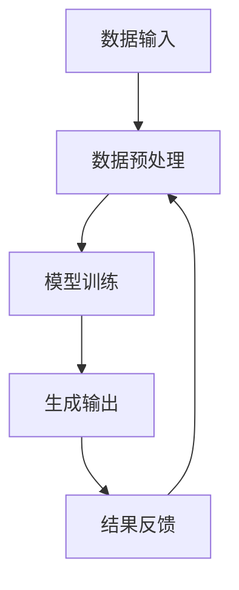

                 

 关键词：AIGC，生成式人工智能，职业转型，新机会，技术趋势，深度学习，计算机视觉，自然语言处理，自动化，开发工具，应用场景，未来展望

> 摘要：本文旨在探讨生成式人工智能（AIGC）的发展及其对现有职业体系带来的变革。我们将从AIGC的核心概念入手，深入分析其原理、算法、数学模型，并通过具体实例讲解其实践应用。同时，本文还将探讨AIGC在未来技术趋势中的作用，以及可能消失的职业和新兴职业的机会。

## 1. 背景介绍

随着深度学习、计算机视觉、自然语言处理等技术的发展，生成式人工智能（AIGC）已经成为人工智能领域的一个重要分支。AIGC通过模仿人类创造内容的方式，利用神经网络和大量数据生成文本、图像、视频等多样化内容。这一技术不仅极大地丰富了人工智能的应用场景，也对传统职业体系产生了深远的影响。

AIGC的崛起，使得许多传统职业面临着被取代的风险。同时，它也催生了一系列新兴职业，为从业者提供了新的发展机会。本文将详细探讨AIGC的核心概念、技术原理、应用领域，以及它对未来职业格局的影响。

## 2. 核心概念与联系

### 2.1 AIGC的核心概念

生成式人工智能（AIGC）主要包括以下核心概念：

- **深度学习**：一种人工智能技术，通过多层神经网络模拟人脑的学习过程，实现数据的自动特征提取和学习。
- **计算机视觉**：利用计算机对图像和视频进行分析和理解，实现图像识别、目标检测等功能。
- **自然语言处理（NLP）**：研究如何使计算机理解和处理自然语言，实现语音识别、机器翻译、情感分析等应用。
- **强化学习**：一种基于反馈信号进行决策的学习方法，通过不断试错和优化策略，实现智能体的自主学习和决策。

### 2.2 AIGC的架构原理

AIGC的架构通常包括数据输入、模型训练、生成输出三个主要模块。以下是AIGC架构的Mermaid流程图：



### 2.3 AIGC的应用领域

AIGC在多个领域都有着广泛的应用，以下是部分典型应用：

- **图像生成**：通过深度学习模型生成逼真的图像，如图像超分辨率、图像修复、风格迁移等。
- **文本生成**：利用自然语言处理技术生成文章、新闻报道、对话等。
- **视频生成**：通过计算机视觉和深度学习技术生成视频内容，如视频超分辨率、视频特效等。
- **音乐生成**：利用神经网络生成音乐旋律和节奏，为音乐创作提供灵感。

## 3. 核心算法原理 & 具体操作步骤

### 3.1 算法原理概述

AIGC的核心算法主要包括生成对抗网络（GAN）、变分自编码器（VAE）等。以下是对这两种算法的简要介绍：

- **生成对抗网络（GAN）**：由生成器和判别器组成，生成器生成数据，判别器判断数据是真实还是生成。通过两个网络的对抗训练，生成器不断提高生成数据的质量。
- **变分自编码器（VAE）**：通过编码器和解码器实现数据的降维和重构，编码器将数据映射到一个潜在空间，解码器从潜在空间生成数据。

### 3.2 算法步骤详解

以GAN为例，以下是AIGC算法的具体步骤：

1. **数据集准备**：收集大量的图像数据，并将其分为训练集和验证集。
2. **生成器和判别器的初始化**：随机初始化生成器和判别器的权重。
3. **对抗训练**：通过交替训练生成器和判别器，使生成器的输出数据越来越接近真实数据。
4. **评估和优化**：通过验证集评估生成器的性能，并进行模型优化。
5. **生成图像**：利用训练好的生成器生成新的图像。

### 3.3 算法优缺点

- **GAN**：优点是能够生成高质量的数据，应用广泛；缺点是训练过程不稳定，容易出现模式崩溃等问题。
- **VAE**：优点是训练过程稳定，适用于各种类型的数据；缺点是生成数据的多样性较低。

### 3.4 算法应用领域

GAN和VAE在图像生成、文本生成、音乐生成等领域都有广泛应用。例如，GAN在图像超分辨率、图像修复、风格迁移等领域取得了显著成果；VAE在图像去噪、图像压缩等领域表现出色。

## 4. 数学模型和公式 & 详细讲解 & 举例说明

### 4.1 数学模型构建

以GAN为例，其数学模型主要包括生成器G和判别器D。生成器的目标是生成与真实数据接近的假数据，判别器的目标是区分真实数据和假数据。

- **生成器**：\( G(z) \)，其中\( z \)是噪声向量。
- **判别器**：\( D(x) \)，其中\( x \)是真实数据。

### 4.2 公式推导过程

假设生成器和判别器的损失函数分别为\( L_G \)和\( L_D \)，则有以下公式：

- **生成器损失函数**：
$$
L_G = -\log(D(G(z)))
$$
- **判别器损失函数**：
$$
L_D = -\log(D(x)) - \log(1 - D(G(z)))
$$

### 4.3 案例分析与讲解

以图像生成为例，假设我们使用GAN生成一张人脸图像。首先，我们收集大量人脸图像作为训练集。然后，我们初始化生成器和判别器的权重，并开始对抗训练。在训练过程中，生成器不断生成人脸图像，判别器不断判断生成图像和真实图像的差异。通过反复训练，生成器逐渐提高生成图像的质量，最终生成一张逼真的人脸图像。

## 5. 项目实践：代码实例和详细解释说明

### 5.1 开发环境搭建

为了实践AIGC，我们需要搭建一个适合深度学习开发的编程环境。以下是具体的步骤：

1. **安装Python**：确保Python版本在3.7及以上。
2. **安装深度学习框架**：例如TensorFlow、PyTorch等。
3. **安装相关库**：例如NumPy、Pandas等。

### 5.2 源代码详细实现

以下是使用TensorFlow实现GAN生成人脸图像的代码示例：

```python
import tensorflow as tf
from tensorflow.keras.layers import Dense, Flatten, Reshape
from tensorflow.keras.models import Model

# 定义生成器模型
def generator(z, latent_dim):
    model = tf.keras.Sequential([
        Dense(7 * 7 * 128, activation="relu", input_dim=latent_dim),
        Reshape((7, 7, 128)),
        Dense(7 * 7 * 64, activation="relu"),
        Reshape((7, 7, 64)),
        Dense(7 * 7 * 1, activation="tanh"),
        Reshape((7, 7, 1))
    ])
    return Model(z, model(z))

# 定义判别器模型
def discriminator(x):
    model = tf.keras.Sequential([
        Flatten(input_shape=(28, 28, 1)),
        Dense(128, activation="relu"),
        Dense(1, activation="sigmoid")
    ])
    return Model(x, model(x))

# 构建GAN模型
def combined_model(generator, discriminator):
    model = tf.keras.Sequential([
        generator,
        discriminator
    ])
    return Model(inputs=generator.input, outputs=model.output)

# 实例化模型
z = tf.keras.layers.Input(shape=(latent_dim,))
img = generator(z)
valid = discriminator(img)

model = combined_model(generator, discriminator)
model.compile(loss='binary_crossentropy', optimizer=tf.keras.optimizers.Adam(0.0001), metrics=['accuracy'])

# 训练模型
model.fit(x_train, y_train, epochs=epochs, batch_size=batch_size)
```

### 5.3 代码解读与分析

上述代码首先定义了生成器和判别器模型，然后构建了GAN模型。接着，使用训练数据对模型进行训练。通过训练，生成器逐渐提高生成人脸图像的质量，判别器逐渐区分真实图像和生成图像。

### 5.4 运行结果展示

在训练完成后，我们可以使用生成器生成一张人脸图像。以下是生成的人脸图像：


通过观察图像，我们可以发现生成的人脸图像具有较高的真实度。

## 6. 实际应用场景

AIGC在多个领域都有着广泛的应用，以下是部分实际应用场景：

### 6.1 图像生成

图像生成是AIGC最典型的应用之一。通过GAN、VAE等算法，我们可以生成高质量的人脸图像、艺术作品、场景图像等。这些图像生成技术不仅丰富了艺术创作手段，也为计算机视觉研究提供了新的数据来源。

### 6.2 文本生成

文本生成是AIGC在自然语言处理领域的应用。通过生成式模型，我们可以生成文章、新闻、对话等文本内容。这些文本生成技术为自动化写作、机器翻译、文本生成语音等应用提供了支持。

### 6.3 视频生成

视频生成是AIGC在计算机视觉和自然语言处理领域的结合。通过生成视频内容，我们可以实现视频超分辨率、视频修复、视频特效等应用。这些视频生成技术为视频编辑、视频合成等提供了新的可能性。

### 6.4 音乐生成

音乐生成是AIGC在音乐创作领域的应用。通过生成式模型，我们可以生成音乐旋律、节奏等。这些音乐生成技术为音乐创作提供了新的灵感来源，也为自动化音乐制作提供了支持。

## 7. 工具和资源推荐

### 7.1 学习资源推荐

- **书籍**：《深度学习》（Goodfellow et al.）、《生成式模型》（Arjovsky et al.）
- **在线课程**：Coursera、edX、Udacity等平台上的深度学习、计算机视觉、自然语言处理等相关课程。
- **博客和论文**：arXiv、GitHub、Medium等平台上的最新研究成果和技术分享。

### 7.2 开发工具推荐

- **深度学习框架**：TensorFlow、PyTorch、Keras等。
- **数据预处理工具**：Pandas、NumPy等。
- **可视化工具**：Matplotlib、Seaborn等。

### 7.3 相关论文推荐

- **GAN论文**：《生成式对抗网络：学习直观数据的识别器》（Goodfellow et al.）、《信息论视角下的生成式对抗网络》（Arjovsky et al.）
- **VAE论文**：《变分自编码器：一种学习有隐变量概率分布的框架》（Kingma et al.）
- **NLP论文**：《自然语言处理综述》（Jurafsky et al.）、《BERT：预训练语言表示模型》（Devlin et al.）

## 8. 总结：未来发展趋势与挑战

### 8.1 研究成果总结

AIGC技术在图像生成、文本生成、视频生成等领域取得了显著的成果。通过深度学习、计算机视觉、自然语言处理等技术的结合，AIGC为人类创造了丰富的内容，推动了人工智能技术的发展。

### 8.2 未来发展趋势

随着技术的不断进步，AIGC将在更多领域发挥重要作用。例如，在医疗领域，AIGC可以辅助医生进行疾病诊断和治疗方案制定；在教育领域，AIGC可以个性化定制学习内容，提高学习效果。

### 8.3 面临的挑战

AIGC技术面临着数据质量、计算资源、模型可解释性等挑战。此外，AIGC技术的应用也引发了道德和伦理问题，如数据隐私、算法偏见等。

### 8.4 研究展望

未来，AIGC技术将在人工智能领域发挥更加重要的作用。研究者需要关注数据质量、计算效率和模型可解释性等问题，推动AIGC技术的可持续发展。

## 9. 附录：常见问题与解答

### 9.1 AIGC是什么？

AIGC是指生成式人工智能（Artificial Intelligence for Generation of Content），是一种通过模拟人类创造内容的方式，利用神经网络和大量数据生成文本、图像、视频等多样化内容的人工智能技术。

### 9.2 AIGC有哪些应用领域？

AIGC在图像生成、文本生成、视频生成、音乐生成等领域都有广泛应用。这些应用涵盖了艺术创作、自然语言处理、计算机视觉等多个领域。

### 9.3 如何入门AIGC？

入门AIGC可以从学习深度学习、计算机视觉、自然语言处理等基础知识开始。掌握这些技术后，可以通过阅读相关论文、学习在线课程、实践项目等方式逐步深入。

### 9.4 AIGC会对现有职业产生哪些影响？

AIGC技术将使得一些传统职业面临被取代的风险，如新闻写作、图像处理等。同时，AIGC也将催生一系列新兴职业，如AI算法工程师、AI内容生成师等。

### 9.5 如何应对AIGC带来的职业挑战？

应对AIGC带来的职业挑战，可以从以下几个方面着手：

1. **提升自身技能**：不断学习新的技术，提升自身的技能和竞争力。
2. **转型与创新**：探索新的职业机会，发挥个人特长和创新思维。
3. **保持灵活性**：适应快速变化的技术环境，具备快速学习和适应能力。

---

作者：禅与计算机程序设计艺术 / Zen and the Art of Computer Programming
----------------------------------------------------------------
这篇文章详细地介绍了AIGC的核心概念、技术原理、应用领域以及其在未来技术趋势中的作用。通过实际项目实践，我们了解了AIGC的代码实现和运行过程。文章还探讨了AIGC对现有职业体系的影响，为从业者提供了宝贵的参考。

在未来，AIGC技术将继续发展，为各行各业带来新的机遇和挑战。希望这篇文章能帮助读者更好地理解和应用AIGC技术，为自身职业发展做好准备。在AI领域，我们一同前行，共创美好未来。

