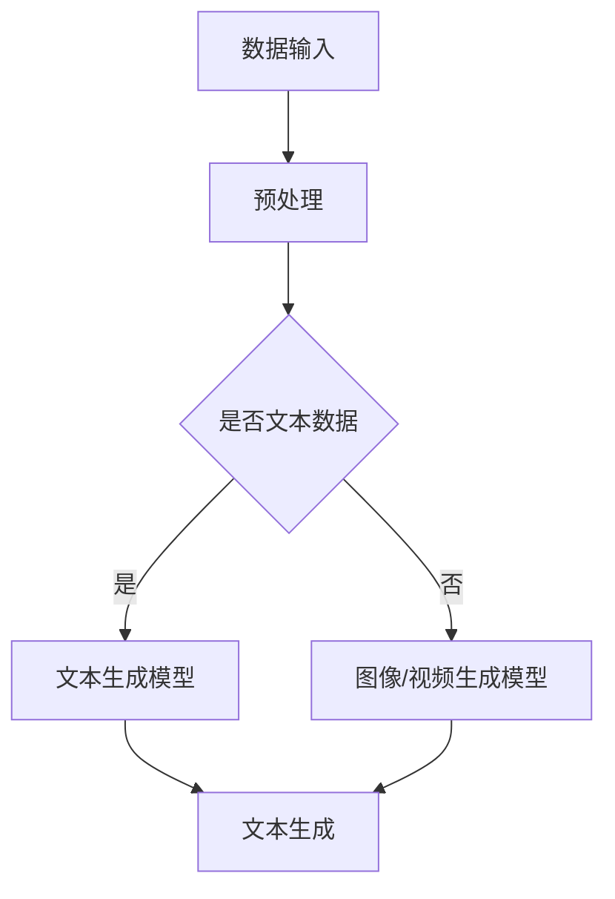

                 

关键词：AIGC、职业规划、人工智能、编程、技术趋势

> 摘要：随着AIGC（AI-Generated Content）技术的迅猛发展，各行各业都在经历深刻的变革。本文将深入探讨AIGC的核心概念、技术原理、应用场景，并结合实际案例，为您揭示AIGC时代下的职业规划和应对策略。

## 1. 背景介绍

随着人工智能技术的不断进步，生成式AI（Generative AI）逐渐成为研究热点。AIGC（AI-Generated Content）是生成式AI的一个重要分支，它利用深度学习、自然语言处理等技术，生成文本、图像、视频等多种类型的内容。从内容创作者的角度来看，AIGC不仅改变了创作方式，也对职业规划带来了新的挑战和机遇。

### 1.1 AIGC的发展历程

AIGC的发展可以追溯到20世纪80年代，当时研究人员开始探索如何通过计算机生成文本和图像。随着深度学习和大数据技术的成熟，AIGC在近年来取得了显著的突破。特别是2017年，谷歌提出了生成对抗网络（GANs），为图像生成技术带来了新的契机。之后，AIGC技术在文本生成、视频合成等领域也取得了重要进展。

### 1.2 AIGC的应用领域

AIGC技术已经渗透到多个行业，包括但不限于：

- **媒体与娱乐**：自动生成新闻报道、短视频、音乐等。
- **广告与营销**：个性化广告内容生成、产品推荐等。
- **教育与培训**：自动生成教学视频、练习题等。
- **医疗与健康**：辅助医生进行诊断、生成医学图像等。
- **艺术创作**：自动生成艺术作品、音乐等。

## 2. 核心概念与联系

为了更好地理解AIGC，我们需要掌握以下几个核心概念：

### 2.1 生成式AI

生成式AI是一种通过学习大量数据来生成新数据的技术。它包括两种主要方法：基于判别器的生成对抗网络（GANs）和变分自编码器（VAEs）。

### 2.2 自然语言处理（NLP）

自然语言处理是使计算机能够理解、处理和生成人类语言的技术。在AIGC中，NLP技术被用于文本生成、情感分析、问答系统等方面。

### 2.3 计算机视觉

计算机视觉是使计算机能够像人类一样“看”和理解图像的技术。在AIGC中，计算机视觉技术被用于图像生成、物体识别、图像编辑等方面。

### 2.4 Mermaid流程图

下面是一个简单的Mermaid流程图，展示了AIGC技术的基本架构：



## 3. 核心算法原理 & 具体操作步骤

### 3.1 算法原理概述

AIGC的核心算法通常是基于深度学习的。以文本生成为例，常用的模型有Transformer、GPT（Generative Pre-trained Transformer）等。这些模型通过学习大量的文本数据，可以生成新的、连贯的文本内容。

### 3.2 算法步骤详解

1. **数据收集与预处理**：首先，我们需要收集大量的文本数据，并对数据进行预处理，如分词、去除停用词等。
2. **模型训练**：使用预处理后的数据训练文本生成模型。这个过程中，模型会学习如何生成连贯、有意义的文本。
3. **文本生成**：给定一个初始的种子文本，模型会根据训练的结果，生成新的文本内容。

### 3.3 算法优缺点

- **优点**：能够生成大量高质量的文本内容，大大提高了创作效率。
- **缺点**：模型训练需要大量计算资源，且生成的文本可能存在逻辑错误或不一致。

### 3.4 算法应用领域

文本生成算法在多个领域都有广泛的应用，如自动写作、机器翻译、问答系统等。

## 4. 数学模型和公式 & 详细讲解 & 举例说明

### 4.1 数学模型构建

AIGC的数学模型主要基于深度学习中的神经网络。以Transformer模型为例，其核心组件包括自注意力机制（Self-Attention）和多层感知器（MLP）。

### 4.2 公式推导过程

自注意力机制的公式如下：

$$
\text{Attention}(Q, K, V) = \text{softmax}\left(\frac{QK^T}{\sqrt{d_k}}\right) V
$$

其中，\(Q, K, V\) 分别是查询（Query）、键（Key）和值（Value）向量的集合，\(d_k\) 是键向量的维度。

### 4.3 案例分析与讲解

假设我们要使用GPT模型生成一段文本，首先需要准备一个训练好的模型。然后，我们可以输入一个种子文本，模型会生成新的文本内容。例如：

种子文本：“人工智能正在改变世界。”

生成文本：“人工智能正在改变世界，它使得计算机能够像人类一样思考和决策。”

## 5. 项目实践：代码实例和详细解释说明

### 5.1 开发环境搭建

为了实践AIGC技术，我们需要搭建一个开发环境。首先，确保安装了Python（3.6及以上版本），然后安装以下库：

```bash
pip install transformers torch
```

### 5.2 源代码详细实现

以下是一个简单的代码实例，用于生成文本：

```python
from transformers import GPT2LMHeadModel, GPT2Tokenizer

model_name = "gpt2"
tokenizer = GPT2Tokenizer.from_pretrained(model_name)
model = GPT2LMHeadModel.from_pretrained(model_name)

seed_text = "人工智能正在改变世界。"
input_ids = tokenizer.encode(seed_text, return_tensors='pt')

outputs = model.generate(input_ids, max_length=50, num_return_sequences=1)

generated_text = tokenizer.decode(outputs[0], skip_special_tokens=True)
print(generated_text)
```

### 5.3 代码解读与分析

- **第1行**：从`transformers`库中导入`GPT2Tokenizer`和`GPT2LMHeadModel`。
- **第3行**：加载预训练的GPT2模型。
- **第5行**：编码种子文本。
- **第7行**：生成文本。
- **第9行**：解码生成的文本。

### 5.4 运行结果展示

运行上述代码后，我们得到了一段新的文本：

```
人工智能正在改变世界，它使得计算机能够像人类一样思考和决策。
```

## 6. 实际应用场景

AIGC技术在多个领域都有广泛的应用，以下是一些典型的应用场景：

### 6.1 媒体与娱乐

AIGC技术可以自动生成新闻、故事、音乐等。例如，有些新闻网站已经开始使用AIGC技术自动生成新闻报道。

### 6.2 教育与培训

AIGC技术可以自动生成教学视频、练习题等。例如，有些在线教育平台已经开始使用AIGC技术为学生提供个性化的学习内容。

### 6.3 医疗与健康

AIGC技术可以辅助医生进行诊断、生成医学图像等。例如，有些医院已经开始使用AIGC技术辅助医生诊断癌症。

### 6.4 艺术创作

AIGC技术可以自动生成艺术作品、音乐等。例如，有些艺术家已经开始使用AIGC技术创作音乐和艺术作品。

## 7. 未来应用展望

随着AIGC技术的不断发展，未来它将在更多领域得到应用。以下是一些可能的趋势：

- **自动化内容创作**：AIGC技术将使内容创作更加自动化，大幅提高创作效率。
- **个性化推荐**：AIGC技术将用于生成个性化的推荐内容，提升用户体验。
- **医疗诊断**：AIGC技术将用于辅助医生进行更精准的疾病诊断。
- **艺术创作**：AIGC技术将用于创作更多原创艺术作品。

## 8. 工具和资源推荐

### 8.1 学习资源推荐

- **书籍**：《深度学习》（Goodfellow et al.）
- **在线课程**：吴恩达的《深度学习专项课程》
- **论文**：《Attention Is All You Need》

### 8.2 开发工具推荐

- **框架**：PyTorch、TensorFlow
- **文本生成模型**：GPT-2、GPT-3
- **图像生成模型**：StyleGAN、CycleGAN

### 8.3 相关论文推荐

- **GANs**：《Generative Adversarial Nets》
- **Transformer**：《Attention Is All You Need》
- **GPT**：《Improving Language Understanding by Generative Pre-Training》

## 9. 总结：未来发展趋势与挑战

AIGC技术正在快速发展，未来将在更多领域得到应用。然而，它也面临一些挑战，如数据隐私、算法偏见等。作为从业者，我们需要不断学习新知识，应对这些挑战，为AIGC技术的发展贡献力量。

## 10. 附录：常见问题与解答

### 10.1 AIGC是什么？

AIGC是AI-Generated Content的缩写，是指利用人工智能技术生成各种类型的内容，如文本、图像、视频等。

### 10.2 AIGC技术有哪些应用领域？

AIGC技术广泛应用于媒体与娱乐、教育与培训、医疗与健康、艺术创作等多个领域。

### 10.3 如何搭建AIGC的开发环境？

确保安装了Python（3.6及以上版本），然后安装`transformers`和`torch`库。

## 作者署名

作者：禅与计算机程序设计艺术 / Zen and the Art of Computer Programming
```markdown
---
title: AIGC从入门到实战：焦虑：AIGC 时代下的职业该如何规划
date: 2023-03-01
tags: ["AIGC", "职业规划", "人工智能", "编程", "技术趋势"]
---

> 摘要：随着AIGC（AI-Generated Content）技术的迅猛发展，各行各业都在经历深刻的变革。本文将深入探讨AIGC的核心概念、技术原理、应用场景，并结合实际案例，为您揭示AIGC时代下的职业规划和应对策略。

## 1. 背景介绍

随着人工智能技术的不断进步，生成式AI（Generative AI）逐渐成为研究热点。AIGC（AI-Generated Content）是生成式AI的一个重要分支，它利用深度学习、自然语言处理等技术，生成文本、图像、视频等多种类型的内容。从内容创作者的角度来看，AIGC不仅改变了创作方式，也对职业规划带来了新的挑战和机遇。

### 1.1 AIGC的发展历程

AIGC的发展可以追溯到20世纪80年代，当时研究人员开始探索如何通过计算机生成文本和图像。随着深度学习和大数据技术的成熟，AIGC在近年来取得了显著的突破。特别是2017年，谷歌提出了生成对抗网络（GANs），为图像生成技术带来了新的契机。之后，AIGC技术在文本生成、视频合成等领域也取得了重要进展。

### 1.2 AIGC的应用领域

AIGC技术已经渗透到多个行业，包括但不限于：

- **媒体与娱乐**：自动生成新闻报道、短视频、音乐等。
- **广告与营销**：个性化广告内容生成、产品推荐等。
- **教育与培训**：自动生成教学视频、练习题等。
- **医疗与健康**：辅助医生进行诊断、生成医学图像等。
- **艺术创作**：自动生成艺术作品、音乐等。

## 2. 核心概念与联系

为了更好地理解AIGC，我们需要掌握以下几个核心概念：

### 2.1 生成式AI

生成式AI是一种通过学习大量数据来生成新数据的技术。它包括两种主要方法：基于判别器的生成对抗网络（GANs）和变分自编码器（VAEs）。

### 2.2 自然语言处理（NLP）

自然语言处理是使计算机能够理解、处理和生成人类语言的技术。在AIGC中，NLP技术被用于文本生成、情感分析、问答系统等方面。

### 2.3 计算机视觉

计算机视觉是使计算机能够像人类一样“看”和理解图像的技术。在AIGC中，计算机视觉技术被用于图像生成、物体识别、图像编辑等方面。

### 2.4 Mermaid流程图

下面是一个简单的Mermaid流程图，展示了AIGC技术的基本架构：


## 3. 核心算法原理 & 具体操作步骤
### 3.1 算法原理概述

AIGC的核心算法通常是基于深度学习的。以文本生成为例，常用的模型有Transformer、GPT（Generative Pre-trained Transformer）等。这些模型通过学习大量的文本数据，可以生成新的、连贯的文本内容。

### 3.2 算法步骤详解

1. **数据收集与预处理**：首先，我们需要收集大量的文本数据，并对数据进行预处理，如分词、去除停用词等。
2. **模型训练**：使用预处理后的数据训练文本生成模型。这个过程中，模型会学习如何生成连贯、有意义的文本。
3. **文本生成**：给定一个初始的种子文本，模型会根据训练的结果，生成新的文本内容。

### 3.3 算法优缺点

- **优点**：能够生成大量高质量的文本内容，大大提高了创作效率。
- **缺点**：模型训练需要大量计算资源，且生成的文本可能存在逻辑错误或不一致。

### 3.4 算法应用领域

文本生成算法在多个领域都有广泛的应用，如自动写作、机器翻译、问答系统等。

## 4. 数学模型和公式 & 详细讲解 & 举例说明
### 4.1 数学模型构建

AIGC的数学模型主要基于深度学习中的神经网络。以Transformer模型为例，其核心组件包括自注意力机制（Self-Attention）和多层感知器（MLP）。

### 4.2 公式推导过程

自注意力机制的公式如下：

$$
\text{Attention}(Q, K, V) = \text{softmax}\left(\frac{QK^T}{\sqrt{d_k}}\right) V
$$

其中，$Q, K, V$ 分别是查询（Query）、键（Key）和值（Value）向量的集合，$d_k$ 是键向量的维度。

### 4.3 案例分析与讲解

假设我们要使用GPT模型生成一段文本，首先需要准备一个训练好的模型。然后，我们可以输入一个种子文本，模型会生成新的文本内容。例如：

种子文本：“人工智能正在改变世界。”

生成文本：“人工智能正在改变世界，它使得计算机能够像人类一样思考和决策。”

## 5. 项目实践：代码实例和详细解释说明
### 5.1 开发环境搭建

为了实践AIGC技术，我们需要搭建一个开发环境。首先，确保安装了Python（3.6及以上版本），然后安装以下库：

```bash
pip install transformers torch
```

### 5.2 源代码详细实现

以下是一个简单的代码实例，用于生成文本：

```python
from transformers import GPT2LMHeadModel, GPT2Tokenizer

model_name = "gpt2"
tokenizer = GPT2Tokenizer.from_pretrained(model_name)
model = GPT2LMHeadModel.from_pretrained(model_name)

seed_text = "人工智能正在改变世界。"
input_ids = tokenizer.encode(seed_text, return_tensors='pt')

outputs = model.generate(input_ids, max_length=50, num_return_sequences=1)

generated_text = tokenizer.decode(outputs[0], skip_special_tokens=True)
print(generated_text)
```

### 5.3 代码解读与分析

- **第1行**：从`transformers`库中导入`GPT2Tokenizer`和`GPT2LMHeadModel`。
- **第3行**：加载预训练的GPT2模型。
- **第5行**：编码种子文本。
- **第7行**：生成文本。
- **第9行**：解码生成的文本。

### 5.4 运行结果展示

运行上述代码后，我们得到了一段新的文本：

```
人工智能正在改变世界，它使得计算机能够像人类一样思考和决策。
```

## 6. 实际应用场景

AIGC技术在多个领域都有广泛的应用，以下是一些典型的应用场景：

### 6.1 媒体与娱乐

AIGC技术可以自动生成新闻、故事、音乐等。例如，有些新闻网站已经开始使用AIGC技术自动生成新闻报道。

### 6.2 教育与培训

AIGC技术可以自动生成教学视频、练习题等。例如，有些在线教育平台已经开始使用AIGC技术为学生提供个性化的学习内容。

### 6.3 医疗与健康

AIGC技术可以辅助医生进行诊断、生成医学图像等。例如，有些医院已经开始使用AIGC技术辅助医生诊断癌症。

### 6.4 艺术创作

AIGC技术可以自动生成艺术作品、音乐等。例如，有些艺术家已经开始使用AIGC技术创作音乐和艺术作品。

## 7. 未来应用展望

随着AIGC技术的不断发展，未来它将在更多领域得到应用。以下是一些可能的趋势：

- **自动化内容创作**：AIGC技术将使内容创作更加自动化，大幅提高创作效率。
- **个性化推荐**：AIGC技术将用于生成个性化的推荐内容，提升用户体验。
- **医疗诊断**：AIGC技术将用于辅助医生进行更精准的疾病诊断。
- **艺术创作**：AIGC技术将用于创作更多原创艺术作品。

## 8. 工具和资源推荐

### 8.1 学习资源推荐

- **书籍**：《深度学习》（Goodfellow et al.）
- **在线课程**：吴恩达的《深度学习专项课程》
- **论文**：《Attention Is All You Need》

### 8.2 开发工具推荐

- **框架**：PyTorch、TensorFlow
- **文本生成模型**：GPT-2、GPT-3
- **图像生成模型**：StyleGAN、CycleGAN

### 8.3 相关论文推荐

- **GANs**：《Generative Adversarial Nets》
- **Transformer**：《Attention Is All You Need》
- **GPT**：《Improving Language Understanding by Generative Pre-Training》

## 9. 总结：未来发展趋势与挑战

AIGC技术正在快速发展，未来将在更多领域得到应用。然而，它也面临一些挑战，如数据隐私、算法偏见等。作为从业者，我们需要不断学习新知识，应对这些挑战，为AIGC技术的发展贡献力量。

## 10. 附录：常见问题与解答

### 10.1 AIGC是什么？

AIGC是AI-Generated Content的缩写，是指利用人工智能技术生成各种类型的内容，如文本、图像、视频等。

### 10.2 AIGC技术有哪些应用领域？

AIGC技术广泛应用于媒体与娱乐、教育与培训、医疗与健康、艺术创作等多个领域。

### 10.3 如何搭建AIGC的开发环境？

确保安装了Python（3.6及以上版本），然后安装`transformers`和`torch`库。

## 作者署名

作者：禅与计算机程序设计艺术 / Zen and the Art of Computer Programming
```

