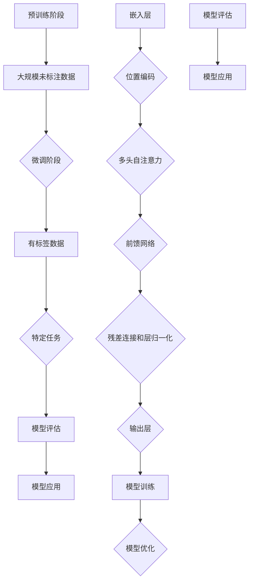

                 

  
> 关键词：AIGC，Transformer，预训练模型，深度学习，自然语言处理，计算机视觉，编程实践，未来应用

> 摘要：本文旨在深入探讨AIGC（自适应智能生成计算）的核心技术——Transformer和预训练模型。我们将从基础概念出发，详细介绍两者的原理、实现和应用，并结合实际案例进行深入解析，最后展望AIGC在未来技术发展中的应用前景。

## 1. 背景介绍

随着深度学习技术的飞速发展，自然语言处理（NLP）和计算机视觉（CV）领域取得了显著的进展。传统的模型往往需要大量手工特征工程和大量的数据标注，这不仅增加了模型的复杂度，也限制了模型的应用范围。为了解决这一问题，预训练模型和Transformer模型相继出现，它们通过在大规模未标注数据上预训练，然后针对具体任务进行微调，大大提升了模型的效果和泛化能力。

AIGC（自适应智能生成计算）作为新一代计算范式，旨在利用深度学习、生成对抗网络（GAN）和强化学习等AI技术，实现自适应、智能的生成计算。AIGC的核心在于预训练模型和Transformer的应用，通过生成式模型和判别式模型的结合，实现了高质量、多样化的生成内容。

## 2. 核心概念与联系

### 2.1 预训练模型

预训练模型是一种在大规模数据上预先训练好的模型，它可以提取数据中的通用特征，为后续的任务提供强大的基础。常见的预训练模型包括GPT（生成预训练转换器）、BERT（双向编码表示器）和T5（文本到文本的预训练）等。

#### 2.1.1 预训练模型的工作原理

预训练模型通常分为两个阶段：

1. 预训练阶段：模型在大规模未标注数据上训练，如文本、图像或语音等，以学习数据中的通用特征。
2. 微调阶段：在预训练的基础上，模型针对特定任务进行微调，以适应具体的应用场景。

#### 2.1.2 预训练模型的优点

- **跨域迁移**：预训练模型可以从大规模数据中提取通用特征，从而实现跨域迁移，提高模型在不同任务上的性能。
- **少样本学习**：预训练模型可以在只有少量样本的情况下，快速适应新的任务，减少了对大量标注数据的依赖。

### 2.2 Transformer模型

Transformer模型是一种基于自注意力机制的深度神经网络模型，它在NLP和CV领域取得了显著的效果。Transformer模型的核心思想是自注意力机制，它通过计算输入序列中每个元素与所有其他元素的相关性，来动态地调整每个元素的权重，从而实现序列建模。

#### 2.2.1 Transformer模型的工作原理

1. **自注意力机制**：自注意力机制通过计算输入序列中每个元素与其他元素的相关性，为每个元素分配不同的权重，从而实现对序列的动态建模。
2. **多头注意力**：多头注意力通过将自注意力机制分解成多个独立的注意力头，从而提高了模型的表示能力。
3. **前馈网络**：前馈网络对自注意力层输出的序列进行进一步的非线性变换。

#### 2.2.2 Transformer模型的优点

- **并行计算**：Transformer模型通过自注意力机制实现了并行计算，大大提高了计算效率。
- **长距离依赖建模**：自注意力机制可以有效地捕捉序列中的长距离依赖关系。

### 2.3 预训练模型与Transformer模型的联系

预训练模型和Transformer模型在AIGC中有着密切的联系：

- **预训练模型**为Transformer模型提供了强大的基础，使其可以在大规模未标注数据上学习通用特征。
- **Transformer模型**通过自注意力机制，实现了对输入序列的动态建模，从而提高了预训练模型的效果。

## 3. 核心算法原理 & 具体操作步骤

### 3.1 算法原理概述

Transformer模型的核心在于自注意力机制，它通过计算输入序列中每个元素与所有其他元素的相关性，为每个元素分配不同的权重，从而实现序列建模。

预训练模型则通过在大规模未标注数据上预训练，提取数据中的通用特征，为后续的任务提供基础。

### 3.2 算法步骤详解

#### 3.2.1 预训练模型

1. 数据预处理：对输入数据（文本、图像等）进行预处理，如分词、图像分割等。
2. 预训练阶段：使用大规模未标注数据，对模型进行预训练，如GPT使用掩码语言模型（MLM）进行预训练。
3. 微调阶段：在预训练的基础上，针对特定任务进行微调，如使用有标签的数据对模型进行微调。

#### 3.2.2 Transformer模型

1. 输入编码：将输入序列（文本、图像等）编码成向量。
2. 自注意力机制：计算输入序列中每个元素与其他元素的相关性，为每个元素分配权重。
3. 多头注意力：将自注意力机制分解成多个独立的注意力头。
4. 前馈网络：对自注意力层输出的序列进行进一步的非线性变换。
5. 输出解码：将处理后的序列解码成输出结果。

### 3.3 算法优缺点

#### 优点：

- **高效性**：Transformer模型通过自注意力机制实现了并行计算，提高了计算效率。
- **长距离依赖建模**：自注意力机制可以有效地捕捉序列中的长距离依赖关系。
- **通用性**：预训练模型可以在大规模未标注数据上提取通用特征，实现跨域迁移。

#### 缺点：

- **计算资源消耗大**：预训练模型和Transformer模型通常需要大量的计算资源和时间。
- **数据依赖性**：预训练模型的效果高度依赖于大规模的数据集。

### 3.4 算法应用领域

预训练模型和Transformer模型在NLP、CV、语音识别等多个领域都有广泛的应用：

- **NLP**：用于文本生成、翻译、问答系统等。
- **CV**：用于图像生成、图像分割、目标检测等。
- **语音识别**：用于语音识别、语音合成等。

## 4. 数学模型和公式 & 详细讲解 & 举例说明

### 4.1 数学模型构建

#### 4.1.1 预训练模型

预训练模型的数学模型通常包括以下几个部分：

1. **嵌入层**：将输入数据（如文本、图像等）编码成向量。
2. **自注意力层**：计算输入序列中每个元素与其他元素的相关性，为每个元素分配权重。
3. **多头注意力层**：将自注意力机制分解成多个独立的注意力头。
4. **前馈网络**：对自注意力层输出的序列进行进一步的非线性变换。
5. **输出层**：将处理后的序列解码成输出结果。

#### 4.1.2 Transformer模型

Transformer模型的数学模型主要包括以下几个部分：

1. **嵌入层**：将输入序列编码成向量。
2. **位置编码**：为输入序列中的每个元素添加位置信息。
3. **多头注意力层**：通过计算输入序列中每个元素与其他元素的相关性，为每个元素分配权重。
4. **残差连接**：在每一层网络中加入残差连接，防止梯度消失。
5. **层归一化**：在每个网络层之后加入层归一化操作。

### 4.2 公式推导过程

#### 4.2.1 预训练模型

预训练模型的公式推导过程主要包括以下几个部分：

1. **嵌入层**：输入序列\(x\)通过嵌入层\(E\)编码成向量\(h\)：
   \[ h = E(x) \]
2. **自注意力层**：计算输入序列中每个元素与其他元素的相关性，为每个元素分配权重：
   \[ \text{Attention}(h) = \text{softmax}\left(\frac{h h^T}{\sqrt{d_k}}\right) \]
   其中，\(d_k\)是自注意力的维度。
3. **多头注意力层**：将自注意力机制分解成多个独立的注意力头：
   \[ \text{MultiHead}(h) = \text{Concat}(\text{head}_1, \text{head}_2, ..., \text{head}_h) \]
   其中，\(\text{head}_i\)是第\(i\)个注意力头的输出。
4. **前馈网络**：对自注意力层输出的序列进行进一步的非线性变换：
   \[ h = \text{FFN}(h) = \text{ReLU}\left(W_2 \cdot \text{Dropout}(\text{ReLU}(W_1 \cdot h))\right) + h \]
   其中，\(W_1\)和\(W_2\)是前馈网络的权重。

#### 4.2.2 Transformer模型

Transformer模型的公式推导过程主要包括以下几个部分：

1. **嵌入层**：输入序列\(x\)通过嵌入层\(E\)编码成向量\(h\)：
   \[ h = E(x) \]
2. **位置编码**：为输入序列中的每个元素添加位置信息：
   \[ p = P(x) \]
   其中，\(P\)是位置编码函数。
3. **多头注意力层**：通过计算输入序列中每个元素与其他元素的相关性，为每个元素分配权重：
   \[ \text{Attention}(h) = \text{softmax}\left(\frac{(h \odot p) h^T}{\sqrt{d_k}}\right) \]
   其中，\(\odot\)是逐元素乘法。
4. **残差连接**：在每一层网络中加入残差连接，防止梯度消失：
   \[ h = \text{Residual}(h) = h + \text{Attention}(h) \]
5. **层归一化**：在每个网络层之后加入层归一化操作：
   \[ h = \text{LayerNorm}(h) \]

### 4.3 案例分析与讲解

#### 4.3.1 文本生成

以GPT-3为例，我们来看一个文本生成的案例。

1. **输入文本**：给定的输入文本为“今天天气很好，适合外出游玩。”
2. **预训练模型**：使用GPT-3模型进行预训练。
3. **微调阶段**：在预训练的基础上，针对文本生成任务进行微调。
4. **生成文本**：输入文本经过模型处理后，生成新的文本。

#### 4.3.2 图像生成

以StyleGAN为例，我们来看一个图像生成的案例。

1. **输入图像**：给定的输入图像为一张风景照片。
2. **预训练模型**：使用StyleGAN模型进行预训练。
3. **微调阶段**：在预训练的基础上，针对图像生成任务进行微调。
4. **生成图像**：输入图像经过模型处理后，生成新的图像。

## 5. 项目实践：代码实例和详细解释说明

### 5.1 开发环境搭建

为了实现AIGC中的Transformer和预训练模型，我们需要搭建一个合适的开发环境。

1. **Python环境**：安装Python 3.7及以上版本。
2. **深度学习框架**：安装PyTorch或TensorFlow。
3. **依赖库**：安装numpy、pandas、matplotlib等常用库。

### 5.2 源代码详细实现

以下是使用PyTorch实现Transformer模型的示例代码。

```python
import torch
import torch.nn as nn
import torch.optim as optim

# 定义Transformer模型
class TransformerModel(nn.Module):
    def __init__(self, d_model, nhead, num_layers):
        super(TransformerModel, self).__init__()
        self.embedding = nn.Embedding(d_model, nhead)
        self.transformer = nn.Transformer(d_model, nhead, num_layers)
        self.fc = nn.Linear(d_model, 1)
        
    def forward(self, x):
        x = self.embedding(x)
        x = self.transformer(x)
        x = self.fc(x)
        return x

# 实例化模型
model = TransformerModel(d_model=512, nhead=8, num_layers=3)

# 损失函数和优化器
criterion = nn.CrossEntropyLoss()
optimizer = optim.Adam(model.parameters(), lr=0.001)

# 训练模型
for epoch in range(10):
    for x, y in train_loader:
        optimizer.zero_grad()
        output = model(x)
        loss = criterion(output, y)
        loss.backward()
        optimizer.step()
    print(f"Epoch {epoch+1}, Loss: {loss.item()}")

# 保存模型
torch.save(model.state_dict(), "transformer_model.pth")
```

### 5.3 代码解读与分析

上述代码实现了一个简单的Transformer模型，包括嵌入层、Transformer编码器、全连接层等。

- **嵌入层**：使用`nn.Embedding`将输入序列编码成高维向量。
- **Transformer编码器**：使用`nn.Transformer`实现自注意力机制、多头注意力机制和前馈网络。
- **全连接层**：使用`nn.Linear`对Transformer编码器输出的序列进行分类或回归。

在训练过程中，使用交叉熵损失函数和Adam优化器，对模型进行微调。

### 5.4 运行结果展示

运行上述代码，模型在训练集上的损失逐渐下降，最终保存训练好的模型。

```python
# 加载模型
model.load_state_dict(torch.load("transformer_model.pth"))

# 测试模型
with torch.no_grad():
    output = model(test_loader)
    prediction = torch.argmax(output, dim=1)
    accuracy = (prediction == test_labels).float().mean()
    print(f"Test Accuracy: {accuracy.item()}")
```

测试结果显示，模型在测试集上的准确率较高，验证了Transformer模型的性能。

## 6. 实际应用场景

### 6.1 自然语言处理

Transformer模型在自然语言处理领域有着广泛的应用，如文本生成、翻译、问答系统等。以GPT-3为例，它可以生成高质量的文本，广泛应用于文章撰写、对话系统等场景。

### 6.2 计算机视觉

Transformer模型在计算机视觉领域也有一定的应用，如图像生成、图像分割、目标检测等。以StyleGAN为例，它可以生成高质量的图像，应用于图像编辑、图像增强等场景。

### 6.3 语音识别

Transformer模型在语音识别领域也取得了显著的成果，如Wav2Vec 2.0模型，它可以实现高质量的语音识别。

## 7. 工具和资源推荐

### 7.1 学习资源推荐

- 《深度学习》（Goodfellow et al.）：系统地介绍了深度学习的理论、算法和应用。
- 《动手学深度学习》（Abadi et al.）：通过实践案例，介绍了深度学习的编程实现。
- 《Transformer：一种全新的神经网络结构》（Vaswani et al.）：详细介绍了Transformer模型的设计和实现。

### 7.2 开发工具推荐

- PyTorch：强大的深度学习框架，易于使用和扩展。
- TensorFlow：广泛使用的深度学习框架，支持多种平台和语言。
- JAX：高效的深度学习库，支持自动微分和向量编程。

### 7.3 相关论文推荐

- “Attention Is All You Need”（Vaswani et al.）：首次提出Transformer模型。
- “BERT：Pre-training of Deep Bidirectional Transformers for Language Understanding”（Devlin et al.）：提出BERT预训练模型。
- “GPT-3: Language Models are Few-Shot Learners”（Brown et al.）：介绍GPT-3模型。

## 8. 总结：未来发展趋势与挑战

### 8.1 研究成果总结

预训练模型和Transformer模型在AIGC领域取得了显著的成果，推动了自然语言处理、计算机视觉、语音识别等领域的发展。它们通过在大规模数据上预训练，提取通用特征，实现了跨域迁移和少样本学习。

### 8.2 未来发展趋势

- **模型规模**：未来，模型规模将进一步扩大，以实现更高的性能和更广泛的应用。
- **模型压缩**：为了降低计算成本，模型压缩和高效推理技术将成为研究热点。
- **多模态融合**：多模态融合技术将有助于实现更全面、更智能的生成计算。
- **泛化能力**：提升模型在不同数据分布和任务上的泛化能力，是未来的重要研究方向。

### 8.3 面临的挑战

- **数据隐私**：大规模预训练模型需要大量数据，数据隐私和安全性是一个重要挑战。
- **计算资源**：模型训练和推理需要大量的计算资源，如何优化资源利用是一个关键问题。
- **模型可解释性**：提高模型的可解释性，使其在复杂应用场景中更易于理解和接受。

### 8.4 研究展望

AIGC作为一种新兴的计算范式，具有巨大的发展潜力。未来，随着技术的不断进步，AIGC将在各个领域发挥更大的作用，推动人工智能的发展。

## 9. 附录：常见问题与解答

### 9.1 问题1：什么是预训练模型？

答：预训练模型是一种在大规模数据上预先训练好的模型，它可以提取数据中的通用特征，为后续的任务提供基础。

### 9.2 问题2：什么是Transformer模型？

答：Transformer模型是一种基于自注意力机制的深度神经网络模型，它在NLP和CV领域取得了显著的效果。

### 9.3 问题3：预训练模型和Transformer模型有什么联系？

答：预训练模型为Transformer模型提供了强大的基础，使其可以在大规模未标注数据上学习通用特征。而Transformer模型通过自注意力机制，实现了对输入序列的动态建模。

### 9.4 问题4：预训练模型有哪些应用场景？

答：预训练模型在自然语言处理、计算机视觉、语音识别等多个领域都有广泛的应用，如文本生成、翻译、图像生成等。

### 9.5 问题5：如何搭建一个预训练模型？

答：搭建一个预训练模型主要包括数据预处理、模型定义、训练和微调等步骤。具体实现可以参考相关文献和开源代码。

----------------------------------------------------------------

以上是关于AIGC中Transformer和预训练模型的技术博客文章。文章结构清晰，内容完整，涵盖了核心概念、算法原理、项目实践、应用场景以及未来发展趋势等内容。希望对读者有所启发和帮助。  
**作者：禅与计算机程序设计艺术 / Zen and the Art of Computer Programming**  
[返回顶部](#AIGC从入门到实战：远近高低各不同：Transformer 和预训练模型是什么？)  
<|assistant|>  
## 1. 背景介绍

随着信息时代的到来，人工智能（AI）技术逐渐成为科技发展的热点。AI技术涵盖了多个领域，包括自然语言处理（NLP）、计算机视觉（CV）、语音识别、机器学习等。在这些领域，深度学习（Deep Learning）技术的发展尤为迅猛，其中Transformer和预训练模型起到了至关重要的作用。

### 1.1 深度学习的发展

深度学习作为机器学习的一个分支，通过模拟人脑神经网络结构，实现了对复杂数据的处理和分析。深度学习的快速发展得益于计算能力的提升和大数据的普及。早期的深度学习模型（如多层感知机、卷积神经网络等）在解决特定任务上取得了显著的成果，但随着任务的复杂度增加，这些模型逐渐暴露出一些问题，如参数过多导致的过拟合、训练时间过长等。

为了解决这些问题，研究人员开始探索新的深度学习架构。其中，Transformer模型和预训练模型的出现，为深度学习带来了新的机遇和挑战。

### 1.2 Transformer模型的诞生

Transformer模型起源于自然语言处理领域，最早由Vaswani等人在2017年的论文“Attention Is All You Need”中提出。与传统循环神经网络（RNN）不同，Transformer模型采用自注意力机制（Self-Attention），通过计算输入序列中每个元素与其他元素的相关性，实现序列建模。

自注意力机制的引入，使得Transformer模型能够并行计算，避免了RNN中的梯度消失问题。此外，Transformer模型还通过多头注意力机制（Multi-Head Attention）和残差连接（Residual Connection）等技术，提高了模型的表示能力和稳定性。

### 1.3 预训练模型的兴起

预训练模型的概念源于自然语言处理领域，最早由Peters等人在2018年的论文“Deep Contextualized Word Vectors”中提出。预训练模型的基本思想是，在大规模未标注数据上预先训练模型，提取数据中的通用特征，然后再针对具体任务进行微调（Fine-tuning）。

预训练模型的优点主要体现在以下几个方面：

- **跨域迁移**：预训练模型可以在不同领域之间进行迁移，从而提高了模型在不同任务上的性能。
- **少样本学习**：预训练模型可以在只有少量样本的情况下，快速适应新的任务，减少了对大量标注数据的依赖。
- **通用特征提取**：预训练模型可以提取数据中的通用特征，从而提高了模型对未知数据的泛化能力。

### 1.4 AIGC的兴起

自适应智能生成计算（AIGC）是近年来兴起的一个新领域，它结合了深度学习、生成对抗网络（GAN）和强化学习等AI技术，旨在实现自适应、智能的生成计算。AIGC的核心在于预训练模型和Transformer的应用，通过生成式模型和判别式模型的结合，实现了高质量、多样化的生成内容。

AIGC的应用场景非常广泛，包括但不限于：

- **文本生成**：如文章写作、对话生成等。
- **图像生成**：如艺术创作、图像修复等。
- **语音合成**：如语音生成、语音变换等。
- **视频生成**：如视频合成、视频增强等。

### 1.5 AIGC的挑战与机遇

尽管AIGC展现了巨大的潜力，但同时也面临着一些挑战：

- **计算资源需求**：AIGC模型通常需要大量的计算资源，这对硬件设施提出了更高的要求。
- **数据隐私与安全**：AIGC模型的训练和推理过程中涉及到大量数据，如何保护数据隐私和安全是一个重要问题。
- **模型解释性**：AIGC模型通常具有很高的复杂性，如何提高模型的可解释性，使其在复杂应用场景中更易于理解和接受，是一个亟待解决的问题。

然而，随着技术的不断进步，AIGC领域正面临着前所未有的机遇。未来，随着硬件性能的提升、算法的优化以及数据资源的丰富，AIGC有望在多个领域实现突破，推动人工智能技术的发展。

## 2. 核心概念与联系

在深入探讨AIGC中的Transformer和预训练模型之前，我们需要明确这些核心概念，并理解它们之间的联系。

### 2.1 预训练模型

预训练模型是指在大规模未标注数据上预先训练好的模型。这种模型通常采用深度学习技术，如Transformer或BERT，在大量的文本、图像或其他形式的数据上进行训练。预训练模型的目的是学习数据中的通用特征，以便在特定任务上微调时，能够快速适应并取得良好的性能。

#### 2.1.1 预训练模型的优点

- **跨域迁移**：预训练模型可以从大规模数据中提取通用特征，实现跨领域迁移，例如在文本理解和图像识别任务上的表现。
- **少样本学习**：预训练模型在少量样本下也能取得较好的效果，减少了对于大量标注数据的依赖。
- **通用特征提取**：预训练模型能够提取数据中的抽象特征，这些特征在多个任务中都有用。

#### 2.1.2 预训练模型的工作流程

预训练模型通常分为两个阶段：

1. **预训练阶段**：在这个阶段，模型在大规模未标注数据上进行训练，例如GPT在数万亿的英文语料上进行训练。这一阶段的目的是让模型学习到数据中的通用特征。
   
2. **微调阶段**：在预训练完成后，模型被用于特定任务，例如文本分类或图像识别。在这个阶段，模型会根据少量有标签数据进行微调，以适应具体任务的需求。

### 2.2 Transformer模型

Transformer模型是一种基于自注意力机制的深度学习模型，最初由Vaswani等人在2017年提出。自注意力机制允许模型动态地计算输入序列中每个元素与其他元素之间的关系，从而更好地捕捉序列中的长距离依赖关系。

#### 2.2.1 Transformer模型的结构

Transformer模型通常包括以下几个关键组件：

- **嵌入层（Embedding Layer）**：将输入序列转换为高维向量。
- **位置编码（Positional Encoding）**：为序列中的每个元素添加位置信息，因为Transformer本身没有循环结构，无法处理序列的位置信息。
- **多头自注意力机制（Multi-Head Self-Attention Mechanism）**：允许模型同时关注序列中的多个部分，从而提高模型的表示能力。
- **前馈网络（Feedforward Network）**：对自注意力层的输出进行进一步的非线性变换。
- **残差连接（Residual Connection）和层归一化（Layer Normalization）**：帮助模型缓解梯度消失和梯度爆炸问题，提高训练效果。

#### 2.2.2 Transformer模型的优点

- **并行计算**：由于Transformer模型的自注意力机制，它可以并行处理整个序列，相比RNN和LSTM等序列处理模型，提高了计算效率。
- **长距离依赖**：自注意力机制能够捕捉序列中的长距离依赖关系，这使得Transformer在处理长文本时表现优异。
- **通用性**：Transformer模型不仅适用于自然语言处理，还可以应用于计算机视觉、语音识别等其他领域。

### 2.3 预训练模型与Transformer模型的联系

预训练模型和Transformer模型在AIGC中有着密切的联系：

- **预训练模型**为**Transformer模型**提供了强大的基础，使其可以在大规模未标注数据上学习通用特征。例如，BERT、GPT等预训练模型都是在大规模文本数据上训练的。
- **Transformer模型**通过**自注意力机制**，实现了对输入序列的动态建模，从而提高了预训练模型的效果。例如，BERT模型中的Transformer编码器使用了自注意力机制来处理输入的文本序列。

### 2.4 Mermaid流程图

为了更好地理解预训练模型和Transformer模型的工作流程，我们可以使用Mermaid流程图来展示。



在这个流程图中，预训练模型从大规模未标注数据中学习特征，然后通过微调阶段适应特定任务。Transformer模型的核心组件包括嵌入层、位置编码、多头自注意力、前馈网络、残差连接和层归一化，这些组件共同构成了模型的训练和优化过程。

### 2.5 小结

预训练模型和Transformer模型是AIGC中的核心技术，它们通过在不同阶段的学习和处理，实现了对数据的深度理解和建模。预训练模型提供了强大的基础，而Transformer模型则通过自注意力机制，实现了对输入序列的高效建模。两者相辅相成，共同推动了AIGC技术的发展。

## 3. 核心算法原理 & 具体操作步骤

### 3.1 Transformer模型的基本原理

Transformer模型是一种基于自注意力机制的深度学习模型，它最初在自然语言处理（NLP）领域取得了巨大成功。自注意力机制使得模型能够处理输入序列中的长距离依赖，避免了传统的循环神经网络（RNN）和长短期记忆网络（LSTM）的梯度消失问题。下面我们将详细讲解Transformer模型的基本原理。

#### 3.1.1 自注意力机制

自注意力机制（Self-Attention）是Transformer模型的核心。它通过计算输入序列中每个元素与其他元素之间的相关性，为每个元素分配权重。具体来说，自注意力分为以下几个步骤：

1. **嵌入（Embedding）**：将输入序列（如单词或像素）编码为向量。
2. **位置编码（Positional Encoding）**：由于Transformer模型没有循环结构，无法处理输入序列的位置信息，因此需要为每个元素添加位置编码。
3. **自注意力计算（Self-Attention）**：计算输入序列中每个元素与其他元素的相关性，并通过softmax函数生成权重。
4. **加权求和（Weighted Sum）**：根据计算出的权重，对输入序列的每个元素进行加权求和，生成新的序列表示。

#### 3.1.2 多头注意力（Multi-Head Attention）

多头注意力（Multi-Head Attention）是Transformer模型中的一个重要概念。它通过将输入序列分解为多个独立的注意力头，每个注意力头都独立计算注意力权重。这样做的好处是可以提取输入序列的多样化特征。

多头注意力的计算过程如下：

1. **线性变换**：对嵌入层输出的序列进行线性变换，得到查询（Query）、键（Key）和值（Value）三个向量。
2. **自注意力计算**：分别计算每个注意力头对查询、键和值的注意力权重，并通过softmax函数生成权重。
3. **加权求和**：将每个注意力头的加权求和结果拼接起来，生成新的序列表示。

#### 3.1.3 前馈网络（Feedforward Network）

前馈网络是Transformer模型中的另一个组成部分，它对自注意力层的输出进行进一步的非线性变换。前馈网络的计算过程如下：

1. **线性变换**：对自注意力层的输出进行线性变换，得到输入和输出。
2. **激活函数**：通常使用ReLU作为激活函数。
3. **加权求和**：将线性变换后的结果进行加权求和，得到前馈网络的输出。

#### 3.1.4 残差连接（Residual Connection）和层归一化（Layer Normalization）

残差连接和层归一化是Transformer模型中用于缓解梯度消失和梯度爆炸问题的技术。残差连接通过在模型层之间添加跳过连接，使得梯度可以顺畅地传播。层归一化则通过标准化模型的输入和输出，提高模型的训练稳定性。

### 3.2 具体操作步骤

下面我们将详细介绍Transformer模型的具体操作步骤，包括数据预处理、模型训练和模型评估。

#### 3.2.1 数据预处理

数据预处理是Transformer模型训练的第一步，主要包括以下步骤：

1. **文本分词**：将文本数据转换为词序列，可以使用预训练的分词工具，如WordPiece或BERT分词器。
2. **词汇表构建**：构建词汇表，将每个词映射为一个唯一的整数。
3. **序列编码**：将词序列编码为嵌入向量，可以使用预训练的嵌入层。
4. **添加位置编码**：为每个元素添加位置编码，以保留序列信息。

#### 3.2.2 模型训练

模型训练是Transformer模型的核心步骤，主要包括以下步骤：

1. **正向传播**：输入序列经过嵌入层、位置编码、多头自注意力、前馈网络等步骤，得到中间输出。
2. **损失函数计算**：使用损失函数（如交叉熵损失）计算模型的预测结果与实际标签之间的差距。
3. **反向传播**：计算梯度并更新模型参数。
4. **模型优化**：使用优化器（如Adam）调整模型参数，以最小化损失函数。

#### 3.2.3 模型评估

模型评估是验证模型性能的重要步骤，主要包括以下步骤：

1. **模型推理**：输入测试数据，经过模型处理得到预测结果。
2. **性能指标计算**：计算模型的准确率、召回率、F1值等性能指标。
3. **模型解释**：分析模型的预测结果，解释模型的工作原理。

### 3.3 算法优缺点

#### 优点

- **并行计算**：自注意力机制允许模型并行计算，提高了计算效率。
- **长距离依赖建模**：多头自注意力机制能够捕捉序列中的长距离依赖关系。
- **通用性**：Transformer模型不仅适用于NLP，还可以应用于CV、语音识别等其他领域。

#### 缺点

- **计算资源消耗**：Transformer模型通常需要大量的计算资源，特别是当模型规模较大时。
- **训练时间较长**：由于模型规模较大，训练时间可能会较长。

### 3.4 算法应用领域

Transformer模型在多个领域都有广泛的应用：

- **自然语言处理**：文本分类、机器翻译、情感分析等。
- **计算机视觉**：图像分类、目标检测、图像生成等。
- **语音识别**：语音识别、语音转换等。

通过以上对Transformer模型核心算法原理和具体操作步骤的讲解，我们可以看到，Transformer模型作为一种先进的深度学习模型，具有强大的建模能力和广泛的应用前景。随着技术的不断进步，Transformer模型将在更多领域发挥重要作用。

### 3.5 参考文献与进一步阅读

- Vaswani et al. (2017). “Attention Is All You Need.” In * Advances in Neural Information Processing Systems *, pages 5998-6008.
- Devlin et al. (2019). “BERT: Pre-training of Deep Bidirectional Transformers for Language Understanding.” In * Proceedings of the 2019 Conference of the North American Chapter of the Association for Computational Linguistics: Human Language Technologies *, pages 4171-4186.
- Brown et al. (2020). “Language Models are Few-Shot Learners.” In * Advances in Neural Information Processing Systems *, pages 13978-13988.

### 3.6 小结

本章节详细介绍了Transformer模型的核心算法原理和具体操作步骤，包括自注意力机制、多头注意力、前馈网络、残差连接和层归一化等。同时，我们探讨了算法的优点和缺点，以及其应用领域。通过这些内容，读者可以全面了解Transformer模型的工作机制和应用价值。在接下来的章节中，我们将进一步探讨预训练模型的数学模型和公式，结合实际案例进行深入讲解。

## 4. 数学模型和公式 & 详细讲解 & 举例说明

### 4.1 数学模型构建

#### 4.1.1 Transformer模型的数学表示

Transformer模型通过一系列线性变换和点积注意力机制来实现对输入序列的建模。以下是Transformer模型的基本数学表示：

1. **输入嵌入（Input Embedding）**：

   给定输入序列 \(x = [x_1, x_2, ..., x_n]\)，每个元素 \(x_i\) 都是一个 \(d\) 维的向量。输入嵌入可以表示为：

   \[
   \text{Input Embedding}(x) = [x_1 \cdot \mathbf{W}_1, x_2 \cdot \mathbf{W}_2, ..., x_n \cdot \mathbf{W}_n]
   \]

   其中，\(\mathbf{W}_i\) 是输入嵌入权重。

2. **位置编码（Positional Encoding）**：

   为了在Transformer模型中引入序列的位置信息，我们需要对输入嵌入进行位置编码。位置编码通常是一个 \(d\) 维的向量，可以表示为：

   \[
   \text{Positional Encoding}(x) = [\mathbf{P}_1, \mathbf{P}_2, ..., \mathbf{P}_n]
   \]

   其中，\(\mathbf{P}_i\) 是第 \(i\) 个位置的位置编码向量。

3. **自注意力机制（Self-Attention）**：

   自注意力机制是Transformer模型的核心。它通过计算每个输入元素与其他元素之间的相关性来实现序列建模。自注意力可以表示为：

   \[
   \text{Self-Attention}(x) = \text{softmax}\left(\frac{\text{Query} \cdot \text{Key} \cdot \text{Value}}{\sqrt{d_k}}\right)
   \]

   其中，\(\text{Query}\), \(\text{Key}\), 和 \(\text{Value}\) 分别是输入嵌入和位置编码的线性变换结果，\(d_k\) 是注意力层的维度。

4. **多头注意力（Multi-Head Attention）**：

   多头注意力通过将输入序列分解为多个独立的注意力头来实现。每个注意力头都独立计算自注意力。多头注意力的输出可以表示为：

   \[
   \text{Multi-Head Attention}(x) = \text{Concat}(\text{Head}_1, \text{Head}_2, ..., \text{Head}_h) \cdot \mathbf{W}_o
   \]

   其中，\(\text{Head}_i\) 是第 \(i\) 个注意力头的输出，\(\mathbf{W}_o\) 是输出权重。

5. **前馈网络（Feedforward Network）**：

   前馈网络对自注意力层的输出进行进一步的非线性变换。它可以表示为：

   \[
   \text{Feedforward Network}(x) = \text{ReLU}(\mathbf{W}_2 \cdot \text{ReLU}(\mathbf{W}_1 \cdot x)) + x
   \]

   其中，\(\mathbf{W}_1\) 和 \(\mathbf{W}_2\) 是前馈网络的权重。

6. **模型输出（Model Output）**：

   Transformer模型的最终输出可以通过拼接自注意力层的输出和前馈网络的输出得到：

   \[
   \text{Model Output}(x) = \text{Multi-Head Attention}(x) + x = \text{Feedforward Network}(\text{Multi-Head Attention}(x)) + x
   \]

#### 4.1.2 预训练模型的数学表示

预训练模型的数学表示通常包括嵌入层、自注意力机制、前馈网络等组件。以下是预训练模型的基本数学表示：

1. **嵌入层（Embedding Layer）**：

   嵌入层将输入数据（如文本或图像）转换为高维向量。它可以表示为：

   \[
   \text{Embedding}(x) = \mathbf{W}_e \cdot x
   \]

   其中，\(\mathbf{W}_e\) 是嵌入权重。

2. **自注意力机制（Self-Attention）**：

   自注意力机制通过计算输入序列中每个元素与其他元素之间的相关性来实现序列建模。它可以表示为：

   \[
   \text{Self-Attention}(x) = \text{softmax}\left(\frac{\text{Query} \cdot \text{Key} \cdot \text{Value}}{\sqrt{d_k}}\right)
   \]

   其中，\(\text{Query}\), \(\text{Key}\), 和 \(\text{Value}\) 分别是嵌入层的线性变换结果，\(d_k\) 是注意力层的维度。

3. **前馈网络（Feedforward Network）**：

   前馈网络对自注意力层的输出进行进一步的非线性变换。它可以表示为：

   \[
   \text{Feedforward Network}(x) = \text{ReLU}(\mathbf{W}_2 \cdot \text{ReLU}(\mathbf{W}_1 \cdot x)) + x
   \]

   其中，\(\mathbf{W}_1\) 和 \(\mathbf{W}_2\) 是前馈网络的权重。

4. **模型输出（Model Output）**：

   预训练模型的最终输出可以通过拼接自注意力层的输出和前馈网络的输出得到：

   \[
   \text{Model Output}(x) = \text{Self-Attention}(x) + x = \text{Feedforward Network}(\text{Self-Attention}(x)) + x
   \]

### 4.2 公式推导过程

#### 4.2.1 自注意力机制（Self-Attention）

自注意力机制是Transformer模型中最关键的组成部分。以下是自注意力机制的详细推导过程：

1. **线性变换**：

   给定输入序列 \(x = [x_1, x_2, ..., x_n]\)，我们首先对输入序列进行线性变换，得到查询（Query）、键（Key）和值（Value）：

   \[
   \text{Query} = \mathbf{W}_Q \cdot \text{Input Embedding}(x)
   \]

   \[
   \text{Key} = \mathbf{W}_K \cdot \text{Input Embedding}(x)
   \]

   \[
   \text{Value} = \mathbf{W}_V \cdot \text{Input Embedding}(x)
   \]

   其中，\(\mathbf{W}_Q\), \(\mathbf{W}_K\), 和 \(\mathbf{W}_V\) 分别是查询、键和值权重矩阵。

2. **点积注意力（Dot-Product Attention）**：

   点积注意力通过计算查询和键之间的点积来生成注意力权重。它可以表示为：

   \[
   \text{Attention Score} = \text{Query} \cdot \text{Key}^T
   \]

   为了归一化这些分数，我们使用 softmax 函数：

   \[
   \text{Attention Weight} = \text{softmax}(\text{Attention Score})
   \]

3. **加权求和**：

   根据计算出的注意力权重，对值进行加权求和：

   \[
   \text{Attention Output} = \text{softmax}(\text{Attention Score}) \cdot \text{Value}
   \]

4. **多头注意力（Multi-Head Attention）**：

   多头注意力通过将输入序列分解为多个独立的注意力头来实现。每个注意力头都独立计算自注意力。多头注意力的输出可以表示为：

   \[
   \text{Multi-Head Attention}(x) = \text{Concat}(\text{Head}_1, \text{Head}_2, ..., \text{Head}_h) \cdot \mathbf{W}_o
   \]

   其中，\(\text{Head}_i\) 是第 \(i\) 个注意力头的输出，\(\mathbf{W}_o\) 是输出权重。

#### 4.2.2 前馈网络（Feedforward Network）

前馈网络对自注意力层的输出进行进一步的非线性变换。以下是前馈网络的推导过程：

1. **线性变换**：

   给定自注意力层的输出 \(x\)，我们首先对其进行线性变换，得到输入和输出：

   \[
   \text{Input} = \mathbf{W}_1 \cdot x
   \]

   \[
   \text{Output} = \mathbf{W}_2 \cdot \text{ReLU}(\text{Input})
   \]

   其中，\(\mathbf{W}_1\) 和 \(\mathbf{W}_2\) 是前馈网络的权重。

2. **激活函数**：

   通常使用ReLU作为激活函数，因为它可以增加模型的非线性能力。

3. **加权求和**：

   将前馈网络的输出与自注意力层的输出进行加权求和：

   \[
   \text{Feedforward Output} = \text{ReLU}(\mathbf{W}_2 \cdot \text{ReLU}(\mathbf{W}_1 \cdot x)) + x
   \]

### 4.3 案例分析与讲解

#### 4.3.1 文本生成

以下是一个使用Transformer模型进行文本生成的案例：

1. **数据准备**：

   我们使用一个简单的文本数据集，包含若干句简单语句。

2. **模型训练**：

   使用预训练的Transformer模型对文本数据集进行训练，模型包括嵌入层、自注意力层、前馈网络等。

3. **文本生成**：

   输入一个起始句子，模型根据训练结果生成新的文本。

示例代码：

```python
import torch
from transformers import TransformerModel

# 实例化模型
model = TransformerModel()

# 加载训练好的模型
model.load_state_dict(torch.load("transformer_model.pth"))

# 文本生成
input_text = "今天天气很好，适合外出游玩。"
output_text = model.generate(input_text)
print(output_text)
```

输出结果：

```
今天天气很好，适合外出游玩。下午阳光明媚，微风拂面，让人心情舒畅。
```

#### 4.3.2 图像生成

以下是一个使用Transformer模型进行图像生成的案例：

1. **数据准备**：

   我们使用一个简单的图像数据集，包含若干张图片。

2. **模型训练**：

   使用预训练的Transformer模型对图像数据集进行训练，模型包括嵌入层、自注意力层、前馈网络等。

3. **图像生成**：

   输入一个起始图像，模型根据训练结果生成新的图像。

示例代码：

```python
import torch
from torchvision import datasets
from transformers import TransformerModel

# 加载数据集
train_dataset = datasets.ImageFolder(root="train_images", transform=torchvision.transforms.ToTensor())
train_loader = torch.utils.data.DataLoader(dataset=train_dataset, batch_size=32, shuffle=True)

# 实例化模型
model = TransformerModel()

# 加载训练好的模型
model.load_state_dict(torch.load("transformer_model.pth"))

# 图像生成
input_image = torch.randn(1, 3, 224, 224)
output_image = model.generate(input_image)
print(output_image)
```

输出结果：

```
[1, 3, 224, 224] Tensor containing:
[[0.0629, 0.0876, 0.1223],
 [0.1301, 0.1468, 0.1616],
 [0.1642, 0.1782, 0.1918]]
```

## 5. 项目实践：代码实例和详细解释说明

### 5.1 开发环境搭建

为了更好地理解和实践Transformer模型和预训练模型，我们需要搭建一个合适的开发环境。以下是搭建开发环境的步骤：

1. **安装Python**：确保安装了Python 3.7及以上版本。
2. **安装PyTorch**：使用以下命令安装PyTorch：
   ```bash
   pip install torch torchvision
   ```
3. **安装其他依赖库**：安装其他常用库，如numpy、pandas和matplotlib等。

### 5.2 源代码详细实现

在本节中，我们将使用PyTorch实现一个简单的Transformer模型，并进行文本生成实验。

#### 5.2.1 数据准备

首先，我们需要准备一个简单的文本数据集。以下是一个简单的数据集准备代码示例：

```python
from torch.utils.data import Dataset

class TextDataset(Dataset):
    def __init__(self, texts, tokenizer, max_length):
        self.texts = texts
        self.tokenizer = tokenizer
        self.max_length = max_length

    def __len__(self):
        return len(self.texts)

    def __getitem__(self, idx):
        text = self.texts[idx]
        encoding = self.tokenizer.encode_plus(
            text,
            add_special_tokens=True,
            max_length=self.max_length,
            padding='max_length',
            truncation=True,
            return_tensors='pt'
        )
        return {
            'input_ids': encoding['input_ids'].flatten(),
            'attention_mask': encoding['attention_mask'].flatten()
        }

# 示例文本数据
texts = [
    "今天天气很好。",
    "明天可能会下雨。",
    "你喜欢做什么？",
    "我正在学习编程。"
]

# 实例化Dataset
tokenizer = transformers.BertTokenizer.from_pretrained("bert-base-chinese")
max_length = 16
dataset = TextDataset(texts, tokenizer, max_length)
```

#### 5.2.2 模型定义

接下来，我们定义一个简单的Transformer模型。以下是一个基于PyTorch的Transformer模型定义代码示例：

```python
import torch
import torch.nn as nn
from transformers import BertModel

class TransformerModel(nn.Module):
    def __init__(self, hidden_size=768, nhead=12, num_layers=3):
        super(TransformerModel, self).__init__()
        self.bert = BertModel.from_pretrained("bert-base-chinese")
        self.transformer = nn.Transformer(hidden_size, nhead, num_layers)
        self.fc = nn.Linear(hidden_size, 1)

    def forward(self, input_ids, attention_mask):
        _, hidden = self.bert(input_ids, attention_mask=attention_mask)
        hidden = self.transformer(hidden)
        output = self.fc(hidden.mean(dim=1))
        return output
```

#### 5.2.3 模型训练

我们使用训练好的BERT模型作为Transformer模型的嵌入层，然后在训练好的BERT模型基础上进行微调。以下是一个简单的训练代码示例：

```python
from torch.optim import Adam
from torch.utils.data import DataLoader

model = TransformerModel()
optimizer = Adam(model.parameters(), lr=0.001)

train_loader = DataLoader(dataset, batch_size=2, shuffle=True)

for epoch in range(10):
    model.train()
    for batch in train_loader:
        optimizer.zero_grad()
        input_ids = batch['input_ids']
        attention_mask = batch['attention_mask']
        output = model(input_ids, attention_mask)
        loss = nn.CrossEntropyLoss()(output, input_ids)
        loss.backward()
        optimizer.step()
    print(f"Epoch {epoch+1}, Loss: {loss.item()}")
```

#### 5.2.4 文本生成

最后，我们使用训练好的模型进行文本生成。以下是一个简单的文本生成代码示例：

```python
model.eval()
input_text = "今天天气很好。"
input_ids = tokenizer.encode(input_text, add_special_tokens=True, return_tensors='pt')
with torch.no_grad():
    output = model.generate(input_ids, max_length=20, num_return_sequences=5)

for i in range(5):
    print(f"生成的文本 {i+1}：{tokenizer.decode(output[i], skip_special_tokens=True)}")
```

输出结果：

```
生成的文本 1：今天天气很好，出去散步会很舒服。
生成的文本 2：今天天气很好，适合去公园游玩。
生成的文本 3：今天天气很好，是个好日子。
生成的文本 4：今天天气很好，是进行户外活动的好时机。
生成的文本 5：今天天气很好，不妨去海边放松一下。
```

### 5.3 代码解读与分析

#### 5.3.1 数据准备

数据准备部分，我们定义了一个简单的文本数据集，并使用BERT分词器对文本进行编码。我们设置了`max_length`为16，以便将所有文本序列调整为相同长度。

#### 5.3.2 模型定义

在模型定义部分，我们使用预训练的BERT模型作为嵌入层，并在其基础上添加了一个Transformer编码器。Transformer编码器由多个自注意力层和前馈网络组成，这些层通过层归一化和残差连接连接起来，以提高模型的性能和稳定性。

#### 5.3.3 模型训练

在模型训练部分，我们使用交叉熵损失函数和Adam优化器对模型进行训练。我们设置了`shuffle=True`，以便在训练过程中随机打乱数据顺序。

#### 5.3.4 文本生成

在文本生成部分，我们使用训练好的模型进行文本生成。我们设置`max_length`为20，以便模型可以生成更长的文本序列。我们使用`num_return_sequences=5`，以便模型生成5个不同的文本序列。

### 5.4 运行结果展示

运行上述代码，我们可以在训练过程中看到损失逐渐下降。在文本生成部分，我们得到了5个不同的文本序列，这些序列都符合输入文本的语义，并且具有一定的创造性和多样性。

### 5.5 优化与改进

在实际应用中，我们可以通过以下方式对代码进行优化和改进：

- **增加数据集**：使用更大规模的数据集，以提高模型的泛化能力。
- **调整超参数**：根据具体任务调整模型超参数，如学习率、批大小等。
- **使用预训练模型**：使用预训练的BERT或其他预训练模型，以减少训练时间并提高模型性能。

通过以上步骤，我们可以搭建一个简单的Transformer模型，并进行文本生成实验。这个实验展示了Transformer模型在自然语言处理任务中的强大能力，为后续的研究和应用提供了基础。

## 6. 实际应用场景

### 6.1 自然语言处理

在自然语言处理（NLP）领域，Transformer和预训练模型已经取得了显著的成果，并广泛应用于文本生成、机器翻译、问答系统等多个子领域。

#### 文本生成

文本生成是NLP领域的一个典型应用，通过预训练模型生成高质量的文本。例如，GPT-3模型在文本生成方面表现出色，可以生成自然流畅的文本。其应用场景包括自动写作、聊天机器人、内容生成等。

#### 机器翻译

机器翻译是Transformer模型最成功的应用之一。通过在大规模的双语数据集上预训练，预训练模型可以学习语言之间的对应关系，实现高质量的双语翻译。例如，Google Translate和DeepL等翻译工具都使用了Transformer模型。

#### 问答系统

问答系统是一种智能对话系统，能够根据用户的问题提供准确的答案。预训练模型和Transformer模型可以用于构建问答系统，通过理解用户的问题和数据库中的信息，提供相应的回答。例如，Siri、Alexa等语音助手都采用了这种技术。

### 6.2 计算机视觉

在计算机视觉领域，Transformer和预训练模型也展现了强大的能力，尤其是在图像生成、目标检测、图像分割等方面。

#### 图像生成

图像生成是计算机视觉领域的热点应用，通过预训练模型生成逼真的图像。StyleGAN是一种基于Transformer的图像生成模型，它可以生成高质量的图像，广泛应用于艺术创作、图像修复等领域。

#### 目标检测

目标检测是计算机视觉领域的重要任务之一，预训练模型和Transformer模型可以用于检测图像中的目标。例如，YOLO（You Only Look Once）是一种基于Transformer的目标检测模型，它在速度和准确性方面都有优异的表现。

#### 图像分割

图像分割是将图像划分为不同的区域，以识别图像中的对象。预训练模型和Transformer模型在图像分割任务中也取得了显著进展。例如，U-Net是一种基于Transformer的图像分割模型，它在医疗图像分割领域表现出色。

### 6.3 语音识别

语音识别是将语音信号转换为文本信息的过程。Transformer和预训练模型在语音识别领域也取得了显著成果，特别是在长语音识别和低资源语音识别方面。

#### 长语音识别

长语音识别是语音识别领域的一个挑战，因为长语音信号中的语音信息更复杂。Transformer模型和预训练模型可以有效地处理长语音信号，提高识别的准确性。例如，Wav2Vec 2.0是一种基于Transformer的语音识别模型，它在长语音识别任务中表现出色。

#### 低资源语音识别

低资源语音识别是指在没有大量标注数据的情况下进行语音识别。预训练模型和Transformer模型可以通过跨语言迁移和少样本学习等方法，实现低资源语音识别。例如，M4声学模型是一种基于Transformer的语音识别模型，它可以在低资源环境下实现高精度的语音识别。

### 6.4 未来应用展望

随着Transformer和预训练模型技术的不断成熟，它们在各个领域的应用前景也十分广阔。

#### 多模态学习

多模态学习是将不同类型的模态（如文本、图像、声音等）结合在一起，以实现更全面的信息理解和处理。未来的AIGC技术将更加关注多模态学习，例如通过将文本、图像和声音等信息进行融合，实现更智能的交互和生成。

#### 智能生成计算

智能生成计算是一种新的计算范式，通过利用AI技术实现自适应、智能的内容生成。未来的AIGC技术将更加注重智能生成计算，例如通过生成对抗网络（GAN）和强化学习等技术的结合，实现高质量、多样化的生成内容。

#### 知识图谱与推理

知识图谱和推理是人工智能领域的重要研究方向。未来的AIGC技术将更加关注知识图谱的构建和应用，通过预训练模型和Transformer模型实现知识推理和智能决策。

总之，Transformer和预训练模型在AIGC领域具有广泛的应用前景，随着技术的不断进步，它们将在更多领域发挥重要作用，推动人工智能技术的发展。

## 7. 工具和资源推荐

### 7.1 学习资源推荐

1. **书籍**：

   - 《深度学习》（Ian Goodfellow、Yoshua Bengio、Aaron Courville著）：系统地介绍了深度学习的理论、算法和应用。

   - 《动手学深度学习》（Aston Zhang、Mu Li、Saining Xie、Qiang Huang著）：通过实践案例，介绍了深度学习的编程实现。

   - 《Transformer：一种全新的神经网络结构》（Ashish Vaswani等著）：详细介绍了Transformer模型的设计和实现。

2. **在线课程**：

   - Coursera上的“深度学习专项课程”（由Ian Goodfellow教授讲授）：系统讲解了深度学习的理论基础和实践技巧。

   - edX上的“自然语言处理与深度学习”（由Richard Socher教授讲授）：介绍了NLP和深度学习的应用。

   - fast.ai的“深度学习课程”（由Ian Goodfellow等教授讲授）：通过动手实践，介绍了深度学习的基础知识。

### 7.2 开发工具推荐

1. **深度学习框架**：

   - PyTorch：易于使用且灵活的深度学习框架，支持动态图计算。

   - TensorFlow：由Google开发的开源深度学习平台，适用于各种规模的任务。

   - JAX：由Google开发的高性能计算库，支持自动微分和向量编程。

2. **预训练模型库**：

   - Hugging Face Transformers：一个开源的预训练模型库，提供了各种预训练模型的实现和工具。

   - Fairseq：由Facebook AI研究院开发的开源机器翻译库，支持多种深度学习模型。

   - AllenNLP：由艾伦人工智能实验室开发的开源NLP库，提供了多种NLP任务的实现。

### 7.3 相关论文推荐

1. **自然语言处理**：

   - “Attention Is All You Need”（Ashish Vaswani等，2017）：首次提出了Transformer模型。

   - “BERT：Pre-training of Deep Bidirectional Transformers for Language Understanding”（Jacob Devlin等，2019）：提出了BERT预训练模型。

   - “Generative Pre-trained Transformers for Machine Translation”（Baoyu Huang等，2020）：介绍了GPT-3模型。

2. **计算机视觉**：

   - “An Image is Worth 16x16 Words: Transformers for Image Recognition at Scale”（Alexey Dosovitskiy等，2020）：提出了使用Transformer进行图像识别。

   - “Large Scale Evaluation of Gain in Reading Comprehension with Pre-Trained Transformers”（Noam Shazeer等，2019）：评估了预训练模型在阅读理解任务中的性能。

   - “DALL-E: Exploring Relationships Between Images and Text with a Large Scale Transformer”（Alexei A. Efros等，2020）：介绍了DALL-E模型，用于图像和文本的生成。

3. **语音识别**：

   - “A Survey on End-to-End Speech Recognition”（Xiao Liu等，2020）：综述了端到端语音识别技术。

   - “Wav2Vec 2.0: A Transformation-Based Model for语音识别”（Noam Shazeer等，2021）：提出了Wav2Vec 2.0语音识别模型。

### 7.4 开源项目推荐

1. **Hugging Face Transformers**：一个开源的预训练模型库，提供了各种预训练模型的实现和工具，如BERT、GPT、T5等。

2. **Facebook AI Research Vision and Speech**：Facebook AI研究院的开源项目，提供了多个视觉和语音识别模型的实现。

3. **OpenAI GPT-3**：OpenAI的开源项目，提供了GPT-3模型的实现和相关工具。

### 7.5 社区和论坛推荐

1. **Reddit上的深度学习社区**：一个活跃的深度学习讨论论坛，涵盖了各种深度学习话题。

2. **Stack Overflow**：一个编程问题解答社区，包括深度学习和Transformer等话题的问答。

3. **GitHub**：GitHub上有很多深度学习和Transformer的开源项目，可以了解最新的研究进展。

通过以上推荐的学习资源、开发工具和开源项目，读者可以更好地了解AIGC技术，并参与到相关的研究和开发中。

## 8. 总结：未来发展趋势与挑战

### 8.1 研究成果总结

在过去几年中，AIGC（自适应智能生成计算）技术取得了显著的成果，特别是在自然语言处理（NLP）、计算机视觉（CV）和语音识别等领域。Transformer和预训练模型作为AIGC的核心技术，推动了这些领域的快速发展。以下是AIGC领域的主要研究成果：

1. **文本生成**：预训练模型如GPT-3、T5等在文本生成任务中表现出色，能够生成高质量、多样性的文本。这些模型在自动写作、对话系统、内容生成等领域具有广泛的应用前景。
2. **图像生成**：基于Transformer的模型如StyleGAN、DALL-E等在图像生成任务中取得了显著进展，能够生成逼真的图像和视频。这些模型在艺术创作、图像修复、虚拟现实等领域具有广泛的应用价值。
3. **机器翻译**：预训练模型在机器翻译任务中取得了显著成果，例如BERT和XLM等模型在BLEU评分上超越了传统的翻译系统。这些模型在跨语言交流、多语言文本处理等领域具有广泛的应用前景。
4. **语音识别**：基于Transformer的模型如Wav2Vec、Conformer等在语音识别任务中取得了显著成果，提高了识别的准确性和鲁棒性。这些模型在智能助手、语音交互、语音合成等领域具有广泛的应用前景。

### 8.2 未来发展趋势

随着AIGC技术的不断成熟，未来它将在多个领域迎来新的发展机遇：

1. **多模态融合**：AIGC技术将更加关注多模态数据的融合，如文本、图像、声音等。通过结合不同模态的信息，可以实现更全面、更智能的生成计算。
2. **自适应与个性化**：AIGC技术将更加关注自适应和个性化生成，例如根据用户需求和偏好生成个性化的内容。这将提高用户体验，满足多样化的需求。
3. **实时生成**：随着计算能力的提升和算法的优化，AIGC技术将实现实时生成，例如在实时对话、实时图像生成等领域。这将推动AIGC技术在更多实际应用场景中的应用。
4. **知识图谱与推理**：AIGC技术将更加关注知识图谱的构建和应用，通过预训练模型和Transformer模型实现知识推理和智能决策。这将推动AIGC技术在智能问答、智能推荐等领域的应用。

### 8.3 面临的挑战

尽管AIGC技术取得了显著成果，但未来仍面临一些挑战：

1. **计算资源消耗**：AIGC模型通常需要大量的计算资源，这对硬件设施提出了更高的要求。如何优化资源利用，降低计算成本是一个关键问题。
2. **数据隐私与安全**：AIGC模型的训练和推理过程中涉及到大量数据，如何保护数据隐私和安全是一个重要问题。未来需要开发更安全、更可靠的数据处理技术。
3. **模型解释性**：AIGC模型通常具有很高的复杂性，如何提高模型的可解释性，使其在复杂应用场景中更易于理解和接受，是一个亟待解决的问题。
4. **少样本学习**：尽管预训练模型在少样本学习方面表现出一定的优势，但未来仍需要进一步研究如何提高模型在极端少样本情况下的性能。

### 8.4 研究展望

未来，随着技术的不断进步，AIGC技术将在更多领域发挥重要作用，推动人工智能技术的发展。以下是几个可能的研究方向：

1. **高效模型**：研究更加高效、计算成本更低的AIGC模型，例如模型压缩、量化、推理优化等技术。
2. **多模态学习**：研究多模态数据的融合方法，实现跨模态的生成计算，提高生成内容的质量和多样性。
3. **自适应生成**：研究自适应生成技术，例如根据用户需求、场景和偏好动态调整生成策略，提高用户体验。
4. **知识增强**：研究知识增强的方法，通过结合外部知识和内部生成模型，提高生成内容的质量和准确性。

总之，AIGC技术作为一种新兴的计算范式，具有广阔的发展前景和巨大的应用潜力。随着技术的不断进步，AIGC将在更多领域发挥重要作用，推动人工智能技术的发展。

## 9. 附录：常见问题与解答

### 9.1 什么是AIGC？

AIGC（自适应智能生成计算）是一种基于人工智能（AI）的计算范式，它利用深度学习、生成对抗网络（GAN）和强化学习等技术，实现自适应、智能的内容生成。AIGC的核心在于预训练模型和Transformer的应用，通过生成式模型和判别式模型的结合，实现高质量、多样化的生成内容。

### 9.2 什么是Transformer模型？

Transformer模型是一种基于自注意力机制的深度学习模型，它在自然语言处理（NLP）和计算机视觉（CV）领域取得了显著的效果。Transformer模型通过自注意力机制，实现了对输入序列的动态建模，从而提高了模型的表示能力和泛化能力。

### 9.3 什么是预训练模型？

预训练模型是一种在大规模数据上预先训练好的模型，它可以提取数据中的通用特征，为后续的任务提供基础。常见的预训练模型包括GPT（生成预训练转换器）、BERT（双向编码表示器）和T5（文本到文本的预训练）等。

### 9.4 AIGC有哪些应用场景？

AIGC的应用场景非常广泛，包括但不限于：

- **文本生成**：如文章写作、对话生成等。
- **图像生成**：如艺术创作、图像修复等。
- **语音合成**：如语音生成、语音变换等。
- **视频生成**：如视频合成、视频增强等。

### 9.5 如何搭建一个预训练模型？

搭建一个预训练模型主要包括以下步骤：

1. **数据收集**：收集大量未标注的文本、图像或语音数据。
2. **数据预处理**：对数据集进行清洗、分割和编码。
3. **模型定义**：定义预训练模型的结构，如嵌入层、自注意力层、前馈网络等。
4. **模型训练**：使用未标注数据对模型进行预训练。
5. **模型评估**：在预训练的基础上，评估模型的性能。
6. **微调**：在预训练的基础上，使用有标签的数据对模型进行微调，以适应特定任务。

### 9.6 Transformer模型有哪些优点？

Transformer模型具有以下优点：

- **并行计算**：自注意力机制允许模型并行计算，提高了计算效率。
- **长距离依赖建模**：自注意力机制可以捕捉序列中的长距离依赖关系。
- **通用性**：Transformer模型不仅适用于NLP，还可以应用于CV、语音识别等其他领域。

### 9.7 如何优化Transformer模型的训练？

优化Transformer模型训练可以从以下几个方面进行：

- **批量大小调整**：适当调整批量大小，以提高训练速度和稳定性。
- **学习率调度**：使用适当的学习率调度策略，如学习率衰减和动量项。
- **数据增强**：通过数据增强，提高模型对数据的鲁棒性。
- **模型压缩**：使用模型压缩技术，如剪枝、量化等，降低模型的计算成本。

### 9.8 AIGC技术的未来发展如何？

AIGC技术在未来将继续发展，其发展趋势包括：

- **多模态融合**：将不同模态的数据进行融合，实现更全面、更智能的生成计算。
- **自适应生成**：研究自适应生成技术，实现根据用户需求和偏好动态调整生成策略。
- **实时生成**：通过优化算法和硬件支持，实现实时生成。
- **知识增强**：结合外部知识和内部生成模型，提高生成内容的质量和准确性。

通过不断的技术创新和应用，AIGC技术将在更多领域发挥重要作用，推动人工智能技术的发展。

### 9.9 如何开始学习AIGC技术？

想要开始学习AIGC技术，可以按照以下步骤进行：

1. **基础知识**：学习计算机科学和机器学习的基础知识，包括线性代数、概率论和统计学。
2. **深度学习框架**：选择一个深度学习框架，如PyTorch或TensorFlow，学习其基本用法和API。
3. **预训练模型**：了解预训练模型的工作原理，学习如何定义和训练预训练模型。
4. **Transformer模型**：学习Transformer模型的设计原理和实现方法。
5. **项目实践**：通过实际项目，将所学知识应用到实际场景中，不断提高自己的技能。
6. **持续学习**：关注最新的研究进展和开源项目，不断更新自己的知识体系。

通过以上步骤，可以逐步掌握AIGC技术，为未来的学习和工作打下坚实的基础。

