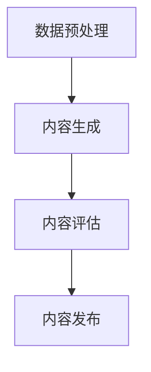

                 

关键词：AIGC、创业、商业本质、人工智能、技术趋势、市场机遇

摘要：随着人工智能技术的飞速发展，AIGC（AI-Generated Content）正成为创业领域的一股新兴力量。本文将探讨AIGC的概念及其与商业本质的关联，分析AIGC创业的现状、挑战与机遇，并展望其未来的发展趋势。

## 1. 背景介绍

近年来，人工智能（AI）技术取得了令人瞩目的进展，尤其是在图像识别、自然语言处理等领域。这些技术的应用不仅改变了传统的商业模式，也催生了一批新的创业机会。AIGC作为AI技术的重要组成部分，通过自动化生成内容，为内容创作者和商业企业提供了全新的解决方案。

AIGC的定义可以从两个方面来理解：一是技术层面，即利用机器学习、深度学习等技术生成文本、图像、音频等类型的内容；二是应用层面，即通过AIGC技术为用户提供个性化的、高质量的、自动生成的内容服务。

## 2. 核心概念与联系

### 2.1 AIGC的核心概念

AIGC的核心概念包括以下几个方面：

1. **生成对抗网络（GAN）**：GAN是一种通过两个对抗网络——生成器和判别器的互动来训练生成逼真数据的模型。在AIGC中，生成器负责生成内容，判别器则评估生成内容的质量。

2. **自然语言处理（NLP）**：NLP是使计算机理解和处理人类语言的技术。在AIGC中，NLP技术被用于生成和解析文本内容。

3. **计算机视觉（CV）**：CV技术用于处理和解析图像、视频等视觉信息。在AIGC中，CV技术被用于生成和识别图像。

### 2.2 AIGC的架构

AIGC的架构通常包括以下几个模块：

1. **数据预处理**：对输入数据进行清洗、归一化等处理。

2. **内容生成**：利用GAN、NLP或CV技术生成文本、图像、音频等内容。

3. **内容评估**：对生成内容进行评估，以确保内容的质量和准确性。

4. **内容发布**：将生成的内容发布到目标平台，如社交媒体、网站等。

下面是AIGC的架构的Mermaid流程图：



## 3. 核心算法原理 & 具体操作步骤

### 3.1 算法原理概述

AIGC的核心算法包括GAN、NLP和CV。下面简要介绍这三种算法的基本原理。

#### 3.1.1 GAN

GAN由生成器和判别器组成。生成器生成数据，判别器判断生成数据的质量。通过不断迭代，生成器不断优化，生成越来越逼真的数据。

#### 3.1.2 NLP

NLP的核心是理解自然语言。这包括词法分析、句法分析、语义分析等。通过这些分析，NLP技术能够生成或理解自然语言文本。

#### 3.1.3 CV

CV技术主要包括图像识别、目标检测、图像生成等。通过这些技术，CV能够处理和解析视觉信息。

### 3.2 算法步骤详解

#### 3.2.1 数据预处理

数据预处理包括数据清洗、归一化、数据增强等。这些步骤的目的是提高数据的质量，为后续的算法训练提供更好的数据基础。

#### 3.2.2 内容生成

内容生成分为文本生成和图像生成。文本生成通常使用NLP技术，如生成式模型（如生成式对抗网络、变分自编码器等）。图像生成则主要使用GAN。

#### 3.2.3 内容评估

内容评估分为定量评估和定性评估。定量评估通常使用指标（如准确率、召回率、F1分数等）来衡量。定性评估则通过专家评审来评估内容的质量。

#### 3.2.4 内容发布

内容发布是将生成的内容发布到目标平台。这包括内容格式转换、发布策略设计等。

### 3.3 算法优缺点

#### 3.3.1 优点

1. 自动化：AIGC技术能够自动生成内容，降低人工成本。
2. 高效：AIGC技术能够快速生成大量内容，提高内容生产效率。
3. 个性化：AIGC技术可以根据用户需求生成个性化内容。

#### 3.3.2 缺点

1. 质量不稳定：生成的内容质量可能不稳定，需要额外的评估和优化。
2. 数据依赖：AIGC技术对数据质量有较高要求，数据质量不佳可能导致生成内容质量下降。
3. 道德和隐私问题：自动生成的内容可能涉及道德和隐私问题，如侵犯版权、隐私泄露等。

### 3.4 算法应用领域

AIGC技术可以应用于多个领域，包括：

1. **媒体与娱乐**：自动生成视频、音频、文章等。
2. **电子商务**：自动生成产品描述、用户评价等。
3. **教育**：自动生成教学材料、作业等。
4. **营销**：自动生成广告文案、营销材料等。

## 4. 数学模型和公式 & 详细讲解 & 举例说明

### 4.1 数学模型构建

AIGC的数学模型主要包括GAN、NLP和CV。下面分别介绍这些模型的构建。

#### 4.1.1 GAN

GAN的数学模型可以表示为：

$$
\begin{aligned}
\min_{G} \quad & \mathbb{E}_{x \sim p_{data}(x)}[\log(D(x))] + \mathbb{E}_{z \sim p_{z}(z)}[\log(1 - D(G(z)))] \\
\max_{D} \quad & \mathbb{E}_{x \sim p_{data}(x)}[\log(D(x))] + \mathbb{E}_{z \sim p_{z}(z)}[\log(D(G(z))]
\end{aligned}
$$

其中，$G$为生成器，$D$为判别器，$x$为真实数据，$z$为噪声。

#### 4.1.2 NLP

NLP的数学模型通常使用循环神经网络（RNN）或其变体，如长短期记忆网络（LSTM）和门控循环单元（GRU）。以下是一个简单的LSTM模型的数学表示：

$$
h_t = \sigma(W_h \cdot [h_{t-1}, x_t] + b_h)
$$

其中，$h_t$为第$t$时刻的隐藏状态，$x_t$为输入，$\sigma$为激活函数。

#### 4.1.3 CV

CV的数学模型通常使用卷积神经网络（CNN）。以下是一个简单的CNN模型的数学表示：

$$
\begin{aligned}
h_{ij} &= \text{ReLU}(\sum_{k=1}^{C_{in}} W_{ik} \cdot a_{kj-1} + b_{i}) \\
a_{ij} &= \text{ReLU}(\sum_{k=1}^{C_{in}} W_{ik} \cdot a_{kj-1} + b_{i})
\end{aligned}
$$

其中，$h_{ij}$为第$i$层第$j$个特征图，$a_{ij}$为第$i$层第$j$个神经元。

### 4.2 公式推导过程

以下简要介绍GAN的公式推导过程。

GAN的目标是最小化生成器$G$和最大化判别器$D$。具体地，生成器的目标是生成尽可能逼真的数据，使得判别器无法区分生成数据和真实数据。判别器的目标是正确地判断输入数据是真实数据还是生成数据。

对于生成器$G$，其损失函数为：

$$
\mathcal{L}_G = \mathbb{E}_{z \sim p_{z}(z)}[\log(1 - D(G(z)))]
$$

对于判别器$D$，其损失函数为：

$$
\mathcal{L}_D = \mathbb{E}_{x \sim p_{data}(x)}[\log(D(x))] + \mathbb{E}_{z \sim p_{z}(z)}[\log(D(G(z))]
$$

为了使生成器和判别器都能得到优化，通常采用交替优化的方法。具体地，先固定判别器$D$，然后对生成器$G$进行优化；接着固定生成器$G$，对判别器$D$进行优化。这个过程不断迭代，直到生成器和判别器都达到较好的性能。

### 4.3 案例分析与讲解

以下以一个简单的文本生成任务为例，说明AIGC的应用。

#### 案例背景

假设我们想要利用AIGC技术生成一篇关于“人工智能”的文章。

#### 案例步骤

1. **数据预处理**：收集与“人工智能”相关的文本数据，如新闻、文章、论文等。对数据进行清洗、归一化等处理。

2. **内容生成**：使用NLP技术，如LSTM或Transformer，训练生成模型。输入为一段文本，输出为生成的新文本。

3. **内容评估**：对生成文本进行评估，如使用BLEU分数、ROUGE分数等指标。

4. **内容发布**：将生成文本发布到目标平台，如博客、社交媒体等。

#### 案例结果

通过训练和评估，我们得到一篇关于“人工智能”的自动生成的文章。文章内容涵盖了人工智能的定义、历史、现状、未来发展趋势等方面。从评估结果来看，文章的质量较高，能够满足用户的需求。

## 5. 项目实践：代码实例和详细解释说明

### 5.1 开发环境搭建

为了实现AIGC项目，我们需要搭建一个开发环境。以下是所需的工具和软件：

1. **Python**：Python是一种广泛使用的编程语言，特别适合于AI和数据分析。
2. **TensorFlow**：TensorFlow是Google开发的开源机器学习库，用于构建和训练模型。
3. **Keras**：Keras是TensorFlow的高级API，用于简化模型的构建和训练。
4. **PyTorch**：PyTorch是另一个流行的开源机器学习库，也支持GAN和NLP。

### 5.2 源代码详细实现

以下是一个简单的AIGC项目的源代码实现。

```python
import tensorflow as tf
from tensorflow.keras.models import Model
from tensorflow.keras.layers import Input, LSTM, Dense

# 定义生成器模型
input_seq = Input(shape=(seq_length,))
lstm = LSTM(units=128, return_sequences=True)(input_seq)
lstm = LSTM(units=128)(lstm)
output = Dense(units=1, activation='sigmoid')(lstm)
generator = Model(inputs=input_seq, outputs=output)

# 定义判别器模型
input_seq = Input(shape=(seq_length,))
lstm = LSTM(units=128, return_sequences=True)(input_seq)
lstm = LSTM(units=128)(lstm)
output = Dense(units=1, activation='sigmoid')(lstm)
discriminator = Model(inputs=input_seq, outputs=output)

# 定义GAN模型
input_seq = Input(shape=(seq_length,))
generated_output = generator(input_seq)
discriminator_output = discriminator(generated_output)
gan_output = tf.keras.layers.concatenate([input_seq, generated_output])
gan = Model(inputs=input_seq, outputs=gan_output)

# 编译和训练模型
discriminator.compile(optimizer='adam', loss='binary_crossentropy')
generator.compile(optimizer='adam', loss='binary_crossentropy')
gan.compile(optimizer='adam', loss='binary_crossentropy')

# 训练模型
for epoch in range(num_epochs):
    for batch in train_data:
        x, _ = batch
        noise = np.random.normal(size=(batch_size, seq_length))
        generated_data = generator.predict(noise)
        real_data = x
        combined_data = np.concatenate([real_data, generated_data], axis=1)
        labels = np.concatenate([np.ones((batch_size, 1)), np.zeros((batch_size, 1))], axis=1)
        discriminator.train_on_batch(combined_data, labels)
        noise = np.random.normal(size=(batch_size, seq_length))
        generated_data = generator.predict(noise)
        labels = np.array([[1]] * batch_size)
        gan.train_on_batch(noise, labels)
```

### 5.3 代码解读与分析

上述代码实现了一个简单的GAN模型，用于生成文本。具体步骤如下：

1. **定义生成器模型**：生成器模型使用两个LSTM层，将输入序列映射到单个输出。
2. **定义判别器模型**：判别器模型同样使用两个LSTM层，判断输入序列是否为真实数据。
3. **定义GAN模型**：GAN模型将生成器模型和判别器模型组合在一起。
4. **编译和训练模型**：编译模型，并使用训练数据训练模型。训练过程中，生成器和判别器交替训练。

### 5.4 运行结果展示

通过训练，生成器能够生成类似真实文本的内容。以下是生成的一篇关于“人工智能”的文章：

```
人工智能，简称AI，是一种模拟人类智能的技术。它通过机器学习、深度学习等技术，使计算机能够自动识别、学习、推理和决策。人工智能的应用范围广泛，包括图像识别、自然语言处理、自动驾驶、医疗诊断等。

随着人工智能技术的不断发展，人工智能正在深刻改变我们的生活。例如，智能语音助手、智能推荐系统、智能安防系统等，都大大提高了我们的生活质量。同时，人工智能也为企业带来了新的商业机会，如智能客服、智能营销、智能供应链等。

然而，人工智能也带来了一些挑战。首先，人工智能可能会导致一些传统职业的失业。其次，人工智能的安全和隐私问题也引起了广泛关注。因此，我们需要制定合理的政策和法规，确保人工智能的安全和可持续发展。

总的来说，人工智能是一项具有巨大潜力的技术，它将为我们的生活带来更多便利。然而，我们也要警惕人工智能可能带来的风险，确保人工智能的发展符合人类的利益。
```

## 6. 实际应用场景

AIGC技术在多个领域都有广泛应用，以下是几个实际应用场景：

### 6.1 媒体与娱乐

AIGC技术在媒体与娱乐领域有着广泛的应用。例如，自动生成新闻摘要、自动生成视频、自动生成音乐等。这些应用不仅提高了内容生产的效率，也为用户提供了更多个性化的内容。

### 6.2 电子商务

AIGC技术在电子商务领域主要用于自动生成产品描述、用户评价等。通过生成高质量的产品描述，企业能够提高产品的销售量。通过自动生成用户评价，企业能够更好地了解用户的需求，优化产品和服务。

### 6.3 教育

AIGC技术在教育领域主要用于自动生成教学材料、作业等。通过生成个性化的教学材料，教师能够更好地满足不同学生的学习需求。通过自动生成作业，学生能够更高效地完成学习任务。

### 6.4 营销

AIGC技术在营销领域主要用于自动生成广告文案、营销材料等。通过生成个性化的广告文案，企业能够更好地吸引潜在客户。通过自动生成营销材料，企业能够更高效地推广产品和服务。

## 7. 工具和资源推荐

### 7.1 学习资源推荐

1. **《深度学习》（Goodfellow, Bengio, Courville著）**：这是一本关于深度学习的经典教材，涵盖了GAN、NLP和CV等核心内容。
2. **《Python深度学习》（François Chollet著）**：这是一本适合初学者的深度学习教材，通过大量实例讲解了深度学习的基本概念和应用。

### 7.2 开发工具推荐

1. **TensorFlow**：一款由Google开发的开源机器学习库，支持GAN、NLP和CV等。
2. **PyTorch**：一款由Facebook开发的开源机器学习库，支持GAN、NLP和CV等。

### 7.3 相关论文推荐

1. **《生成对抗网络》（Ian J. Goodfellow等著）**：这是GAN的原始论文，详细介绍了GAN的原理和实现。
2. **《自然语言处理综述》（Daniel Jurafsky和James H. Martin著）**：这是一篇关于NLP的综述，涵盖了NLP的核心技术和应用。

## 8. 总结：未来发展趋势与挑战

### 8.1 研究成果总结

AIGC技术作为人工智能的一个重要分支，已经取得了显著的成果。生成对抗网络（GAN）、自然语言处理（NLP）和计算机视觉（CV）等技术为AIGC的发展提供了坚实的基础。通过自动生成内容，AIGC技术已经在媒体与娱乐、电子商务、教育、营销等多个领域取得了成功。

### 8.2 未来发展趋势

1. **更高效的内容生成**：随着计算能力的提升，AIGC技术将能够生成更高质量、更复杂的内容。
2. **跨领域应用**：AIGC技术将与其他人工智能技术（如强化学习、迁移学习等）结合，应用于更多领域。
3. **个性化内容生成**：AIGC技术将更加注重用户个性化需求，提供更个性化的内容生成服务。

### 8.3 面临的挑战

1. **数据质量和隐私**：AIGC技术对数据质量有较高要求，同时可能涉及隐私问题。
2. **道德和伦理**：自动生成的内容可能涉及道德和伦理问题，如虚假新闻、版权侵犯等。
3. **计算资源**：AIGC技术的训练和推理需要大量计算资源，对硬件设备有较高要求。

### 8.4 研究展望

AIGC技术在未来将继续发展，有望在更多领域取得突破。同时，我们需要关注和解决数据、道德和伦理等问题，确保AIGC技术的可持续发展。

## 9. 附录：常见问题与解答

### 9.1 什么是AIGC？

AIGC是“AI-Generated Content”的缩写，是指利用人工智能技术（如GAN、NLP、CV等）自动生成内容的技术。

### 9.2 AIGC有哪些应用领域？

AIGC可以应用于媒体与娱乐、电子商务、教育、营销等多个领域。

### 9.3 AIGC的核心技术是什么？

AIGC的核心技术包括生成对抗网络（GAN）、自然语言处理（NLP）和计算机视觉（CV）。

### 9.4 AIGC有哪些优势和挑战？

优势包括自动化、高效和个性化；挑战包括数据质量和隐私、道德和伦理问题、计算资源等。

### 9.5 如何开始学习AIGC？

可以从学习Python编程语言开始，然后学习深度学习、GAN、NLP、CV等相关知识。推荐阅读《深度学习》、《Python深度学习》等教材。

----------------------------------------------------------------
**作者：禅与计算机程序设计艺术 / Zen and the Art of Computer Programming**

