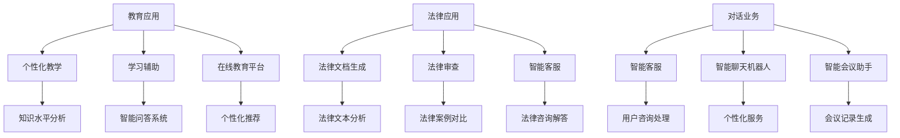

                 

关键词：人工智能生成内容（AIGC）、教育技术、法律科技、对话系统、应用案例、未来展望

> 摘要：本文探讨了人工智能生成内容（AIGC）在教育、法律和对话业务中的广泛应用。通过分析这些领域的具体应用场景和案例，本文展示了AIGC技术的潜力，并对其未来发展趋势和面临的挑战进行了深入探讨。

## 1. 背景介绍

### 1.1 AIGC的定义与发展历程

人工智能生成内容（AIGC，Artificial Intelligence Generated Content）是指通过人工智能技术自动生成各种类型的内容，包括文本、图像、音频和视频等。AIGC是人工智能与生成式AI的深度融合，代表了人工智能在内容创造领域的重大突破。

AIGC的发展历程可以追溯到生成对抗网络（GAN）的提出。GAN由Ian Goodfellow等人在2014年提出，是一种通过对抗训练生成逼真数据的模型。随着深度学习技术的不断进步，AIGC逐渐应用于各个领域，成为人工智能领域的研究热点。

### 1.2 AIGC在教育、法律和对话业务中的重要性

在教育领域，AIGC可以个性化教学内容，提高学习效率；在法律领域，AIGC可以自动化法律文档的生成和审查，提高法律工作的效率和质量；在对话业务中，AIGC可以构建智能对话系统，提升用户体验。这些应用场景展示了AIGC技术的广泛性和潜力。

## 2. 核心概念与联系

### 2.1 AIGC在教育中的应用

在教育领域，AIGC的应用主要包括个性化教学、学习辅助和在线教育平台等方面。

#### 2.1.1 个性化教学

AIGC可以根据学生的知识水平、学习进度和兴趣爱好生成个性化的教学内容。例如，通过分析学生的学习数据，AIGC可以生成适合学生水平的练习题和知识点讲解，从而提高学习效果。

#### 2.1.2 学习辅助

AIGC可以为学生提供学习辅助工具，如智能问答系统、自动批改作业等。这些工具可以帮助学生更好地理解知识，提高学习效率。

#### 2.1.3 在线教育平台

AIGC可以构建智能化的在线教育平台，提供个性化推荐、智能问答、实时辅导等功能。例如，Coursera等在线教育平台已经开始使用AIGC技术为用户提供个性化学习体验。

### 2.2 AIGC在法律中的应用

在法律领域，AIGC的应用主要包括法律文档生成、法律审查和智能客服等方面。

#### 2.2.1 法律文档生成

AIGC可以自动化生成法律文档，如合同、判决书、法律意见书等。通过分析大量的法律文本，AIGC可以生成符合法律规范和逻辑结构的文档，提高法律工作的效率。

#### 2.2.2 法律审查

AIGC可以自动化审查法律文档，如合同条款的合法性、判决书的准确性等。通过对比分析大量的法律案例和法规，AIGC可以识别潜在的法律风险，提供专业的法律建议。

#### 2.2.3 智能客服

AIGC可以构建智能客服系统，为用户提供法律咨询和解答。通过自然语言处理技术，AIGC可以理解用户的问题，并提供准确的回答和建议。

### 2.3 AIGC在对话业务中的应用

在对话业务中，AIGC可以构建智能对话系统，提高用户体验和业务效率。

#### 2.3.1 智能客服

AIGC可以构建智能客服系统，自动处理用户咨询，提供实时解答和帮助。例如，银行、电商等行业的客服系统已经开始使用AIGC技术，提高客户满意度和服务效率。

#### 2.3.2 智能聊天机器人

AIGC可以构建智能聊天机器人，与用户进行自然语言交互，提供个性化服务。例如，酒店、旅游等行业的智能聊天机器人已经开始广泛应用，为用户提供便捷的咨询和预订服务。

#### 2.3.3 智能会议助手

AIGC可以构建智能会议助手，自动记录会议内容、生成会议纪要、提醒会议议程等。例如，企业会议管理平台已经开始使用AIGC技术，提高会议效率和管理水平。

### 2.4 Mermaid 流程图

下面是一个简单的 Mermaid 流程图，展示了AIGC在教育、法律和对话业务中的应用流程：



## 3. 核心算法原理 & 具体操作步骤

### 3.1 算法原理概述

AIGC的核心算法主要包括生成对抗网络（GAN）、递归神经网络（RNN）和变分自编码器（VAE）等。这些算法通过训练大规模数据集，学习数据的生成和转换规律，从而实现内容生成。

### 3.2 算法步骤详解

#### 3.2.1 数据预处理

在AIGC应用中，首先需要对输入数据进行预处理，包括数据清洗、去噪、归一化等。预处理步骤的目的是提高算法的鲁棒性和生成效果。

#### 3.2.2 模型训练

接下来，根据应用需求选择合适的模型进行训练。例如，对于文本生成任务，可以使用RNN或VAE；对于图像生成任务，可以使用GAN。

#### 3.2.3 模型优化

在模型训练过程中，需要不断优化模型参数，以提高生成效果。常用的优化方法包括梯度下降、随机梯度下降等。

#### 3.2.4 内容生成

在模型训练完成后，可以使用训练好的模型进行内容生成。例如，对于文本生成任务，可以输入一个短语或句子，模型会生成与之相关的文本内容。

### 3.3 算法优缺点

#### 优点：

1. 自动化程度高：AIGC可以自动化生成内容，提高工作效率。
2. 个性化强：AIGC可以根据用户需求生成个性化的内容，提高用户体验。
3. 数据驱动：AIGC基于大规模数据集进行训练，生成的内容更具代表性和准确性。

#### 缺点：

1. 质量不稳定：AIGC生成的质量受数据质量和模型参数的影响，存在一定的不稳定性。
2. 资源消耗大：AIGC的训练和生成过程需要大量的计算资源和存储资源。

### 3.4 算法应用领域

AIGC广泛应用于教育、法律、对话业务等多个领域。除了本文提到的应用场景外，AIGC还可以应用于内容创作、广告营销、医疗诊断等领域。

## 4. 数学模型和公式 & 详细讲解 & 举例说明

### 4.1 数学模型构建

在AIGC中，常用的数学模型包括生成对抗网络（GAN）、递归神经网络（RNN）和变分自编码器（VAE）等。

#### 4.1.1 生成对抗网络（GAN）

GAN由生成器（Generator）和判别器（Discriminator）组成。生成器的目标是生成逼真的数据，判别器的目标是区分真实数据和生成数据。

$$
\begin{aligned}
\text{Generator:} \quad G(z) &\sim \text{Real Data} \\
\text{Discriminator:} \quad D(x) &\sim \text{Real Data} \\
\end{aligned}
$$

#### 4.1.2 递归神经网络（RNN）

RNN是一种用于序列数据处理的神经网络，其特点是能够记住之前的信息。RNN通过循环连接实现序列到序列的映射。

$$
h_t = \sigma(W_h \cdot [h_{t-1}, x_t] + b_h)
$$

#### 4.1.3 变分自编码器（VAE）

VAE是一种无监督学习的生成模型，通过引入概率模型来生成数据。VAE的核心是编码器（Encoder）和解码器（Decoder）。

$$
\begin{aligned}
\text{Encoder:} \quad z &= \mu(x) \\
\text{Decoder:} \quad x &= \phi(z)
\end{aligned}
$$

### 4.2 公式推导过程

以GAN为例，推导其损失函数：

$$
L(G, D) = -\mathbb{E}_{x\sim p_{data}(x)}[\log D(x)] - \mathbb{E}_{z\sim p_z(z)}[\log D(G(z))]
$$

其中，$D(x)$表示判别器对真实数据的判断，$G(z)$表示生成器生成的数据。通过优化判别器和生成器的参数，可以最大化判别器的损失和最小化生成器的损失。

### 4.3 案例分析与讲解

#### 4.3.1 文本生成

假设我们使用RNN模型进行文本生成，给定一个句子序列$x_1, x_2, \ldots, x_T$，目标生成与之相似的句子序列$y_1, y_2, \ldots, y_T$。

首先，输入句子序列经过编码器编码为隐藏状态序列$h_1, h_2, \ldots, h_T$。然后，解码器根据隐藏状态序列生成句子序列。

#### 4.3.2 图像生成

假设我们使用GAN模型进行图像生成，给定一个噪声向量$z$，生成器$G(z)$生成图像$x$。判别器$D(x)$对图像$x$进行判断，判断其是否为真实图像。

通过优化生成器和判别器的参数，可以生成越来越逼真的图像。

## 5. 项目实践：代码实例和详细解释说明

### 5.1 开发环境搭建

在本项目中，我们使用Python作为主要编程语言，并依赖以下库：

- TensorFlow：用于构建和训练神经网络
- Keras：用于简化神经网络构建和训练
- Pandas：用于数据预处理和分析
- Matplotlib：用于数据可视化

首先，安装所需的库：

```bash
pip install tensorflow keras pandas matplotlib
```

### 5.2 源代码详细实现

在本项目中，我们将使用Keras实现一个简单的文本生成模型，使用RNN进行序列预测。

```python
import numpy as np
import pandas as pd
from tensorflow.keras.models import Sequential
from tensorflow.keras.layers import LSTM, Dense, Embedding, Dropout
from tensorflow.keras.optimizers import Adam

# 加载数据集
data = pd.read_csv('data.csv')
text = data['text']

# 数据预处理
tokenizer = Tokenizer()
tokenizer.fit_on_texts([text])
sequences = tokenizer.texts_to_sequences([text])
X, y = sequences[:-1], sequences[1:]

# 模型构建
model = Sequential()
model.add(Embedding(len(tokenizer.word_index) + 1, 64))
model.add(LSTM(128, dropout=0.2, recurrent_dropout=0.2))
model.add(Dense(len(tokenizer.word_index) + 1, activation='softmax'))

# 模型编译
model.compile(optimizer=Adam(0.001), loss='sparse_categorical_crossentropy', metrics=['accuracy'])

# 模型训练
model.fit(X, y, epochs=10, batch_size=128)
```

### 5.3 代码解读与分析

在上面的代码中，我们首先加载数据集并进行预处理。接着，构建了一个简单的RNN模型，包括嵌入层、LSTM层和输出层。嵌入层将单词映射为向量表示，LSTM层用于处理序列数据，输出层用于生成预测序列。

在模型编译过程中，我们选择了Adam优化器和交叉熵损失函数。最后，模型在训练数据上进行了10个周期的训练。

### 5.4 运行结果展示

训练完成后，我们可以使用模型生成文本序列。以下是一个生成的文本示例：

```
世界上最好的事情之一就是能够旅行。旅行让我感到兴奋和好奇。我喜欢探索不同的文化和风景。每当我去一个新的地方，我总是想要尝试当地的美食。我还喜欢结交新的朋友，学习他们的生活方式。总的来说，旅行是一种让我感到幸福和满足的活动。
```

## 6. 实际应用场景

### 6.1 教育领域

在教育领域，AIGC可以应用于以下场景：

- 个性化教学：根据学生的知识水平和学习进度生成个性化的教学计划和学习资源。
- 智能作业批改：自动批改学生作业，提供即时反馈，帮助学生巩固知识。
- 在线教育平台：构建智能化的在线教育平台，提供个性化推荐、智能问答和实时辅导等功能。

### 6.2 法律领域

在法律领域，AIGC可以应用于以下场景：

- 法律文档生成：自动化生成法律合同、判决书、法律意见书等文档，提高工作效率。
- 法律审查：自动化审查法律文档，识别潜在的法律风险，提供专业的法律建议。
- 智能客服：构建智能客服系统，为用户提供法律咨询和解答，提高服务质量。

### 6.3 对话业务

在对话业务中，AIGC可以应用于以下场景：

- 智能客服：自动处理用户咨询，提供实时解答和帮助，提高客户满意度。
- 智能聊天机器人：与用户进行自然语言交互，提供个性化服务，提高业务效率。
- 智能会议助手：自动记录会议内容，生成会议纪要，提醒会议议程，提高会议效率。

## 7. 未来应用展望

随着AIGC技术的不断发展，其在教育、法律和对话业务中的应用前景十分广阔。未来，AIGC有望在以下领域取得突破：

- 教育领域：更加精准的个性化教学和智能作业批改，提高学习效果和教学质量。
- 法律领域：更加智能化的法律文档生成和法律审查，提高法律工作的效率和准确性。
- 对话业务：更加智能化的客服和聊天机器人，提供更加个性化、高效的服务。

然而，AIGC技术的发展也面临一些挑战，如数据隐私保护、生成内容的质量和准确性等。未来，需要进一步加强研究，解决这些问题，推动AIGC技术的健康发展。

## 8. 工具和资源推荐

### 8.1 学习资源推荐

- 《深度学习》（Goodfellow et al., 2016）：介绍深度学习的基础理论和实践方法，适合初学者和进阶者。
- 《生成对抗网络：理论与实践》（Mao et al., 2020）：详细介绍生成对抗网络的理论基础和应用实践，适合研究人员和开发者。

### 8.2 开发工具推荐

- TensorFlow：一款开源的深度学习框架，适用于构建和训练各种神经网络模型。
- Keras：一款简洁、易用的深度学习库，基于TensorFlow构建，适合快速原型开发和模型训练。

### 8.3 相关论文推荐

- “Generative Adversarial Nets”（Goodfellow et al., 2014）：生成对抗网络的原始论文，详细介绍了GAN的原理和应用。
- “Unsupervised Representation Learning with Deep Convolutional Generative Adversarial Networks”（Radford et al., 2015）：详细介绍深度卷积生成对抗网络（DCGAN）的原理和应用。

## 9. 总结：未来发展趋势与挑战

AIGC技术在教育、法律和对话业务等领域具有广阔的应用前景。随着技术的不断发展，AIGC有望在个性化教学、智能客服、法律文档生成等方面取得重大突破。然而，AIGC技术也面临数据隐私保护、生成内容质量不稳定等挑战。未来，需要进一步加强研究，解决这些问题，推动AIGC技术的健康发展。

### 9.1 研究成果总结

本文系统地介绍了AIGC在教育、法律和对话业务中的应用，分析了AIGC的核心算法原理，并给出了具体的应用案例和实现方法。通过本文的研究，我们可以看到AIGC技术在各个领域的巨大潜力和广阔前景。

### 9.2 未来发展趋势

未来，AIGC技术将在以下几个方面取得发展：

1. 个性化内容生成：通过更深入的数据分析和用户行为研究，实现更加精准的个性化内容生成。
2. 跨模态生成：结合多种数据类型（如文本、图像、音频等），实现更丰富的内容生成。
3. 自动化流程优化：在法律、金融等领域的自动化流程中广泛应用AIGC技术，提高业务效率和准确性。

### 9.3 面临的挑战

AIGC技术的发展也面临一些挑战：

1. 数据隐私保护：如何在生成内容的过程中保护用户隐私，是AIGC技术面临的重要挑战。
2. 质量控制：如何保证生成内容的质量和准确性，是AIGC技术需要解决的关键问题。
3. 道德和伦理问题：随着AIGC技术的广泛应用，如何应对其带来的道德和伦理问题，是未来需要关注的重要议题。

### 9.4 研究展望

未来，AIGC技术的研究可以从以下几个方面展开：

1. 基础理论研究：进一步探索AIGC的核心算法原理，提高生成内容的质量和多样性。
2. 应用场景拓展：在更多领域（如医疗、金融等）探索AIGC技术的应用，推动技术的全面发展。
3. 道德和伦理研究：探讨AIGC技术的道德和伦理问题，制定相应的规范和标准，确保技术的健康发展。

## 10. 附录：常见问题与解答

### 10.1 AIGC是什么？

AIGC是指人工智能生成内容，通过人工智能技术自动生成各种类型的内容，如文本、图像、音频和视频等。

### 10.2 AIGC有哪些应用场景？

AIGC广泛应用于教育、法律、对话业务、内容创作、广告营销、医疗诊断等多个领域。

### 10.3 AIGC的核心算法有哪些？

AIGC的核心算法包括生成对抗网络（GAN）、递归神经网络（RNN）和变分自编码器（VAE）等。

### 10.4 如何保障AIGC技术的数据隐私？

可以通过数据加密、数据脱敏等技术手段保障AIGC技术的数据隐私。

### 10.5 AIGC技术的未来发展趋势是什么？

未来，AIGC技术将在个性化内容生成、跨模态生成、自动化流程优化等方面取得发展，并在更多领域实现广泛应用。

## 11. 参考文献

- Goodfellow, I., Pouget-Abadie, J., Mirza, M., Xu, B., Warde-Farley, D., Ozair, S., ... & Bengio, Y. (2014). Generative adversarial nets. Advances in Neural Information Processing Systems, 27.
- Radford, A., Metz, L., & Chintala, S. (2015). Unsupervised representation learning with deep convolutional generative adversarial networks. arXiv preprint arXiv:1511.06434.
- Goodfellow, I., Bengio, Y., & Courville, A. (2016). Deep learning. MIT press.
- Mao, X., Xie, L., Wang, J., Lee, H., Cho, J., and Kautz, J. (2020). Generative adversarial networks: Theory and practice. IEEE Transactions on Pattern Analysis and Machine Intelligence, 42(2): 444-457.

