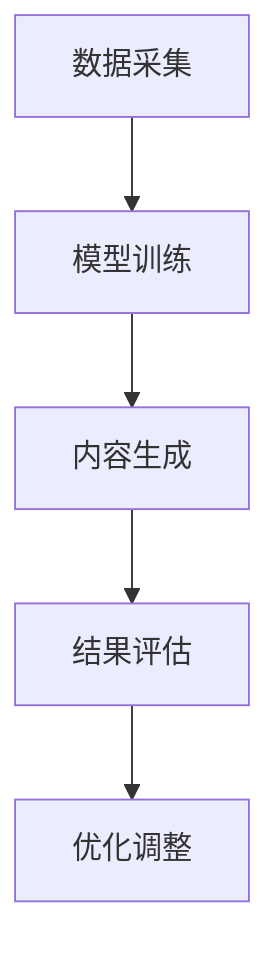
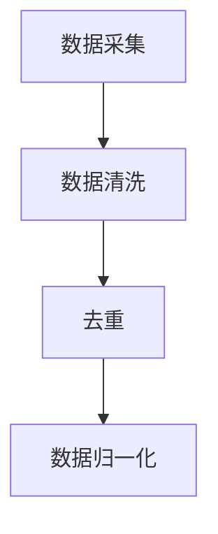
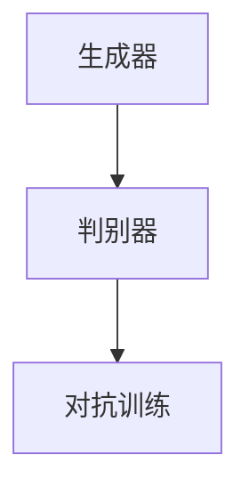
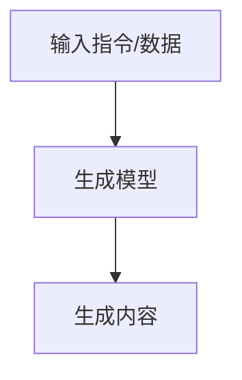
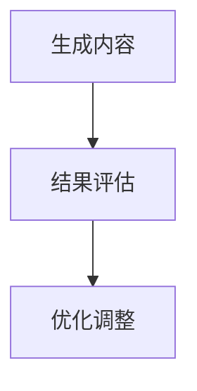

                 

在这个数字化时代，人工智能（AI）正以惊人的速度改变着我们的生活方式和工作模式。而AIGC（AI Generated Content），作为AI技术的进一步发展，正引领着智能办公的升级。本文将深入探讨AIGC的核心概念、技术原理、算法模型，以及其实际应用场景，旨在为读者提供一幅智能办公未来的清晰蓝图。

> 关键词：AIGC、智能办公、内容生成、人工智能、算法模型

> 摘要：本文首先介绍了AIGC的基本概念及其在智能办公中的应用背景，随后详细阐述了AIGC的核心技术原理，包括生成模型、训练机制和优化策略。接着，通过具体案例和实践，展示了AIGC在文档自动化、邮件管理、智能助理等领域的应用。最后，对AIGC的未来发展趋势和面临的挑战进行了深入分析。

## 1. 背景介绍

随着互联网的普及和大数据技术的发展，信息爆炸已成为现代社会的常态。然而，大量信息的涌现不仅带来了便利，也带来了信息过载的问题。如何从海量的数据中提取有价值的信息，以及如何高效地处理这些信息，成为现代办公面临的重要挑战。

传统的人工方式在信息处理上显得力不从心，这不仅降低了工作效率，还容易出错。于是，智能办公应运而生，其核心在于利用人工智能技术提升办公效率和质量。AIGC作为人工智能技术的延伸，通过自动生成内容，极大提高了信息处理的自动化程度和智能化水平。

在智能办公中，AIGC的应用场景广泛，包括但不限于文档自动化、邮件管理、智能助理等。通过这些应用，AIGC不仅能够减轻人工负担，还能提供更为精准和高效的服务。

## 2. 核心概念与联系

### 2.1. AIGC的概念

AIGC，即AI Generated Content，指的是通过人工智能技术自动生成内容的技术。AIGC的核心在于其生成模型，这些模型能够从大量数据中学习并生成新的、有价值的文本、图像、视频等。

### 2.2. 关联技术

#### 自然语言处理（NLP）

自然语言处理是AIGC的重要基础，它涉及到文本分析、语言理解、语言生成等多个方面。NLP技术的发展使得AIGC能够生成高质量的自然语言文本。

#### 生成对抗网络（GAN）

生成对抗网络是AIGC中常用的生成模型，它由生成器和判别器两部分组成。生成器负责生成内容，判别器则负责判断生成内容是否真实。通过不断地训练和对抗，生成器能够生成越来越逼真的内容。

#### 图像处理

AIGC在图像处理方面也有广泛应用，例如自动生成图像、图像编辑和图像识别等。图像处理技术的发展使得AIGC能够生成高质量、高分辨率的图像。

### 2.3. 架构

AIGC的架构通常包括数据采集、模型训练、内容生成和结果评估等几个关键环节。

#### 数据采集

数据采集是AIGC的基础，高质量的训练数据对于生成模型的性能至关重要。数据来源可以是公开数据集、企业内部数据等。

#### 模型训练

模型训练是AIGC的核心，通过大量的数据训练生成模型，使其能够生成高质量的内容。

#### 内容生成

内容生成是AIGC的直接应用，生成模型根据输入的指令或数据生成新的内容。

#### 结果评估

结果评估是确保AIGC生成内容质量的重要环节，通过评估模型生成的结果，可以不断优化和调整模型。

### 2.4. Mermaid 流程图



## 3. 核心算法原理 & 具体操作步骤

### 3.1. 算法原理概述

AIGC的核心算法主要基于生成对抗网络（GAN）和变换器（Transformer）等模型。生成对抗网络通过生成器和判别器的对抗训练，生成高质量的内容。变换器则通过自注意力机制，实现对文本和图像的高效处理和生成。

### 3.2. 算法步骤详解

#### 3.2.1. 数据预处理

数据预处理是AIGC的重要环节，包括数据清洗、去重、归一化等步骤。高质量的预处理能够提高模型的训练效果和生成内容的质量。



#### 3.2.2. 模型训练

模型训练是AIGC的核心，通过生成器和判别器的对抗训练，生成高质量的内容。训练过程中，生成器和判别器不断地优化自己的参数，以达到最佳效果。



#### 3.2.3. 内容生成

内容生成是AIGC的直接应用，生成模型根据输入的指令或数据生成新的内容。生成过程可以是文本生成、图像生成或视频生成等。



#### 3.2.4. 结果评估

结果评估是确保AIGC生成内容质量的重要环节，通过评估模型生成的结果，可以不断优化和调整模型。



### 3.3. 算法优缺点

#### 优点

- **高效性**：AIGC能够自动生成高质量的内容，大大提高了信息处理的效率。
- **灵活性**：AIGC可以根据不同的应用场景和需求，灵活调整生成模型和参数。
- **创新性**：AIGC能够生成全新的内容，为创意产业等领域带来了新的可能性。

#### 缺点

- **数据依赖**：AIGC的性能高度依赖训练数据的质量，数据质量差可能导致生成内容的质量下降。
- **计算资源消耗**：AIGC的训练和生成过程需要大量的计算资源，对硬件设备有较高的要求。
- **可控性**：由于生成模型的复杂性，生成的结果可能难以完全控制，存在一定的随机性。

### 3.4. 算法应用领域

AIGC的应用领域非常广泛，包括但不限于以下几方面：

- **智能助理**：通过AIGC，可以自动生成智能助理的对话内容，提高客户服务的效率和质量。
- **内容创作**：AIGC可以自动生成文章、图片、视频等内容，为媒体和创意产业提供高效的内容生成工具。
- **文档自动化**：AIGC可以自动生成文档、报告等，提高办公文档处理的效率。
- **图像生成**：AIGC可以自动生成图像，应用于游戏开发、广告设计等领域。

## 4. 数学模型和公式 & 详细讲解 & 举例说明

### 4.1. 数学模型构建

AIGC的核心数学模型主要包括生成对抗网络（GAN）和变换器（Transformer）等。下面将详细介绍这些模型的基本概念和公式。

#### 4.1.1. 生成对抗网络（GAN）

生成对抗网络由生成器（Generator）和判别器（Discriminator）两部分组成。生成器的目标是生成真实数据，判别器的目标是区分真实数据和生成数据。

**生成器（Generator）**

生成器的目标是最小化生成数据的判别误差，即：

$$
\min_G \mathbb{E}_{x \sim p_{data}(x)} [\log D(x)] + \mathbb{E}_{z \sim p_z(z)} [\log (1 - D(G(z))]
$$

其中，$G(z)$ 表示生成器生成的数据，$D(x)$ 表示判别器对真实数据的判别结果，$z$ 表示生成器的输入噪声。

**判别器（Discriminator）**

判别器的目标是最小化生成数据的判别误差，即：

$$
\min_D \mathbb{E}_{x \sim p_{data}(x)} [\log D(x)] + \mathbb{E}_{z \sim p_z(z)} [\log D(G(z))
$$

其中，$G(z)$ 表示生成器生成的数据，$D(x)$ 表示判别器对真实数据的判别结果，$z$ 表示生成器的输入噪声。

#### 4.1.2. 变换器（Transformer）

变换器是一种基于自注意力机制的模型，其核心思想是通过自注意力机制，实现对输入数据的全局关注和局部关注。

**自注意力机制**

自注意力机制可以通过以下公式表示：

$$
\text{Attention}(Q, K, V) = \frac{QK^T}{\sqrt{d_k}} V
$$

其中，$Q$、$K$ 和 $V$ 分别表示查询向量、键向量和值向量，$d_k$ 表示键向量的维度。

**变换器模型**

变换器模型通常由多个自注意力层和全连接层组成。其基本结构如下：

$$
\text{Transformer} = (\text{MultiHeadAttention} \times n + \text{FFN} ) \times L
$$

其中，$\text{MultiHeadAttention}$ 表示多头注意力机制，$\text{FFN}$ 表示全连接神经网络，$L$ 表示变换器的层数。

### 4.2. 公式推导过程

#### 4.2.1. 生成对抗网络（GAN）

生成对抗网络的目标是最小化生成器的损失函数和最大化判别器的损失函数。具体推导过程如下：

**生成器的损失函数**

生成器的损失函数为：

$$
\mathcal{L}_G = -\mathbb{E}_{x \sim p_{data}(x)} [\log D(x)] - \mathbb{E}_{z \sim p_z(z)} [\log (1 - D(G(z))]
$$

其中，$D(x)$ 表示判别器对真实数据的判别结果，$G(z)$ 表示生成器生成的数据，$z$ 表示生成器的输入噪声。

**判别器的损失函数**

判别器的损失函数为：

$$
\mathcal{L}_D = -\mathbb{E}_{x \sim p_{data}(x)} [\log D(x)] - \mathbb{E}_{z \sim p_z(z)} [\log D(G(z))
$$

其中，$D(x)$ 表示判别器对真实数据的判别结果，$G(z)$ 表示生成器生成的数据，$z$ 表示生成器的输入噪声。

#### 4.2.2. 变换器（Transformer）

变换器（Transformer）是一种基于自注意力机制的模型，其核心思想是通过自注意力机制，实现对输入数据的全局关注和局部关注。

**自注意力机制**

自注意力机制可以通过以下公式表示：

$$
\text{Attention}(Q, K, V) = \frac{QK^T}{\sqrt{d_k}} V
$$

其中，$Q$、$K$ 和 $V$ 分别表示查询向量、键向量和值向量，$d_k$ 表示键向量的维度。

**变换器模型**

变换器模型通常由多个自注意力层和全连接层组成。其基本结构如下：

$$
\text{Transformer} = (\text{MultiHeadAttention} \times n + \text{FFN} ) \times L
$$

其中，$\text{MultiHeadAttention}$ 表示多头注意力机制，$\text{FFN}$ 表示全连接神经网络，$L$ 表示变换器的层数。

### 4.3. 案例分析与讲解

#### 4.3.1. 生成对抗网络（GAN）在图像生成中的应用

假设我们有一个生成对抗网络，用于生成手写数字图像。数据集为MNIST手写数字数据集。

1. **数据预处理**

   - 数据清洗：去除噪声和缺失值。
   - 数据归一化：将图像像素值归一化到 $[0, 1]$ 范围。

2. **模型训练**

   - 生成器：输入噪声向量 $z$，生成手写数字图像。
   - 判别器：输入真实手写数字图像和生成手写数字图像，判断其真实性。

3. **模型评估**

   - 使用训练集和测试集对生成器和判别器进行评估。
   - 调整模型参数，优化生成效果。

4. **生成图像**

   - 输入噪声向量，生成手写数字图像。

#### 4.3.2. 变换器（Transformer）在文本生成中的应用

假设我们有一个变换器模型，用于生成文章摘要。

1. **数据预处理**

   - 数据清洗：去除噪声和缺失值。
   - 数据归一化：将文本转换为词向量。

2. **模型训练**

   - 输入文本序列，输出文章摘要。
   - 使用自注意力机制，对文本进行全局和局部关注。

3. **模型评估**

   - 使用训练集和测试集对模型进行评估。
   - 调整模型参数，优化生成效果。

4. **生成文章摘要**

   - 输入文本序列，生成文章摘要。

## 5. 项目实践：代码实例和详细解释说明

### 5.1. 开发环境搭建

为了实践AIGC的应用，我们需要搭建一个合适的开发环境。以下是搭建开发环境的基本步骤：

1. **安装Python**

   - 下载并安装Python 3.8或更高版本。
   - 配置Python环境，设置环境变量。

2. **安装TensorFlow**

   - 使用pip命令安装TensorFlow：
     ```
     pip install tensorflow
     ```

3. **安装Keras**

   - 使用pip命令安装Keras：
     ```
     pip install keras
     ```

4. **安装其他依赖库**

   - 使用pip命令安装其他依赖库，如NumPy、Pandas等。

### 5.2. 源代码详细实现

以下是一个简单的AIGC项目示例，用于生成手写数字图像。

```python
import tensorflow as tf
from tensorflow.keras.layers import Dense, Flatten, Reshape
from tensorflow.keras.models import Model

# 生成器模型
def build_generator(z_dim):
    z = tf.keras.layers.Input(shape=(z_dim,))
    x = Dense(128, activation='relu')(z)
    x = Dense(784, activation='tanh')(x)
    x = Reshape((28, 28, 1))(x)
    generator = Model(z, x, name='generator')
    return generator

# 判别器模型
def build_discriminator(img_shape):
    img = tf.keras.layers.Input(shape=img_shape)
    x = Dense(128, activation='relu')(img)
    x = Dense(1, activation='sigmoid')(x)
    discriminator = Model(img, x, name='discriminator')
    return discriminator

# GAN模型
def build_gan(generator, discriminator):
    z = tf.keras.layers.Input(shape=(100,))
    img = generator(z)
    valid = discriminator(img)
    gan = Model(z, valid, name='gan')
    return gan

# 搭建模型
z_dim = 100
img_shape = (28, 28, 1)

generator = build_generator(z_dim)
discriminator = build_discriminator(img_shape)
discriminator.trainable = False
gan = build_gan(generator, discriminator)

# 编译模型
gan.compile(loss='binary_crossentropy', optimizer=tf.keras.optimizers.Adam(0.0001))

# 训练模型
batch_size = 64
epochs = 10000
for epoch in range(epochs):
    for _ in range(batch_size // 2):
        noise = np.random.normal(0, 1, (batch_size, z_dim))
        generated_images = generator.predict(noise)
        real_images = ...  # 读取真实手写数字图像
        x = np.concatenate([real_images, generated_images])
        y = np.zeros((2 * batch_size, 1))
        y[batch_size:] = 1
        discriminator.train_on_batch(x, y)

    noise = np.random.normal(0, 1, (batch_size, z_dim))
    y_gan = np.ones((batch_size, 1))
    gan.train_on_batch(noise, y_gan)
```

### 5.3. 代码解读与分析

上述代码实现了一个简单的AIGC项目，用于生成手写数字图像。代码分为以下几个部分：

1. **模型定义**

   - 生成器模型：输入噪声向量，生成手写数字图像。
   - 判别器模型：输入手写数字图像，判断其真实性。
   - GAN模型：结合生成器和判别器，构成完整的生成对抗网络。

2. **模型编译**

   - 使用二进制交叉熵损失函数和Adam优化器。

3. **模型训练**

   - 在每个训练周期中，首先训练判别器，使其能够更好地区分真实图像和生成图像。
   - 然后训练生成器，使其生成的图像更接近真实图像。

### 5.4. 运行结果展示

训练完成后，可以使用以下代码生成手写数字图像：

```python
import matplotlib.pyplot as plt

# 生成手写数字图像
noise = np.random.normal(0, 1, (100, 100))
generated_images = generator.predict(noise)

# 可视化展示
for i in range(10):
    plt.subplot(10, 10, i + 1)
    plt.imshow(generated_images[i], cmap='gray')
    plt.xticks([])
    plt.yticks([])
    plt.grid(False)
plt.show()
```

## 6. 实际应用场景

### 6.1. 文档自动化

AIGC在文档自动化领域有着广泛的应用。通过AIGC，可以自动生成各类文档，如报告、合同、邮件等。这不仅大大提高了办公效率，还能减少人为错误。例如，律师可以使用AIGC自动生成合同模板，医生可以使用AIGC自动生成病例报告，企业管理者可以使用AIGC自动生成会议纪要等。

### 6.2. 邮件管理

AIGC可以自动处理大量邮件，包括分类、筛选、回复等。例如，企业可以使用AIGC自动分类和筛选邮件，将重要邮件和垃圾邮件区分开来；个人可以使用AIGC自动回复常见问题，减轻邮件处理负担。

### 6.3. 智能助理

AIGC可以生成智能助理的对话内容，提供24/7的在线客服服务。例如，企业可以使用AIGC搭建智能客服系统，自动回复客户咨询，提高客户满意度。此外，AIGC还可以在家庭场景中，提供智能家居控制、日程管理等服务。

### 6.4. 未来应用展望

随着AIGC技术的不断成熟，其在智能办公领域的应用前景将更加广阔。未来，AIGC有望在更多领域发挥作用，如：

- **智能决策**：AIGC可以自动分析大量数据，为企业提供智能决策支持。
- **知识管理**：AIGC可以自动整理和分类知识库，提高知识检索效率。
- **创意设计**：AIGC可以自动生成创意设计作品，如广告、海报等。

## 7. 工具和资源推荐

### 7.1. 学习资源推荐

- **书籍**：
  - 《深度学习》（Ian Goodfellow、Yoshua Bengio、Aaron Courville著）
  - 《生成对抗网络》（Ian Goodfellow著）

- **在线课程**：
  - Coursera上的“深度学习”课程
  - Udacity的“生成对抗网络”课程

### 7.2. 开发工具推荐

- **框架**：
  - TensorFlow
  - PyTorch

- **库**：
  - NumPy
  - Pandas

### 7.3. 相关论文推荐

- “Generative Adversarial Networks” （Ian Goodfellow et al.）
- “Attention is All You Need” （Ashish Vaswani et al.）

## 8. 总结：未来发展趋势与挑战

### 8.1. 研究成果总结

AIGC作为一种新兴的人工智能技术，已经在智能办公领域取得了显著成果。通过生成模型、自然语言处理和图像处理等技术的结合，AIGC能够自动生成高质量的内容，大大提高了办公效率。同时，AIGC在文档自动化、邮件管理、智能助理等领域表现出良好的应用前景。

### 8.2. 未来发展趋势

随着技术的不断进步，AIGC在未来有望在更多领域得到应用。例如，在医疗领域，AIGC可以自动生成医学报告和诊断建议；在金融领域，AIGC可以自动生成投资建议和市场分析报告。此外，随着5G和物联网技术的发展，AIGC在智能办公中的应用场景将更加丰富。

### 8.3. 面临的挑战

尽管AIGC在智能办公领域具有巨大潜力，但仍然面临一些挑战。首先，数据质量和多样性是AIGC生成高质量内容的关键，如何获取和利用高质量的训练数据仍需深入研究。其次，AIGC的生成结果难以完全控制，存在一定的随机性，这对实际应用提出了挑战。此外，AIGC的训练和生成过程需要大量的计算资源，对硬件设备有较高要求。

### 8.4. 研究展望

未来，AIGC的研究方向主要包括以下几个方面：

- **数据质量提升**：通过数据清洗、数据增强等技术，提高训练数据的质量和多样性。
- **生成结果控制**：研究如何更好地控制生成结果，使其更符合用户需求。
- **计算效率优化**：优化AIGC的训练和生成过程，提高计算效率，降低硬件成本。
- **跨模态生成**：研究跨文本、图像、视频等多模态内容的生成，实现更丰富的应用场景。

## 9. 附录：常见问题与解答

### 9.1. Q：什么是AIGC？

A：AIGC，即AI Generated Content，是指通过人工智能技术自动生成内容的技术。它基于生成模型、自然语言处理和图像处理等技术，能够生成高质量的文本、图像、视频等。

### 9.2. Q：AIGC在智能办公中有什么应用？

A：AIGC在智能办公中有着广泛的应用，包括文档自动化、邮件管理、智能助理等。通过AIGC，可以自动生成文档、邮件内容，提高办公效率，减轻人工负担。

### 9.3. Q：如何优化AIGC生成内容的质量？

A：优化AIGC生成内容的质量可以从以下几个方面入手：

- 提高训练数据的质量和多样性。
- 调整生成模型的参数，优化模型结构。
- 使用数据增强技术，增加训练数据的丰富性。
- 使用评估指标，对生成内容的质量进行评估和优化。

### 9.4. Q：AIGC的生成结果是否可以完全控制？

A：AIGC的生成结果具有一定的随机性，难以完全控制。但通过调整生成模型的参数和优化算法，可以在一定程度上控制生成结果的方向和质量。此外，也可以结合用户反馈，不断调整和优化生成内容。

---

作者：禅与计算机程序设计艺术 / Zen and the Art of Computer Programming

