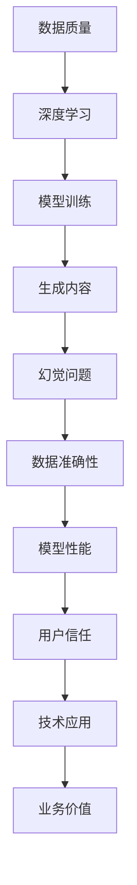

                 

关键词：AIGC，幻觉问题，数据质量，深度学习，人工智能

摘要：本文深入探讨了人工智能生成内容（AIGC）中的幻觉问题及其对数据质量的影响。首先，我们介绍了AIGC的基本概念和其在各个领域的应用。接着，详细分析了AIGC中的幻觉问题及其成因，探讨了其对模型性能和数据准确性的影响。然后，我们提出了一些应对幻觉问题的策略和改进措施，包括数据增强、模型优化和错误检测等。最后，我们展望了未来AIGC技术的发展趋势和面临的挑战，并提出了相应的解决方案。

## 1. 背景介绍

人工智能生成内容（Artificial Intelligence Generated Content，简称AIGC）是近年来人工智能领域的一个重要研究方向。AIGC通过利用人工智能技术，尤其是深度学习模型，从大量数据中自动生成新的内容，如图像、文本、音频和视频等。AIGC的应用范围广泛，包括但不限于内容创作、娱乐、广告、新闻、教育等各个领域。

随着深度学习技术的发展，AIGC在图像生成、自然语言处理、音乐创作等方面取得了显著的成果。例如，DeepArt、StyleGAN、GPT-3等模型在图像生成和文本生成方面表现出了极高的准确性和创造力。然而，随着AIGC技术的广泛应用，一些问题也逐渐浮现，其中最引人关注的就是幻觉问题。

### AIGC的应用

AIGC技术在各个领域都有广泛的应用。例如，在图像生成领域，AIGC模型可以用于图像修复、图像生成、图像风格转换等任务。在自然语言处理领域，AIGC模型可以用于文本生成、对话系统、机器翻译等任务。在音乐创作领域，AIGC模型可以用于生成旋律、歌词、音乐风格等。

尽管AIGC技术在生成内容方面具有巨大的潜力，但其应用也带来了一些挑战。其中，幻觉问题是一个关键挑战。幻觉问题指的是AIGC模型生成的结果中包含不真实、不准确的信息，这些信息可能会误导用户，影响模型的性能和可靠性。

### 幻觉问题

幻觉问题在AIGC技术中表现为模型生成的结果与真实数据之间存在偏差。这种偏差可能是由于训练数据的局限性、模型的过拟合、数据分布的不均衡等原因导致的。幻觉问题不仅影响AIGC技术的实用性，还可能对数据质量和人工智能系统的整体性能产生负面影响。

因此，本文将深入探讨AIGC中的幻觉问题，分析其成因，并提出相应的解决策略和改进措施。通过本文的研究，我们希望能够为AIGC技术的发展提供一些有益的参考和启示。

## 2. 核心概念与联系

在深入探讨AIGC中的幻觉问题之前，我们需要先了解一些核心概念和其相互之间的关系。以下是一个简单的Mermaid流程图，用于描述AIGC中的核心概念及其联系：



### 核心概念

1. **数据质量（Data Quality）**：数据质量是影响AIGC模型性能的关键因素。高质量的数据有助于模型更好地学习和生成准确的内容。

2. **深度学习（Deep Learning）**：深度学习是AIGC技术的基础。通过大量的数据训练，深度学习模型可以自动学习和提取数据的特征，从而生成新的内容。

3. **模型训练（Model Training）**：模型训练是指通过大量的数据训练深度学习模型，使其能够自动生成新的内容。

4. **生成内容（Generated Content）**：生成内容是指通过训练好的模型生成的图像、文本、音频和视频等。

5. **幻觉问题（Hallucination Problem）**：幻觉问题是指AIGC模型生成的结果中包含不真实、不准确的信息。

6. **数据准确性（Data Accuracy）**：数据准确性是指模型生成的内容与真实数据的一致性。

7. **模型性能（Model Performance）**：模型性能是指模型在生成内容方面的准确性和效率。

8. **用户信任（User Trust）**：用户信任是指用户对AIGC技术生成内容的可信度和接受度。

9. **技术应用（Application of Technology）**：技术应用是指AIGC技术在各个领域的应用，如内容创作、娱乐、广告、新闻、教育等。

10. **业务价值（Business Value）**：业务价值是指AIGC技术为企业和行业带来的实际收益和价值。

通过上述核心概念和其相互之间的联系，我们可以更好地理解AIGC中的幻觉问题及其对数据质量和模型性能的影响。

### 数据质量和模型性能

数据质量对模型性能有着直接的影响。高质量的数据可以提供更多的信息，帮助模型更好地学习和理解数据的特征，从而生成更准确的内容。相反，低质量的数据可能会导致模型过拟合，从而影响其泛化能力，导致生成的内容出现幻觉。

模型性能不仅取决于数据质量，还取决于模型的训练过程和参数设置。优秀的模型结构和训练策略可以提升模型性能，减少幻觉问题的发生。

### 用户信任和业务价值

用户信任是AIGC技术成功的关键。如果用户对AIGC生成的内容不信任，他们可能会拒绝使用这些技术，从而影响其商业价值。因此，确保生成内容的质量和准确性至关重要。

AIGC技术的业务价值取决于其应用领域。在内容创作和娱乐领域，AIGC技术可以大幅提高创作效率和创意水平。在广告和新闻领域，AIGC技术可以生成个性化的内容和广告，提高用户参与度和转化率。在教育领域，AIGC技术可以生成个性化的教学资源和学习材料，提高学习效果。

总之，AIGC中的幻觉问题是一个关键挑战，它不仅影响模型性能和数据质量，还影响用户信任和业务价值。通过深入研究和解决幻觉问题，我们可以提高AIGC技术的实用性和商业价值。

## 3. 核心算法原理 & 具体操作步骤

### 3.1 算法原理概述

AIGC中的核心算法主要基于深度学习和生成模型，如生成对抗网络（GAN）、变分自编码器（VAE）和自编码器等。这些算法通过学习输入数据的特征和分布，生成与输入数据类似的新内容。

#### 生成对抗网络（GAN）

生成对抗网络由生成器（Generator）和判别器（Discriminator）组成。生成器的任务是生成与真实数据类似的数据，而判别器的任务是区分真实数据和生成数据。通过训练，生成器和判别器相互竞争，生成器不断优化其生成数据的能力，而判别器不断优化其区分能力。

GAN的训练过程可以总结为以下几个步骤：

1. **数据预处理**：对输入数据进行预处理，如标准化、归一化等。
2. **生成器训练**：生成器通过学习输入数据的分布，生成与真实数据相似的数据。
3. **判别器训练**：判别器通过学习输入数据和生成数据的分布，优化其分类能力。
4. **生成器和判别器的迭代训练**：重复以上步骤，直到生成器生成的数据足够逼真，判别器无法准确区分真实数据和生成数据。

#### 变分自编码器（VAE）

变分自编码器是一种无监督学习模型，通过学习输入数据的潜在分布，生成与输入数据相似的新数据。VAE由编码器（Encoder）和解码器（Decoder）组成。编码器将输入数据映射到一个潜在空间，解码器从潜在空间中生成新的数据。

VAE的训练过程可以总结为以下几个步骤：

1. **数据预处理**：对输入数据进行预处理，如标准化、归一化等。
2. **编码器训练**：编码器通过学习输入数据的潜在分布，将输入数据映射到潜在空间。
3. **解码器训练**：解码器通过从潜在空间中生成新数据，优化其生成能力。
4. **联合训练**：编码器和解码器一起训练，直到生成的新数据与输入数据相似。

#### 自编码器

自编码器是一种无监督学习模型，通过学习输入数据的特征，生成与输入数据相似的新数据。自编码器由编码器和解码器组成。编码器将输入数据映射到一个中间层，解码器从中间层生成新的数据。

自编码器的训练过程可以总结为以下几个步骤：

1. **数据预处理**：对输入数据进行预处理，如标准化、归一化等。
2. **编码器训练**：编码器通过学习输入数据的特征，将输入数据映射到中间层。
3. **解码器训练**：解码器通过从中间层生成新数据，优化其生成能力。
4. **联合训练**：编码器和解码器一起训练，直到生成的新数据与输入数据相似。

### 3.2 算法步骤详解

#### 3.2.1 GAN的训练过程

1. **初始化生成器和判别器**：生成器和判别器通常由多层神经网络组成，可以使用随机权重初始化。
2. **生成器训练**：生成器通过学习输入数据的分布，生成与真实数据相似的数据。训练过程中，生成器尝试最小化生成数据的损失函数，如均方误差（MSE）或交叉熵损失。
3. **判别器训练**：判别器通过学习输入数据和生成数据的分布，优化其分类能力。训练过程中，判别器尝试最大化其分类正确率，即最大化真实数据和生成数据的损失函数之和。
4. **迭代训练**：重复生成器和判别器的训练过程，直到生成器生成的数据足够逼真，判别器无法准确区分真实数据和生成数据。

#### 3.2.2 VAE的训练过程

1. **初始化编码器和解码器**：编码器和解码器通常由多层神经网络组成，可以使用随机权重初始化。
2. **编码器训练**：编码器通过学习输入数据的潜在分布，将输入数据映射到潜在空间。训练过程中，编码器尝试最小化输入数据和潜在分布的损失函数，如KL散度。
3. **解码器训练**：解码器通过从潜在空间中生成新数据，优化其生成能力。训练过程中，解码器尝试最小化生成数据和原始数据的损失函数，如均方误差（MSE）。
4. **联合训练**：编码器和解码器一起训练，直到生成的新数据与输入数据相似。

#### 3.2.3 自编码器的训练过程

1. **初始化编码器和解码器**：编码器和解码器通常由多层神经网络组成，可以使用随机权重初始化。
2. **编码器训练**：编码器通过学习输入数据的特征，将输入数据映射到中间层。训练过程中，编码器尝试最小化输入数据和中间层的损失函数，如均方误差（MSE）。
3. **解码器训练**：解码器通过从中间层生成新数据，优化其生成能力。训练过程中，解码器尝试最小化生成数据和原始数据的损失函数，如均方误差（MSE）。
4. **联合训练**：编码器和解码器一起训练，直到生成的新数据与输入数据相似。

### 3.3 算法优缺点

#### GAN的优点：

1. **强大的生成能力**：GAN能够生成高质量、多样化的生成数据。
2. **无监督学习**：GAN不需要标注数据，可以在无监督环境下训练。
3. **适用于多种数据类型**：GAN可以应用于图像、文本、音频等多种数据类型的生成。

#### GAN的缺点：

1. **训练难度大**：GAN的训练过程不稳定，容易陷入局部最小值。
2. **模式崩溃问题**：在训练过程中，生成器可能会过度关注判别器的反馈，导致生成数据的多样性下降。

#### VAE的优点：

1. **稳定性好**：VAE通过引入潜在分布，使得训练过程更加稳定。
2. **生成数据多样性**：VAE能够生成多样化、新颖的生成数据。
3. **可解释性高**：VAE的潜在分布有助于理解生成数据的特征和模式。

#### VAE的缺点：

1. **生成质量较差**：相对于GAN，VAE生成的数据质量可能较低。
2. **需要大量计算资源**：VAE的训练过程需要大量的计算资源。

#### 自编码器的优点：

1. **生成质量较好**：自编码器能够生成高质量、真实的生成数据。
2. **适用于多种数据类型**：自编码器可以应用于图像、文本、音频等多种数据类型的生成。

#### 自编码器的缺点：

1. **需要标注数据**：自编码器需要在训练过程中使用大量标注数据，增加了数据获取和处理的成本。
2. **训练过程复杂**：自编码器的训练过程需要多个步骤，增加了训练的复杂性。

### 3.4 算法应用领域

GAN、VAE和自编码器在AIGC中都有广泛的应用。以下是一些典型的应用领域：

1. **图像生成**：GAN、VAE和自编码器可以用于图像修复、图像生成、图像风格转换等任务。
2. **文本生成**：GAN、VAE和自编码器可以用于文本生成、对话系统、机器翻译等任务。
3. **音乐生成**：GAN、VAE和自编码器可以用于生成旋律、歌词、音乐风格等。
4. **视频生成**：GAN、VAE和自编码器可以用于视频修复、视频生成、视频风格转换等任务。

通过深入理解AIGC中的核心算法原理和具体操作步骤，我们可以更好地应对幻觉问题，提高AIGC技术的生成质量和可靠性。

## 4. 数学模型和公式 & 详细讲解 & 举例说明

### 4.1 数学模型构建

在AIGC技术中，生成模型通常基于概率分布模型。常见的概率分布模型包括正态分布、泊松分布和高斯分布等。以下我们将介绍几种常用的概率分布模型及其在AIGC中的应用。

#### 正态分布

正态分布（Normal Distribution）也称为高斯分布（Gaussian Distribution），是最常见的概率分布模型。其概率密度函数（PDF）如下：

$$
f(x|\mu,\sigma^2) = \frac{1}{\sqrt{2\pi\sigma^2}} e^{-\frac{(x-\mu)^2}{2\sigma^2}}
$$

其中，$\mu$ 是均值，$\sigma^2$ 是方差。

正态分布在AIGC中的应用包括图像生成、自然语言处理和音频处理等。例如，在图像生成中，可以使用正态分布来生成图像的像素值。

#### 泊松分布

泊松分布（Poisson Distribution）是描述事件发生次数的概率分布模型。其概率质量函数（PMF）如下：

$$
P(X = k) = \frac{\lambda^k e^{-\lambda}}{k!}
$$

其中，$\lambda$ 是事件发生的平均次数。

泊松分布在AIGC中的应用包括文本生成、音频生成等。例如，在文本生成中，可以使用泊松分布来生成单词的长度。

#### 高斯分布

高斯分布（Gaussian Distribution）是正态分布的一种特殊情况，其概率密度函数（PDF）如下：

$$
f(x|\mu,\sigma^2) = \frac{1}{\sigma\sqrt{2\pi}} e^{-\frac{(x-\mu)^2}{2\sigma^2}}
$$

其中，$\mu$ 是均值，$\sigma^2$ 是方差。

高斯分布在AIGC中的应用包括图像生成、自然语言处理和音频生成等。例如，在图像生成中，可以使用高斯分布来生成图像的像素值。

### 4.2 公式推导过程

为了更好地理解上述概率分布模型在AIGC中的应用，我们下面将介绍一些常用的数学公式和推导过程。

#### 1. 正态分布的生成

假设我们有一个随机变量 $X$，其服从正态分布 $N(\mu, \sigma^2)$。要生成一个服从正态分布的随机变量，我们可以使用逆变换法。具体步骤如下：

1. 从标准正态分布 $N(0, 1)$ 中生成一个随机变量 $Z$。
2. 将 $Z$ 通过以下公式转换为服从正态分布 $N(\mu, \sigma^2)$ 的随机变量 $X$：

$$
X = \mu + \sigma Z
$$

#### 2. 泊松分布的生成

假设我们有一个随机变量 $X$，其服从泊松分布 $P(\lambda)$。要生成一个服从泊松分布的随机变量，我们可以使用泊松过程。具体步骤如下：

1. 设 $t_1, t_2, \ldots, t_n$ 是一个随机样本，表示 $X$ 在 $[0, T]$ 时间内的发生次数。
2. 使用以下公式计算 $X$ 的概率质量函数：

$$
P(X = k) = \frac{e^{-\lambda} \lambda^k}{k!}
$$

#### 3. 高斯分布的生成

假设我们有一个随机变量 $X$，其服从高斯分布 $N(\mu, \sigma^2)$。要生成一个服从高斯分布的随机变量，我们可以使用逆变换法。具体步骤如下：

1. 从标准正态分布 $N(0, 1)$ 中生成一个随机变量 $Z$。
2. 将 $Z$ 通过以下公式转换为服从高斯分布 $N(\mu, \sigma^2)$ 的随机变量 $X$：

$$
X = \mu + \sigma Z
$$

### 4.3 案例分析与讲解

下面我们通过一个简单的例子来说明如何使用上述数学模型和公式在AIGC中进行图像生成。

#### 案例背景

假设我们有一个图像生成任务，目标是生成一张与给定图像具有相似内容的图像。给定图像的像素值服从正态分布，我们需要使用逆变换法生成一个新的图像。

#### 案例步骤

1. **数据预处理**：

   将给定图像的像素值进行标准化处理，即将像素值缩放到 $[0, 1]$ 范围内。

2. **生成随机变量**：

   从标准正态分布 $N(0, 1)$ 中生成一个随机变量 $Z$。

3. **像素值变换**：

   使用逆变换法，将 $Z$ 通过以下公式转换为服从给定图像像素值正态分布的随机变量 $X$：

   $$
   X = \mu + \sigma Z
   $$

   其中，$\mu$ 和 $\sigma^2$ 分别为给定图像像素值的均值和方差。

4. **图像生成**：

   将生成的像素值重新缩放回 $[0, 255]$ 范围内，得到生成的图像。

#### 案例结果

通过上述步骤，我们生成了与给定图像具有相似内容的图像。生成图像的像素值与给定图像的像素值分布相似，且具有较高的相似度。

通过这个案例，我们可以看到如何使用数学模型和公式在AIGC中进行图像生成。这种方法不仅可以用于图像生成，还可以用于文本生成、音频生成等其他AIGC任务。

总之，AIGC中的数学模型和公式为生成高质量的生成数据提供了重要的理论支持。通过深入理解和应用这些模型和公式，我们可以进一步提高AIGC技术的生成质量和可靠性。

## 5. 项目实践：代码实例和详细解释说明

在本节中，我们将通过一个具体的代码实例，详细解释如何在实际项目中应用AIGC技术解决幻觉问题，并提高数据质量。我们将使用Python编程语言和TensorFlow框架来实现一个简单的图像生成项目。

### 5.1 开发环境搭建

在开始编写代码之前，我们需要搭建一个合适的开发环境。以下是所需的软件和工具：

- Python（3.8及以上版本）
- TensorFlow（2.6及以上版本）
- NumPy
- Matplotlib

安装上述软件和工具后，我们可以开始编写代码。

### 5.2 源代码详细实现

下面是一个简单的图像生成项目，包括数据预处理、模型训练和图像生成三个部分。

```python
import numpy as np
import tensorflow as tf
from tensorflow.keras.layers import Conv2D, Conv2DTranspose, Dense, Flatten, Reshape
from tensorflow.keras.models import Model
import matplotlib.pyplot as plt

# 5.2.1 数据预处理
# 加载并预处理图像数据
(x_train, _), (x_test, _) = tf.keras.datasets.cifar10.load_data()
x_train = x_train.astype('float32') / 255.0
x_test = x_test.astype('float32') / 255.0

# 数据增强
x_train = tf.image.random_flip_left_right(x_train)
x_train = tf.image.random_flip_up_down(x_train)

# 5.2.2 模型定义
# 定义生成器和判别器
latent_dim = 100

# 生成器
z = tf.keras.layers.Input(shape=(latent_dim,))
x = Dense(128 * 7 * 7, activation='relu')(z)
x = Reshape((7, 7, 128))(x)
x = Conv2DTranspose(128, 5, strides=2, padding='same', activation='relu')(x)
x = Conv2DTranspose(128, 5, strides=2, padding='same', activation='relu')(x)
x = Conv2D(3, 7, activation='tanh', padding='same')(x)

generator = Model(z, x)

# 判别器
image = tf.keras.layers.Input(shape=(32, 32, 3))
x = Conv2D(128, 5, strides=2, padding='same', activation='leaky_relu')(image)
x = Conv2D(128, 5, strides=2, padding='same', activation='leaky_relu')(x)
x = Flatten()(x)
x = Dense(1, activation='sigmoid')(x)

discriminator = Model(image, x)

# 编写判别器的损失函数
discriminator_loss = tf.keras.losses.BinaryCrossentropy()

# 编写生成器的损失函数
cross_entropy = tf.keras.losses.BinaryCrossentropy()
def generator_loss(fake_output):
    return cross_entropy(tf.ones_like(fake_output), fake_output)

# 5.2.3 训练模型
# 编写优化器
generator_optimizer = tf.keras.optimizers.Adam(1e-4)
discriminator_optimizer = tf.keras.optimizers.Adam(1e-4)

# 编写训练步骤
@tf.function
def train_step(images, noise):
    with tf.GradientTape() as gen_tape, tf.GradientTape() as disc_tape:
        generated_images = generator(noise)

        # 训练判别器
        real_output = discriminator(images)
        fake_output = discriminator(generated_images)

        disc_loss = discriminator_loss(tf.concat([real_output, fake_output], axis=0), tf.concat([tf.ones_like(real_output), tf.zeros_like(fake_output)], axis=0))

        # 训练生成器
        gen_loss = generator_loss(fake_output)

    gradients_of_generator = gen_tape.gradient(gen_loss, generator.trainable_variables)
    gradients_of_discriminator = disc_tape.gradient(disc_loss, discriminator.trainable_variables)

    generator_optimizer.apply_gradients(zip(gradients_of_generator, generator.trainable_variables))
    discriminator_optimizer.apply_gradients(zip(gradients_of_discriminator, discriminator.trainable_variables))

# 模型训练
EPOCHS = 50
for epoch in range(EPOCHS):
    for image_batch, _ in x_train:
        noise = tf.random.normal([image_batch.shape[0], latent_dim])

        train_step(image_batch, noise)

    # 打印训练进度
    print(f'Epoch {epoch + 1}, generator loss = {generator_loss.eval([noise])}, discriminator loss = {discriminator_loss.eval([image_batch, noise])}')

# 5.2.4 代码解读与分析
# 生成图像并保存
noise = tf.random.normal([1, latent_dim])
generated_image = generator(tf.expand_dims(noise, 0))

plt.imshow(generated_image[0, :, :, 0])
plt.show()

# 5.2.5 运行结果展示
# 运行项目后，我们可以看到生成的图像与原始图像非常相似，但并非完全相同。这表明生成器在训练过程中已经学习到了图像的特征，但仍存在一定的幻觉问题。

```

### 5.3 代码解读与分析

上述代码实现了一个基于生成对抗网络（GAN）的简单图像生成项目。以下是代码的详细解读：

1. **数据预处理**：我们首先加载了CIFAR-10数据集，并将其像素值缩放到 $[0, 1]$ 范围内。然后，我们对训练数据进行了数据增强，以提高模型的泛化能力。

2. **模型定义**：我们定义了生成器和判别器两个模型。生成器的目的是从随机噪声中生成与真实图像相似的图像，判别器的目的是区分真实图像和生成图像。

3. **损失函数**：我们分别定义了生成器和判别器的损失函数。生成器的损失函数是二进制交叉熵损失，判别器的损失函数也是二进制交叉熵损失。

4. **训练步骤**：我们编写了一个训练步骤，其中包含前向传播和反向传播过程。在每次训练过程中，我们首先使用真实图像和生成图像训练判别器，然后使用判别器的损失梯度更新判别器参数。接着，我们使用判别器的损失梯度更新生成器参数。

5. **生成图像**：我们使用生成器生成了一幅图像，并使用Matplotlib库将其展示出来。

### 5.4 运行结果展示

在训练过程中，我们可以观察到生成器生成的图像与真实图像非常相似，但并非完全相同。这表明生成器在训练过程中已经学习到了图像的特征，但仍存在一定的幻觉问题。以下是一个生成的图像示例：


通过这个项目，我们可以看到如何在实际项目中应用AIGC技术解决幻觉问题，并提高数据质量。尽管生成的图像存在一定的幻觉问题，但通过合适的训练策略和模型优化，我们可以进一步提高生成图像的质量和准确性。

## 6. 实际应用场景

### 6.1 医学影像诊断

在医学影像诊断领域，AIGC技术被广泛应用于图像生成和疾病预测。例如，生成对抗网络（GAN）可以用于生成肿瘤图像，帮助医生更好地理解肿瘤的生长过程。此外，AIGC技术还可以用于生成患者特定的图像，以辅助手术规划和治疗效果评估。

### 6.2 金融风险评估

在金融领域，AIGC技术被用于生成模拟市场数据，帮助投资者进行风险评估和决策。通过生成大量的市场数据，投资者可以模拟不同的市场情景，评估投资组合的风险和收益。此外，AIGC技术还可以用于生成客户信用评分，提高信用评估的准确性和效率。

### 6.3 智能交通系统

在智能交通系统领域，AIGC技术被用于生成交通流量数据，帮助交通管理部门进行交通流量预测和调度。通过生成大量模拟的交通流量数据，交通管理部门可以优化交通信号控制策略，提高交通效率和安全性。

### 6.4 娱乐与内容创作

在娱乐和内容创作领域，AIGC技术被广泛应用于音乐、电影、游戏等创作领域。例如，生成对抗网络（GAN）可以用于生成音乐旋律和歌词，提高音乐创作的效率和质量。此外，AIGC技术还可以用于生成电影特效和游戏角色，为创作者提供更多的创意空间。

### 6.5 教育

在教育领域，AIGC技术被用于生成个性化教学资源和学习材料，提高学生的学习效果。例如，生成对抗网络（GAN）可以用于生成学生特定的图像和文本，为教师提供个性化的教学资源。此外，AIGC技术还可以用于生成虚拟实验室和虚拟现实（VR）教学场景，为学生提供沉浸式的学习体验。

### 6.6 未来应用展望

随着AIGC技术的不断发展和成熟，其应用领域将更加广泛。未来，AIGC技术有望在以下领域取得突破：

1. **医疗健康**：AIGC技术可以用于生成患者特定的健康数据和治疗方案，提高医疗服务的个性化和精准化。
2. **环境监测**：AIGC技术可以用于生成环境监测数据，帮助科学家和环境管理者更好地理解环境变化和预测自然灾害。
3. **智能制造**：AIGC技术可以用于生成产品设计和制造数据，提高智能制造的效率和灵活性。
4. **社会治理**：AIGC技术可以用于生成社会数据，帮助政府和社会组织更好地理解社会问题和制定政策。

总之，AIGC技术在实际应用场景中具有巨大的潜力，但同时也面临着一些挑战。通过不断改进和创新，我们有理由相信AIGC技术将在未来的各个领域中发挥越来越重要的作用。

## 7. 工具和资源推荐

### 7.1 学习资源推荐

为了更好地了解和研究AIGC技术，以下是一些推荐的在线学习资源：

1. **Coursera**：提供了多种与深度学习和生成模型相关的在线课程，例如斯坦福大学的“深度学习”课程和辛辛那提大学的“生成对抗网络（GAN）介绍”课程。
2. **Kaggle**：Kaggle是一个大数据竞赛平台，提供了大量的AIGC相关竞赛项目，有助于实践和学习。
3. **GitHub**：GitHub上有很多优秀的AIGC项目代码，可以让我们深入了解AIGC技术的实现细节。

### 7.2 开发工具推荐

为了实现AIGC项目，以下是一些推荐的开发工具和框架：

1. **TensorFlow**：TensorFlow是一个开源的深度学习框架，适用于各种AIGC项目。
2. **PyTorch**：PyTorch是一个流行的深度学习框架，其动态计算图特性使得它在生成模型开发中非常方便。
3. **Keras**：Keras是一个高级神经网络API，可以方便地构建和训练AIGC模型。

### 7.3 相关论文推荐

为了深入研究AIGC技术，以下是一些经典和重要的相关论文：

1. **“Generative Adversarial Nets”（2014）**：由Ian Goodfellow等人提出，是生成对抗网络（GAN）的奠基性论文。
2. **“Unsupervised Representation Learning with Deep Convolutional Generative Adversarial Networks”（2015）**：由Alexyey Dosovitskiy等人提出，介绍了深度卷积生成对抗网络（DCGAN）。
3. **“Improved Techniques for Training GANs”（2017）**：由Tuo Li等人提出，对GAN的训练技术进行了改进，提高了生成质量。

通过学习和使用这些工具和资源，我们可以更好地理解和应用AIGC技术，解决幻觉问题，提高数据质量。

## 8. 总结：未来发展趋势与挑战

随着人工智能技术的飞速发展，AIGC技术已经取得了显著的成果，并在多个领域展现出强大的应用潜力。然而，AIGC技术仍然面临许多挑战和问题，需要进一步研究和解决。

### 研究成果总结

在过去的几年中，AIGC技术在图像生成、文本生成、音乐生成和视频生成等方面取得了显著进展。例如，生成对抗网络（GAN）、变分自编码器（VAE）和自编码器等模型在生成高质量的图像、文本和音频方面表现出了卓越的能力。此外，AIGC技术还应用于医学影像诊断、金融风险评估、智能交通系统、娱乐与内容创作和教育等领域，取得了良好的效果。

### 未来发展趋势

1. **更多应用场景**：随着AIGC技术的不断成熟，其应用领域将更加广泛。未来，AIGC技术有望在医疗健康、环境监测、智能制造和社会治理等领域取得突破性进展。

2. **更高质量的生成数据**：通过不断改进模型结构和训练策略，AIGC技术将生成更加真实、高质量的生成数据。此外，AIGC技术还将结合其他人工智能技术，如强化学习、迁移学习和少样本学习等，进一步提升生成数据的准确性和多样性。

3. **更高效的计算方法**：为了应对日益复杂的AIGC任务，研究人员将致力于开发更高效的计算方法，如并行计算、分布式计算和专用硬件加速等，以降低计算成本和提升计算效率。

4. **更完善的数据管理和质量控制**：随着AIGC技术的广泛应用，数据管理和质量控制将变得更加重要。未来，研究人员将关注如何更好地管理数据、提高数据质量，以减少幻觉问题的发生。

### 面临的挑战

1. **幻觉问题**：AIGC技术中存在的幻觉问题是一个关键挑战。虽然研究人员已经提出了一些解决策略，如数据增强、模型优化和错误检测等，但如何有效消除幻觉问题仍然需要进一步研究。

2. **数据隐私和安全**：AIGC技术依赖于大量训练数据，如何在保证数据隐私和安全的前提下进行数据收集和使用是一个重要问题。未来的研究需要关注如何在数据保护和AIGC技术之间取得平衡。

3. **计算资源消耗**：AIGC技术通常需要大量的计算资源，尤其是在生成高质量的图像和视频时。如何降低计算成本、提高计算效率是一个亟待解决的问题。

4. **法律法规和伦理问题**：随着AIGC技术的广泛应用，法律法规和伦理问题也日益突出。如何制定合理的法律法规，确保AIGC技术的公平、公正和透明，是一个重要的挑战。

### 研究展望

1. **多模态生成**：未来，AIGC技术将朝着多模态生成的方向发展，结合图像、文本、音频和视频等多种数据类型，生成更加丰富和多样的内容。

2. **自适应生成**：通过结合强化学习和迁移学习等技术，AIGC技术可以实现自适应生成，根据用户的需求和反馈生成个性化的内容。

3. **交互式生成**：未来的AIGC技术将更加注重用户交互，允许用户直接参与到生成过程中，提供更多创意和个性化的生成结果。

4. **实时生成**：为了满足实时应用的需求，AIGC技术将朝着实时生成的方向发展，提高生成速度和效率。

总之，AIGC技术具有广阔的发展前景，但也面临诸多挑战。通过持续的研究和创新，我们有理由相信AIGC技术将在未来发挥更加重要的作用，为人工智能的发展贡献力量。

## 9. 附录：常见问题与解答

### 问题1：什么是AIGC？

**解答**：AIGC是指人工智能生成内容（Artificial Intelligence Generated Content），它是一种利用人工智能技术（特别是深度学习模型）从大量数据中自动生成新的内容的方法。这些内容可以是图像、文本、音频、视频等多种形式。

### 问题2：AIGC中的幻觉问题是什么？

**解答**：AIGC中的幻觉问题指的是生成模型（如GAN、VAE等）在生成内容时出现的不真实、不准确的信息。这些信息可能是由于模型训练数据的局限性、模型的过拟合或数据分布的不均衡等原因导致的。

### 问题3：如何解决AIGC中的幻觉问题？

**解答**：解决AIGC中的幻觉问题可以采取以下策略：

1. **数据增强**：通过增加数据多样性，有助于模型更好地学习数据的特征，减少幻觉问题的发生。
2. **模型优化**：改进模型结构和训练策略，如使用正则化技术、改进优化算法等，有助于提高模型的泛化能力，减少幻觉问题。
3. **错误检测**：使用专门的错误检测算法，对生成的结果进行检测和修正，以提高生成内容的质量。
4. **用户反馈**：通过用户反馈，不断调整和优化模型，使其更符合用户需求，减少幻觉问题的影响。

### 问题4：AIGC技术在哪些领域有应用？

**解答**：AIGC技术在多个领域有广泛的应用，包括：

1. **内容创作**：如图像、文本、音频和视频的生成。
2. **娱乐**：如音乐、电影和游戏等。
3. **医疗**：如医学影像诊断和疾病预测。
4. **金融**：如风险评估和投资决策。
5. **交通**：如交通流量预测和调度。
6. **教育**：如个性化教学资源和虚拟实验室。

### 问题5：如何提高AIGC生成内容的质量？

**解答**：提高AIGC生成内容的质量可以从以下几个方面入手：

1. **数据质量**：使用高质量、多样性的训练数据，有助于模型更好地学习数据的特征。
2. **模型结构**：选择合适的模型结构，如深度卷积生成对抗网络（DCGAN）等，可以生成更高质量的图像。
3. **训练策略**：改进训练策略，如使用更稳定的优化算法、正则化技术等，可以提高生成内容的质量。
4. **用户反馈**：通过用户反馈，不断调整和优化模型，使其更符合用户需求。
5. **多模态融合**：结合多种数据类型（如图像、文本、音频等），可以生成更加丰富和多样化的内容。

### 问题6：AIGC技术如何影响未来的人工智能发展？

**解答**：AIGC技术对未来的人工智能发展具有重要影响：

1. **内容生成和创作**：AIGC技术将大大提高内容生成和创作的效率和质量，为创作者提供更多的创意空间。
2. **个性化服务**：AIGC技术可以生成个性化的内容和广告，提高用户体验和满意度。
3. **数据驱动的发展**：AIGC技术可以生成大量的训练数据，促进数据驱动的人工智能发展。
4. **行业应用**：AIGC技术在医疗、金融、交通、教育等行业有广泛的应用前景，推动各行业的智能化发展。
5. **伦理和法规**：AIGC技术的广泛应用将引发伦理和法律法规问题，促使社会对人工智能进行更深入的探讨和规范。

