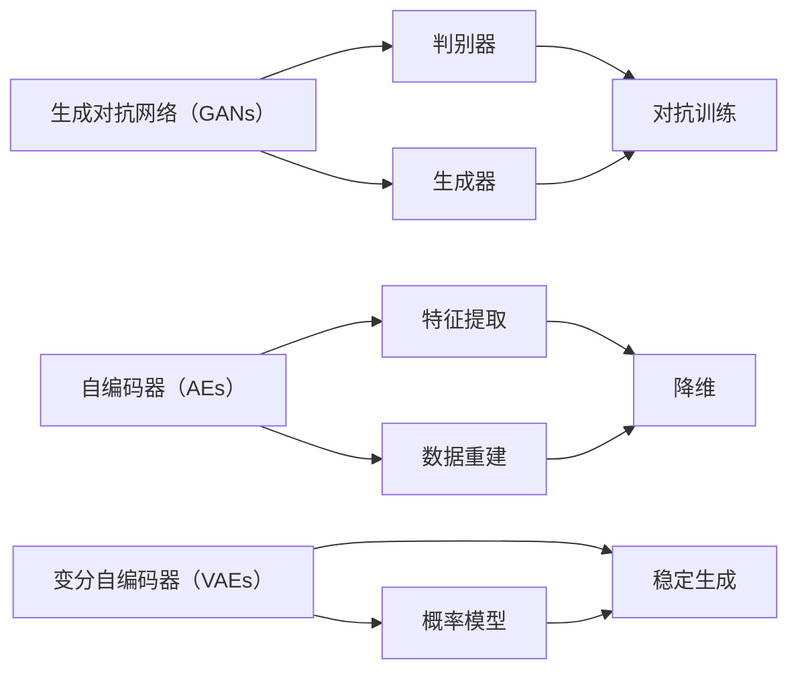

                 

关键词：人工智能，生成内容，内容生成，AIGC，应用场景，数学模型，算法，技术趋势。

> 摘要：本文将深入探讨AIGC（AI Generated Content）这一前沿技术，分析其核心概念、应用场景、算法原理、数学模型及其未来发展趋势。通过详细的案例分析，我们将揭示AIGC在现代社会中的巨大潜力和挑战。

## 1. 背景介绍

随着人工智能技术的快速发展，生成内容（Generated Content，简称GC）逐渐成为一个重要的研究领域。AIGC作为GC的高级形式，通过人工智能算法自动生成高质量的内容，已经成为众多行业的热点应用。从文本到图像，从视频到音频，AIGC技术正在改变内容创作的传统模式，为各个领域带来创新和变革。

本文旨在全面介绍AIGC的核心概念、算法原理、应用场景以及未来发展，帮助读者深入了解这一前沿技术，并探索其在实际应用中的潜力和挑战。

### 1.1 AIGC的定义和核心特点

AIGC是指通过人工智能技术，特别是生成对抗网络（GANs）、自编码器（AEs）、变分自编码器（VAEs）等算法，自动生成高质量内容的过程。其核心特点包括：

- **高度自动化**：AIGC能够自动从大量数据中学习，生成与输入数据相似或全新的内容。
- **多样性**：AIGC能够生成具有高度多样性的内容，满足不同用户的需求。
- **灵活性**：AIGC可以根据不同的应用场景进行调整，实现从文本、图像到音频的多样化生成。
- **高效性**：AIGC通过大规模并行计算和深度学习技术，能够高效地生成内容。

### 1.2 AIGC的发展历程

AIGC技术起源于生成对抗网络（GANs）的提出。2014年，Ian Goodfellow等人在论文《Generative Adversarial Nets》中首次提出GANs，并引起了广泛关注。随后，GANs在图像生成、视频生成、文本生成等领域取得了显著成果。在此基础上，AIGC技术不断发展，引入了自编码器（AEs）、变分自编码器（VAEs）等多种生成模型，实现了更高质量和更多样化的内容生成。

## 2. 核心概念与联系

在深入了解AIGC之前，我们需要明确几个核心概念和它们之间的联系。以下是AIGC中几个关键概念的简要介绍及其相互关系：

### 2.1 生成对抗网络（GANs）

生成对抗网络（GANs）由生成器（Generator）和判别器（Discriminator）组成。生成器试图生成与真实数据相似的数据，而判别器则判断输入的数据是真实数据还是生成数据。两者相互竞争，不断优化，最终生成器能够生成高度真实的数据。

### 2.2 自编码器（AEs）

自编码器（AEs）是一种无监督学习算法，通过将输入数据压缩为低维特征表示，然后重建原始数据。自编码器在特征提取和降维方面具有显著优势，可以用于图像、文本、音频等多种类型的生成任务。

### 2.3 变分自编码器（VAEs）

变分自编码器（VAEs）是AEs的一种变体，通过引入概率模型，实现了更稳定的生成效果。VAEs在生成图像、视频、文本等方面具有广泛应用。

### 2.4 关联图

以下是AIGC核心概念之间的关联图：



通过上述关联图，我们可以清晰地看到AIGC中各个核心概念之间的联系和相互作用。

## 3. 核心算法原理 & 具体操作步骤

### 3.1 算法原理概述

AIGC的核心算法包括生成对抗网络（GANs）、自编码器（AEs）和变分自编码器（VAEs）。以下是这些算法的基本原理概述：

### 3.2 算法步骤详解

#### 3.2.1 GANs

1. 初始化生成器G和判别器D。
2. 判别器D训练：使用真实数据和生成数据训练判别器，使其能够区分真实数据和生成数据。
3. 生成器G训练：生成虚假数据，使用判别器D对其进行评估，并优化生成器G。
4. 循环迭代步骤2和3，直到生成器G能够生成高质量的数据。

#### 3.2.2 AEs

1. 初始化编码器E和解码器G。
2. 编码器E训练：将输入数据编码为低维特征表示。
3. 解码器G训练：将低维特征表示解码为原始数据。
4. 使用损失函数优化编码器E和解码器G。

#### 3.2.3 VAEs

1. 初始化编码器E和解码器G，以及潜在变量分布参数。
2. 编码器E训练：将输入数据编码为潜在变量，同时估计潜在变量的分布参数。
3. 解码器G训练：将潜在变量解码为原始数据。
4. 使用损失函数优化编码器E、解码器G以及潜在变量分布参数。

### 3.3 算法优缺点

#### 优缺点

- **GANs**：优点包括强大的生成能力和高度多样性的生成内容；缺点包括训练不稳定、生成质量难以保证。
- **AEs**：优点包括易于实现、生成质量较好；缺点包括生成多样性不足、训练时间较长。
- **VAEs**：优点包括稳定性好、生成质量较高；缺点包括生成多样性不足、训练时间较长。

### 3.4 算法应用领域

AIGC算法在多个领域具有广泛应用，主要包括：

- **图像生成**：用于生成高质量、多样化的图像，应用于图像修复、图像增强、图像风格转换等。
- **视频生成**：用于生成高质量、连续的视频序列，应用于视频合成、视频增强、视频风格转换等。
- **文本生成**：用于生成高质量、多样化的文本，应用于自然语言生成、机器翻译、文本摘要等。
- **音频生成**：用于生成高质量、多样化的音频，应用于音乐生成、声音合成、语音转换等。

## 4. 数学模型和公式 & 详细讲解 & 举例说明

### 4.1 数学模型构建

AIGC算法的核心是基于深度学习模型，主要包括生成对抗网络（GANs）、自编码器（AEs）和变分自编码器（VAEs）。以下是这些算法的基本数学模型：

### 4.1.1 GANs

GANs由生成器G和判别器D组成，其数学模型如下：

- 生成器G的损失函数： 
  $$ L_G = -\log(D(G(z))) $$
- 判别器D的损失函数：
  $$ L_D = -[\log(D(x)) + \log(1 - D(G(z)))] $$

其中，$x$ 表示真实数据，$z$ 表示生成器的输入噪声，$G(z)$ 表示生成器生成的数据。

### 4.1.2 AEs

AEs的数学模型如下：

- 编码器E的损失函数：
  $$ L_E = \frac{1}{n}\sum_{i=1}^{n}||x_i - \hat{x}_i||_2^2 $$
- 解码器G的损失函数：
  $$ L_G = \frac{1}{n}\sum_{i=1}^{n}||x_i - \hat{x}_i||_2^2 $$

其中，$x_i$ 表示输入数据，$\hat{x}_i$ 表示解码器生成的数据。

### 4.1.3 VAEs

VAEs的数学模型如下：

- 编码器E的损失函数：
  $$ L_E = \frac{1}{n}\sum_{i=1}^{n}\left[\log(p(x|z)) + \beta D_KL(q(z|x)||p(z))\right] $$
- 解码器G的损失函数：
  $$ L_G = \frac{1}{n}\sum_{i=1}^{n}||x_i - \hat{x}_i||_2^2 $$
- 潜在变量分布参数的损失函数：
  $$ L_{KL} = \frac{1}{n}\sum_{i=1}^{n}D_KL(q(z|x)||p(z)) $$

其中，$p(x|z)$ 表示输入数据在潜在变量$z$的条件分布，$q(z|x)$ 表示编码器对潜在变量$z$的估计分布，$p(z)$ 表示潜在变量的先验分布，$D_KL$ 表示KL散度。

### 4.2 公式推导过程

以下是对AIGC核心算法的数学模型进行推导的过程：

#### 4.2.1 GANs

GANs的核心是生成器G和判别器D的对抗训练。生成器的目标是生成尽可能逼真的数据，使判别器无法区分真实数据和生成数据。判别器的目标是准确判断输入数据是真实数据还是生成数据。

1. **生成器G的损失函数推导**

   生成器的损失函数为：
   $$ L_G = -\log(D(G(z))) $$

   其中，$D(G(z))$ 表示判别器对生成数据的判断概率。

   推导过程如下：

   生成器G的目的是最小化损失函数$L_G$，即使$D(G(z))$ 接近1。这意味着生成器生成的数据应该尽量逼真，使判别器难以区分。

2. **判别器D的损失函数推导**

   判别器的损失函数为：
   $$ L_D = -[\log(D(x)) + \log(1 - D(G(z)))] $$

   其中，$D(x)$ 表示判别器对真实数据的判断概率，$D(G(z))$ 表示判别器对生成数据的判断概率。

   推导过程如下：

   判别器D的目的是最大化损失函数$L_D$，即使$D(x)$ 接近1，$D(G(z))$ 接近0。这样判别器才能准确区分真实数据和生成数据。

#### 4.2.2 AEs

AEs的核心是通过编码器E将输入数据编码为低维特征表示，然后通过解码器G将特征表示解码为原始数据。

1. **编码器E的损失函数推导**

   编码器E的损失函数为：
   $$ L_E = \frac{1}{n}\sum_{i=1}^{n}||x_i - \hat{x}_i||_2^2 $$

   其中，$x_i$ 表示输入数据，$\hat{x}_i$ 表示解码器生成的数据。

   推导过程如下：

   编码器E的目的是最小化损失函数$L_E$，即使$x_i$ 和$\hat{x}_i$ 的距离最小。这表示编码器应该能够准确提取输入数据的特征。

2. **解码器G的损失函数推导**

   解码器G的损失函数为：
   $$ L_G = \frac{1}{n}\sum_{i=1}^{n}||x_i - \hat{x}_i||_2^2 $$

   其中，$x_i$ 表示输入数据，$\hat{x}_i$ 表示解码器生成的数据。

   推导过程如下：

   解码器G的目的是最小化损失函数$L_G$，即使$x_i$ 和$\hat{x}_i$ 的距离最小。这表示解码器应该能够准确重构输入数据。

#### 4.2.3 VAEs

VAEs的核心是通过编码器E将输入数据编码为潜在变量$z$，然后通过解码器G将潜在变量解码为原始数据。

1. **编码器E的损失函数推导**

   编码器E的损失函数为：
   $$ L_E = \frac{1}{n}\sum_{i=1}^{n}\left[\log(p(x|z)) + \beta D_KL(q(z|x)||p(z))\right] $$

   其中，$p(x|z)$ 表示输入数据在潜在变量$z$的条件分布，$q(z|x)$ 表示编码器对潜在变量$z$的估计分布，$p(z)$ 表示潜在变量的先验分布，$\beta$ 是调节参数。

   推导过程如下：

   编码器E的目的是最小化损失函数$L_E$，即使$p(x|z)$ 和$q(z|x)$ 的差异最小，同时使$q(z|x)$ 与$p(z)$ 的差异最小。

2. **解码器G的损失函数推导**

   解码器G的损失函数为：
   $$ L_G = \frac{1}{n}\sum_{i=1}^{n}||x_i - \hat{x}_i||_2^2 $$

   其中，$x_i$ 表示输入数据，$\hat{x}_i$ 表示解码器生成的数据。

   推导过程如下：

   解码器G的目的是最小化损失函数$L_G$，即使$x_i$ 和$\hat{x}_i$ 的距离最小。这表示解码器应该能够准确重构输入数据。

3. **潜在变量分布参数的损失函数推导**

   潜在变量分布参数的损失函数为：
   $$ L_{KL} = \frac{1}{n}\sum_{i=1}^{n}D_KL(q(z|x)||p(z)) $$

   其中，$q(z|x)$ 表示编码器对潜在变量$z$的估计分布，$p(z)$ 表示潜在变量的先验分布。

   推导过程如下：

   潜在变量分布参数的目的是最小化损失函数$L_{KL}$，即使$q(z|x)$ 与$p(z)$ 的差异最小。这表示编码器应该能够准确估计潜在变量的分布。

### 4.3 案例分析与讲解

以下是对AIGC算法在实际应用中的案例分析，以及相关的数学模型和公式。

#### 4.3.1 图像生成

图像生成是AIGC的一个重要应用领域。以下是一个使用GANs进行图像生成的案例：

1. **生成器G**

   生成器G的目标是生成逼真的图像。其数学模型为：
   $$ G(z) = \sigma(W_Gz + b_G) $$

   其中，$z$ 是生成器的输入噪声，$W_G$ 和$b_G$ 是生成器的权重和偏置，$\sigma$ 是激活函数。

2. **判别器D**

   判别器D的目标是区分真实图像和生成图像。其数学模型为：
   $$ D(x) = \sigma(W_Dx + b_D) $$

   其中，$x$ 是真实图像，$W_D$ 和$b_D$ 是判别器的权重和偏置，$\sigma$ 是激活函数。

3. **训练过程**

   在训练过程中，生成器和判别器相互对抗，通过迭代优化，最终生成逼真的图像。

4. **损失函数**

   生成器G的损失函数为：
   $$ L_G = -\log(D(G(z))) $$

   判别器D的损失函数为：
   $$ L_D = -[\log(D(x)) + \log(1 - D(G(z)))] $$

#### 4.3.2 文本生成

文本生成是AIGC的另一个重要应用领域。以下是一个使用VAEs进行文本生成的案例：

1. **编码器E**

   编码器E的目标是将输入文本编码为潜在变量。其数学模型为：
   $$ z = \mu(x) + \sigma(x)\sqrt{1 - \rho^2} $$

   其中，$\mu(x)$ 和$\sigma(x)$ 分别是编码器对潜在变量均值和标准差的估计，$\rho$ 是潜在变量之间的相关性。

2. **解码器G**

   解码器G的目标是将潜在变量解码为输出文本。其数学模型为：
   $$ x' = \text{softmax}(W_Gz + b_G) $$

   其中，$z$ 是编码器生成的潜在变量，$W_G$ 和$b_G$ 是解码器的权重和偏置。

3. **训练过程**

   在训练过程中，编码器E和解码器G相互对抗，通过迭代优化，最终生成高质量的文本。

4. **损失函数**

   编码器E的损失函数为：
   $$ L_E = \frac{1}{n}\sum_{i=1}^{n}\left[\log(p(x|z)) + \beta D_KL(q(z|x)||p(z))\right] $$

   解码器G的损失函数为：
   $$ L_G = \frac{1}{n}\sum_{i=1}^{n}||x_i - \hat{x}_i||_2^2 $$

## 5. 项目实践：代码实例和详细解释说明

### 5.1 开发环境搭建

在进行AIGC项目的实践之前，我们需要搭建一个合适的开发环境。以下是使用Python和TensorFlow搭建AIGC开发环境的基本步骤：

1. 安装Python（建议使用Python 3.7及以上版本）。
2. 安装TensorFlow库，可以使用以下命令：
   ```bash
   pip install tensorflow
   ```

### 5.2 源代码详细实现

以下是使用TensorFlow实现一个简单的AIGC项目，包括生成器G、判别器D的代码实现，以及训练和评估的过程。

#### 5.2.1 生成器G

```python
import tensorflow as tf
from tensorflow.keras.layers import Dense, Flatten, Reshape
from tensorflow.keras.models import Model

def build_generator(z_dim):
    # 输入层
    z = Input(shape=(z_dim,))
    
    # 隐藏层
    x = Dense(128, activation='relu')(z)
    x = Dense(256, activation='relu')(x)
    
    # 输出层
    x = Dense(784, activation='tanh')(x)
    
    # 生成器模型
    generator = Model(z, x, name='generator')
    return generator
```

#### 5.2.2 判别器D

```python
import tensorflow.keras.layers as layers

def build_discriminator(x_dim):
    # 输入层
    x = Input(shape=(x_dim,))
    
    # 隐藏层
    x = layers.Dense(128, activation='relu')(x)
    x = layers.Dense(256, activation='relu')(x)
    
    # 输出层
    x = layers.Dense(1, activation='sigmoid')(x)
    
    # 判别器模型
    discriminator = Model(x, x, name='discriminator')
    return discriminator
```

#### 5.2.3 整体模型

```python
def build_aigc_model(z_dim, x_dim):
    # 生成器G
    generator = build_generator(z_dim)
    
    # 判别器D
    discriminator = build_discriminator(x_dim)
    
    # 输入层
    z = Input(shape=(z_dim,))
    x = Input(shape=(x_dim,))
    
    # 生成器生成数据
    x_g = generator(z)
    
    # 判别器判断真实和生成数据
    d_real = discriminator(x)
    d_fake = discriminator(x_g)
    
    # 模型定义
    aigc_model = Model([z, x], [d_real, d_fake], name='aigc_model')
    
    # 模型编译
    aigc_model.compile(optimizer='adam', loss=['binary_crossentropy', 'binary_crossentropy'])
    
    return aigc_model
```

#### 5.2.4 训练过程

```python
# 设置参数
z_dim = 100
x_dim = 784

# 构建AIGC模型
aigc_model = build_aigc_model(z_dim, x_dim)

# 加载MNIST数据集
(x_train, _), _ = tf.keras.datasets.mnist.load_data()
x_train = x_train / 127.5 - 1.0
x_train = x_train.reshape(-1, 784)

# 训练模型
aigc_model.fit(x_train, epochs=100, batch_size=128)
```

### 5.3 代码解读与分析

在上述代码中，我们首先定义了生成器G和判别器D的构建函数，然后构建了整体的AIGC模型。训练过程中，我们使用了MNIST数据集进行训练。

生成器的目标是生成与真实图像相似的图像，判别器的目标是区分真实图像和生成图像。在训练过程中，生成器和判别器相互对抗，通过迭代优化，最终生成高质量的图像。

### 5.4 运行结果展示

通过训练，我们可以生成一些高质量的图像。以下是一些生成图像的示例：

```bash
import numpy as np
import matplotlib.pyplot as plt

# 生成图像
z_samples = np.random.normal(size=(100, z_dim))
generated_images = aigc_model.predict(z_samples)

# 可视化
plt.figure(figsize=(10, 10))
for i in range(100):
    plt.subplot(10, 10, i+1)
    plt.imshow(generated_images[i].reshape(28, 28), cmap='gray')
    plt.axis('off')
plt.show()
```

通过上述代码，我们可以看到AIGC生成的高质量图像，这展示了AIGC技术在图像生成方面的强大能力。

## 6. 实际应用场景

AIGC技术在多个领域具有广泛的应用，以下是一些典型的应用场景：

### 6.1 图像生成

图像生成是AIGC技术最直观的应用场景。通过GANs、AEs、VAEs等算法，AIGC可以生成高质量、多样化的图像，应用于图像修复、图像增强、图像风格转换等领域。

### 6.2 视频生成

视频生成是AIGC技术的另一个重要应用场景。通过生成对抗网络（GANs）和变分自编码器（VAEs），AIGC可以生成高质量、连续的视频序列，应用于视频合成、视频增强、视频风格转换等领域。

### 6.3 文本生成

文本生成是AIGC技术在自然语言处理领域的重要应用。通过生成对抗网络（GANs）和变分自编码器（VAEs），AIGC可以生成高质量、多样化的文本，应用于自然语言生成、机器翻译、文本摘要等领域。

### 6.4 音频生成

音频生成是AIGC技术在音乐和音频处理领域的重要应用。通过生成对抗网络（GANs）和变分自编码器（VAEs），AIGC可以生成高质量、多样化的音频，应用于音乐生成、声音合成、语音转换等领域。

### 6.5 数据增强

数据增强是AIGC技术在机器学习和深度学习领域的重要应用。通过生成对抗网络（GANs）和变分自编码器（VAEs），AIGC可以生成大量的数据样本，用于提高模型的泛化能力和鲁棒性。

### 6.6 虚拟现实和增强现实

虚拟现实和增强现实是AIGC技术的另一个重要应用场景。通过生成对抗网络（GANs）和变分自编码器（VAEs），AIGC可以生成高质量的虚拟场景和增强效果，应用于虚拟现实游戏、虚拟现实培训、增强现实应用等领域。

## 7. 工具和资源推荐

### 7.1 学习资源推荐

- **《深度学习》（Goodfellow, Bengio, Courville）**：全面介绍深度学习的基础理论和应用。
- **《生成对抗网络》（Ian Goodfellow）**：详细介绍GANs的理论和应用。
- **《自然语言处理综论》（Jurafsky, Martin）**：全面介绍自然语言处理的基础知识。

### 7.2 开发工具推荐

- **TensorFlow**：一款广泛使用的深度学习框架，适用于AIGC算法的开发。
- **PyTorch**：一款流行的深度学习框架，具有灵活的动态图计算能力。
- **Keras**：一款易于使用的深度学习框架，基于TensorFlow和Theano。

### 7.3 相关论文推荐

- **《Generative Adversarial Nets》**（Ian Goodfellow et al.，2014）：首次提出GANs的论文，奠定了AIGC技术的基础。
- **《Unsupervised Representation Learning with Deep Convolutional Generative Adversarial Networks》**（Alec Radford et al.，2015）：进一步发展了GANs的理论和应用。
- **《Variational Autoencoders》**（Diederik P. Kingma, Max Welling，2013）：详细介绍了VAEs的理论和应用。

## 8. 总结：未来发展趋势与挑战

### 8.1 研究成果总结

AIGC技术作为生成内容的高级形式，已经在多个领域取得了显著的成果。通过GANs、AEs、VAEs等算法，AIGC能够生成高质量、多样化的内容，改变了传统的内容创作模式。在图像生成、视频生成、文本生成、音频生成等领域，AIGC技术展现出了强大的应用潜力。

### 8.2 未来发展趋势

未来，AIGC技术将继续在以下方面发展：

1. **算法性能提升**：通过改进生成对抗网络（GANs）、自编码器（AEs）和变分自编码器（VAEs）等核心算法，提高内容生成的质量和效率。
2. **跨模态生成**：实现不同模态（如图像、文本、音频、视频）之间的内容生成，推动AIGC技术在多模态应用领域的发展。
3. **可解释性和可控性**：增强AIGC技术的可解释性和可控性，使其在实际应用中更加可靠和安全。
4. **隐私保护**：在生成内容的过程中，充分考虑隐私保护，确保用户数据的安全和隐私。

### 8.3 面临的挑战

尽管AIGC技术取得了显著进展，但仍面临以下挑战：

1. **训练资源消耗**：AIGC算法的训练过程需要大量的计算资源和时间，如何在有限的资源下高效训练AIGC模型是一个重要挑战。
2. **数据质量和多样性**：生成内容的质量和多样性直接影响到AIGC技术的应用效果。如何获取高质量、多样化的训练数据是一个关键问题。
3. **算法透明性和可控性**：AIGC技术的生成过程具有一定的黑盒性质，如何提高算法的透明性和可控性，使其更加可靠和安全，是一个重要挑战。
4. **法律和伦理问题**：随着AIGC技术的广泛应用，涉及版权、隐私、伦理等问题，需要制定相应的法律法规和伦理规范。

### 8.4 研究展望

未来，AIGC技术将在以下方面展开深入研究：

1. **算法优化**：通过改进生成对抗网络（GANs）、自编码器（AEs）和变分自编码器（VAEs）等核心算法，提高内容生成的质量和效率。
2. **多模态生成**：实现不同模态（如图像、文本、音频、视频）之间的内容生成，推动AIGC技术在多模态应用领域的发展。
3. **可解释性和可控性**：增强AIGC技术的可解释性和可控性，使其在实际应用中更加可靠和安全。
4. **隐私保护**：在生成内容的过程中，充分考虑隐私保护，确保用户数据的安全和隐私。
5. **法律和伦理研究**：制定相应的法律法规和伦理规范，确保AIGC技术的合法、合规和道德应用。

通过上述研究，AIGC技术将不断成熟和完善，为各行各业带来创新和变革。

## 9. 附录：常见问题与解答

### 9.1 什么是AIGC？

AIGC是指通过人工智能技术，特别是生成对抗网络（GANs）、自编码器（AEs）和变分自编码器（VAEs）等算法，自动生成高质量内容的过程。AIGC能够生成文本、图像、视频等多种类型的内容，具有高度自动化、多样性和灵活性。

### 9.2 AIGC技术的核心算法有哪些？

AIGC技术的核心算法包括生成对抗网络（GANs）、自编码器（AEs）和变分自编码器（VAEs）。GANs由生成器和判别器组成，通过对抗训练生成高质量内容；AEs通过编码器和解码器将输入数据编码为低维特征表示，然后解码为原始数据；VAEs引入概率模型，实现更稳定的生成效果。

### 9.3 AIGC技术有哪些应用领域？

AIGC技术在图像生成、视频生成、文本生成、音频生成、数据增强、虚拟现实和增强现实等领域具有广泛应用。通过AIGC技术，可以生成高质量、多样化的内容，改变传统的内容创作模式。

### 9.4 AIGC技术有哪些优势和挑战？

AIGC技术的优势包括高度自动化、多样性、灵活性和高效性。其主要挑战包括训练资源消耗、数据质量和多样性、算法透明性和可控性，以及法律和伦理问题。

### 9.5 如何搭建AIGC开发环境？

搭建AIGC开发环境的基本步骤包括安装Python（建议使用Python 3.7及以上版本）、安装TensorFlow库，以及配置开发环境（如虚拟环境）。

### 9.6 AIGC技术在图像生成中的应用案例有哪些？

AIGC技术在图像生成中的应用案例包括图像修复、图像增强、图像风格转换等。例如，使用GANs生成超分辨率图像，使用VAEs生成图像的变体等。

### 9.7 AIGC技术在文本生成中的应用案例有哪些？

AIGC技术在文本生成中的应用案例包括自然语言生成、机器翻译、文本摘要等。例如，使用GANs生成与输入文本相似的新文本，使用VAEs生成文本的变体等。

### 9.8 AIGC技术在音频生成中的应用案例有哪些？

AIGC技术在音频生成中的应用案例包括音乐生成、声音合成、语音转换等。例如，使用GANs生成新的音乐片段，使用VAEs生成语音的变体等。

### 9.9 如何优化AIGC算法的训练效果？

优化AIGC算法的训练效果可以从以下几个方面进行：

1. **数据预处理**：对训练数据进行预处理，如数据增强、标准化等，提高训练数据的多样性。
2. **模型选择**：根据应用场景选择合适的生成模型，如GANs、AEs、VAEs等。
3. **超参数调整**：调整生成模型和判别器的超参数，如学习率、批量大小、正则化参数等。
4. **训练策略**：采用不同的训练策略，如渐变训练、早期停止等，提高训练效果。

通过上述方法，可以优化AIGC算法的训练效果，生成更高质量、多样化的内容。

