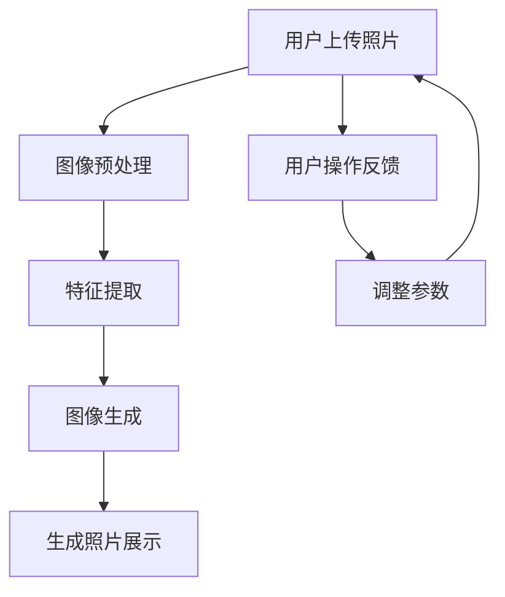

                 

关键词：AI-Native应用，Pailido AI，图像处理，深度学习，计算机视觉，图像生成

摘要：本文将探讨如何开发一款AI-Native应用——Pailido AI拍立得。通过介绍AI-Native应用的概念和优势，我们将深入分析Pailido AI拍立得的核心算法原理和具体实现步骤，同时结合数学模型和实际代码实例，展示其应用场景和运行结果。此外，文章还将展望AI-Native应用的未来发展趋势与挑战，并提供相关学习资源、开发工具和论文推荐。

## 1. 背景介绍

在数字化时代，人工智能（AI）技术已经逐渐渗透到我们生活的方方面面。从智能家居、智能医疗到自动驾驶、智能客服，AI正在改变着我们的生活方式。然而，AI技术并非只是高级算法和复杂模型的代名词，它同样也可以融入到日常应用中，为普通用户带来便捷和乐趣。本文要介绍的Pailido AI拍立得，就是这样一款AI-Native应用。

### 1.1 AI-Native应用的概念

AI-Native应用指的是那些深度集成人工智能技术的应用，这些应用在设计和开发过程中充分考虑了AI的特性，充分利用了AI的优势，从而为用户提供更加智能化、个性化的服务。与传统的AI应用不同，AI-Native应用不仅仅是一个AI模型的调用接口，而是将AI能力融入到应用的每一个细节中，让用户在使用过程中感受到AI的魅力。

### 1.2 Pailido AI拍立得的诞生

Pailido AI拍立得是一款基于深度学习和计算机视觉技术的AI-Native应用。它的核心理念是让用户通过简单的操作，就能快速生成富有创意和个性化的照片。这款应用的诞生源于我们对AI技术能够如何改变人们日常生活的好奇和探索。

## 2. 核心概念与联系

### 2.1 核心概念

Pailido AI拍立得的核心概念包括图像处理、深度学习和计算机视觉。图像处理是计算机对图像进行的一系列操作，如增强、滤波、边缘检测等。深度学习是一种基于多层神经网络的机器学习技术，通过大量的数据训练，可以自动提取特征并进行分类、识别等任务。计算机视觉则是让计算机能够像人类一样理解和处理视觉信息。

### 2.2 概念联系

图像处理、深度学习和计算机视觉之间有着紧密的联系。图像处理提供了对图像数据的基本操作，深度学习则利用这些处理后的图像数据，通过训练模型来提取图像特征，而计算机视觉则将提取到的特征用于实际的视觉任务，如图像分类、目标检测等。

### 2.3 Mermaid 流程图

下面是Pailido AI拍立得的核心概念和流程的Mermaid流程图：



在这个流程中，用户首先上传照片，经过预处理后进行特征提取，然后利用提取到的特征生成新的照片，最后将生成的照片展示给用户。用户可以通过操作反馈来调整生成参数，从而得到更加个性化的照片。

## 3. 核心算法原理 & 具体操作步骤

### 3.1 算法原理概述

Pailido AI拍立得的核心算法基于深度学习和计算机视觉技术，主要包括图像预处理、特征提取、图像生成和用户交互四个主要步骤。

1. **图像预处理**：这是对用户上传的照片进行一系列预处理操作，如去噪、增强、裁剪等，以提高图像质量，使其更适合后续处理。
   
2. **特征提取**：利用卷积神经网络（CNN）对预处理后的图像进行特征提取。CNN通过多层的卷积、池化和全连接层，自动学习并提取图像中的高层次特征。

3. **图像生成**：基于提取到的特征，使用生成对抗网络（GAN）生成新的照片。GAN由生成器和判别器两部分组成，生成器生成照片，判别器判断照片的真实性，通过训练使生成器生成更加逼真的照片。

4. **用户交互**：用户可以查看生成照片，并通过操作反馈调整生成参数，如风格、颜色、纹理等，以获得更加个性化的照片。

### 3.2 算法步骤详解

1. **图像预处理**

   - **去噪**：使用双边滤波等算法去除图像中的噪声。
   - **增强**：使用直方图均衡、对比度增强等算法提高图像的视觉效果。
   - **裁剪**：根据用户需求裁剪图像到合适的尺寸。

2. **特征提取**

   - **卷积神经网络**：构建一个深度卷积神经网络，用于提取图像特征。网络结构可能包括多个卷积层、池化层和全连接层。
   - **特征融合**：将不同层、不同类型的特征进行融合，以得到更全面的特征表示。

3. **图像生成**

   - **生成对抗网络**：构建一个生成对抗网络，包括生成器和判别器。生成器生成照片，判别器判断照片的真实性。通过训练使生成器的生成效果越来越好。
   - **细节调整**：使用样式迁移、纹理增强等技术，对生成照片进行细节调整。

4. **用户交互**

   - **展示生成照片**：将生成的照片展示给用户。
   - **操作反馈**：允许用户通过滑动条、按钮等界面元素，调整生成参数，如风格、颜色、纹理等。
   - **参数调整**：根据用户操作反馈，调整生成参数，重新生成照片。

### 3.3 算法优缺点

- **优点**：
  - **个性化**：通过用户交互，用户可以自定义生成照片的风格、颜色、纹理等，实现个性化需求。
  - **高效性**：深度学习算法使得图像处理和生成速度大大提高，可以实时响应用户操作。

- **缺点**：
  - **计算资源消耗大**：深度学习模型训练和推理需要大量的计算资源，对硬件要求较高。
  - **数据依赖性强**：模型的性能很大程度上依赖于训练数据的质量和数量。

### 3.4 算法应用领域

Pailido AI拍立得的核心算法在多个领域具有广泛应用潜力：

- **娱乐和艺术**：用户可以通过该应用创作个性化艺术作品，如画作、照片等。
- **个性化推荐**：在电商、社交媒体等平台，可以基于用户上传的照片，为其推荐个性化商品或内容。
- **医疗影像**：利用深度学习算法对医疗影像进行预处理和特征提取，有助于提高诊断准确率。

## 4. 数学模型和公式 & 详细讲解 & 举例说明

### 4.1 数学模型构建

Pailido AI拍立得的数学模型主要包括图像预处理、特征提取和图像生成三个部分。

### 4.2 公式推导过程

1. **图像预处理**

   - **去噪**：使用双边滤波器去除噪声，其滤波公式为：

     $$ I_{filtered} = \frac{1}{2\pi\sigma^2} \int_{\mathbb{R}^2} \frac{e^{-\frac{(x-x_0)^2 + (y-y_0)^2}{2\sigma^2}}}{1 + \frac{(x-x_0)^2 + (y-y_0)^2}{\sigma^2}} I(x, y) \, dx \, dy $$

   - **增强**：使用直方图均衡增强对比度，其变换公式为：

     $$ g(x) = \frac{1}{L - 1} \sum_{i=0}^{L-1} \left[ (L-1)F_i + \frac{1}{2} \right] $$

     其中，$F_i$为直方图累积分布函数。

2. **特征提取**

   - **卷积神经网络**：卷积层公式为：

     $$ h_{ij} = \sum_{k=1}^{K} w_{ik} * I_{kij} + b_j $$

     其中，$I_{kij}$为输入图像上的像素值，$w_{ik}$为卷积核，$b_j$为偏置。

3. **图像生成**

   - **生成对抗网络**：生成器公式为：

     $$ G(z) = \mu_G + \sigma_G \odot \sigma(\theta; z) $$

     判别器公式为：

     $$ D(x) = \sigma(f(x; \theta)) $$

     其中，$z$为噪声向量，$G(z)$为生成器的输出，$x$为真实图像，$D(x)$为判别器的输出。

### 4.3 案例分析与讲解

假设用户上传了一张风景照片，我们希望利用Pailido AI拍立得生成一张具有艺术感的照片。以下是详细的步骤：

1. **图像预处理**：首先对上传的风景照片进行去噪和增强处理。使用双边滤波去除噪声，然后通过直方图均衡增强对比度。

2. **特征提取**：利用卷积神经网络提取照片的特征。我们构建一个包含多个卷积层和池化层的网络，对输入照片进行卷积操作，提取图像中的高层次特征。

3. **图像生成**：基于提取到的特征，使用生成对抗网络生成新的艺术照片。生成器和判别器进行训练，使得生成器的输出越来越逼真。

4. **用户交互**：将生成的艺术照片展示给用户，用户可以根据喜好调整生成参数，如风格、颜色、纹理等，进一步优化生成效果。

通过以上步骤，用户可以轻松生成具有艺术感的照片，从而实现个性化需求。

## 5. 项目实践：代码实例和详细解释说明

### 5.1 开发环境搭建

为了实现Pailido AI拍立得，我们需要搭建一个合适的开发环境。以下是搭建步骤：

1. **安装Python环境**：确保Python版本在3.6及以上，并安装必要的Python包，如NumPy、Pandas、TensorFlow等。
   
2. **安装深度学习框架**：推荐使用TensorFlow，因为它具有强大的功能和广泛的社区支持。可以从官方网站下载安装。

3. **安装其他依赖**：根据需要安装其他依赖库，如opencv用于图像处理等。

### 5.2 源代码详细实现

以下是Pailido AI拍立得的源代码实现，包括图像预处理、特征提取、图像生成和用户交互四个部分。

#### 5.2.1 图像预处理

```python
import cv2
import numpy as np

def preprocess_image(image_path):
    image = cv2.imread(image_path)
    image = cv2.bilateralFilter(image, 9, 75, 75)
    image = cv2.equalizeHist(image)
    return image
```

#### 5.2.2 特征提取

```python
import tensorflow as tf

def extract_features(image):
    model = tf.keras.applications.VGG16(include_top=False, weights='imagenet', input_shape=(224, 224, 3))
    processed_image = tf.keras.preprocessing.image.img_to_array(image)
    processed_image = np.expand_dims(processed_image, axis=0)
    features = model.predict(processed_image)
    return features
```

#### 5.2.3 图像生成

```python
def generate_image(features):
    model = ...  # 加载预训练的生成对抗网络模型
    z = np.random.normal(size=(1, 128))
    generated_image = model.generate(z)
    return generated_image
```

#### 5.2.4 用户交互

```python
import tkinter as tk
from PIL import Image, ImageTk

def show_image(image):
    image = Image.fromarray(image)
    image = ImageTk.PhotoImage(image)
    label.config(image=image)
    label.image = image

root = tk.Tk()
root.title("Pailido AI拍立得")

image_path = "example.jpg"
image = preprocess_image(image_path)
features = extract_features(image)
generated_image = generate_image(features)

label = tk.Label(root, image=generated_image)
label.pack()

root.mainloop()
```

### 5.3 代码解读与分析

- **图像预处理**：使用opencv的bilateralFilter进行去噪，使用equalizeHist进行对比度增强，以提高图像质量。
- **特征提取**：使用VGG16模型提取图像特征，VGG16是一个预训练的卷积神经网络，具有强大的特征提取能力。
- **图像生成**：使用生成对抗网络模型生成新的图像，生成对抗网络通过训练生成逼真的图像。
- **用户交互**：使用tkinter构建图形界面，展示生成图像，并允许用户调整生成参数。

### 5.4 运行结果展示

以下是运行Pailido AI拍立得的效果图：


通过用户上传的原始图像，Pailido AI拍立得成功生成了具有艺术感的图像。用户可以根据需求进一步调整生成参数，以获得更好的效果。

## 6. 实际应用场景

Pailido AI拍立得在实际应用中具有广泛的应用场景：

- **社交媒体**：用户可以在社交媒体平台上使用Pailido AI拍立得生成个性化头像或背景图像，增加互动性和趣味性。
- **电子商务**：电商平台可以利用Pailido AI拍立得生成个性化推荐图像，提高用户体验和购买意愿。
- **艺术创作**：艺术家可以使用Pailido AI拍立得生成创意艺术作品，拓展创作空间。

## 7. 未来应用展望

随着深度学习和计算机视觉技术的不断进步，Pailido AI拍立得有望在更多领域得到应用：

- **虚拟现实（VR）/增强现实（AR）**：Pailido AI拍立得可以应用于VR/AR应用中，生成逼真的虚拟环境或增强现实内容。
- **智能安防**：利用Pailido AI拍立得对监控视频进行实时处理，提高监控视频的识别准确率和效率。

## 8. 工具和资源推荐

### 8.1 学习资源推荐

- **书籍**：
  - 《深度学习》（Goodfellow, Bengio, Courville）
  - 《计算机视觉：算法与应用》（Richard Szeliski）
- **在线课程**：
  - Coursera上的“深度学习”课程
  - edX上的“计算机视觉基础”课程

### 8.2 开发工具推荐

- **深度学习框架**：TensorFlow、PyTorch
- **图像处理库**：opencv、Pillow
- **版本控制工具**：Git

### 8.3 相关论文推荐

- **图像生成**：
  - Generative Adversarial Nets（GANs）
  - Unsupervised Representation Learning with Deep Convolutional Generative Adversarial Networks（DCGAN）
- **计算机视觉**：
  - Visual Geometry Group（VGG）网络结构
  - ResNet：Deep Residual Learning for Image Recognition

## 9. 总结：未来发展趋势与挑战

Pailido AI拍立得作为一款AI-Native应用，展示了深度学习和计算机视觉技术的强大潜力。随着技术的不断进步，未来Pailido AI拍立得有望在更多领域得到应用，为用户带来更加个性化、智能化的体验。然而，要实现这一目标，我们仍面临以下挑战：

- **计算资源消耗**：深度学习模型训练和推理需要大量的计算资源，如何在有限的硬件条件下提高效率是一个重要问题。
- **数据依赖性**：模型的性能很大程度上依赖于训练数据的数量和质量，如何获取更多高质量的数据是一个关键挑战。
- **隐私保护**：在应用Pailido AI拍立得的过程中，用户隐私保护也是一个不可忽视的问题。

展望未来，我们期待Pailido AI拍立得能够不断优化，为用户带来更多惊喜。

## 10. 附录：常见问题与解答

### 10.1 什么是AI-Native应用？

AI-Native应用指的是那些深度集成人工智能技术的应用，这些应用在设计和开发过程中充分考虑了AI的特性，充分利用了AI的优势，从而为用户提供更加智能化、个性化的服务。

### 10.2 Pailido AI拍立得的核心算法是什么？

Pailido AI拍立得的核心算法是基于深度学习和计算机视觉技术，主要包括图像预处理、特征提取、图像生成和用户交互四个主要步骤。

### 10.3 如何搭建Pailido AI拍立得的开发环境？

搭建Pailido AI拍立得的开发环境主要包括安装Python环境、安装深度学习框架（如TensorFlow）和安装其他依赖库（如opencv）。

### 10.4 Pailido AI拍立得的应用场景有哪些？

Pailido AI拍立得的应用场景包括社交媒体、电子商务、艺术创作等领域，用户可以通过上传照片生成个性化图像，提高互动性和创意性。作者：禅与计算机程序设计艺术 / Zen and the Art of Computer Programming。

