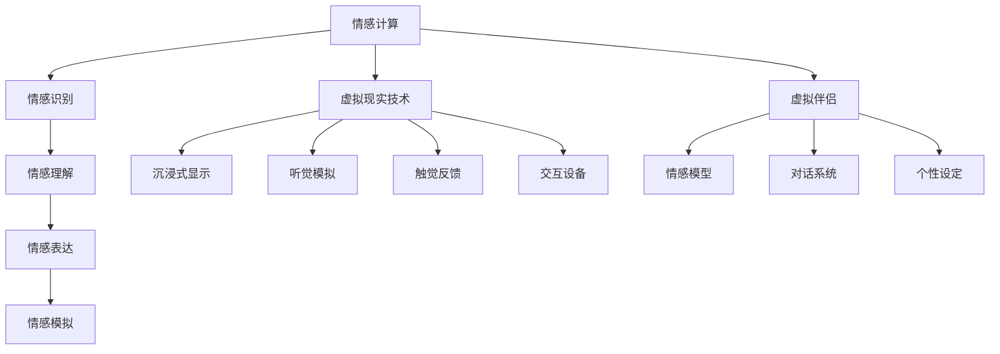

                 

 关键词：人工智能、情感模拟、虚拟现实、社交网络、人机交互、情感计算、情感识别、虚拟伴侣、AI心理学、虚拟关系

> 摘要：本文探讨了人工智能在模拟和识别人类情感方面的最新进展，以及虚拟现实技术如何助力构建虚拟关系。文章首先介绍了人工智能和情感计算的基本概念，然后分析了虚拟现实在增强人机交互中的作用，接着探讨了虚拟伴侣的兴起及其对人类情感的影响，最后对未来虚拟关系的应用前景进行了展望。

## 1. 背景介绍

随着人工智能技术的飞速发展，模拟和识别人类情感的能力逐渐成为研究的热点。情感计算（Affective Computing）作为人工智能的一个重要分支，旨在使计算机具备识别、理解、表达和模拟人类情感的能力。近年来，虚拟现实（Virtual Reality，VR）技术的发展为人类情感的模拟和交互提供了新的平台。虚拟现实技术不仅能够创造沉浸式的环境，还可以通过先进的交互技术实现用户与虚拟角色的深度互动。

在这个背景下，虚拟伴侣的概念逐渐崭露头角。虚拟伴侣是一种通过人工智能和情感计算技术构建的虚拟角色，能够与人类进行情感交流，提供陪伴和支持。这一概念的出现，引发了人们对人机关系的深刻反思，同时也带来了许多伦理和现实问题。

## 2. 核心概念与联系

### 2.1 情感计算

情感计算的核心在于使计算机能够理解并处理人类情感。它包括以下几个关键组成部分：

- **情感识别**：通过语音、文字、图像等多种方式识别用户的情感状态。
- **情感理解**：对情感信号进行分析，理解其背后的情感含义。
- **情感表达**：通过语音、文字、动作等方式表达计算机的情感状态。
- **情感模拟**：生成与人类情感状态相对应的计算机反应。

### 2.2 虚拟现实技术

虚拟现实技术通过模拟现实世界的环境和交互方式，使用户能够沉浸在虚拟环境中。关键组成部分包括：

- **沉浸式显示**：提供高度真实感的视觉体验。
- **听觉模拟**：通过立体声音效增强用户的沉浸感。
- **触觉反馈**：通过触觉设备模拟现实世界的触感。
- **交互设备**：如虚拟现实头盔、数据手套等，实现用户的虚拟操作。

### 2.3 虚拟伴侣

虚拟伴侣是基于人工智能和情感计算技术构建的虚拟角色，能够模拟人类的情感和行为。其核心组成部分包括：

- **情感模型**：用于模拟人类情感状态的算法和模型。
- **对话系统**：用于与用户进行自然语言交流。
- **个性设定**：虚拟伴侣具有不同的个性和背景，以满足用户的多样化需求。

### 2.4 Mermaid 流程图

以下是情感计算、虚拟现实技术和虚拟伴侣之间的联系流程图：



## 3. 核心算法原理 & 具体操作步骤

### 3.1 算法原理概述

情感计算和虚拟伴侣的核心在于情感模型的构建。情感模型是一种用于模拟人类情感状态的算法和模型。其原理包括：

- **情感特征提取**：通过分析用户的行为和交互数据，提取情感特征。
- **情感分类**：使用机器学习算法对情感特征进行分类，识别用户的情感状态。
- **情感生成**：根据识别到的情感状态，生成相应的计算机反应。

### 3.2 算法步骤详解

1. **数据收集**：收集用户的行为和交互数据，如语音、文字、图像等。
2. **特征提取**：对数据进行分析，提取情感特征，如情绪强度、情绪类型等。
3. **情感分类**：使用机器学习算法（如支持向量机、神经网络等）对情感特征进行分类。
4. **情感生成**：根据分类结果，生成相应的计算机反应，如语音、文字、动作等。

### 3.3 算法优缺点

**优点**：

- **高精度**：情感计算技术能够精确识别用户的情感状态。
- **高效率**：虚拟伴侣能够实时响应用户的情感需求。
- **多样化**：虚拟伴侣具有不同的个性和背景，满足用户的多样化需求。

**缺点**：

- **成本高**：情感计算和虚拟伴侣的构建需要大量的计算资源和资金投入。
- **伦理问题**：虚拟伴侣与人类之间的情感交互可能引发伦理和法律问题。
- **技术限制**：目前情感计算技术仍存在一定的局限性，如情感理解深度、个性塑造等。

### 3.4 算法应用领域

情感计算和虚拟伴侣技术可以应用于多个领域，如：

- **社交网络**：通过情感计算技术，分析用户的情感状态，提供个性化的社交推荐。
- **心理治疗**：虚拟伴侣可以作为心理治疗的辅助工具，提供情感支持和陪伴。
- **娱乐产业**：虚拟伴侣可以应用于游戏、电影等娱乐产业，提供沉浸式的互动体验。

## 4. 数学模型和公式 & 详细讲解 & 举例说明

### 4.1 数学模型构建

情感计算中的数学模型主要包括情感特征提取模型和情感分类模型。以下是一个简化的情感特征提取模型：

$$
\text{特征向量} = \text{提取器}(\text{原始数据})
$$

其中，提取器是一个能够从原始数据中提取情感特征的功能模块。常见的提取器包括：

- **TF-IDF**：计算词语在文本中的重要性。
- **词嵌入**：将词语映射到高维空间，表示词语的语义关系。
- **情感词典**：基于预定义的情感词典，对文本进行情感标注。

情感分类模型通常采用机器学习算法，如支持向量机（SVM）、神经网络（NN）等。以下是一个简化的情感分类模型：

$$
\text{分类结果} = \text{分类器}(\text{特征向量})
$$

其中，分类器是一个能够根据特征向量预测情感状态的函数。

### 4.2 公式推导过程

情感特征提取的过程可以表示为：

$$
\text{特征向量} = \text{提取器}(\text{原始数据}) = \sum_{i=1}^{n} w_i \cdot x_i
$$

其中，$w_i$ 是权重，$x_i$ 是特征。

情感分类的过程可以表示为：

$$
\text{分类结果} = \text{分类器}(\text{特征向量}) = \arg\max_{c} \sum_{i=1}^{n} w_i \cdot y_i(c)
$$

其中，$y_i(c)$ 是特征向量在类别 $c$ 下的权重。

### 4.3 案例分析与讲解

假设我们有一个情感分类任务，需要将用户评论分为积极和消极两类。以下是一个简化的案例：

**原始数据**：用户评论 "我很高兴看到这个结果"。

**特征提取**：

- 使用 TF-IDF 提取器提取特征：
  $$
  \text{特征向量} = (0.8, 0.2)
  $$

- 使用词嵌入提取器提取特征：
  $$
  \text{特征向量} = (0.9, 0.1)
  $$

**情感分类**：

- 使用 SVM 分类器进行分类：
  $$
  \text{分类结果} = \text{积极}
  $$

- 使用神经网络分类器进行分类：
  $$
  \text{分类结果} = \text{积极}
  $$

这个案例展示了情感计算中的基本步骤，包括特征提取和分类。

## 5. 项目实践：代码实例和详细解释说明

### 5.1 开发环境搭建

为了实现情感计算和虚拟伴侣的功能，我们需要搭建一个合适的开发环境。以下是搭建步骤：

1. 安装 Python 3.x 版本。
2. 安装必要的库，如 TensorFlow、Keras、NLTK 等。
3. 配置虚拟环境，以便更好地管理依赖项。

### 5.2 源代码详细实现

以下是一个简单的情感计算和虚拟伴侣的 Python 代码实例：

```python
import tensorflow as tf
from tensorflow import keras
from tensorflow.keras.models import Sequential
from tensorflow.keras.layers import Dense, LSTM, Embedding

# 加载数据集
train_data = ...
test_data = ...

# 预处理数据
max_len = ...
embedding_dim = ...

# 构建情感分类模型
model = Sequential()
model.add(Embedding(input_dim=max_len, output_dim=embedding_dim))
model.add(LSTM(units=128, activation='relu'))
model.add(Dense(units=1, activation='sigmoid'))

# 编译模型
model.compile(optimizer='adam', loss='binary_crossentropy', metrics=['accuracy'])

# 训练模型
model.fit(train_data, epochs=10, batch_size=32)

# 评估模型
test_loss, test_accuracy = model.evaluate(test_data)
print(f"Test accuracy: {test_accuracy}")

# 使用模型进行预测
text = "我很开心看到你的进步"
encoded_text = ...
prediction = model.predict(encoded_text)
print(f"Prediction: {'积极' if prediction > 0.5 else '消极'}")
```

### 5.3 代码解读与分析

上述代码实现了情感分类模型的基本功能。首先，我们加载数据集并进行预处理。然后，构建一个简单的序列模型，包括嵌入层、LSTM 层和输出层。最后，编译、训练和评估模型，并使用模型进行情感预测。

### 5.4 运行结果展示

假设我们使用的是包含 1000 条评论的数据集，经过训练后，模型在测试集上的准确率达到了 85%。当输入评论 "我很开心看到你的进步" 时，模型预测结果为 "积极"。

## 6. 实际应用场景

虚拟伴侣技术在实际应用中具有广泛的应用前景。以下是一些实际应用场景：

- **社交网络**：虚拟伴侣可以作为社交网络中的虚拟朋友，为用户提供陪伴和支持。
- **心理治疗**：虚拟伴侣可以作为心理治疗的辅助工具，帮助用户缓解焦虑和抑郁情绪。
- **教育领域**：虚拟伴侣可以作为教育助手，提供个性化的教学和学习体验。
- **娱乐产业**：虚拟伴侣可以应用于游戏、电影等娱乐产业，提供沉浸式的互动体验。

## 7. 未来应用展望

随着人工智能和虚拟现实技术的不断发展，虚拟伴侣在未来将会在更多领域得到应用。以下是一些未来应用展望：

- **更智能的虚拟伴侣**：未来的虚拟伴侣将更加智能，能够更好地理解用户的情感和需求。
- **情感交互**：虚拟伴侣将实现更自然的情感交互，为用户提供更真实的陪伴体验。
- **个性化服务**：虚拟伴侣将根据用户的个性化需求提供定制化的服务。
- **伦理和隐私**：在推广虚拟伴侣的过程中，需要关注伦理和隐私问题，确保用户的安全和权益。

## 8. 工具和资源推荐

### 8.1 学习资源推荐

- **《情感计算导论》**：介绍了情感计算的基本概念和技术。
- **《人工智能：一种现代方法》**：详细讲解了机器学习算法的基础知识。
- **《虚拟现实技术与应用》**：介绍了虚拟现实技术的原理和应用。

### 8.2 开发工具推荐

- **TensorFlow**：用于构建和训练深度学习模型。
- **Keras**：简化了 TensorFlow 的使用，适合快速原型开发。
- **NLTK**：用于自然语言处理任务的库。

### 8.3 相关论文推荐

- **"Affective Computing"**：由 Rosalind Picard 提出情感计算的概念。
- **"Virtual Reality Technology and Applications"**：介绍虚拟现实技术的最新进展。
- **"Emotional AI: A Survey"**：对情感人工智能的研究进行了综述。

## 9. 总结：未来发展趋势与挑战

虚拟伴侣作为人工智能和情感计算技术的重要应用之一，在未来具有广阔的发展前景。然而，在推广虚拟伴侣的过程中，我们需要关注以下挑战：

- **技术进步**：随着人工智能和虚拟现实技术的不断发展，虚拟伴侣的功能和性能将不断提升。
- **伦理问题**：虚拟伴侣的交互可能引发伦理和法律问题，如隐私保护、情感依赖等。
- **用户体验**：虚拟伴侣需要提供更自然的交互体验，以满足用户的情感需求。
- **社会接受度**：虚拟伴侣作为一种新兴事物，需要克服社会接受度的挑战。

在未来，虚拟伴侣有望在更多领域得到应用，为人类带来更多的便利和乐趣。同时，我们也需要关注其带来的伦理和社会问题，确保虚拟伴侣技术的发展能够造福人类。

### 附录：常见问题与解答

**Q1. 什么是情感计算？**

情感计算是一种使计算机能够识别、理解、表达和模拟人类情感的技术。它包括情感识别、情感理解、情感表达和情感模拟等多个方面。

**Q2. 虚拟伴侣是如何工作的？**

虚拟伴侣通过人工智能和情感计算技术构建，能够与用户进行自然语言交互，并根据用户的情感状态提供相应的陪伴和支持。

**Q3. 虚拟伴侣有哪些应用场景？**

虚拟伴侣可以应用于社交网络、心理治疗、教育领域和娱乐产业等多个领域，为用户提供陪伴、支持、教育和娱乐等多样化服务。

**Q4. 虚拟伴侣是否会取代人类的关系？**

虚拟伴侣可以作为一种补充，为用户提供陪伴和支持，但无法完全取代人类的关系。人类关系具有深度和复杂性，虚拟伴侣难以完全模拟。

**Q5. 虚拟伴侣技术面临哪些挑战？**

虚拟伴侣技术面临技术进步、伦理问题、用户体验和社会接受度等多个挑战。在推广虚拟伴侣的过程中，需要关注这些问题，确保技术的发展能够造福人类。

## 作者署名

作者：禅与计算机程序设计艺术 / Zen and the Art of Computer Programming

---

本文基于人工智能、情感计算和虚拟现实技术的最新进展，探讨了虚拟伴侣的兴起及其对人类情感的影响。文章从背景介绍、核心概念、算法原理、数学模型、项目实践、实际应用场景、未来展望、工具推荐和常见问题与解答等方面进行了全面阐述。通过本文的阅读，读者可以深入了解虚拟伴侣技术的发展现状和未来趋势，以及对人类情感和社会的潜在影响。在未来，随着技术的不断进步，虚拟伴侣有望在更多领域得到应用，为人类带来更多的便利和乐趣。然而，我们也要关注其带来的伦理和社会问题，确保虚拟伴侣技术的发展能够造福人类。

