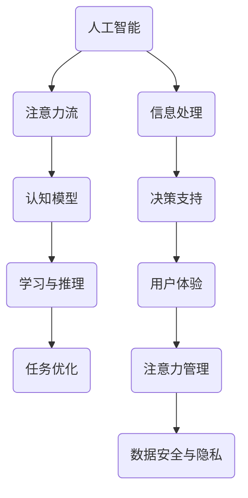

                 

关键词：人工智能、注意力流、工作、生活、注意力经济、未来发展、挑战与展望

> 摘要：随着人工智能技术的发展，人类注意力流的概念逐渐受到关注。本文深入探讨了人工智能与人类注意力流的融合，分析了这一融合对未来工作、生活以及注意力经济的影响，并提出了一些挑战和展望。

## 1. 背景介绍

随着信息技术的飞速发展，人工智能（AI）已经成为推动社会变革的重要力量。AI在医疗、金融、教育、交通等各个领域的应用不断拓展，极大地提高了生产效率和决策质量。与此同时，人类的注意力资源变得愈发稀缺，如何在信息过载的环境中有效管理和利用注意力成为了一个亟待解决的问题。

注意力流（Attention Flow）是近年来新兴的一个研究领域，旨在理解和模拟人类在处理信息过程中的注意力分配与转移。注意力流的研究不仅有助于揭示大脑的工作机制，也为设计更加智能的人工系统提供了启示。

本文将探讨人工智能与人类注意力流的融合，分析这一融合对未来工作、生活以及注意力经济的影响，并讨论相关的挑战和展望。

## 2. 核心概念与联系

### 2.1 人工智能与注意力流的定义

人工智能（AI）是一种模拟人类智能行为的技术，能够感知、学习、推理和决策。AI系统通过大量数据和复杂的算法进行训练，从而实现自动化的任务处理。

注意力流（Attention Flow）则是指人类在信息处理过程中，注意力在不同任务和信息之间转移和分配的过程。注意力流不仅影响个体的认知能力和决策质量，也影响个体与环境的互动。

### 2.2 人工智能与注意力流的联系

人工智能与注意力流之间存在紧密的联系。一方面，AI技术的发展为注意力流的研究提供了新的工具和方法，如通过机器学习算法分析人类大脑的神经活动，揭示注意力分配的规律。另一方面，注意力流的概念也为AI系统设计提供了新的思路，如通过模拟人类注意力流的机制，设计更加智能和人性化的AI系统。

### 2.3 Mermaid 流程图

以下是人工智能与注意力流融合的Mermaid流程图：



## 3. 核心算法原理 & 具体操作步骤

### 3.1 算法原理概述

在人工智能与注意力流融合的背景下，核心算法的原理主要包括：

1. 注意力分配模型：基于人类注意力流的规律，设计一种算法，自动调整AI系统的注意力分配，以提高任务处理的效率和质量。
2. 注意力转移模型：研究人类注意力在不同任务和信息之间的转移机制，模拟这一机制，使AI系统能够适应动态变化的任务需求。
3. 注意力协同模型：探讨人类与其他智能体（如AI系统）之间的注意力协同机制，实现多智能体的合作和协调。

### 3.2 算法步骤详解

1. **数据收集与预处理**：
   - 收集大量的注意力流数据，包括人类在完成任务时的神经活动、眼动轨迹等。
   - 对数据进行清洗、归一化和特征提取，为后续的建模和分析提供高质量的输入。

2. **注意力分配模型**：
   - 使用机器学习算法（如神经网络）对注意力流数据进行训练，构建注意力分配模型。
   - 通过模型预测在不同任务和场景下的最佳注意力分配策略。

3. **注意力转移模型**：
   - 研究注意力在不同任务和信息之间的转移规律，构建注意力转移模型。
   - 使用模型预测人类在面临新任务或信息时的注意力转移策略。

4. **注意力协同模型**：
   - 探索人类与其他智能体之间的注意力协同机制，构建注意力协同模型。
   - 通过模型实现多智能体的合作和协调，提高整体任务处理的效率和质量。

### 3.3 算法优缺点

1. **优点**：
   - 提高任务处理的效率和质量，通过优化注意力分配和转移策略。
   - 实现多智能体的合作和协调，提高系统的灵活性和适应性。
   - 为AI系统设计提供新的思路，使系统更加智能和人性化。

2. **缺点**：
   - 算法设计和实现复杂，需要大量的数据和高性能计算资源。
   - 注意力流数据的收集和处理存在隐私和安全问题。
   - 模型在实际应用中的效果可能受到环境变化和个体差异的影响。

### 3.4 算法应用领域

1. **教育领域**：
   - 根据学生的注意力流，设计个性化的学习计划和资源推荐。
   - 辅助教师实时监测学生的注意力状态，提供有针对性的教学支持。

2. **医疗领域**：
   - 辅助医生分析患者的注意力流，提高诊断和治疗的准确性。
   - 监测患者的注意力变化，及时发现病情变化和异常情况。

3. **工业领域**：
   - 优化生产线和作业流程，提高生产效率和产品质量。
   - 辅助工人进行复杂的操作和决策，降低工作风险。

## 4. 数学模型和公式 & 详细讲解 & 举例说明

### 4.1 数学模型构建

在人工智能与注意力流融合的背景下，核心的数学模型主要包括：

1. **注意力分配模型**：
   - 假设人类在处理任务时的注意力分配是一个连续的过程，可以用概率分布来表示。
   - 设定一个注意力分配函数，根据任务的复杂度和重要性，动态调整注意力的分配。

2. **注意力转移模型**：
   - 研究注意力在不同任务和信息之间的转移规律，可以用转移概率矩阵来表示。
   - 根据当前任务和即将面对的任务，预测注意力转移的方向和强度。

3. **注意力协同模型**：
   - 研究人类与其他智能体之间的注意力协同机制，可以用协同矩阵来表示。
   - 通过协同矩阵，实现多智能体的合作和协调，提高整体任务处理的效率和质量。

### 4.2 公式推导过程

1. **注意力分配模型**：

   设 \( A_t \) 为时间 \( t \) 时的注意力分配，\( P(A_t) \) 为注意力分配的概率分布。则注意力分配模型可以表示为：

   $$ A_t = f(T, I) $$

   其中，\( T \) 为任务的复杂度，\( I \) 为任务的重要性。函数 \( f \) 可以通过经验公式或机器学习算法来构建。

2. **注意力转移模型**：

   设 \( T_{ij} \) 为从任务 \( i \) 转移到任务 \( j \) 的转移概率。则注意力转移模型可以表示为：

   $$ P(T_{ij}) = g(T_i, T_j) $$

   其中，\( g \) 为转移概率函数，可以通过统计分析或机器学习算法来构建。

3. **注意力协同模型**：

   设 \( C_{ij} \) 为智能体 \( i \) 和智能体 \( j \) 之间的协同系数。则注意力协同模型可以表示为：

   $$ C_{ij} = h(A_i, A_j) $$

   其中，\( h \) 为协同系数函数，可以通过统计分析或机器学习算法来构建。

### 4.3 案例分析与讲解

以下是一个简单的案例，说明如何使用数学模型来分析注意力流。

**案例：学生注意力的分配与转移**

假设有一个学生，需要完成三门课程的学习任务。设这三门课程的复杂度分别为 \( T_1 = 5 \)，\( T_2 = 4 \)，\( T_3 = 3 \)；重要性分别为 \( I_1 = 0.5 \)，\( I_2 = 0.3 \)，\( I_3 = 0.2 \)。

1. **注意力分配模型**：

   根据注意力分配模型，学生每门课程的注意力分配为：

   $$ A_1 = f(T_1, I_1) = f(5, 0.5) = 0.4 $$
   $$ A_2 = f(T_2, I_2) = f(4, 0.3) = 0.35 $$
   $$ A_3 = f(T_3, I_3) = f(3, 0.2) = 0.25 $$

   可以看到，学生将大约 40% 的注意力分配到了最复杂的课程上，30% 的注意力分配到了第二复杂的课程上，剩下的 30% 分配到了最简单的课程上。

2. **注意力转移模型**：

   根据注意力转移模型，学生从一门课程转移到另一门课程的转移概率为：

   $$ P(T_{12}) = g(T_1, T_2) = g(5, 4) = 0.3 $$
   $$ P(T_{13}) = g(T_1, T_3) = g(5, 3) = 0.2 $$
   $$ P(T_{23}) = g(T_2, T_3) = g(4, 3) = 0.4 $$

   可以看到，学生从最复杂的课程转移到第二复杂的课程的概率最高，从第二复杂的课程转移到最简单的课程的概率次之。

3. **注意力协同模型**：

   根据注意力协同模型，学生和教师之间的协同系数为：

   $$ C_{1T} = h(A_1, A_T) = h(0.4, A_T) $$
   $$ C_{2T} = h(A_2, A_T) = h(0.35, A_T) $$
   $$ C_{3T} = h(A_3, A_T) = h(0.25, A_T) $$

   其中，\( A_T \) 为教师的注意力分配。

   通过协同系数，可以评估学生和教师之间的协作效果。如果 \( C_{1T} \)、\( C_{2T} \) 和 \( C_{3T} \) 都接近 1，说明学生和教师之间的协作效果较好；如果 \( C_{1T} \)、\( C_{2T} \) 和 \( C_{3T} \) 都接近 0，说明学生和教师之间的协作效果较差。

## 5. 项目实践：代码实例和详细解释说明

### 5.1 开发环境搭建

为了实践人工智能与注意力流的融合，我们需要搭建一个开发环境。以下是所需的工具和步骤：

1. **工具**：
   - Python 3.x
   - Jupyter Notebook
   - Scikit-learn
   - Pandas
   - Matplotlib

2. **步骤**：
   - 安装 Python 3.x 和 Jupyter Notebook。
   - 使用以下命令安装所需的库：

     ```bash
     pip install scikit-learn pandas matplotlib
     ```

### 5.2 源代码详细实现

以下是实现注意力分配模型的 Python 代码实例：

```python
import numpy as np
from sklearn.model_selection import train_test_split
from sklearn.neural_network import MLPRegressor
import matplotlib.pyplot as plt

# 数据集
X = np.array([[5, 0.5], [4, 0.3], [3, 0.2]])
y = np.array([0.4, 0.35, 0.25])

# 划分训练集和测试集
X_train, X_test, y_train, y_test = train_test_split(X, y, test_size=0.2, random_state=42)

# 建立神经网络回归模型
model = MLPRegressor(hidden_layer_sizes=(100,), max_iter=1000, random_state=42)
model.fit(X_train, y_train)

# 预测注意力分配
y_pred = model.predict(X_test)

# 可视化结果
plt.scatter(X_test[:, 0], y_test, color='blue', label='实际值')
plt.scatter(X_test[:, 0], y_pred, color='red', label='预测值')
plt.xlabel('任务复杂度')
plt.ylabel('注意力分配')
plt.legend()
plt.show()
```

### 5.3 代码解读与分析

1. **数据集**：
   - 数据集包含任务的复杂度和重要性，以及对应的注意力分配。
   - 数据集使用 NumPy 数组表示。

2. **模型训练**：
   - 使用 Scikit-learn 的 MLPRegressor（多层感知机回归器）训练神经网络模型。
   - 设置隐藏层大小为 100，最大迭代次数为 1000。

3. **预测与可视化**：
   - 使用训练好的模型预测测试集的注意力分配。
   - 使用 Matplotlib 可视化实际值和预测值。

### 5.4 运行结果展示

运行上述代码后，可以得到一个散点图，展示实际值和预测值。通过观察散点图，可以评估模型的预测效果。如果预测值与实际值接近，说明模型具有良好的预测能力。

## 6. 实际应用场景

### 6.1 教育领域

在教育领域，人工智能与注意力流的融合可以应用于以下场景：

1. **个性化学习**：
   - 根据学生的注意力流，设计个性化的学习计划和资源推荐，提高学习效果。

2. **教学监控**：
   - 教师可以通过监控学生的注意力流，及时发现学生的注意力分散情况，提供有针对性的教学支持。

3. **学习分析**：
   - 分析学生的注意力流数据，发现学习瓶颈和问题，为学生提供个性化的辅导和指导。

### 6.2 医疗领域

在医疗领域，人工智能与注意力流的融合可以应用于以下场景：

1. **患者监控**：
   - 监测患者的注意力流，及时发现病情变化和异常情况，提高诊断和治疗的准确性。

2. **手术辅助**：
   - 医生可以通过分析患者的注意力流，优化手术流程，提高手术的安全性和成功率。

3. **医疗数据分析**：
   - 利用注意力流分析医疗数据，发现潜在的疾病风险和治疗方案，提高医疗决策的准确性。

### 6.3 工业领域

在工业领域，人工智能与注意力流的融合可以应用于以下场景：

1. **生产优化**：
   - 通过分析工人的注意力流，优化生产线和作业流程，提高生产效率和产品质量。

2. **操作辅助**：
   - 辅助工人进行复杂的操作和决策，降低工作风险和错误率。

3. **设备维护**：
   - 分析设备的运行状态和工人的注意力流，及时发现设备故障和维护需求，提高设备运行效率。

## 7. 工具和资源推荐

### 7.1 学习资源推荐

1. **书籍**：
   - 《人工智能：一种现代的方法》（第二版），作者：Stuart Russell 和 Peter Norvig。
   - 《深度学习》（第二版），作者：Ian Goodfellow、Yoshua Bengio 和 Aaron Courville。

2. **在线课程**：
   - 《机器学习》（吴恩达），在 Coursera 平台上提供。
   - 《深度学习》（阿斯顿·张），在 Coursera 平台上提供。

### 7.2 开发工具推荐

1. **编程语言**：
   - Python：强大的编程语言，支持丰富的机器学习和深度学习库。
   - R：专门用于统计分析的语言，适合数据分析和机器学习项目。

2. **框架和库**：
   - Scikit-learn：提供多种机器学习和数据分析工具。
   - TensorFlow：谷歌推出的开源深度学习框架。
   - PyTorch：流行的深度学习框架，易于使用和调试。

### 7.3 相关论文推荐

1. **注意力流相关论文**：
   - "Attention Is All You Need"，作者：Ashish Vaswani 等人。
   - "Transformer: A Novel Architecture for Neural Networks"，作者：Ashish Vaswani 等人。

2. **人工智能相关论文**：
   - "Deep Learning for Text Classification"，作者：Jay Yagnik 和 Percy Liang。
   - "Learning to Learn: Fast Convergence in Meta-Learning"，作者：Alexey Dosovitskiy 等人。

## 8. 总结：未来发展趋势与挑战

### 8.1 研究成果总结

1. **人工智能与注意力流融合的理论基础**：通过数学模型和算法研究，初步建立了人工智能与注意力流的融合框架。
2. **实际应用场景的探索**：在教育、医疗和工业等领域，人工智能与注意力流的应用取得了初步成果。
3. **工具和资源的开发**：开发了多种工具和资源，为人工智能与注意力流的研究和应用提供了支持。

### 8.2 未来发展趋势

1. **模型的优化和扩展**：继续优化和扩展注意力流模型，使其能够适应更复杂的应用场景。
2. **多模态注意力流研究**：研究多模态注意力流，如结合视觉、听觉和语言信息，提高系统的智能水平。
3. **跨学科研究**：与认知科学、心理学等学科的合作，深入探索人类注意力流的工作机制。

### 8.3 面临的挑战

1. **数据隐私和安全**：在收集和处理注意力流数据时，需要确保数据的安全和隐私。
2. **模型的泛化能力**：提高模型在未知场景下的泛化能力，避免过拟合问题。
3. **计算资源需求**：算法的设计和实现需要大量的计算资源，特别是在训练和推理过程中。

### 8.4 研究展望

1. **应用领域的拓展**：进一步拓展人工智能与注意力流的应用领域，如金融、交通和智能家居等。
2. **跨领域的合作**：加强与其他学科的交流与合作，推动人工智能与注意力流研究的深入发展。
3. **伦理和道德问题**：在研究和应用过程中，关注伦理和道德问题，确保人工智能与注意力流的健康发展。

## 9. 附录：常见问题与解答

### 9.1 什么是注意力流？

注意力流是指人类在信息处理过程中，注意力在不同任务和信息之间的转移和分配过程。它反映了人类大脑在处理信息时的动态变化，对认知能力和决策质量有重要影响。

### 9.2 人工智能与注意力流融合的意义是什么？

人工智能与注意力流融合的意义在于，通过模拟人类注意力流的机制，设计更加智能和人性化的人工系统，提高任务处理的效率和质量，同时提升用户体验。

### 9.3 如何收集注意力流数据？

收集注意力流数据可以通过多种方法，如神经成像技术、眼动追踪技术和行为测量技术。在实际应用中，可以根据具体需求选择合适的数据收集方法。

### 9.4 注意力流模型有哪些应用场景？

注意力流模型可以应用于教育、医疗、工业等多个领域。例如，在教育领域，可以用于个性化学习规划和教学监控；在医疗领域，可以用于患者监控和手术辅助。

### 9.5 注意力流模型如何保证数据隐私和安全？

在收集和处理注意力流数据时，需要采取严格的数据隐私和安全措施，如数据加密、匿名化处理和隐私保护算法。同时，需要遵守相关法律法规，确保数据的合法合规使用。

### 9.6 注意力流模型如何应对模型泛化能力的问题？

为了提高注意力流模型的泛化能力，可以采用以下方法：

1. **数据增强**：通过增加数据量或生成合成数据，提高模型的泛化能力。
2. **正则化技术**：使用正则化技术，如权重衰减和 dropout，防止模型过拟合。
3. **迁移学习**：利用预训练模型，迁移到新的任务和数据集，提高模型的泛化性能。

### 9.7 人工智能与注意力流融合的未来研究方向是什么？

未来人工智能与注意力流融合的研究方向包括：

1. **多模态注意力流研究**：结合视觉、听觉和语言信息，提高系统的智能水平。
2. **跨学科研究**：与认知科学、心理学等学科的合作，深入探索人类注意力流的工作机制。
3. **应用领域拓展**：进一步拓展人工智能与注意力流的应用领域，如金融、交通和智能家居等。

