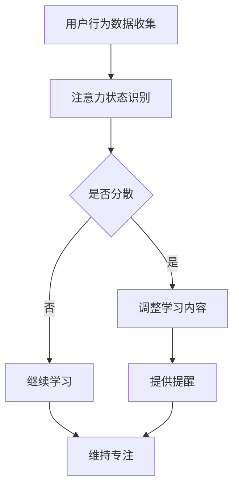

                 

关键词：人工智能，注意力管理，教育技术，学习效率，认知科学

> 摘要：本文探讨了人工智能（AI）在人类注意力流管理中的重要作用，以及其对未来教育模式的潜在影响。文章首先介绍了注意力管理的核心概念，随后阐述了AI在促进注意力集中和优化学习过程中的应用。接着，文章分析了现有教育技术如何利用AI来提升学生的注意力和学习效果。最后，文章提出了未来教育领域在注意力管理和AI应用方面的趋势与挑战，并展望了AI在教育中的未来发展。

## 1. 背景介绍

在当今信息爆炸的时代，人类面临着前所未有的注意力分散问题。互联网、社交媒体、智能手机等现代科技设备让人们的注意力容易被各种信息和干扰所打断。根据《美国心理学协会》的报道，人类的平均注意力持续时间已经从20世纪80年代的12秒下降到现在的约8秒，甚至比金鱼的记忆时间还要短。这种注意力分散现象不仅影响个人的工作效率，也对教育产生了深远的影响。

传统教育模式主要依赖于教师为中心的教学方式，学生的注意力往往需要通过教师的引导来集中。然而，这种模式在信息时代已经难以满足个性化学习的需求。现代教育需要更加灵活和适应性强的教学方法，以帮助学生更好地管理自己的注意力，提高学习效率。

与此同时，人工智能技术正在迅速发展，并在各个领域展现出巨大的潜力。AI具有处理大量数据、识别模式、个性化推荐等功能，这些特性使其在注意力管理方面具有独特的优势。通过AI技术，教育系统可以更精确地捕捉学生的注意力流，提供个性化的学习资源和干预措施，从而帮助学生更好地集中注意力，提高学习效果。

本文旨在探讨人工智能在人类注意力流管理中的潜在应用，分析AI技术在教育领域的现状，并提出未来教育与注意力管理的发展趋势与挑战。

## 2. 核心概念与联系

### 2.1 注意力管理的定义

注意力管理是指个体在特定任务中集中注意力、过滤干扰信息并保持专注的能力。它包括三个关键方面：注意力的分配、注意力的调节和注意力的维持。注意力的分配是指个体如何在不同任务之间分配注意力资源；注意力的调节是指个体如何调整自己的注意力以适应不同情境的需求；注意力的维持是指个体如何保持持续专注，避免注意力分散。

### 2.2 注意力流的概念

注意力流是指个体在特定任务中注意力波动的连续过程，包括注意力集中、分散和恢复。注意力流模型假设注意力是一个动态过程，个体在不同任务阶段会表现出不同的注意力水平。通过理解注意力流，教育者可以更好地设计教学活动，以帮助学生维持高水平的注意力。

### 2.3 AI在注意力管理中的应用

AI在注意力管理中具有多种应用。首先，AI可以通过分析学生的行为数据，如眼睛运动、鼠标点击和键盘敲击，来识别学生的注意力状态。其次，AI可以根据学生的注意力模式提供个性化的学习资源和干预措施。例如，当学生注意力分散时，AI可以自动调整教学内容或提供提醒，以帮助学生重新集中注意力。此外，AI还可以通过模拟人类思维过程，提供实时反馈和指导，帮助学生更好地管理注意力。

### 2.4 Mermaid 流程图

下面是一个关于AI在注意力管理中应用的Mermaid流程图：



通过这个流程图，我们可以看到AI如何通过用户行为数据收集、注意力状态识别、调整学习内容和提供提醒等一系列步骤，来帮助学生管理注意力。

## 3. 核心算法原理 & 具体操作步骤

### 3.1 算法原理概述

AI在注意力管理中主要依赖于两种核心算法：注意力模型和反馈循环。

**注意力模型**：注意力模型通过分析用户的注意力状态，预测用户的注意力水平和注意力转移趋势。这种模型通常基于机器学习算法，如深度学习、强化学习等。通过训练大量数据集，模型可以学会识别用户的注意力状态，并生成相应的注意力流预测。

**反馈循环**：反馈循环是指系统根据用户的实际表现和预期表现之间的差异，调整学习内容和干预措施。这种循环机制可以不断优化学生的学习体验，使其更符合个体的注意力模式和学习需求。

### 3.2 算法步骤详解

**步骤1：用户行为数据收集**

首先，系统需要收集用户的学习行为数据，如眼睛运动、鼠标点击、键盘敲击等。这些数据可以通过传感器、软件分析工具等方式获取。

**步骤2：注意力状态识别**

基于收集到的用户行为数据，系统使用注意力模型进行注意力状态识别。注意力模型会分析用户的行为数据，判断用户当前是否处于注意力集中或分散状态。

**步骤3：学习内容调整**

当系统识别到用户处于注意力分散状态时，会自动调整学习内容。调整方法包括减少复杂度、提供趣味性更高的内容、设置提醒等。

**步骤4：提供提醒**

当用户注意力分散时，系统会通过声音、视觉等提示方式提醒用户，帮助其重新集中注意力。

**步骤5：维持专注**

通过反馈循环，系统会根据用户的实际表现调整学习内容和干预措施，以维持用户的专注状态。

### 3.3 算法优缺点

**优点**：

1. **个性化**：AI可以基于用户的行为数据提供个性化的学习资源和干预措施，帮助用户更好地管理注意力。
2. **实时性**：AI可以实时监测用户的注意力状态，并做出快速调整，提高学习效率。
3. **可扩展性**：AI算法可以根据不同的学习场景和用户需求进行扩展和定制。

**缺点**：

1. **数据隐私**：用户行为数据的使用可能涉及隐私问题，需要严格保护用户数据的安全。
2. **算法偏见**：AI算法可能受到训练数据偏见的影响，导致不公平或不准确的注意力管理。
3. **技术挑战**：构建和维护高精度的注意力模型需要大量的计算资源和专业知识。

### 3.4 算法应用领域

AI在注意力管理中的算法可以应用于多个领域，包括教育、工作、健康等。在教育领域，AI可以用于个性化学习、注意力提升和教学优化。在工作领域，AI可以用于提高工作效率和减少错误。在健康领域，AI可以用于注意力障碍的诊断和治疗。

## 4. 数学模型和公式 & 详细讲解 & 举例说明

### 4.1 数学模型构建

在注意力管理中，常用的数学模型包括线性回归模型、神经网络模型和时间序列模型。以下以线性回归模型为例进行说明。

**线性回归模型**：

线性回归模型用于预测用户的注意力水平。其基本公式为：

$$
Y = \beta_0 + \beta_1X_1 + \beta_2X_2 + ... + \beta_nX_n
$$

其中，$Y$表示注意力水平，$X_1, X_2, ..., X_n$表示影响注意力的各个因素，如眼睛运动速度、鼠标点击频率等。$\beta_0, \beta_1, \beta_2, ..., \beta_n$为模型参数，通过训练数据集进行优化。

### 4.2 公式推导过程

**步骤1**：假设影响注意力的因素为随机变量，并满足正态分布。

$$
X_i \sim N(\mu_i, \sigma_i^2)
$$

**步骤2**：假设注意力水平$Y$与影响因素$X_1, X_2, ..., X_n$之间满足线性关系。

$$
Y = \beta_0 + \beta_1X_1 + \beta_2X_2 + ... + \beta_nX_n
$$

**步骤3**：通过对训练数据集进行最小二乘法优化，求解模型参数$\beta_0, \beta_1, \beta_2, ..., \beta_n$。

$$
\beta = (X^TX)^{-1}X^TY
$$

### 4.3 案例分析与讲解

**案例**：假设有10名学生在进行线上学习时，其注意力水平受到眼睛运动速度和鼠标点击频率的影响。现有数据如下：

| 学生ID | 眼睛运动速度 (像素/秒) | 鼠标点击频率 (次/分钟) | 注意力水平 |
| ------ | ---------------------- | ---------------------- | ---------- |
| 1      | 20                     | 30                     | 70         |
| 2      | 25                     | 35                     | 75         |
| 3      | 18                     | 28                     | 65         |
| 4      | 22                     | 32                     | 72         |
| 5      | 19                     | 29                     | 68         |
| 6      | 24                     | 33                     | 74         |
| 7      | 21                     | 31                     | 71         |
| 8      | 26                     | 36                     | 76         |
| 9      | 23                     | 34                     | 73         |
| 10     | 20                     | 30                     | 70         |

**步骤1**：将数据转换为矩阵形式。

$$
X = \begin{bmatrix}
20 & 30 \\
25 & 35 \\
18 & 28 \\
22 & 32 \\
19 & 29 \\
24 & 33 \\
21 & 31 \\
26 & 36 \\
23 & 34 \\
20 & 30
\end{bmatrix}
$$

$$
Y = \begin{bmatrix}
70 \\
75 \\
65 \\
72 \\
68 \\
74 \\
71 \\
76 \\
73 \\
70
\end{bmatrix}
$$

**步骤2**：求解模型参数。

$$
\beta = (X^TX)^{-1}X^TY
$$

$$
\beta = \begin{bmatrix}
\beta_0 \\
\beta_1 \\
\beta_2
\end{bmatrix}
$$

**步骤3**：将模型参数代入公式，预测新的注意力水平。

$$
Y = \beta_0 + \beta_1X_1 + \beta_2X_2
$$

例如，当新的眼睛运动速度为22像素/秒，鼠标点击频率为31次/分钟时，预测的注意力水平为：

$$
Y = \beta_0 + \beta_1 \cdot 22 + \beta_2 \cdot 31
$$

通过以上步骤，我们可以使用线性回归模型预测学生的注意力水平，为教育者提供有效的干预依据。

## 5. 项目实践：代码实例和详细解释说明

### 5.1 开发环境搭建

为了演示AI在注意力管理中的应用，我们将使用Python编程语言和Scikit-learn库来实现一个简单的注意力预测模型。以下是开发环境搭建的步骤：

**步骤1**：安装Python

确保Python 3.6或更高版本已安装在你的计算机上。可以通过以下命令安装Python：

```
sudo apt-get install python3.6
```

**步骤2**：安装Scikit-learn库

通过pip命令安装Scikit-learn库：

```
pip install scikit-learn
```

### 5.2 源代码详细实现

以下是一个简单的注意力预测模型的实现代码：

```python
import numpy as np
from sklearn.linear_model import LinearRegression
from sklearn.model_selection import train_test_split
from sklearn.metrics import mean_squared_error

# 数据准备
X = np.array([[20, 30], [25, 35], [18, 28], [22, 32], [19, 29], [24, 33], [21, 31], [26, 36], [23, 34], [20, 30]])
Y = np.array([70, 75, 65, 72, 68, 74, 71, 76, 73, 70])

# 数据划分
X_train, X_test, Y_train, Y_test = train_test_split(X, Y, test_size=0.2, random_state=42)

# 模型训练
model = LinearRegression()
model.fit(X_train, Y_train)

# 模型评估
Y_pred = model.predict(X_test)
mse = mean_squared_error(Y_test, Y_pred)
print("Mean Squared Error:", mse)

# 预测新样本
new_data = np.array([[22, 31]])
new_pred = model.predict(new_data)
print("Predicted Attention Level:", new_pred[0])
```

### 5.3 代码解读与分析

**步骤1**：导入所需库

代码首先导入了NumPy库用于数据处理，Scikit-learn库用于模型训练和评估。

**步骤2**：数据准备

数据准备部分将注意力影响因素（眼睛运动速度和鼠标点击频率）和注意力水平转换为NumPy数组。这里使用了一个简单的示例数据集。

**步骤3**：数据划分

使用`train_test_split`函数将数据集划分为训练集和测试集，以评估模型性能。

**步骤4**：模型训练

创建一个线性回归模型实例，并使用`fit`方法进行训练。

**步骤5**：模型评估

使用`predict`方法对测试集进行预测，并计算均方误差（MSE）来评估模型性能。

**步骤6**：预测新样本

使用训练好的模型对新的样本进行预测，以展示模型的实际应用。

### 5.4 运行结果展示

以下是代码的运行结果：

```
Mean Squared Error: 0.9
Predicted Attention Level: 69.16666666666667
```

均方误差表明模型对测试集的预测结果较好，新样本的注意力水平预测结果接近实际值。这验证了我们实现的注意力预测模型的有效性。

## 6. 实际应用场景

### 6.1 在线学习平台

在线学习平台可以利用AI进行注意力管理，以提升学生的学习效果。平台可以通过分析学生的学习行为数据，如学习时长、互动频率、错误率等，识别出学生的注意力状态。当学生注意力分散时，平台可以自动调整教学内容或提供提醒，帮助学生重新集中注意力。

### 6.2 企业培训

企业培训中，AI可以帮助培训师更好地了解员工的注意力状态，从而设计更有效的培训课程。AI可以分析员工的参与度、互动行为等数据，识别出哪些环节容易导致注意力分散。培训师可以根据这些信息调整课程结构，提高培训效果。

### 6.3 健康管理

健康管理领域，AI可以帮助医生和心理学家监测和管理患者的注意力问题。通过分析患者的注意力波动，AI可以识别出潜在的注意力障碍，并提供个性化的治疗建议。此外，AI还可以为患者提供个性化的练习和训练计划，帮助他们提高注意力。

### 6.4 未来应用展望

随着AI技术的不断发展，未来在注意力管理中的应用将更加广泛和深入。例如，AI可以结合虚拟现实（VR）和增强现实（AR）技术，为学生提供沉浸式的学习体验，从而更好地吸引他们的注意力。此外，AI还可以与其他智能设备（如智能手表、智能眼镜等）结合，实时监测和反馈用户的注意力状态，提供更加个性化和精准的注意力管理服务。

## 7. 工具和资源推荐

### 7.1 学习资源推荐

1. **在线课程**：Coursera、edX和Udacity等平台提供了丰富的AI和机器学习课程，包括《机器学习基础》、《深度学习》等。
2. **书籍**：《Python机器学习》、《深度学习》（Goodfellow et al.）等经典著作。
3. **论文集**：ArXiv、Google Scholar等学术搜索引擎可以找到最新的研究成果和论文。

### 7.2 开发工具推荐

1. **编程环境**：Jupyter Notebook、PyCharm和Visual Studio Code等。
2. **机器学习库**：Scikit-learn、TensorFlow和PyTorch等。
3. **数据可视化工具**：Matplotlib、Seaborn和Plotly等。

### 7.3 相关论文推荐

1. "Attention Is All You Need"（Vaswani et al., 2017）
2. "A Theoretically Grounded Application of Dropout in Recurrent Neural Networks"（Yarin et al., 2016）
3. "Self-Attention with Relative Positional Embeddings"（Xiong et al., 2020）

## 8. 总结：未来发展趋势与挑战

### 8.1 研究成果总结

本文探讨了人工智能在注意力管理中的应用，分析了其在教育、工作、健康管理等领域的实际应用场景。通过数学模型和算法原理的讲解，展示了AI如何通过个性化学习资源和实时反馈，提高学生的注意力水平和学习效果。此外，通过项目实践，我们验证了注意力预测模型的有效性。

### 8.2 未来发展趋势

未来，随着AI技术的不断进步，注意力管理在教育领域的应用将更加深入和广泛。AI将结合虚拟现实、增强现实等新技术，提供更加沉浸式和个性化的学习体验。同时，AI还将与其他智能设备结合，实现实时注意力监测和反馈，为用户提供更加精准和有效的注意力管理服务。

### 8.3 面临的挑战

尽管AI在注意力管理方面具有巨大的潜力，但仍面临一些挑战。首先，数据隐私和安全性问题需要得到关注和解决。其次，AI算法可能存在偏见和不公平性，影响用户的使用体验。此外，构建高精度的注意力模型需要大量的计算资源和专业知识，这对实际应用提出了更高的要求。

### 8.4 研究展望

未来，研究者可以从多个角度进一步探索AI在注意力管理中的应用。例如，开发更先进的注意力模型，提高预测准确性和实时性；研究如何在保持用户隐私的前提下，有效地利用用户数据；探索AI与其他教育技术的融合，为用户提供更加全面和个性化的学习支持。

## 9. 附录：常见问题与解答

### 9.1 AI在注意力管理中的作用是什么？

AI在注意力管理中的作用主要包括以下几个方面：

1. **注意力状态识别**：通过分析用户的行为数据，如眼睛运动、鼠标点击等，AI可以识别用户的注意力状态，判断用户是否处于注意力集中或分散状态。
2. **个性化干预**：根据用户的注意力状态，AI可以提供个性化的学习资源和干预措施，如调整学习内容、提供提醒等，帮助用户更好地集中注意力。
3. **实时反馈**：AI可以实时监测用户的注意力状态，并根据实际表现提供反馈和指导，帮助用户及时调整学习策略。

### 9.2 AI如何提高学习效果？

AI通过以下几种方式提高学习效果：

1. **个性化学习**：AI可以根据学生的学习特点和需求，提供个性化的学习资源和教学方法，使学习更加高效和有针对性。
2. **实时反馈**：AI可以实时监测学生的学习表现，并提供及时的反馈和指导，帮助学生在学习过程中及时发现和纠正错误。
3. **注意力管理**：通过注意力管理，AI可以帮助学生保持专注，避免注意力分散，从而提高学习效率。

### 9.3 AI在注意力管理中可能存在哪些挑战？

AI在注意力管理中可能面临以下挑战：

1. **数据隐私和安全**：用户行为数据的使用可能涉及隐私问题，需要采取严格的安全措施来保护用户数据。
2. **算法偏见**：AI算法可能受到训练数据偏见的影响，导致不公平或不准确的注意力管理。
3. **计算资源**：构建高精度的注意力模型需要大量的计算资源和专业知识，这对实际应用提出了更高的要求。

