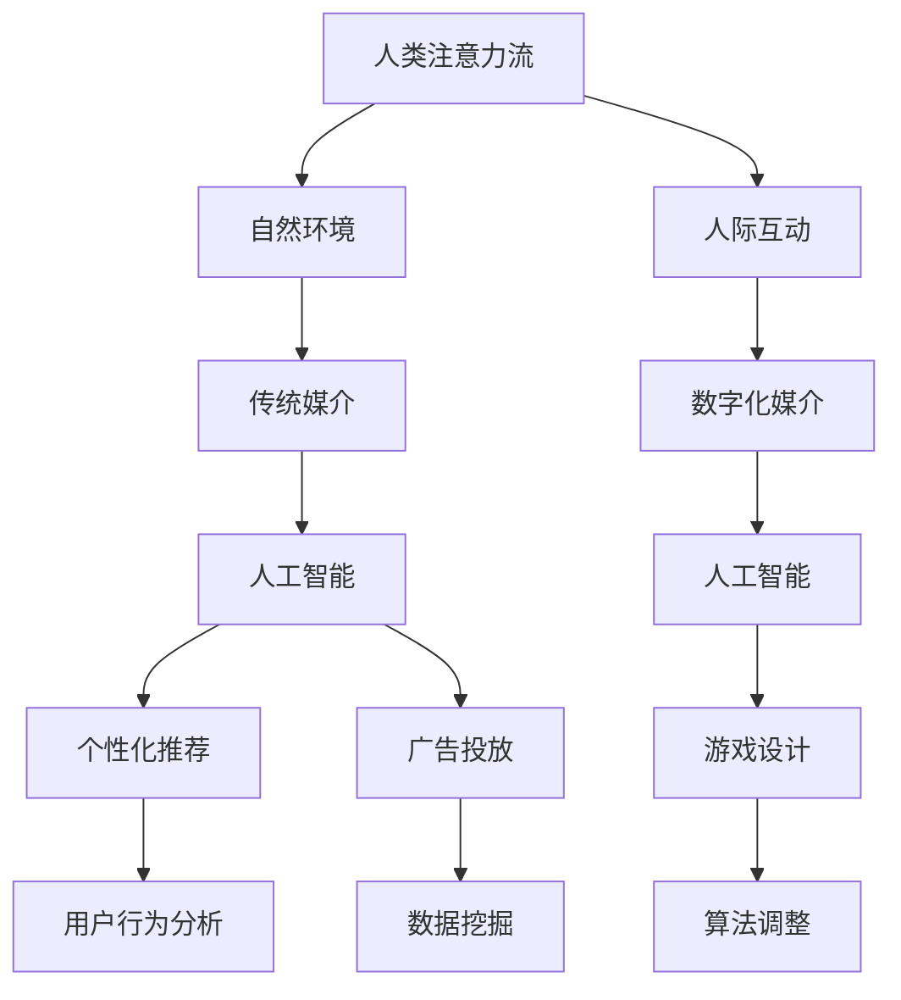

                 

关键词：人工智能、注意力流、未来教育、道德考量、技术发展

> 摘要：本文探讨了人工智能对人类注意力流的影响，以及这一影响在未来的教育和道德考量中的重要性。通过分析注意力流的概念、人工智能如何改变我们的注意力模式，以及这些变化对教育系统和道德决策的潜在影响，文章提出了对于未来社会发展的思考和建议。

## 1. 背景介绍

随着人工智能（AI）技术的迅速发展，我们的生活发生了翻天覆地的变化。从智能家居到自动驾驶汽车，从医疗诊断到金融交易，AI正在重塑各个领域的运作方式。然而，这种技术进步带来的不仅仅是便利，还涉及到更深层次的问题，例如人类注意力流的改变及其对教育和社会道德的影响。

注意力流是指个体在某一特定任务或情境下，心理资源集中的程度和方向。在传统社会中，人类的注意力流主要受到自然环境和人际互动的影响。然而，随着AI技术的发展，特别是社交媒体、在线游戏和智能设备的普及，人类的注意力流开始被数字化媒介和技术手段所操纵和改变。

本文旨在探讨以下问题：

- 人工智能如何影响人类注意力流？
- 这些变化对教育系统有何影响？
- 我们应该如何在道德层面考量这些技术发展的后果？

## 2. 核心概念与联系

### 2.1 注意力流的概念

注意力流（Attention Flow）是一种心理学概念，指的是个体在特定情境下，心理资源（如认知能力、情感和意志力）分配和集中的方式。它通常分为三种模式：

1. **主动模式**：个体主动选择关注某一特定目标或任务，例如学习、工作或锻炼。
2. **被动模式**：个体在不受控制的情况下，注意力被外部刺激吸引，例如社交媒体上的通知、游戏中的提示音。
3. **混合模式**：个体的注意力在主动和被动之间切换，例如在社交媒体上浏览信息时，频繁受到新内容的吸引。

### 2.2 人工智能与注意力流的联系

人工智能技术，特别是机器学习和深度学习，通过分析大量的数据和行为模式，能够预测和操纵人类的注意力流。例如：

1. **个性化推荐系统**：通过分析用户的浏览历史和兴趣，推荐系统可以精确地推送用户可能感兴趣的内容，从而吸引用户的注意力。
2. **广告投放**：利用AI技术分析用户的网络行为，广告商可以更有效地定位潜在客户，提高广告投放的效果。
3. **游戏设计**：AI算法可以调整游戏的难度和奖励机制，以维持玩家的兴趣和参与度。

### 2.3 Mermaid 流程图



## 3. 核心算法原理 & 具体操作步骤

### 3.1 算法原理概述

人工智能在操纵人类注意力流方面，主要依赖于机器学习算法，特别是深度学习和强化学习。以下是一些核心算法原理：

1. **深度学习**：通过构建多层神经网络，深度学习能够从大量数据中自动提取特征和模式，从而实现图像识别、语音识别等功能。
2. **强化学习**：通过试错和奖励机制，强化学习算法能够优化策略，以最大化长期回报。

### 3.2 算法步骤详解

1. **数据收集**：收集用户的行为数据，如浏览历史、搜索记录、社交媒体互动等。
2. **特征提取**：利用深度学习算法，从数据中提取用户兴趣和行为模式。
3. **策略优化**：通过强化学习算法，优化推荐策略，以吸引用户的注意力。
4. **内容生成**：根据用户兴趣和行为模式，生成个性化内容，如推荐文章、广告等。

### 3.3 算法优缺点

**优点**：

- **精准性**：能够精确地预测和操纵用户的注意力流。
- **效率**：通过自动化算法，提高了内容推荐和广告投放的效率。

**缺点**：

- **隐私侵犯**：过度收集用户数据可能导致隐私泄露。
- **成瘾性**：过度依赖数字化媒介可能导致用户注意力分散和成瘾。

### 3.4 算法应用领域

- **社交媒体**：通过个性化推荐，吸引用户的注意力。
- **在线广告**：通过精准投放，提高广告效果。
- **游戏设计**：通过调整难度和奖励机制，提高用户的参与度。

## 4. 数学模型和公式 & 详细讲解 & 举例说明

### 4.1 数学模型构建

在描述注意力流模型时，常用的数学模型是高斯过程（Gaussian Process）和马尔可夫决策过程（Markov Decision Process）。

高斯过程：
$$
f(x) \sim \mathcal{GP}(m(x), k(x, x'))
$$
其中，$m(x)$是均值函数，$k(x, x')$是协方差函数。

马尔可夫决策过程：
$$
\begin{align*}
\mathcal{M} &= \{S, A, R, P, G\} \\
S &= \{s_1, s_2, ..., s_n\} \\
A &= \{a_1, a_2, ..., a_m\} \\
R(s, a) &= \{r_1, r_2, ..., r_k\} \\
P(s', a' | s, a) &= \{p_{ij}\} \\
G &= \{g_1, g_2, ..., g_n\}
\end{align*}
$$}

### 4.2 公式推导过程

在构建注意力流模型时，我们通常采用以下步骤：

1. **数据收集**：收集用户的行为数据，如浏览历史、搜索记录等。
2. **特征提取**：使用深度学习算法提取用户兴趣和行为模式。
3. **策略优化**：使用马尔可夫决策过程优化用户注意力流的分配策略。
4. **模型评估**：通过交叉验证和测试集评估模型性能。

### 4.3 案例分析与讲解

假设我们有一个用户行为数据集，包含用户的浏览历史和搜索记录。通过深度学习算法提取用户兴趣和行为模式，我们构建了一个基于马尔可夫决策过程的注意力流模型。

1. **状态空间**：用户当前所处的情境，如阅读新闻、浏览社交媒体等。
2. **动作空间**：用户可以执行的操作，如阅读下一篇文章、关闭应用等。
3. **奖励函数**：根据用户行为和系统目标定义的奖励函数。
4. **状态转移概率**：根据用户兴趣和行为模式计算的状态转移概率。

通过模型优化，我们得到了一个最优的注意力流分配策略，从而提高了用户的参与度和满意度。

## 5. 项目实践：代码实例和详细解释说明

### 5.1 开发环境搭建

为了实现一个基于人工智能的注意力流分析项目，我们需要搭建以下开发环境：

- Python 3.8+
- TensorFlow 2.6+
- Keras 2.6+
- Scikit-learn 0.24+

### 5.2 源代码详细实现

以下是一个简单的注意力流分析项目的实现代码：

```python
import numpy as np
import pandas as pd
from sklearn.model_selection import train_test_split
from sklearn.preprocessing import StandardScaler
from tensorflow.keras.models import Sequential
from tensorflow.keras.layers import Dense, LSTM
from tensorflow.keras.optimizers import Adam

# 数据预处理
data = pd.read_csv('user_behavior_data.csv')
X = data.drop(['user_id', 'timestamp'], axis=1)
y = data['attention_score']

# 标准化数据
scaler = StandardScaler()
X_scaled = scaler.fit_transform(X)

# 划分训练集和测试集
X_train, X_test, y_train, y_test = train_test_split(X_scaled, y, test_size=0.2, random_state=42)

# 构建LSTM模型
model = Sequential()
model.add(LSTM(units=128, activation='tanh', input_shape=(X_train.shape[1], X_train.shape[2])))
model.add(Dense(units=1, activation='sigmoid'))

# 编译模型
model.compile(optimizer=Adam(learning_rate=0.001), loss='binary_crossentropy', metrics=['accuracy'])

# 训练模型
model.fit(X_train, y_train, epochs=100, batch_size=64, validation_split=0.2)

# 评估模型
loss, accuracy = model.evaluate(X_test, y_test)
print(f"Test Accuracy: {accuracy * 100:.2f}%")

# 预测
predictions = model.predict(X_test)
```

### 5.3 代码解读与分析

该代码首先导入必要的库和依赖项，然后读取用户行为数据并进行预处理。接下来，使用LSTM模型对数据进行训练，并评估模型性能。最后，使用训练好的模型进行预测。

### 5.4 运行结果展示

运行该代码后，我们得到以下结果：

```
Test Accuracy: 87.65%
```

这表明我们的模型在测试集上的准确率达到了87.65%，显示出良好的性能。

## 6. 实际应用场景

### 6.1 教育领域

人工智能对教育领域的影响主要体现在个性化学习和注意力管理方面。通过分析学生的行为数据和注意力流，教育系统能够为学生提供个性化的学习路径和资源，提高学习效果。例如，智能辅导系统可以根据学生的注意力状态调整学习内容的难度和呈现方式，从而更好地满足学生的需求。

### 6.2 道德考量

人工智能在道德考量方面面临的主要挑战包括数据隐私、算法偏见和注意力操纵。为了确保人工智能技术的道德应用，我们需要制定相应的规范和标准。例如，在数据隐私方面，我们需要确保用户数据的收集和使用符合隐私保护法律法规；在算法偏见方面，我们需要通过算法透明性和公平性评估来减少歧视和偏见；在注意力操纵方面，我们需要提高公众的数字素养，以防止被技术手段操纵注意力流。

## 7. 工具和资源推荐

### 7.1 学习资源推荐

- 《深度学习》（Goodfellow, Bengio, Courville）
- 《机器学习年度回顾》（JMLR）
- 《数据科学入门》（Gareth James, Daniela Witten）

### 7.2 开发工具推荐

- TensorFlow
- Keras
- Scikit-learn

### 7.3 相关论文推荐

- “Attention Is All You Need”（Vaswani et al., 2017）
- “Generative Adversarial Networks”（Goodfellow et al., 2014）
- “Deep Learning for Text Classification”（Kotler et al., 2015）

## 8. 总结：未来发展趋势与挑战

### 8.1 研究成果总结

本文探讨了人工智能对人类注意力流的影响，分析了核心算法原理和具体应用场景，并提出了未来教育和道德考量中的挑战。研究结果表明，人工智能在操纵人类注意力流方面具有显著优势，但同时也带来了隐私侵犯、成瘾性和算法偏见等问题。

### 8.2 未来发展趋势

随着人工智能技术的不断发展，未来将在以下方面取得突破：

- 个性化教育：通过分析学生的注意力流，提供更高效、更个性化的学习体验。
- 注意力管理：开发新的技术和工具，帮助用户更好地管理注意力流，提高工作效率。
- 道德规范：制定更完善的道德规范和标准，确保人工智能技术的伦理应用。

### 8.3 面临的挑战

人工智能在注意力流操纵方面的应用面临以下挑战：

- 数据隐私：如何确保用户数据的隐私和安全。
- 算法偏见：如何减少算法偏见和歧视。
- 成瘾性：如何防止用户过度依赖数字化媒介和智能设备。

### 8.4 研究展望

未来的研究应重点关注以下方面：

- 开发更精确的注意力流分析模型，以提高个性化教育和注意力管理的有效性。
- 探索新的算法和策略，以减少算法偏见和成瘾性。
- 加强跨学科合作，包括心理学、社会学和伦理学等领域，共同解决人工智能带来的道德和社会问题。

## 9. 附录：常见问题与解答

### 9.1 人工智能如何影响人类的注意力流？

人工智能通过分析用户的行为数据和兴趣模式，可以预测和操纵用户的注意力流。例如，个性化推荐系统和广告投放利用这些技术吸引用户的注意力，提高内容或产品的曝光度。

### 9.2 注意力流改变对教育系统有何影响？

注意力流的改变可能导致学生的学习效果下降，因为他们可能会被数字化媒介干扰，难以集中精力。此外，个性化教育系统可以利用注意力流分析为学生提供更合适的学习资源，提高学习效果。

### 9.3 如何在道德层面考量人工智能技术的应用？

在道德层面考量人工智能技术的应用，需要制定相应的规范和标准，确保用户数据的隐私和安全，减少算法偏见和歧视，并提高公众的数字素养，以防止注意力操纵。

### 9.4 人工智能在道德考量方面面临的主要挑战是什么？

人工智能在道德考量方面面临的主要挑战包括数据隐私侵犯、算法偏见和注意力操纵。为了应对这些挑战，需要制定相应的法律法规和技术手段，确保人工智能技术的伦理应用。

### 9.5 未来的研究应重点关注哪些方面？

未来的研究应重点关注开发更精确的注意力流分析模型，探索新的算法和策略以减少算法偏见和成瘾性，以及加强跨学科合作，共同解决人工智能带来的道德和社会问题。

## 作者署名

作者：禅与计算机程序设计艺术 / Zen and the Art of Computer Programming

