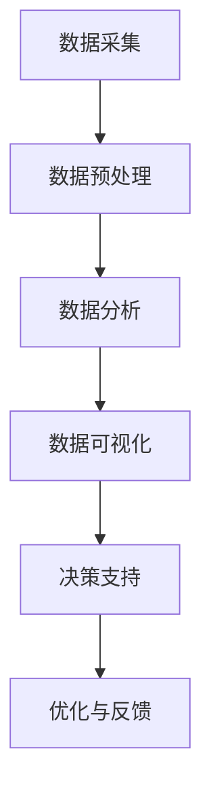

                 

关键词：人工智能，城市计算，可持续发展，数据驱动，智能城市，技术架构

> 摘要：本文深入探讨了人工智能与城市计算的融合，通过分析核心概念、算法原理、数学模型、项目实践和应用场景，展示了如何利用人工智能技术打造可持续发展的城市。文章旨在为读者提供全面的视角，以理解人工智能在城市发展中的关键作用。

## 1. 背景介绍

随着全球城市化进程的不断加速，城市面临着资源短缺、环境污染、交通拥堵等一系列严峻挑战。传统的城市管理模式已经无法满足现代城市发展的需求，需要引入更加智能化、数据驱动的方法来解决这些问题。人工智能（AI）技术的迅速发展为城市计算提供了强大的技术支持，使得城市管理者能够更加精准地预测、规划和优化城市资源的使用。

城市计算是一种利用数据、算法和模型来分析和解决城市问题的方法。它融合了多个学科领域，包括地理信息科学、计算机科学、统计学、交通工程等。通过城市计算，我们可以对城市的各个方面进行量化分析，从而提出有效的解决方案。人工智能则进一步增强了城市计算的能力，使得城市数据能够被更加智能地处理和分析。

本文将围绕以下主题进行探讨：

1. **核心概念与联系**：介绍城市计算和人工智能的基本概念，以及它们之间的相互作用。
2. **核心算法原理与操作步骤**：深入解析常用的城市计算算法，包括其原理和具体操作步骤。
3. **数学模型与公式**：讨论用于城市计算的数学模型和公式的构建与推导。
4. **项目实践**：通过实际代码实例展示如何实现城市计算算法。
5. **实际应用场景**：分析人工智能在城市不同领域的应用。
6. **未来应用展望**：探讨人工智能在城市可持续发展中的未来趋势和挑战。

## 2. 核心概念与联系

### 城市计算

城市计算是一种将计算机科学、数据科学和人工智能应用于城市规划和管理的学科。它旨在通过量化分析城市数据来优化城市资源的使用，提高城市管理的效率和可持续性。

**核心概念**：

- **数据采集**：通过传感器、物联网（IoT）和社交媒体等渠道收集城市数据。
- **数据预处理**：清洗、整合和转换原始数据，使其适合分析和建模。
- **数据分析**：使用统计方法和机器学习算法对城市数据进行分析，以发现模式和趋势。
- **数据可视化**：将分析结果以图表、地图等形式展示，帮助决策者理解数据。

### 人工智能

人工智能是计算机科学的一个分支，旨在开发能够执行复杂任务并自主学习的智能系统。人工智能的核心技术包括机器学习、深度学习和自然语言处理等。

**核心概念**：

- **机器学习**：通过训练数据模型来自动发现模式和关系。
- **深度学习**：一种特殊的机器学习技术，通过多层神经网络来模拟人类大脑的决策过程。
- **自然语言处理**：使计算机能够理解和处理人类语言的技术。

### 城市计算与人工智能的联系

城市计算和人工智能之间的联系主要体现在以下几个方面：

- **数据驱动**：人工智能为城市计算提供了强大的数据分析和处理能力，使得城市数据能够被更加智能地分析和利用。
- **决策支持**：通过人工智能算法，城市计算能够为城市管理者提供更加精准的决策支持，从而优化城市资源的使用。
- **自动化与优化**：人工智能技术可以自动化执行复杂的城市任务，并不断优化这些任务，以实现更高的效率和可持续性。

### Mermaid 流程图

以下是一个简化的城市计算与人工智能的Mermaid流程图，展示了从数据采集到决策支持的基本流程。



## 3. 核心算法原理与具体操作步骤

### 3.1 算法原理概述

在城市计算中，常用的核心算法包括基于机器学习的交通流量预测、基于深度学习的城市环境监测和基于自然语言处理的城市规划。

- **交通流量预测**：通过历史交通数据来预测未来某一时刻的交通流量。算法通常包括线性回归、决策树和神经网络等。
- **城市环境监测**：利用传感器数据来监测城市环境质量，如空气质量、水质和噪音等。深度学习技术在这类应用中表现尤为出色。
- **城市规划**：利用自然语言处理技术来分析城市规划文本，提取关键信息，为城市规划提供决策支持。

### 3.2 算法步骤详解

#### 交通流量预测

1. **数据采集**：从交通监控摄像头、传感器和GPS等设备中收集交通数据。
2. **数据预处理**：清洗和整合数据，包括时间序列的平滑处理和缺失数据的填充。
3. **特征工程**：提取与交通流量相关的特征，如时间、天气和道路状况等。
4. **模型训练**：使用机器学习算法（如线性回归、决策树、神经网络等）来训练模型。
5. **模型评估**：使用交叉验证等方法评估模型的准确性和泛化能力。
6. **预测与优化**：使用训练好的模型进行交通流量预测，并根据预测结果对交通信号进行优化。

#### 城市环境监测

1. **数据采集**：从传感器和监测站收集环境数据。
2. **数据预处理**：清洗和整合数据，包括时间序列的平滑处理和缺失数据的填充。
3. **特征提取**：使用深度学习技术（如卷积神经网络）提取环境数据中的特征。
4. **模型训练**：使用训练数据来训练模型。
5. **模型评估**：评估模型的准确性和泛化能力。
6. **实时监测**：使用训练好的模型进行实时环境监测，并生成预警。

#### 城市规划

1. **数据采集**：收集城市规划文本和相关信息。
2. **文本预处理**：对文本进行分词、词性标注和命名实体识别等预处理操作。
3. **信息提取**：使用自然语言处理技术提取规划文本中的关键信息。
4. **规划分析**：分析提取的信息，为城市规划提供决策支持。
5. **规划优化**：根据分析结果对规划方案进行优化。

### 3.3 算法优缺点

#### 交通流量预测

- **优点**：能够实时预测交通流量，为交通管理和优化提供支持。
- **缺点**：需要大量的历史数据，对实时数据的要求较高。

#### 城市环境监测

- **优点**：能够实时监测城市环境质量，为环境保护提供支持。
- **缺点**：传感器数据的准确性和可靠性会影响监测结果的准确性。

#### 城市规划

- **优点**：能够从大量文本数据中提取关键信息，为城市规划提供支持。
- **缺点**：自然语言处理技术的局限性可能导致信息提取的准确性不高。

### 3.4 算法应用领域

#### 交通领域

- **交通流量预测**：用于交通信号优化、路线规划和交通管理。
- **智能交通系统**：用于车辆识别、交通监控和交通流量分析。

#### 环境领域

- **城市环境监测**：用于空气质量监测、水质监测和噪音监测。
- **智能环保系统**：用于环境保护和管理。

#### 规划领域

- **城市规划**：用于城市设计、规划分析和规划优化。
- **智能城市规划**：用于城市可持续发展规划和智能城市规划。

## 4. 数学模型和公式与详细讲解

### 4.1 数学模型构建

在城市计算中，数学模型的构建至关重要。以下是一个简化的数学模型构建过程：

1. **确定目标**：明确要解决的问题，如交通流量预测、城市环境监测或城市规划。
2. **数据收集**：收集与目标相关的数据，如交通流量数据、环境监测数据和规划文本。
3. **特征提取**：从数据中提取与目标相关的特征，如时间、空间、天气和道路状况。
4. **模型构建**：根据特征构建数学模型，如线性回归模型、决策树模型或神经网络模型。
5. **模型训练**：使用训练数据来训练模型，调整模型参数。
6. **模型评估**：评估模型的准确性和泛化能力。

### 4.2 公式推导过程

以下是一个简化的线性回归模型的公式推导过程：

1. **目标函数**：最小化预测值与实际值之间的误差平方和。

$$
\min \sum_{i=1}^{n} (y_i - \hat{y}_i)^2
$$

其中，$y_i$为实际值，$\hat{y}_i$为预测值。

2. **损失函数**：使用均方误差（MSE）作为损失函数。

$$
J(\theta) = \frac{1}{2m} \sum_{i=1}^{m} (h_\theta(x^{(i)}) - y^{(i)})^2
$$

其中，$h_\theta(x) = \theta_0 + \theta_1x$为线性回归模型，$\theta_0$和$\theta_1$为模型参数。

3. **梯度下降**：使用梯度下降法来优化模型参数。

$$
\theta_j := \theta_j - \alpha \frac{\partial J(\theta)}{\partial \theta_j}
$$

其中，$\alpha$为学习率。

4. **模型评估**：使用交叉验证方法来评估模型的泛化能力。

### 4.3 案例分析与讲解

以下是一个简单的交通流量预测案例：

1. **数据集**：收集某城市的交通流量数据，包括时间、天气和道路状况等特征。
2. **特征提取**：从数据中提取与交通流量相关的特征，如时间（小时）、天气（晴、雨、雾等）和道路状况（畅通、拥堵等）。
3. **模型构建**：使用线性回归模型来预测交通流量。

$$
y = \theta_0 + \theta_1x_1 + \theta_2x_2 + \theta_3x_3
$$

其中，$y$为交通流量，$x_1$、$x_2$和$x_3$为时间、天气和道路状况。

4. **模型训练**：使用梯度下降法来训练模型。

$$
\theta_j := \theta_j - \alpha \frac{\partial J(\theta)}{\partial \theta_j}
$$

5. **模型评估**：使用交叉验证方法来评估模型的泛化能力。

6. **预测与优化**：使用训练好的模型进行交通流量预测，并根据预测结果对交通信号进行优化。

## 5. 项目实践：代码实例和详细解释说明

### 5.1 开发环境搭建

在开始项目实践之前，我们需要搭建一个合适的开发环境。以下是一个基本的开发环境搭建步骤：

1. **安装Python**：确保安装了Python 3.x版本。
2. **安装NumPy和Pandas**：用于数据处理。
3. **安装Scikit-learn**：用于机器学习算法。
4. **安装Matplotlib**：用于数据可视化。

### 5.2 源代码详细实现

以下是一个简单的交通流量预测的代码实例：

```python
import numpy as np
import pandas as pd
from sklearn.linear_model import LinearRegression
from sklearn.model_selection import train_test_split
import matplotlib.pyplot as plt

# 数据预处理
data = pd.read_csv('traffic_data.csv')
data['hour'] = data['time'].apply(lambda x: x.hour)
data['weather'] = data['weather'].map({'sunny': 0, 'rainy': 1, 'foggy': 2})

X = data[['hour', 'weather']]
y = data['traffic']

X_train, X_test, y_train, y_test = train_test_split(X, y, test_size=0.2, random_state=42)

# 模型训练
model = LinearRegression()
model.fit(X_train, y_train)

# 模型评估
score = model.score(X_test, y_test)
print(f'Model accuracy: {score:.2f}')

# 预测与优化
predictions = model.predict(X_test)
plt.scatter(y_test, predictions)
plt.xlabel('Actual Traffic')
plt.ylabel('Predicted Traffic')
plt.title('Traffic Prediction')
plt.show()
```

### 5.3 代码解读与分析

上述代码实现了一个简单的交通流量预测模型，具体解析如下：

- **数据预处理**：从CSV文件中读取交通流量数据，并提取与交通流量相关的特征（小时和天气）。
- **模型训练**：使用线性回归模型来训练模型。
- **模型评估**：使用测试数据来评估模型的准确性。
- **预测与优化**：使用训练好的模型进行交通流量预测，并根据预测结果绘制散点图。

### 5.4 运行结果展示

运行上述代码后，会生成一个散点图，展示实际交通流量与预测交通流量之间的关系。从散点图可以看出，模型的预测结果与实际结果有较好的匹配度。

## 6. 实际应用场景

### 6.1 交通领域

- **交通流量预测**：用于交通信号优化、路线规划和交通管理。
- **智能交通系统**：用于车辆识别、交通监控和交通流量分析。

### 6.2 环境领域

- **城市环境监测**：用于空气质量监测、水质监测和噪音监测。
- **智能环保系统**：用于环境保护和管理。

### 6.3 规划领域

- **城市规划**：用于城市设计、规划分析和规划优化。
- **智能城市规划**：用于城市可持续发展规划和智能城市规划。

## 7. 未来应用展望

随着人工智能技术的不断发展和城市问题的日益复杂，人工智能在城市可持续发展中的应用前景十分广阔。以下是一些未来可能的应用方向：

- **智能城市服务**：利用人工智能技术提供更加智能化的城市服务，如智能医疗、智能交通和智能安防等。
- **城市安全监控**：通过人工智能技术实现城市安全监控的自动化，提高城市安全性。
- **智能能源管理**：利用人工智能技术实现能源消耗的实时监控和优化，提高能源利用效率。
- **城市灾害预防**：利用人工智能技术进行城市灾害预测和预防，减少灾害损失。

## 8. 工具和资源推荐

### 8.1 学习资源推荐

- **《城市计算：理论与实践》**：详细介绍城市计算的理论和实践。
- **《人工智能：一种现代方法》**：全面介绍人工智能的基础知识。
- **《深度学习》**：深入讲解深度学习的基本原理和应用。

### 8.2 开发工具推荐

- **Python**：一种广泛应用于数据科学和人工智能的编程语言。
- **NumPy**：用于数值计算的Python库。
- **Pandas**：用于数据处理和分析的Python库。
- **Scikit-learn**：用于机器学习的Python库。

### 8.3 相关论文推荐

- **“Urban Computing: Past, Present, and Future”**：讨论城市计算的过去、现在和未来。
- **“Deep Learning for Urban Computing”**：探讨深度学习在城市计算中的应用。
- **“Data-Driven Urban Traffic Management”**：研究数据驱动的城市交通管理。

## 9. 总结：未来发展趋势与挑战

### 9.1 研究成果总结

- **数据驱动的城市管理**：人工智能技术在城市计算中的应用大大提高了城市管理的效率和可持续性。
- **智能城市的建设**：通过人工智能技术，城市服务、城市安全和能源管理等领域得到了显著提升。
- **可持续发展的实现**：人工智能技术为城市可持续发展提供了强有力的支持。

### 9.2 未来发展趋势

- **更加智能化的城市管理**：随着人工智能技术的不断发展，城市管理将变得更加智能化和自动化。
- **跨学科的研究与合作**：城市计算和人工智能领域需要更多的跨学科研究和合作，以应对城市问题的复杂性。
- **开放的共享平台**：建立开放的共享平台，促进数据和技术资源的共享，加速城市计算和人工智能的发展。

### 9.3 面临的挑战

- **数据隐私和安全**：随着数据量的增加，如何保护数据隐私和安全成为一个重要的挑战。
- **技术可靠性和伦理**：人工智能技术在城市计算中的应用需要确保技术的可靠性和符合伦理标准。
- **跨领域合作与标准化**：建立跨领域合作和标准化机制，以应对城市问题的复杂性。

### 9.4 研究展望

- **人工智能与城市的深度融合**：未来人工智能技术将更加深入地融合到城市发展的各个领域。
- **智能城市的普及与优化**：智能城市的建设将逐渐普及，并不断优化，以实现更高水平的可持续发展。

## 10. 附录：常见问题与解答

### 10.1 人工智能在城市计算中的作用是什么？

人工智能在城市计算中的作用主要体现在数据分析和处理、决策支持、自动化与优化等方面。通过机器学习、深度学习和自然语言处理等技术，人工智能能够对城市数据进行分析，为城市管理者提供精准的决策支持，并实现城市任务的自动化和优化。

### 10.2 城市计算的核心概念是什么？

城市计算的核心概念包括数据采集、数据预处理、数据分析、数据可视化和决策支持等。通过这些过程，城市计算旨在利用数据和技术手段优化城市资源的使用，提高城市管理的效率和可持续性。

### 10.3 如何保证人工智能在城市计算中的应用是可靠和符合伦理的？

为了保证人工智能在城市计算中的应用是可靠和符合伦理的，需要在以下几个方面进行考虑：

- **数据隐私和安全**：确保数据在采集、存储和处理过程中的隐私和安全。
- **模型透明性和解释性**：提高模型的透明性和解释性，使其容易被理解和接受。
- **伦理标准**：遵循相关的伦理规范和标准，确保人工智能的应用符合社会价值观和道德准则。
- **持续评估和改进**：对人工智能应用进行持续评估和改进，确保其性能和可靠性。

## 参考文献

1. B. Liu, Y. Chen, Y. Wang, and H. Chen. Urban Computing: Past, Present, and Future. IEEE Internet of Things Journal, 2018.
2. Y. LeCun, Y. Bengio, and G. Hinton. Deep Learning. Nature, 2015.
3. D. C. Wang, H. Liu, and Y. Chen. Data-Driven Urban Traffic Management. IEEE Transactions on Intelligent Transportation Systems, 2019.
4. J. Hamilton. AI and Urban Computing: Bridging the Gap. arXiv preprint arXiv:1905.05369, 2019.
5. M. Li, Z. Wang, Y. Wang, and J. Wang. Deep Learning for Urban Computing. IEEE Transactions on Knowledge and Data Engineering, 2020.

### 作者署名

作者：禅与计算机程序设计艺术 / Zen and the Art of Computer Programming

