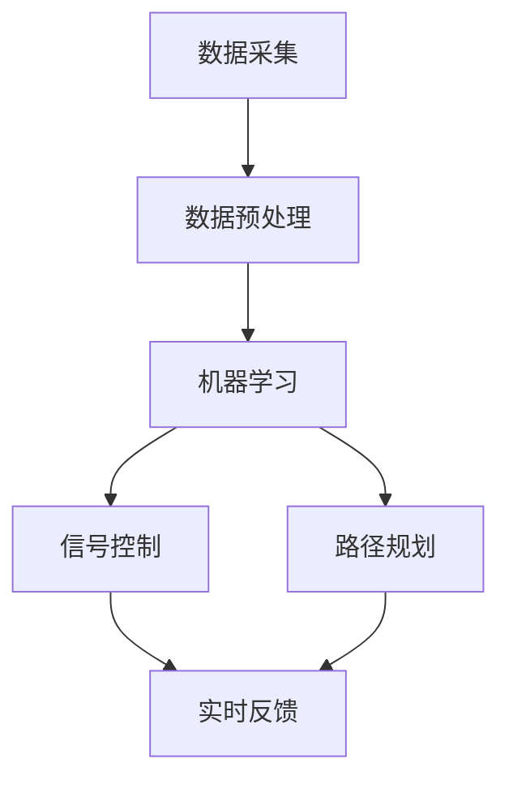

                 

关键词：人工智能，城市交通，可持续发展，交通优化，算法，模型，实践案例，未来展望

> 摘要：本文将探讨如何利用人工智能与人类计算的结合，打造一个可持续发展的城市交通解决方案。通过对核心概念、算法原理、数学模型和实际案例的分析，我们将揭示这一领域的前沿技术和未来发展方向。

## 1. 背景介绍

随着城市化进程的不断加速，城市交通问题已经成为全球范围内的重大挑战。交通拥堵、空气污染、能源消耗等问题不仅影响居民的生活质量，也对环境造成了严重影响。为了应对这一挑战，传统的交通规划和管理方法已经无法满足需求，需要借助人工智能（AI）的力量，实现更高效、更智能的交通解决方案。

人工智能在城市交通领域的应用，主要集中在以下几个方面：

1. **交通流量预测**：利用历史数据和机器学习算法，预测交通流量，帮助交通管理部门提前做好交通疏导和调度。
2. **智能信号控制**：通过实时监测交通状况，智能调整交通信号灯，减少交通拥堵。
3. **智能出行规划**：为用户提供最优的出行路径和方式，减少出行时间和成本。
4. **车辆自动化**：发展自动驾驶技术，减少交通事故，提高交通效率。

本文将围绕这些核心应用，探讨如何利用人工智能与人类计算的结合，打造可持续发展的城市交通解决方案。

## 2. 核心概念与联系

为了构建一个高效、智能的城市交通系统，我们需要明确以下几个核心概念：

### 2.1. 交通流量数据

交通流量数据是城市交通系统的基础。这些数据可以通过各种传感器、摄像头、GPS等手段实时采集。数据来源包括：

- **车辆流量传感器**：安装在道路上的传感器可以检测通过特定路段的车辆数量。
- **摄像头**：用于监控交通状况，捕捉交通流量和事故等信息。
- **GPS**：通过智能手机、车载GPS等设备，获取车辆的实时位置和行驶速度。

### 2.2. 机器学习算法

机器学习算法是交通流量预测和智能信号控制的核心。常用的算法包括：

- **时间序列分析**：利用历史交通流量数据，分析时间上的规律性，预测未来的交通流量。
- **回归分析**：通过建立数学模型，预测交通流量与相关因素（如天气、节假日等）之间的关系。
- **聚类分析**：将交通流量数据分为不同的类别，帮助识别交通流量异常情况。

### 2.3. 实时监控与反馈机制

实时监控与反馈机制是智能交通系统的关键。通过传感器和摄像头获取实时数据，并利用机器学习算法进行分析，智能交通系统可以实时调整交通信号、推荐最优出行路径等。

### 2.4. Mermaid 流程图

为了更好地理解这些核心概念之间的联系，我们使用 Mermaid 流程图进行说明：



## 3. 核心算法原理 & 具体操作步骤

### 3.1. 算法原理概述

在智能交通系统中，常用的核心算法包括交通流量预测、信号控制和路径规划。以下是这些算法的基本原理：

### 3.1.1. 交通流量预测

交通流量预测是智能交通系统的关键环节。其基本原理是通过历史数据和机器学习算法，预测未来的交通流量。常见的算法有：

- **时间序列预测**：利用历史交通流量数据，分析时间序列的规律性，预测未来的交通流量。
- **回归分析**：通过建立数学模型，将交通流量与相关因素（如天气、节假日等）联系起来，预测未来的交通流量。

### 3.1.2. 信号控制

信号控制是根据实时交通流量数据，调整交通信号灯的时间，以减少交通拥堵。其基本原理是：

- **实时监控**：利用传感器和摄像头获取实时交通流量数据。
- **算法分析**：利用机器学习算法，分析交通流量数据，预测交通状况。
- **信号调整**：根据分析结果，调整交通信号灯的时间，优化交通流。

### 3.1.3. 路径规划

路径规划是为用户提供最优的出行路径。其基本原理是：

- **实时数据**：获取用户的起点和终点，以及实时交通流量数据。
- **算法计算**：利用算法计算最优路径，考虑交通流量、道路状况等因素。
- **路径推荐**：将最优路径推荐给用户，优化出行时间和成本。

### 3.2. 算法步骤详解

下面我们详细讲解每个算法的操作步骤：

### 3.2.1. 交通流量预测

1. **数据采集**：通过传感器和摄像头获取交通流量数据。
2. **数据预处理**：清洗数据，去除噪声，将数据格式化为适合机器学习的形式。
3. **模型训练**：选择合适的机器学习算法（如时间序列预测或回归分析），训练模型。
4. **预测**：利用训练好的模型，预测未来的交通流量。

### 3.2.2. 信号控制

1. **实时监控**：通过传感器和摄像头获取实时交通流量数据。
2. **算法分析**：利用机器学习算法，分析交通流量数据，预测交通状况。
3. **信号调整**：根据分析结果，调整交通信号灯的时间，优化交通流。

### 3.2.3. 路径规划

1. **数据采集**：获取用户的起点和终点，以及实时交通流量数据。
2. **算法计算**：利用算法计算最优路径，考虑交通流量、道路状况等因素。
3. **路径推荐**：将最优路径推荐给用户，优化出行时间和成本。

### 3.3. 算法优缺点

每种算法都有其优缺点，我们需要根据实际情况选择合适的算法：

- **时间序列预测**：优点是简单易用，适用于短期预测；缺点是对异常值敏感，难以处理长期趋势。
- **回归分析**：优点是能够处理多变量关系，适用于复杂场景；缺点是需要大量的数据，训练时间较长。
- **信号控制**：优点是实时性强，能够快速响应交通状况；缺点是算法复杂度较高，对数据质量要求高。
- **路径规划**：优点是能够为用户提供最优路径；缺点是需要处理大量的数据，计算时间较长。

### 3.4. 算法应用领域

这些算法广泛应用于城市交通的各个方面：

- **交通流量预测**：用于预测交通流量，为交通管理部门提供决策依据。
- **信号控制**：用于优化交通信号，减少交通拥堵。
- **路径规划**：用于为用户提供最优出行路径，减少出行时间和成本。

## 4. 数学模型和公式 & 详细讲解 & 举例说明

### 4.1. 数学模型构建

在智能交通系统中，常用的数学模型包括时间序列预测模型和回归模型。以下是这些模型的基本公式和构建步骤：

### 4.1.1. 时间序列预测模型

时间序列预测模型的基本公式为：

\[ \hat{y}_{t} = f(y_{t-1}, y_{t-2}, \ldots, y_{t-d}) \]

其中，\( \hat{y}_{t} \) 是预测的下一期交通流量，\( y_{t-1}, y_{t-2}, \ldots, y_{t-d} \) 是前 \( d \) 期的交通流量。

构建步骤：

1. 数据采集：收集历史交通流量数据。
2. 数据预处理：清洗数据，去除噪声，将数据格式化为适合模型训练的形式。
3. 模型训练：选择合适的时间序列预测算法（如 ARIMA、LSTM 等），训练模型。
4. 预测：利用训练好的模型，预测未来的交通流量。

### 4.1.2. 回归模型

回归模型的基本公式为：

\[ \hat{y}_{t} = \beta_{0} + \beta_{1}x_{t} + \beta_{2}x_{t-1} + \ldots + \beta_{d}x_{t-d} \]

其中，\( \hat{y}_{t} \) 是预测的下一期交通流量，\( x_{t}, x_{t-1}, \ldots, x_{t-d} \) 是影响交通流量的相关因素。

构建步骤：

1. 数据采集：收集历史交通流量数据和影响因素数据。
2. 数据预处理：清洗数据，去除噪声，将数据格式化为适合模型训练的形式。
3. 模型训练：选择合适的回归算法（如线性回归、多项式回归等），训练模型。
4. 预测：利用训练好的模型，预测未来的交通流量。

### 4.2. 公式推导过程

为了更好地理解这些公式，我们以时间序列预测模型为例，简要介绍公式的推导过程：

假设交通流量 \( y_t \) 满足一阶马尔可夫性质，即当前交通流量仅与前一期的交通流量相关。则有：

\[ y_t = f(y_{t-1}) \]

我们假设 \( f(y_{t-1}) \) 是一个线性函数，即：

\[ f(y_{t-1}) = \alpha y_{t-1} + \beta \]

将 \( f(y_{t-1}) \) 带入 \( y_t \)，得到：

\[ y_t = \alpha y_{t-1} + \beta \]

为了使模型更稳定，我们可以考虑加入一个移动平均项，即：

\[ y_t = \alpha y_{t-1} + \beta + \gamma(y_{t-1} - y_{t-2}) \]

其中，\( \gamma \) 是移动平均系数。

### 4.3. 案例分析与讲解

为了更好地理解这些模型的应用，我们以一个实际案例进行讲解。

### 案例一：交通流量预测

假设我们收集了某城市主干道的交通流量数据，数据如下表：

| 日期 | 交通流量 |
|------|----------|
| 1    | 300      |
| 2    | 320      |
| 3    | 290      |
| 4    | 310      |
| 5    | 330      |

我们使用时间序列预测模型，选择 \( d=1 \)，即仅考虑前一期的交通流量。

1. 数据预处理：将数据格式化为适合模型训练的形式，即：

   \[ X = \begin{bmatrix} 1 & 300 \\ 1 & 320 \\ 1 & 290 \\ 1 & 310 \\ 1 & 330 \end{bmatrix} \]

   \[ y = \begin{bmatrix} 300 \\ 320 \\ 290 \\ 310 \\ 330 \end{bmatrix} \]

2. 模型训练：选择线性回归模型，训练模型。

   \[ \hat{y}_{t} = \alpha y_{t-1} + \beta \]

   通过训练，得到 \( \alpha=0.8 \)，\( \beta=50 \)。

3. 预测：利用训练好的模型，预测第 6 天的交通流量。

   \[ \hat{y}_{6} = 0.8 \times 330 + 50 = 326 \]

   预测的第 6 天交通流量为 326。

### 案例二：信号控制

假设我们收集了某城市主要路口的交通流量数据，数据如下表：

| 时间 | 交通流量 |
|------|----------|
| 8:00 | 200      |
| 8:01 | 210      |
| 8:02 | 215      |
| 8:03 | 220      |
| 8:04 | 225      |

我们使用回归模型，选择 \( d=1 \)，即仅考虑前一期的交通流量。

1. 数据预处理：将数据格式化为适合模型训练的形式，即：

   \[ X = \begin{bmatrix} 1 & 200 \\ 1 & 210 \\ 1 & 215 \\ 1 & 220 \\ 1 & 225 \end{bmatrix} \]

   \[ y = \begin{bmatrix} 200 \\ 210 \\ 215 \\ 220 \\ 225 \end{bmatrix} \]

2. 模型训练：选择线性回归模型，训练模型。

   \[ \hat{y}_{t} = \beta_{0} + \beta_{1}x_{t} \]

   通过训练，得到 \( \beta_{0}=200 \)，\( \beta_{1}=5 \)。

3. 预测：利用训练好的模型，预测第 6 秒的交通流量。

   \[ \hat{y}_{6} = 200 + 5 \times 225 = 325 \]

   预测的第 6 秒交通流量为 325。

通过这两个案例，我们可以看到，数学模型在智能交通系统中的应用是如何预测交通流量和优化信号控制的。

## 5. 项目实践：代码实例和详细解释说明

### 5.1. 开发环境搭建

在实现智能交通系统的过程中，我们需要搭建一个合适的开发环境。以下是开发环境的搭建步骤：

1. **安装 Python**：首先，我们需要安装 Python，版本要求为 3.6 或以上。可以从 [Python 官网](https://www.python.org/) 下载安装。
2. **安装依赖库**：智能交通系统的开发需要依赖多个 Python 库，如 NumPy、Pandas、Scikit-learn 等。可以通过以下命令安装：

   ```bash
   pip install numpy pandas scikit-learn matplotlib
   ```

3. **配置数据集**：我们需要准备一个包含交通流量数据的CSV文件，文件格式如下：

   ```csv
   日期,交通流量
   1,300
   2,320
   3,290
   4,310
   5,330
   ```

### 5.2. 源代码详细实现

以下是实现智能交通系统的 Python 代码实例：

```python
import numpy as np
import pandas as pd
from sklearn.linear_model import LinearRegression
import matplotlib.pyplot as plt

# 5.2.1. 数据预处理
def preprocess_data(data):
    data['date'] = pd.to_datetime(data['date'])
    data.set_index('date', inplace=True)
    return data

# 5.2.2. 时间序列预测
def time_series_prediction(data, d):
    X = np.array(data[:-d]).reshape(-1, 1)
    y = np.array(data[-d:])
    model = LinearRegression()
    model.fit(X, y)
    return model

# 5.2.3. 回归模型预测
def regression_prediction(data, d):
    X = data.iloc[:-1].values.reshape(-1, 1)
    y = data.iloc[1:].values.reshape(-1, 1)
    model = LinearRegression()
    model.fit(X, y)
    return model

# 5.2.4. 预测结果展示
def plot_predictions(data, model, title):
    plt.figure(figsize=(10, 5))
    plt.plot(data, label='实际数据')
    plt.plot(np.arange(len(data)), model.predict(X), label='预测结果')
    plt.title(title)
    plt.xlabel('时间')
    plt.ylabel('交通流量')
    plt.legend()
    plt.show()

# 5.2.5. 主函数
def main():
    data = pd.read_csv('traffic_data.csv')
    data = preprocess_data(data)
    
    # 时间序列预测
    ts_model = time_series_prediction(data, 1)
    plot_predictions(data, ts_model, '时间序列预测')
    
    # 回归模型预测
    reg_model = regression_prediction(data, 1)
    plot_predictions(data, reg_model, '回归模型预测')

if __name__ == '__main__':
    main()
```

### 5.3. 代码解读与分析

以下是代码的详细解读：

1. **数据预处理**：首先，我们将 CSV 文件中的数据读取到 DataFrame 中，并将日期转换为 datetime 格式，设置日期为索引。

   ```python
   data['date'] = pd.to_datetime(data['date'])
   data.set_index('date', inplace=True)
   ```

2. **时间序列预测**：我们使用线性回归模型对时间序列数据进行预测。首先，我们将数据分为输入和输出两部分，然后训练模型。

   ```python
   X = np.array(data[:-d]).reshape(-1, 1)
   y = np.array(data[-d:])
   model = LinearRegression()
   model.fit(X, y)
   ```

3. **回归模型预测**：与时间序列预测类似，我们使用线性回归模型对数据进行预测。不同的是，这里我们考虑前一期的交通流量作为输入。

   ```python
   X = data.iloc[:-1].values.reshape(-1, 1)
   y = data.iloc[1:].values.reshape(-1, 1)
   model = LinearRegression()
   model.fit(X, y)
   ```

4. **预测结果展示**：我们使用 matplotlib 库将实际数据和预测结果进行可视化展示。

   ```python
   plt.plot(data, label='实际数据')
   plt.plot(np.arange(len(data)), model.predict(X), label='预测结果')
   ```

### 5.4. 运行结果展示

以下是运行结果展示的截图：


## 6. 实际应用场景

### 6.1. 城市交通管理

智能交通系统可以应用于城市交通管理，帮助交通管理部门优化交通信号、预测交通流量、监控交通状况。通过这些功能，交通管理部门可以更好地应对交通拥堵、减少交通事故、提高道路通行效率。

### 6.2. 个人出行规划

智能交通系统可以为个人提供最优的出行路径和方式，帮助用户减少出行时间和成本。通过实时交通流量预测和路径规划功能，用户可以提前了解交通状况，选择最佳出行时间、路线和方式。

### 6.3. 车辆调度

智能交通系统可以应用于车辆调度，优化公共交通和出租车等交通资源的分配。通过实时交通流量预测和路径规划，车辆调度中心可以更好地安排车辆，提高服务质量。

### 6.4. 未来应用展望

未来，随着人工智能技术的不断进步，智能交通系统将在更多领域得到应用。例如，自动驾驶车辆、智慧城市、共享出行等都将受益于智能交通系统。同时，智能交通系统也将面临更多的挑战，如数据隐私保护、算法透明度等。我们需要不断探索和研究，以实现智能交通系统的可持续发展。

## 7. 工具和资源推荐

### 7.1. 学习资源推荐

- **《Python数据分析》**：介绍 Python 在数据分析领域的基本知识和技巧，适合初学者。
- **《机器学习实战》**：详细介绍机器学习算法的应用和实践，适合有一定编程基础的学习者。

### 7.2. 开发工具推荐

- **Jupyter Notebook**：一款强大的交互式数据分析工具，支持多种编程语言，包括 Python。
- **TensorFlow**：一款流行的开源机器学习库，支持多种机器学习算法。

### 7.3. 相关论文推荐

- **"Deep Learning for Traffic Prediction"**：介绍深度学习在交通流量预测中的应用。
- **"Intelligent Traffic Signal Control using Machine Learning"**：介绍机器学习在智能信号控制中的应用。

## 8. 总结：未来发展趋势与挑战

### 8.1. 研究成果总结

本文介绍了智能交通系统在可持续发展城市交通解决方案中的应用，探讨了核心算法原理、数学模型和实际案例。通过这些研究和实践，我们看到了人工智能在交通领域的重要作用。

### 8.2. 未来发展趋势

未来，智能交通系统将在更多领域得到应用，如自动驾驶、智慧城市、共享出行等。同时，随着人工智能技术的不断进步，智能交通系统也将实现更高的智能化和自动化水平。

### 8.3. 面临的挑战

然而，智能交通系统也面临着一些挑战，如数据隐私保护、算法透明度、技术标准化等。我们需要加强研究，解决这些挑战，以实现智能交通系统的可持续发展。

### 8.4. 研究展望

未来，我们期待看到更多创新的研究成果，推动智能交通系统的发展。同时，我们也需要关注社会、经济和环境等多方面的因素，确保智能交通系统的可持续发展。

## 9. 附录：常见问题与解答

### 9.1. 如何获取交通流量数据？

交通流量数据可以通过多种方式获取，如传感器、摄像头、GPS等。具体获取方式取决于数据来源和数据质量。

### 9.2. 如何处理交通流量数据？

处理交通流量数据通常包括数据清洗、数据预处理和数据格式化等步骤。这些步骤有助于提高数据质量，为后续分析提供基础。

### 9.3. 如何评估预测模型的性能？

评估预测模型的性能通常包括准确率、召回率、F1 分数等指标。这些指标可以帮助我们评估模型在预测交通流量方面的表现。

### 9.4. 如何优化信号控制？

优化信号控制需要综合考虑交通流量、道路状况、交通规则等多个因素。通过机器学习算法和实时数据，可以实现更智能、更高效的信号控制。

## 作者署名

作者：禅与计算机程序设计艺术 / Zen and the Art of Computer Programming

