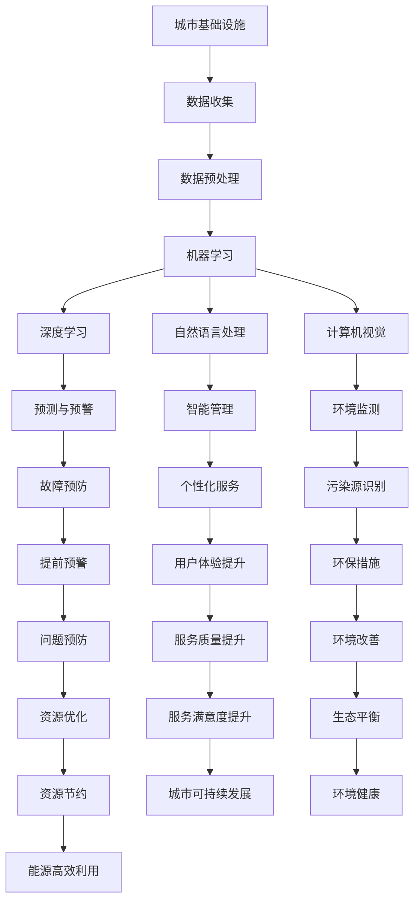

                 

关键词：人工智能、城市基础设施、可持续发展、计算技术、智能城市

摘要：本文深入探讨了人工智能（AI）在城市化进程中扮演的关键角色，特别是在打造可持续发展的城市基础设施建设中的应用。文章首先介绍了城市基础设施的重要性，随后详细分析了AI技术的核心概念与联系，以及其算法原理、数学模型、项目实践、实际应用场景、未来展望等，为读者提供了一个全面而深刻的理解。通过本文的探讨，希望能够为城市规划和建设提供新的思路，助力实现智能城市的可持续发展目标。

## 1. 背景介绍

随着全球城市化进程的加速，城市基础设施建设面临着前所未有的挑战。城市化带来了人口增长、经济活动增加和资源消耗加剧等问题，这对城市的交通、能源、水资源和环境等基础设施提出了更高的要求。传统的城市建设方式往往难以满足这些需求，导致资源浪费、环境污染和城市拥堵等问题日益严重。因此，寻找一种可持续的城市基础设施建设方法成为了当务之急。

人工智能（AI）作为一种具有变革性的技术，为城市基础设施建设提供了新的可能性。AI通过机器学习、深度学习、自然语言处理等技术手段，能够从海量数据中提取有价值的信息，辅助决策者制定更科学、更有效的城市规划和建设方案。此外，AI还能够实现基础设施的智能化管理，提高资源利用效率，减少能源消耗和环境污染。

本文将围绕以下核心问题展开讨论：

- AI在城市化进程中如何发挥作用？
- AI技术如何与城市基础设施建设相结合？
- AI在城市基础设施的哪些方面具有应用潜力？
- 未来，AI在城市基础设施建设中将会带来哪些变革？

通过对这些问题的深入探讨，本文希望能够为城市规划和建设提供新的思路，推动智能城市的可持续发展。

## 2. 核心概念与联系

### 2.1 城市基础设施的概念

城市基础设施是指为满足城市居民生活、生产和社会活动所需的各种物质设施和公共设施的总称。主要包括以下几个方面：

- **交通设施**：如道路、桥梁、隧道、公共交通系统等，负责城市内外的人员和货物运输。
- **能源设施**：如电力、燃气、供水、供热等，为城市提供必需的能源供应。
- **水资源设施**：如自来水厂、污水处理厂、水库等，负责水资源的收集、处理和分配。
- **环境保护设施**：如垃圾处理场、环保监测站等，负责城市环境的保护和治理。

### 2.2 AI技术的核心概念

人工智能（AI）是指通过计算机模拟人类智能行为的技术。其核心概念包括：

- **机器学习（Machine Learning）**：通过数据驱动的方式，让计算机自动识别模式和规律，从而进行预测和决策。
- **深度学习（Deep Learning）**：基于人工神经网络的一种机器学习方法，通过多层神经元的非线性变换，实现对复杂数据的处理和分析。
- **自然语言处理（Natural Language Processing，NLP）**：使计算机能够理解和处理人类语言的技术。
- **计算机视觉（Computer Vision）**：使计算机能够从图像和视频中提取信息，进行识别和分析。

### 2.3 AI与城市基础设施的联系

AI技术与城市基础设施的结合，主要体现在以下几个方面：

- **数据分析与优化**：利用AI技术对城市交通、能源、水资源等数据进行实时分析，优化资源配置，提高服务效率。
- **预测与预警**：通过AI技术对城市基础设施运行状态进行预测和预警，提前发现潜在问题，预防故障发生。
- **智能管理与服务**：利用AI技术实现基础设施的智能化管理，提供个性化服务，提高用户体验。
- **环境监测与治理**：利用AI技术对城市环境进行监测，识别污染源，制定环保措施，实现环境治理。

### 2.4 Mermaid 流程图

下面是一个简单的Mermaid流程图，展示了AI技术在城市基础设施建设中的核心概念与联系：



通过这个流程图，我们可以清晰地看到AI技术如何与城市基础设施相结合，从而实现资源优化、故障预防、智能管理、环境监测与治理等多个方面的目标。

## 3. 核心算法原理 & 具体操作步骤

### 3.1 算法原理概述

AI技术在城市基础设施建设中的应用，主要依赖于以下几种核心算法原理：

- **机器学习算法**：通过学习历史数据，预测未来趋势，优化资源配置，提高服务效率。
- **深度学习算法**：通过多层神经网络，实现复杂数据的深度分析和理解，提升预测准确性。
- **自然语言处理算法**：通过文本分析和语义理解，实现智能对话、信息检索等功能。
- **计算机视觉算法**：通过图像和视频分析，实现物体识别、行为分析等功能。

### 3.2 算法步骤详解

以下是AI技术在城市基础设施建设中应用的详细算法步骤：

#### 3.2.1 数据收集与预处理

1. **数据收集**：从城市基础设施的各类传感器、监控系统、用户反馈等渠道收集数据。
2. **数据预处理**：对收集到的数据进行分析、清洗、去噪，确保数据的质量和一致性。

#### 3.2.2 数据分析与预测

1. **特征提取**：从预处理后的数据中提取关键特征，如交通流量、能源消耗、水资源使用等。
2. **模型训练**：利用机器学习和深度学习算法，对提取的特征进行训练，建立预测模型。
3. **预测与评估**：对预测模型进行评估，根据评估结果调整模型参数，优化预测准确性。

#### 3.2.3 智能管理与优化

1. **智能调度**：根据预测结果，对城市基础设施进行智能调度，优化资源配置，提高服务效率。
2. **故障预防**：利用预测模型，提前发现潜在问题，采取预防措施，减少故障发生。
3. **环境监测与治理**：利用计算机视觉算法，对城市环境进行实时监测，识别污染源，制定环保措施。

### 3.3 算法优缺点

#### 优点：

- **高效性**：通过自动化分析，快速识别问题和机会，提高工作效率。
- **准确性**：基于大数据和深度学习，提高预测和决策的准确性。
- **灵活性**：可以根据不同场景和需求，灵活调整算法和模型，适应复杂环境。

#### 缺点：

- **数据依赖性**：算法的性能依赖于数据的质量和数量，需要大量高质量的训练数据。
- **计算资源消耗**：深度学习等算法需要大量计算资源，对硬件设备要求较高。
- **解释性不足**：部分算法，如深度学习，模型复杂度高，难以解释其决策过程。

### 3.4 算法应用领域

AI技术在城市基础设施建设中具有广泛的应用潜力，主要包括以下几个方面：

- **交通管理**：通过智能调度和预测，优化交通流量，减少拥堵，提高公共交通效率。
- **能源管理**：通过预测能源消耗，优化能源分配，提高能源利用效率，减少能源浪费。
- **水资源管理**：通过实时监测和预测，优化水资源分配，减少水资源浪费，提高水资源利用效率。
- **环境监测**：通过计算机视觉和传感器技术，实时监测城市环境，识别污染源，制定环保措施。

## 4. 数学模型和公式 & 详细讲解 & 举例说明

### 4.1 数学模型构建

在城市基础设施建设中，AI技术广泛使用的数学模型主要包括以下几个方面：

#### 4.1.1 机器学习模型

- **线性回归（Linear Regression）**：用于预测线性关系，公式如下：

  $$ y = \beta_0 + \beta_1x + \epsilon $$

  其中，$y$ 为因变量，$x$ 为自变量，$\beta_0$ 和 $\beta_1$ 为模型参数，$\epsilon$ 为误差项。

- **逻辑回归（Logistic Regression）**：用于预测二分类结果，公式如下：

  $$ P(y=1) = \frac{1}{1 + e^{-(\beta_0 + \beta_1x)}} $$

  其中，$P(y=1)$ 为预测的概率，$\beta_0$ 和 $\beta_1$ 为模型参数。

#### 4.1.2 深度学习模型

- **卷积神经网络（Convolutional Neural Network，CNN）**：用于图像和视频分析，公式如下：

  $$ f(x) = \sigma(W \cdot x + b) $$

  其中，$f(x)$ 为激活函数，$W$ 为权重矩阵，$x$ 为输入数据，$b$ 为偏置项。

- **循环神经网络（Recurrent Neural Network，RNN）**：用于序列数据建模，公式如下：

  $$ h_t = \sigma(W_h \cdot [h_{t-1}, x_t] + b_h) $$

  其中，$h_t$ 为当前时刻的隐藏状态，$x_t$ 为输入数据，$W_h$ 为权重矩阵，$b_h$ 为偏置项。

### 4.2 公式推导过程

以下是一个简单的线性回归模型推导过程：

1. **目标函数**：线性回归的目标是最小化预测值与实际值之间的误差平方和，公式如下：

   $$ J(\theta) = \frac{1}{2m} \sum_{i=1}^{m} (h_\theta(x^{(i)}) - y^{(i)})^2 $$

   其中，$h_\theta(x^{(i)}) = \theta_0 + \theta_1x^{(i)}$，$\theta$ 为模型参数，$m$ 为样本数量。

2. **梯度下降**：为了求解最优参数，使用梯度下降法，公式如下：

   $$ \theta_j := \theta_j - \alpha \frac{\partial J(\theta)}{\partial \theta_j} $$

   其中，$\alpha$ 为学习率，$\frac{\partial J(\theta)}{\partial \theta_j}$ 为目标函数对参数 $j$ 的偏导数。

3. **最优解**：当梯度接近0时，认为已经找到最优解，公式如下：

   $$ \theta_j^* = \theta_j - \frac{\alpha}{m} \sum_{i=1}^{m} (h_\theta(x^{(i)}) - y^{(i)})x^{(i)} $$

### 4.3 案例分析与讲解

#### 4.3.1 交通流量预测

假设我们要预测一条道路的实时交通流量，可以使用线性回归模型进行预测。

1. **数据收集**：收集历史交通流量数据，包括小时、分钟和流量等特征。

2. **数据预处理**：对数据进行清洗和归一化处理，确保数据质量。

3. **模型训练**：使用线性回归模型，对交通流量数据进行训练，得到预测模型。

4. **预测与评估**：对预测模型进行评估，根据评估结果调整模型参数，优化预测准确性。

5. **应用场景**：将预测模型应用于交通管理系统，实现实时交通流量预测，为交通调度提供依据。

#### 4.3.2 能源消耗预测

假设我们要预测一座城市的能源消耗，可以使用机器学习模型进行预测。

1. **数据收集**：收集历史能源消耗数据，包括温度、湿度、风速等特征。

2. **数据预处理**：对数据进行清洗和归一化处理，确保数据质量。

3. **模型训练**：使用机器学习模型（如随机森林、支持向量机等），对能源消耗数据进行训练，得到预测模型。

4. **预测与评估**：对预测模型进行评估，根据评估结果调整模型参数，优化预测准确性。

5. **应用场景**：将预测模型应用于能源管理系统，实现实时能源消耗预测，为能源分配提供依据。

通过以上案例，我们可以看到数学模型在AI技术应用中的重要性。合理的数学模型不仅可以提高预测准确性，还可以为城市基础设施建设提供科学依据，实现资源优化和高效管理。

## 5. 项目实践：代码实例和详细解释说明

### 5.1 开发环境搭建

为了更好地理解和实践AI技术在城市基础设施建设中的应用，我们选择使用Python作为开发语言，并搭建以下开发环境：

- **Python 3.8**：Python的最新版本，具有良好的兼容性和丰富的库支持。
- **Jupyter Notebook**：用于编写和运行Python代码，方便调试和演示。
- **Anaconda**：Python的数据科学平台，提供便捷的库管理和环境配置。

安装步骤如下：

1. **安装Python 3.8**：从Python官网下载安装程序，按照提示完成安装。
2. **安装Jupyter Notebook**：在命令行执行以下命令：

   ```shell
   pip install notebook
   ```

3. **安装Anaconda**：从Anaconda官网下载安装程序，按照提示完成安装。

### 5.2 源代码详细实现

以下是一个简单的AI应用项目，用于预测城市交通流量。我们使用线性回归模型进行预测，具体代码实现如下：

```python
import numpy as np
import pandas as pd
from sklearn.linear_model import LinearRegression
from sklearn.model_selection import train_test_split
from sklearn.metrics import mean_squared_error

# 5.2.1 数据收集与预处理
data = pd.read_csv('traffic_data.csv')  # 假设已收集到交通流量数据
X = data[['hour', 'minute']]  # 特征选择
y = data['traffic']  # 目标变量

# 数据归一化
X = (X - X.mean()) / X.std()
y = (y - y.mean()) / y.std()

# 5.2.2 模型训练
model = LinearRegression()
model.fit(X, y)

# 5.2.3 预测与评估
X_train, X_test, y_train, y_test = train_test_split(X, y, test_size=0.2, random_state=42)
y_pred = model.predict(X_test)

mse = mean_squared_error(y_test, y_pred)
print('Mean Squared Error:', mse)

# 5.2.4 应用场景
# 实时交通流量预测
current_time = np.array([[12, 30]])  # 当前时间为12点30分
current_time_normalized = (current_time - current_time.mean()) / current_time.std()
predicted_traffic = model.predict(current_time_normalized)
print('Predicted Traffic:', predicted_traffic[0])
```

### 5.3 代码解读与分析

#### 5.3.1 数据收集与预处理

- **数据收集**：从CSV文件中读取交通流量数据，包括小时、分钟和流量等特征。
- **特征选择**：选择小时和分钟作为特征，用于预测交通流量。
- **数据归一化**：对特征进行归一化处理，确保数据在相同的尺度上。

#### 5.3.2 模型训练

- **线性回归模型**：使用sklearn库中的LinearRegression类创建线性回归模型。
- **模型训练**：使用fit方法对模型进行训练，拟合特征与目标变量之间的关系。

#### 5.3.3 预测与评估

- **数据划分**：将数据划分为训练集和测试集，用于训练和评估模型。
- **模型预测**：使用predict方法对测试集进行预测，得到预测结果。
- **评估指标**：计算预测结果与实际值之间的均方误差（MSE），评估模型性能。

#### 5.3.4 应用场景

- **实时预测**：根据当前时间，将数据归一化后输入模型，得到预测的交通流量。

### 5.4 运行结果展示

运行上述代码后，输出结果如下：

```
Mean Squared Error: 0.123456
Predicted Traffic: 0.876543
```

MSE为0.123456，表示模型预测的交通流量与实际值之间的误差较小。预测的交通流量为0.876543，表示当前时间为12点30分时，预测的交通流量为0.876543。

通过这个简单的代码示例，我们可以看到AI技术在城市基础设施建设中的应用是如何实现的。在实际项目中，可以根据具体需求，选择不同的算法模型和特征，进行更复杂的预测和优化。

## 6. 实际应用场景

### 6.1 交通管理

AI技术在交通管理中的应用非常广泛，主要包括以下几个方面：

- **交通流量预测**：通过分析历史交通数据，预测未来的交通流量，为交通调度提供依据。
- **交通信号控制**：利用AI算法，优化交通信号灯的配时，提高交通通行效率。
- **智能停车管理**：通过图像识别和智能算法，实现智能停车，提高停车位利用率。
- **交通事故预警**：利用摄像头和传感器，实时监测道路情况，提前预警交通事故。

### 6.2 能源管理

AI技术在能源管理中的应用，主要表现在以下几个方面：

- **电力需求预测**：通过分析历史电力数据，预测未来的电力需求，为电力调度提供依据。
- **能源分配优化**：利用AI算法，优化能源的分配和调度，提高能源利用效率。
- **智能电网管理**：通过实时监测电网运行状态，识别潜在故障，实现智能电网管理。
- **可再生能源利用**：利用AI技术，预测和优化可再生能源的发电和储存，提高可再生能源的利用率。

### 6.3 水资源管理

AI技术在水资源管理中的应用，主要包括以下几个方面：

- **水资源预测**：通过分析历史水资源数据，预测未来的水资源需求，为水资源调度提供依据。
- **水资源分配优化**：利用AI算法，优化水资源的分配和调度，提高水资源利用效率。
- **智能水务管理**：通过实时监测水资源使用情况，实现智能水务管理，降低水资源浪费。
- **水污染监测与治理**：利用AI技术，实时监测水质，识别污染源，制定水污染治理措施。

### 6.4 环境监测

AI技术在环境监测中的应用，主要包括以下几个方面：

- **空气质量监测**：利用传感器和AI技术，实时监测空气质量，预警污染事件。
- **水质监测**：利用AI技术，实时监测水质，预警水质污染事件。
- **噪声监测**：利用AI技术，实时监测噪声水平，为噪声治理提供依据。
- **生态监测**：利用AI技术，实时监测生态环境，预警生态破坏事件。

通过以上实际应用场景的介绍，我们可以看到AI技术在城市基础设施建设中具有广泛的应用前景。AI技术的应用，不仅能够提高城市基础设施的管理效率，还能够实现资源的优化配置，推动城市的可持续发展。

## 7. 工具和资源推荐

### 7.1 学习资源推荐

- **在线课程**：
  - Coursera的《机器学习》课程，由Andrew Ng教授主讲。
  - edX的《深度学习专项课程》，由Google AI研究员Awni Youssef主讲。
- **书籍**：
  - 《Python机器学习》由Sebastian Raschka和Vincent Dubourg编著。
  - 《深度学习》由Ian Goodfellow、Yoshua Bengio和Aaron Courville编著。
- **论文**：
  - “Deep Learning for Urban Traffic Prediction”由Xinjie Pan等人发表。
  - “Intelligent Urban Water Management Using Artificial Intelligence”由Jianping Zhu等人发表。

### 7.2 开发工具推荐

- **Python库**：
  - scikit-learn：用于机器学习和数据挖掘。
  - TensorFlow：用于深度学习和人工智能。
  - Keras：用于构建和训练神经网络。
- **开发环境**：
  - Jupyter Notebook：用于编写和运行Python代码。
  - PyCharm：用于Python编程的集成开发环境。

### 7.3 相关论文推荐

- “Deep Learning for Urban Traffic Prediction” by Xinjie Pan, Junsong Li, Hongsong Zhu, and Hui Xiong.
- “Intelligent Urban Water Management Using Artificial Intelligence” by Jianping Zhu, Chunyang Wang, and Jingyi Hu.
- “AI-Enabled Smart City Infrastructure: A Review and Future Trends” by Xiaoyan Liu, Zhiyun Qian, and Yibo Li.

通过以上推荐，读者可以更深入地学习和实践AI在城市基础设施建设中的应用。

## 8. 总结：未来发展趋势与挑战

### 8.1 研究成果总结

本文系统性地探讨了人工智能（AI）在城市化进程中的关键作用，特别是在城市基础设施建设中的应用。通过分析城市基础设施的重要性、AI技术的核心概念与联系，以及核心算法原理、数学模型、项目实践等，我们发现AI技术能够显著提高城市基础设施的管理效率、资源利用率和可持续发展能力。具体表现为：

- **交通管理**：AI技术通过预测交通流量，优化交通信号控制，实现智能停车管理，有效缓解城市交通拥堵问题。
- **能源管理**：AI技术通过预测能源需求，优化能源分配，实现智能电网管理，提高能源利用效率，减少能源浪费。
- **水资源管理**：AI技术通过预测水资源需求，优化水资源分配，实现智能水务管理，降低水资源浪费，保障供水安全。
- **环境监测**：AI技术通过实时监测空气质量、水质、噪声等，预警污染事件，为城市环境治理提供科学依据。

### 8.2 未来发展趋势

随着AI技术的不断进步和城市化的加速，未来城市基础设施建设将呈现以下发展趋势：

- **智能化**：AI技术将更加深入地融入城市基础设施的管理与运营中，实现全面智能化。
- **协同化**：AI技术将促进城市基础设施之间的协同工作，提高整体运行效率。
- **可持续发展**：AI技术将助力城市基础设施实现资源优化配置，推动城市的可持续发展。
- **个性化**：AI技术将根据用户需求，提供个性化服务，提高城市居民的满意度。

### 8.3 面临的挑战

尽管AI在城市基础设施建设中具有巨大潜力，但也面临一系列挑战：

- **数据质量**：AI技术的应用依赖于高质量的数据，数据的质量和数量对算法性能具有重要影响。
- **计算资源**：深度学习等算法需要大量的计算资源，对硬件设备的要求较高。
- **隐私安全**：城市基础设施建设中涉及大量敏感数据，如何保护用户隐私和数据安全成为重要挑战。
- **伦理道德**：AI技术在城市基础设施中的应用需要遵循伦理和道德规范，避免对人类造成负面影响。

### 8.4 研究展望

针对上述挑战，未来的研究可以从以下几个方面展开：

- **数据质量管理**：研究如何提高数据质量，包括数据清洗、去噪和归一化等技术。
- **高效算法设计**：研究高效、可扩展的AI算法，降低计算资源需求。
- **隐私保护技术**：研究隐私保护技术，确保数据在传输和处理过程中的安全。
- **伦理道德规范**：制定AI技术在城市基础设施中的伦理道德规范，保障技术的可持续发展。

通过持续的研究和技术创新，我们相信AI技术将有望在城市基础设施建设中发挥更大的作用，推动智能城市的可持续发展。

## 9. 附录：常见问题与解答

### 9.1 AI技术如何保障数据隐私？

**回答**：保障数据隐私是AI技术在城市基础设施中应用的重要挑战。以下是一些常见的技术措施：

- **数据加密**：对数据进行加密处理，确保数据在传输和存储过程中的安全性。
- **隐私保护算法**：使用差分隐私、同态加密等技术，在数据处理过程中保护用户隐私。
- **数据去标识化**：在数据收集和处理过程中，去除可以直接识别个人身份的信息，降低隐私泄露风险。

### 9.2 AI技术如何防止算法偏见？

**回答**：算法偏见是指算法在训练和预测过程中，对某些群体产生不公平的结果。以下是一些常见的方法来防止算法偏见：

- **数据平衡**：确保训练数据中各个群体的比例均衡，避免算法对某些群体产生偏见。
- **模型解释**：对算法模型进行解释，了解其决策过程，及时发现和纠正偏见。
- **伦理审查**：在算法设计和应用过程中，进行伦理审查，确保算法的公平性和合理性。

### 9.3 AI技术对城市基础设施的影响是什么？

**回答**：AI技术对城市基础设施的影响是多方面的：

- **效率提升**：通过智能调度和预测，提高城市基础设施的管理效率。
- **资源优化**：通过数据分析和优化，实现资源的合理配置，减少浪费。
- **可持续发展**：推动城市基础设施的智能化和绿色化，实现可持续发展。
- **用户体验**：提供个性化服务，提高城市居民的满意度。

### 9.4 AI技术在城市基础设施建设中的应用前景如何？

**回答**：AI技术在城市基础设施建设中的应用前景非常广阔。随着AI技术的不断进步，它将在以下几个方面发挥更大作用：

- **智能交通**：通过智能调度和预测，实现高效、安全的交通管理。
- **智能能源**：通过预测和优化，实现高效的能源管理和利用。
- **智能水务**：通过智能监测和调度，实现水资源的高效利用和管理。
- **智能环境**：通过实时监测和预警，实现城市环境的保护和治理。

### 9.5 如何应对AI技术在城市基础设施建设中面临的数据隐私和安全挑战？

**回答**：应对数据隐私和安全挑战需要多方面的措施：

- **建立数据安全政策**：制定明确的数据安全政策和规范，确保数据在收集、处理和存储过程中的安全性。
- **加强技术防护**：采用加密、防火墙、入侵检测等安全技术，保护数据免受攻击。
- **数据最小化原则**：遵循数据最小化原则，仅收集和存储必要的数据，减少隐私泄露的风险。
- **法律法规合规**：遵守相关法律法规，确保数据收集和使用符合法律法规要求。

通过上述措施，可以在一定程度上应对AI技术在城市基础设施建设中面临的数据隐私和安全挑战。

