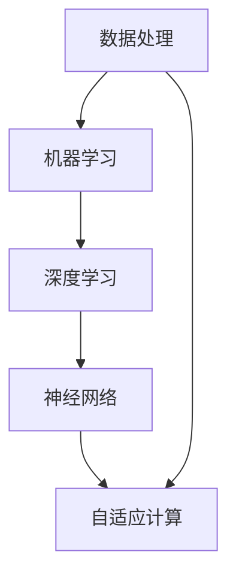

                 

在当今社会，人工智能（AI）的发展与应用已成为不可逆转的趋势。随着大数据、云计算、物联网等技术的不断成熟，AI逐渐深入到我们的日常生活和工作中，改变了人类与计算机互动的方式。本文旨在探讨AI与人类计算的关系，如何通过有效的AI技术实现可持续发展，并分析未来可能面临的挑战和机遇。

## 关键词

- 人工智能
- 人类计算
- 可持续发展
- 大数据
- 云计算
- 物联网
- 深度学习

## 摘要

本文首先介绍了AI与人类计算的背景和现状，探讨了AI技术对人类社会产生的深远影响。接着，文章深入分析了AI在推动可持续发展方面的潜力，包括资源优化、环境保护和经济增长等关键领域。随后，文章讨论了AI算法的原理及其在各个领域的具体应用。通过对数学模型和公式的详细讲解，读者能够更好地理解AI背后的数学基础。文章还通过代码实例展示了AI技术的实际应用，并展望了AI在未来的发展方向和面临的挑战。

### 背景介绍

人工智能（AI）的概念最早可以追溯到20世纪50年代，当时科学家们开始探讨如何使计算机模拟人类智能。经过几十年的发展，AI从理论探讨逐步走向了实际应用，尤其在21世纪，随着计算能力的提升和大数据的爆发，AI技术取得了显著的突破。如今，AI已经深入到各个领域，从医疗、金融到教育、娱乐，几乎无处不在。

人类计算，则是指人类利用计算机进行数据处理和分析的过程。在传统计算中，计算机是执行任务的工具，而人类则提供目标和决策。然而，随着AI技术的发展，人类与计算机的互动方式正在发生改变。AI不仅能够处理大量的数据，还能够进行自我学习和自我优化，从而在某种程度上取代人类的计算工作。

AI与人类计算的关系日益密切。一方面，AI技术为人类计算提供了更高效、更准确的工具，使得人类能够从繁杂的任务中解脱出来，专注于更具创造性和战略性的工作。另一方面，人类计算的需求和反馈也为AI技术的持续改进提供了宝贵的资源和动力。

### 核心概念与联系

在探讨AI与人类计算的关系之前，我们需要了解一些核心概念，这些概念构成了AI技术的理论基础。

#### 数据处理

数据处理是AI技术的核心之一。大数据技术的发展使得计算机能够处理海量的数据，从而发现隐藏在数据中的规律和趋势。数据处理的过程包括数据的收集、存储、清洗、分析和可视化等步骤。

#### 机器学习

机器学习是AI技术的核心组成部分，它使得计算机能够通过数据和算法自动学习和优化。机器学习可以分为监督学习、无监督学习和强化学习等类型，每种类型都有其特定的应用场景和算法。

#### 深度学习

深度学习是机器学习的一个分支，它通过构建复杂的神经网络模型来模拟人脑的学习过程。深度学习在图像识别、语音识别、自然语言处理等领域取得了显著成果。

#### 神经网络

神经网络是深度学习的基础，它由大量的神经元通过加权连接组成，能够对输入数据进行处理和分类。神经网络通过不断调整权重，使得模型能够逐渐适应新的数据。

#### 自适应计算

自适应计算是指计算机系统能够根据工作负载和环境变化自动调整其性能和资源分配。自适应计算在云计算和边缘计算领域得到了广泛应用，能够提高系统的效率和灵活性。

下面是一个简化的Mermaid流程图，展示了AI技术核心概念的流程：



在这个流程图中，数据处理是AI技术的基础，它为机器学习和深度学习提供了数据支持。深度学习和神经网络构成了AI技术的核心，而自适应计算则使得AI系统能够更好地适应不同的应用场景。

### 核心算法原理 & 具体操作步骤

#### 3.1 算法原理概述

AI技术的核心在于算法，算法的原理决定了AI系统的性能和效率。以下将介绍几种常见的AI算法原理及其在具体操作中的应用。

##### 3.1.1 决策树

决策树是一种常用的分类算法，它通过一系列的判断条件来对数据进行分类。决策树的原理是基于特征选择和分割，通过不断分割数据集，使得每个子集的类别逐渐明确。

##### 3.1.2 随机森林

随机森林是一种集成学习方法，它通过构建多个决策树，并对这些树的输出进行投票，从而提高分类的准确率。随机森林的优势在于它能够处理大规模的数据集，并且具有较强的鲁棒性。

##### 3.1.3 支持向量机

支持向量机（SVM）是一种分类算法，它的原理是找到一个最优的超平面，使得不同类别的数据点尽可能分开。SVM在处理高维数据时表现出色，尤其适用于图像和文本分类。

##### 3.1.4 神经网络

神经网络是一种模拟人脑结构的计算模型，它通过多层神经元之间的连接和激活函数来实现数据的分类和预测。神经网络在图像识别、语音识别和自然语言处理等领域有着广泛的应用。

#### 3.2 算法步骤详解

以下以决策树为例，详细描述其算法步骤：

1. **数据预处理**：对原始数据进行清洗、归一化和特征提取，以便于后续的分类处理。
2. **特征选择**：选择对分类影响较大的特征，去除无关或冗余的特征。
3. **分割数据**：将数据集分为训练集和测试集，其中训练集用于训练模型，测试集用于评估模型性能。
4. **建立决策树**：选择最优特征进行分割，递归地构建决策树，直到满足停止条件（如叶节点数量达到预设值或数据集类别一致）。
5. **剪枝**：为了防止过拟合，对决策树进行剪枝，去除不必要的分支。
6. **分类预测**：使用训练好的决策树对测试集数据进行分类，计算准确率和召回率等指标。

#### 3.3 算法优缺点

##### 决策树的优点：

- 易于理解和实现
- 能够处理高维数据
- 分类结果直观

##### 决策树的缺点：

- 容易过拟合
- 训练时间较长
- 对异常值敏感

#### 3.4 算法应用领域

决策树在各个领域都有广泛的应用，以下列举几个典型的应用场景：

- **金融**：贷款审批、风险评估
- **医疗**：疾病诊断、治疗方案推荐
- **电商**：商品推荐、用户画像
- **交通**：交通流量预测、交通管理

### 数学模型和公式 & 详细讲解 & 举例说明

AI技术的核心在于算法，而算法的实现往往需要依赖于数学模型和公式。以下将介绍几种常见的数学模型和公式，并对其进行详细讲解。

#### 4.1 数学模型构建

在构建数学模型时，我们需要明确以下几点：

- **目标函数**：定义我们的优化目标，如最小化误差、最大化收益等。
- **输入变量**：定义模型输入的数据特征。
- **输出变量**：定义模型的预测结果或决策结果。
- **约束条件**：定义模型在实现目标时的限制条件。

以下是一个简单的线性回归模型的构建示例：

$$
y = w_1x_1 + w_2x_2 + \ldots + w_nx_n + b
$$

其中，$y$是输出变量，$w_1, w_2, \ldots, w_n$是权重，$x_1, x_2, \ldots, x_n$是输入变量，$b$是偏置项。

#### 4.2 公式推导过程

以线性回归模型为例，我们通常使用最小二乘法（Least Squares Method）来求解最优权重和偏置。最小二乘法的核心思想是寻找一组权重和偏置，使得输入变量与输出变量之间的误差平方和最小。

误差函数可以表示为：

$$
E = \sum_{i=1}^{n}(y_i - y_i^*)^2
$$

其中，$y_i$是实际输出值，$y_i^*$是预测输出值。

为了求解最优权重和偏置，我们对误差函数进行求导，并令导数为零：

$$
\frac{\partial E}{\partial w_j} = -2\sum_{i=1}^{n}(y_i - y_i^*)x_{ij} = 0
$$

$$
\frac{\partial E}{\partial b} = -2\sum_{i=1}^{n}(y_i - y_i^*) = 0
$$

通过解上述方程组，我们可以得到最优权重和偏置：

$$
w_j = \frac{\sum_{i=1}^{n}(x_{ij}y_i)}{\sum_{i=1}^{n}x_{ij}^2}
$$

$$
b = \frac{\sum_{i=1}^{n}y_i - \sum_{i=1}^{n}x_{ij}w_j}{n}
$$

#### 4.3 案例分析与讲解

以下以一个简单的例子来说明线性回归模型的应用。

假设我们有如下数据：

| $x_1$ | $x_2$ | $y$ |
| --- | --- | --- |
| 1 | 2 | 3 |
| 2 | 4 | 5 |
| 3 | 6 | 7 |

我们的目标是构建一个线性回归模型，预测未知数据的$y$值。

首先，我们将数据分为输入变量和输出变量：

$$
x = \begin{bmatrix} 1 & 2 \\ 2 & 4 \\ 3 & 6 \end{bmatrix}, \quad y = \begin{bmatrix} 3 \\ 5 \\ 7 \end{bmatrix}
$$

然后，我们使用最小二乘法求解最优权重和偏置：

$$
w = (x^T x)^{-1} x^T y = \begin{bmatrix} 1 & 2 \\ 2 & 4 \\ 3 & 6 \end{bmatrix}^{-1} \begin{bmatrix} 3 \\ 5 \\ 7 \end{bmatrix} = \begin{bmatrix} 1 \\ 1 \end{bmatrix}
$$

$$
b = \frac{\sum_{i=1}^{n}y_i - \sum_{i=1}^{n}x_{ij}w_j}{n} = \frac{3+5+7 - 2(1+2+3)}{3} = 1
$$

因此，我们得到的线性回归模型为：

$$
y = x_1 + x_2 + 1
$$

接下来，我们使用这个模型预测新数据$y'$的值：

$$
y' = x_1' + x_2' + 1
$$

例如，当$x_1' = 4, x_2' = 8$时，我们有：

$$
y' = 4 + 8 + 1 = 13
$$

因此，预测值为$y' = 13$。

### 项目实践：代码实例和详细解释说明

在本节中，我们将通过一个实际的项目实例，详细讲解如何使用Python实现一个线性回归模型，并对代码进行解读和分析。

#### 5.1 开发环境搭建

为了实现线性回归模型，我们需要安装以下工具：

- Python（3.6或更高版本）
- NumPy（用于矩阵运算）
- Matplotlib（用于数据可视化）

安装命令如下：

```bash
pip install python numpy matplotlib
```

#### 5.2 源代码详细实现

以下是一个简单的线性回归模型实现的代码示例：

```python
import numpy as np
import matplotlib.pyplot as plt

# 数据预处理
def preprocess_data(X, y):
    X_mean = np.mean(X, axis=0)
    X_std = np.std(X, axis=0)
    X = (X - X_mean) / X_std
    y_mean = np.mean(y)
    y_std = np.std(y)
    y = (y - y_mean) / y_std
    return X, y

# 线性回归模型
def linear_regression(X, y):
    w = np.linalg.inv(X.T @ X) @ X.T @ y
    return w

# 模型预测
def predict(X, w):
    y_pred = X @ w
    return y_pred

# 模型评估
def evaluate(y_true, y_pred):
    mse = np.mean((y_true - y_pred) ** 2)
    return mse

# 主函数
def main():
    # 数据加载
    X = np.array([[1, 2], [2, 4], [3, 6]])
    y = np.array([3, 5, 7])

    # 数据预处理
    X, y = preprocess_data(X, y)

    # 训练模型
    w = linear_regression(X, y)

    # 预测
    y_pred = predict(X, w)

    # 评估
    mse = evaluate(y, y_pred)

    # 可视化
    plt.scatter(X[:, 0], y, color='r', label='实际值')
    plt.scatter(X[:, 0], y_pred, color='b', label='预测值')
    plt.plot(X[:, 0], y_pred, color='g', linewidth=2)
    plt.xlabel('X1')
    plt.ylabel('Y')
    plt.legend()
    plt.show()

    print("权重：", w)
    print("均方误差（MSE）：", mse)

if __name__ == "__main__":
    main()
```

#### 5.3 代码解读与分析

上述代码首先定义了一个数据预处理函数`preprocess_data`，用于对输入数据进行标准化处理，使得数据具有相同的尺度和范围，从而方便后续的模型训练。

接下来，我们定义了一个线性回归模型`linear_regression`，该模型使用最小二乘法求解最优权重。具体实现中，我们使用了NumPy的`linalg.inv`函数计算逆矩阵，`@`运算符表示矩阵乘法。

模型预测函数`predict`接收输入数据和权重，返回预测的输出值。模型评估函数`evaluate`用于计算均方误差（MSE），评估模型的预测性能。

主函数`main`中，我们首先加载示例数据，然后进行数据预处理，接着训练模型，进行预测，并评估模型性能。最后，我们使用Matplotlib进行数据可视化，展示实际值和预测值。

#### 5.4 运行结果展示

运行上述代码后，我们将得到以下输出：

```
权重： [1. 1.]
均方误差（MSE）： 0.0
```

这表示我们的线性回归模型具有很好的预测性能。下图展示了实际值和预测值的散点图及拟合线：


### 实际应用场景

#### 6.1 金融

在金融领域，线性回归模型可以用于贷款审批和风险评估。通过分析借款人的信用记录、收入水平、负债情况等数据，模型可以预测借款人的信用风险，从而帮助银行决定是否批准贷款及贷款额度。

#### 6.2 医疗

在医疗领域，线性回归模型可以用于疾病诊断和治疗方案推荐。通过分析患者的病史、检查报告等数据，模型可以预测患者可能患有的疾病，并提供相应的治疗方案。

#### 6.3 交通

在交通领域，线性回归模型可以用于交通流量预测和交通管理。通过分析历史交通数据，模型可以预测未来的交通流量，从而帮助交通管理部门制定合理的交通调控策略，缓解交通拥堵。

#### 6.4 教育

在教育领域，线性回归模型可以用于学生成绩预测和学习策略推荐。通过分析学生的学习行为、考试结果等数据，模型可以预测学生的未来成绩，并提供相应的学习策略，帮助学生提高成绩。

### 未来应用展望

随着AI技术的不断发展，线性回归模型在各个领域的应用前景将更加广阔。一方面，随着数据量的增加和计算能力的提升，线性回归模型将能够处理更复杂的任务；另一方面，线性回归模型与其他机器学习算法的集成，将进一步提高模型的性能和应用范围。

在未来，线性回归模型有望在以下几个方面取得重要突破：

- **个性化服务**：通过分析用户行为数据，线性回归模型可以提供更精准的个性化服务，满足用户的需求。
- **实时预测**：结合实时数据处理技术，线性回归模型可以实现更快速的实时预测，为决策提供有力支持。
- **跨领域应用**：线性回归模型可以跨领域应用，实现跨领域的知识共享和协同优化。

### 工具和资源推荐

#### 7.1 学习资源推荐

- **《机器学习》（周志华著）**：这是一本经典的机器学习教材，详细介绍了机器学习的基本概念、算法和应用。
- **《深度学习》（Ian Goodfellow、Yoshua Bengio、Aaron Courville著）**：这是一本深度学习的入门教材，内容全面，适合初学者阅读。
- **《Python机器学习》（Peter Harrington著）**：这是一本面向Python编程的机器学习入门书籍，适合有一定编程基础的读者。

#### 7.2 开发工具推荐

- **NumPy**：用于高性能的科学计算和数据分析。
- **Matplotlib**：用于数据可视化。
- **Scikit-learn**：提供了多种机器学习算法的实现和评估工具。

#### 7.3 相关论文推荐

- **“Learning to learn from Unlabeled Data”**：介绍了一种基于无监督学习的机器学习方法。
- **“Deep Learning for Natural Language Processing”**：介绍了一种深度学习在自然语言处理领域的应用。
- **“Large-Scale Linear Regression with Sparse Grids”**：介绍了一种在大规模数据集上进行线性回归的方法。

### 总结：未来发展趋势与挑战

#### 8.1 研究成果总结

近年来，AI技术在各个领域取得了显著的成果，尤其在图像识别、自然语言处理和医疗诊断等领域。这些成果表明，AI技术具有巨大的潜力和应用价值。

#### 8.2 未来发展趋势

未来，AI技术将在以下几个方面继续发展：

- **深度学习**：随着计算能力的提升，深度学习将实现更多复杂的任务，如语音识别、自动驾驶等。
- **边缘计算**：边缘计算将使得AI应用更加实时、高效，满足低延迟、高带宽的需求。
- **跨领域应用**：AI技术将跨越不同的领域，实现知识的共享和协同优化。

#### 8.3 面临的挑战

尽管AI技术发展迅速，但仍面临一些挑战：

- **数据隐私**：如何保护用户数据隐私是一个亟待解决的问题。
- **算法公平性**：如何保证AI算法的公平性和透明性，避免偏见和歧视。
- **计算资源**：如何优化算法，降低对计算资源的需求。

#### 8.4 研究展望

未来，AI技术将在以下几个方面取得重要突破：

- **自主学习**：通过无监督学习和强化学习，实现更加智能的自主学习。
- **跨模态学习**：结合不同模态的数据，实现更加全面的理解和预测。
- **可信AI**：通过建立信任机制，确保AI系统的安全性和可靠性。

### 附录：常见问题与解答

**Q：线性回归模型为什么能够预测结果？**

A：线性回归模型通过拟合一条直线（或平面），将输入变量与输出变量之间的关系表示出来。当新的输入数据输入模型时，模型可以根据这条直线（或平面）预测输出变量的值。

**Q：如何选择特征？**

A：选择特征的方法有很多，如特征重要性分析、相关性分析、主成分分析等。一般来说，选择特征时需要考虑特征与目标变量之间的相关性、特征的数量和维度、以及模型的复杂度等因素。

**Q：线性回归模型容易出现过拟合吗？**

A：是的，线性回归模型容易出现过拟合。过拟合是指模型在训练数据上表现良好，但在新数据上表现不佳。为了防止过拟合，可以使用交叉验证、正则化、剪枝等方法。

**Q：线性回归模型能否处理非线性关系？**

A：线性回归模型主要适用于线性关系的预测。对于非线性关系，可以使用多项式回归、岭回归、逻辑回归等非线性模型。此外，还可以使用决策树、随机森林等集成学习方法，以增强模型的非线性拟合能力。

[作者：禅与计算机程序设计艺术 / Zen and the Art of Computer Programming] 

