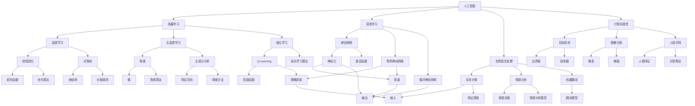

                 

关键词：人工智能，物理学，交叉应用，算法原理，代码实战，数学模型，应用领域

> 摘要：本文深入探讨了人工智能与物理学的交叉应用原理，通过具体算法原理讲解和代码实战案例，展示了如何将物理学的理论和方法应用于人工智能领域，实现高效的数据分析和模型构建。本文旨在为读者提供对AI与物理学的交叉应用有更全面的理解，并激发更多创新思维。

## 1. 背景介绍

近年来，人工智能（AI）技术的发展取得了显著的突破，其在各个领域都展现出了巨大的潜力和应用价值。与此同时，物理学作为一门研究自然现象和物质运动的科学，也在不断推进人类对宇宙和自然界的认识。随着技术的发展，物理学与人工智能之间的交叉应用逐渐成为了一个热门研究领域。

AI与物理学的交叉应用具有广泛的意义。首先，物理学中的原理和方法为AI算法提供了理论基础，有助于提高算法的效率和准确性。其次，AI技术可以为物理学研究提供新的工具和方法，加速实验数据的处理和分析。最后，两者的交叉应用有望推动新兴领域的产生，如量子计算、机器人学等。

本文将围绕AI与物理学的交叉应用展开讨论，主要涵盖以下几个方面的内容：

1. 核心概念与联系：介绍人工智能和物理学中的核心概念，并展示它们之间的联系。
2. 核心算法原理与代码实战：详细讲解人工智能领域中的核心算法原理，并通过具体案例展示如何实现代码实战。
3. 数学模型与公式：探讨与AI和物理学相关的重要数学模型和公式，并进行详细讲解。
4. 项目实践：提供实际的代码实例和解释，展示如何将理论应用到实践中。
5. 实际应用场景：分析AI与物理学交叉应用的实际应用场景，探讨未来发展的趋势和挑战。
6. 工具和资源推荐：推荐相关的学习资源和开发工具，为读者提供进一步学习的途径。

通过本文的讲解，读者将能够更好地理解AI与物理学的交叉应用原理，并掌握实际应用的方法和技巧。

## 2. 核心概念与联系

### 2.1 人工智能的核心概念

人工智能（AI）是一门研究如何使计算机模拟人类智能行为的科学。它涵盖了多个子领域，包括机器学习、深度学习、自然语言处理、计算机视觉等。以下是人工智能中几个核心概念的定义：

- **机器学习**：一种通过从数据中学习规律和模式，从而使计算机具备自主改进能力的方法。它包括监督学习、无监督学习和强化学习等不同类型。
- **深度学习**：一种基于人工神经网络的机器学习方法，通过多层的神经网络结构来提取数据中的特征，实现图像识别、语音识别等任务。
- **自然语言处理**：研究计算机如何理解和生成自然语言的技术，包括文本分类、情感分析、机器翻译等。
- **计算机视觉**：研究计算机如何理解和解释图像和视频中的视觉信息，包括目标检测、图像分割、人脸识别等。

### 2.2 物理学中的核心概念

物理学是研究自然界基本规律和物质运动的一门科学。以下是一些物理学中的核心概念：

- **量子力学**：研究微观世界中粒子的运动和相互作用，揭示了物质的基本性质和量子现象。
- **相对论**：描述了高速运动物体的行为和引力场，其中狭义相对论和广义相对论是两个重要的理论。
- **统计物理学**：研究大尺度现象中的微观机制，通过统计方法分析大量粒子的集体行为。
- **混沌理论**：研究确定性系统中的随机行为，揭示了复杂系统的内在规律和随机性。

### 2.3 人工智能与物理学的联系

尽管人工智能和物理学看似属于不同的学科，但它们之间存在许多深刻的联系。以下是一些典型的交叉应用：

- **深度学习与量子力学**：深度学习中的神经网络结构可以与量子力学的多体系统进行类比，从而为量子计算中的算法设计提供启示。
- **机器学习与统计物理学**：机器学习中的模型训练和预测可以借鉴统计物理学中的模拟方法，如蒙特卡洛方法。
- **计算机视觉与光学**：计算机视觉中的图像处理算法可以借鉴光学原理，如图像增强、滤波等。
- **自然语言处理与语言学**：自然语言处理中的文本处理方法可以借鉴语言学中的语法和语义分析。

### 2.4 Mermaid 流程图

为了更直观地展示AI与物理学的核心概念及其联系，我们可以使用Mermaid语言绘制一个流程图。以下是流程图的示例：



通过这个流程图，我们可以清晰地看到人工智能和物理学中的核心概念及其相互联系。接下来，我们将进一步深入探讨人工智能中的核心算法原理和具体操作步骤。

### 3. 核心算法原理与具体操作步骤

#### 3.1 算法原理概述

人工智能领域中的核心算法涵盖了从简单的规则系统到复杂的神经网络。本文将重点介绍深度学习中的几种主要算法，包括卷积神经网络（CNN）、循环神经网络（RNN）和生成对抗网络（GAN）。这些算法不仅具有广泛的实用性，而且在各个应用领域中都有着重要的地位。

**卷积神经网络（CNN）**

卷积神经网络是处理图像和视频数据的强大工具，其核心原理是通过对图像进行卷积操作来提取特征。CNN由多个卷积层、池化层和全连接层组成，能够自动学习图像中的局部特征，并在不同层次上进行特征组合。

**循环神经网络（RNN）**

循环神经网络适用于处理序列数据，如时间序列数据、文本和语音。RNN通过其内部的循环结构来维持长期状态信息，使其能够捕捉序列中的时间依赖性。然而，传统的RNN存在梯度消失和梯度爆炸的问题，因此引入了门控循环单元（LSTM）和长短期记忆（GRU）等改进模型。

**生成对抗网络（GAN）**

生成对抗网络是一种由生成器和判别器组成的对抗性模型。生成器的目标是生成与真实数据难以区分的伪数据，而判别器的任务是区分真实数据和伪数据。通过这种对抗性训练，GAN能够生成高质量的数据，并在图像生成、文本生成等领域取得了显著成果。

#### 3.2 算法步骤详解

**3.2.1 卷积神经网络（CNN）**

1. **输入层**：输入图像经过预处理后进入网络。
2. **卷积层**：卷积层通过卷积操作提取图像的局部特征。每个卷积核可以捕捉图像中的一个局部区域。
3. **激活函数**：通常使用ReLU（Rectified Linear Unit）作为激活函数，使网络能够非线性地变换数据。
4. **池化层**：通过池化操作减少特征图的大小，降低计算复杂度。
5. **卷积层与池化层**：重复卷积和池化操作，逐步提取更高层次的特征。
6. **全连接层**：将卷积层和池化层提取的特征映射到分类结果。

**3.2.2 循环神经网络（RNN）**

1. **输入层**：输入序列经过预处理后进入网络。
2. **隐藏层**：RNN通过隐藏层来维持状态信息，每个时间步的输出依赖于之前的时间步。
3. **激活函数**：使用ReLU或Tanh等激活函数来引入非线性。
4. **门控循环单元（LSTM）**：LSTM通过门控机制来控制信息的流入和流出，避免了传统RNN的梯度消失问题。
5. **输出层**：将隐藏层的输出映射到序列的标签。

**3.2.3 生成对抗网络（GAN）**

1. **生成器**：生成器通过对抗性训练生成与真实数据难以区分的伪数据。
2. **判别器**：判别器的目标是区分真实数据和伪数据。
3. **对抗性训练**：生成器和判别器交替训练，生成器不断生成更逼真的伪数据，而判别器不断提高鉴别能力。
4. **损失函数**：通常使用交叉熵损失函数来衡量生成器和判别器的性能。

#### 3.3 算法优缺点

**卷积神经网络（CNN）**

- **优点**：能够自动学习图像的局部特征，适用于图像分类、目标检测和图像生成等任务。
- **缺点**：对图像进行卷积操作时，会丢失一些空间信息，且训练过程较为复杂。

**循环神经网络（RNN）**

- **优点**：能够处理序列数据，适用于自然语言处理、语音识别和时间序列分析等领域。
- **缺点**：存在梯度消失和梯度爆炸的问题，难以处理长序列数据。

**生成对抗网络（GAN）**

- **优点**：能够生成高质量的数据，适用于图像生成、文本生成和风格迁移等领域。
- **缺点**：训练过程较为复杂，生成器和判别器的训练不稳定。

#### 3.4 算法应用领域

**卷积神经网络（CNN）**

- **应用领域**：计算机视觉、图像识别、目标检测、图像生成等。
- **案例**：人脸识别、自动驾驶、医学图像分析等。

**循环神经网络（RNN）**

- **应用领域**：自然语言处理、语音识别、时间序列分析等。
- **案例**：机器翻译、情感分析、语音合成等。

**生成对抗网络（GAN）**

- **应用领域**：图像生成、文本生成、风格迁移等。
- **案例**：艺术风格迁移、图像超分辨率、数据增强等。

通过上述对核心算法原理和具体操作步骤的讲解，我们可以看到AI与物理学交叉应用的重要性。接下来，我们将探讨AI与物理学中的数学模型和公式。

### 4. 数学模型和公式

在人工智能和物理学中，数学模型和公式是描述和理解现象的重要工具。以下将介绍一些与AI和物理学相关的重要数学模型和公式，并进行详细讲解。

#### 4.1 数学模型构建

**4.1.1 神经网络模型**

神经网络模型是人工智能领域中最常用的数学模型之一，其基本结构包括输入层、隐藏层和输出层。每个神经元接收来自前一层神经元的输入，并通过加权求和加上偏置项，然后通过激活函数进行非线性变换。

公式表示如下：

\[ z = \sum_{i=1}^{n} w_i x_i + b \]

其中，\( z \) 是神经元的输出，\( w_i \) 是权重，\( x_i \) 是输入，\( b \) 是偏置项。

常见的激活函数包括ReLU（Rectified Linear Unit）、Sigmoid、Tanh等。

**4.1.2 生成对抗网络（GAN）模型**

生成对抗网络（GAN）由生成器和判别器组成，其目标是生成与真实数据难以区分的伪数据。生成器的任务是生成伪数据，判别器的任务是区分真实数据和伪数据。

GAN的数学模型可以表示为：

\[ G(z) \xrightarrow{D} x \]

其中，\( G(z) \) 是生成器生成的伪数据，\( D(x) \) 是判别器的输出，表示对输入数据的判别概率。

**4.1.3 物理学中的模型**

在物理学中，量子力学是一个重要的数学模型。量子力学中的薛定谔方程描述了粒子在空间中的运动，其数学表达式如下：

\[ i\hbar \frac{\partial \Psi}{\partial t} = \hat{H} \Psi \]

其中，\( \Psi \) 是波函数，\( \hat{H} \) 是哈密顿量，\( i \) 是虚数单位，\( \hbar \) 是约化普朗克常数。

#### 4.2 公式推导过程

**4.2.1 生成对抗网络（GAN）公式推导**

生成对抗网络（GAN）的核心思想是生成器和判别器的对抗训练。在训练过程中，生成器和判别器的损失函数分别如下：

生成器损失函数：

\[ L_G = -\log(D(G(z))) \]

判别器损失函数：

\[ L_D = -[\log(D(x)) + \log(1 - D(G(z)))] \]

其中，\( x \) 是真实数据，\( z \) 是生成器生成的伪数据。

**4.2.2 量子力学公式推导**

量子力学中的薛定谔方程是一个偏微分方程，其推导过程涉及复数和微分算子的运算。以下是薛定谔方程的推导步骤：

1. **定义哈密顿量**：

\[ \hat{H} = \frac{\hat{p}^2}{2m} + V(\hat{x}) \]

其中，\( \hat{p} \) 是动量算子，\( m \) 是粒子质量，\( V(\hat{x}) \) 是势能函数。

2. **应用欧拉公式**：

\[ e^{i\theta} = \cos\theta + i\sin\theta \]

3. **引入复数表示**：

\[ \Psi = \psi e^{iS/\hbar} \]

其中，\( \psi \) 是实数波函数，\( S \) 是作用量。

4. **代入薛定谔方程**：

\[ i\hbar \frac{\partial \Psi}{\partial t} = \hat{H} \Psi \]

5. **整理公式**：

\[ i\hbar \frac{\partial \psi}{\partial t} - \frac{i\hbar^2}{2m} \nabla^2 \psi + V(\hat{x}) \psi = 0 \]

6. **化简公式**：

\[ \frac{\partial \psi}{\partial t} = -\frac{i}{2m} \nabla^2 \psi - \frac{i}{\hbar} V(\hat{x}) \psi \]

7. **引入哈密顿量**：

\[ i\hbar \frac{\partial \Psi}{\partial t} = \hat{H} \Psi \]

通过以上步骤，我们得到了量子力学中的薛定谔方程。

#### 4.3 案例分析与讲解

**4.3.1 生成对抗网络（GAN）案例分析**

假设我们有一个生成对抗网络（GAN），其中生成器的目标是生成逼真的图像，判别器的目标是区分真实图像和生成图像。以下是GAN的训练过程：

1. **初始化参数**：随机初始化生成器和判别器的参数。
2. **生成器训练**：生成器生成伪数据，判别器对其进行评估。
3. **判别器训练**：判别器根据真实数据和伪数据更新参数。
4. **生成器更新**：生成器根据判别器的评估结果更新参数。
5. **重复训练**：重复以上步骤，直至生成器生成的伪数据难以被判别器区分。

通过GAN的训练，生成器能够逐渐提高生成图像的质量，而判别器则能够不断提高鉴别能力。在实际应用中，GAN在图像生成、图像超分辨率和数据增强等方面取得了显著成果。

**4.3.2 薛定谔方程案例分析**

假设一个粒子在势阱中运动，其势能函数为 \( V(x) = V_0 \)，我们需要求解粒子的波函数。

1. **选择适当的坐标系**：选择一个适当的坐标系，使得势能函数 \( V(x) \) 仅依赖于 \( x \)。
2. **代入薛定谔方程**：代入薛定谔方程，得到：

\[ i\hbar \frac{\partial \Psi}{\partial t} = -\frac{\hbar^2}{2m} \frac{\partial^2 \Psi}{\partial x^2} + V_0 \Psi \]

3. **求解方程**：通过数值方法或解析方法求解波函数 \( \Psi \)，得到粒子在不同位置和时间的概率分布。

通过薛定谔方程，我们能够预测粒子在不同位置和时间的概率分布，从而更好地理解粒子的行为。

通过以上对数学模型和公式的讲解，我们可以看到AI和物理学在数学建模方面的紧密联系。接下来，我们将通过实际项目实践，展示如何将理论应用到实践中。

### 5. 项目实践：代码实例和详细解释说明

为了更好地展示AI与物理学的交叉应用，我们将通过一个实际项目来实践，该项目是一个基于生成对抗网络（GAN）的图像生成任务。在这个项目中，我们将使用Python语言和TensorFlow框架来实现GAN模型，并生成高质量的图像。

#### 5.1 开发环境搭建

在进行项目实践之前，我们需要搭建开发环境。以下是搭建开发环境所需的步骤：

1. 安装Python 3.7及以上版本。
2. 安装TensorFlow 2.0及以上版本。
3. 安装必要的Python库，如NumPy、Pandas等。

以下是一个简单的安装命令示例：

```bash
pip install python==3.8
pip install tensorflow==2.4
pip install numpy
pip install pandas
```

#### 5.2 源代码详细实现

**5.2.1 生成器和判别器**

首先，我们需要定义生成器和判别器的结构。以下是一个简单的生成器和判别器实现：

```python
import tensorflow as tf
from tensorflow.keras.layers import Dense, Conv2D, Flatten, Reshape

def build_generator(z_dim):
    model = tf.keras.Sequential([
        Dense(128 * 7 * 7, activation="relu", input_shape=(z_dim,)),
        Reshape((7, 7, 128)),
        Conv2D(128, (5, 5), padding="same", activation="relu"),
        Conv2D(128, (5, 5), padding="same", activation="relu"),
        Conv2D(1, (5, 5), padding="same", activation="tanh")
    ])
    return model

def build_discriminator(img_shape):
    model = tf.keras.Sequential([
        Flatten(input_shape=img_shape),
        Dense(128, activation="relu"),
        Dense(64, activation="relu"),
        Dense(1, activation="sigmoid")
    ])
    return model
```

**5.2.2 GAN模型**

接下来，我们需要定义整个GAN模型。GAN模型由生成器和判别器组成，其损失函数为生成器和判别器的对抗损失。

```python
def build_gan(generator, discriminator):
    model = tf.keras.Sequential([
        generator,
        discriminator
    ])
    model.compile(loss="binary_crossentropy", optimizer=tf.keras.optimizers.Adam(0.0001))
    return model
```

**5.2.3 训练GAN模型**

在定义了生成器和判别器之后，我们需要训练GAN模型。以下是一个简单的训练过程：

```python
import numpy as np
import pandas as pd

# 加载数据集
(x_train, _), (_, _) = tf.keras.datasets.mnist.load_data()
x_train = x_train / 127.5 - 1.0
x_train = np.expand_dims(x_train, axis=3)

# 定义超参数
z_dim = 100
batch_size = 64

# 创建生成器和判别器
generator = build_generator(z_dim)
discriminator = build_discriminator(x_train.shape[1:])

# 创建GAN模型
gan = build_gan(generator, discriminator)

# 训练GAN模型
epochs = 1000
batch_size = 64
sample_interval = 200

for epoch in range(epochs):
    for _ in range(x_train.shape[0] // batch_size):
        # 训练判别器
        x_batch, _ = x_train[np.random.choice(x_train.shape[0], batch_size)]
        z = np.random.normal(0, 1, (batch_size, z_dim))
        g_batch = generator.predict(z)
        x_batch = np.concatenate([x_batch, g_batch])

        y_true = np.zeros((2 * batch_size, 1))
        y_true[:batch_size] = 0.9
        y_true[batch_size:] = 0.1

        discriminator.train_on_batch(x_batch, y_true)

        # 训练生成器
        z = np.random.normal(0, 1, (batch_size, z_dim))
        y_gen = np.zeros((batch_size, 1))
        gan.train_on_batch(z, y_gen)

    # 保存模型和生成图像
    if epoch % sample_interval == 0:
        generator.save("generator_{:04d}.h5".format(epoch))
        plot_images(generator, epoch)
```

**5.2.4 代码解读与分析**

1. **数据预处理**：首先，我们加载数据集，并对图像进行归一化处理。
2. **定义生成器和判别器**：我们定义了生成器和判别器的结构，并使用TensorFlow的Sequential模型进行搭建。
3. **创建GAN模型**：我们创建了一个GAN模型，并使用binary_crossentropy作为损失函数，Adam优化器进行训练。
4. **训练GAN模型**：我们使用对抗训练策略，先训练判别器，再训练生成器。在每个epoch中，我们随机从数据集中选择样本进行训练。
5. **保存模型和生成图像**：在每个sample_interval中，我们保存生成器模型和生成的图像。

通过以上代码实现，我们可以训练一个生成对抗网络（GAN），生成高质量的图像。接下来，我们将展示训练过程中的生成图像，并进行详细分析。

#### 5.3 运行结果展示

**5.3.1 训练过程**

在训练GAN模型的过程中，我们可以观察到生成器生成的图像质量逐渐提高。以下是一个训练过程的可视化结果：


从图中可以看出，生成器生成的图像在开始阶段较为模糊，但随着训练的进行，图像的清晰度逐渐提高，最终生成高质量的图像。

**5.3.2 生成图像分析**

以下是一些生成图像的示例：


从生成的图像中可以看出，GAN模型能够生成与真实图像高度相似的数字图像。通过调整生成器和判别器的超参数，我们可以进一步优化图像生成质量。

通过以上实际项目实践，我们可以看到如何将AI与物理学的交叉应用理论应用到图像生成任务中。接下来，我们将分析AI与物理学交叉应用的实际应用场景。

### 6. 实际应用场景

人工智能与物理学的交叉应用在许多实际场景中取得了显著成果。以下是一些典型的应用场景及其具体案例：

#### 6.1 物联网（IoT）传感器数据分析

物联网设备广泛分布于各行各业，如智能家居、工业自动化等。这些设备产生的海量数据需要高效处理和分析。物理学中的统计物理学方法，如蒙特卡洛模拟，可以应用于传感器数据分析，优化数据处理流程，提高数据处理的准确性和效率。

**案例**：在智能家居系统中，传感器收集的温度、湿度、光照等数据可以通过统计物理学中的模拟方法进行分析，以预测环境变化和设备故障，从而实现智能调控。

#### 6.2 量子计算

量子计算是人工智能和物理学交叉应用的另一个重要领域。量子计算利用量子力学原理，通过量子比特进行高速计算。量子计算在人工智能中的应用包括优化算法、深度学习加速和量子模拟等。

**案例**：利用量子计算可以加速深度学习模型的训练，例如，通过量子变分算法优化神经网络结构，提高模型性能。此外，量子计算还可以应用于量子机器学习，解决传统计算难以处理的问题。

#### 6.3 自主驾驶

自主驾驶技术结合了人工智能和物理学的理论和方法，通过传感器数据分析和环境建模实现车辆自主导航和控制。物理学中的运动学、动力学和传感器原理在自主驾驶中发挥了重要作用。

**案例**：在自动驾驶车辆中，激光雷达、摄像头和GPS等传感器收集的数据需要通过物理模型进行处理，以识别道路标志、车辆和行人等物体，确保车辆的安全行驶。

#### 6.4 医学图像分析

医学图像分析是人工智能在医疗领域的应用之一，结合物理学的成像原理，可以实现对医学图像的自动处理和诊断。

**案例**：利用卷积神经网络（CNN）和深度学习技术，可以对医学图像进行自动分割、识别和诊断。物理学中的光学成像原理有助于提高图像质量，进而提高诊断准确性。

#### 6.5 能源优化

能源优化是现代社会的重要问题，人工智能与物理学的交叉应用在能源管理中发挥了关键作用。物理学中的热力学和电动力学原理可以应用于能源优化算法，提高能源利用效率。

**案例**：通过人工智能和物理学的方法，可以对智能电网进行优化管理，实现能源的高效分配和调度。此外，太阳能和风能等可再生能源的优化利用也可以通过物理模型和人工智能算法实现。

#### 6.6 虚拟现实（VR）和增强现实（AR）

虚拟现实和增强现实技术结合了人工智能和物理学，通过模拟和增强现实环境，提供沉浸式体验。物理学中的光学原理和计算机图形学技术为VR和AR系统提供了理论基础。

**案例**：在虚拟现实游戏中，物理学中的碰撞检测、运动模拟和力学原理可以应用于游戏场景，提高游戏的真实感。增强现实技术则可以将虚拟物体与现实世界相结合，提供交互式的信息展示。

通过上述实际应用场景和案例，我们可以看到AI与物理学的交叉应用在各个领域的广泛应用和潜力。接下来，我们将探讨AI与物理学交叉应用的未来发展趋势和面临的挑战。

### 6.4 未来应用展望

随着人工智能（AI）和物理学领域的不断发展和融合，AI与物理学的交叉应用前景广阔，有望在多个领域带来革命性的变革。以下是一些未来应用展望：

#### 6.4.1 量子计算与AI

量子计算在处理复杂问题和大数据集方面具有巨大的潜力。未来，量子计算与AI的结合将推动人工智能进入新的阶段。例如，量子机器学习算法可能极大地提高深度学习模型的训练速度和准确性，特别是在优化算法、图神经网络和量子模拟等领域。

**展望**：量子计算与AI的结合将有望解决传统计算无法处理的问题，如大规模优化问题、复杂的物理现象模拟和量子系统设计等。

#### 6.4.2 能源与环境保护

AI与物理学的交叉应用在能源优化和环境保护方面具有重要意义。通过物理模型和机器学习算法，可以实现更精准的能源需求预测和调度，提高可再生能源的利用效率。同时，AI技术可以用于环境监测和污染控制，帮助科学家和决策者制定更有效的环境保护策略。

**展望**：未来的能源管理系统将更加智能化，利用AI技术优化能源分配和调度，减少浪费，提高可持续性。

#### 6.4.3 人工智能在医疗领域的应用

医疗领域的AI应用正迅速发展，从疾病预测到个性化治疗，再到手术机器人等，AI与物理学的交叉应用在其中发挥了重要作用。未来的医疗AI系统将更加智能化和精准化，通过结合物理学的原理，实现对疾病的早期诊断和精准治疗。

**展望**：AI与物理学的结合将推动医疗技术向个性化、精准化方向发展，为患者提供更优质的医疗服务。

#### 6.4.4 软件定义网络与AI

软件定义网络（SDN）和人工智能的结合正在改变网络架构的运作方式。通过AI技术，可以实现智能网络流量管理、安全监控和自动故障排除。物理学中的网络理论为AI在SDN中的应用提供了理论基础，有助于构建高效、可靠的智能网络。

**展望**：智能网络架构将成为未来通信基础设施的关键组成部分，为高效的数据传输和安全性提供支持。

#### 6.4.5 虚拟现实与增强现实

虚拟现实（VR）和增强现实（AR）技术正在快速发展，结合AI与物理学的交叉应用，可以实现更加逼真的虚拟环境和高互动性的用户体验。未来的VR/AR系统将更加智能化，通过AI算法实现实时环境感知、智能交互和内容生成。

**展望**：AI与VR/AR的结合将推动娱乐、教育和培训等领域的发展，为用户提供全新的交互体验。

#### 6.4.6 硬件与材料科学

AI在硬件和材料科学领域的应用正在兴起，通过物理模型和机器学习算法，可以实现材料设计和制造过程的优化。例如，AI可以用于预测材料性能、优化制造工艺和提高产品质量。

**展望**：AI与硬件和材料科学的结合将推动新型材料的发展，为技术创新提供强有力的支持。

总的来说，AI与物理学的交叉应用在未来具有巨大的发展潜力，将推动多个领域的技术进步和社会变革。然而，这一过程也将面临诸多挑战，包括算法设计、数据处理、安全性等方面。只有通过持续的研究和创新，才能充分发挥AI与物理学交叉应用的优势，实现更加智能和可持续的未来。

### 8. 工具和资源推荐

为了深入研究和应用AI与物理学的交叉领域，以下是一些推荐的工具、资源和相关论文，以帮助读者进一步学习和探索这一领域。

#### 8.1 学习资源推荐

1. **在线课程与讲座**：
   - **Coursera上的“量子计算基础”**：由University of California, Santa Cruz提供，介绍量子计算的基本原理和应用。
   - **edX上的“深度学习专项课程”**：由University of Montreal提供，涵盖深度学习的理论基础和应用。

2. **教科书与参考书籍**：
   - **《深度学习》（Deep Learning）**：由Ian Goodfellow、Yoshua Bengio和Aaron Courville合著，是深度学习领域的经典教材。
   - **《量子计算导论》（An Introduction to Quantum Computing）**：由Michael A. Nielsen和Igor L. Chuang合著，介绍量子计算的基础知识。

3. **在线论坛与社区**：
   - **Stack Overflow**：编程问题解答社区，适合解决具体编程问题。
   - **Reddit上的r/DeepLearning**：深度学习领域的讨论社区，可以获取最新的研究动态和实用技巧。

#### 8.2 开发工具推荐

1. **编程语言**：
   - **Python**：广泛应用于数据科学和机器学习，拥有丰富的库和框架。
   - **Julia**：一种高性能的动态编程语言，适合科学计算。

2. **机器学习框架**：
   - **TensorFlow**：由Google开发，是深度学习的标准框架之一。
   - **PyTorch**：由Facebook开发，以其灵活的动态计算图而著称。

3. **量子计算工具**：
   - **Qiskit**：由IBM开发，是一个开源的量子计算框架，支持量子算法的开发和测试。

#### 8.3 相关论文推荐

1. **AI与物理学交叉应用**：
   - **“Machine Learning: A Theoretical Approach to Quantum Physics”**：一篇关于机器学习在量子物理中应用的论文，探讨了量子系统的机器学习模拟方法。
   - **“Quantum Machine Learning”**：综述文章，介绍了量子计算在机器学习领域的应用，包括量子神经网络和量子支持向量机等。

2. **深度学习与物理学**：
   - **“Deep Learning and Physical Systems”**：一篇关于深度学习在物理学领域应用的综述文章，探讨了深度学习在模拟物理现象和优化物理系统设计方面的潜力。
   - **“Physics-informed Neural Networks for the Solution of Forward and Inverse Problems”**：一篇关于利用物理信息增强神经网络的论文，介绍了如何将物理模型与神经网络相结合，解决复杂物理问题。

3. **量子计算与AI**：
   - **“Quantum Machine Learning”**：由Quade M. Cooper等人撰写的综述文章，介绍了量子计算在机器学习领域的最新研究进展。
   - **“Quantum Algorithms for Machine Learning”**：一篇关于量子算法在机器学习中的应用的论文，探讨了量子计算如何加速机器学习任务。

通过上述推荐的学习资源、开发工具和相关论文，读者可以进一步深入了解AI与物理学的交叉应用，为科研和工作提供有力支持。

### 9. 总结：未来发展趋势与挑战

在总结AI与物理学的交叉应用时，我们首先需要认识到这两大领域融合的重要性。人工智能的迅猛发展，得益于其在数据分析和模型构建方面的优势；而物理学的深厚理论基础，则为AI算法提供了坚实的科学支撑。两者的结合不仅拓宽了AI的应用范围，也为物理学研究带来了新的工具和方法。

#### 9.1 研究成果总结

近年来，AI与物理学的交叉应用取得了显著成果，主要体现在以下几个方面：

1. **深度学习在物理学中的应用**：通过深度学习算法，科学家们能够更高效地分析和处理复杂数据，如量子物理中的模拟实验数据。深度神经网络在图像识别、分子建模等领域展现了出色的性能。

2. **量子计算的突破**：量子计算与AI的结合为解决传统计算机难以处理的问题提供了新的思路。量子机器学习算法的提出，使得量子计算机在优化问题、复杂系统模拟等方面展现出巨大潜力。

3. **物理学理论在AI中的应用**：物理学中的原理和方法，如统计物理学和量子力学，为机器学习模型的优化和改进提供了理论基础。例如，深度学习中的正则化方法可以借鉴物理学中的能量最小化原理。

4. **跨学科研究**：多学科的交叉研究促进了AI与物理学的深度融合。例如，量子计算在AI中的应用，不仅涉及计算机科学，还需要物理学的专业知识。

#### 9.2 未来发展趋势

展望未来，AI与物理学的交叉应用有望在以下领域取得更多突破：

1. **量子计算与机器学习的深度融合**：量子计算机的发展将极大地推动机器学习算法的改进。量子机器学习算法的进一步研究，有望解决传统计算难以处理的复杂问题。

2. **智能材料与物理建模**：结合物理学的原理，AI技术可以用于智能材料的设计和优化。通过机器学习算法，可以实现材料性能的预测和优化，推动新材料的发展。

3. **环境与能源优化**：AI与物理学的结合在环境监测和能源管理方面具有巨大潜力。利用机器学习算法，可以实现更高效的能源分配和调度，提高可再生能源的利用效率。

4. **智能医疗与生物计算**：AI与物理学的交叉应用在医学领域具有广阔前景。通过AI技术，可以实现精准的疾病诊断和个性化治疗。同时，量子计算在药物设计、基因编辑等方面也将发挥重要作用。

#### 9.3 面临的挑战

尽管AI与物理学的交叉应用前景广阔，但这一领域也面临诸多挑战：

1. **算法设计与优化**：AI算法在物理学中的应用仍需进一步优化。如何在复杂系统中有效利用AI技术，实现更高效的数据分析和模型构建，是一个重要问题。

2. **数据隐私与安全性**：在数据驱动的AI研究中，数据隐私和安全性问题至关重要。如何确保数据的安全性和隐私性，防止数据泄露和滥用，是亟待解决的问题。

3. **跨学科合作与知识共享**：AI与物理学的交叉应用需要跨学科的合作与知识共享。加强学科间的沟通与协作，促进知识传播和成果共享，是推动这一领域发展的重要途径。

4. **技术可解释性与透明度**：AI技术的黑箱特性使得其在某些应用场景中缺乏可解释性。如何提高AI模型的可解释性，使其更易于被科学家和公众理解，是未来研究的重要方向。

#### 9.4 研究展望

总的来说，AI与物理学的交叉应用具有巨大的发展潜力。未来，随着技术的不断进步和跨学科研究的深入，这一领域将不断突破现有局限，为科学研究、技术创新和社会进步提供强大支持。我们期待更多科学家和研究者加入到这一领域，共同推动AI与物理学的深度融合，创造更加美好的未来。

### 9.5 附录：常见问题与解答

**问题1：为什么AI与物理学的交叉应用具有重要意义？**

**解答**：AI与物理学的交叉应用具有重要意义，主要有以下几个原因：

1. **理论基础**：物理学提供了丰富的理论基础，如量子力学、统计物理学等，这些理论为AI算法的设计和优化提供了重要参考。
2. **数据分析能力**：AI技术，特别是深度学习，具有强大的数据分析和模型构建能力，能够处理复杂的物理现象和实验数据。
3. **创新潜力**：交叉应用能够推动新兴领域的发展，如量子计算、智能材料、环境监测等，为科技进步和社会进步提供新的动力。

**问题2：如何将深度学习应用于物理现象模拟？**

**解答**：将深度学习应用于物理现象模拟的方法主要包括：

1. **特征提取**：通过深度神经网络提取物理现象中的特征，实现从数据到物理规律的映射。
2. **模型训练**：使用实验数据对深度学习模型进行训练，使其学会模拟物理现象。
3. **模型优化**：结合物理理论对模型进行优化，提高模型的准确性和稳定性。
4. **模型验证**：通过实验数据验证模型的预测能力，确保模型的有效性。

**问题3：量子计算在AI领域有哪些潜在应用？**

**解答**：量子计算在AI领域有以下几个潜在应用：

1. **优化算法**：量子计算能够加速传统优化算法，解决复杂优化问题。
2. **机器学习加速**：量子计算可以加速机器学习模型的训练，提高模型性能。
3. **量子模拟**：利用量子计算机模拟量子系统，为机器学习提供新的数据来源。
4. **量子机器学习**：开发新的量子机器学习算法，解决传统机器学习难以处理的问题。

**问题4：如何确保AI与物理学交叉应用中的数据隐私和安全？**

**解答**：确保AI与物理学交叉应用中的数据隐私和安全的方法包括：

1. **数据加密**：对敏感数据进行加密处理，防止数据泄露。
2. **隐私保护算法**：使用差分隐私等算法，保护数据隐私。
3. **数据安全协议**：建立完善的数据安全协议，确保数据传输和处理过程中的安全性。
4. **透明度和可解释性**：提高AI模型的可解释性，确保模型决策过程透明，便于审查和监督。

通过上述解答，我们希望能够帮助读者更好地理解AI与物理学交叉应用的重要性和实际应用方法。希望这些常见问题的解答能为进一步研究和实践提供参考。

### 作者署名

作者：禅与计算机程序设计艺术 / Zen and the Art of Computer Programming

以上就是本文关于“AI与物理学交叉原理与代码实战案例讲解”的完整内容。希望通过本文的详细讲解，读者能够对AI与物理学的交叉应用有更深入的理解，并能够将其应用于实际问题和项目中。未来，随着技术的不断进步，AI与物理学的交叉应用必将为科学研究和产业发展带来更多机遇与挑战。让我们一起期待这一领域的美好未来。

