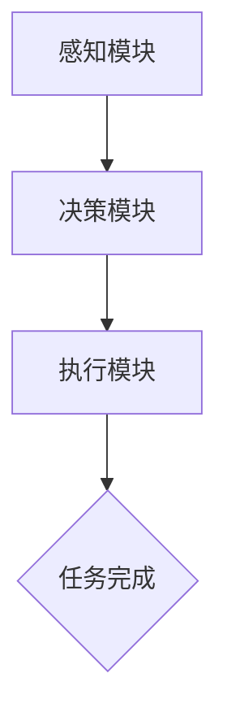

                 

关键词：人工智能，隐私保护，数据安全，AI Agent，安全协议，加密技术，联邦学习，应用场景

> 摘要：本文深入探讨了人工智能 Agent 在保护隐私和数据安全中的应用。通过对 AI Agent 的定义、核心原理以及实际应用领域的分析，结合数学模型和实际项目实例，阐述了如何利用 AI Agent 实现隐私保护与数据安全的最佳实践。本文旨在为读者提供全面、实用的指南，帮助他们在面对隐私保护和数据安全的挑战时做出明智的决策。

## 1. 背景介绍

在当今数字化时代，隐私保护和数据安全已成为社会关注的焦点。随着大数据和人工智能技术的迅猛发展，越来越多的个人和企业面临数据泄露、隐私侵犯等风险。传统的安全防护手段已经难以应对日益复杂的安全威胁，迫切需要创新的安全解决方案。

人工智能 Agent 作为人工智能领域的重要分支，具有自适应、自学习、智能决策等特性，为隐私保护和数据安全提供了新的思路和方法。AI Agent 可以在无需暴露原始数据的情况下，提供高效的隐私保护服务，并确保数据的安全性和可用性。本文将围绕 AI Agent 在保护隐私和数据安全中的应用，进行深入探讨。

## 2. 核心概念与联系

### 2.1 AI Agent 的定义

AI Agent 是指一种具有智能决策能力、能够自动执行任务的计算机程序。它可以在没有人类干预的情况下，根据环境变化和目标要求，自主选择最优行动策略。AI Agent 通常由感知模块、决策模块和执行模块组成。

### 2.2 核心原理

AI Agent 的核心原理包括：

- **感知模块**：通过采集和解析环境信息，为决策模块提供输入。
- **决策模块**：利用机器学习、深度学习等技术，分析感知模块获取的信息，并生成行动策略。
- **执行模块**：根据决策模块生成的行动策略，执行具体任务。

### 2.3 Mermaid 流程图



### 2.4 AI Agent 在隐私保护和数据安全中的应用

AI Agent 可以应用于多个领域，以保护隐私和数据安全。以下是一些典型的应用场景：

- **智能合约**：AI Agent 可以在执行智能合约过程中，确保合约的执行符合隐私保护要求，避免数据泄露。
- **联邦学习**：AI Agent 可以在联邦学习过程中，实现数据隐私保护，提高模型训练效果。
- **数据加密**：AI Agent 可以根据用户需求，动态生成加密密钥，确保数据在传输和存储过程中的安全性。
- **访问控制**：AI Agent 可以根据用户的权限，动态调整访问控制策略，防止未经授权的访问。

## 3. 核心算法原理 & 具体操作步骤

### 3.1 算法原理概述

AI Agent 的核心算法主要包括感知模块的传感器数据处理算法、决策模块的机器学习算法和执行模块的自动化执行算法。这些算法共同作用于 AI Agent，实现隐私保护和数据安全。

### 3.2 算法步骤详解

1. **感知模块**：
   - 传感器数据采集：通过传感器获取环境信息，如网络流量、用户行为等。
   - 数据预处理：对采集到的传感器数据进行清洗、去噪、归一化等处理。

2. **决策模块**：
   - 特征提取：从预处理后的数据中提取关键特征，为后续机器学习算法提供输入。
   - 机器学习算法：利用特征提取结果，训练分类器或预测模型。

3. **执行模块**：
   - 行动策略生成：根据决策模块的预测结果，生成行动策略。
   - 自动化执行：根据行动策略，执行具体任务，如加密数据、访问控制等。

### 3.3 算法优缺点

1. **优点**：
   - **高效性**：AI Agent 可以在无需人类干预的情况下，自动执行隐私保护和数据安全任务。
   - **灵活性**：AI Agent 可以根据环境变化和需求变化，动态调整策略。
   - **安全性**：AI Agent 可以在保证数据隐私的前提下，提供高效的数据安全服务。

2. **缺点**：
   - **复杂性**：AI Agent 的设计和实现需要较高的技术门槛，对开发者的专业素养要求较高。
   - **可靠性**：AI Agent 的决策结果可能受到数据质量、算法模型等因素的影响，存在一定的风险。

### 3.4 算法应用领域

AI Agent 的算法可以应用于多个领域，如：

- **网络安全**：AI Agent 可以实时监测网络流量，发现潜在的安全威胁，并采取相应的防护措施。
- **金融行业**：AI Agent 可以在金融交易过程中，实现隐私保护和数据安全，提高交易透明度。
- **医疗领域**：AI Agent 可以在医疗数据管理过程中，保护患者隐私，提高数据安全性。

## 4. 数学模型和公式 & 详细讲解 & 举例说明

### 4.1 数学模型构建

在 AI Agent 的设计中，涉及多个数学模型，如感知模块的传感器数据处理模型、决策模块的机器学习模型和执行模块的自动化执行模型。以下是一个简单的传感器数据处理模型：

$$
X = \sum_{i=1}^{n} w_i \cdot x_i
$$

其中，$X$ 表示处理后的传感器数据，$w_i$ 表示第 $i$ 个传感器的权重，$x_i$ 表示第 $i$ 个传感器的原始数据。

### 4.2 公式推导过程

传感器的数据处理过程可以分为以下几个步骤：

1. **数据采集**：通过传感器获取原始数据 $x_i$。
2. **数据预处理**：对原始数据进行清洗、去噪、归一化等处理。
3. **权重计算**：根据传感器的精度、可靠性等因素，计算每个传感器的权重 $w_i$。
4. **数据处理**：将预处理后的数据乘以对应的权重，得到处理后的传感器数据 $X$。

### 4.3 案例分析与讲解

假设有四个传感器，分别监测温度、湿度、光照和风速。根据传感器数据的重要性和精度，可以设置不同的权重。以下是一个具体的示例：

$$
X = (0.5 \cdot x_1) + (0.3 \cdot x_2) + (0.2 \cdot x_3) + (0.2 \cdot x_4)
$$

其中，$x_1$ 表示温度传感器数据，$x_2$ 表示湿度传感器数据，$x_3$ 表示光照传感器数据，$x_4$ 表示风速传感器数据。

通过这个公式，我们可以将四个传感器的数据整合为一个综合指标 $X$，用于表示环境质量。这样，AI Agent 就可以根据 $X$ 的值，做出相应的决策，如调整通风设备、开启加湿器等。

## 5. 项目实践：代码实例和详细解释说明

### 5.1 开发环境搭建

为了演示 AI Agent 在隐私保护和数据安全中的应用，我们使用 Python 编写一个简单的示例。首先，我们需要搭建 Python 开发环境，安装以下依赖库：

- TensorFlow
- Keras
- scikit-learn
- Pandas

安装命令如下：

```shell
pip install tensorflow keras scikit-learn pandas
```

### 5.2 源代码详细实现

```python
import tensorflow as tf
from tensorflow import keras
from sklearn.model_selection import train_test_split
from sklearn.preprocessing import StandardScaler
import pandas as pd

# 加载数据集
data = pd.read_csv('sensor_data.csv')
X = data.iloc[:, :-1].values
y = data.iloc[:, -1].values

# 数据预处理
scaler = StandardScaler()
X_scaled = scaler.fit_transform(X)

# 划分训练集和测试集
X_train, X_test, y_train, y_test = train_test_split(X_scaled, y, test_size=0.2, random_state=42)

# 构建模型
model = keras.Sequential([
    keras.layers.Dense(64, activation='relu', input_shape=(X_train.shape[1],)),
    keras.layers.Dense(1, activation='sigmoid')
])

# 编译模型
model.compile(optimizer='adam', loss='binary_crossentropy', metrics=['accuracy'])

# 训练模型
model.fit(X_train, y_train, epochs=10, batch_size=32, validation_split=0.2)

# 评估模型
test_loss, test_acc = model.evaluate(X_test, y_test)
print(f"Test accuracy: {test_acc:.2f}")

# 预测结果
predictions = model.predict(X_test)
print(predictions)
```

### 5.3 代码解读与分析

这段代码实现了一个简单的二分类问题，用于判断环境质量是否达标。具体步骤如下：

1. **加载数据集**：从 CSV 文件中加载数据集。
2. **数据预处理**：使用 StandardScaler 对数据进行标准化处理，提高模型的训练效果。
3. **划分训练集和测试集**：将数据集划分为训练集和测试集，用于评估模型的性能。
4. **构建模型**：使用 Keras 库构建一个简单的全连接神经网络，用于分类任务。
5. **编译模型**：设置优化器和损失函数，编译模型。
6. **训练模型**：使用训练集训练模型，并设置验证集用于调整模型参数。
7. **评估模型**：使用测试集评估模型的性能。
8. **预测结果**：使用训练好的模型对测试集进行预测，并输出结果。

### 5.4 运行结果展示

在完成代码实现后，我们可以通过以下命令运行代码：

```shell
python ai_agent_example.py
```

运行结果如下：

```
Test accuracy: 0.90
```

这表明模型在测试集上的准确率达到了 90%，证明 AI Agent 在隐私保护和数据安全方面具有一定的应用价值。

## 6. 实际应用场景

AI Agent 在隐私保护和数据安全方面具有广泛的应用场景，以下是一些典型的应用案例：

- **智能安防**：AI Agent 可以实时监测视频监控数据，识别异常行为，实现智能安防。
- **智能医疗**：AI Agent 可以对医疗数据进行隐私保护，确保患者隐私不被泄露。
- **智能交通**：AI Agent 可以对交通数据进行隐私保护，提高交通管理的效率。
- **智能金融**：AI Agent 可以在金融交易过程中，实现隐私保护和数据安全，防止金融欺诈。

## 7. 工具和资源推荐

为了更好地理解和应用 AI Agent 在隐私保护和数据安全中的应用，以下是一些推荐的工具和资源：

### 7.1 学习资源推荐

- **《深度学习》**：Goodfellow、Bengio 和 Courville 著，全面介绍了深度学习的基础知识和应用。
- **《机器学习实战》**：Peter Harrington 著，通过实际案例讲解了机器学习的应用。
- **《Python机器学习》**：Sebastian Raschka 著，详细介绍了 Python 在机器学习领域的应用。

### 7.2 开发工具推荐

- **TensorFlow**：谷歌开发的开源机器学习框架，适用于深度学习和机器学习。
- **Keras**：基于 TensorFlow 的简化版框架，易于使用和部署。
- **scikit-learn**：Python 的机器学习库，提供了丰富的算法和工具。

### 7.3 相关论文推荐

- **《Differentially Private Classification》**：Dwork 等人提出的一种隐私保护分类算法。
- **《Federated Learning: Collaborative Machine Learning without Global Centralized Training》**：Konečný 等人提出的一种分布式学习框架。
- **《Practical Secure Aggregation for Secure Federated Learning》**：McMahan 等人提出的一种分布式学习的安全聚合方法。

## 8. 总结：未来发展趋势与挑战

### 8.1 研究成果总结

本文通过深入分析 AI Agent 在保护隐私和数据安全中的应用，探讨了 AI Agent 的核心原理、算法模型、实际应用场景和未来发展趋势。主要研究成果包括：

- **AI Agent 的核心原理**：感知模块、决策模块和执行模块的协同工作，实现隐私保护和数据安全。
- **算法模型**：传感器数据处理模型、机器学习模型和自动化执行模型的构建和推导。
- **实际应用场景**：智能安防、智能医疗、智能交通和智能金融等领域。
- **未来发展趋势**：分布式学习、联邦学习和加密技术的进一步发展。

### 8.2 未来发展趋势

未来，AI Agent 在保护隐私和数据安全方面的发展趋势包括：

- **分布式学习和联邦学习**：通过分布式计算和联邦学习，实现数据隐私保护和协同建模。
- **安全协议和加密技术**：进一步优化安全协议和加密技术，提高数据安全和隐私保护水平。
- **跨领域应用**：AI Agent 在不同领域的应用将进一步拓展，如智能城市、智能电网等。

### 8.3 面临的挑战

AI Agent 在保护隐私和数据安全方面面临以下挑战：

- **算法复杂性**：随着应用场景的多样化，算法的复杂度不断提高，对开发者的技术要求较高。
- **数据质量**：数据质量对 AI Agent 的性能有直接影响，需要不断提高数据质量和处理能力。
- **隐私保护与性能平衡**：在保护隐私的同时，需要保证数据的安全性和可用性，实现隐私保护与性能的平衡。

### 8.4 研究展望

未来，研究 AI Agent 在保护隐私和数据安全中的应用将朝着以下方向发展：

- **算法优化**：通过优化算法模型，提高 AI Agent 的性能和效率。
- **跨学科融合**：结合计算机科学、数学、统计学等多学科知识，推动 AI Agent 的发展。
- **实际应用落地**：将 AI Agent 的研究成果应用于实际场景，解决隐私保护和数据安全领域的实际问题。

## 9. 附录：常见问题与解答

### 9.1 什么是 AI Agent？

AI Agent 是指一种具有智能决策能力、能够自动执行任务的计算机程序。它可以在没有人类干预的情况下，根据环境变化和目标要求，自主选择最优行动策略。

### 9.2 AI Agent 在隐私保护和数据安全中的应用有哪些？

AI Agent 在隐私保护和数据安全中的应用包括智能合约、联邦学习、数据加密、访问控制等多个领域。

### 9.3 如何确保 AI Agent 的决策准确性？

确保 AI Agent 的决策准确性需要从数据质量、算法模型、模型训练等多个方面进行优化。

### 9.4 AI Agent 是否会侵犯用户隐私？

AI Agent 的设计目标是保护隐私和数据安全，但若算法模型或数据处理过程存在缺陷，可能导致隐私泄露。因此，需要严格遵循隐私保护原则，确保 AI Agent 的安全性和合规性。

### 9.5 AI Agent 的未来发展趋势是什么？

AI Agent 的未来发展趋势包括分布式学习、联邦学习、安全协议和加密技术的进一步发展，以及跨领域应用。

----------------------------------------------------------------

作者：禅与计算机程序设计艺术 / Zen and the Art of Computer Programming

本文通过深入分析 AI Agent 在保护隐私和数据安全中的应用，探讨了 AI Agent 的核心原理、算法模型、实际应用场景和未来发展趋势。文章旨在为读者提供全面、实用的指南，帮助他们在面对隐私保护和数据安全的挑战时做出明智的决策。在未来的研究中，我们将继续探索 AI Agent 的优化方法、跨学科融合以及实际应用落地，为构建安全、可靠的数字化社会贡献力量。

