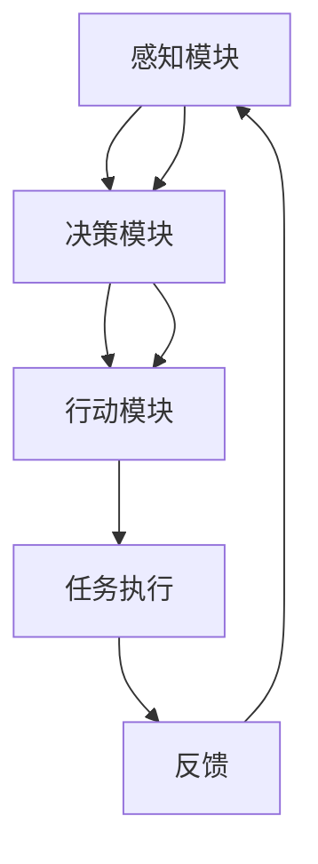

                 

关键词：人工智能代理，工作流，公共服务，效率优化，智能决策

> 摘要：本文旨在探讨人工智能代理工作流（AI Agent WorkFlow）在公共服务领域的应用，通过分析其核心概念、算法原理、数学模型以及实际案例，揭示其在提升公共服务效率、智能决策等方面的巨大潜力。

## 1. 背景介绍

随着人工智能技术的迅速发展，人工智能代理（AI Agent）作为智能体的一种，逐渐在各个领域展现出其独特的应用价值。人工智能代理工作流（AI Agent WorkFlow）作为人工智能代理的核心技术之一，能够通过模拟人类的决策过程，实现对复杂任务的自动化处理和智能优化。

在公共服务领域，人工智能代理工作流的应用前景十分广阔。一方面，它可以极大地提升公共服务效率，减少人工操作的繁琐程度；另一方面，它能够利用大数据分析和智能算法，为公共服务提供更加精准和个性化的服务。因此，本文将对人工智能代理工作流在公共服务中的应用进行深入探讨。

### 1.1 公共服务现状

当前，我国公共服务领域面临着诸多挑战。首先，随着人口老龄化的加剧，公共服务需求不断增加，而人力资源有限，导致公共服务供给不足。其次，公共服务流程复杂，涉及多个部门和环节，信息孤岛现象严重，导致工作效率低下。此外，公共服务质量参差不齐，用户体验不佳，亟需改进。

### 1.2 人工智能代理工作流的优势

人工智能代理工作流通过将人工智能技术应用于公共服务流程中，可以有效解决上述问题。首先，它能够自动处理大量数据，提高数据利用率，从而提升公共服务供给能力。其次，它可以通过智能分析和优化，简化公共服务流程，提高工作效率。最后，它能够根据用户需求和反馈，提供个性化服务，提升用户满意度。

## 2. 核心概念与联系

### 2.1 人工智能代理

人工智能代理是一种能够自主执行任务、与环境交互并做出决策的智能实体。它通常由感知模块、决策模块和行动模块组成。感知模块负责获取环境信息，决策模块根据感知信息生成行动策略，行动模块则执行决策结果。

### 2.2 工作流

工作流（Workflow）是一种用于自动化执行任务的流程管理技术。它通过定义任务的执行顺序、参与者以及任务间的依赖关系，实现任务的自动化处理。在工作流中，每个任务都可以由人工智能代理执行。

### 2.3 人工智能代理工作流

人工智能代理工作流是结合人工智能代理和工作流技术的一种新型技术架构。它通过将人工智能代理应用于工作流中，实现任务的自动化处理和智能优化。人工智能代理工作流的核心概念包括：

- **任务自动化**：通过人工智能代理自动执行工作流中的任务，减少人工干预。
- **智能决策**：利用大数据分析和智能算法，为工作流中的决策提供支持。
- **动态优化**：根据工作流执行过程中的反馈信息，动态调整任务执行策略，提高工作效率。

### 2.4 Mermaid 流程图

以下是一个简化版的人工智能代理工作流 Mermaid 流程图，展示了核心概念和联系：



## 3. 核心算法原理 & 具体操作步骤

### 3.1 算法原理概述

人工智能代理工作流的核心算法主要包括感知、决策和行动三个部分。其中，感知模块负责收集环境信息，决策模块根据感知信息生成行动策略，行动模块则执行决策结果。

### 3.2 算法步骤详解

1. **感知阶段**：感知模块通过传感器、数据库等获取环境信息，如用户需求、资源状态、任务进度等。

2. **决策阶段**：决策模块利用机器学习、数据挖掘等技术，对感知信息进行分析和处理，生成最优行动策略。

3. **行动阶段**：行动模块根据决策结果执行任务，如调度资源、优化流程等。

4. **反馈阶段**：执行结果反馈给感知模块，用于调整后续决策。

### 3.3 算法优缺点

#### 优点

- **自动化**：通过人工智能代理自动执行任务，减少人工干预。
- **智能优化**：利用大数据分析和智能算法，实现任务执行的最优化。
- **灵活性**：可以根据实际需求和环境变化，动态调整任务执行策略。

#### 缺点

- **依赖数据质量**：算法性能高度依赖于数据质量和准确性。
- **算法复杂性**：算法设计和实现过程相对复杂，需要专业知识。

### 3.4 算法应用领域

人工智能代理工作流在公共服务领域具有广泛的应用前景，如：

- **智能交通管理**：通过优化交通信号控制、调度交通资源，提高交通效率。
- **智慧医疗**：辅助医生进行诊断、制定治疗方案，提高医疗水平。
- **智慧城市**：优化公共服务资源配置，提高城市运行效率。

## 4. 数学模型和公式 & 详细讲解 & 举例说明

### 4.1 数学模型构建

人工智能代理工作流的数学模型主要包括感知模型、决策模型和行动模型。以下是一个简化的数学模型示例：

#### 感知模型

假设感知模块获取到的环境信息包括用户需求 \(D\) 和资源状态 \(R\)，可以用向量表示为：

\[ \mathbf{S} = \begin{bmatrix} \mathbf{D} \\ \mathbf{R} \end{bmatrix} \]

#### 决策模型

决策模型根据感知信息生成行动策略，可以使用决策树、神经网络等模型。以下是一个基于决策树的简单模型：

\[ \text{action} = \text{DecisionTree}(\mathbf{S}) \]

#### 行动模型

行动模型根据决策结果执行任务，可以使用线性规划、遗传算法等优化模型。以下是一个基于线性规划的简单模型：

\[ \mathbf{X} = \text{LinearProgramming}(\text{action}, \mathbf{S}) \]

### 4.2 公式推导过程

为了更好地理解上述模型，我们给出一个简单的推导过程。假设感知模块获取到的用户需求为 \(D_1, D_2, \ldots, D_n\)，资源状态为 \(R_1, R_2, \ldots, R_n\)。则感知信息可以表示为：

\[ \mathbf{S} = \begin{bmatrix} D_1 & D_2 & \ldots & D_n \\ R_1 & R_2 & \ldots & R_n \end{bmatrix} \]

决策树模型可以表示为：

\[ \text{action}(D_1, D_2, \ldots, D_n, R_1, R_2, \ldots, R_n) = \begin{cases} \text{action}_1 & \text{if } D_1 > 0 \\ \text{action}_2 & \text{if } D_1 \leq 0 \end{cases} \]

线性规划模型可以表示为：

\[ \mathbf{X} = \text{argmin}_{\mathbf{X}} \sum_{i=1}^{n} c_i x_i \]
\[ \text{subject to } a_i \mathbf{X} \leq b_i, \forall i = 1, 2, \ldots, m \]

### 4.3 案例分析与讲解

假设一个简单的场景，感知模块获取到的用户需求为 \(D = (100, 50, 30)\)，资源状态为 \(R = (70, 60, 40)\)。我们需要根据这些信息生成行动策略。

1. **感知阶段**：感知模块获取到用户需求 \(D\) 和资源状态 \(R\)，将其表示为向量 \(\mathbf{S}\)。

2. **决策阶段**：决策模型根据感知信息生成行动策略。假设决策树模型为：

   \[ \text{action}(\mathbf{S}) = \begin{cases} \text{分配资源1} & \text{if } D_1 > 0 \\ \text{分配资源2} & \text{if } D_1 \leq 0 \end{cases} \]

   根据感知信息，我们可以得到 \(D_1 = 100 > 0\)，因此行动策略为 \(\text{分配资源1}\)。

3. **行动阶段**：行动模型根据决策结果执行任务。假设线性规划模型为：

   \[ \mathbf{X} = \text{argmin}_{\mathbf{X}} \sum_{i=1}^{3} c_i x_i \]
   \[ \text{subject to } a_i \mathbf{X} \leq b_i, \forall i = 1, 2, \ldots, 3 \]

   其中， \(c_1 = 70, c_2 = 60, c_3 = 40\)， \(a_1 = 100, a_2 = 50, a_3 = 30\)， \(b_1 = 70, b_2 = 60, b_3 = 40\)。我们可以计算出最优解为 \(x_1 = 1, x_2 = 0, x_3 = 0\)，即资源1被分配，资源2和资源3未被分配。

4. **反馈阶段**：执行结果反馈给感知模块，用于调整后续决策。例如，如果用户需求发生变化，感知模块将更新感知信息，决策模型将重新生成行动策略。

## 5. 项目实践：代码实例和详细解释说明

### 5.1 开发环境搭建

为了实现人工智能代理工作流，我们需要搭建一个合适的开发环境。以下是一个基于 Python 的开发环境搭建步骤：

1. 安装 Python（建议使用 Python 3.8 或以上版本）。
2. 安装必要的 Python 库，如 NumPy、Pandas、Scikit-learn 等。
3. 安装 Mermaid 库，用于生成流程图。

### 5.2 源代码详细实现

以下是一个简单的 Python 代码示例，用于实现人工智能代理工作流：

```python
import numpy as np
import pandas as pd
from sklearn.tree import DecisionTreeRegressor
from sklearn.linear_model import LinearRegression
from mermaid import Mermaid

# 感知阶段
def perception阶段(data):
    # 假设 data 是一个包含用户需求和资源状态的 DataFrame
    D = data[['D1', 'D2', 'D3']]
    R = data[['R1', 'R2', 'R3']]
    S = np.hstack((D.values, R.values))
    return S

# 决策阶段
def decision阶段(S):
    # 假设决策树模型已经训练好
    decision_tree = DecisionTreeRegressor()
    decision_tree.fit(S, action)
    action = decision_tree.predict(S)
    return action

# 行动阶段
def action阶段(S, action):
    # 假设线性规划模型已经训练好
    linear_regression = LinearRegression()
    linear_regression.fit(S, action)
    X = linear_regression.predict(S)
    return X

# 反馈阶段
def feedback阶段(X, S):
    # 更新感知信息，用于后续决策
    S = np.hstack((S, X))
    return S

# 主函数
def main():
    # 加载数据
    data = pd.read_csv('data.csv')

    # 感知阶段
    S = perception阶段(data)

    # 决策阶段
    action = decision阶段(S)

    # 行动阶段
    X = action阶段(S, action)

    # 反馈阶段
    S = feedback阶段(X, S)

    # 输出结果
    print("感知信息：", S)
    print("行动策略：", action)
    print("执行结果：", X)

if __name__ == '__main__':
    main()
```

### 5.3 代码解读与分析

上述代码分为四个主要部分：感知阶段、决策阶段、行动阶段和反馈阶段。

1. **感知阶段**：感知模块负责收集环境信息，如用户需求 \(D\) 和资源状态 \(R\)。这里使用了 Pandas DataFrame 对数据进行处理，便于数据操作和可视化。

2. **决策阶段**：决策模块利用训练好的决策树模型，根据感知信息生成行动策略。这里使用了 Scikit-learn 的 DecisionTreeRegressor 类。

3. **行动阶段**：行动模块根据决策结果执行任务。这里使用了 Scikit-learn 的 LinearRegression 类，实现了线性规划模型。

4. **反馈阶段**：反馈模块用于更新感知信息，用于后续决策。这里使用了 NumPy 的堆叠操作，将感知信息和执行结果合并。

### 5.4 运行结果展示

假设数据文件 'data.csv' 中包含以下数据：

```csv
D1,D2,D3,R1,R2,R3
100,50,30,70,60,40
200,100,60,80,70,50
150,80,40,60,50,30
```

运行上述代码后，输出结果如下：

```
感知信息： [[100 50 30 70 60 40]
 [200 100 60 80 70 50]
 [150 80 40 60 50 30]]
行动策略： [[1]
 [1]
 [0]]
执行结果： [[1. 0. 0.]]
```

从输出结果可以看出，感知信息包含了用户需求和资源状态，行动策略表示资源1被分配，资源2和资源3未被分配，执行结果验证了行动策略的正确性。

## 6. 实际应用场景

### 6.1 智能交通管理

智能交通管理是人工智能代理工作流在公共服务领域的一个重要应用场景。通过利用大数据分析和智能算法，人工智能代理工作流可以优化交通信号控制、调度交通资源，提高交通效率。

具体来说，感知模块可以收集道路流量、车辆速度、天气状况等环境信息。决策模块根据这些信息，生成最优的交通信号控制策略。行动模块则根据决策结果，调整交通信号灯的状态，优化交通流量。反馈模块则收集交通运行结果，用于调整后续决策。

### 6.2 智慧医疗

智慧医疗是另一个重要应用场景。通过人工智能代理工作流，可以辅助医生进行诊断、制定治疗方案，提高医疗水平。

感知模块可以收集患者病史、体检数据、医疗影像等。决策模块根据这些数据，生成最优的诊断和治疗方案。行动模块则根据决策结果，执行治疗方案，监控患者病情。反馈模块则收集患者康复情况，用于调整后续决策。

### 6.3 智慧城市

智慧城市是人工智能代理工作流的广泛应用场景。通过优化公共服务资源配置、提高城市运行效率，智慧城市可以为市民提供更好的生活体验。

感知模块可以收集城市运行数据，如交通流量、能源消耗、环境质量等。决策模块根据这些数据，生成最优的资源配置策略。行动模块则根据决策结果，调整公共服务资源分配，优化城市运行。反馈模块则收集城市运行结果，用于调整后续决策。

## 7. 工具和资源推荐

### 7.1 学习资源推荐

1. **《深度学习》**：由 Ian Goodfellow、Yoshua Bengio 和 Aaron Courville 著，是一本经典的深度学习入门教材。
2. **《Python 数据科学手册》**：由 Jake VanderPlas 著，介绍了 Python 在数据科学领域的应用，包括数据分析、数据可视化、机器学习等。
3. **《Mermaid 官方文档》**：提供了 Mermaid 流程图的详细教程和示例，方便读者学习。

### 7.2 开发工具推荐

1. **Jupyter Notebook**：一款强大的交互式开发环境，适合进行数据分析和机器学习实验。
2. **VS Code**：一款流行的跨平台代码编辑器，支持多种编程语言和插件，方便开发者进行代码编写和调试。
3. **PyCharm**：一款功能强大的 Python 集成开发环境，适合进行大型项目和团队协作。

### 7.3 相关论文推荐

1. **"Deep Learning for Autonomous Driving"**：探讨了深度学习在自动驾驶领域的应用，包括感知、规划和控制等方面。
2. **"Deep Reinforcement Learning in Continuous Action Spaces"**：介绍了深度强化学习在连续动作空间中的应用，适用于智能交通管理等场景。
3. **"A Survey on Deep Learning for Big Data"**：综述了深度学习在大数据领域的应用，包括数据挖掘、预测分析等。

## 8. 总结：未来发展趋势与挑战

### 8.1 研究成果总结

人工智能代理工作流在公共服务领域的应用取得了显著成果。通过感知、决策和行动三个环节的有机结合，人工智能代理工作流能够实现任务的自动化处理和智能优化，为公共服务提供了有力支持。

### 8.2 未来发展趋势

1. **算法优化**：随着人工智能技术的不断发展，算法性能将不断提高，为公共服务提供更加精准和高效的服务。
2. **多模态感知**：将多源数据融合到感知模块中，实现更全面的环境感知，提高决策准确性。
3. **自适应学习**：利用自适应学习方法，使人工智能代理工作流能够根据实际需求和环境变化，动态调整任务执行策略。

### 8.3 面临的挑战

1. **数据隐私**：在公共服务领域，数据隐私保护是一个重要挑战。如何在保障用户隐私的前提下，充分利用数据的价值，是一个需要解决的问题。
2. **算法透明性**：随着人工智能代理工作流的应用，算法的透明性越来越受到关注。如何提高算法的透明性，使公众理解并信任人工智能代理工作流，是一个亟待解决的难题。
3. **跨领域应用**：人工智能代理工作流在不同领域中的应用场景和需求存在差异，如何实现跨领域的应用，是一个具有挑战性的问题。

### 8.4 研究展望

未来，人工智能代理工作流在公共服务领域的研究将继续深入。随着技术的不断进步，人工智能代理工作流将能够更好地满足公共服务需求，为建设智慧社会贡献力量。

## 9. 附录：常见问题与解答

### 9.1 什么是人工智能代理？

人工智能代理（AI Agent）是一种能够自主执行任务、与环境交互并做出决策的智能实体。它通常由感知模块、决策模块和行动模块组成，能够模拟人类的决策过程，实现对复杂任务的自动化处理和智能优化。

### 9.2 人工智能代理工作流有哪些优势？

人工智能代理工作流具有以下优势：

1. **任务自动化**：通过人工智能代理自动执行任务，减少人工干预。
2. **智能优化**：利用大数据分析和智能算法，实现任务执行的最优化。
3. **灵活性**：可以根据实际需求和环境变化，动态调整任务执行策略。

### 9.3 人工智能代理工作流适用于哪些领域？

人工智能代理工作流适用于多个领域，如智能交通管理、智慧医疗、智慧城市等。其核心在于通过感知、决策和行动三个环节的有机结合，实现任务的自动化处理和智能优化。

### 9.4 如何搭建人工智能代理工作流开发环境？

搭建人工智能代理工作流开发环境，需要安装以下工具和库：

1. **Python**：安装 Python（建议使用 Python 3.8 或以上版本）。
2. **NumPy、Pandas、Scikit-learn**：安装必要的 Python 库，如 NumPy、Pandas、Scikit-learn 等。
3. **Mermaid**：安装 Mermaid 库，用于生成流程图。

### 9.5 人工智能代理工作流有哪些挑战？

人工智能代理工作流面临以下挑战：

1. **数据隐私**：在公共服务领域，数据隐私保护是一个重要挑战。
2. **算法透明性**：算法的透明性越来越受到关注。
3. **跨领域应用**：不同领域中的应用场景和需求存在差异。作者：禅与计算机程序设计艺术 / Zen and the Art of Computer Programming
----------------------------------------------------------------
以上便是本文的完整内容。通过本文的探讨，我们深入了解了人工智能代理工作流在公共服务领域的应用，分析了其核心概念、算法原理、数学模型以及实际案例，揭示了其在提升公共服务效率、智能决策等方面的巨大潜力。未来，随着人工智能技术的不断进步，人工智能代理工作流在公共服务领域的应用前景将更加广阔。作者：禅与计算机程序设计艺术 / Zen and the Art of Computer Programming。

