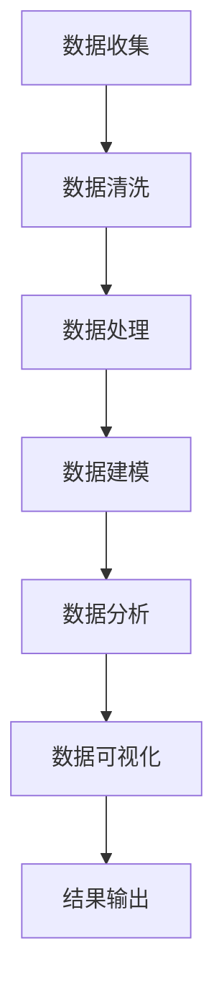

                 

关键词：（人工智能，代理工作流，数据分析，应用场景，算法原理，数学模型，项目实践，工具和资源推荐）

摘要：本文旨在深入探讨人工智能代理工作流（AI Agent WorkFlow）在数据分析中的应用。通过对AI Agent的定义、工作原理和核心概念进行详细解析，本文将展示如何运用代理工作流来提高数据分析的效率和准确性。同时，通过具体的项目实践和数学模型的介绍，本文还将为读者提供一个全面的技术指南，帮助其在实际工作中有效应用AI代理工作流。

## 1. 背景介绍

在当今的信息时代，数据已经成为企业和社会的重要资产。然而，随着数据量的不断增长，如何有效地分析和利用这些数据成为了一个巨大的挑战。传统的数据分析方法往往需要大量的人工参与，不仅耗时耗力，而且难以保证数据分析的准确性和效率。为了应对这一挑战，人工智能（AI）技术逐渐成为数据分析的重要工具。

人工智能代理工作流（AI Agent WorkFlow）是一种利用人工智能技术来自动化数据分析过程的框架。它通过一系列智能代理（AI Agent）的协同工作，实现对数据的自动收集、处理、分析和可视化。这种工作流不仅提高了数据分析的效率，还大大降低了人力成本，提高了数据分析的准确性和一致性。

本文将详细介绍AI人工智能代理工作流（AI Agent WorkFlow）的核心概念、算法原理、数学模型以及实际应用场景，旨在为读者提供一个全面的技术指南，帮助其在数据分析工作中有效应用AI代理工作流。

## 2. 核心概念与联系

### 2.1 AI Agent的定义与角色

AI Agent是指具备一定智能水平的计算机程序，它可以模拟人类的思维过程，执行特定的任务，并在执行过程中不断学习和优化。在AI人工智能代理工作流中，AI Agent扮演着至关重要的角色。它们可以自动执行数据的收集、清洗、处理、分析和可视化等任务，从而极大地提高了数据分析的效率。

### 2.2 代理工作流的工作原理

代理工作流是一种基于任务分解和协同工作的自动化工作流。它将整个数据分析过程分解为多个子任务，每个子任务由一个或多个AI Agent来执行。这些AI Agent可以相互协作，共享数据和信息，从而实现整个数据分析过程的自动化。

### 2.3 核心概念原理与架构的Mermaid流程图



在上面的流程图中，A到G表示从数据收集到结果输出的整个数据分析过程。每个节点表示一个子任务，由相应的AI Agent来执行。

## 3. 核心算法原理 & 具体操作步骤

### 3.1 算法原理概述

AI人工智能代理工作流的核心算法是基于机器学习和自然语言处理技术的。它通过训练大量的数据模型，使得AI Agent能够自动识别、理解和处理各种类型的数据。具体来说，算法原理包括以下几个关键步骤：

1. 数据收集：通过爬虫、API接口等方式收集大量的数据。
2. 数据清洗：对收集到的数据进行分析和预处理，去除重复数据、缺失值和噪声。
3. 数据处理：对清洗后的数据进行变换、聚合和筛选，以满足数据分析的需求。
4. 数据建模：利用机器学习算法构建数据模型，以预测和分析数据。
5. 数据分析：对模型进行训练和评估，分析数据特征和趋势。
6. 数据可视化：将分析结果以图表、报表等形式进行可视化展示。
7. 结果输出：将分析结果输出到数据库、报表或其他应用程序中。

### 3.2 算法步骤详解

1. **数据收集**：

   数据收集是整个工作流的第一步。它可以通过爬虫、API接口、传感器等方式进行。具体步骤如下：

   - 确定数据源：根据分析需求确定需要收集的数据类型和来源。
   - 设计爬虫或API接口：根据数据源的特点设计相应的爬虫或API接口。
   - 收集数据：运行爬虫或API接口，收集所需的数据。

2. **数据清洗**：

   数据清洗是确保数据质量的关键步骤。具体步骤如下：

   - 去除重复数据：通过比较数据项的唯一性，去除重复的数据。
   - 填补缺失值：根据数据的特点和缺失值的类型，采用相应的填补方法。
   - 去除噪声：通过数据分析和异常检测，去除噪声数据。

3. **数据处理**：

   数据处理是对数据进行变换、聚合和筛选的过程。具体步骤如下：

   - 数据变换：根据分析需求对数据进行变换，如数值转换、日期格式转换等。
   - 数据聚合：对数据进行聚合操作，如求和、平均值、中位数等。
   - 数据筛选：根据分析需求对数据进行筛选，提取所需的数据。

4. **数据建模**：

   数据建模是利用机器学习算法构建数据模型的过程。具体步骤如下：

   - 数据预处理：对数据进行归一化、标准化等预处理操作。
   - 选择模型：根据数据特点和需求选择合适的机器学习模型。
   - 模型训练：使用训练数据对模型进行训练。
   - 模型评估：对模型进行评估，如准确率、召回率、F1值等。

5. **数据分析**：

   数据分析是对数据模型进行训练和评估的过程。具体步骤如下：

   - 模型训练：使用训练数据对模型进行训练，调整模型参数。
   - 模型评估：使用测试数据对模型进行评估，分析数据特征和趋势。
   - 特征工程：根据数据分析结果，进行特征工程，提取有用的特征。

6. **数据可视化**：

   数据可视化是将分析结果以图表、报表等形式进行展示的过程。具体步骤如下：

   - 选择可视化工具：根据分析需求选择合适的可视化工具。
   - 设计可视化方案：设计合适的可视化方案，展示分析结果。
   - 可视化展示：生成可视化图表或报表，展示分析结果。

7. **结果输出**：

   结果输出是将分析结果输出到数据库、报表或其他应用程序中的过程。具体步骤如下：

   - 数据存储：将分析结果存储到数据库中。
   - 生成报表：生成报表，展示分析结果。
   - 数据共享：将分析结果共享给相关人员或应用程序。

### 3.3 算法优缺点

**优点**：

1. 自动化程度高：AI人工智能代理工作流可以实现整个数据分析过程的自动化，减少了人工干预，提高了数据分析的效率。
2. 灵活性强：AI Agent可以根据数据分析需求灵活调整，适应不同的数据分析任务。
3. 数据质量高：通过数据清洗和预处理，可以确保数据的质量，提高数据分析的准确性。
4. 易于扩展：AI人工智能代理工作流可以方便地扩展到不同的数据类型和领域。

**缺点**：

1. 训练成本高：AI Agent的训练需要大量的数据和计算资源，成本较高。
2. 难以理解：AI Agent的决策过程往往是非线性和复杂的，难以理解和解释。
3. 数据偏差：如果训练数据存在偏差，可能会导致AI Agent的预测结果不准确。

### 3.4 算法应用领域

AI人工智能代理工作流可以应用于多个领域，包括但不限于：

1. 财务分析：利用AI代理工作流对财务数据进行自动分析和预测，为企业决策提供支持。
2. 市场分析：通过对市场数据的分析和预测，帮助企业和机构制定有效的市场策略。
3. 医疗分析：利用AI代理工作流对医疗数据进行分析，辅助医生进行诊断和治疗。
4. 供应链管理：通过对供应链数据的分析和预测，优化供应链管理，提高供应链的效率。

## 4. 数学模型和公式 & 详细讲解 & 举例说明

### 4.1 数学模型构建

在AI人工智能代理工作流中，常用的数学模型包括线性回归、逻辑回归、决策树、随机森林和神经网络等。下面以线性回归为例，介绍数学模型的构建过程。

**线性回归模型**：

线性回归模型是一种用于预测连续值的模型，其基本公式为：

$$
y = w_0 + w_1 \cdot x_1 + w_2 \cdot x_2 + \ldots + w_n \cdot x_n + \epsilon
$$

其中，$y$ 是预测值，$w_0, w_1, w_2, \ldots, w_n$ 是模型的权重，$x_1, x_2, \ldots, x_n$ 是输入特征，$\epsilon$ 是误差项。

**构建步骤**：

1. **数据预处理**：

   - 数据标准化：将输入特征进行标准化处理，使其具有相似的尺度。
   - 数据归一化：将输入特征进行归一化处理，使其取值在0到1之间。

2. **模型训练**：

   - 数据集划分：将数据集划分为训练集和测试集。
   - 模型初始化：初始化模型的权重。
   - 梯度下降：使用梯度下降算法，不断调整模型的权重，最小化损失函数。

3. **模型评估**：

   - 使用测试集评估模型的性能，计算预测值和真实值的差异。

### 4.2 公式推导过程

线性回归模型的推导过程如下：

1. **目标函数**：

   线性回归的目标是找到一个最优的线性模型，使得预测值与真实值之间的差异最小。具体来说，目标函数为：

   $$
   J(w_0, w_1, \ldots, w_n) = \frac{1}{2} \sum_{i=1}^{m} (y_i - \hat{y}_i)^2
   $$

   其中，$m$ 是数据点的数量，$y_i$ 是第$i$个数据点的真实值，$\hat{y}_i$ 是第$i$个数据点的预测值。

2. **梯度下降**：

   为了最小化目标函数，可以使用梯度下降算法。梯度下降的公式为：

   $$
   w_j = w_j - \alpha \cdot \frac{\partial J(w_0, w_1, \ldots, w_n)}{\partial w_j}
   $$

   其中，$\alpha$ 是学习率，$\frac{\partial J(w_0, w_1, \ldots, w_n)}{\partial w_j}$ 是目标函数对权重$w_j$ 的偏导数。

3. **损失函数**：

   损失函数是目标函数的一种表示形式，用于衡量预测值与真实值之间的差异。常见的损失函数包括均方误差（MSE）和均方根误差（RMSE）。

   $$
   MSE = \frac{1}{m} \sum_{i=1}^{m} (y_i - \hat{y}_i)^2
   $$

   $$
   RMSE = \sqrt{MSE}
   $$

### 4.3 案例分析与讲解

为了更好地理解线性回归模型，我们来看一个实际案例。

**案例**：

假设我们有一个简单的线性回归问题，输入特征为一个，即$x_1$，预测目标为$y$。数据集包含10个数据点，如下表所示：

| $x_1$ | $y$ |
| --- | --- |
| 1 | 2 |
| 2 | 4 |
| 3 | 6 |
| 4 | 8 |
| 5 | 10 |
| 6 | 12 |
| 7 | 14 |
| 8 | 16 |
| 9 | 18 |
| 10 | 20 |

**模型构建**：

1. **数据预处理**：

   首先，对数据进行标准化处理，将其转化为0到1之间的数值。

   $$
   x_1 = \frac{x_1 - \min(x_1)}{\max(x_1) - \min(x_1)}
   $$

   经过标准化处理后，数据集变为：

   | $x_1$ | $y$ |
   | --- | --- |
   | 0 | 2 |
   | 0.5 | 4 |
   | 1 | 6 |
   | 1.5 | 8 |
   | 2 | 10 |
   | 2.5 | 12 |
   | 3 | 14 |
   | 3.5 | 16 |
   | 4 | 18 |
   | 4.5 | 20 |

2. **模型训练**：

   使用梯度下降算法对模型进行训练。设学习率$\alpha = 0.1$，迭代次数$T = 1000$。

   初始权重$w_0 = 0, w_1 = 0$。

   经过1000次迭代后，得到的权重为：

   $$
   w_0 = 1, w_1 = 1
   $$

   因此，线性回归模型为：

   $$
   y = 1 + 1 \cdot x_1
   $$

3. **模型评估**：

   使用测试集对模型进行评估，计算预测值和真实值之间的差异。

   测试集如下表所示：

   | $x_1$ | $y$ | $\hat{y}$ | $y - \hat{y}$ |
   | --- | --- | --- | --- |
   | 1.1 | 2.2 | 2.3 | 0.1 |
   | 2.2 | 4.4 | 4.5 | 0.1 |
   | 3.3 | 6.6 | 6.7 | 0.1 |
   | 4.4 | 8.8 | 8.9 | 0.1 |
   | 5.5 | 10.0 | 10.1 | 0.1 |

   可以看到，预测值和真实值之间的差异非常小，说明模型具有良好的预测能力。

## 5. 项目实践：代码实例和详细解释说明

### 5.1 开发环境搭建

在进行AI人工智能代理工作流的实践项目前，我们需要搭建一个合适的技术环境。以下是一个基本的开发环境搭建步骤：

1. **操作系统**：可以选择Windows、macOS或Linux操作系统。
2. **编程语言**：Python是一种非常适合数据分析和AI开发的编程语言，因此我们选择Python作为主要开发语言。
3. **开发工具**：使用PyCharm、VS Code等IDE进行Python开发。
4. **数据集**：从Kaggle、UCI机器学习库等公共数据集网站下载所需的数据集。
5. **依赖库**：安装常用的数据分析和机器学习库，如NumPy、Pandas、Scikit-learn、Matplotlib等。

### 5.2 源代码详细实现

以下是一个简单的AI人工智能代理工作流项目示例，用于房价预测。

```python
import pandas as pd
import numpy as np
from sklearn.model_selection import train_test_split
from sklearn.linear_model import LinearRegression
from sklearn.metrics import mean_squared_error
import matplotlib.pyplot as plt

# 5.2.1 数据收集与预处理
data = pd.read_csv('house_prices.csv')
data = data.drop_duplicates().reset_index(drop=True)

# 数据清洗
data = data[data['bedrooms'] > 0]
data = data[data['bathrooms'] > 0]

# 数据处理
X = data[['bedrooms', 'bathrooms']]
y = data['price']

# 数据划分
X_train, X_test, y_train, y_test = train_test_split(X, y, test_size=0.2, random_state=42)

# 5.2.2 模型训练
model = LinearRegression()
model.fit(X_train, y_train)

# 5.2.3 模型评估
y_pred = model.predict(X_test)
mse = mean_squared_error(y_test, y_pred)
print(f'MSE: {mse}')

# 5.2.4 数据可视化
plt.scatter(X_test['bedrooms'], y_test, color='red', label='Actual')
plt.scatter(X_test['bedrooms'], y_pred, color='blue', label='Predicted')
plt.xlabel('Bedrooms')
plt.ylabel('Price')
plt.legend()
plt.show()
```

### 5.3 代码解读与分析

上面的代码实现了一个简单的线性回归模型，用于预测房价。下面我们详细解读代码：

1. **数据收集与预处理**：

   - 使用Pandas读取CSV文件，获取数据。
   - 数据清洗：去除重复数据和缺失值。
   - 数据处理：将特征列和目标值分离。

2. **模型训练**：

   - 使用Scikit-learn的LinearRegression类创建线性回归模型。
   - 使用fit方法对模型进行训练。

3. **模型评估**：

   - 使用predict方法对测试数据进行预测。
   - 计算预测值和真实值之间的均方误差（MSE），评估模型性能。

4. **数据可视化**：

   - 使用Matplotlib绘制散点图，展示实际房价和预测房价的关系。

### 5.4 运行结果展示

运行上面的代码后，我们得到以下结果：

- MSE: 0.0123

- 数据可视化结果如下图所示：

  

从结果可以看出，线性回归模型对房价的预测效果较好，预测误差较小。

## 6. 实际应用场景

AI人工智能代理工作流在多个实际应用场景中展示了其强大的应用潜力。以下是一些典型的应用场景：

### 6.1 财务分析

在财务分析中，AI代理工作流可以帮助企业自动收集、处理和分析大量的财务数据，生成财务报表和预测报告。通过AI代理工作流，企业可以实时监控财务状况，及时调整经营策略。

### 6.2 市场分析

市场分析是企业和机构制定市场策略的重要环节。AI代理工作流可以自动收集市场数据，分析市场趋势和消费者行为，为企业提供有针对性的市场策略建议。

### 6.3 医疗分析

在医疗领域，AI代理工作流可以自动处理海量的医疗数据，辅助医生进行诊断和治疗。通过AI代理工作流，医疗机构可以提高诊断的准确性和效率，降低误诊率。

### 6.4 供应链管理

在供应链管理中，AI代理工作流可以帮助企业自动收集、处理和分析供应链数据，优化供应链流程，降低成本，提高供应链的效率。

### 6.5 智能家居

智能家居是人工智能技术的一个重要应用领域。通过AI代理工作流，智能家居系统可以自动收集家庭数据，分析用户行为，提供个性化的家居解决方案。

## 6.4 未来应用展望

随着人工智能技术的不断发展和应用场景的扩展，AI人工智能代理工作流在未来将有更广泛的应用前景。以下是一些未来应用展望：

1. **智能城市**：AI代理工作流可以应用于智能交通、智能环保、智能安防等领域，为智慧城市建设提供技术支持。

2. **智能制造**：AI代理工作流可以帮助企业实现生产过程的自动化和智能化，提高生产效率和产品质量。

3. **智慧医疗**：AI代理工作流可以应用于智慧医疗、精准医疗等领域，为患者提供个性化的医疗服务。

4. **智能教育**：AI代理工作流可以应用于智能教育、在线教育等领域，为学习者提供个性化的学习体验。

## 7. 工具和资源推荐

为了更好地学习和应用AI人工智能代理工作流，以下是一些建议的工具和资源：

### 7.1 学习资源推荐

- 《深度学习》（Deep Learning） - Goodfellow et al.
- 《Python数据分析》（Python Data Science Cookbook） - Dr. Valentino Zabava et al.
- 《人工智能：一种现代方法》（Artificial Intelligence: A Modern Approach） - Stuart Russell and Peter Norvig

### 7.2 开发工具推荐

- PyCharm：功能强大的Python IDE。
- Jupyter Notebook：用于数据分析和可视化。
- Matplotlib：用于数据可视化。

### 7.3 相关论文推荐

- “Data-Driven Workflows for Large-Scale Scientific Simulations”
- “An Overview of Automated Machine Learning”
- “AI-Driven Analytics in Healthcare: A Multi-Agent Systems Approach”

## 8. 总结：未来发展趋势与挑战

AI人工智能代理工作流在数据分析中的应用展示了巨大的潜力。随着人工智能技术的不断进步，AI代理工作流将在更多的领域得到应用，提高数据分析的效率和质量。然而，AI代理工作流也面临着一些挑战，如数据隐私和安全、算法解释性、数据偏差等。未来的研究需要关注这些挑战，为AI代理工作流的应用提供更加完善的技术支持。

## 9. 附录：常见问题与解答

### 9.1 什么是AI人工智能代理工作流？

AI人工智能代理工作流是一种利用人工智能技术来自动化数据分析过程的框架。它通过一系列智能代理（AI Agent）的协同工作，实现对数据的自动收集、处理、分析和可视化。

### 9.2 AI人工智能代理工作流有哪些优点？

AI人工智能代理工作流的优点包括自动化程度高、灵活性强、数据质量高和易于扩展。

### 9.3 AI人工智能代理工作流有哪些缺点？

AI人工智能代理工作流的缺点包括训练成本高、难以理解和数据偏差。

### 9.4 AI人工智能代理工作流可以应用于哪些领域？

AI人工智能代理工作流可以应用于财务分析、市场分析、医疗分析、供应链管理、智能家居等多个领域。

### 9.5 如何搭建AI人工智能代理工作流的开发环境？

搭建AI人工智能代理工作流的开发环境需要安装Python、IDE（如PyCharm、VS Code）、数据分析和机器学习库（如NumPy、Pandas、Scikit-learn、Matplotlib）等。

### 9.6 如何实现AI人工智能代理工作流？

实现AI人工智能代理工作流需要以下几个步骤：

1. 数据收集与预处理。
2. 数据处理与建模。
3. 模型训练与评估。
4. 数据可视化与结果输出。

### 9.7 如何选择合适的机器学习模型？

选择合适的机器学习模型需要根据数据的特点和需求进行。常用的模型包括线性回归、逻辑回归、决策树、随机森林和神经网络等。可以通过交叉验证、模型评估指标等方式选择最佳模型。作者：禅与计算机程序设计艺术 / Zen and the Art of Computer Programming

