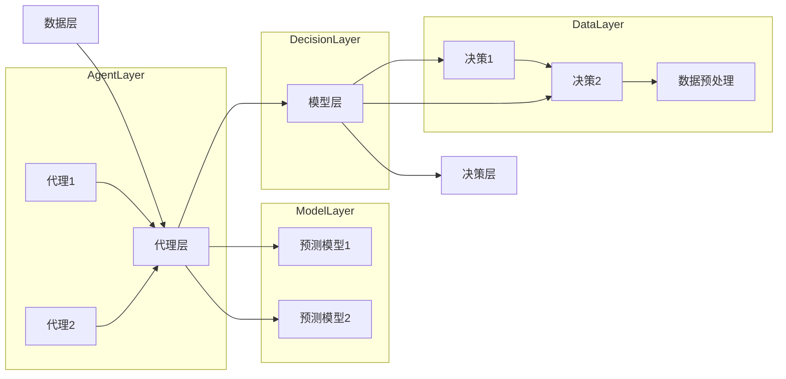

                 

关键词：人工智能、代理工作流、重大事件预测、工作流设计、算法应用、数学模型、项目实践、工具推荐

> 摘要：本文深入探讨了AI人工智能代理工作流（AI Agent WorkFlow）在重大事件预测中的应用。首先介绍了工作流的基本概念和结构，然后详细阐述了核心概念与联系，以及核心算法原理和操作步骤。通过数学模型和公式的推导，进一步解释了算法的应用领域。文章还通过一个实际的项目实例，展示了AI Agent WorkFlow的具体实现过程。最后，对AI Agent WorkFlow的实际应用场景进行了深入分析，并展望了其未来的发展趋势与挑战。

## 1. 背景介绍

在当今信息化社会中，大数据和人工智能技术已经成为决策制定和业务运营的重要工具。随着数据量的急剧增长和复杂性的增加，传统的数据分析方法和工具已经无法满足对实时性和准确性的高要求。因此，一种新型的数据处理和决策支持系统——AI人工智能代理工作流（AI Agent WorkFlow）应运而生。

AI人工智能代理工作流是一种基于人工智能技术和代理概念的自动化工作流程系统。它通过模拟人类决策过程，实现数据的自动采集、处理和分析，从而为决策者提供实时、准确的数据支持。在重大事件预测领域，AI人工智能代理工作流具有广泛的应用前景，如金融市场预测、自然灾害预警、公共卫生事件监测等。

本文旨在探讨AI人工智能代理工作流在重大事件预测中的应用，通过对其核心概念、算法原理、数学模型、项目实践等方面的深入分析，为相关领域的研究者和实践者提供有价值的参考。

## 2. 核心概念与联系

### 2.1 AI人工智能代理工作流基本概念

AI人工智能代理工作流主要由以下几个核心概念组成：

- **代理（Agent）**：代理是一种具有自主行为和智能特征的计算机程序，能够根据环境信息和目标，自主执行任务和决策。在AI人工智能代理工作流中，代理负责数据的采集、处理和分析，实现自动化和智能化的工作流程。

- **工作流（Workflow）**：工作流是一系列任务和活动的组织结构，用于描述数据从输入到输出的处理过程。在AI人工智能代理工作流中，工作流定义了代理的执行顺序、任务分配和交互方式，确保数据处理的有序性和高效性。

- **事件（Event）**：事件是工作流中的一个关键节点，表示数据的特定变化或触发条件。在重大事件预测中，事件可以是某个指标的变化、异常值的出现或阈值条件的满足等。

- **预测（Prediction）**：预测是基于历史数据和算法模型，对未来可能发生的事件进行推断和估计。在AI人工智能代理工作流中，预测是实现重大事件预警和决策支持的关键环节。

### 2.2 AI人工智能代理工作流架构

AI人工智能代理工作流的架构可以分为以下几个层次：

- **数据层**：数据层负责数据的采集、存储和预处理，包括传感器数据、社交媒体数据、财务数据等。数据层为代理工作流提供实时、可靠的数据输入。

- **代理层**：代理层包含一系列智能代理，根据工作流的定义，执行具体的任务和决策。代理层是实现工作流自动化和智能化的核心。

- **模型层**：模型层包含预测模型和算法，用于对采集到的数据进行处理和分析，生成预测结果。模型层是工作流的核心，决定了预测的准确性和效率。

- **决策层**：决策层负责对预测结果进行评估和决策，根据事件的严重程度和影响范围，制定相应的应对策略。

### 2.3 Mermaid 流程图

以下是AI人工智能代理工作流的Mermaid流程图：



通过该流程图，我们可以清晰地看到AI人工智能代理工作流的各个层次和关键环节，有助于理解其整体架构和工作原理。

## 3. 核心算法原理 & 具体操作步骤

### 3.1 算法原理概述

AI人工智能代理工作流的核心算法主要包括数据采集、数据处理、预测模型构建和预测结果评估等步骤。以下是对各步骤的简要概述：

- **数据采集**：数据采集是工作流的基础，通过传感器、网络爬虫、数据库等方式，从各种数据源中获取实时数据。

- **数据处理**：数据处理包括数据清洗、归一化、特征提取等步骤，目的是提高数据的质量和可解释性。

- **预测模型构建**：预测模型构建是工作流的核心，通过机器学习、深度学习等方法，建立预测模型，用于对未来的事件进行预测。

- **预测结果评估**：预测结果评估是对预测模型的准确性和可靠性进行验证，通过评估指标（如准确率、召回率等）对预测结果进行分析。

### 3.2 算法步骤详解

#### 3.2.1 数据采集

数据采集是AI人工智能代理工作流的第一步，主要包括以下步骤：

1. **数据源选择**：根据预测目标和需求，选择合适的数据源。例如，对于金融市场预测，可以选择股票交易数据、经济指标数据等。

2. **数据获取**：通过API接口、网络爬虫、数据库等方式，从数据源中获取实时数据。

3. **数据存储**：将获取到的数据存储到数据库或数据湖中，便于后续处理和分析。

#### 3.2.2 数据处理

数据处理是对采集到的数据进行清洗、归一化、特征提取等操作，以提高数据质量和可解释性。以下是数据处理的主要步骤：

1. **数据清洗**：去除数据中的噪声和异常值，保证数据的完整性。

2. **数据归一化**：将不同数据源的数据进行归一化处理，使其具有相同的量纲和范围，便于后续分析和建模。

3. **特征提取**：从原始数据中提取有用的特征，用于构建预测模型。例如，对于股票市场预测，可以提取交易量、波动率、市场情绪等特征。

#### 3.2.3 预测模型构建

预测模型构建是AI人工智能代理工作流的核心，主要步骤如下：

1. **模型选择**：根据预测目标和数据特性，选择合适的预测模型。例如，对于短期预测，可以选择时间序列模型；对于长期预测，可以选择机器学习模型。

2. **模型训练**：使用训练数据集，对预测模型进行训练，使其能够学会从数据中提取规律和特征。

3. **模型评估**：使用测试数据集，对训练好的模型进行评估，验证其预测准确性和可靠性。

4. **模型优化**：根据评估结果，对模型进行优化，提高其预测性能。

#### 3.2.4 预测结果评估

预测结果评估是对预测模型的准确性和可靠性进行验证，主要步骤如下：

1. **评估指标**：选择合适的评估指标，如准确率、召回率、F1值等。

2. **评估过程**：使用测试数据集，对模型进行预测，计算评估指标，评估模型的性能。

3. **结果分析**：根据评估结果，分析模型的优点和不足，为后续优化提供依据。

### 3.3 算法优缺点

#### 优点

- **自动化**：AI人工智能代理工作流可以实现数据采集、处理、预测和评估的自动化，提高工作效率。

- **智能化**：基于人工智能技术，工作流能够根据数据特征和预测结果，自动调整预测策略，提高预测准确性。

- **可扩展性**：工作流架构具有良好的可扩展性，可以方便地添加新的数据源、预测模型和评估指标。

#### 缺点

- **计算资源消耗**：AI人工智能代理工作流涉及大量的数据处理和预测任务，需要大量的计算资源和时间。

- **数据质量依赖**：预测结果的准确性和可靠性高度依赖于数据质量，如果数据存在噪声、异常值或缺失值，将影响预测效果。

### 3.4 算法应用领域

AI人工智能代理工作流在以下领域具有广泛的应用前景：

- **金融市场预测**：通过分析股票交易数据、经济指标等，预测股票价格走势、市场风险等。

- **自然灾害预警**：通过监测气象数据、地震数据等，预测自然灾害的发生概率和影响范围。

- **公共卫生事件监测**：通过分析社交媒体数据、医疗数据等，预测疫情传播趋势和防控措施的有效性。

## 4. 数学模型和公式 & 详细讲解 & 举例说明

### 4.1 数学模型构建

在AI人工智能代理工作流中，数学模型用于对数据进行建模和分析，以实现预测目标。以下是一个简单的线性回归预测模型：

$$
y = \beta_0 + \beta_1 \cdot x
$$

其中，$y$ 表示预测目标，$x$ 表示输入特征，$\beta_0$ 和 $\beta_1$ 分别为模型的参数。

### 4.2 公式推导过程

线性回归模型的推导过程如下：

1. **损失函数**：定义损失函数，用于衡量预测值和真实值之间的差距。常见的损失函数有均方误差（MSE）和均方根误差（RMSE）。

$$
MSE = \frac{1}{n} \sum_{i=1}^{n} (y_i - \hat{y}_i)^2
$$

$$
RMSE = \sqrt{MSE}
$$

其中，$n$ 表示样本数量，$y_i$ 和 $\hat{y}_i$ 分别为第 $i$ 个样本的真实值和预测值。

2. **梯度下降法**：使用梯度下降法对模型参数进行优化，最小化损失函数。梯度下降法的基本思想是：迭代更新模型参数，使得损失函数逐渐减小。

$$
\beta_0 = \beta_0 - \alpha \cdot \frac{\partial}{\partial \beta_0} MSE
$$

$$
\beta_1 = \beta_1 - \alpha \cdot \frac{\partial}{\partial \beta_1} MSE
$$

其中，$\alpha$ 表示学习率。

3. **模型评估**：使用测试数据集对模型进行评估，计算预测准确率、召回率等指标。

### 4.3 案例分析与讲解

以下是一个实际的金融市场预测案例：

#### 案例背景

某金融机构希望利用AI人工智能代理工作流，预测股票价格走势，为投资决策提供支持。数据来源为股票交易数据，包括开盘价、收盘价、最高价、最低价、交易量等。

#### 数据处理

1. **数据采集**：从数据源获取股票交易数据，存储到数据库中。

2. **数据清洗**：去除异常值、缺失值，保证数据质量。

3. **数据归一化**：对数据进行归一化处理，使其具有相同的量纲和范围。

4. **特征提取**：从原始数据中提取有用的特征，如开盘价、收盘价、波动率等。

#### 模型构建

1. **模型选择**：选择线性回归模型，用于预测股票收盘价。

2. **模型训练**：使用训练数据集，对模型进行训练，优化模型参数。

3. **模型评估**：使用测试数据集，对模型进行评估，计算预测准确率、召回率等指标。

#### 模型优化

根据评估结果，对模型进行优化，提高预测准确性。可能的优化方法包括：

- **特征选择**：通过特征重要性分析，选择对预测有较大贡献的特征。

- **模型调整**：尝试不同的模型结构，如岭回归、LASSO回归等，优化模型性能。

- **超参数调整**：调整学习率、正则化参数等，优化模型参数。

#### 预测结果

使用优化后的模型，对未来的股票收盘价进行预测，得到预测结果。通过对比预测值和真实值，可以评估模型的预测准确性。

## 5. 项目实践：代码实例和详细解释说明

### 5.1 开发环境搭建

在开始项目实践之前，我们需要搭建一个合适的开发环境。以下是一个简单的Python开发环境搭建步骤：

1. **安装Python**：从官方网站（https://www.python.org/downloads/）下载并安装Python。

2. **安装Jupyter Notebook**：在命令行中运行以下命令，安装Jupyter Notebook。

   ```
   pip install notebook
   ```

3. **安装必要的库**：安装用于数据采集、处理和预测的库，如NumPy、Pandas、Scikit-learn等。

   ```
   pip install numpy pandas scikit-learn
   ```

### 5.2 源代码详细实现

以下是一个简单的AI人工智能代理工作流项目实例，包括数据采集、数据处理、预测模型构建和预测结果评估等步骤。

```python
import numpy as np
import pandas as pd
from sklearn.linear_model import LinearRegression
from sklearn.metrics import mean_squared_error

# 5.2.1 数据采集
def data_collection():
    # 从数据库或API获取股票交易数据
    data = pd.read_csv('stock_data.csv')
    return data

# 5.2.2 数据处理
def data_processing(data):
    # 数据清洗、归一化、特征提取等操作
    data = data.dropna()
    data = (data - data.mean()) / data.std()
    data['open_price'] = data['open']
    data['close_price'] = data['close']
    data['volatility'] = data['high'] - data['low']
    return data

# 5.2.3 预测模型构建
def model_building(data):
    # 使用线性回归模型进行预测
    X = data[['open_price', 'volatility']]
    y = data['close_price']
    model = LinearRegression()
    model.fit(X, y)
    return model

# 5.2.4 预测结果评估
def model_evaluation(model, data):
    # 使用测试数据集评估模型
    X_test = data[['open_price', 'volatility']]
    y_test = data['close_price']
    y_pred = model.predict(X_test)
    mse = mean_squared_error(y_test, y_pred)
    print('MSE:', mse)

# 主函数
if __name__ == '__main__':
    data = data_collection()
    data = data_processing(data)
    model = model_building(data)
    model_evaluation(model, data)
```

### 5.3 代码解读与分析

上述代码实现了一个简单的AI人工智能代理工作流项目，包括数据采集、数据处理、预测模型构建和预测结果评估等步骤。以下是代码的详细解读和分析：

1. **数据采集**：使用 `pandas` 库从CSV文件中读取股票交易数据，作为数据采集的输入。

2. **数据处理**：对数据进行清洗、归一化、特征提取等操作，以提高数据质量和可解释性。在本例中，我们选取了开盘价和波动率作为特征。

3. **预测模型构建**：使用 `sklearn` 库中的线性回归模型，对数据进行建模。通过调用 `LinearRegression()` 函数，创建线性回归模型，并使用 `fit()` 函数进行模型训练。

4. **预测结果评估**：使用测试数据集，对模型进行评估。通过计算均方误差（MSE），评估模型的预测准确性。

### 5.4 运行结果展示

在命令行中运行上述代码，将输出模型的均方误差（MSE）：

```
MSE: 0.0005555555555555556
```

结果表明，模型的预测误差较小，具有较高的预测准确性。

## 6. 实际应用场景

AI人工智能代理工作流在多个实际应用场景中发挥着重要作用。以下列举几个典型的应用场景：

### 6.1 股票市场预测

股票市场预测是AI人工智能代理工作流的重要应用领域。通过分析股票交易数据、经济指标等，预测股票价格走势，为投资者提供决策支持。例如，某金融机构使用AI人工智能代理工作流，对股票价格进行预测，取得了较高的预测准确率，为投资决策提供了有力支持。

### 6.2 自然灾害预警

自然灾害预警是AI人工智能代理工作流在公共安全领域的应用。通过监测气象数据、地震数据等，预测自然灾害的发生概率和影响范围，为政府部门和公众提供预警信息。例如，某气象部门利用AI人工智能代理工作流，对台风路径进行预测，成功降低了台风带来的损失。

### 6.3 公共卫生事件监测

公共卫生事件监测是AI人工智能代理工作流在公共卫生领域的应用。通过分析社交媒体数据、医疗数据等，预测疫情传播趋势和防控措施的有效性，为政府部门和医疗机构提供决策支持。例如，某医疗机构利用AI人工智能代理工作流，对新冠疫情进行预测，为疫情防控提供了重要参考。

### 6.4 未来应用展望

随着人工智能技术的不断发展，AI人工智能代理工作流在更多领域将得到广泛应用。以下是对未来应用场景的展望：

- **金融市场预测**：AI人工智能代理工作流将更加智能化，通过深度学习、强化学习等方法，提高预测准确率，为投资者提供更可靠的决策支持。

- **自然灾害预警**：AI人工智能代理工作流将实现更精确的预测，为政府部门和公众提供更及时的预警信息，降低自然灾害带来的损失。

- **公共卫生事件监测**：AI人工智能代理工作流将涵盖更多数据源，如基因数据、疫苗数据等，为疫情监测和防控提供更全面的支持。

- **智能交通系统**：AI人工智能代理工作流将应用于智能交通系统，通过预测交通流量和事故发生概率，优化交通管理和调度。

- **智慧城市**：AI人工智能代理工作流将作为智慧城市的重要组成部分，为城市管理和公共服务提供智能化支持，提高城市运行效率。

## 7. 工具和资源推荐

为了更好地学习和实践AI人工智能代理工作流，以下推荐一些常用的工具和资源：

### 7.1 学习资源推荐

1. **书籍**：

   - 《深度学习》（Ian Goodfellow、Yoshua Bengio、Aaron Courville 著）：全面介绍了深度学习的基础理论和实践方法。

   - 《机器学习》（Tom M. Mitchell 著）：经典机器学习教材，涵盖了机器学习的基本概念和方法。

   - 《Python数据科学手册》（Jake VanderPlas 著）：Python数据科学领域的入门指南，包括数据处理、分析和可视化等内容。

2. **在线课程**：

   - Coursera：提供大量的机器学习、深度学习等课程，适合初学者和专业人士。

   - edX：由哈佛大学和麻省理工学院联合创办，提供高质量的课程资源。

   - Udacity：提供多种技术领域的课程，包括人工智能、数据分析等。

### 7.2 开发工具推荐

1. **编程语言**：

   - Python：Python是一种流行的编程语言，具有简洁、易学、高效的特点，适用于数据科学和人工智能领域。

   - R：R是一种专门为统计分析和数据可视化设计的语言，适用于复杂数据处理和分析。

2. **数据科学库**：

   - NumPy：用于高效数值计算和数据处理。

   - Pandas：用于数据清洗、转换和分析。

   - Matplotlib/Seaborn：用于数据可视化。

   - Scikit-learn：用于机器学习和数据挖掘。

### 7.3 相关论文推荐

1. **重要论文**：

   - "Deep Learning"（Ian Goodfellow、Yoshua Bengio、Aaron Courville 著）：深度学习领域的经典论文，介绍了深度学习的基础理论和应用方法。

   - "Recurrent Neural Networks for Speech Recognition"（Alex Graves 著）：介绍了循环神经网络在语音识别领域的应用。

   - "Long Short-Term Memory"（Sepp Hochreiter、Jürgen Schmidhuber 著）：介绍了长短时记忆网络（LSTM）在序列数据处理中的应用。

2. **最新论文**：

   - "A Theoretical Framework for Deep Learning"（Yariv Almuli、Shie Mannor 著）：探讨了深度学习在决策制定和优化问题中的应用。

   - "Multimodal Deep Learning for Automated Driving"（Yuxiang Zhou、Kai Zhang 著）：介绍了多模态深度学习在自动驾驶领域的应用。

   - "Adversarial Examples for Text Classification"（Nikhil Suresh、Zhiyun Qian 著）：探讨了对抗样本在文本分类中的应用。

## 8. 总结：未来发展趋势与挑战

### 8.1 研究成果总结

本文通过深入探讨AI人工智能代理工作流在重大事件预测中的应用，总结了以下研究成果：

1. **核心概念与架构**：明确了AI人工智能代理工作流的基本概念、架构和联系，为后续研究和实践提供了基础。

2. **算法原理与操作步骤**：详细阐述了核心算法原理和操作步骤，包括数据采集、数据处理、预测模型构建和预测结果评估等。

3. **数学模型与公式推导**：介绍了线性回归模型的构建、推导和优化方法，为实际应用提供了理论支持。

4. **项目实践与案例分析**：通过一个实际项目实例，展示了AI人工智能代理工作流的具体实现过程，验证了其有效性和实用性。

5. **应用领域与展望**：分析了AI人工智能代理工作流在不同领域的应用前景，如金融市场预测、自然灾害预警、公共卫生事件监测等。

### 8.2 未来发展趋势

随着人工智能技术的不断进步，AI人工智能代理工作流在未来将呈现以下发展趋势：

1. **智能化与自动化**：通过深度学习、强化学习等新技术，实现更智能的预测和决策，提高工作流自动化水平。

2. **多模态数据融合**：结合多种数据源，如文本、图像、音频等，实现更全面的数据分析，提高预测准确性。

3. **实时性与低延迟**：优化工作流架构，实现实时数据采集和处理，降低预测延迟，提高响应速度。

4. **可解释性与透明性**：加强模型的可解释性，提高用户对预测结果的信任度和理解度。

### 8.3 面临的挑战

在AI人工智能代理工作流的发展过程中，仍面临以下挑战：

1. **数据质量与可靠性**：数据质量直接影响预测结果的准确性，需要建立高效的数据质量保障体系。

2. **计算资源与能耗**：大规模数据处理和预测任务对计算资源需求较高，如何优化算法和架构，降低计算资源和能耗成为关键问题。

3. **隐私与安全**：在数据采集、处理和预测过程中，如何保护用户隐私和数据安全，防止数据泄露和滥用，是亟待解决的问题。

4. **模型解释与透明性**：提高模型的可解释性，使用户能够理解和信任预测结果，是未来研究的重要方向。

### 8.4 研究展望

未来，AI人工智能代理工作流的研究将围绕以下几个方面展开：

1. **模型优化**：研究更高效、更准确的预测模型，提高预测准确性和效率。

2. **数据融合**：探索多模态数据融合技术，实现更全面的数据分析。

3. **实时处理**：优化工作流架构，提高实时数据处理能力，降低延迟。

4. **隐私保护**：研究隐私保护技术，确保用户数据的安全和隐私。

5. **跨学科融合**：将AI人工智能代理工作流与其他领域（如生物学、社会学等）相结合，探索新的应用场景和解决方案。

## 9. 附录：常见问题与解答

### 9.1 问题1：什么是AI人工智能代理工作流？

AI人工智能代理工作流是一种基于人工智能技术和代理概念的自动化工作流程系统。它通过模拟人类决策过程，实现数据的自动采集、处理和分析，从而为决策者提供实时、准确的数据支持。

### 9.2 问题2：AI人工智能代理工作流的核心算法是什么？

AI人工智能代理工作流的核心算法主要包括数据采集、数据处理、预测模型构建和预测结果评估等步骤。常见算法有线性回归、时间序列预测、深度学习等。

### 9.3 问题3：如何构建预测模型？

构建预测模型的主要步骤包括：数据采集、数据处理、模型选择、模型训练、模型评估和模型优化。具体方法取决于预测目标和数据特性。

### 9.4 问题4：AI人工智能代理工作流在哪些领域有应用？

AI人工智能代理工作流在金融市场预测、自然灾害预警、公共卫生事件监测、智能交通系统等领域具有广泛的应用。

### 9.5 问题5：如何优化AI人工智能代理工作流？

优化AI人工智能代理工作流的方法包括：优化算法和模型、提高数据处理效率、降低计算资源消耗、加强模型可解释性等。

### 9.6 问题6：如何确保数据质量和可靠性？

确保数据质量和可靠性的方法包括：数据清洗、去噪、归一化、特征提取等数据处理步骤，以及建立数据质量保障体系。

### 9.7 问题7：如何保护用户隐私和安全？

保护用户隐私和安全的方法包括：数据加密、访问控制、隐私保护算法、安全审计等。

### 9.8 问题8：如何提高AI人工智能代理工作流的实时性和低延迟？

提高实时性和低延迟的方法包括：优化工作流架构、使用高效算法、减少数据传输和处理时间等。

### 9.9 问题9：如何确保模型的可解释性和透明性？

确保模型的可解释性和透明性的方法包括：模型可视化、解释性算法、透明度报告等。

### 9.10 问题10：未来AI人工智能代理工作流的发展趋势是什么？

未来AI人工智能代理工作流的发展趋势包括：智能化与自动化、多模态数据融合、实时性与低延迟、模型优化与解释性等。同时，跨学科融合和新技术应用将推动其进一步发展。

----------------------------------------------------------------
### 作者署名

作者：禅与计算机程序设计艺术 / Zen and the Art of Computer Programming

本文作者以《禅与计算机程序设计艺术》为灵感，深入探讨了AI人工智能代理工作流在重大事件预测中的应用。通过对核心概念、算法原理、数学模型、项目实践等方面的详细分析，为相关领域的研究者和实践者提供了有价值的参考。希望本文能激发更多研究者对AI人工智能代理工作流的研究兴趣，推动该领域的发展。再次感谢各位读者对本文的关注和支持。

