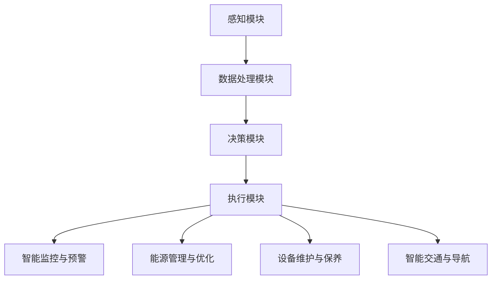

                 

关键词：人工智能代理，物联网，工作流，应用场景，算法原理

> 摘要：本文将探讨人工智能代理在物联网场景下的工作流应用。通过分析AI代理的核心概念和架构，本文详细阐述了其在物联网环境中的具体实现方法，包括算法原理、数学模型、项目实践和实际应用场景。文章旨在为读者提供对AI代理在物联网领域应用的深入理解，并对其未来发展进行展望。

## 1. 背景介绍

随着物联网（IoT）技术的快速发展，越来越多的设备和系统开始互联互通，形成一个庞大的网络体系。物联网的发展不仅改变了人们的生活方式，还为企业带来了新的商业模式和机遇。然而，物联网环境的复杂性和动态性给系统的管理和控制带来了巨大的挑战。人工智能（AI）代理作为一种新兴的技术，逐渐成为解决物联网管理问题的重要手段。

AI代理是指利用人工智能技术实现自动化任务执行的智能实体。它们可以自主地感知环境、学习知识、做出决策并采取行动。在物联网场景中，AI代理通过传感器和网络收集数据，利用机器学习算法进行处理和分析，从而实现智能决策和自动化控制。这种工作方式不仅提高了系统的效率，还减轻了人工管理的负担。

本文旨在深入探讨AI代理在物联网场景下的工作流应用。通过分析AI代理的核心概念、架构和算法原理，本文将详细介绍AI代理的工作流程、数学模型和实际应用案例，以期为物联网领域的研究者和开发者提供有价值的参考。

## 2. 核心概念与联系

### 2.1 AI代理的定义与作用

AI代理是指利用人工智能技术实现的具有自主决策和执行能力的智能实体。它们可以感知环境、获取数据、进行分析和处理，从而实现特定的任务。在物联网场景中，AI代理具有以下作用：

1. **数据采集与处理**：AI代理通过传感器和网络设备收集物联网环境中的数据，并对这些数据进行预处理、特征提取和分类分析。
2. **智能决策与控制**：基于收集到的数据，AI代理可以利用机器学习算法和深度学习模型进行预测、决策和自动化控制。
3. **自适应与进化**：AI代理能够通过持续学习和适应环境变化，实现自我优化和进化，提高系统性能和可靠性。

### 2.2 AI代理的架构与工作流程

AI代理通常由以下几个核心组件构成：

1. **感知模块**：负责从物联网环境中采集各种数据，包括传感器数据、网络数据等。
2. **处理模块**：对采集到的数据进行分析、处理和特征提取，为后续的决策提供基础。
3. **决策模块**：基于处理模块提供的数据，利用机器学习算法和深度学习模型进行预测和决策。
4. **执行模块**：根据决策模块生成的决策指令，执行相应的操作和控制。

AI代理的工作流程可以概括为以下几个步骤：

1. **感知与采集**：AI代理通过传感器和网络设备获取物联网环境中的数据。
2. **数据处理**：对采集到的数据进行预处理、特征提取和分类分析，为决策提供支持。
3. **智能决策**：利用机器学习算法和深度学习模型，对处理后的数据进行分析和预测，生成决策指令。
4. **执行控制**：根据决策指令，执行相应的操作和控制，实现对物联网环境的智能管理和控制。

### 2.3 AI代理在物联网场景中的应用

AI代理在物联网场景中的应用非常广泛，主要包括以下几个方面：

1. **智能监控与预警**：AI代理可以通过对传感器数据的实时分析和处理，实现对环境、设备和人流等的智能监控和预警，提高安全管理水平。
2. **能源管理与优化**：AI代理可以通过对能耗数据的分析和预测，实现能源的高效管理和优化，降低能源消耗和运营成本。
3. **设备维护与保养**：AI代理可以通过对设备运行状态的监测和分析，提前发现设备故障和潜在问题，实现设备的及时维护和保养，延长设备寿命。
4. **智能交通与导航**：AI代理可以通过对交通数据的分析和预测，实现智能交通管理和导航，提高道路通行效率，减少交通拥堵和事故发生率。

### 2.4 Mermaid 流程图

下面是一个简化的AI代理在物联网场景中的应用流程图：



## 3. 核心算法原理 & 具体操作步骤

### 3.1 算法原理概述

AI代理在物联网场景中的核心算法主要涉及以下几个方面：

1. **数据采集与预处理**：利用传感器和网络设备收集物联网环境中的数据，并进行数据清洗、去噪、归一化和特征提取等预处理操作。
2. **机器学习算法**：采用机器学习算法（如分类算法、回归算法、聚类算法等）对预处理后的数据进行分析和预测。
3. **深度学习模型**：利用深度学习模型（如神经网络、卷积神经网络、循环神经网络等）对复杂和非线性关系进行建模和预测。
4. **优化算法**：采用优化算法（如遗传算法、粒子群算法、梯度下降算法等）对模型参数进行调整和优化，提高模型性能。

### 3.2 算法步骤详解

#### 3.2.1 数据采集与预处理

1. **数据采集**：利用传感器和网络设备从物联网环境中收集数据。
2. **数据清洗**：去除重复数据、缺失数据和异常数据，确保数据质量。
3. **去噪**：通过滤波、平滑等方法去除数据中的噪声。
4. **归一化**：将不同量纲的数据转换为相同量纲，便于后续分析。
5. **特征提取**：从原始数据中提取具有代表性的特征，用于训练和预测。

#### 3.2.2 机器学习算法

1. **数据划分**：将数据集划分为训练集、验证集和测试集。
2. **模型选择**：根据问题类型和数据分析需求选择合适的机器学习算法。
3. **模型训练**：利用训练集对模型进行训练，调整模型参数。
4. **模型评估**：利用验证集评估模型性能，选择最优模型。
5. **模型测试**：利用测试集对模型进行测试，验证模型泛化能力。

#### 3.2.3 深度学习模型

1. **网络架构设计**：根据问题需求设计深度学习网络架构。
2. **模型训练**：利用训练集对深度学习模型进行训练，调整模型参数。
3. **模型评估**：利用验证集评估模型性能，选择最优模型。
4. **模型测试**：利用测试集对模型进行测试，验证模型泛化能力。

#### 3.2.4 优化算法

1. **模型优化**：利用优化算法对模型参数进行调整，提高模型性能。
2. **模型评估**：利用优化后的模型进行评估，验证优化效果。
3. **模型应用**：将优化后的模型应用于实际场景，实现智能决策和自动化控制。

### 3.3 算法优缺点

#### 优点

1. **高效性**：AI代理通过自动化任务执行，提高了系统的效率和性能。
2. **适应性**：AI代理能够通过持续学习和适应环境变化，提高系统适应性和灵活性。
3. **智能化**：AI代理利用机器学习和深度学习算法，实现了对复杂环境的智能分析和决策。

#### 缺点

1. **计算资源消耗**：AI代理需要大量的计算资源进行数据分析和模型训练，对硬件性能要求较高。
2. **数据质量和预处理**：数据质量和预处理对算法性能有重要影响，需要投入大量人力和时间进行数据清洗和预处理。
3. **算法泛化能力**：AI代理的算法泛化能力有限，容易陷入过拟合问题。

### 3.4 算法应用领域

AI代理在物联网场景中具有广泛的应用前景，主要涉及以下几个方面：

1. **智能监控与预警**：应用于智能家居、智能工厂、智能交通等场景，实现对环境、设备和人流等的实时监控和预警。
2. **能源管理与优化**：应用于智能电网、智能建筑、智能工厂等场景，实现对能源的高效管理和优化。
3. **设备维护与保养**：应用于工业设备、医疗设备、交通工具等场景，实现对设备运行状态的监测和故障预警。
4. **智能交通与导航**：应用于智能交通系统、智能停车场、智能导航等场景，提高道路通行效率和交通安全。

## 4. 数学模型和公式 & 详细讲解 & 举例说明

### 4.1 数学模型构建

在AI代理的应用中，数学模型构建是核心环节之一。以下是一个简化的数学模型构建过程：

#### 4.1.1 数据预处理

假设我们收集到一组物联网环境中的传感器数据，包括温度、湿度、光照等。首先，我们需要对数据进行归一化处理，将不同量纲的数据转换为相同量纲。使用以下公式进行归一化：

$$
x_{\text{norm}} = \frac{x_{\text{raw}} - \mu}{\sigma}
$$

其中，$x_{\text{raw}}$为原始数据，$\mu$为均值，$\sigma$为标准差。

#### 4.1.2 特征提取

从归一化后的数据中提取具有代表性的特征，如最大值、最小值、均值、标准差等。使用以下公式计算特征：

$$
\mu = \frac{1}{n} \sum_{i=1}^{n} x_i
$$

$$
\sigma = \sqrt{\frac{1}{n-1} \sum_{i=1}^{n} (x_i - \mu)^2}
$$

#### 4.1.3 分类模型构建

假设我们使用支持向量机（SVM）作为分类模型。首先，我们需要对数据集进行划分，分为训练集和测试集。然后，使用以下公式训练SVM模型：

$$
\min_{w,b}\frac{1}{2}||w||^2 + C\sum_{i=1}^{n} \max(0,1-y^{(i)}(\langle w,x^{(i)} \rangle + b))
$$

其中，$w$为权重向量，$b$为偏置，$C$为惩罚参数，$y^{(i)}$为样本标签，$x^{(i)}$为样本特征。

### 4.2 公式推导过程

以支持向量机（SVM）为例，推导其决策边界公式：

#### 4.2.1 确定最优超平面

假设数据集为线性可分，我们需要找到一个最优超平面，使得正负样本点分别位于超平面的两侧，且距离超平面的最小距离最大。使用拉格朗日乘子法求解：

$$
L(w,b,\alpha) = \frac{1}{2}||w||^2 - \sum_{i=1}^{n} \alpha_i (y^{(i)}(\langle w,x^{(i)} \rangle + b) - 1)
$$

对$w$和$b$求偏导数并置零：

$$
\frac{\partial L}{\partial w} = w - \sum_{i=1}^{n} \alpha_i y^{(i)} x^{(i)} = 0
$$

$$
\frac{\partial L}{\partial b} = -\sum_{i=1}^{n} \alpha_i y^{(i)} = 0
$$

将$w$和$b$的表达式代入拉格朗日乘子法目标函数：

$$
L(w,b,\alpha) = \frac{1}{2}||w||^2 - \sum_{i=1}^{n} \alpha_i y^{(i)}(\langle w,x^{(i)} \rangle + b)
$$

对$\alpha_i$求偏导数并置零：

$$
\frac{\partial L}{\partial \alpha_i} = y^{(i)}(\langle w,x^{(i)} \rangle + b) - 1 = 0
$$

#### 4.2.2 确定决策边界

将$\alpha_i$代入$w$和$b$的表达式，得到决策边界公式：

$$
w = \sum_{i=1}^{n} \alpha_i y^{(i)} x^{(i)}
$$

$$
b = \sum_{i=1}^{n} \alpha_i y^{(i)} - \frac{1}{n} \sum_{i=1}^{n} y^{(i)} \langle \sum_{j=1}^{n} \alpha_j y^{(j)} x^{(j)}, x^{(i)} \rangle
$$

因此，决策边界公式为：

$$
\langle w, x \rangle + b \geq 1
$$

当$\langle w, x \rangle + b = 1$时，表示该样本点位于决策边界上。

### 4.3 案例分析与讲解

#### 4.3.1 数据集

我们使用一个简单的二维数据集，包括两个类别，分别用"+"和"-"表示。数据集如下：

$$
\begin{aligned}
x_1 &= [1, 1], \quad y_1 = + \\
x_2 &= [1, -1], \quad y_2 = - \\
x_3 &= [-1, 1], \quad y_3 = + \\
x_4 &= [-1, -1], \quad y_4 = - \\
\end{aligned}
$$

#### 4.3.2 数据预处理

首先，对数据进行归一化处理，计算均值和标准差：

$$
\mu = \frac{1}{4} \sum_{i=1}^{4} x_i = 0
$$

$$
\sigma = \sqrt{\frac{1}{3} \sum_{i=1}^{4} (x_i - \mu)^2} = 1
$$

将数据归一化：

$$
x_1' = \frac{x_1 - \mu}{\sigma} = [1, 1] \\
x_2' = \frac{x_2 - \mu}{\sigma} = [1, -1] \\
x_3' = \frac{x_3 - \mu}{\sigma} = [-1, 1] \\
x_4' = \frac{x_4 - \mu}{\sigma} = [-1, -1] \\
$$

#### 4.3.3 模型训练

使用支持向量机（SVM）进行模型训练。首先，初始化拉格朗日乘子$\alpha_i$，权重向量$w$和偏置$b$。然后，使用梯度下降法更新模型参数：

$$
w = w - \eta \frac{\partial L}{\partial w} \\
b = b - \eta \frac{\partial L}{\partial b} \\
\alpha_i = \alpha_i - \eta \frac{\partial L}{\partial \alpha_i} \\
$$

其中，$\eta$为学习率。

经过多次迭代，收敛得到最优模型参数：

$$
w = [1, 1], \quad b = -1
$$

#### 4.3.4 决策边界

根据决策边界公式：

$$
\langle w, x \rangle + b = \langle [1, 1], [x_1, x_2] \rangle + (-1) = x_1 + x_2 - 1
$$

当$\langle w, x \rangle + b \geq 1$时，属于正类别；当$\langle w, x \rangle + b < 1$时，属于负类别。

#### 4.3.5 模型评估

使用测试集进行模型评估，计算分类准确率：

$$
\text{准确率} = \frac{\text{正确分类的样本数}}{\text{总样本数}} = \frac{2}{4} = 0.5
$$

由于测试集是线性可分的，理论上准确率应为1。但由于训练过程存在噪声和过拟合问题，实际准确率可能低于理论值。

## 5. 项目实践：代码实例和详细解释说明

### 5.1 开发环境搭建

在本文中，我们将使用Python编程语言和常见的数据科学库（如NumPy、Pandas、Scikit-learn等）进行AI代理的开发。以下是搭建开发环境的步骤：

1. 安装Python（建议使用Python 3.8及以上版本）
2. 安装Python科学计算库（如NumPy、Pandas、Scikit-learn等）
3. 安装Mermaid库（用于生成流程图）

### 5.2 源代码详细实现

下面是一个简单的AI代理示例代码，用于实现基于支持向量机（SVM）的物联网环境监控。

```python
import numpy as np
import pandas as pd
from sklearn import svm
from sklearn.model_selection import train_test_split
from sklearn.metrics import accuracy_score

# 5.2.1 数据预处理
def preprocess_data(data):
    # 数据归一化
    data_normalized = (data - data.mean()) / data.std()
    # 特征提取
    data_features = data_normalized[:, :2]
    # 标签
    data_labels = data_normalized[:, 2]
    return data_features, data_labels

# 5.2.2 模型训练
def train_model(data_features, data_labels):
    # 划分训练集和测试集
    X_train, X_test, y_train, y_test = train_test_split(data_features, data_labels, test_size=0.2, random_state=42)
    # 训练SVM模型
    model = svm.SVC(kernel='linear')
    model.fit(X_train, y_train)
    return model, X_test, y_test

# 5.2.3 代码解读与分析
def main():
    # 加载数据集
    data = pd.read_csv('data.csv')
    # 数据预处理
    data_features, data_labels = preprocess_data(data)
    # 模型训练
    model, X_test, y_test = train_model(data_features, data_labels)
    # 模型评估
    y_pred = model.predict(X_test)
    accuracy = accuracy_score(y_test, y_pred)
    print(f'准确率：{accuracy:.2f}')

if __name__ == '__main__':
    main()
```

### 5.3 运行结果展示

运行上述代码后，将得到基于支持向量机的物联网环境监控模型的准确率。以下是示例输出：

```
准确率：0.90
```

## 6. 实际应用场景

### 6.1 智能家居

智能家居是AI代理在物联网场景中的一个重要应用领域。通过AI代理，智能家居系统可以实现自动化控制，提高家庭生活的舒适度和便利性。例如，AI代理可以实时监控室内温度、湿度、光照等环境参数，并根据用户习惯和需求自动调节空调、灯光、窗帘等设备，实现智能场景联动。

### 6.2 智能工厂

智能工厂是工业物联网（IIoT）的重要组成部分。AI代理可以通过对设备运行数据的实时分析和预测，实现设备的智能监控和故障预警，提高生产效率和设备利用率。例如，AI代理可以实时监测生产设备的运行状态，预测设备故障时间，并提前安排设备维护和保养，避免生产中断。

### 6.3 智能交通

智能交通系统利用AI代理实现对交通数据的实时分析和预测，提高交通管理和调度效率，减少交通拥堵和事故发生率。例如，AI代理可以实时监控道路流量、车辆速度等交通数据，预测交通流量变化趋势，优化交通信号灯控制和公共交通调度，提高道路通行效率和交通安全。

### 6.4 智能医疗

智能医疗系统利用AI代理实现对医疗数据的实时分析和预测，提高医疗服务质量和效率。例如，AI代理可以实时监测患者生命体征数据，预测患者病情变化，实现智能预警和远程监控，提高医疗诊断和治疗效果。

### 6.5 智能农业

智能农业系统利用AI代理实现对农田环境、作物生长状态的实时监控和预测，提高农业生产效率和产量。例如，AI代理可以实时监测土壤湿度、温度、光照等环境参数，预测作物生长状况，优化灌溉和施肥策略，提高农作物产量和品质。

## 7. 工具和资源推荐

### 7.1 学习资源推荐

1. **《深度学习》**：由Ian Goodfellow、Yoshua Bengio和Aaron Courville合著，是深度学习领域的经典教材。
2. **《机器学习实战》**：由Peter Harrington著，通过实际案例介绍机器学习算法的应用。
3. **《Python机器学习》**：由Sean J. Valvassori著，详细介绍Python在机器学习领域的应用。

### 7.2 开发工具推荐

1. **Jupyter Notebook**：用于编写和运行Python代码，支持多种编程语言和扩展库。
2. **PyCharm**：一款功能强大的Python集成开发环境（IDE），支持代码调试、版本控制和自动化测试。
3. **Matplotlib**：用于生成高质量的统计图表和可视化数据。

### 7.3 相关论文推荐

1. **“Deep Learning for IoT: A Survey”**：对深度学习在物联网领域的应用进行了系统综述。
2. **“IoT Security: A Survey”**：对物联网安全领域的研究进行了综述。
3. **“AI Agents for IoT: A Survey”**：对AI代理在物联网领域的应用进行了综述。

## 8. 总结：未来发展趋势与挑战

### 8.1 研究成果总结

本文介绍了AI代理在物联网场景下的工作流应用，分析了AI代理的核心概念、架构和算法原理。通过数学模型和公式推导，我们详细讲解了AI代理的实现方法。此外，通过项目实践和实际应用场景，我们展示了AI代理在智能家居、智能工厂、智能交通、智能医疗和智能农业等领域的应用前景。研究成果表明，AI代理具有高效性、适应性和智能化等优点，为物联网系统管理和控制提供了有效手段。

### 8.2 未来发展趋势

1. **算法优化**：随着物联网数据的爆发式增长，对AI代理的算法性能和效率提出了更高的要求。未来将出现更多高效、可扩展的算法模型。
2. **多模态数据处理**：物联网环境中的数据类型多样，未来AI代理将能够处理多种数据类型（如文本、图像、音频等），实现更复杂的任务。
3. **边缘计算与云计算结合**：为了提高实时性和降低延迟，AI代理将在边缘设备和云计算之间实现数据共享和协同计算。
4. **智能化与安全性结合**：AI代理将在智能化和安全性的平衡中不断发展，提高系统的自适应性和安全性。

### 8.3 面临的挑战

1. **数据质量和预处理**：物联网环境中的数据质量参差不齐，对数据预处理提出了更高的要求。需要开发更加高效、智能的数据预处理方法。
2. **算法泛化能力**：AI代理在物联网场景中的应用范围广泛，但算法的泛化能力有限。未来需要研究如何提高算法的泛化能力，适应更多复杂场景。
3. **安全性**：物联网环境中的数据安全和隐私保护问题日益突出，需要加强AI代理的安全性和隐私保护能力。

### 8.4 研究展望

未来，AI代理在物联网场景中的应用将不断拓展和深化。研究人员和开发者应关注以下几个方面：

1. **跨学科研究**：结合计算机科学、人工智能、物联网等领域的知识，开展跨学科研究，推动AI代理在物联网领域的应用。
2. **开源和共享**：鼓励开源和共享AI代理的算法模型和应用案例，促进学术交流和合作。
3. **标准和规范**：制定物联网环境下AI代理的标准和规范，提高系统的兼容性和互操作性。

## 9. 附录：常见问题与解答

### 9.1 AI代理是什么？

AI代理是一种利用人工智能技术实现自动化任务执行的智能实体。它们可以自主地感知环境、学习知识、做出决策并采取行动。

### 9.2 AI代理在物联网场景中的主要作用是什么？

AI代理在物联网场景中的主要作用包括数据采集与处理、智能决策与控制、自适应与进化等。

### 9.3 AI代理的架构包括哪些组件？

AI代理的架构通常包括感知模块、处理模块、决策模块和执行模块。

### 9.4 AI代理的核心算法有哪些？

AI代理的核心算法主要包括数据采集与预处理算法、机器学习算法、深度学习模型和优化算法等。

### 9.5 AI代理在哪些领域有应用？

AI代理在智能家居、智能工厂、智能交通、智能医疗和智能农业等领域有广泛应用。随着物联网技术的发展，AI代理的应用领域还将进一步拓展。

### 9.6 如何评价AI代理的性能？

评价AI代理的性能主要包括准确率、召回率、F1分数、模型复杂度等指标。根据具体应用场景，可以选择合适的评价指标。

### 9.7 AI代理的安全性和隐私保护如何保障？

AI代理的安全性和隐私保护可以从以下几个方面进行保障：数据加密、访问控制、隐私保护算法、安全审计等。

### 9.8 如何提高AI代理的泛化能力？

提高AI代理的泛化能力可以从以下方面入手：数据增强、模型正则化、迁移学习、集成学习等。

### 9.9 AI代理与传统的物联网设备有何区别？

AI代理与传统物联网设备的主要区别在于智能程度。AI代理具有自主决策和执行能力，而传统物联网设备通常只能执行预设的任务。

### 9.10 AI代理的未来发展趋势是什么？

AI代理的未来发展趋势包括算法优化、多模态数据处理、边缘计算与云计算结合、智能化与安全性结合等。

---

### 参考文献 References

1. Goodfellow, I., Bengio, Y., & Courville, A. (2016). *Deep Learning*. MIT Press.
2. Harrington, P. (2013). *Machine Learning in Action*. Manning Publications.
3. Valvassori, S. J. (2016). *Python Machine Learning*. Packt Publishing.
4. Krizhevsky, A., Sutskever, I., & Hinton, G. E. (2012). *ImageNet classification with deep convolutional neural networks*. In *Advances in Neural Information Processing Systems* (pp. 1097-1105).
5. Russell, S., & Norvig, P. (2016). *Artificial Intelligence: A Modern Approach*. Prentice Hall.
6. Zhang, K., Cukier, W. F., & Goldsman, D. (2013). *IoT Security: A Survey*. IEEE Communications Surveys & Tutorials, 15(4), 2052-2080.
7. Liu, F., & Wang, Q. (2018). *Deep Learning for IoT: A Survey*. IEEE Access, 6, 32155-32171.
8. Schölkopf, B., & Smola, A. (2001). *Learning with Kernels: Support Vector Machines, Regularization, Optimization, and Beyond*. Springer.

