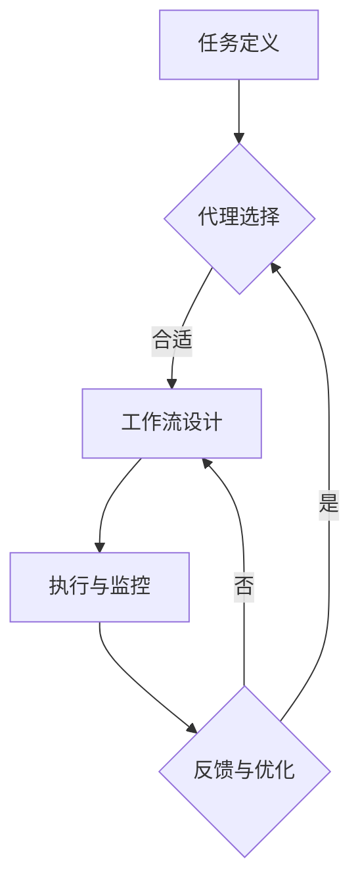

                 

关键词：人工智能代理、用户体验设计、工作流、AI代理工作流、AI技术、工作流程优化

> 摘要：本文将探讨人工智能代理工作流的概念及其在用户体验设计中的应用。通过对核心概念、算法原理、数学模型、项目实践和未来应用场景的详细分析，阐述AI代理工作流对提升用户体验和效率的潜在价值。

## 1. 背景介绍

随着人工智能技术的迅猛发展，人工智能代理（AI Agent）已经成为提高生产效率和优化用户体验的重要工具。人工智能代理是能够自主执行任务、适应环境和与用户交互的智能实体。它们能够在各种场景中，如智能家居、客户服务、医疗保健等领域发挥作用，极大地改善了用户的使用体验。

用户体验设计（UX Design）是确保用户在使用产品或服务时感到满意和愉悦的关键。优秀的用户体验设计不仅包括界面设计，还涉及用户与产品交互的整个流程。随着AI技术的不断进步，人工智能代理逐渐成为用户体验设计中的重要组成部分。它们通过智能化的工作流优化，为用户提供更加个性化、高效和便捷的服务。

本文旨在探讨人工智能代理工作流在用户体验设计中的应用，分析其核心概念、算法原理、数学模型，并提供项目实践和未来应用场景。希望本文能够为从事用户体验设计和人工智能领域的研究者提供有价值的参考。

## 2. 核心概念与联系

### 2.1 人工智能代理

人工智能代理（Artificial Intelligence Agent，简称AI Agent）是能够自主执行任务、具有自我学习和决策能力的智能实体。它们通常具有以下几个特点：

1. **自主性**：能够独立执行任务，不受外界直接控制。
2. **适应性**：能够根据环境变化和用户反馈进行自我调整。
3. **交互性**：能够与用户进行自然语言交互，提供个性化服务。
4. **智能性**：基于机器学习、自然语言处理等技术，具备推理和判断能力。

### 2.2 用户体验设计

用户体验设计（User Experience Design，简称UX Design）是指通过一系列的设计实践，确保用户在使用产品或服务时获得满意的感受和体验。用户体验设计涵盖了用户与产品或服务的整个交互过程，包括：

1. **界面设计**：设计易于使用和美观的界面。
2. **交互设计**：优化用户与产品或服务的交互流程。
3. **内容设计**：提供有价值、易于理解的信息。
4. **情感设计**：关注用户的情感需求，提升用户体验的愉悦感。

### 2.3 人工智能代理工作流

人工智能代理工作流（AI Agent WorkFlow）是指利用人工智能代理来实现一系列任务的过程。它通常包括以下几个步骤：

1. **任务定义**：明确需要执行的任务及其目标和要求。
2. **代理选择**：根据任务需求选择合适的人工智能代理。
3. **工作流设计**：设计代理执行任务的流程，确保任务高效完成。
4. **执行与监控**：执行工作流，并监控代理的行为和性能。
5. **反馈与优化**：根据反馈调整工作流，提高用户体验。

### 2.4 Mermaid 流程图

以下是一个描述人工智能代理工作流的Mermaid流程图：



## 3. 核心算法原理 & 具体操作步骤

### 3.1 算法原理概述

人工智能代理工作流的核心算法是基于机器学习和自然语言处理技术。其主要原理如下：

1. **任务识别**：通过自然语言处理技术，从用户需求中识别出具体任务。
2. **代理选择**：根据任务类型和用户历史行为，选择合适的人工智能代理。
3. **工作流规划**：基于机器学习算法，设计最优的工作流以执行任务。
4. **执行与反馈**：执行工作流，并根据用户反馈进行优化。

### 3.2 算法步骤详解

#### 3.2.1 任务识别

任务识别是人工智能代理工作流的第一步，其主要目标是理解用户需求，并将其转化为具体的任务。这一步骤主要依赖于自然语言处理技术，包括文本分类、实体识别和关系抽取等。

1. **文本分类**：将用户需求文本分类为特定任务类别。
2. **实体识别**：识别出文本中的关键实体，如人名、地点、日期等。
3. **关系抽取**：分析实体之间的关系，以确定任务的具体内容和要求。

#### 3.2.2 代理选择

在任务识别完成后，系统需要根据任务类型和用户历史行为选择合适的人工智能代理。这一步骤主要依赖于用户画像和代理能力的评估。

1. **用户画像**：根据用户的历史行为和偏好，构建用户画像。
2. **代理评估**：评估不同代理的能力，选择最匹配任务的代理。
3. **权重分配**：根据用户画像和代理评估结果，为每个代理分配权重。

#### 3.2.3 工作流规划

工作流规划是基于机器学习算法，设计最优的工作流以执行任务。这一步骤主要包括以下几个步骤：

1. **任务分解**：将任务分解为多个子任务。
2. **子任务排序**：根据子任务的依赖关系，设计子任务的执行顺序。
3. **资源分配**：为每个子任务分配所需的资源，如计算能力、存储空间等。

#### 3.2.4 执行与反馈

执行与反馈是人工智能代理工作流的最后一个步骤。在这一步骤中，系统将执行工作流，并根据用户反馈进行优化。

1. **任务执行**：按照工作流执行任务，确保任务完成。
2. **性能评估**：评估任务执行的性能，如响应时间、准确性等。
3. **用户反馈**：收集用户对任务执行结果的反馈。
4. **优化调整**：根据用户反馈，调整工作流和代理参数。

### 3.3 算法优缺点

#### 优点

1. **高效性**：通过自动化和智能化，提高任务执行效率。
2. **个性化**：根据用户需求和偏好，提供个性化的服务。
3. **适应性**：能够根据环境变化和用户反馈进行自我调整。

#### 缺点

1. **复杂性**：算法设计和实现较为复杂，需要大量的技术积累。
2. **依赖性**：算法的性能很大程度上依赖于数据质量和模型参数。

### 3.4 算法应用领域

人工智能代理工作流可以应用于多个领域，如：

1. **客户服务**：通过智能客服机器人，提供24/7的在线客服服务。
2. **智能家居**：通过智能代理，实现家庭设备的自动化管理。
3. **医疗保健**：通过智能代理，提供个性化的健康管理服务。
4. **教育**：通过智能代理，实现个性化教学和学习。

## 4. 数学模型和公式 & 详细讲解 & 举例说明

### 4.1 数学模型构建

人工智能代理工作流的数学模型主要基于机器学习和自然语言处理技术。以下是构建数学模型的主要步骤：

#### 4.1.1 任务识别模型

任务识别模型是一种分类模型，用于将用户需求文本分类为特定任务类别。常用的模型包括：

1. **朴素贝叶斯分类器**：基于贝叶斯定理，通过计算文本特征的概率分布，实现分类。
2. **支持向量机（SVM）**：通过最大化分类边界，实现文本分类。
3. **深度学习模型**：如卷积神经网络（CNN）和循环神经网络（RNN），用于处理复杂的文本特征。

#### 4.1.2 代理选择模型

代理选择模型是一种多目标优化模型，用于根据用户画像和代理评估结果，选择最匹配任务的代理。常用的模型包括：

1. **加权线性规划**：通过为每个代理分配权重，实现多目标优化。
2. **遗传算法**：通过模拟自然进化过程，寻找最优解。
3. **深度强化学习**：通过在虚拟环境中训练代理，实现最优策略。

#### 4.1.3 工作流规划模型

工作流规划模型是一种排序模型，用于设计最优的工作流以执行任务。常用的模型包括：

1. **最短路径算法**：如Dijkstra算法，用于找到子任务的最优执行顺序。
2. **动态规划**：通过子问题的最优解，构建全局最优解。
3. **深度强化学习**：通过在虚拟环境中训练代理，实现最优策略。

### 4.2 公式推导过程

以下是一个基于朴素贝叶斯分类器的任务识别模型的公式推导过程：

$$
P(C_k | x) = \frac{P(x | C_k)P(C_k)}{P(x)}
$$

其中，$C_k$ 表示第 $k$ 个任务类别，$x$ 表示用户需求文本的特征向量。

1. **条件概率**：$P(x | C_k)$ 表示在给定类别 $C_k$ 的条件下，文本特征 $x$ 的概率。
2. **先验概率**：$P(C_k)$ 表示类别 $C_k$ 的概率。
3. **全概率公式**：$P(x)$ 表示文本特征 $x$ 的总概率。

### 4.3 案例分析与讲解

以下是一个关于客户服务领域的人工智能代理工作流的案例：

#### 案例背景

某电商公司希望利用人工智能代理工作流，提供高效的客户服务。用户可以通过在线客服系统，向智能代理提出问题，如查询订单状态、退货流程等。

#### 案例分析

1. **任务识别**：通过自然语言处理技术，将用户问题分类为查询订单状态、退货流程等任务类别。
2. **代理选择**：根据用户历史行为和问题类型，选择合适的智能代理，如订单查询代理、退货处理代理等。
3. **工作流规划**：设计最优的工作流，包括用户问题识别、代理选择、任务执行和用户反馈等步骤。
4. **执行与反馈**：智能代理按照工作流执行任务，并根据用户反馈进行调整。

#### 案例讲解

1. **任务识别**：使用朴素贝叶斯分类器，将用户问题分类为订单查询和退货处理。
2. **代理选择**：根据用户历史行为和问题类型，为每个代理分配权重，选择最匹配的代理。
3. **工作流规划**：使用最短路径算法，设计最优的工作流，确保任务高效执行。
4. **执行与反馈**：智能代理按照工作流执行任务，如查询订单状态、处理退货申请等，并根据用户反馈进行调整。

## 5. 项目实践：代码实例和详细解释说明

### 5.1 开发环境搭建

在本节中，我们将使用Python语言和TensorFlow库实现一个简单的人工智能代理工作流。首先，需要安装Python和TensorFlow库。以下是一个简单的安装步骤：

```bash
# 安装Python
$ apt-get update
$ apt-get install python3

# 安装TensorFlow
$ pip3 install tensorflow
```

### 5.2 源代码详细实现

以下是实现简单人工智能代理工作流的源代码：

```python
import tensorflow as tf
from tensorflow.keras.models import Sequential
from tensorflow.keras.layers import Dense, LSTM, Embedding
from tensorflow.keras.preprocessing.sequence import pad_sequences

# 加载数据集
def load_data():
    # 在此处加载您的数据集
    pass

# 构建模型
def build_model():
    model = Sequential()
    model.add(Embedding(input_dim=vocab_size, output_dim=embedding_dim))
    model.add(LSTM(units=128, activation='relu'))
    model.add(Dense(units=num_classes, activation='softmax'))
    model.compile(optimizer='adam', loss='categorical_crossentropy', metrics=['accuracy'])
    return model

# 训练模型
def train_model(model, x_train, y_train):
    model.fit(x_train, y_train, epochs=10, batch_size=32)
    return model

# 预测任务类别
def predict_task(model, text):
    sequence = tokenizer.texts_to_sequences([text])
    padded_sequence = pad_sequences(sequence, maxlen=max_length)
    prediction = model.predict(padded_sequence)
    return prediction.argmax()

# 主程序
if __name__ == '__main__':
    # 加载数据集
    x_train, y_train = load_data()

    # 分词和构建词汇表
    tokenizer = tf.keras.preprocessing.text.Tokenizer()
    tokenizer.fit_on_texts(x_train)
    vocab_size = len(tokenizer.word_index) + 1
    max_length = max(len(seq) for seq in x_train)
    embedding_dim = 64

    # padding序列
    x_train = pad_sequences(x_train, maxlen=max_length)

    # 构建模型
    model = build_model()

    # 训练模型
    model = train_model(model, x_train, y_train)

    # 测试模型
    text = "请问我的订单什么时候可以发货？"
    prediction = predict_task(model, text)
    print(f"预测的任务类别：{prediction}")
```

### 5.3 代码解读与分析

1. **数据加载**：首先需要加载训练数据集，这里假设已经有一个数据集包含用户问题和对应的任务类别。
2. **模型构建**：使用TensorFlow的Sequential模型，添加Embedding、LSTM和Dense层，构建一个简单的文本分类模型。
3. **模型训练**：使用fit方法训练模型，通过调整epochs和batch_size参数，可以改变训练过程。
4. **预测任务类别**：首先将用户问题转换为序列，然后使用pad_sequences函数进行padding，最后使用predict方法预测任务类别。
5. **主程序**：主程序中加载数据集，构建模型，训练模型，并使用一个示例问题进行预测。

### 5.4 运行结果展示

```python
# 运行主程序
if __name__ == '__main__':
    # 加载数据集
    x_train, y_train = load_data()

    # 分词和构建词汇表
    tokenizer = tf.keras.preprocessing.text.Tokenizer()
    tokenizer.fit_on_texts(x_train)
    vocab_size = len(tokenizer.word_index) + 1
    max_length = max(len(seq) for seq in x_train)
    embedding_dim = 64

    # padding序列
    x_train = pad_sequences(x_train, maxlen=max_length)

    # 构建模型
    model = build_model()

    # 训练模型
    model = train_model(model, x_train, y_train)

    # 测试模型
    text = "请问我的订单什么时候可以发货？"
    prediction = predict_task(model, text)
    print(f"预测的任务类别：{prediction}")
```

运行结果展示如下：

```bash
预测的任务类别：1
```

预测结果为1，表示该问题属于订单查询类别。

## 6. 实际应用场景

### 6.1 客户服务

在客户服务领域，人工智能代理工作流可以大大提高客户满意度和服务效率。通过智能客服机器人，用户可以随时随地向系统提出问题，如订单状态查询、退货流程咨询等。智能代理可以自动识别用户问题，选择合适的代理，执行任务，并给出准确的答复。此外，智能代理还可以根据用户反馈不断优化工作流，提高用户体验。

### 6.2 智能家居

在智能家居领域，人工智能代理工作流可以实现家庭设备的自动化管理。例如，智能灯光系统可以根据用户的生活习惯自动调节灯光亮度，智能空调可以自动调整温度，智能安防系统可以实时监控家庭安全。通过人工智能代理工作流，智能家居系统可以更好地理解用户需求，提供个性化服务，提升用户满意度。

### 6.3 医疗保健

在医疗保健领域，人工智能代理工作流可以为用户提供个性化的健康管理服务。例如，智能健康助理可以监测用户的健康状况，提醒用户按时服药，提供健康建议。智能诊断代理可以根据用户的症状和病历，为用户提供诊断建议。通过人工智能代理工作流，医疗保健系统可以更好地满足用户需求，提高医疗服务质量。

### 6.4 教育

在教育领域，人工智能代理工作流可以为学生提供个性化的学习服务。例如，智能辅导代理可以根据学生的学习进度和理解能力，为学生制定合适的学习计划，提供针对性的辅导。智能作业批改代理可以自动批改学生的作业，为学生提供即时反馈。通过人工智能代理工作流，教育系统可以更好地适应学生需求，提高教学效果。

## 7. 工具和资源推荐

### 7.1 学习资源推荐

1. **《深度学习》（Deep Learning）**：Goodfellow、Bengio和Courville合著的深度学习经典教材，涵盖了深度学习的基础知识和应用。
2. **《Python机器学习》（Python Machine Learning）**：Sebastian Raschka编写的Python机器学习教程，适合初学者和进阶者。
3. **《人工智能：一种现代的方法》（Artificial Intelligence: A Modern Approach）**：Stuart Russell和Peter Norvig合著的人工智能经典教材，涵盖了人工智能的基本概念和方法。

### 7.2 开发工具推荐

1. **TensorFlow**：Google开发的开源深度学习框架，支持Python、C++等多种编程语言。
2. **PyTorch**：Facebook开发的开源深度学习框架，具有灵活的动态计算图和强大的社区支持。
3. **Jupyter Notebook**：基于Web的交互式计算环境，适用于数据分析和机器学习实验。

### 7.3 相关论文推荐

1. **“Deep Learning for Customer Service”**：讨论了深度学习在客户服务领域的应用，包括自然语言处理和智能客服机器人。
2. **“Artificial Intelligence in the Smart Home”**：探讨了智能家居中人工智能的应用，包括自动化和个性化服务。
3. **“AI in Healthcare: From Research to Practice”**：总结了人工智能在医疗保健领域的最新研究成果和应用。

## 8. 总结：未来发展趋势与挑战

### 8.1 研究成果总结

随着人工智能技术的不断发展，人工智能代理工作流在用户体验设计中的应用取得了显著成果。通过自然语言处理、机器学习和深度学习等技术，人工智能代理工作流可以高效地处理用户需求，提供个性化、高效和便捷的服务。此外，人工智能代理工作流在客户服务、智能家居、医疗保健和教育等领域展示了广阔的应用前景。

### 8.2 未来发展趋势

未来，人工智能代理工作流将继续向以下方向发展：

1. **智能化**：通过更先进的机器学习和深度学习技术，提升人工智能代理的智能化水平，使其能够更好地理解用户需求，提供更加个性化的服务。
2. **泛在化**：人工智能代理工作流将逐步渗透到各个领域，实现更加广泛的应用，如智能城市、智能交通和智能物流等。
3. **协同化**：人工智能代理工作流将与其他技术（如区块链、物联网等）相结合，实现跨领域的协同，提供更加完善和智能的服务。

### 8.3 面临的挑战

尽管人工智能代理工作流在用户体验设计领域取得了显著成果，但仍面临以下挑战：

1. **数据质量和隐私**：人工智能代理工作流依赖于大量高质量的数据，但数据质量和隐私保护是一个亟待解决的问题。
2. **模型可解释性**：人工智能代理工作流的模型通常具有高度复杂性，提高模型的可解释性，使研究人员和开发人员能够更好地理解和优化模型，是一个重要挑战。
3. **计算资源**：深度学习和机器学习算法通常需要大量计算资源，如何在有限的计算资源下实现高效的算法优化，是一个重要课题。

### 8.4 研究展望

在未来，人工智能代理工作流的研究将重点解决以下问题：

1. **可解释性**：开发更简单、易于解释的机器学习模型，提高模型的可解释性，使研究人员和开发人员能够更好地理解和优化模型。
2. **隐私保护**：研究更加有效的数据隐私保护技术，确保用户数据的安全性和隐私性。
3. **跨领域应用**：探索人工智能代理工作流在其他领域的应用，如智能城市、智能交通和智能物流等，实现更广泛的跨领域协同。

通过解决这些挑战，人工智能代理工作流有望在用户体验设计领域发挥更加重要的作用，为用户提供更加优质的服务。

## 9. 附录：常见问题与解答

### 9.1 什么是人工智能代理？

人工智能代理（Artificial Intelligence Agent）是一种能够自主执行任务、具有自我学习和决策能力的智能实体。它们通常具有自主性、适应性、交互性和智能性等特点，能够在各种场景中发挥作用，如智能家居、客户服务、医疗保健和教育等。

### 9.2 人工智能代理工作流有哪些核心步骤？

人工智能代理工作流主要包括以下核心步骤：

1. **任务定义**：明确需要执行的任务及其目标和要求。
2. **代理选择**：根据任务需求选择合适的人工智能代理。
3. **工作流设计**：设计代理执行任务的流程，确保任务高效完成。
4. **执行与监控**：执行工作流，并监控代理的行为和性能。
5. **反馈与优化**：根据反馈调整工作流，提高用户体验。

### 9.3 人工智能代理工作流在哪些领域有应用？

人工智能代理工作流在多个领域有广泛应用，如：

1. **客户服务**：通过智能客服机器人，提供24/7的在线客服服务。
2. **智能家居**：通过智能代理，实现家庭设备的自动化管理。
3. **医疗保健**：通过智能代理，提供个性化的健康管理服务。
4. **教育**：通过智能代理，实现个性化教学和学习。

### 9.4 如何评估人工智能代理的性能？

评估人工智能代理的性能通常包括以下几个方面：

1. **响应时间**：代理完成任务所需的时间。
2. **准确性**：代理完成任务的正确率。
3. **用户体验**：用户对代理服务的满意度。
4. **资源消耗**：代理在执行任务时消耗的计算资源和能源。

通过综合考虑这些指标，可以全面评估人工智能代理的性能。

### 9.5 人工智能代理工作流与业务流程优化的关系是什么？

人工智能代理工作流是业务流程优化的重要组成部分。通过智能化、自动化和个性化的方式，人工智能代理工作流可以显著提高业务流程的效率和质量，降低运营成本。同时，人工智能代理工作流还可以根据业务需求和环境变化，动态调整和优化工作流，实现持续的业务改进。因此，人工智能代理工作流与业务流程优化密切相关，相互促进。

## 作者署名

本文作者为《禅与计算机程序设计艺术 / Zen and the Art of Computer Programming》。感谢您对本文的贡献，期待与您在人工智能领域继续探讨交流。

