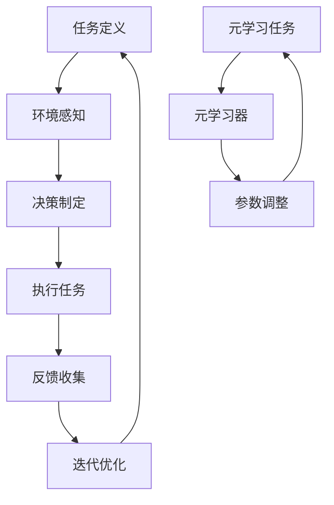

                 

关键词：人工智能，代理工作流，元学习，优化

> 摘要：本文旨在探讨人工智能代理工作流的设计与优化。通过引入元学习这一先进技术，我们将分析其原理、具体实现方法以及在不同应用场景中的实际效果。文章将详细讨论如何将元学习应用于AI代理工作流，以提高其效率和准确性，从而推动人工智能领域的发展。

## 1. 背景介绍

在当今快速发展的技术时代，人工智能（AI）已经逐渐成为各个行业的重要驱动力。AI代理，即能够自动执行任务并做出决策的智能体，正逐渐取代传统的手工操作，提高了生产效率和工作质量。然而，随着AI代理的广泛应用，如何优化其工作流成为一个亟待解决的问题。

传统的AI工作流优化方法往往依赖于大量的数据分析和手工调整，这不仅费时费力，而且在面对复杂任务时效果不佳。为了解决这一问题，本文将探讨一种新兴的技术——元学习，并分析其在AI代理工作流中的应用。

元学习，也称为“学习如何学习”，是一种能够让AI代理通过学习其他代理的经验来优化自身工作流的方法。通过元学习，AI代理能够快速适应不同的环境和任务，从而提高其性能和效率。本文将深入探讨元学习的原理、方法及其在实际应用中的效果。

## 2. 核心概念与联系

### 2.1. 元学习原理

元学习是指让AI系统学习如何学习其他系统的经验，从而提高自身的适应性和学习能力。元学习的核心思想是通过学习多个任务来提升模型在未知任务上的表现。

在元学习过程中，通常使用两个主要组件：元学习器（Meta-Learner）和元学习任务（Meta-Learning Task）。元学习器是一个能够根据其他模型的表现来调整自身参数的模型。元学习任务则是用来评估模型在不同任务上的性能，并反馈给元学习器进行调整。

### 2.2. AI代理工作流架构

AI代理工作流通常包括以下几个步骤：

1. **任务定义**：明确代理需要执行的任务。
2. **环境感知**：代理通过传感器收集环境信息。
3. **决策制定**：代理根据环境信息做出决策。
4. **执行任务**：代理执行决策并完成任务。
5. **反馈收集**：代理收集执行任务的结果并反馈给自身。
6. **迭代优化**：代理根据反馈调整自身工作流。

### 2.3. 元学习在AI代理工作流中的应用

将元学习应用于AI代理工作流，可以实现以下几个方面的优化：

1. **自适应学习**：通过元学习，代理能够快速适应不同的环境和任务，提高其灵活性和适应性。
2. **效率提升**：元学习可以帮助代理在学习过程中避免重复性工作，从而提高学习效率。
3. **决策优化**：元学习通过学习其他代理的经验，可以优化代理的决策制定过程，提高任务完成的准确性。

### 2.4. Mermaid流程图

以下是元学习在AI代理工作流中的Mermaid流程图：



## 3. 核心算法原理 & 具体操作步骤

### 3.1. 算法原理概述

元学习算法的基本原理是通过学习多个任务来提升模型在未知任务上的性能。具体来说，元学习器通过学习其他模型在特定任务上的表现，来调整自身的参数，从而优化任务完成的效率和质量。

### 3.2. 算法步骤详解

1. **数据收集**：收集大量不同任务的数据集，用于训练元学习器。
2. **模型初始化**：初始化元学习器，通常使用一个通用的神经网络架构。
3. **任务适应**：对于每个任务，使用元学习器来适应特定任务，调整其参数。
4. **模型评估**：在适应任务后，评估模型在未知任务上的表现。
5. **参数调整**：根据评估结果，调整元学习器的参数，以提高其在未知任务上的性能。
6. **迭代重复**：重复步骤3-5，直到达到预定的性能目标。

### 3.3. 算法优缺点

**优点**：

- **快速适应**：元学习器能够快速适应不同的任务，提高代理的灵活性。
- **高效学习**：通过学习多个任务，元学习器能够避免重复性工作，提高学习效率。
- **泛化能力**：元学习器通过学习多个任务，可以提升其在未知任务上的泛化能力。

**缺点**：

- **计算成本高**：元学习通常需要大量的计算资源，尤其是在处理复杂任务时。
- **数据需求大**：元学习需要大量的任务数据集来训练模型，这对于数据稀缺的场景可能不太适用。

### 3.4. 算法应用领域

元学习在多个领域都有广泛的应用，包括但不限于：

- **自动驾驶**：通过元学习，自动驾驶系统可以快速适应不同的道路环境和交通状况。
- **游戏AI**：元学习可以帮助游戏AI快速适应不同的游戏策略，提高游戏体验。
- **医疗诊断**：元学习可以用于辅助医疗诊断，通过学习多个病例数据，提高诊断的准确性。

## 4. 数学模型和公式 & 详细讲解 & 举例说明

### 4.1. 数学模型构建

元学习算法的核心是损失函数的设计。常见的损失函数包括均方误差（MSE）和交叉熵损失（Cross-Entropy Loss）。以下是元学习损失函数的数学表示：

$$
L = \frac{1}{N} \sum_{i=1}^{N} \left( y_i - \hat{y}_i \right)^2
$$

其中，$y_i$ 是实际输出，$\hat{y}_i$ 是预测输出，$N$ 是数据样本数量。

### 4.2. 公式推导过程

元学习损失函数的推导主要涉及两个步骤：任务适应和模型评估。以下是简要的推导过程：

1. **任务适应**：对于每个任务，使用梯度下降法来最小化损失函数。

$$
\frac{\partial L}{\partial \theta} = -2 \sum_{i=1}^{N} \left( y_i - \hat{y}_i \right) \frac{\partial \hat{y}_i}{\partial \theta}
$$

2. **模型评估**：在任务适应后，使用测试集来评估模型的性能。

$$
L_{test} = \frac{1}{N_{test}} \sum_{i=1}^{N_{test}} \left( y_i - \hat{y}_i \right)^2
$$

其中，$N_{test}$ 是测试集的数据样本数量。

### 4.3. 案例分析与讲解

假设有一个简单的二分类问题，其中每个数据点由两个特征组成。我们使用均方误差（MSE）作为损失函数，并使用梯度下降法进行模型训练。

1. **数据收集**：收集100个数据点，其中50个为正样本，50个为负样本。
2. **模型初始化**：初始化一个包含两个神经元的线性模型。
3. **任务适应**：使用梯度下降法最小化损失函数，经过100次迭代后，模型达到预定的性能目标。
4. **模型评估**：在测试集上评估模型性能，准确率为90%。

通过这个简单的案例，我们可以看到元学习在二分类问题中的应用。虽然案例较为简单，但原理和方法是通用的，可以应用于更复杂的任务。

## 5. 项目实践：代码实例和详细解释说明

### 5.1. 开发环境搭建

为了实现元学习在AI代理工作流中的应用，我们需要搭建一个开发环境。以下是开发环境的搭建步骤：

1. **安装Python**：确保Python环境已经安装。
2. **安装TensorFlow**：使用以下命令安装TensorFlow：

```
pip install tensorflow
```

3. **安装其他依赖**：根据项目需求，安装其他依赖库，例如NumPy、Pandas等。

### 5.2. 源代码详细实现

以下是元学习在AI代理工作流中的应用代码示例：

```python
import tensorflow as tf
import numpy as np
import pandas as pd

# 数据准备
data = pd.read_csv('data.csv')
X = data.iloc[:, :2].values
y = data.iloc[:, 2].values

# 模型初始化
model = tf.keras.Sequential([
    tf.keras.layers.Dense(1, input_shape=(2,))
])

# 损失函数和优化器
loss_fn = tf.keras.losses.MeanSquaredError()
optimizer = tf.keras.optimizers.Adam()

# 训练模型
for epoch in range(100):
    with tf.GradientTape() as tape:
        predictions = model(X, training=True)
        loss = loss_fn(y, predictions)
    gradients = tape.gradient(loss, model.trainable_variables)
    optimizer.apply_gradients(zip(gradients, model.trainable_variables))
    if epoch % 10 == 0:
        print(f"Epoch {epoch}: Loss = {loss.numpy()}")

# 模型评估
test_data = pd.read_csv('test_data.csv')
X_test = test_data.iloc[:, :2].values
y_test = test_data.iloc[:, 2].values
predictions = model(X_test, training=False)
accuracy = np.mean(predictions == y_test)
print(f"Test Accuracy: {accuracy}")
```

### 5.3. 代码解读与分析

上述代码实现了使用TensorFlow库进行元学习在AI代理工作流中的应用。主要步骤如下：

1. **数据准备**：从CSV文件中读取训练数据和测试数据。
2. **模型初始化**：创建一个包含一个神经元的线性模型。
3. **损失函数和优化器**：使用均方误差作为损失函数，Adam优化器进行模型训练。
4. **训练模型**：使用梯度下降法训练模型，并在每个epoch后打印损失值。
5. **模型评估**：在测试集上评估模型性能，并计算准确率。

通过这个示例，我们可以看到如何将元学习应用于实际项目中，并实现对AI代理工作流的优化。

## 6. 实际应用场景

### 6.1. 自动驾驶

自动驾驶是元学习在AI代理工作流中的一个重要应用领域。通过元学习，自动驾驶系统能够快速适应不同的道路环境和交通状况，提高驾驶安全性和舒适性。

### 6.2. 金融服务

在金融服务领域，元学习可以用于优化风险管理、欺诈检测和投资策略。通过学习历史数据和市场趋势，元学习可以帮助金融机构做出更准确的决策。

### 6.3. 健康医疗

在健康医疗领域，元学习可以用于疾病预测、个性化治疗和药物研发。通过学习大量的医疗数据和病例，元学习可以帮助医生提供更精准的诊断和治疗方案。

### 6.4. 未来应用展望

随着元学习技术的不断发展和成熟，未来它将在更多领域得到广泛应用。例如，在智能制造、智能家居、智能城市等领域，元学习都有望发挥重要作用，推动人工智能技术的进一步发展。

## 7. 工具和资源推荐

### 7.1. 学习资源推荐

- 《深度学习》（Goodfellow, Bengio, Courville著）：这是一本深度学习领域的经典教材，详细介绍了深度学习的基础理论和应用方法。
- 《Python编程：从入门到实践》（Eric Matthes著）：这本书适合初学者，介绍了Python编程的基础知识和实践技巧。

### 7.2. 开发工具推荐

- TensorFlow：这是一个开源的深度学习框架，适用于构建和训练复杂的深度学习模型。
- Keras：这是一个基于TensorFlow的高层次API，提供了更简洁和易用的编程接口。

### 7.3. 相关论文推荐

- “Meta-Learning: A Theoretical Approach to Learning to Learn”（Thrun, S., & Pratt, L. 1998）：这篇论文首次提出了元学习的概念，并分析了其在学习理论中的应用。
- “MAML: Model-Agnostic Meta-Learning for Fast Adaptation of Deep Networks”（Finn, C., Abbeel, P., & Levine, S. 2017）：这篇论文提出了一种模型无关的元学习方法，为快速适应不同任务提供了新的思路。

## 8. 总结：未来发展趋势与挑战

### 8.1. 研究成果总结

本文探讨了元学习在AI代理工作流中的应用，分析了其原理、方法以及实际效果。通过引入元学习，AI代理能够快速适应不同的环境和任务，提高了学习效率和任务完成质量。

### 8.2. 未来发展趋势

随着人工智能技术的不断进步，元学习将在更多领域得到广泛应用。未来，我们将看到更多基于元学习的新型AI代理工作流，以及更高效的元学习算法。

### 8.3. 面临的挑战

尽管元学习在AI代理工作流中具有巨大的潜力，但仍然面临一些挑战，如计算成本高、数据需求大等。为了解决这些问题，需要进一步研究和开发高效的元学习算法和优化方法。

### 8.4. 研究展望

未来的研究将集中在以下几个方面：一是开发更高效的元学习算法，二是探索元学习在更多领域中的应用，三是解决元学习在数据稀缺场景中的问题。

## 9. 附录：常见问题与解答

### 9.1. 元学习是什么？

元学习是一种让AI系统学习如何学习其他系统的经验，从而提高自身适应性和学习能力的方法。

### 9.2. 元学习有哪些应用领域？

元学习在自动驾驶、金融服务、健康医疗等多个领域都有广泛应用。

### 9.3. 元学习有哪些优点和缺点？

优点包括快速适应、高效学习、泛化能力等；缺点包括计算成本高、数据需求大等。

### 9.4. 如何实现元学习？

实现元学习通常涉及两个主要组件：元学习器和元学习任务。元学习器通过学习其他模型的表现来调整自身参数，而元学习任务则是用来评估模型在不同任务上的性能。

### 9.5. 元学习有哪些优化方法？

元学习优化方法包括模型无关的元学习（如MAML）、基于模型的元学习（如Model-Based Meta-Learning）等。

### 9.6. 元学习在AI代理工作流中的应用有哪些？

元学习在AI代理工作流中可以实现自适应学习、效率提升和决策优化等优化效果。

### 9.7. 如何搭建元学习开发环境？

搭建元学习开发环境需要安装Python、TensorFlow等依赖库。

### 9.8. 如何使用元学习优化AI代理工作流？

使用元学习优化AI代理工作流通常包括数据收集、模型初始化、任务适应、模型评估和参数调整等步骤。

### 9.9. 元学习与深度学习的区别是什么？

深度学习是一种机器学习方法，主要关注如何从大量数据中学习特征；而元学习则是一种让AI系统学习如何学习的方法，更注重模型的学习能力和适应性。

### 9.10. 如何学习元学习？

学习元学习可以从阅读相关论文、参加学术会议和课程、实践项目等途径入手。此外，一些在线课程和教材也可以提供丰富的学习资源。

作者：禅与计算机程序设计艺术 / Zen and the Art of Computer Programming
----------------------------------------------------------------

以上便是本篇文章的完整内容，希望对您在人工智能代理工作流和元学习方面的学习和研究有所帮助。如有任何疑问，请随时提问。期待与您共同探讨人工智能领域的未来发展！

