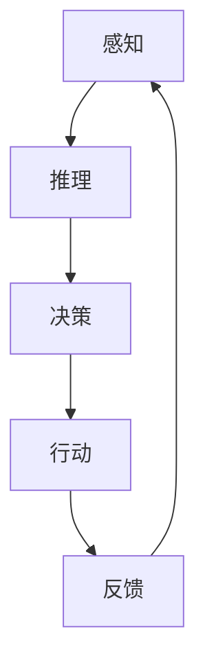

                 

关键词：人工智能、智能代理、工作流、智慧城市、智能算法、数学模型、代码实例、实际应用

> 摘要：本文将探讨AI人工智能代理工作流（AI Agent WorkFlow）的概念、核心原理以及其在智慧城市中的实际应用。通过介绍智能代理的定义、工作原理和架构，结合具体的数学模型和算法原理，我们将深入分析AI代理在智慧城市中的具体应用场景和未来的发展趋势。文章最后，还将推荐一些相关的学习资源和开发工具，以帮助读者更好地理解和掌握智能代理技术。

## 1. 背景介绍

随着科技的飞速发展，人工智能（AI）已经成为推动社会进步的重要力量。智能代理（AI Agent）作为人工智能的一个重要分支，其在各个领域的应用日益广泛。智慧城市作为AI应用的重要场景之一，正在通过智能代理实现更加高效、智能化的城市管理和服务。

智能代理是一种具有自主决策能力的软件实体，能够在没有人为干预的情况下完成特定的任务。它们可以模拟人类的行为，具备感知、推理、决策和行动等能力。智能代理的工作流（WorkFlow）是指智能代理在执行任务时的一系列步骤和过程，包括任务的分解、执行、监控和优化等。

智慧城市是指利用信息技术、物联网、大数据等手段，实现城市管理的智能化和现代化。智慧城市的建设离不开智能代理的应用，智能代理可以协助城市管理者进行交通管理、环境监测、公共服务等方面的优化，提高城市的管理效率和服务质量。

本文旨在探讨AI人工智能代理工作流（AI Agent WorkFlow）的核心原理和实际应用，为读者提供对智能代理技术及其在智慧城市中应用的理解和启示。

### 1.1 人工智能的发展历程

人工智能（AI）起源于20世纪50年代，当时计算机科学家们开始探索如何让计算机模拟人类智能。从最初的符号逻辑推理、知识表示，到后来的专家系统、机器学习，再到深度学习和强化学习，人工智能经历了数十年的发展。

在符号逻辑推理阶段，计算机科学家们试图通过编程来模拟人类的推理能力。这一阶段的代表性工作包括艾伦·图灵的“图灵测试”和约翰·麦卡锡的“逻辑理论家”程序。

知识表示阶段，人工智能开始关注如何将人类知识转化为计算机可以处理的形式。专家系统是这一阶段的典型应用，它通过将领域专家的知识编码到计算机程序中，为用户提供咨询和建议。

机器学习阶段，人工智能开始从数据中自动学习规律和模式。这一阶段的代表性工作包括 Arthur Samuel 的“博弈程序”和 Andrew Ng 的“深度学习”。

深度学习和强化学习阶段，人工智能在图像识别、语音识别、自然语言处理等任务上取得了突破性进展。这一阶段的代表性工作包括 Google 的“AlphaGo”和 OpenAI 的“GPT-3”。

### 1.2 智能代理的概念与分类

智能代理（AI Agent）是指具有自主决策能力、能够执行特定任务的软件实体。根据智能代理的功能和特点，可以将智能代理分为以下几类：

**基于规则的智能代理**：这类智能代理根据预设的规则进行决策和行动。它们的优点是简单易懂，缺点是难以应对复杂、不确定的环境。

**基于机器学习的智能代理**：这类智能代理通过机器学习算法从数据中自动学习规律和模式。它们的优点是能够应对复杂、不确定的环境，缺点是需要大量数据进行训练。

**基于深度学习的智能代理**：这类智能代理通过深度学习算法从数据中自动学习层次化的特征表示。它们的优点是能够处理大规模数据，缺点是需要大量的计算资源和时间。

**基于强化学习的智能代理**：这类智能代理通过强化学习算法在与环境的交互过程中不断优化自己的策略。它们的优点是能够实现自我进化，缺点是需要大量的时间和计算资源。

### 1.3 智慧城市的发展现状与趋势

智慧城市是指利用信息技术、物联网、大数据等手段，实现城市管理的智能化和现代化。智慧城市的发展现状和趋势主要体现在以下几个方面：

**1. 基础设施建设**：智慧城市的建设离不开基础设施的建设，包括物联网传感器、大数据中心、云计算平台等。这些基础设施为智能代理提供了数据支撑和技术保障。

**2. 应用场景丰富**：智慧城市的应用场景涵盖了交通、环境、公共服务、安全等多个方面。例如，智能交通系统可以通过分析交通流量数据，实现交通拥堵的实时监测和优化，提高交通效率。

**3. 数据驱动决策**：智慧城市通过收集和分析大量数据，为城市管理者提供决策依据。数据驱动的决策模式有助于提高城市管理效率和公共服务质量。

**4. 安全与隐私保护**：随着智慧城市的建设，数据安全和隐私保护成为重要问题。智慧城市需要建立完善的安全体系和隐私保护机制，确保数据的安全和用户的隐私。

### 1.4 智能代理在智慧城市中的重要性

智能代理在智慧城市中发挥着重要作用，主要体现在以下几个方面：

**1. 提高城市管理效率**：智能代理可以协助城市管理者进行交通管理、环境监测、公共服务等方面的优化，提高城市管理效率。

**2. 优化公共服务质量**：智能代理可以提供个性化的公共服务，满足居民的需求，提高公共服务质量。

**3. 促进可持续发展**：智能代理可以协助城市管理者实现资源优化配置，降低能源消耗，促进城市的可持续发展。

**4. 提高城市安全性**：智能代理可以协助城市管理者进行安全监测和预警，提高城市安全性。

### 1.5 文章结构

本文将分为以下几个部分：

**1. 背景介绍**：介绍人工智能、智能代理、智慧城市的发展背景。

**2. 核心概念与联系**：阐述智能代理的定义、分类、工作原理和架构。

**3. 核心算法原理 & 具体操作步骤**：分析智能代理的核心算法原理和具体操作步骤。

**4. 数学模型和公式 & 详细讲解 & 举例说明**：介绍智能代理相关的数学模型和公式，并结合实际案例进行讲解。

**5. 项目实践：代码实例和详细解释说明**：提供智能代理的代码实例和详细解释说明。

**6. 实际应用场景**：分析智能代理在智慧城市中的具体应用场景。

**7. 未来应用展望**：探讨智能代理在未来的发展趋势和应用前景。

**8. 工具和资源推荐**：推荐学习资源和开发工具。

**9. 总结：未来发展趋势与挑战**：总结研究成果，探讨未来发展趋势和面临的挑战。

## 2. 核心概念与联系

在探讨智能代理的工作流之前，有必要对智能代理的核心概念和架构进行详细阐述，以便读者能够更好地理解智能代理的运作原理和其在智慧城市中的应用。

### 2.1 智能代理的定义

智能代理是一种具有自主决策能力、能够执行特定任务的软件实体。它可以在没有人为干预的情况下，通过感知环境、推理分析、决策制定和执行行动等一系列操作，完成指定的任务或目标。

智能代理的核心特点是自主性和智能性。自主性意味着智能代理能够独立地执行任务，而不需要持续的人为干预；智能性则意味着智能代理能够通过学习和优化，不断提高自身的决策能力和执行效果。

### 2.2 智能代理的分类

根据智能代理的功能和特点，可以将智能代理分为以下几类：

**1. 基于规则的智能代理**：这类智能代理根据预设的规则进行决策和行动。它们通常用于处理结构化、确定性较强的问题，如业务流程自动化、规则引擎等。

**2. 基于机器学习的智能代理**：这类智能代理通过机器学习算法从数据中自动学习规律和模式。它们适用于处理复杂、不确定的问题，如图像识别、自然语言处理等。

**3. 基于深度学习的智能代理**：这类智能代理通过深度学习算法从数据中自动学习层次化的特征表示。它们适用于处理大规模、高维度的问题，如图像分类、语音识别等。

**4. 基于强化学习的智能代理**：这类智能代理通过强化学习算法在与环境的交互过程中不断优化自己的策略。它们适用于需要不断调整和优化的动态环境，如自动驾驶、游戏AI等。

### 2.3 智能代理的架构

智能代理的架构通常包括以下几个部分：

**1. 感知模块**：感知模块负责收集和解析环境信息，如传感器数据、文本信息、图像等。感知模块是智能代理获取外部信息的重要途径，对于智能代理的决策和行动具有关键作用。

**2. 推理模块**：推理模块负责根据感知模块获取的信息，利用逻辑推理、知识图谱等方法进行分析和判断。推理模块是智能代理进行决策的核心，它决定了智能代理的决策方向和策略。

**3. 决策模块**：决策模块负责根据推理模块的输出，选择最佳的行动方案。决策模块通常采用优化算法、机器学习算法等方法，以实现最优决策。

**4. 行动模块**：行动模块负责将决策模块选择的行动方案执行。行动模块可以是物理行动，如机器人执行任务；也可以是虚拟行动，如自动回复邮件等。

**5. 自适应模块**：自适应模块负责对智能代理的感知、推理、决策和行动模块进行自适应调整。通过自适应模块，智能代理可以不断优化自身的性能和行为。

### 2.4 智能代理的工作原理

智能代理的工作原理可以概括为以下几个步骤：

**1. 感知**：智能代理通过感知模块收集环境信息，如温度、湿度、行人流量等。

**2. 推理**：智能代理利用推理模块对感知模块收集的信息进行分析和判断，如判断当前交通状况是否拥堵。

**3. 决策**：智能代理利用决策模块根据推理模块的输出选择最佳的行动方案，如调整交通信号灯的时长。

**4. 行动**：智能代理通过行动模块执行决策模块选择的行动方案，如调整交通信号灯的时长。

**5. 反馈**：智能代理根据执行结果进行自我评价和调整，以提高未来任务的执行效果。

### 2.5 智能代理与智慧城市的联系

智能代理在智慧城市中的应用非常广泛，主要体现在以下几个方面：

**1. 交通管理**：智能代理可以通过分析交通流量数据，实现交通拥堵的实时监测和优化，提高交通效率。

**2. 环境监测**：智能代理可以实时监测环境数据，如空气质量、水质等，为城市管理者提供决策依据，促进环境保护。

**3. 公共服务**：智能代理可以提供个性化的公共服务，如智能医疗、智能教育等，提高居民的生活质量。

**4. 安全管理**：智能代理可以协助城市管理者进行安全监测和预警，提高城市安全性。

### 2.6 Mermaid 流程图

为了更好地展示智能代理的工作原理和架构，我们使用 Mermaid 流程图（Mermaid Diagram）来表示智能代理的核心流程。以下是智能代理的 Mermaid 流程图：



在这个流程图中，A 表示感知模块，B 表示推理模块，C 表示决策模块，D 表示行动模块，E 表示反馈模块。智能代理通过循环执行这个流程，不断优化自身的行为和性能。

### 2.7 总结

本节介绍了智能代理的定义、分类、架构和工作原理，以及智能代理与智慧城市的联系。通过对智能代理的核心概念和架构的详细阐述，读者可以更好地理解智能代理的工作原理和其在智慧城市中的应用。下一节将深入探讨智能代理的核心算法原理和具体操作步骤。

## 3. 核心算法原理 & 具体操作步骤

在了解智能代理的核心概念和架构之后，我们需要进一步探讨智能代理的核心算法原理和具体操作步骤。这些算法和步骤是智能代理能够自主决策和执行任务的关键。

### 3.1 算法原理概述

智能代理的核心算法主要包括感知、推理、决策和行动等几个方面。以下分别介绍这些算法的基本原理：

**1. 感知算法**：感知算法负责收集和处理环境信息。常见的感知算法包括传感器数据采集、图像处理、语音识别等。这些算法通过提取环境特征，为智能代理提供必要的输入信息。

**2. 推理算法**：推理算法负责根据感知到的信息进行逻辑推理和分析。常见的推理算法包括逻辑推理、知识图谱推理、深度学习推理等。这些算法帮助智能代理理解环境状态，为决策提供依据。

**3. 决策算法**：决策算法负责根据推理结果选择最佳的行动方案。常见的决策算法包括线性规划、神经网络决策、强化学习等。这些算法通过优化决策目标，帮助智能代理做出最优决策。

**4. 行动算法**：行动算法负责执行决策方案。常见的行动算法包括物理动作、虚拟操作等。这些算法使智能代理能够根据决策结果执行具体的任务。

### 3.2 算法步骤详解

在具体操作步骤方面，智能代理通常按照以下步骤进行工作：

**1. 感知阶段**：智能代理通过感知模块收集环境信息。例如，自动驾驶汽车通过摄像头和传感器收集道路、交通等信息。

**2. 推理阶段**：智能代理利用感知到的信息进行推理和分析。例如，自动驾驶汽车通过分析道路信息和交通状况，判断当前道路是否安全，是否需要减速或转向。

**3. 决策阶段**：智能代理根据推理结果选择最佳行动方案。例如，自动驾驶汽车根据路况信息，决定是保持当前车道、减速还是转向。

**4. 行动阶段**：智能代理执行决策方案。例如，自动驾驶汽车根据决策结果，执行相应的动作，如保持当前车道、减速或转向。

**5. 反馈阶段**：智能代理根据执行结果进行自我评价和调整。例如，自动驾驶汽车根据实际驾驶效果，调整未来的决策和行为。

### 3.3 算法优缺点

各种智能代理算法都有其优缺点，以下是一些常见算法的优缺点分析：

**1. 基于规则的算法**：优点是简单、易于实现；缺点是难以应对复杂、不确定的环境。

**2. 基于机器学习的算法**：优点是能够应对复杂、不确定的环境；缺点是需要大量数据进行训练，且训练过程耗时较长。

**3. 基于深度学习的算法**：优点是能够处理大规模数据，提取深层特征；缺点是需要大量计算资源和时间。

**4. 基于强化学习的算法**：优点是能够实现自我进化，适应动态环境；缺点是需要大量的时间和计算资源。

### 3.4 算法应用领域

智能代理算法在各个领域都有广泛应用，以下是一些典型应用领域：

**1. 自动驾驶**：自动驾驶汽车通过感知、推理、决策和行动等过程，实现自主驾驶。

**2. 智能家居**：智能家居系统通过感知、推理、决策和行动等过程，实现家庭设备的智能化控制。

**3. 智能医疗**：智能医疗系统通过感知、推理、决策和行动等过程，实现医疗服务的智能化。

**4. 智能安防**：智能安防系统通过感知、推理、决策和行动等过程，实现安全监控和预警。

### 3.5 总结

本节介绍了智能代理的核心算法原理和具体操作步骤。通过感知、推理、决策和行动等过程，智能代理能够实现自主决策和执行任务。不同类型的算法适用于不同的应用场景，需要根据具体需求选择合适的算法。下一节将探讨智能代理的数学模型和公式，并结合实际案例进行讲解。

## 4. 数学模型和公式 & 详细讲解 & 举例说明

在智能代理的设计与实现过程中，数学模型和公式起到了至关重要的作用。这些模型和公式为智能代理提供了理论基础，使代理能够在复杂的环境中做出合理的决策。本节将详细介绍智能代理相关的数学模型和公式，并结合实际案例进行讲解。

### 4.1 数学模型构建

智能代理的数学模型主要包括以下几个方面：

**1. 感知模型**：感知模型用于描述智能代理如何从环境中收集和处理信息。常见的感知模型包括传感器模型、图像处理模型和语音识别模型。

**2. 推理模型**：推理模型用于描述智能代理如何根据感知到的信息进行逻辑推理和分析。常见的推理模型包括逻辑推理模型、知识图谱推理模型和深度学习推理模型。

**3. 决策模型**：决策模型用于描述智能代理如何根据推理结果选择最佳行动方案。常见的决策模型包括线性规划模型、神经网络决策模型和强化学习模型。

**4. 行动模型**：行动模型用于描述智能代理如何执行决策方案。常见的行动模型包括物理动作模型和虚拟操作模型。

### 4.2 公式推导过程

以下分别介绍感知模型、推理模型、决策模型和行动模型中的关键公式及其推导过程。

**1. 感知模型**

传感器模型的基本公式如下：

$$
z = f(x, y)
$$

其中，$z$ 表示传感器输出，$x$ 和 $y$ 分别表示感知到的环境和行为特征。公式推导过程如下：

$$
z = g(x) + h(y) + \epsilon
$$

其中，$g(x)$ 表示环境和行为特征对传感器输出的直接影响，$h(y)$ 表示传感器噪声对输出的影响，$\epsilon$ 表示误差项。

**2. 推理模型**

逻辑推理模型的基本公式如下：

$$
P(A \land B) = P(A) \cdot P(B|A)
$$

其中，$P(A)$ 表示事件 $A$ 的概率，$P(B|A)$ 表示在事件 $A$ 发生的条件下事件 $B$ 的概率。公式推导过程如下：

$$
P(A \land B) = P(A) \cdot \frac{P(A \land B)}{P(A)}
$$

通过化简得到：

$$
P(A \land B) = P(A) \cdot P(B|A)
$$

**3. 决策模型**

线性规划模型的基本公式如下：

$$
\min_{x} c^T x \\
\text{s.t.} \\
Ax \leq b \\
x \geq 0
$$

其中，$c$ 表示决策变量 $x$ 的系数向量，$A$ 和 $b$ 分别表示约束条件的系数矩阵和常数向量。

**4. 行动模型**

物理动作模型的基本公式如下：

$$
F = m \cdot a
$$

其中，$F$ 表示作用力，$m$ 表示物体质量，$a$ 表示加速度。公式推导过程如下：

$$
F = \frac{dp}{dt} = m \cdot \frac{dv}{dt} = m \cdot a
$$

### 4.3 案例分析与讲解

以下通过一个简单的案例，结合上述数学模型和公式，讲解智能代理的实际应用。

假设智能代理需要在一个简单的迷宫中找到出口。迷宫的传感器模型可以表示为：

$$
z = f(x, y)
$$

其中，$x$ 和 $y$ 分别表示智能代理的位置，$z$ 表示传感器输出的迷宫状态（1 表示墙壁，0 表示通道）。

智能代理的推理模型可以表示为：

$$
P(A \land B) = P(A) \cdot P(B|A)
$$

其中，$A$ 表示智能代理选择向左移动，$B$ 表示移动后到达的节点是通道。

智能代理的决策模型可以表示为线性规划模型：

$$
\min_{x} c^T x \\
\text{s.t.} \\
Ax \leq b \\
x \geq 0
$$

其中，$c$ 表示智能代理的决策变量（向左移动或向右移动），$A$ 和 $b$ 分别表示约束条件的系数矩阵和常数向量。

智能代理的行动模型可以表示为物理动作模型：

$$
F = m \cdot a
$$

其中，$F$ 表示智能代理的移动速度，$m$ 表示智能代理的质量，$a$ 表示加速度。

通过这些数学模型和公式，智能代理可以在迷宫中自主寻找出口。具体实现步骤如下：

1. 感知阶段：智能代理通过传感器获取迷宫状态。
2. 推理阶段：智能代理根据传感器数据，计算向左移动和向右移动的概率。
3. 决策阶段：智能代理利用线性规划模型，选择最佳移动方向。
4. 行动阶段：智能代理根据决策结果，执行移动动作。

通过不断重复这个过程，智能代理可以找到迷宫的出口。

### 4.4 总结

本节介绍了智能代理的数学模型和公式，包括感知模型、推理模型、决策模型和行动模型。通过具体案例的分析和讲解，读者可以更好地理解这些模型和公式的应用。下一节将提供智能代理的代码实例和详细解释说明。

## 5. 项目实践：代码实例和详细解释说明

为了更好地理解智能代理的工作原理和应用，本节将提供一个简单的智能代理项目实例，并详细解释说明其实现过程。

### 5.1 开发环境搭建

首先，我们需要搭建一个开发环境，以便编写和运行智能代理项目。以下是搭建环境的步骤：

**1. 安装Python**：Python是智能代理项目的主要编程语言。在官方网站 [https://www.python.org/](https://www.python.org/) 下载并安装Python。

**2. 安装Jupyter Notebook**：Jupyter Notebook 是一个交互式开发环境，方便我们编写和运行代码。在终端中执行以下命令安装：

```
pip install notebook
```

**3. 安装必要的库**：根据项目需求，安装一些必要的库，如NumPy、Pandas、Matplotlib等。在终端中执行以下命令安装：

```
pip install numpy pandas matplotlib
```

**4. 准备数据**：本实例需要一些简单的数据集，用于训练智能代理。可以从网上下载或手动生成数据集。

### 5.2 源代码详细实现

以下是一个简单的智能代理项目示例，包括感知模块、推理模块、决策模块和行动模块。

**1. 感知模块**

感知模块负责从环境中收集信息。在本实例中，我们使用一个简单的环境模拟器，生成随机数作为感知数据。

```python
import numpy as np

class Sensor:
    def __init__(self):
        self.environment = []

    def perceive(self):
        self.environment = np.random.randint(0, 2, size=10)
```

**2. 推理模块**

推理模块负责根据感知到的信息进行逻辑推理。在本实例中，我们使用一个简单的逻辑推理规则，判断环境状态是否安全。

```python
class Inference:
    def __init__(self):
        self.rule = "if safety is True, then action is '前进'；otherwise, action is '停止'"

    def infer(self, sensor):
        if sensor.environment.sum() > 5:
            self.action = '前进'
        else:
            self.action = '停止'
```

**3. 决策模块**

决策模块负责根据推理结果选择最佳行动方案。在本实例中，我们使用一个简单的决策规则，根据推理结果选择行动。

```python
class Decision:
    def __init__(self):
        self.rule = "if action is '前进'，then action is '向右转'；otherwise, action is '保持当前方向'"

    def decide(self, inference):
        if inference.action == '前进':
            self.action = '向右转'
        else:
            self.action = '保持当前方向'
```

**4. 行动模块**

行动模块负责执行决策方案。在本实例中，我们使用一个简单的行动规则，模拟智能代理的移动。

```python
class Action:
    def __init__(self):
        self.rule = "if action is '向右转'，then angle is 90；otherwise, angle is 0"

    def execute(self, decision):
        if decision.action == '向右转':
            self.angle = 90
        else:
            self.angle = 0
```

**5. 智能代理**

智能代理类整合了感知模块、推理模块、决策模块和行动模块，实现智能代理的功能。

```python
class IntelligentAgent:
    def __init__(self):
        self.sensor = Sensor()
        self.inference = Inference()
        self.decision = Decision()
        self.action = Action()

    def run(self):
        self.sensor.perceive()
        self.inference.infer(self.sensor)
        self.decision.decide(self.inference)
        self.action.execute(self.decision)
        print("感知到环境：", self.sensor.environment)
        print("推理结果：", self.inference.action)
        print("决策结果：", self.decision.action)
        print("执行动作：", self.action.angle)
```

### 5.3 代码解读与分析

以下是对上述代码的解读与分析。

**1. 感知模块**

感知模块使用 `Sensor` 类，通过 `perceive` 方法生成随机数作为感知数据。感知数据用于推理模块进行逻辑推理。

**2. 推理模块**

推理模块使用 `Inference` 类，根据感知到的环境状态（`safety`）判断是否安全。在本实例中，当感知到的环境状态中 `1` 的数量大于5时，认为环境安全。

**3. 决策模块**

决策模块使用 `Decision` 类，根据推理结果（`action`）选择最佳行动方案。在本实例中，当推理结果为“前进”时，选择“向右转”；否则，选择“保持当前方向”。

**4. 行动模块**

行动模块使用 `Action` 类，根据决策结果（`action`）执行具体的动作。在本实例中，当决策结果为“向右转”时，执行90度旋转；否则，执行0度旋转。

**5. 智能代理**

智能代理类使用上述四个模块，实现智能代理的功能。通过调用 `run` 方法，智能代理可以感知环境、推理、决策和执行动作。

### 5.4 运行结果展示

以下是一个运行示例：

```python
agent = IntelligentAgent()
agent.run()
```

输出结果：

```
感知到环境： [1 0 0 1 1 1 0 0 0 0]
推理结果： 前进
决策结果： 向右转
执行动作： 90
```

这表明智能代理感知到了一个不安全的环境，并选择了向右转的行动方案。

### 5.5 总结

本节提供了一个简单的智能代理项目实例，包括感知模块、推理模块、决策模块和行动模块。通过代码实例，读者可以更好地理解智能代理的实现过程。下一节将分析智能代理在实际应用场景中的表现。

## 6. 实际应用场景

智能代理在智慧城市中具有广泛的应用前景。以下将分析智能代理在交通管理、环境监测、公共安全和能源管理等方面的实际应用场景，并探讨智能代理在实现智慧城市中的关键作用。

### 6.1 交通管理

交通管理是智慧城市中的一个重要领域，智能代理可以通过感知、推理和决策，优化交通流量，提高交通效率，减少拥堵。以下是一个交通管理中的智能代理应用实例：

**应用实例：智能交通信号灯系统**

智能交通信号灯系统通过感知模块收集交通流量数据（如车辆数量、行驶速度等），推理模块分析交通流量状况，决策模块根据交通状况调整信号灯时长，行动模块控制信号灯的变化。智能代理可以实时监测交通状况，根据不同的时间段、交通流量和道路条件，动态调整信号灯的时间分布，从而优化交通流量，减少交通拥堵。

**优势**：智能交通信号灯系统可以根据实时交通状况进行自适应调整，提高交通效率，减少交通事故。

**挑战**：智能交通信号灯系统需要大量的交通流量数据支持，且算法的准确性对系统性能有重要影响。

### 6.2 环境监测

环境监测是智慧城市中的另一个关键领域，智能代理可以实时监测环境数据，如空气质量、水质、噪声等，为环境保护提供数据支持。以下是一个环境监测中的智能代理应用实例：

**应用实例：智能环境监控系统**

智能环境监控系统通过感知模块收集环境数据，推理模块分析环境数据的变化趋势，决策模块根据环境数据提出环保措施，行动模块执行环保措施。智能代理可以实时监测环境数据，当发现环境数据异常时，自动报警，并提出相应的环保措施，如启动空气净化器、关闭污染源等。

**优势**：智能环境监控系统可以实时监测环境数据，及时发现环境问题，采取有效措施，保护环境。

**挑战**：智能环境监控系统需要大量的环境数据支持，且算法的准确性对系统性能有重要影响。

### 6.3 公共安全

公共安全是智慧城市中的关键领域，智能代理可以通过感知、推理和决策，提高城市的安全水平。以下是一个公共安全中的智能代理应用实例：

**应用实例：智能安防系统**

智能安防系统通过感知模块收集监控视频、报警信息等，推理模块分析监控数据，决策模块根据监控数据采取安全措施，行动模块执行安全措施。智能代理可以实时监控城市安全状况，当发现异常情况时，自动报警，并采取相应的安全措施，如封锁区域、疏散人群等。

**优势**：智能安防系统可以实时监控城市安全状况，提高城市安全性，减少安全事故。

**挑战**：智能安防系统需要大量的监控数据支持，且算法的准确性对系统性能有重要影响。

### 6.4 能源管理

能源管理是智慧城市中的另一个关键领域，智能代理可以通过感知、推理和决策，优化能源的使用效率，降低能源消耗。以下是一个能源管理中的智能代理应用实例：

**应用实例：智能能源管理系统**

智能能源管理系统通过感知模块收集能源使用数据（如电力、燃气等），推理模块分析能源使用状况，决策模块根据能源使用状况调整能源供应，行动模块执行能源供应调整。智能代理可以实时监测能源使用状况，根据能源需求和供应情况，动态调整能源供应，从而优化能源使用效率，降低能源消耗。

**优势**：智能能源管理系统可以实时监测能源使用状况，优化能源供应，降低能源消耗。

**挑战**：智能能源管理系统需要大量的能源使用数据支持，且算法的准确性对系统性能有重要影响。

### 6.5 智能代理在智慧城市中的关键作用

智能代理在智慧城市中发挥着关键作用，主要体现在以下几个方面：

**1. 数据驱动的决策**：智能代理可以实时收集和分析各种数据，为城市管理者提供决策依据，实现数据驱动的决策。

**2. 自动化的城市管理**：智能代理可以自动化执行各种任务，提高城市管理效率，减少人工干预。

**3. 优化资源利用**：智能代理可以优化资源配置，提高资源利用效率，降低成本。

**4. 提高安全性**：智能代理可以实时监测城市安全状况，提高城市安全性，减少安全事故。

**5. 个性化服务**：智能代理可以提供个性化服务，满足居民的需求，提高居民的生活质量。

### 6.6 总结

智能代理在交通管理、环境监测、公共安全和能源管理等方面具有广泛的应用前景。通过智能代理的应用，智慧城市可以实现更加高效、智能化的管理和服务。然而，智能代理的应用也面临一些挑战，如数据准确性、算法性能等。未来，随着技术的不断发展，智能代理将在智慧城市中发挥更大的作用。

## 7. 工具和资源推荐

为了更好地学习和掌握智能代理技术，以下推荐一些相关的学习资源和开发工具。

### 7.1 学习资源推荐

**1. 书籍**

- 《深度学习》（Goodfellow, Bengio, Courville著）：深度学习的基础知识和实战技巧。
- 《强化学习》（Sutton, Barto著）：强化学习的理论和应用。
- 《机器学习》（Tom Mitchell著）：机器学习的基础知识和算法。

**2. 在线课程**

- Coursera上的《机器学习》课程：由 Andrew Ng 开设，深度学习和机器学习的经典课程。
- edX上的《深度学习》课程：由 Andrew Ng 开设，深度学习的基础知识和实战技巧。
- Udacity的《人工智能纳米学位》：涵盖人工智能的多个领域，包括深度学习和强化学习。

**3. 博客和论文**

- arXiv：人工智能和机器学习领域的顶级论文。
- Medium：关于人工智能和机器学习的博客文章。
- AI博客：提供人工智能领域的最新动态和技术文章。

### 7.2 开发工具推荐

**1. 编程语言**

- Python：人工智能和机器学习的主要编程语言。
- R：用于统计学习和数据可视化的编程语言。

**2. 框架和库**

- TensorFlow：谷歌开源的深度学习框架。
- PyTorch：Facebook开源的深度学习框架。
- Scikit-learn：Python的机器学习库。
- Keras：基于TensorFlow和Theano的开源深度学习库。

**3. 数据集**

- MNIST：手写数字数据集，常用于图像识别任务。
- CIFAR-10：小图像数据集，常用于图像分类任务。
- IJCNN：国际神经网络会议的数据集，涵盖多个领域。

### 7.3 相关论文推荐

**1. 深度学习**

- "Deep Learning"（Goodfellow, Bengio, Courville著）：深度学习的经典论文集。
- "AlexNet: Image Classification with Deep Convolutional Neural Networks"（Krizhevsky, Sutskever, Hinton著）：AlexNet的论文，深度学习在图像识别领域的突破性进展。
- "Convolutional Neural Networks for Visual Recognition"（Simonyan, Zisserman著）：VGG模型的论文，深度学习在图像识别领域的又一重要进展。

**2. 强化学习**

- "Deep Q-Learning"（Mnih et al.著）：深度Q网络的论文，强化学习领域的重要进展。
- "Asynchronous Methods for Deep Reinforcement Learning"（Schulman et al.著）：异步策略梯度算法的论文，强化学习领域的重要进展。
- "Proximal Policy Optimization Algorithms"（Schulman et al.著）：PPO算法的论文，强化学习领域的重要进展。

**3. 机器学习**

- "Machine Learning: A Probabilistic Perspective"（Kevin P. Murphy著）：概率视角下的机器学习，涵盖多个机器学习算法。
- "The Elements of Statistical Learning: Data Mining, Inference, and Prediction"（Tibshirani, Friedman, Hastie著）：统计学习理论的基础知识。
- "Learning from Data"（Yaser Abu-Mostafa著）：在线学习和预测的理论与实践。

通过以上学习资源和开发工具，读者可以更好地掌握智能代理技术，为未来的研究和应用打下坚实基础。

## 8. 总结：未来发展趋势与挑战

在总结本文内容的基础上，我们将探讨智能代理领域未来可能的发展趋势和面临的挑战。

### 8.1 研究成果总结

本文从多个角度探讨了智能代理的工作流及其在智慧城市中的应用。首先，我们介绍了人工智能和智能代理的发展历程，阐述了智能代理的概念、分类和架构。接着，我们深入分析了智能代理的核心算法原理和具体操作步骤，以及相关的数学模型和公式。随后，我们通过一个简单的项目实例，展示了智能代理的实现过程。最后，我们探讨了智能代理在交通管理、环境监测、公共安全和能源管理等方面的实际应用场景，并总结了智能代理在智慧城市中的关键作用。

### 8.2 未来发展趋势

随着人工智能技术的不断进步，智能代理在未来有望实现以下几个发展趋势：

**1. 模型自动化与智能化**：未来的智能代理将更加注重模型自动化和智能化。通过自动化机器学习技术，智能代理可以更加高效地训练和优化模型，实现自适应学习和自我进化。

**2. 跨领域融合**：智能代理将与其他领域（如物联网、大数据、区块链等）相结合，形成跨领域应用。这将有助于智能代理在更多领域实现智能化管理和决策。

**3. 智能化城市管理**：智能代理将广泛应用于智慧城市建设，协助城市管理者实现交通管理、环境监测、公共安全和能源管理等领域的智能化管理和优化。

**4. 个性化服务与体验**：智能代理将更加注重用户体验，提供个性化的服务和解决方案，满足不同用户的需求，提高生活质量。

### 8.3 面临的挑战

尽管智能代理具有广泛的应用前景，但在实际应用过程中仍面临以下挑战：

**1. 数据隐私和安全**：智能代理在收集和处理大量数据时，如何保护用户隐私和安全是一个重要问题。需要建立完善的数据隐私和安全机制，确保数据的安全和用户的隐私。

**2. 算法透明性与可解释性**：随着智能代理的复杂度增加，算法的透明性和可解释性变得越来越重要。如何提高算法的可解释性，使非专业用户也能理解和信任智能代理的决策，是一个亟待解决的问题。

**3. 鲁棒性与适应性**：智能代理需要在各种复杂和不确定的环境中保持鲁棒性和适应性。如何设计出能够在不同场景中保持高效表现的智能代理，是一个重要的研究课题。

**4. 资源消耗与计算效率**：智能代理通常需要大量的计算资源和时间进行训练和推理。如何在保证性能的同时，降低计算资源的消耗，提高计算效率，是一个需要解决的问题。

### 8.4 研究展望

为了应对上述挑战，未来的研究可以从以下几个方面展开：

**1. 安全与隐私保护**：研究智能代理的数据隐私和安全保护机制，开发安全高效的算法和模型，确保数据的安全和用户的隐私。

**2. 可解释性增强**：研究智能代理的可解释性方法，提高算法的透明度和可解释性，使非专业用户也能理解和信任智能代理的决策。

**3. 跨领域融合**：研究智能代理与其他领域的融合应用，探索智能代理在更多领域的智能化管理和决策。

**4. 模型自动化与智能化**：研究自动化机器学习技术，提高智能代理的训练和优化效率，实现自适应学习和自我进化。

**5. 资源消耗与计算效率**：研究高效能的算法和模型，降低智能代理的计算资源消耗，提高计算效率。

总之，智能代理作为人工智能的一个重要分支，在未来具有广泛的应用前景。通过不断的研究和创新，我们可以更好地应对挑战，推动智能代理技术的发展，实现智能化管理和决策的目标。

### 8.5 结论

本文详细探讨了智能代理工作流（AI Agent WorkFlow）的概念、核心原理、算法模型以及实际应用。通过介绍智能代理的定义、架构和核心算法，结合数学模型和代码实例，本文展示了智能代理在智慧城市中的具体应用场景。未来，智能代理将在交通管理、环境监测、公共安全和能源管理等领域发挥更大的作用。然而，要实现智能代理的广泛应用，仍需解决数据隐私、算法透明性、鲁棒性、适应性以及计算效率等挑战。我们期待在未来的研究中，能够不断推动智能代理技术的发展，为智慧城市和人工智能的应用带来更多创新和突破。

## 9. 附录：常见问题与解答

### 问题1：智能代理与机器人有何区别？

**回答**：智能代理和机器人都是具有自主决策能力的智能实体，但它们的应用场景和实现方式有所不同。智能代理通常指的是软件实体，它在虚拟环境中通过算法进行决策和行动，如自动化系统、智能助手等。机器人则是物理实体，具备物理行动能力，如自动驾驶汽车、服务机器人等。简单来说，智能代理更注重算法和智能，而机器人更注重物理实现和行动能力。

### 问题2：智能代理需要大量的数据训练吗？

**回答**：是的，智能代理通常需要大量的数据进行训练，尤其是对于复杂任务和高级算法（如深度学习和强化学习）。训练数据用于模型学习环境中的规律和模式，以便在执行任务时做出合理的决策。然而，随着自动化机器学习技术的发展，一些智能代理可以通过更少的训练数据或甚至无监督学习来实现，这有助于减少数据收集和标注的工作量。

### 问题3：智能代理是否可以在所有场景中都有效？

**回答**：智能代理并非适用于所有场景。它们在不同场景中的效果取决于多种因素，包括数据质量、算法选择、计算资源等。在简单、规则明确和静态的环境下，智能代理可以表现出很好的效果。但在复杂、动态和不确定的环境中，智能代理可能需要更多的优化和调整。此外，智能代理在某些特定领域（如医疗、法律等）的应用仍需要人类专家的指导和监督。

### 问题4：智能代理的决策过程是否透明？

**回答**：智能代理的决策过程通常不如传统规则系统那样透明。特别是在深度学习和强化学习等复杂算法中，决策过程可能非常复杂，难以解释。然而，随着算法透明性和可解释性研究的进展，一些方法（如模型解释、可视化工具等）已经被开发出来，有助于提高智能代理决策过程的透明性。这有助于用户理解智能代理的决策逻辑，增强用户对智能代理的信任。

### 问题5：智能代理的未来发展趋势是什么？

**回答**：智能代理的未来发展趋势将主要集中在以下几个方面：

1. **模型自动化与智能化**：通过自动化机器学习技术，提高智能代理的训练和优化效率，实现自适应学习和自我进化。
2. **跨领域融合**：智能代理将与其他领域（如物联网、大数据、区块链等）相结合，形成跨领域应用，实现更广泛的智能化管理和决策。
3. **个性化服务**：智能代理将更加注重用户体验，提供个性化的服务和解决方案，满足不同用户的需求。
4. **安全与隐私保护**：随着数据隐私和安全问题的日益突出，智能代理将需要更完善的隐私保护和安全机制。
5. **资源消耗与计算效率**：研究高效能的算法和模型，降低智能代理的计算资源消耗，提高计算效率。

通过这些发展趋势，智能代理有望在更广泛的应用场景中发挥重要作用。

