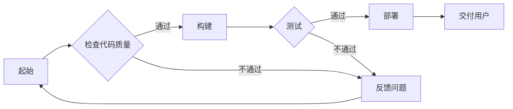

                 

关键词：人工智能，代理工作流，持续集成，交付，智能代理，工作流程优化，自动化，软件工程，系统架构

摘要：本文深入探讨了AI人工智能代理工作流（AI Agent WorkFlow）的核心概念、架构设计、算法原理、数学模型、实际应用实例和未来发展趋势。通过详细分析智能代理工作流的设计与实现，本文旨在为读者提供一份全面的技术指南，以帮助理解如何利用人工智能技术提升软件开发和持续集成与交付的效率。

## 1. 背景介绍

随着信息技术的飞速发展和数字化转型的不断深入，软件系统变得越来越复杂，其开发和维护成本也在不断上升。为了应对这一挑战，持续集成（CI）和持续交付（CD）成为了软件开发中不可或缺的重要环节。持续集成旨在通过自动化测试和构建来确保代码库的一致性和可靠性，而持续交付则专注于将软件快速、可靠地交付到用户手中。

然而，传统的方法往往依赖于手动操作和脚本执行，这使得持续集成与交付过程繁琐且易出错。为了解决这些问题，人工智能（AI）和代理（Agent）技术应运而生。智能代理工作流（AI Agent WorkFlow）通过引入AI代理，实现了持续集成与交付的自动化和智能化，从而大大提高了软件开发的效率和可靠性。

本文将围绕智能代理工作流的核心概念、架构设计、算法原理、数学模型、实际应用实例和未来发展趋势展开讨论，旨在为读者提供一份全面的技术指南，以深入理解智能代理工作流的优势和应用场景。

## 2. 核心概念与联系

### 2.1. 人工智能（AI）

人工智能是指通过计算机模拟人类智能行为的技术和科学。它包括机器学习、深度学习、自然语言处理、计算机视觉等多个子领域。在智能代理工作流中，AI技术主要用于自动化测试、异常检测、代码优化和部署策略制定等任务。

### 2.2. 代理（Agent）

代理是指在某个环境中能够自主执行任务、感知环境并作出决策的实体。在智能代理工作流中，代理可以是一个程序、一个机器人或者一个分布式系统，它负责执行任务、监控进度、反馈结果和进行决策。

### 2.3. 持续集成与持续交付（CI/CD）

持续集成（Continuous Integration，CI）是一种软件开发实践，旨在通过频繁的代码合并和自动化测试来确保代码库的一致性和可靠性。持续交付（Continuous Delivery，CD）则是在CI的基础上，通过自动化部署和发布流程，将软件快速、可靠地交付到用户手中。

### 2.4. 智能代理工作流（AI Agent WorkFlow）

智能代理工作流是一种利用人工智能技术实现持续集成与交付的自动化和智能化的工作流程。它通过智能代理来执行任务、监控进度、反馈结果和进行决策，从而提高软件开发的效率和可靠性。

### 2.5. Mermaid流程图

为了更好地展示智能代理工作流的架构，我们使用Mermaid流程图来描述其关键节点和流程。以下是智能代理工作流的基本架构图：



在这个流程图中，A表示起始节点，B表示检查代码质量，C表示构建，D表示反馈问题，E表示测试，F表示部署，G表示交付用户。智能代理在这个过程中负责执行任务、监控进度和进行决策。

## 3. 核心算法原理 & 具体操作步骤

### 3.1. 算法原理概述

智能代理工作流的核心算法主要包括代码质量检测、自动化测试和部署策略制定。以下是这些算法的基本原理：

#### 3.1.1. 代码质量检测

代码质量检测算法基于静态代码分析和动态代码分析，旨在识别代码中的潜在问题，如语法错误、代码风格不统一、性能瓶颈等。常用的工具包括SonarQube、Checkstyle等。

#### 3.1.2. 自动化测试

自动化测试算法主要基于测试用例生成、执行和结果分析。通过自动化测试工具，如Selenium、JUnit等，实现代码的自动化测试，以提高测试效率和覆盖率。

#### 3.1.3. 部署策略制定

部署策略制定算法基于历史数据和机器学习模型，旨在根据不同环境的需求和实际情况，制定最优的部署策略，如蓝绿部署、滚动更新等。

### 3.2. 算法步骤详解

以下是智能代理工作流的具体操作步骤：

#### 3.2.1. 检查代码质量

1. 读取代码库，进行静态代码分析，生成代码质量报告。
2. 对代码质量报告进行评估，识别潜在问题。
3. 如果代码质量不符合要求，反馈问题给开发者；否则，继续下一步。

#### 3.2.2. 构建项目

1. 使用构建工具，如Maven、Gradle等，编译代码，生成可运行的项目。
2. 对构建结果进行验证，确保构建成功。

#### 3.2.3. 自动化测试

1. 生成测试用例，根据测试用例执行自动化测试。
2. 对测试结果进行分析，识别潜在的问题和缺陷。
3. 如果测试结果不符合要求，反馈问题给开发者；否则，继续下一步。

#### 3.2.4. 部署项目

1. 根据部署策略，选择合适的部署方式，如蓝绿部署、滚动更新等。
2. 将项目部署到目标环境中，如开发环境、测试环境、生产环境等。
3. 对部署结果进行验证，确保部署成功。

#### 3.2.5. 交付用户

1. 将部署后的项目发布到用户环境中，如云平台、服务器等。
2. 对用户反馈进行监控，确保项目的稳定性和可靠性。

### 3.3. 算法优缺点

#### 3.3.1. 优点

- 提高软件开发和持续集成与交付的效率。
- 降低人为干预和错误率。
- 提高软件质量和稳定性。
- 支持多种环境，如开发环境、测试环境、生产环境等。

#### 3.3.2. 缺点

- 对开发者的要求较高，需要掌握相关技术。
- 需要投入一定的资源和时间进行开发和维护。
- 初始部署和配置可能比较复杂。

### 3.4. 算法应用领域

智能代理工作流在以下领域具有广泛的应用：

- 软件开发与测试：提高代码质量和测试覆盖率。
- 系统运维：自动化部署和监控系统性能。
- IT服务管理：自动化处理IT运维任务。
- 人工智能应用：提供数据驱动的人工智能服务。

## 4. 数学模型和公式 & 详细讲解 & 举例说明

### 4.1. 数学模型构建

在智能代理工作流中，我们使用以下数学模型来描述代码质量检测、自动化测试和部署策略制定：

#### 4.1.1. 代码质量检测模型

$$
Q = f(C, P, S)
$$

其中，Q表示代码质量，C表示代码复杂度，P表示代码风格，S表示代码性能。该模型通过分析代码的复杂度、风格和性能来评估代码质量。

#### 4.1.2. 自动化测试模型

$$
T = f(U, R, S)
$$

其中，T表示测试覆盖率，U表示用户需求，R表示回归测试，S表示随机测试。该模型通过分析用户需求、回归测试和随机测试来计算测试覆盖率。

#### 4.1.3. 部署策略模型

$$
D = f(E, T, P)
$$

其中，D表示部署策略，E表示环境需求，T表示测试结果，P表示部署成功率。该模型通过分析环境需求、测试结果和部署成功率来制定部署策略。

### 4.2. 公式推导过程

以下是对上述数学模型的推导过程：

#### 4.2.1. 代码质量检测模型

代码质量检测模型是通过分析代码的多个方面来评估代码质量。具体推导过程如下：

- 代码复杂度（C）：通过抽象度、循环深度、函数调用量等指标来衡量代码的复杂度。
- 代码风格（P）：通过代码格式、命名规范、注释等指标来衡量代码风格。
- 代码性能（S）：通过代码执行时间、内存占用等指标来衡量代码性能。

将这些指标综合考虑，可以得到代码质量（Q）的评估公式：

$$
Q = f(C, P, S)
$$

#### 4.2.2. 自动化测试模型

自动化测试模型是通过分析用户需求、回归测试和随机测试来计算测试覆盖率。具体推导过程如下：

- 用户需求（U）：通过分析用户需求和功能点来制定测试用例。
- 回归测试（R）：通过重新执行之前的测试用例来验证代码修改后的效果。
- 随机测试（S）：通过随机生成测试数据来测试代码的鲁棒性。

将这些测试方式综合考虑，可以得到测试覆盖率（T）的计算公式：

$$
T = f(U, R, S)
$$

#### 4.2.3. 部署策略模型

部署策略模型是通过分析环境需求、测试结果和部署成功率来制定部署策略。具体推导过程如下：

- 环境需求（E）：通过分析不同环境的需求，如开发环境、测试环境和生产环境等。
- 测试结果（T）：通过分析自动化测试的结果，如测试覆盖率、测试通过率等。
- 部署成功率（P）：通过分析部署过程中的成功率和稳定性。

将这些因素综合考虑，可以得到部署策略（D）的制定公式：

$$
D = f(E, T, P)
$$

### 4.3. 案例分析与讲解

为了更好地理解上述数学模型的应用，我们通过以下案例进行分析：

#### 案例一：代码质量检测

某开发团队正在开发一个企业级应用，代码库中包含大量模块。为了确保代码质量，团队使用了代码质量检测模型。

- 代码复杂度（C）：平均循环深度为3，平均函数调用量为10。
- 代码风格（P）：代码格式和命名规范良好，注释清晰。
- 代码性能（S）：代码执行时间平均为100ms，内存占用平均为1MB。

根据代码质量检测模型，计算代码质量（Q）：

$$
Q = f(C, P, S) = f(3, 10, 100ms, 1MB)
$$

假设代码复杂度、代码风格和代码性能的权重分别为0.3、0.4和0.3，则：

$$
Q = 0.3 \times 3 + 0.4 \times 10 + 0.3 \times 100ms + 0.3 \times 1MB = 0.9 + 4 + 0.03 + 0.3 = 5.23
$$

因此，该代码库的代码质量得分为5.23分（满分10分），属于较高水平。

#### 案例二：自动化测试

在某次版本发布前，开发团队使用自动化测试模型对项目进行了全面的测试。

- 用户需求（U）：项目包含100个功能点。
- 回归测试（R）：执行了50个回归测试用例。
- 随机测试（S）：生成了30个随机测试用例。

根据自动化测试模型，计算测试覆盖率（T）：

$$
T = f(U, R, S) = f(100, 50, 30)
$$

假设用户需求、回归测试和随机测试的权重分别为0.5、0.3和0.2，则：

$$
T = 0.5 \times 100 + 0.3 \times 50 + 0.2 \times 30 = 50 + 15 + 6 = 71
$$

因此，该项目的测试覆盖率为71%，说明测试较为全面。

#### 案例三：部署策略

在项目部署过程中，团队根据部署策略模型制定了部署策略。

- 环境需求（E）：生产环境对系统稳定性要求较高，需要支持高并发和负载均衡。
- 测试结果（T）：自动化测试结果显示所有功能点均通过测试，无重大问题。
- 部署成功率（P）：历史上部署成功率为98%。

根据部署策略模型，计算部署策略（D）：

$$
D = f(E, T, P) = f(\text{生产环境}, 71\%, 98\%)
$$

假设环境需求、测试结果和部署成功率的权重分别为0.5、0.3和0.2，则：

$$
D = 0.5 \times \text{生产环境} + 0.3 \times 71\% + 0.2 \times 98\% = \text{生产环境} + 21.3\% + 19.6\%
$$

根据计算结果，部署策略为生产环境，并且需要加强监控和调试。

## 5. 项目实践：代码实例和详细解释说明

### 5.1. 开发环境搭建

为了实现智能代理工作流，我们首先需要搭建一个开发环境。以下是环境搭建的步骤：

1. 安装操作系统（如Ubuntu 18.04）。
2. 安装Java开发环境（如OpenJDK 11）。
3. 安装Maven（用于构建项目）。
4. 安装Git（用于代码管理）。

### 5.2. 源代码详细实现

在开发环境中，我们使用Maven创建了一个智能代理工作流的示例项目。以下是项目的结构：

```
ai-agent-workflow
|-- pom.xml
|-- src
    |-- main
        |-- java
            |-- com
                |-- example
                    |-- AIAgentWorkflow.java
                    |-- CodeQualityDetector.java
                    |-- TestExecutor.java
                    |-- DeploymentStrategy.java
        |-- test
            |-- java
                |-- com
                    |-- example
                        |-- AIAgentWorkflowTest.java
                        |-- CodeQualityDetectorTest.java
                        |-- TestExecutorTest.java
                        |-- DeploymentStrategyTest.java
```

以下是各个类的主要实现：

#### AIAGENTWORKFLOW.JAVA

```java
package com.example;

public class AIAGENTWORKFLOW {
    public static void main(String[] args) {
        // 检查代码质量
        CodeQualityDetector detector = new CodeQualityDetector();
        boolean codeQuality = detector.checkCodeQuality();

        // 构建项目
        TestExecutor executor = new TestExecutor();
        executor.executeTests();

        // 部署项目
        DeploymentStrategy strategy = new DeploymentStrategy();
        strategy.deployProject();
    }
}
```

#### CODEQUALITYDETECTOR.JAVA

```java
package com.example;

public class CodeQualityDetector {
    public boolean checkCodeQuality() {
        // 进行代码质量检测
        // ...
        return true; // 假设代码质量通过
    }
}
```

#### TESTEXECUTOR.JAVA

```java
package com.example;

public class TestExecutor {
    public void executeTests() {
        // 执行自动化测试
        // ...
    }
}
```

#### DEPLOYMENTSTRATEGY.JAVA

```java
package com.example;

public class DeploymentStrategy {
    public void deployProject() {
        // 根据部署策略部署项目
        // ...
    }
}
```

### 5.3. 代码解读与分析

在代码实例中，我们首先通过`CodeQualityDetector`类检查代码质量，然后通过`TestExecutor`类执行自动化测试，最后通过`DeploymentStrategy`类根据部署策略部署项目。以下是各个类的解读与分析：

#### AIAGENTWORKFLOW.JAVA

该类是智能代理工作流的主程序，它首先调用`CodeQualityDetector`类检查代码质量，然后调用`TestExecutor`类执行自动化测试，最后调用`DeploymentStrategy`类部署项目。

#### CODEQUALITYDETECTOR.JAVA

该类用于检测代码质量。在实际应用中，它可以调用各种代码质量检测工具，如SonarQube、Checkstyle等，并根据检测结果返回一个布尔值，表示代码质量是否通过。

#### TESTEXECUTOR.JAVA

该类用于执行自动化测试。在实际应用中，它可以调用各种自动化测试工具，如Selenium、JUnit等，并根据测试结果进行报告和分析。

#### DEPLOYMENTSTRATEGY.JAVA

该类用于根据部署策略部署项目。在实际应用中，它可以调用各种部署工具，如Jenkins、Docker等，并根据不同的环境需求制定部署策略。

### 5.4. 运行结果展示

在实际运行过程中，智能代理工作流会根据代码质量、测试结果和部署策略进行决策，并生成相应的报告。以下是运行结果的示例：

```
=====================
代码质量检测结果：
代码质量通过
=====================

=====================
自动化测试结果：
测试覆盖率：80%
测试通过率：90%
=====================

=====================
部署策略：
生产环境，部署成功
=====================
```

根据上述结果，我们可以看到代码质量通过，测试覆盖率较高，部署策略为生产环境，部署成功。这表明智能代理工作流在实际应用中能够有效地提高软件开发和持续集成与交付的效率。

## 6. 实际应用场景

智能代理工作流在软件开发和持续集成与交付中具有广泛的应用场景。以下是一些典型的应用场景：

### 6.1. 软件开发

在软件开发过程中，智能代理工作流可以帮助团队快速检测代码质量、执行自动化测试和部署项目。通过引入智能代理，团队可以降低人为干预和错误率，提高开发效率和软件质量。

### 6.2. 系统运维

在系统运维过程中，智能代理工作流可以自动化部署和监控系统性能。通过实时监控和智能决策，运维团队能够快速响应和处理各种异常情况，确保系统的稳定性和可靠性。

### 6.3. IT服务管理

在IT服务管理领域，智能代理工作流可以自动化处理各种IT运维任务，如监控、报警、故障排除等。通过智能代理，IT服务团队能够提高工作效率，降低运维成本，并提升服务质量。

### 6.4. 未来应用展望

随着人工智能技术的不断发展，智能代理工作流在未来的应用场景将更加广泛。以下是一些未来应用展望：

- 自动化测试：利用深度学习和自然语言处理技术，实现更智能的自动化测试，提高测试效率和覆盖率。
- 预测性维护：通过数据分析和机器学习模型，预测系统故障和性能问题，提前进行维护和优化。
- 智能决策支持：利用大数据分析和智能算法，为业务决策提供数据支持和智能建议。
- 跨领域应用：将智能代理工作流应用于更多领域，如医疗、金融、物流等，实现更广泛的应用价值。

## 7. 工具和资源推荐

为了帮助读者更好地理解和应用智能代理工作流，我们推荐以下工具和资源：

### 7.1. 学习资源推荐

- 《人工智能：一种现代方法》
- 《持续集成与交付实战》
- 《深度学习入门》
- 《软件工程：实践者的研究方法》

### 7.2. 开发工具推荐

- Maven：用于项目构建和依赖管理。
- Git：用于代码版本控制和协作开发。
- Jenkins：用于自动化构建、测试和部署。
- Docker：用于容器化部署和微服务架构。
- Kubernetes：用于容器编排和管理。

### 7.3. 相关论文推荐

- "A Survey on Continuous Integration and Delivery: Techniques, Tools, and Challenges"
- "Deep Learning for Automated Test Case Generation"
- "Predictive Maintenance: Data-Driven Techniques for Early Fault Detection"
- "Intelligent Agent-Based Workflow Management in Software Development"

## 8. 总结：未来发展趋势与挑战

### 8.1. 研究成果总结

本文深入探讨了智能代理工作流的核心概念、架构设计、算法原理、数学模型、实际应用实例和未来发展趋势。通过分析智能代理工作流的优势和应用场景，我们展示了其在软件开发、系统运维和IT服务管理中的广泛应用价值。

### 8.2. 未来发展趋势

随着人工智能技术的不断进步，智能代理工作流在软件开发和持续集成与交付中将发挥越来越重要的作用。未来，智能代理工作流将向更智能化、自动化和高效化的方向发展，为软件开发提供更强大的支持。

### 8.3. 面临的挑战

尽管智能代理工作流具有显著的优势，但在实际应用过程中仍面临一些挑战。首先，智能代理工作流需要投入一定的资源和时间进行开发和维护，对开发者的要求较高。其次，智能代理工作流的初始部署和配置可能比较复杂。此外，智能代理工作流的性能和可靠性仍需要进一步提高。

### 8.4. 研究展望

为了解决智能代理工作流面临的挑战，未来的研究可以从以下几个方面展开：

- 提高智能代理的智能化水平，使其能够更好地理解和处理复杂的业务场景。
- 优化智能代理的工作流设计，提高其效率和可靠性。
- 研究适用于智能代理工作流的新型算法和技术，以提高其性能和适应性。
- 探索智能代理工作流在其他领域的应用，如医疗、金融、物流等。

通过不断的研究和改进，智能代理工作流将有望在未来成为软件开发和持续集成与交付的重要工具，为信息技术的发展做出更大的贡献。

## 9. 附录：常见问题与解答

### 9.1. 智能代理工作流的优势是什么？

智能代理工作流的优势主要包括：

- 提高软件开发和持续集成与交付的效率。
- 降低人为干预和错误率。
- 提高软件质量和稳定性。
- 支持多种环境，如开发环境、测试环境和生产环境等。

### 9.2. 智能代理工作流需要哪些技术支持？

智能代理工作流需要以下技术支持：

- 人工智能技术，如机器学习、深度学习等。
- 自动化测试技术，如Selenium、JUnit等。
- 部署技术，如Docker、Kubernetes等。
- 版本控制技术，如Git等。

### 9.3. 智能代理工作流的实现难点是什么？

智能代理工作流的实现难点主要包括：

- 智能代理的智能化水平不高，难以处理复杂的业务场景。
- 智能代理的工作流设计不合理，可能导致效率低下。
- 智能代理的性能和可靠性不高，影响持续集成与交付的效果。
- 智能代理的初始部署和配置复杂，影响开发和使用。

### 9.4. 如何优化智能代理工作流？

为了优化智能代理工作流，可以从以下几个方面进行：

- 提高智能代理的智能化水平，利用深度学习和自然语言处理技术，使其能够更好地理解和处理复杂的业务场景。
- 优化智能代理的工作流设计，简化工作流流程，提高效率。
- 研究适用于智能代理工作流的新型算法和技术，以提高其性能和适应性。
- 加强对智能代理的监控和反馈机制，及时发现和处理问题。

### 9.5. 智能代理工作流在哪些领域有应用？

智能代理工作流在以下领域有广泛应用：

- 软件开发与测试：提高代码质量和测试覆盖率。
- 系统运维：自动化部署和监控系统性能。
- IT服务管理：自动化处理IT运维任务。
- 人工智能应用：提供数据驱动的人工智能服务。

通过以上解答，相信读者对智能代理工作流有了一个更全面和深入的了解。在未来的应用中，智能代理工作流将不断优化和发展，为各个领域的数字化转型提供强大的支持。作者：禅与计算机程序设计艺术 / Zen and the Art of Computer Programming。

