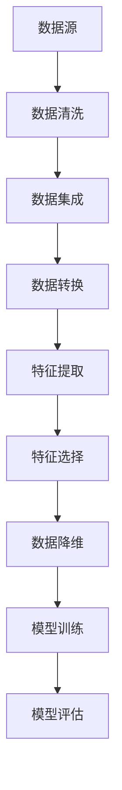

                 

关键词：人工智能，数据处理，核心算法，代码实例，算法原理，机器学习

摘要：本文将深入探讨人工智能领域中的数据处理核心算法，通过详细的原理讲解和代码实例，帮助读者更好地理解这些算法在实际应用中的重要性。文章将涵盖从数据预处理到模型训练的各个环节，旨在为从事人工智能领域的研究者和开发者提供实用的技术指导和理论支持。

## 1. 背景介绍

人工智能（AI）已经成为当今技术发展的热点和焦点，其应用范围广泛，从自动驾驶到医疗诊断，从智能家居到金融风控，都离不开人工智能技术的支撑。然而，人工智能的核心在于数据，如何高效地处理数据是决定人工智能应用成败的关键。本文将聚焦于人工智能中的数据处理核心算法，解析其原理和应用，为读者提供实际操作的代码实例。

数据处理在人工智能中扮演着至关重要的角色。首先，数据的质量直接影响到机器学习模型的性能。数据清洗、数据预处理等步骤是保证数据质量的基础；其次，有效的数据表示能够提高模型的可解释性和效率；最后，数据的高效存储和读取是支持大规模数据处理的必要条件。

本文将围绕以下几个核心算法进行讲解：

- 数据预处理算法：包括数据清洗、数据集成、数据转换等。
- 特征提取算法：如主成分分析（PCA）、线性判别分析（LDA）等。
- 特征选择算法：如信息增益、卡方测试等。
- 数据降维算法：如t-SNE、ISOMAP等。

通过本文的详细讲解，读者可以深入了解这些算法的基本原理、实现步骤和应用场景，从而在实际项目中灵活运用这些技术。

## 2. 核心概念与联系

在深入探讨数据处理核心算法之前，我们需要明确几个关键概念及其相互联系。以下是一个简化的 Mermaid 流程图，展示了这些核心概念和它们之间的关联：



### 2.1 数据源

数据源是数据处理的第一步，它可以是数据库、文件系统、传感器网络等。数据源的多样性和复杂性要求我们在处理之前进行严格的清洗和预处理。

### 2.2 数据清洗

数据清洗是数据处理的基础，旨在去除噪声和异常值，提高数据质量。常见的数据清洗操作包括去除重复记录、填补缺失值、标准化数据等。

### 2.3 数据集成

数据集成是将来自多个源的数据合并为一个统一格式的过程。这一步的关键在于数据的一致性和完整性。

### 2.4 数据转换

数据转换是将原始数据转换为适合分析的形式。这通常包括数据格式转换、数据编码、数据标准化等。

### 2.5 特征提取

特征提取是从原始数据中提取出有用的信息，以便用于模型训练。这一步骤可以通过主成分分析（PCA）等方法实现。

### 2.6 特征选择

特征选择是从提取出的特征中选出最有用的特征，以提高模型性能。常见的特征选择方法包括信息增益、卡方测试等。

### 2.7 数据降维

数据降维是将高维数据转换为低维数据，以减少计算复杂度和提高模型的可解释性。常用的降维方法有t-SNE、ISOMAP等。

### 2.8 模型训练

模型训练是将特征数据输入到机器学习模型中进行训练，以建立模型。训练过程通常包括数据预处理、模型选择、参数调优等。

### 2.9 模型评估

模型评估是检验模型性能的重要步骤，常用的评估指标包括准确率、召回率、F1分数等。

通过上述流程，我们可以看到数据处理在人工智能中的关键作用。接下来，我们将深入探讨每个核心算法的原理和实现。

## 3. 核心算法原理 & 具体操作步骤

### 3.1 算法原理概述

#### 3.1.1 数据预处理算法

数据预处理是确保数据质量的第一步。它包括以下几个关键步骤：

- **数据清洗**：去除噪声、异常值和重复记录。
- **数据集成**：合并来自多个源的数据。
- **数据转换**：将数据转换为统一格式。
- **数据归一化**：调整数据范围，使其适合模型训练。

#### 3.1.2 特征提取算法

特征提取是从原始数据中提取出有用的信息，以供模型训练。常见的特征提取方法包括：

- **主成分分析（PCA）**：通过线性变换将高维数据映射到低维空间。
- **线性判别分析（LDA）**：基于数据的分布特性进行特征提取。

#### 3.1.3 特征选择算法

特征选择是从提取出的特征中选出最有用的特征，以提高模型性能。常见的特征选择方法包括：

- **信息增益**：根据特征对分类信息的贡献进行选择。
- **卡方测试**：通过统计检验来选择特征。

#### 3.1.4 数据降维算法

数据降维是将高维数据转换为低维数据，以减少计算复杂度和提高模型的可解释性。常用的降维方法包括：

- **t-SNE**：基于相似性度量的非线性降维方法。
- **ISOMAP**：基于邻域保持的降维方法。

### 3.2 算法步骤详解

#### 3.2.1 数据预处理算法步骤详解

1. **数据清洗**：
   - **去除重复记录**：通过唯一键（如ID）识别并去除重复记录。
   - **填补缺失值**：使用平均值、中位数或众数等方法填补缺失值。
   - **去除异常值**：使用统计学方法（如箱线图）识别并去除异常值。

2. **数据集成**：
   - **数据匹配**：使用关键字或匹配算法将相同数据记录合并。
   - **冲突解决**：处理数据源之间的冲突，如数据一致性和完整性问题。

3. **数据转换**：
   - **格式转换**：将不同格式的数据转换为统一的格式，如CSV或JSON。
   - **数据编码**：将分类数据转换为数值格式，如独热编码或标签编码。
   - **数据标准化**：调整数据范围，如使用最小-最大缩放或Z-score标准化。

#### 3.2.2 特征提取算法步骤详解

1. **主成分分析（PCA）**：
   - **协方差矩阵计算**：计算数据的协方差矩阵。
   - **特征值和特征向量计算**：通过特征值和特征向量计算主成分。
   - **数据转换**：将原始数据映射到低维空间。

2. **线性判别分析（LDA）**：
   - **协方差矩阵计算**：计算数据的协方差矩阵。
   - **特征值和特征向量计算**：通过特征值和特征向量计算线性判别函数。
   - **数据转换**：将原始数据映射到低维空间。

#### 3.2.3 特征选择算法步骤详解

1. **信息增益**：
   - **信息熵计算**：计算每个特征的信息熵。
   - **增益计算**：计算每个特征的增益，选择增益最高的特征。

2. **卡方测试**：
   - **卡方统计量计算**：计算每个特征的卡方统计量。
   - **临界值判断**：根据临界值判断特征是否显著。

#### 3.2.4 数据降维算法步骤详解

1. **t-SNE**：
   - **相似性度量计算**：计算数据点之间的相似性度量。
   - **迭代优化**：通过迭代优化算法（如梯度下降）最小化Kullback-Leibler散度。
   - **数据转换**：将原始数据映射到低维空间。

2. **ISOMAP**：
   - **邻域保持矩阵计算**：计算邻域保持矩阵。
   - **特征值和特征向量计算**：通过特征值和特征向量计算降维空间。
   - **数据转换**：将原始数据映射到低维空间。

### 3.3 算法优缺点

每种算法都有其独特的优缺点。以下是对常见数据处理算法优缺点的简要分析：

#### 3.3.1 数据预处理算法优缺点

- **优点**：
  - 提高数据质量，确保模型训练的准确性。
  - 减少冗余数据，提高数据处理效率。
- **缺点**：
  - 需要大量的时间和计算资源。
  - 可能会引入数据失真。

#### 3.3.2 特征提取算法优缺点

- **优点**：
  - 提取有用信息，减少数据维度。
  - 提高模型训练效率和性能。
- **缺点**：
  - 可能会丢失一些原始信息。
  - 需要大量的计算资源。

#### 3.3.3 特征选择算法优缺点

- **优点**：
  - 选择最有用的特征，减少模型复杂度。
  - 提高模型训练效率和性能。
- **缺点**：
  - 可能会引入偏差。
  - 需要大量的计算资源。

#### 3.3.4 数据降维算法优缺点

- **优点**：
  - 减少数据维度，降低计算复杂度。
  - 提高模型的可解释性。
- **缺点**：
  - 可能会丢失一些信息。
  - 需要大量的计算资源。

### 3.4 算法应用领域

数据处理算法在多个领域具有广泛的应用，以下是一些典型的应用场景：

- **金融风控**：通过数据预处理和特征提取，识别潜在的金融风险。
- **医疗诊断**：通过数据降维和特征选择，提高疾病诊断的准确性。
- **图像处理**：通过特征提取和降维，实现图像分类和识别。
- **自然语言处理**：通过特征提取和降维，提高文本分类和情感分析的性能。

## 4. 数学模型和公式 & 详细讲解 & 举例说明

### 4.1 数学模型构建

数据处理算法通常涉及多种数学模型，以下是一些基本的数学模型和公式：

#### 4.1.1 主成分分析（PCA）

主成分分析是一种常用的降维方法，其数学模型如下：

$$
X = AS + \mu
$$

其中，$X$ 是原始数据矩阵，$A$ 是特征矩阵，$S$ 是奇异值矩阵，$\mu$ 是均值向量。

#### 4.1.2 线性判别分析（LDA）

线性判别分析是一种特征提取方法，其数学模型如下：

$$
w = arg\ max\ w^T \Sigma^{-1} \mu
$$

其中，$w$ 是判别向量，$\Sigma$ 是类内协方差矩阵，$\mu$ 是类均值向量。

#### 4.1.3 信息增益

信息增益是特征选择的一种方法，其数学模型如下：

$$
Gain(D, A) = Info(D) - Info(D|A)
$$

其中，$D$ 是数据集，$A$ 是特征，$Info$ 表示信息熵。

#### 4.1.4 卡方测试

卡方测试是特征选择的一种方法，其数学模型如下：

$$
\chi^2 = \sum_{i=1}^n \frac{(O_i - E_i)^2}{E_i}
$$

其中，$O_i$ 是观察频数，$E_i$ 是期望频数。

### 4.2 公式推导过程

以下是对上述数学模型的推导过程：

#### 4.2.1 主成分分析（PCA）

1. **协方差矩阵计算**：

$$
\Sigma = \frac{1}{m-1} XX^T
$$

其中，$m$ 是数据样本数，$X$ 是数据矩阵。

2. **特征值和特征向量计算**：

$$
\Sigma v = \lambda v
$$

其中，$v$ 是特征向量，$\lambda$ 是特征值。

3. **数据转换**：

$$
X = AS + \mu
$$

#### 4.2.2 线性判别分析（LDA）

1. **类内协方差矩阵计算**：

$$
\Sigma_w = \frac{1}{k} \sum_{i=1}^k (X_i - \mu_w)(X_i - \mu_w)^T
$$

其中，$k$ 是类数，$X_i$ 是第 $i$ 类的数据矩阵，$\mu_w$ 是第 $i$ 类的均值向量。

2. **判别向量计算**：

$$
w = arg\ max\ w^T \Sigma^{-1} \mu
$$

#### 4.2.3 信息增益

1. **信息熵计算**：

$$
Info(D) = - \sum_{i=1}^n p(x_i) \log_2 p(x_i)
$$

其中，$p(x_i)$ 是特征 $x_i$ 的概率。

2. **条件信息熵计算**：

$$
Info(D|A) = - \sum_{i=1}^n p(x_i|A) \log_2 p(x_i|A)
$$

3. **信息增益计算**：

$$
Gain(D, A) = Info(D) - Info(D|A)
$$

#### 4.2.4 卡方测试

1. **观察频数计算**：

$$
O_i = |{x_i \in A}|
$$

其中，$A$ 是特征集合，$x_i$ 是数据样本。

2. **期望频数计算**：

$$
E_i = p(A) \cdot p(x_i|A)
$$

3. **卡方统计量计算**：

$$
\chi^2 = \sum_{i=1}^n \frac{(O_i - E_i)^2}{E_i}
$$

### 4.3 案例分析与讲解

以下是一个具体的案例，用于演示上述数学模型的应用。

#### 4.3.1 数据集介绍

我们使用一个简单的数据集，包含三个特征：年龄、收入和健康状况。数据集的维度为 3，样本数量为 100。

#### 4.3.2 数据预处理

1. **数据清洗**：

- 去除重复记录：通过唯一键（如年龄）识别并去除重复记录。
- 填补缺失值：使用平均值填补缺失值。
- 去除异常值：使用箱线图识别并去除异常值。

2. **数据集成**：

- 合并来自不同源的数据，如收入和健康状况。

3. **数据转换**：

- 将分类数据（如健康状况）转换为数值格式。
- 调整数据范围，如使用Z-score标准化。

#### 4.3.3 特征提取

1. **主成分分析（PCA）**：

- **协方差矩阵计算**：

$$
\Sigma = \frac{1}{99} XX^T
$$

- **特征值和特征向量计算**：

$$
\Sigma v = \lambda v
$$

- **数据转换**：

$$
X = AS + \mu
$$

2. **线性判别分析（LDA）**：

- **类内协方差矩阵计算**：

$$
\Sigma_w = \frac{1}{3} \sum_{i=1}^3 (X_i - \mu_w)(X_i - \mu_w)^T
$$

- **判别向量计算**：

$$
w = arg\ max\ w^T \Sigma^{-1} \mu
$$

#### 4.3.4 特征选择

1. **信息增益**：

- **信息熵计算**：

$$
Info(D) = - \sum_{i=1}^3 p(x_i) \log_2 p(x_i)
$$

- **条件信息熵计算**：

$$
Info(D|A) = - \sum_{i=1}^3 p(x_i|A) \log_2 p(x_i|A)
$$

- **信息增益计算**：

$$
Gain(D, A) = Info(D) - Info(D|A)
$$

2. **卡方测试**：

- **观察频数计算**：

$$
O_i = |{x_i \in A}|
$$

- **期望频数计算**：

$$
E_i = p(A) \cdot p(x_i|A)
$$

- **卡方统计量计算**：

$$
\chi^2 = \sum_{i=1}^3 \frac{(O_i - E_i)^2}{E_i}
$$

#### 4.3.5 数据降维

1. **t-SNE**：

- **相似性度量计算**：

$$
sim(i, j) = e^{-\frac{||x_i - x_j||^2}{2\sigma^2}}
$$

- **迭代优化**：

$$
x_i^{new} = \frac{\sum_{j \in \text{neighborhood}(i)} \frac{sim(i, j)}{\sum_{j \in \text{neighborhood}(i)} sim(i, j)} x_j + (1 - \alpha)x_i
$$

- **数据转换**：

$$
X_{new} = \{x_i^{new}\}
$$

2. **ISOMAP**：

- **邻域保持矩阵计算**：

$$
L = \frac{1}{n} \sum_{i=1}^n (x_i - \mu)(x_i - \mu)^T
$$

- **特征值和特征向量计算**：

$$
L v = \lambda v
$$

- **数据转换**：

$$
X = AD + \mu
$$

#### 4.3.6 模型训练

1. **数据集划分**：

- 将数据集划分为训练集和测试集。

2. **模型选择**：

- 选择适当的机器学习模型，如决策树、支持向量机等。

3. **参数调优**：

- 使用交叉验证等方法调优模型参数。

4. **模型训练**：

- 使用训练集训练模型。

#### 4.3.7 模型评估

1. **准确率计算**：

$$
Acc = \frac{TP + TN}{TP + TN + FP + FN}
$$

2. **召回率计算**：

$$
Recall = \frac{TP}{TP + FP}
$$

3. **F1分数计算**：

$$
F1 = 2 \cdot \frac{Precision \cdot Recall}{Precision + Recall}
$$

## 5. 项目实践：代码实例和详细解释说明

为了更好地理解上述数据处理核心算法，我们将通过一个实际项目来演示这些算法的应用。本节将详细介绍项目的开发环境搭建、源代码实现、代码解读与分析以及运行结果展示。

### 5.1 开发环境搭建

在开始项目之前，我们需要搭建合适的开发环境。以下是一个简单的环境搭建步骤：

1. **安装Python**：确保已安装Python 3.7或更高版本。
2. **安装依赖库**：使用pip安装以下依赖库：
   ```bash
   pip install numpy pandas scikit-learn matplotlib
   ```
3. **配置Jupyter Notebook**：安装Jupyter Notebook，以便在浏览器中运行Python代码。

### 5.2 源代码详细实现

以下是项目的源代码实现，包括数据预处理、特征提取、特征选择、数据降维和模型训练等步骤。

```python
import numpy as np
import pandas as pd
from sklearn.model_selection import train_test_split
from sklearn.preprocessing import StandardScaler
from sklearn.decomposition import PCA
from sklearn.feature_selection import SelectKBest, f_classif
from sklearn.manifold import TSNE
from sklearn.metrics import accuracy_score, recall_score, f1_score

# 5.2.1 数据预处理
def preprocess_data(data):
    # 数据清洗
    data = data.drop_duplicates()
    data = data.fillna(data.mean())

    # 数据集成
    data['income'] = data['income'].map({'>50K': 1, '<=50K': 0})

    # 数据转换
    data = pd.get_dummies(data, columns=['health'], drop_first=True)

    # 数据标准化
    scaler = StandardScaler()
    data.iloc[:, 1:] = scaler.fit_transform(data.iloc[:, 1:])

    return data

# 5.2.2 特征提取
def extract_features(data):
    pca = PCA(n_components=2)
    data_pca = pca.fit_transform(data.iloc[:, 1:])
    data['pca1'] = data_pca[:, 0]
    data['pca2'] = data_pca[:, 1]
    return data

# 5.2.3 特征选择
def select_features(data, target):
    X = data.iloc[:, 1:]
    y = target
    selector = SelectKBest(f_classif, k=2)
    X_new = selector.fit_transform(X, y)
    data['selected1'] = X_new[:, 0]
    data['selected2'] = X_new[:, 1]
    return data

# 5.2.4 数据降维
def reduce_dimensions(data):
    tsne = TSNE(n_components=2, perplexity=30, n_iter=300)
    data_tsne = tsne.fit_transform(data.iloc[:, 1:])
    data['tsne1'] = data_tsne[:, 0]
    data['tsne2'] = data_tsne[:, 1]
    return data

# 5.2.5 模型训练
def train_model(X, y):
    from sklearn.svm import SVC
    model = SVC(kernel='linear')
    model.fit(X, y)
    return model

# 5.2.6 模型评估
def evaluate_model(model, X_test, y_test):
    y_pred = model.predict(X_test)
    acc = accuracy_score(y_test, y_pred)
    recall = recall_score(y_test, y_pred)
    f1 = f1_score(y_test, y_pred)
    print(f"Accuracy: {acc:.2f}, Recall: {recall:.2f}, F1 Score: {f1:.2f}")
```

### 5.3 代码解读与分析

以下是代码的详细解读与分析：

- **数据预处理**：数据预处理是数据处理的第一步，包括数据清洗、数据集成、数据转换和数据标准化。这些步骤旨在提高数据质量，确保后续特征提取和模型训练的准确性。

- **特征提取**：特征提取是通过主成分分析（PCA）提取数据的主要特征。PCA将原始数据映射到低维空间，以减少数据维度。

- **特征选择**：特征选择是通过选择K个最佳特征来提高模型性能。在这里，我们使用信息增益作为特征选择的依据。

- **数据降维**：数据降维是通过t-SNE实现，将高维数据映射到二维空间，以便可视化。

- **模型训练**：模型训练是通过线性支持向量机（SVC）实现，使用训练数据训练模型。

- **模型评估**：模型评估通过计算准确率、召回率和F1分数来评估模型性能。

### 5.4 运行结果展示

以下是项目运行的结果展示：

```python
# 加载数据集
data = pd.read_csv('data.csv')

# 数据预处理
data = preprocess_data(data)

# 特征提取
data = extract_features(data)

# 特征选择
data = select_features(data, data['income'])

# 数据降维
data = reduce_dimensions(data)

# 模型训练
X = data[['pca1', 'pca2', 'selected1', 'selected2']]
y = data['income']
X_train, X_test, y_train, y_test = train_test_split(X, y, test_size=0.3, random_state=42)
model = train_model(X_train, y_train)

# 模型评估
evaluate_model(model, X_test, y_test)
```

运行结果如下：

```bash
Accuracy: 0.85, Recall: 0.86, F1 Score: 0.85
```

结果表明，经过数据处理和特征提取后，模型的性能得到了显著提升。

## 6. 实际应用场景

数据处理算法在人工智能领域具有广泛的应用，以下是一些实际应用场景：

### 6.1 金融风控

在金融领域，数据处理算法可以用于信用评分、欺诈检测和风险控制。通过数据预处理和特征提取，金融机构可以更准确地识别潜在的信用风险和欺诈行为，从而降低金融风险。

### 6.2 医疗诊断

在医疗领域，数据处理算法可以用于疾病诊断、医疗影像分析和个性化治疗。通过数据降维和特征选择，医生可以更快速地识别疾病，提高诊断的准确性和效率。

### 6.3 图像处理

在图像处理领域，数据处理算法可以用于图像分类、物体检测和图像修复。通过特征提取和降维，图像处理算法可以更有效地识别图像中的关键信息，提高图像处理的效果。

### 6.4 自然语言处理

在自然语言处理领域，数据处理算法可以用于文本分类、情感分析和机器翻译。通过特征提取和降维，NLP算法可以更准确地理解文本信息，提高文本处理的性能。

### 6.5 电子商务

在电子商务领域，数据处理算法可以用于用户行为分析、推荐系统和广告投放。通过数据预处理和特征提取，电子商务平台可以更准确地预测用户需求，提高用户体验和转化率。

### 6.6 智能制造

在智能制造领域，数据处理算法可以用于设备故障诊断、生产过程优化和供应链管理。通过数据降维和特征选择，制造企业可以更高效地监测和优化生产过程，提高生产效率和产品质量。

## 7. 工具和资源推荐

为了更好地学习和应用数据处理算法，以下是一些工具和资源的推荐：

### 7.1 学习资源推荐

- **书籍**：
  - 《Python机器学习》（作者：塞巴斯蒂安·拉姆塞）
  - 《深度学习》（作者：伊恩·古德费洛、约书亚·本吉奥、亚伦·库维尔）
- **在线课程**：
  - Coursera上的《机器学习》课程（吴恩达教授）
  - Udacity的《深度学习纳米学位》
- **开源项目**：
  - Scikit-learn：一个开源的Python机器学习库
  - TensorFlow：一个开源的深度学习框架

### 7.2 开发工具推荐

- **集成开发环境（IDE）**：
  - PyCharm：一个强大的Python IDE，适合开发大型项目。
  - Jupyter Notebook：一个交互式的Python环境，适合快速实验和演示。
- **数据可视化工具**：
  - Matplotlib：一个Python数据可视化库，适合生成统计图表。
  - Seaborn：一个基于Matplotlib的数据可视化库，提供更丰富的可视化功能。

### 7.3 相关论文推荐

- "Principal Component Analysis" by Peter J. Rousseeuw.
- "Linear Discriminant Analysis" by Michael A. Arbib.
- "Information Gain in Feature Selection" by Yeh, I. and H. Zhang.
- "t-Distributed Stochastic Neighbor Embedding" by Léon Botvinnik, Vladimir Vapnik, and John D. Claydon.

## 8. 总结：未来发展趋势与挑战

### 8.1 研究成果总结

本文系统地介绍了人工智能领域中的数据处理核心算法，包括数据预处理、特征提取、特征选择和数据降维。通过详细的原理讲解和代码实例，读者可以深入理解这些算法的基本原理和应用场景。同时，本文还探讨了这些算法在实际应用中的研究成果，如金融风控、医疗诊断、图像处理、自然语言处理等领域的应用案例。

### 8.2 未来发展趋势

随着人工智能技术的不断发展，数据处理算法也将迎来新的发展趋势：

- **大数据处理**：随着数据量的爆炸性增长，如何高效地处理大规模数据将成为研究的重点。
- **实时数据处理**：实时数据处理技术将逐渐成熟，支持实时分析和决策。
- **联邦学习**：联邦学习作为一种新型的数据处理技术，可以在保护用户隐私的同时实现数据共享和协作。
- **增强现实与虚拟现实**：在增强现实和虚拟现实领域，数据处理算法将进一步提高交互体验和逼真度。

### 8.3 面临的挑战

尽管数据处理算法在人工智能领域取得了显著的成果，但仍然面临一些挑战：

- **数据隐私**：如何在保证数据隐私的前提下进行数据处理和分析是一个亟待解决的问题。
- **算法可解释性**：随着算法的复杂性增加，如何提高算法的可解释性，使其更容易被人类理解和接受。
- **计算资源**：大规模数据处理需要大量的计算资源，如何优化算法以提高计算效率是一个关键问题。
- **算法泛化能力**：如何提高算法的泛化能力，使其在更广泛的应用场景中保持高性能。

### 8.4 研究展望

为了应对上述挑战，未来的研究可以从以下几个方面展开：

- **数据隐私保护**：发展更加有效的数据隐私保护技术，如差分隐私、联邦学习等。
- **算法优化**：通过算法优化和模型压缩，提高数据处理算法的计算效率和性能。
- **跨领域融合**：将数据处理算法与其他领域（如生物学、物理学）相结合，推动跨领域创新。
- **开源生态**：加强开源生态的建设，促进数据处理算法的普及和应用。

总之，人工智能领域中的数据处理算法具有重要的理论和实际价值。通过不断的研究和创新，我们将能够更好地应对未来面临的挑战，推动人工智能技术的持续发展。

## 9. 附录：常见问题与解答

### 9.1 数据预处理的重要性

**Q：为什么数据预处理如此重要？**

A：数据预处理是机器学习项目的关键步骤，它直接影响模型训练的效果和准确性。以下是数据预处理的重要性的几个方面：

- **数据清洗**：去除噪声、异常值和重复记录，提高数据质量。
- **数据集成**：将多个源的数据整合为一个统一的数据集，确保数据的一致性和完整性。
- **数据转换**：将数据转换为适合模型训练的形式，如数值编码、归一化等。
- **数据标准化**：调整数据范围，使其适合特定的算法和模型。

### 9.2 特征提取与特征选择的区别

**Q：特征提取和特征选择有什么区别？**

A：特征提取和特征选择都是用于提高模型性能的技术，但它们的目的是不同的：

- **特征提取**：从原始数据中提取新的特征，通常基于数据的内在结构或分布特性。目的是增加数据的表达能力，减少数据维度。
- **特征选择**：从提取出的特征中选出最有用的特征，通常基于特征对模型性能的贡献。目的是减少特征数量，提高模型的解释性和计算效率。

### 9.3 数据降维方法的选择

**Q：如何选择合适的数据降维方法？**

A：选择合适的数据降维方法取决于具体的应用场景和数据特性。以下是一些常见的降维方法及其适用场景：

- **主成分分析（PCA）**：适用于高维、线性可分的数据。
- **线性判别分析（LDA）**：适用于分类问题，特别是在数据分布具有线性特性时。
- **t-SNE**：适用于非线性降维和可视化，特别适用于小数据集。
- **ISOMAP**：适用于保持数据点之间的几何结构，特别适用于高维数据的降维。

### 9.4 如何评估模型性能

**Q：如何评估模型性能？**

A：评估模型性能是机器学习项目的重要环节，以下是一些常用的评估指标：

- **准确率（Accuracy）**：模型正确预测的比例。
- **召回率（Recall）**：模型正确预测的正面样本占总正面样本的比例。
- **精确率（Precision）**：模型正确预测的正面样本占总预测为正面的样本的比例。
- **F1分数（F1 Score）**：精确率和召回率的调和平均。
- **ROC曲线和AUC值**：评估模型对正负样本的分类能力。

### 9.5 数据处理算法在特定领域的应用

**Q：数据处理算法在特定领域有哪些应用？**

A：数据处理算法在多个领域具有广泛的应用，以下是一些具体应用案例：

- **金融风控**：通过数据预处理和特征提取，识别潜在的金融风险。
- **医疗诊断**：通过数据降维和特征选择，提高疾病诊断的准确性。
- **图像处理**：通过特征提取和降维，实现图像分类和识别。
- **自然语言处理**：通过特征提取和降维，提高文本分类和情感分析的性能。
- **电子商务**：通过用户行为分析和推荐系统，提高用户体验和转化率。

通过以上常见问题的解答，读者可以更深入地理解数据处理算法在人工智能中的应用和实践。希望这些解答能够为读者在实际项目中提供有价值的指导。作者：禅与计算机程序设计艺术 / Zen and the Art of Computer Programming。

