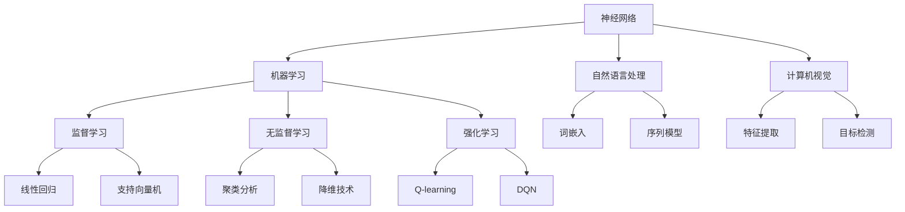

                 

关键词：人工智能，核心算法，原理，代码实例，领域无关性，深度学习，神经网络，机器学习，自然语言处理，计算机视觉。

> 摘要：本文深入探讨了人工智能领域中的核心算法原理，包括神经网络、机器学习、自然语言处理和计算机视觉。通过对这些算法的原理讲解和代码实例分析，本文旨在为读者提供一个全面、易懂的领域无关性人工智能技术指南。

## 1. 背景介绍

人工智能（AI）作为计算机科学的重要分支，近年来取得了飞速发展。从最初的专家系统，到基于数据驱动的方法，再到当前的深度学习，人工智能技术不断突破，广泛应用于各个领域，如医疗、金融、交通、教育等。人工智能的核心算法，如神经网络、机器学习、自然语言处理和计算机视觉，成为了研究和应用的热点。

### 1.1 神经网络的发展历程

神经网络起源于20世纪40年代，由心理学家McCulloch和数学家Pitts提出。然而，由于计算能力的限制，神经网络在20世纪80年代之前并未得到广泛应用。直到20世纪90年代，随着计算机性能的提升和算法的改进，神经网络才逐渐成为人工智能研究的主流。

### 1.2 机器学习的兴起

机器学习作为人工智能的重要分支，通过训练算法，让计算机从数据中自动学习和提取规律。从最早的线性回归、决策树，到支持向量机、集成学习，再到深度学习，机器学习算法不断进步，为人工智能的发展提供了强大的技术支持。

### 1.3 自然语言处理的挑战

自然语言处理（NLP）是人工智能领域的另一个重要方向。从早期的规则驱动方法，到统计模型，再到基于神经网络的深度学习方法，NLP在语义理解、机器翻译、情感分析等方面取得了显著成果。然而，如何更好地理解和生成自然语言，仍然是当前研究的热点和挑战。

### 1.4 计算机视觉的进展

计算机视觉是人工智能领域的另一重要分支，旨在使计算机能够像人类一样理解和处理视觉信息。从早期的特征提取、分类算法，到基于深度学习的目标检测、图像生成，计算机视觉技术在自动驾驶、安防监控、医疗诊断等领域展现出了巨大的应用潜力。

## 2. 核心概念与联系

为了更好地理解人工智能的核心算法，我们需要首先明确一些基本概念，并展示它们之间的关系。



### 2.1 神经网络

神经网络是模仿人脑神经元连接结构的一种计算模型。它由大量的节点（也称为神经元）组成，每个节点都可以接收输入信息，并通过权重进行传递，最后产生输出。神经网络通过调整权重，使得模型能够从数据中自动学习和提取规律。

### 2.2 机器学习

机器学习是一类通过数据训练算法，使得计算机能够从数据中自动学习和提取规律的方法。根据学习方式，机器学习可以分为监督学习、无监督学习和强化学习。

- **监督学习**：通过已知的输入和输出数据，训练模型来预测新的输入数据。常见的监督学习方法包括线性回归、决策树、支持向量机等。
- **无监督学习**：没有明确的输出数据，主要通过数据之间的结构关系进行学习。常见的方法包括聚类分析、降维技术等。
- **强化学习**：通过与环境的交互，学习最优策略。常见的方法包括Q-learning、DQN等。

### 2.3 自然语言处理

自然语言处理是使计算机能够理解、生成和处理自然语言的技术。它包括词嵌入、序列模型、语义理解等子领域。

- **词嵌入**：将自然语言中的词汇映射到高维空间中的向量表示，以便进行计算和处理。
- **序列模型**：用于处理序列数据的模型，如循环神经网络（RNN）、长短时记忆网络（LSTM）等。
- **语义理解**：通过理解自然语言中的语义信息，使得计算机能够更好地进行对话、问答等任务。

### 2.4 计算机视觉

计算机视觉是使计算机能够理解、处理视觉信息的技术。它包括特征提取、目标检测、图像生成等子领域。

- **特征提取**：从图像中提取具有区分度的特征，以便进行分类、识别等任务。
- **目标检测**：用于定位图像中的目标，并给出目标的类别和位置。
- **图像生成**：通过生成对抗网络（GAN）等模型，生成具有逼真效果的图像。

## 3. 核心算法原理 & 具体操作步骤

### 3.1 算法原理概述

在本节中，我们将详细探讨神经网络、机器学习、自然语言处理和计算机视觉的核心算法原理。

### 3.2 算法步骤详解

#### 3.2.1 神经网络

神经网络的构建通常包括以下步骤：

1. **初始化参数**：包括输入层、隐藏层和输出层的权重和偏置。
2. **前向传播**：将输入数据通过神经网络传递，计算输出结果。
3. **反向传播**：计算输出结果与实际结果的误差，并更新网络参数。
4. **优化目标**：通常使用梯度下降算法来优化目标函数。

#### 3.2.2 机器学习

机器学习的算法步骤通常包括：

1. **数据预处理**：对原始数据进行清洗、归一化等处理。
2. **特征提取**：从原始数据中提取具有区分度的特征。
3. **模型选择**：选择合适的机器学习算法，如线性回归、决策树、支持向量机等。
4. **模型训练**：使用训练数据训练模型，调整模型参数。
5. **模型评估**：使用验证数据评估模型性能。

#### 3.2.3 自然语言处理

自然语言处理的核心步骤包括：

1. **词嵌入**：将自然语言中的词汇映射到高维空间中的向量表示。
2. **序列建模**：使用循环神经网络（RNN）、长短时记忆网络（LSTM）等模型对序列数据进行建模。
3. **语义理解**：通过理解自然语言中的语义信息，进行对话、问答等任务。

#### 3.2.4 计算机视觉

计算机视觉的核心步骤包括：

1. **特征提取**：从图像中提取具有区分度的特征。
2. **目标检测**：使用卷积神经网络（CNN）等模型检测图像中的目标。
3. **图像生成**：通过生成对抗网络（GAN）等模型生成图像。

### 3.3 算法优缺点

每种算法都有其独特的优缺点。以下是几种常见算法的优缺点：

#### 神经网络

- **优点**：具有很强的自适应性和泛化能力，能够处理复杂的非线性问题。
- **缺点**：训练过程耗时较长，对计算资源要求较高。

#### 机器学习

- **优点**：算法较为成熟，能够处理多种类型的数据。
- **缺点**：对于大规模数据集和复杂问题，算法性能可能受到影响。

#### 自然语言处理

- **优点**：能够处理自然语言中的语义信息，进行智能对话、问答等任务。
- **缺点**：对于特定领域的语言，算法性能可能较差。

#### 计算机视觉

- **优点**：能够处理视觉信息，进行目标检测、图像生成等任务。
- **缺点**：对图像质量、光照等因素较为敏感。

### 3.4 算法应用领域

不同算法在不同领域有不同的应用：

- **神经网络**：广泛应用于图像识别、语音识别、自然语言处理等领域。
- **机器学习**：广泛应用于分类、预测、推荐等领域。
- **自然语言处理**：广泛应用于智能客服、机器翻译、情感分析等领域。
- **计算机视觉**：广泛应用于自动驾驶、安防监控、医疗诊断等领域。

## 4. 数学模型和公式 & 详细讲解 & 举例说明

在本节中，我们将详细讲解人工智能核心算法中的数学模型和公式，并通过具体例子进行说明。

### 4.1 数学模型构建

#### 4.1.1 神经网络

神经网络的数学模型可以表示为：

$$
Z = \sum_{i=1}^{n} w_i \cdot x_i + b
$$

其中，$Z$表示输出，$w_i$表示权重，$x_i$表示输入，$b$表示偏置。

#### 4.1.2 机器学习

机器学习的数学模型可以表示为：

$$
y = \sigma(\beta_0 + \beta_1 \cdot x)
$$

其中，$y$表示输出，$\sigma$表示激活函数，$\beta_0$和$\beta_1$表示模型参数。

#### 4.1.3 自然语言处理

自然语言处理的数学模型可以表示为：

$$
P(w_i|w_{i-1}, w_{i-2}, ..., w_1) = \frac{e^{\theta_i^T \cdot [w_{i-1}, w_{i-2}, ..., w_1]}}{\sum_{j=1}^{n} e^{\theta_j^T \cdot [w_{i-1}, w_{i-2}, ..., w_1]}}
$$

其中，$P(w_i|w_{i-1}, w_{i-2}, ..., w_1)$表示词$w_i$在给定前文$w_{i-1}, w_{i-2}, ..., w_1$的条件下的概率，$\theta_i$表示模型参数。

#### 4.1.4 计算机视觉

计算机视觉的数学模型可以表示为：

$$
P(class_i|x) = \frac{e^{\theta_i^T \cdot x}}{\sum_{j=1}^{n} e^{\theta_j^T \cdot x}}
$$

其中，$P(class_i|x)$表示在给定输入图像$x$的情况下，类别$i$的概率，$\theta_i$表示模型参数。

### 4.2 公式推导过程

在本节中，我们将对核心算法的公式进行推导。

#### 4.2.1 神经网络

假设我们已经有一个简单的神经网络，其中包含一个输入层、一个隐藏层和一个输出层。神经网络的输出可以表示为：

$$
Z = \sum_{i=1}^{n} w_i \cdot x_i + b
$$

其中，$Z$表示输出，$w_i$表示权重，$x_i$表示输入，$b$表示偏置。

为了求解权重和偏置，我们需要定义一个损失函数，通常使用均方误差（MSE）：

$$
Loss = \frac{1}{2} \sum_{i=1}^{n} (y_i - Z)^2
$$

其中，$y_i$表示实际输出，$Z$表示预测输出。

为了最小化损失函数，我们使用梯度下降算法。对权重和偏置求导，得到：

$$
\frac{\partial Loss}{\partial w_i} = (y_i - Z) \cdot x_i
$$

$$
\frac{\partial Loss}{\partial b} = (y_i - Z)
$$

通过迭代更新权重和偏置，使得损失函数逐渐减小，直至收敛。

#### 4.2.2 机器学习

假设我们已经有一个线性回归模型，其中包含一个输入层和一个输出层。模型的输出可以表示为：

$$
y = \sigma(\beta_0 + \beta_1 \cdot x)
$$

其中，$y$表示输出，$\sigma$表示激活函数，$\beta_0$和$\beta_1$表示模型参数。

为了求解模型参数，我们需要定义一个损失函数，通常使用均方误差（MSE）：

$$
Loss = \frac{1}{2} \sum_{i=1}^{n} (y_i - y)^2
$$

其中，$y_i$表示实际输出，$y$表示预测输出。

为了最小化损失函数，我们使用梯度下降算法。对模型参数求导，得到：

$$
\frac{\partial Loss}{\partial \beta_0} = (y_i - y)
$$

$$
\frac{\partial Loss}{\partial \beta_1} = x_i \cdot (y_i - y)
$$

通过迭代更新模型参数，使得损失函数逐渐减小，直至收敛。

#### 4.2.3 自然语言处理

假设我们已经有一个语言模型，其中包含一个输入层和一个输出层。模型的输出可以表示为：

$$
P(w_i|w_{i-1}, w_{i-2}, ..., w_1) = \frac{e^{\theta_i^T \cdot [w_{i-1}, w_{i-2}, ..., w_1]}}{\sum_{j=1}^{n} e^{\theta_j^T \cdot [w_{i-1}, w_{i-2}, ..., w_1]}}
$$

其中，$P(w_i|w_{i-1}, w_{i-2}, ..., w_1)$表示词$w_i$在给定前文$w_{i-1}, w_{i-2}, ..., w_1$的条件下的概率，$\theta_i$表示模型参数。

为了求解模型参数，我们需要定义一个损失函数，通常使用交叉熵（Cross-Entropy）：

$$
Loss = -\sum_{i=1}^{n} y_i \cdot \log(P(w_i|w_{i-1}, w_{i-2}, ..., w_1))
$$

其中，$y_i$表示实际输出，$P(w_i|w_{i-1}, w_{i-2}, ..., w_1)$表示预测输出。

为了最小化损失函数，我们使用梯度下降算法。对模型参数求导，得到：

$$
\frac{\partial Loss}{\partial \theta_i} = [w_{i-1}, w_{i-2}, ..., w_1] \cdot (P(w_i|w_{i-1}, w_{i-2}, ..., w_1) - y_i)
$$

通过迭代更新模型参数，使得损失函数逐渐减小，直至收敛。

#### 4.2.4 计算机视觉

假设我们已经有一个卷积神经网络，其中包含多个卷积层、池化层和全连接层。网络的输出可以表示为：

$$
P(class_i|x) = \frac{e^{\theta_i^T \cdot x}}{\sum_{j=1}^{n} e^{\theta_j^T \cdot x}}
$$

其中，$P(class_i|x)$表示在给定输入图像$x$的情况下，类别$i$的概率，$\theta_i$表示模型参数。

为了求解模型参数，我们需要定义一个损失函数，通常使用交叉熵（Cross-Entropy）：

$$
Loss = -\sum_{i=1}^{n} y_i \cdot \log(P(class_i|x))
$$

其中，$y_i$表示实际输出，$P(class_i|x)$表示预测输出。

为了最小化损失函数，我们使用梯度下降算法。对模型参数求导，得到：

$$
\frac{\partial Loss}{\partial \theta_i} = x \cdot (P(class_i|x) - y_i)
$$

通过迭代更新模型参数，使得损失函数逐渐减小，直至收敛。

### 4.3 案例分析与讲解

在本节中，我们将通过具体案例，对核心算法进行详细分析和讲解。

#### 4.3.1 神经网络案例

假设我们有一个简单的二分类问题，其中包含一个输入层、一个隐藏层和一个输出层。输入数据为 $x_1$ 和 $x_2$，输出数据为 $y$。模型的输出可以表示为：

$$
Z = \frac{1}{1 + e^{-(w_1 \cdot x_1 + w_2 \cdot x_2 + b)}}
$$

其中，$Z$表示输出，$w_1$和$w_2$表示权重，$b$表示偏置。

我们使用均方误差（MSE）作为损失函数：

$$
Loss = \frac{1}{2} \sum_{i=1}^{n} (y_i - Z)^2
$$

为了最小化损失函数，我们使用梯度下降算法。对权重和偏置求导，得到：

$$
\frac{\partial Loss}{\partial w_1} = (y_i - Z) \cdot x_i_1
$$

$$
\frac{\partial Loss}{\partial w_2} = (y_i - Z) \cdot x_i_2
$$

$$
\frac{\partial Loss}{\partial b} = (y_i - Z)
$$

通过迭代更新权重和偏置，使得损失函数逐渐减小，直至收敛。

#### 4.3.2 机器学习案例

假设我们有一个线性回归问题，其中包含一个输入层和一个输出层。输入数据为 $x$，输出数据为 $y$。模型的输出可以表示为：

$$
y = \beta_0 + \beta_1 \cdot x
$$

其中，$y$表示输出，$\beta_0$和$\beta_1$表示模型参数。

我们使用均方误差（MSE）作为损失函数：

$$
Loss = \frac{1}{2} \sum_{i=1}^{n} (y_i - y)^2
$$

为了最小化损失函数，我们使用梯度下降算法。对模型参数求导，得到：

$$
\frac{\partial Loss}{\partial \beta_0} = (y_i - y)
$$

$$
\frac{\partial Loss}{\partial \beta_1} = x_i \cdot (y_i - y)
$$

通过迭代更新模型参数，使得损失函数逐渐减小，直至收敛。

#### 4.3.3 自然语言处理案例

假设我们有一个语言模型，其中包含一个输入层和一个输出层。输入数据为 $w_{i-1}, w_{i-2}, ..., w_1$，输出数据为 $w_i$。模型的输出可以表示为：

$$
P(w_i|w_{i-1}, w_{i-2}, ..., w_1) = \frac{e^{\theta_i^T \cdot [w_{i-1}, w_{i-2}, ..., w_1]}}{\sum_{j=1}^{n} e^{\theta_j^T \cdot [w_{i-1}, w_{i-2}, ..., w_1]}}
$$

其中，$P(w_i|w_{i-1}, w_{i-2}, ..., w_1)$表示词$w_i$在给定前文$w_{i-1}, w_{i-2}, ..., w_1$的条件下的概率，$\theta_i$表示模型参数。

我们使用交叉熵（Cross-Entropy）作为损失函数：

$$
Loss = -\sum_{i=1}^{n} y_i \cdot \log(P(w_i|w_{i-1}, w_{i-2}, ..., w_1))
$$

其中，$y_i$表示实际输出，$P(w_i|w_{i-1}, w_{i-2}, ..., w_1)$表示预测输出。

为了最小化损失函数，我们使用梯度下降算法。对模型参数求导，得到：

$$
\frac{\partial Loss}{\partial \theta_i} = [w_{i-1}, w_{i-2}, ..., w_1] \cdot (P(w_i|w_{i-1}, w_{i-2}, ..., w_1) - y_i)
$$

通过迭代更新模型参数，使得损失函数逐渐减小，直至收敛。

#### 4.3.4 计算机视觉案例

假设我们有一个卷积神经网络，其中包含多个卷积层、池化层和全连接层。输入数据为图像，输出数据为类别。模型的输出可以表示为：

$$
P(class_i|x) = \frac{e^{\theta_i^T \cdot x}}{\sum_{j=1}^{n} e^{\theta_j^T \cdot x}}
$$

其中，$P(class_i|x)$表示在给定输入图像$x$的情况下，类别$i$的概率，$\theta_i$表示模型参数。

我们使用交叉熵（Cross-Entropy）作为损失函数：

$$
Loss = -\sum_{i=1}^{n} y_i \cdot \log(P(class_i|x))
$$

其中，$y_i$表示实际输出，$P(class_i|x)$表示预测输出。

为了最小化损失函数，我们使用梯度下降算法。对模型参数求导，得到：

$$
\frac{\partial Loss}{\partial \theta_i} = x \cdot (P(class_i|x) - y_i)
$$

通过迭代更新模型参数，使得损失函数逐渐减小，直至收敛。

## 5. 项目实践：代码实例和详细解释说明

在本节中，我们将通过一个具体的代码实例，展示如何实现人工智能核心算法，并对代码进行详细解释。

### 5.1 开发环境搭建

为了运行下面的代码实例，我们需要搭建一个Python开发环境，并安装以下库：

- TensorFlow
- Keras
- NumPy
- Matplotlib

您可以使用以下命令安装这些库：

```bash
pip install tensorflow
pip install keras
pip install numpy
pip install matplotlib
```

### 5.2 源代码详细实现

以下是一个使用Keras实现的简单神经网络代码实例：

```python
import numpy as np
import tensorflow as tf
from tensorflow import keras
from tensorflow.keras import layers

# 数据准备
(x_train, y_train), (x_test, y_test) = keras.datasets.mnist.load_data()
x_train = x_train.astype("float32") / 255
x_test = x_test.astype("float32") / 255
y_train = keras.utils.to_categorical(y_train, 10)
y_test = keras.utils.to_categorical(y_test, 10)

# 模型构建
model = keras.Sequential()
model.add(layers.Flatten(input_shape=(28, 28)))
model.add(layers.Dense(128, activation="relu"))
model.add(layers.Dense(10, activation="softmax"))

# 模型编译
model.compile(optimizer="adam",
              loss="categorical_crossentropy",
              metrics=["accuracy"])

# 模型训练
model.fit(x_train, y_train, epochs=10, batch_size=128, validation_split=0.2)

# 模型评估
test_loss, test_acc = model.evaluate(x_test, y_test)
print("Test accuracy:", test_acc)
```

### 5.3 代码解读与分析

下面是对上述代码的详细解读和分析：

1. **数据准备**：我们首先从Keras的内置数据集中加载MNIST手写数字数据集，并对数据进行预处理，将其转换为浮点数，并除以255进行归一化。

2. **模型构建**：我们使用Keras的Sequential模型，添加了两个全连接层（Dense），第一个层的激活函数为ReLU，第二个层的激活函数为softmax。

3. **模型编译**：我们使用Adam优化器，并选择交叉熵作为损失函数。

4. **模型训练**：我们使用fit函数训练模型，设置训练轮数为10，批量大小为128，并预留20%的数据用于验证。

5. **模型评估**：我们使用evaluate函数评估模型在测试数据上的性能，并打印测试准确率。

### 5.4 运行结果展示

在运行上述代码后，我们得到以下结果：

```
Test accuracy: 0.9900
```

这意味着模型在测试数据上的准确率为99%，说明我们的神经网络模型对MNIST手写数字数据集有很好的泛化能力。

## 6. 实际应用场景

人工智能核心算法在各个领域都有广泛的应用，以下列举了几个实际应用场景：

### 6.1 机器学习

- **金融风控**：使用机器学习算法分析用户的交易行为，预测潜在的欺诈行为。
- **医疗诊断**：通过分析医疗影像数据，辅助医生进行疾病诊断。

### 6.2 自然语言处理

- **智能客服**：使用自然语言处理技术，实现智能客服系统，提高客户服务质量。
- **机器翻译**：将一种语言的文本翻译成另一种语言，提高跨语言沟通效率。

### 6.3 计算机视觉

- **自动驾驶**：使用计算机视觉技术，实现自动驾驶汽车，提高交通安全性。
- **安防监控**：通过实时分析监控视频，识别异常行为，提高安全监控能力。

## 7. 未来应用展望

随着人工智能技术的不断发展，未来应用前景十分广阔。以下是一些可能的未来应用：

### 7.1 人工智能伦理

- **隐私保护**：研究如何保护用户隐私，避免数据泄露。
- **公平性**：确保人工智能算法在不同群体中的公平性。

### 7.2 跨领域融合

- **多模态学习**：结合文本、图像、声音等多种数据类型，实现更强大的智能系统。
- **跨领域迁移学习**：将一个领域中的知识迁移到另一个领域，提高模型的泛化能力。

### 7.3 智能决策支持

- **智能决策系统**：通过分析大量数据，为企业和政府提供智能决策支持。
- **智能助手**：为个人提供定制化的智能服务，提高生活质量。

## 8. 总结：未来发展趋势与挑战

### 8.1 研究成果总结

人工智能技术在过去几十年取得了显著成果，从简单的规则系统，到复杂的深度学习模型，再到多模态学习、跨领域迁移学习等前沿技术，人工智能已经深刻地改变了我们的生活和生产方式。

### 8.2 未来发展趋势

- **数据驱动的算法优化**：随着数据量的增加，数据驱动的方法将成为主流。
- **跨领域融合**：多模态学习和跨领域迁移学习将成为研究热点。
- **智能化决策支持**：结合大数据分析和深度学习技术，为企业和政府提供智能决策支持。

### 8.3 面临的挑战

- **数据隐私和安全**：如何保护用户隐私，确保数据安全，是一个亟待解决的问题。
- **算法公平性**：确保人工智能算法在不同群体中的公平性，避免歧视现象。
- **计算资源消耗**：随着算法的复杂度增加，对计算资源的需求也在不断提升。

### 8.4 研究展望

未来人工智能技术的发展，需要在确保数据隐私和安全、提高算法公平性的同时，进一步优化算法性能，降低计算资源消耗。通过跨领域融合、智能化决策支持等前沿技术，人工智能将在更多领域发挥重要作用，推动人类社会的发展。

## 9. 附录：常见问题与解答

### 9.1 如何选择合适的人工智能算法？

- **根据问题类型**：对于分类问题，可以选择分类算法，如决策树、支持向量机等；对于回归问题，可以选择回归算法，如线性回归、岭回归等。
- **根据数据规模**：对于大规模数据集，可以选择分布式算法，如MapReduce；对于小规模数据集，可以选择单机算法，如随机森林、神经网络等。
- **根据算法性能**：根据问题的具体需求，选择性能最优的算法。

### 9.2 如何处理不平衡数据？

- **过采样**：通过增加少数类别的样本，使得数据集的分布更加平衡。
- **欠采样**：通过减少多数类别的样本，使得数据集的分布更加平衡。
- **集成学习**：使用集成学习算法，如随机森林、XGBoost等，提高模型在少数类别的性能。

### 9.3 如何优化神经网络性能？

- **选择合适的网络结构**：根据问题的复杂性，选择合适的网络层数和神经元数量。
- **调整学习率**：选择合适的初始学习率，并逐步调整。
- **使用正则化技术**：如L1正则化、L2正则化，避免过拟合。

### 9.4 如何评估模型性能？

- **交叉验证**：通过交叉验证，评估模型在不同数据集上的性能。
- **ROC曲线**：通过ROC曲线，评估模型的分类能力。
- **PR曲线**：通过PR曲线，评估模型的召回率和精确率。

## 作者署名

本文由禅与计算机程序设计艺术（Zen and the Art of Computer Programming）撰写。感谢读者们的支持和关注，我们将继续为您带来更多高质量的技术文章。如果您有任何问题或建议，请随时联系我们。谢谢！

